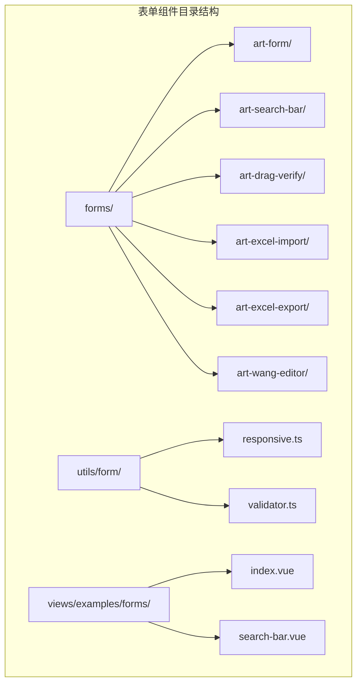
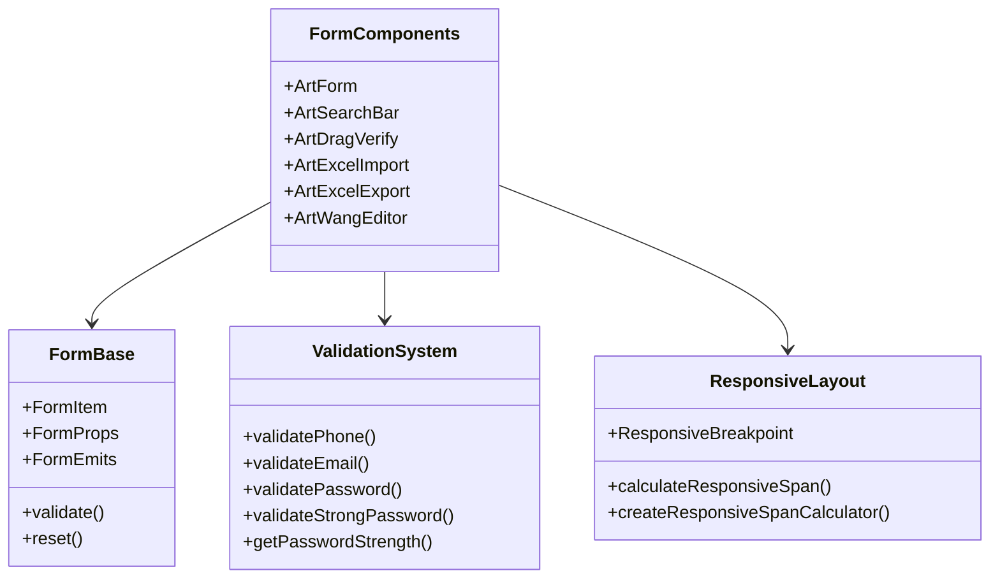
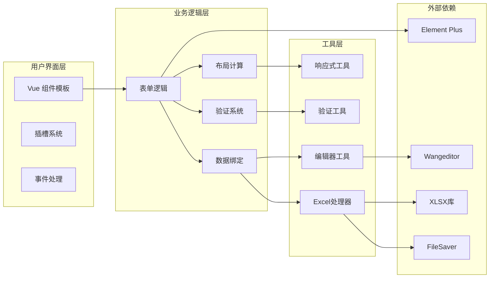
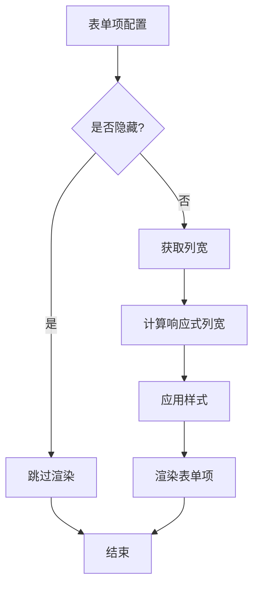
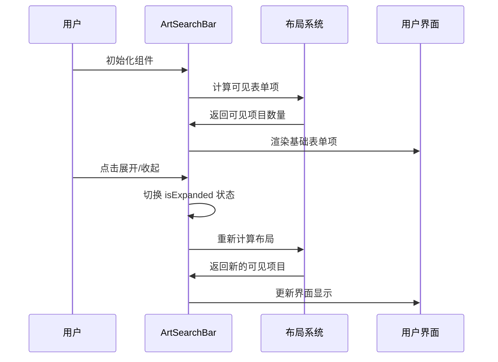
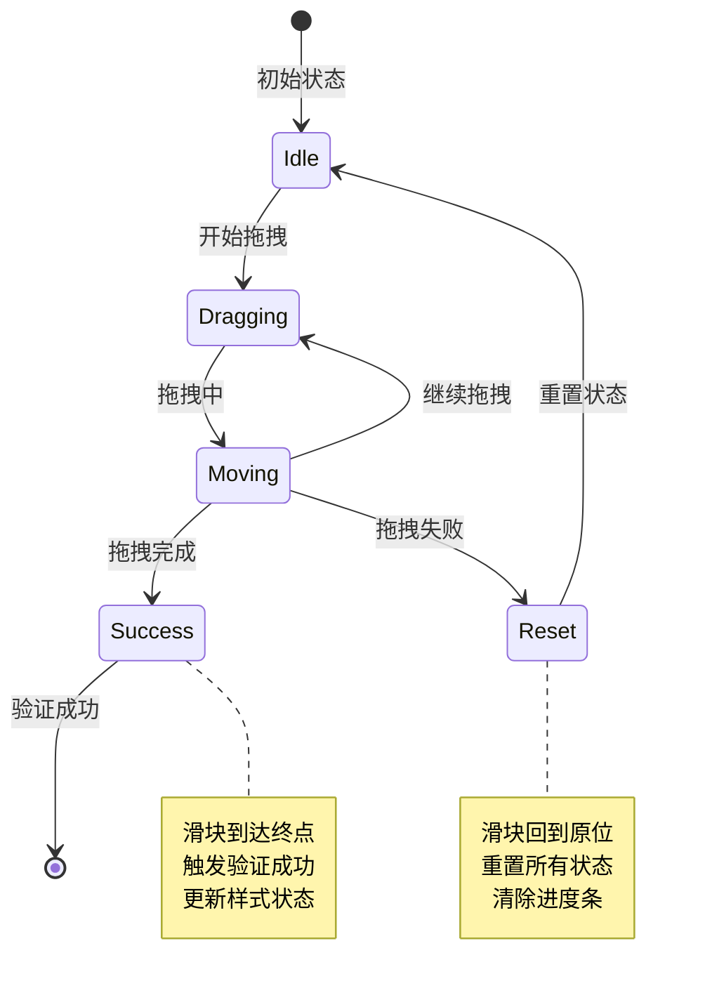
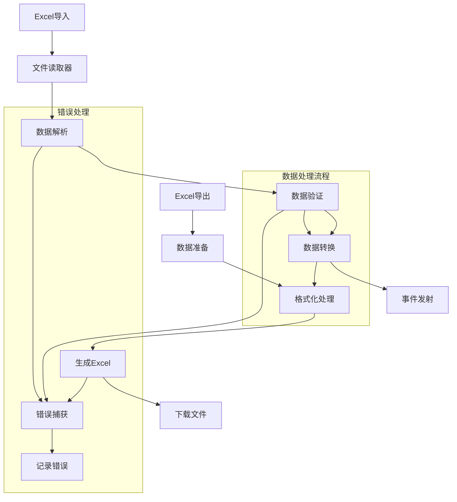
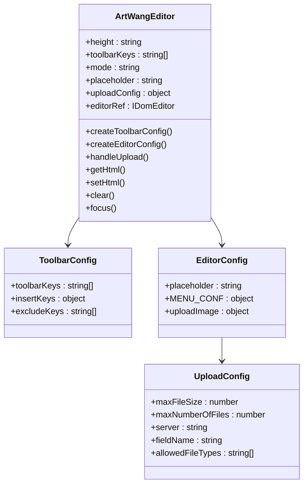
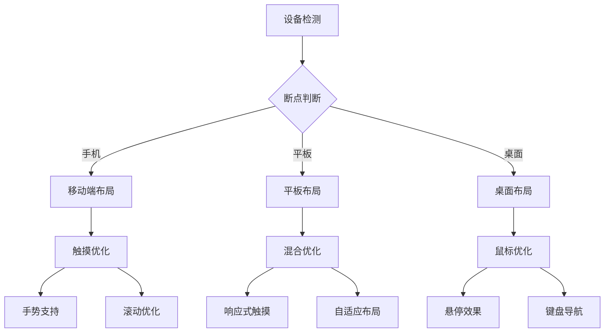

# 表单组件

<cite>
**本文档中引用的文件**
- [art-form/index.vue](file://src/components/core/forms/art-form/index.vue)
- [art-search-bar/index.vue](file://src/components/core/forms/art-search-bar/index.vue)
- [art-drag-verify/index.vue](file://src/components/core/forms/art-drag-verify/index.vue)
- [art-excel-import/index.vue](file://src/components/core/forms/art-excel-import/index.vue)
- [art-excel-export/index.vue](file://src/components/core/forms/art-excel-export/index.vue)
- [art-wang-editor/index.vue](file://src/components/core/forms/art-wang-editor/index.vue)
- [responsive.ts](file://src/utils/form/responsive.ts)
- [validator.ts](file://src/utils/form/validator.ts)
- [index.vue](file://src/views/examples/forms/index.vue)
- [search-bar.vue](file://src/views/examples/forms/search-bar.vue)
</cite>

## 目录
1. [简介](#简介)
2. [项目结构](#项目结构)
3. [核心组件](#核心组件)
4. [架构概览](#架构概览)
5. [详细组件分析](#详细组件分析)
6. [依赖关系分析](#依赖关系分析)
7. [性能考虑](#性能考虑)
8. [故障排除指南](#故障排除指南)
9. [结论](#结论)

## 简介

Art Design Pro 表单组件是一套完整的 Vue 3 表单解决方案，基于 Element Plus 构建，提供了丰富的表单控件、强大的验证机制和优秀的用户体验。该组件库专注于企业级应用开发，具备响应式设计、可访问性支持和移动端适配能力。

### 主要特性

- **多样化表单控件**：支持输入框、选择器、日期选择器、上传组件等
- **智能响应式布局**：基于断点的自适应布局系统
- **强大验证机制**：内置多种验证规则和自定义验证
- **富文本编辑**：集成 Wangeditor 富文本编辑器
- **Excel 处理**：完整的导入导出功能
- **拖拽验证**：安全可靠的拖拽验证组件
- **可访问性设计**：符合 WCAG 标准的无障碍设计

## 项目结构



**图表来源**
- [art-form/index.vue](file://src/components/core/forms/art-form/index.vue#L1-L312)
- [art-search-bar/index.vue](file://src/components/core/forms/art-search-bar/index.vue#L1-L438)
- [responsive.ts](file://src/utils/form/responsive.ts#L1-L123)

**章节来源**
- [art-form/index.vue](file://src/components/core/forms/art-form/index.vue#L1-L312)
- [art-search-bar/index.vue](file://src/components/core/forms/art-search-bar/index.vue#L1-L438)

## 核心组件

### 组件分类体系



**图表来源**
- [art-form/index.vue](file://src/components/core/forms/art-form/index.vue#L152-L176)
- [validator.ts](file://src/utils/form/validator.ts#L1-L317)
- [responsive.ts](file://src/utils/form/responsive.ts#L1-L123)

**章节来源**
- [art-form/index.vue](file://src/components/core/forms/art-form/index.vue#L152-L220)
- [validator.ts](file://src/utils/form/validator.ts#L1-L317)

## 架构概览

### 表单组件架构图



**图表来源**
- [art-form/index.vue](file://src/components/core/forms/art-form/index.vue#L98-L312)
- [art-wang-editor/index.vue](file://src/components/core/forms/art-wang-editor/index.vue#L20-L220)

## 详细组件分析

### ArtForm 表单容器

#### 核心功能特性

ArtForm 是一个功能完整的表单容器组件，支持 Element Plus 的所有表单控件，并提供了丰富的配置选项和插槽系统。

#### 主要配置接口

```typescript
interface FormItem {
  key: string
  label: string | (() => VNode) | Component
  type?: keyof typeof componentMap | string
  render?: (() => VNode) | Component
  hidden?: boolean
  span?: number
  options?: Record<string, any>
  props?: Record<string, any>
  slots?: Record<string, (() => any) | undefined>
  placeholder?: string
}
```

#### 响应式布局系统

组件采用基于 Element Plus Grid 的响应式布局系统：



**图表来源**
- [art-form/index.vue](file://src/components/core/forms/art-form/index.vue#L257-L267)
- [responsive.ts](file://src/utils/form/responsive.ts#L65-L100)

#### 验证与数据绑定机制

表单组件集成了 Element Plus 的验证系统，支持：

- **双向数据绑定**：通过 `v-model` 实现数据同步
- **实时验证**：支持 blur 和 change 触发验证
- **自定义验证规则**：支持复杂业务逻辑验证
- **错误提示**：自动显示验证错误信息

**章节来源**
- [art-form/index.vue](file://src/components/core/forms/art-form/index.vue#L152-L312)

### ArtSearchBar 搜索栏

#### 搜索栏特性

ArtSearchBar 是专为表格搜索设计的高级搜索组件，具备以下特性：

- **智能展开收起**：根据屏幕尺寸自动调整显示数量
- **搜索建议**：支持动态加载选项数据
- **快捷操作**：提供重置和搜索按钮
- **响应式设计**：完美适配各种屏幕尺寸

#### 展开收起逻辑



**图表来源**
- [art-search-bar/index.vue](file://src/components/core/forms/art-search-bar/index.vue#L282-L328)

#### 搜索建议功能

搜索栏支持动态加载选项数据，适用于：

- **远程搜索**：从服务器获取搜索建议
- **本地过滤**：基于已有数据进行筛选
- **异步加载**：支持大数据量的分页加载

**章节来源**
- [art-search-bar/index.vue](file://src/components/core/forms/art-search-bar/index.vue#L159-L438)

### ArtDragVerify 拖拽验证

#### 拖拽验证系统

ArtDragVerify 提供安全可靠的拖拽验证功能，采用渐进式动画和视觉反馈机制。

#### 核心技术实现



**图表来源**
- [art-drag-verify/index.vue](file://src/components/core/forms/art-drag-verify/index.vue#L232-L328)

#### 安全验证机制

拖拽验证组件实现了多层次的安全保护：

- **防自动化检测**：通过随机延迟和动画效果
- **边界检测**：精确的拖拽范围判断
- **状态管理**：完整的验证状态跟踪
- **事件处理**：支持鼠标和触摸事件

**章节来源**
- [art-drag-verify/index.vue](file://src/components/core/forms/art-drag-verify/index.vue#L1-L431)

### Excel 导入导出组件

#### Excel 处理架构



**图表来源**
- [art-excel-import/index.vue](file://src/components/core/forms/art-excel-import/index.vue#L1-L63)
- [art-excel-export/index.vue](file://src/components/core/forms/art-excel-export/index.vue#L1-L390)

#### 导入功能特性

Excel 导入组件支持：

- **文件格式**：支持 `.xlsx` 和 `.xls` 格式
- **数据解析**：自动识别工作表和列结构
- **错误处理**：完善的异常捕获和错误提示
- **事件通知**：导入成功和失败事件

#### 导出功能特性

Excel 导出组件提供：

- **灵活配置**：支持自定义列配置和格式化
- **大数据处理**：支持百万级数据导出
- **性能优化**：使用虚拟滚动和分批处理
- **样式定制**：支持复杂的单元格样式

**章节来源**
- [art-excel-import/index.vue](file://src/components/core/forms/art-excel-import/index.vue#L1-L63)
- [art-excel-export/index.vue](file://src/components/core/forms/art-excel-export/index.vue#L1-L390)

### ArtWangEditor 富文本编辑器

#### 富文本编辑器架构



**图表来源**
- [art-wang-editor/index.vue](file://src/components/core/forms/art-wang-editor/index.vue#L31-L220)

#### 自定义配置系统

富文本编辑器支持深度自定义：

- **工具栏配置**：完全自定义工具栏布局
- **菜单配置**：自定义右键菜单和工具栏菜单
- **上传配置**：支持自定义文件上传逻辑
- **主题定制**：支持深色模式和自定义主题

**章节来源**
- [art-wang-editor/index.vue](file://src/components/core/forms/art-wang-editor/index.vue#L1-L220)

## 依赖关系分析

### 组件依赖图

```mermaid
graph TD
subgraph "核心依赖"
Vue[Vue 3]
ElementPlus[Element Plus]
TypeScript[TypeScript]
end
subgraph "工具库"
XLSX[xlsx.js]
FileSaver[file-saver]
Wangeditor[wangeditor]
VueUse[@vueuse/core]
end
subgraph "表单组件"
ArtForm[ArtForm]
ArtSearchBar[ArtSearchBar]
ArtDragVerify[ArtDragVerify]
ArtExcelImport[ArtExcelImport]
ArtExcelExport[ArtExcelExport]
ArtWangEditor[ArtWangEditor]
end
subgraph "工具模块"
Responsive[responsive.ts]
Validator[validator.ts]
end
Vue --> ArtForm
Vue --> ArtSearchBar
Vue --> ArtDragVerify
Vue --> ArtExcelImport
Vue --> ArtExcelExport
Vue --> ArtWangEditor
ElementPlus --> ArtForm
ElementPlus --> ArtSearchBar
XLSX --> ArtExcelImport
XLSX --> ArtExcelExport
FileSaver --> ArtExcelExport
Wangeditor --> ArtWangEditor
VueUse --> ArtForm
VueUse --> ArtSearchBar
VueUse --> ArtDragVerify
Responsive --> ArtForm
Responsive --> ArtSearchBar
Validator --> ArtForm
Validator --> ArtSearchBar
```

**图表来源**
- [art-form/index.vue](file://src/components/core/forms/art-form/index.vue#L99-L119)
- [art-excel-import/index.vue](file://src/components/core/forms/art-excel-import/index.vue#L17-L20)
- [art-excel-export/index.vue](file://src/components/core/forms/art-excel-export/index.vue#L21-L25)

### 外部依赖管理

组件库对外部依赖的管理遵循以下原则：

- **最小化依赖**：只引入必要的第三方库
- **版本锁定**：使用精确的版本号避免兼容性问题
- **按需加载**：支持 Tree Shaking 减少打包体积
- **类型安全**：提供完整的 TypeScript 类型定义

**章节来源**
- [art-form/index.vue](file://src/components/core/forms/art-form/index.vue#L99-L119)
- [art-excel-import/index.vue](file://src/components/core/forms/art-excel-import/index.vue#L17-L20)

## 性能考虑

### 响应式性能优化

表单组件采用了多种性能优化策略：

#### 1. 响应式布局优化

- **断点缓存**：缓存计算结果避免重复计算
- **懒加载**：延迟渲染非关键内容
- **虚拟滚动**：处理大量选项时的性能优化

#### 2. 数据处理优化

- **防抖处理**：输入验证和搜索建议的防抖
- **批量更新**：减少不必要的 DOM 更新
- **内存管理**：及时清理事件监听器和定时器

#### 3. 渲染性能优化

- **组件缓存**：合理使用 `keep-alive`
- **计算属性**：利用 Vue 的响应式系统
- **事件委托**：减少事件监听器数量

### 移动端适配策略



**图表来源**
- [responsive.ts](file://src/utils/form/responsive.ts#L21-L61)

## 故障排除指南

### 常见问题及解决方案

#### 1. 表单验证问题

**问题**：验证规则不生效
**解决方案**：
- 检查 `v-model` 绑定是否正确
- 确认验证规则格式是否符合 Element Plus 要求
- 验证 `ref` 引用是否正确获取

#### 2. 响应式布局问题

**问题**：表单项在小屏幕下显示异常
**解决方案**：
- 检查 `span` 配置是否合理
- 验证断点配置是否正确
- 确认 `gutter` 设置是否合适

#### 3. Excel 导入导出问题

**问题**：Excel 文件处理失败
**解决方案**：
- 检查文件格式是否支持
- 验证文件大小是否超出限制
- 确认浏览器兼容性

#### 4. 富文本编辑器问题

**问题**：编辑器初始化失败
**解决方案**：
- 检查 Wangeditor 版本兼容性
- 验证上传配置是否正确
- 确认网络连接状态

**章节来源**
- [art-form/index.vue](file://src/components/core/forms/art-form/index.vue#L280-L310)
- [art-excel-import/index.vue](file://src/components/core/forms/art-excel-import/index.vue#L52-L62)

## 结论

Art Design Pro 表单组件库提供了一套完整的企业级表单解决方案。通过模块化的架构设计、丰富的功能特性和优秀的性能表现，该组件库能够满足各种复杂的业务需求。

### 主要优势

1. **功能完整性**：涵盖表单开发的各种场景需求
2. **易用性**：简洁的 API 设计和丰富的配置选项
3. **性能优化**：针对大数据量和复杂交互的优化
4. **可维护性**：清晰的代码结构和完善的文档
5. **可扩展性**：良好的插件机制和自定义能力

### 最佳实践建议

1. **合理使用响应式配置**：根据目标用户群体选择合适的断点
2. **优化验证逻辑**：避免过于复杂的验证规则影响性能
3. **注重用户体验**：提供清晰的错误提示和加载状态
4. **关注可访问性**：确保组件符合 WCAG 标准
5. **定期更新依赖**：保持第三方库的最新版本

这套表单组件库不仅提供了强大的功能，更重要的是建立了一个可扩展、可维护的开发框架，为企业级应用开发奠定了坚实的基础。