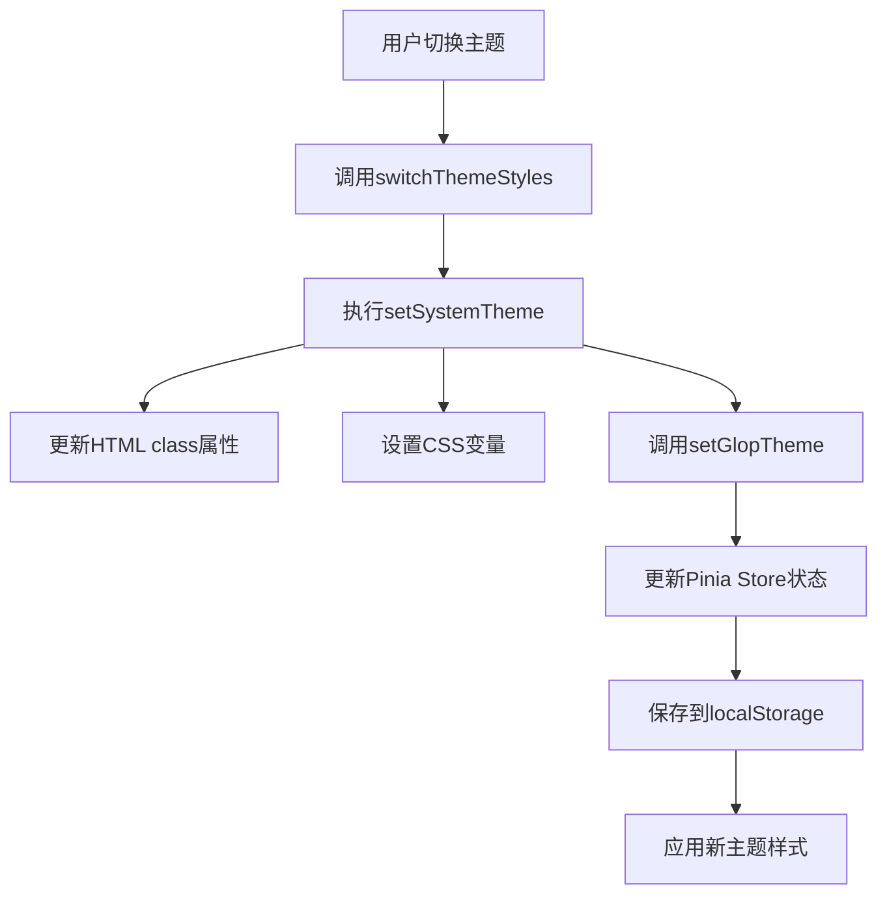

# 主题切换

<cite>
**本文档引用的文件**  
- [useTheme.ts](file://src/hooks/core/useTheme.ts)
- [setting.ts](file://src/store/modules/setting.ts)
- [setting.ts](file://src/config/setting.ts)
- [index.ts](file://src/config/index.ts)
- [appEnum.ts](file://src/enums/appEnum.ts)
- [theme-change.scss](file://src/assets/styles/core/theme-change.scss)
- [dark.scss](file://src/assets/styles/core/dark.scss)
- [el-dark.scss](file://src/assets/styles/core/el-dark.scss)
- [el-light.scss](file://src/assets/styles/core/el-light.scss)
</cite>

## 目录
1. [简介](#简介)
2. [核心组件](#核心组件)
3. [主题切换逻辑](#主题切换逻辑)
4. [自动主题模式](#自动主题模式)
5. [过渡效果优化](#过渡效果优化)
6. [HTML类属性更新机制](#html类属性更新机制)
7. [主题状态持久化](#主题状态持久化)
8. [组件中调用主题切换](#组件中调用主题切换)
9. [AppConfig.systemThemeStyles配置](#appconfigsystemthemestyles配置)

## 简介
本项目实现了完整的主题管理系统，支持亮色、暗色和自动三种主题模式。系统通过组合式函数`useTheme`提供主题切换功能，结合Pinia状态管理实现主题状态的持久化存储，并利用CSS变量和HTML类属性动态更新界面样式。主题切换过程中采用优化策略避免视觉闪烁，确保用户体验流畅。

## 核心组件

主题切换功能主要由以下几个核心组件构成：
- `useTheme`组合式函数：提供主题切换的核心逻辑和API
- `settingStore`：使用Pinia管理主题相关状态
- `AppConfig`：全局配置对象，定义主题样式映射
- CSS样式文件：定义不同主题下的视觉样式

**组件来源**
- [useTheme.ts](file://src/hooks/core/useTheme.ts#L42-L124)
- [setting.ts](file://src/store/modules/setting.ts#L47-L450)
- [index.ts](file://src/config/index.ts#L38-L135)

## 主题切换逻辑

主题切换的核心逻辑由`useTheme`组合式函数中的`switchThemeStyles`方法实现。该方法根据传入的主题类型参数，调用`setSystemTheme`或`setSystemAutoTheme`方法进行实际的主题设置。

`setSystemTheme`方法执行以下操作：
1. 临时禁用CSS过渡效果，防止切换时的视觉闪烁
2. 获取HTML根元素并更新其class属性以应用新的主题样式
3. 根据当前主题色生成9个层级的明暗变体，并设置为CSS变量
4. 更新Pinia store中的主题状态
5. 在下一帧重新启用CSS过渡效果

**逻辑来源**
- [useTheme.ts](file://src/hooks/core/useTheme.ts#L61-L98)

## 自动主题模式

自动主题模式通过`usePreferredDark`（来自VueUse库）检测用户的系统偏好设置。当用户选择自动模式时，系统会根据操作系统当前的亮色/暗色设置自动切换应用主题。

`setSystemAutoTheme`方法读取`prefersDark`的响应式值，如果系统偏好为暗色则应用暗色主题，否则应用亮色主题。在应用初始化时，系统会根据当前设置的主题模式决定是否监听系统主题变化，只有在自动模式下才会响应系统主题的改变。

**自动模式来源**
- [useTheme.ts](file://src/hooks/core/useTheme.ts#L100-L107)
- [useTheme.ts](file://src/hooks/core/useTheme.ts#L133-L169)

## 过渡效果优化

为了防止主题切换时出现视觉闪烁，系统采用了特殊的优化策略。在主题切换过程中，会临时禁用所有CSS过渡效果，确保样式变化立即生效而不会产生中间状态的动画。

具体实现方式是通过`disableTransitions`方法动态创建一个ID为`disable-transitions`的style标签，其中包含`* { transition: none !important; }`的CSS规则，强制禁用所有元素的过渡效果。在主题切换完成后，使用`requestAnimationFrame`在下一帧调用`enableTransitions`方法移除该style标签，恢复正常的过渡效果。

这种双重`requestAnimationFrame`的使用确保了样式变更在浏览器渲染管道中的正确时机执行，避免了潜在的渲染问题。

**优化策略来源**
- [useTheme.ts](file://src/hooks/core/useTheme.ts#L45-L59)
- [useTheme.ts](file://src/hooks/core/useTheme.ts#L63-L65)
- [useTheme.ts](file://src/hooks/core/useTheme.ts#L92-L97)
- [theme-change.scss](file://src/assets/styles/core/theme-change.scss#L1-L11)

## HTML类属性更新机制

主题切换时，系统通过修改HTML根元素的class属性来触发不同主题样式的应用。`setSystemTheme`方法获取文档中的HTML元素，并根据当前主题类型设置相应的class名称。

在`AppConfig.systemThemeStyles`配置中，定义了不同主题对应的class名称：
- 亮色主题：空字符串（无特殊class）
- 暗色主题：`dark`
- 自动模式：根据系统偏好动态决定

当HTML元素的class属性被更新后，CSS选择器会匹配相应的主题样式规则，从而实现整个应用界面的视觉变化。这种基于class的机制简单高效，能够快速应用全局样式变更。

**更新机制来源**
- [useTheme.ts](file://src/hooks/core/useTheme.ts#L66-L68)
- [useTheme.ts](file://src/hooks/core/useTheme.ts#L76-L77)
- [index.ts](file://src/config/index.ts#L44-L47)

## 主题状态持久化

主题状态通过Pinia store进行管理，并实现了持久化存储。`settingStore`中的`systemThemeType`和`systemThemeMode`状态分别记录当前应用的主题类型和主题模式。

`setGlopTheme`方法不仅更新内存中的状态，还会将主题设置保存到localStorage中，确保用户刷新页面或重新打开应用时能够恢复之前的主题选择。Pinia的持久化插件配置确保了store状态的自动保存和恢复。



**持久化来源**
- [setting.ts](file://src/store/modules/setting.ts#L62-L64)
- [setting.ts](file://src/store/modules/setting.ts#L183-L187)
- [setting.ts](file://src/store/modules/setting.ts#L444-L449)

## 组件中调用主题切换

在Vue组件中，可以通过导入`useTheme`组合式函数来调用主题切换功能。典型的使用方式如下：

```typescript
import { useTheme } from '@/hooks/core/useTheme'

export default {
  setup() {
    const { switchThemeStyles } = useTheme()
    
    const changeToDark = () => {
      switchThemeStyles(SystemThemeEnum.DARK)
    }
    
    const changeToLight = () => {
      switchThemeStyles(SystemThemeEnum.LIGHT)
    }
    
    const changeToAuto = () => {
      switchThemeStyles(SystemThemeEnum.AUTO)
    }
    
    return {
      changeToDark,
      changeToLight,
      changeToAuto
    }
  }
}
```

组件可以通过按钮或其他交互元素绑定这些方法，实现用户界面的主题切换控制。

**调用示例来源**
- [useTheme.ts](file://src/hooks/core/useTheme.ts#L18-L27)

## AppConfig.systemThemeStyles配置

`AppConfig.systemThemeStyles`是定义主题样式映射的配置对象，位于全局配置文件中。该配置对象将主题枚举值映射到具体的样式类名称，为主题切换提供必要的样式信息。

配置结构如下：
```typescript
systemThemeStyles: {
  [SystemThemeEnum.LIGHT]: { className: '' },
  [SystemThemeEnum.DARK]: { className: SystemThemeEnum.DARK }
}
```

这个配置对象被`setSystemTheme`方法用来确定在切换到特定主题时应该应用哪个CSS类。通过集中管理主题样式映射，系统实现了主题配置的可维护性和可扩展性。

**配置来源**
- [index.ts](file://src/config/index.ts#L44-L47)
- [useTheme.ts](file://src/hooks/core/useTheme.ts#L73-L76)