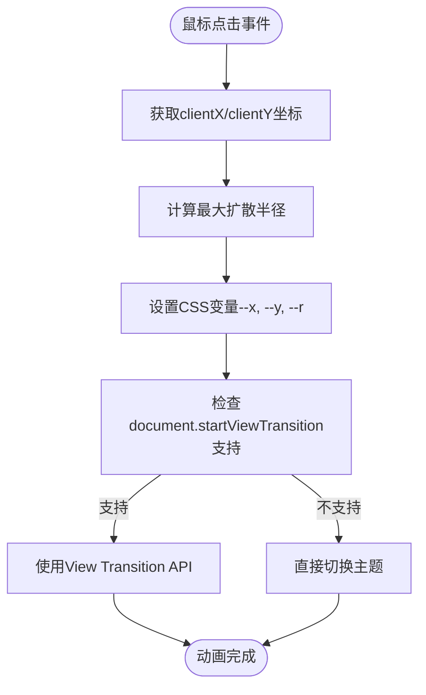
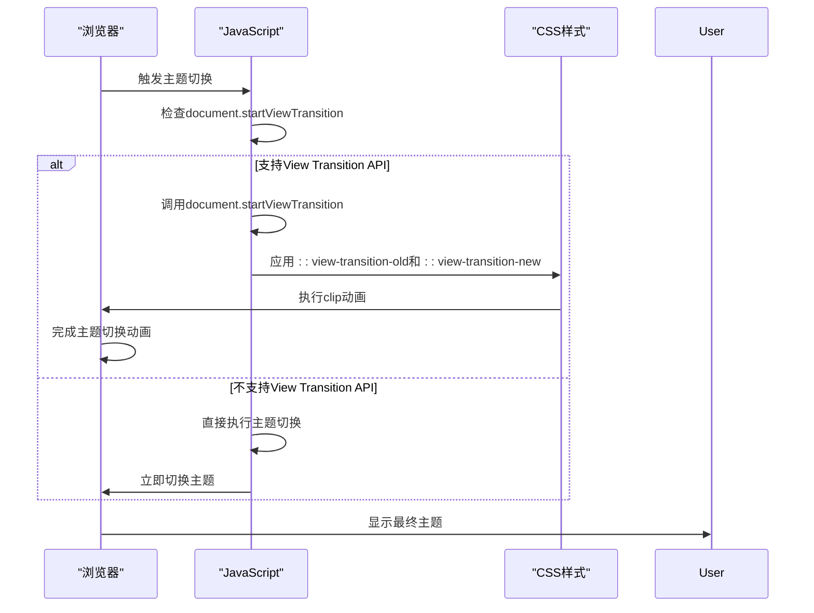
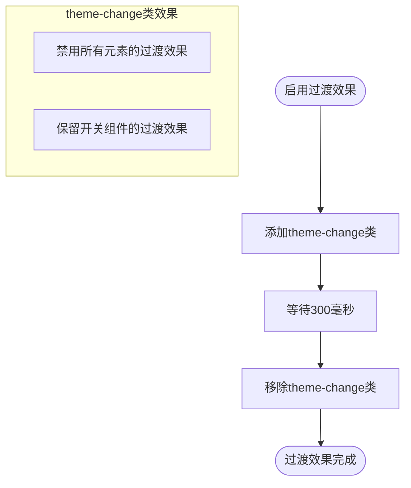

# 主题动画

<cite>
**本文档引用的文件**
- [animation.ts](file://src/utils/ui/animation.ts)
- [theme-animation.scss](file://src/assets/styles/core/theme-animation.scss)
- [theme-change.scss](file://src/assets/styles/core/theme-change.scss)
- [useTheme.ts](file://src/hooks/core/useTheme.ts)
- [AuthTopBar.vue](file://src/components/core/views/login/AuthTopBar.vue)
</cite>

## 目录
1. [简介](#简介)
2. [主题动画实现原理](#主题动画实现原理)
3. [View Transition API 渐进式增强](#view-transition-api-渐进式增强)
4. [过渡效果控制](#过渡效果控制)
5. [用户体验价值](#用户体验价值)
6. [自定义扩展建议](#自定义扩展建议)

## 简介
主题动画系统为应用程序提供了流畅的视觉体验，通过基于鼠标点击位置的圆形扩散动画和View Transition API实现主题切换的平滑过渡。该系统不仅提升了用户界面的美观性，还通过渐进式增强策略确保在不同浏览器环境下的兼容性。

**Section sources**
- [animation.ts](file://src/utils/ui/animation.ts#L1-L29)

## 主题动画实现原理
主题动画系统的核心是`themeAnimation`函数，它通过计算鼠标点击事件的坐标(clientX/clientY)来确定动画的起始位置和最大扩散半径。系统使用CSS变量--x、--y和--r来传递这些值，从而实现从点击点开始的圆形扩散效果。

**Diagram sources**
- [animation.ts](file://src/utils/ui/animation.ts#L40-L56)
- [theme-animation.scss](file://src/assets/styles/core/theme-animation.scss#L50-L58)

**Section sources**
- [animation.ts](file://src/utils/ui/animation.ts#L40-L49)

## View Transition API 渐进式增强
主题动画系统采用了View Transition API的渐进式增强策略，确保在现代浏览器中提供流畅的页面过渡动画，同时在不支持的浏览器中优雅降级为直接切换。

**Diagram sources**
- [animation.ts](file://src/utils/ui/animation.ts#L51-L55)
- [theme-animation.scss](file://src/assets/styles/core/theme-animation.scss#L14-L47)

**Section sources**
- [animation.ts](file://src/utils/ui/animation.ts#L51-L55)
- [theme-animation.scss](file://src/assets/styles/core/theme-animation.scss#L14-L47)

## 过渡效果控制
`toggleTransition`函数通过添加和移除theme-change CSS类来控制全局过渡效果。系统使用setTimeout延迟300毫秒移除类名，确保动画效果完整执行，避免因立即移除类名导致的视觉闪烁。

**Diagram sources**
- [animation.ts](file://src/utils/ui/animation.ts#L70-L79)
- [theme-change.scss](file://src/assets/styles/core/theme-change.scss#L2-L11)

**Section sources**
- [animation.ts](file://src/utils/ui/animation.ts#L70-L79)
- [theme-change.scss](file://src/assets/styles/core/theme-change.scss#L2-L11)

## 用户体验价值
主题动画系统在用户体验方面具有重要价值。点击反馈动画为用户提供了直观的交互确认，增强了操作的可感知性。页面刷新时的平滑过渡效果避免了突兀的视觉变化，提升了整体的流畅感和专业性。

**Section sources**
- [animation.ts](file://src/utils/ui/animation.ts#L8-L18)

## 自定义扩展建议
开发者可以通过修改SCSS文件中的CSS变量和动画参数来自定义动画样式。建议保持动画持续时间在0.3-0.6秒之间以获得最佳用户体验，并确保在暗色和亮色主题间有足够对比度的背景色。

**Section sources**
- [theme-animation.scss](file://src/assets/styles/core/theme-animation.scss#L1-L64)
- [theme-change.scss](file://src/assets/styles/core/theme-change.scss#L1-L12)