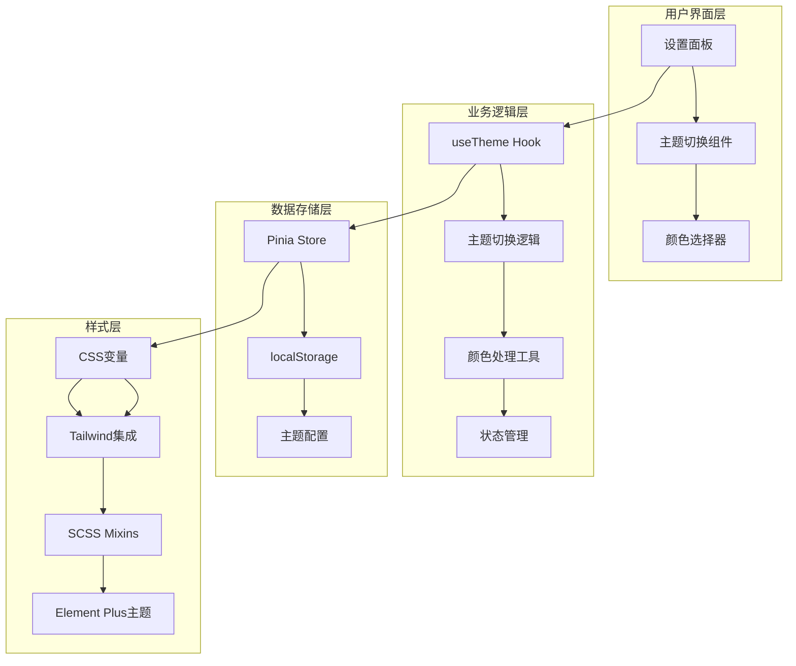
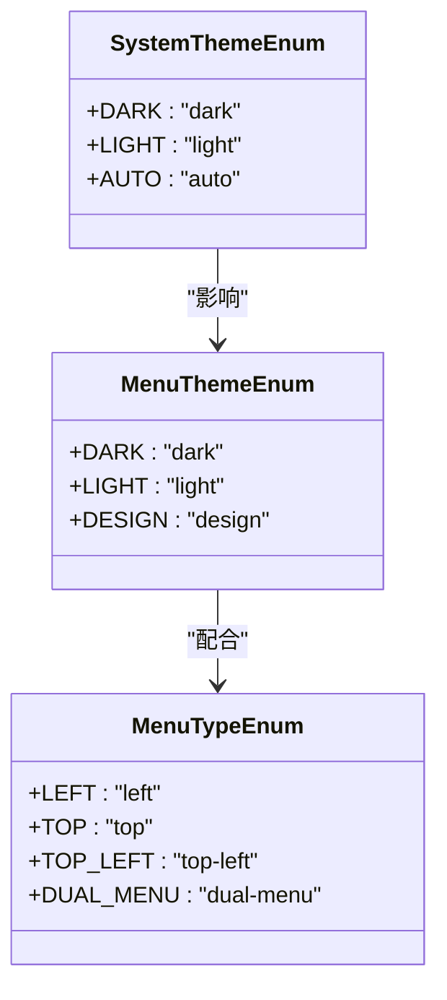
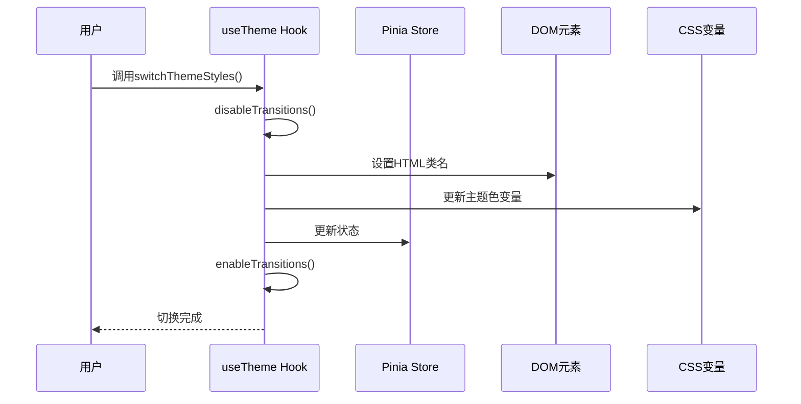
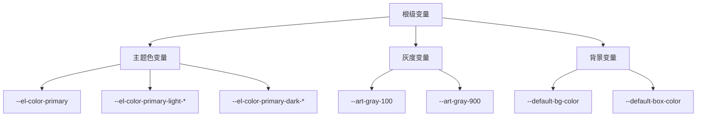
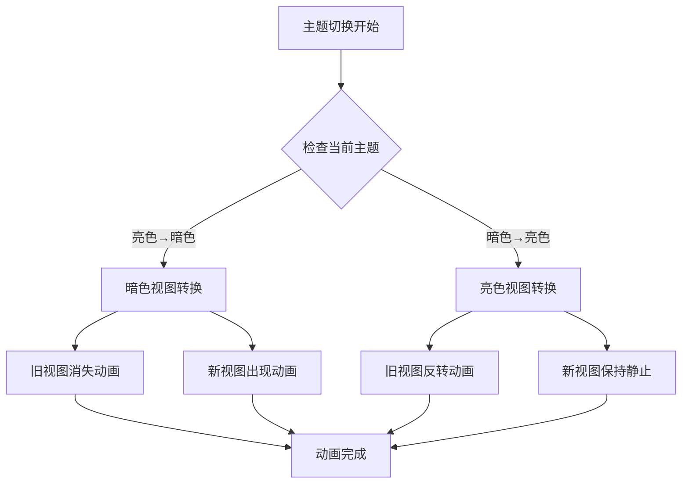
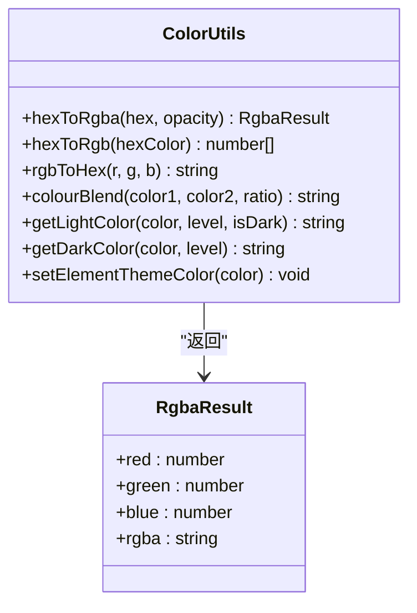
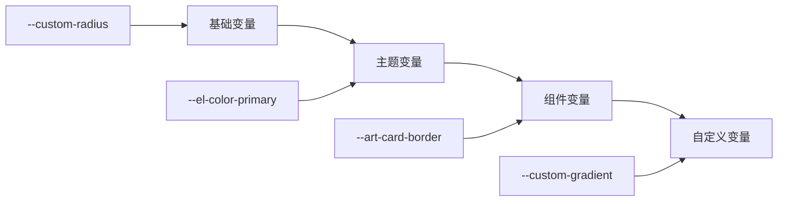
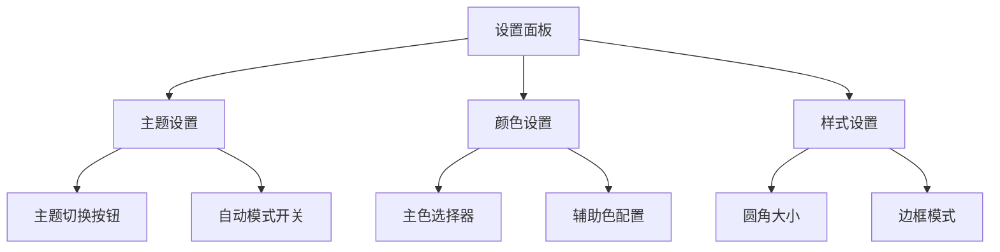

# 主题系统

<cite>
**本文档中引用的文件**
- [useTheme.ts](file://src/hooks/core/useTheme.ts)
- [colors.ts](file://src/utils/ui/colors.ts)
- [appEnum.ts](file://src/enums/appEnum.ts)
- [setting.ts](file://src/store/modules/setting.ts)
- [theme-change.scss](file://src/assets/styles/core/theme-change.scss)
- [theme-animation.scss](file://src/assets/styles/core/theme-animation.scss)
- [dark.scss](file://src/assets/styles/core/dark.scss)
- [tailwind.css](file://src/assets/styles/core/tailwind.css)
- [mixin.scss](file://src/assets/styles/core/mixin.scss)
- [index.ts](file://src/config/index.ts)
- [setting.ts](file://src/config/setting.ts)
- [ThemeSettings.vue](file://src/components/core/layouts/art-settings-panel/widget/ThemeSettings.vue)
- [ColorSettings.vue](file://src/components/core/layouts/art-settings-panel/widget/ColorSettings.vue)
- [theme-svg/index.vue](file://src/components/core/theme/theme-svg/index.vue)
</cite>

## 目录
1. [简介](#简介)
2. [系统架构](#系统架构)
3. [核心组件分析](#核心组件分析)
4. [主题切换机制](#主题切换机制)
5. [CSS变量系统](#css变量系统)
6. [主题动画实现](#主题动画实现)
7. [自定义主题色](#自定义主题色)
8. [useTheme组合式函数](#usetheme组合式函数)
9. [SCSS变量扩展](#scss变量扩展)
10. [用户交互模式](#用户交互模式)
11. [性能优化技巧](#性能优化技巧)
12. [最佳实践](#最佳实践)

## 简介

Art Design Pro的主题系统是一个功能完整、高度可定制的现代化主题管理解决方案。该系统支持亮色、暗色和自动三种主题模式，提供了丰富的自定义选项，包括主题色、圆角、边框等样式配置。系统采用CSS变量驱动的设计理念，结合Vue组合式API和Pinia状态管理，实现了流畅的主题切换体验。

### 主要特性

- **多主题模式支持**：亮色、暗色、自动跟随系统
- **动态主题色**：支持16种渐变色系和自定义主题色
- **平滑过渡动画**：优化的切换效果，避免闪烁
- **持久化存储**：主题设置自动保存到localStorage
- **响应式设计**：完全支持移动端和桌面端
- **组件级主题适配**：所有组件自动适配当前主题

## 系统架构

主题系统采用分层架构设计，从底层的CSS变量到上层的Vue组件，形成了完整的主题管理体系。



**图表来源**
- [useTheme.ts](file://src/hooks/core/useTheme.ts#L42-L123)
- [setting.ts](file://src/store/modules/setting.ts#L47-L451)
- [tailwind.css](file://src/assets/styles/core/tailwind.css#L1-L150)

## 核心组件分析

### 主题枚举定义

系统通过枚举类型定义了三种主要的主题模式：



**图表来源**
- [appEnum.ts](file://src/enums/appEnum.ts#L34-L40)
- [appEnum.ts](file://src/enums/appEnum.ts#L47-L52)
- [appEnum.ts](file://src/enums/appEnum.ts#L21-L28)

### 配置系统

主题系统的核心配置位于全局配置文件中，定义了主题样式映射、颜色方案和菜单布局：

| 配置项 | 类型 | 默认值 | 说明 |
|--------|------|--------|------|
| systemThemeStyles | Object | {light: {}, dark: {}} | 主题样式类名映射 |
| systemMainColor | Array | ['#5D87FF', ...] | 预设主色列表 |
| settingThemeList | Array | [...] | 可选主题列表 |
| themeList | Array | [...] | 菜单主题样式列表 |

**章节来源**
- [index.ts](file://src/config/index.ts#L44-L73)
- [index.ts](file://src/config/index.ts#L120-L128)

## 主题切换机制

### 切换流程

主题切换采用多阶段处理机制，确保切换过程的流畅性和一致性：



**图表来源**
- [useTheme.ts](file://src/hooks/core/useTheme.ts#L61-L97)

### 过渡效果优化

系统实现了智能的过渡效果管理，避免主题切换时的视觉闪烁：

1. **临时禁用过渡**：创建临时style元素禁用所有过渡效果
2. **原子性操作**：在单帧内完成所有DOM变更
3. **延迟恢复**：使用requestAnimationFrame确保下一帧恢复过渡

**章节来源**
- [useTheme.ts](file://src/hooks/core/useTheme.ts#L45-L59)
- [theme-change.scss](file://src/assets/styles/core/theme-change.scss#L1-L12)

## CSS变量系统

### 变量层次结构

主题系统采用分层的CSS变量体系，支持明暗模式的自动适配：



**图表来源**
- [tailwind.css](file://src/assets/styles/core/tailwind.css#L5-L84)

### Tailwind集成

系统与Tailwind CSS深度集成，提供了完整的主题变量支持：

| 变量类别 | CSS变量 | 用途 |
|----------|---------|------|
| 主题色 | --art-primary, --art-secondary | 语义化颜色标识 |
| 灰度色 | --art-gray-100 ~ --art-gray-900 | 文本和边框颜色 |
| 背景色 | --default-bg-color, --default-box-color | 页面和卡片背景 |
| 悬停色 | --art-hover-color, --art-active-color | 交互状态颜色 |

**章节来源**
- [tailwind.css](file://src/assets/styles/core/tailwind.css#L86-L122)

## 主题动画实现

### 视图转换动画

系统实现了基于CSS视图转换的新一代主题切换动画：



**图表来源**
- [theme-animation.scss](file://src/assets/styles/core/theme-animation.scss#L14-L46)

### 动画配置

| 参数 | 值 | 说明 |
|------|-----|------|
| bg-animation-color-light | #000 | 亮色主题背景色 |
| bg-animation-color-dark | #fff | 暗色主题背景色 |
| bg-animation-duration | 0.5s | 动画持续时间 |
| clip-path | circle(0% at var(--x) var(--y)) | 裁剪路径动画 |

**章节来源**
- [theme-animation.scss](file://src/assets/styles/core/theme-animation.scss#L1-L64)

## 自定义主题色

### 颜色处理工具

系统提供了完整的颜色处理工具集，支持多种颜色格式和变换：



**图表来源**
- [colors.ts](file://src/utils/ui/colors.ts#L49-L54)
- [colors.ts](file://src/utils/ui/colors.ts#L261-L273)

### 主题色生成机制

系统为每个主题色生成9个明暗变体，形成完整的色彩梯度：

1. **主色设置**：设置`--el-color-primary`为主色调
2. **变体生成**：生成9个亮度递增的变体（light-1到light-9）
3. **深色变体**：生成9个亮度递减的变体（dark-1到dark-9）
4. **自定义色**：生成15个渐变色用于特殊场景

**章节来源**
- [colors.ts](file://src/utils/ui/colors.ts#L239-L273)

## useTheme组合式函数

### API接口

`useTheme`组合式函数提供了完整的主题管理API：

```typescript
interface UseThemeReturn {
  setSystemTheme: (theme: SystemThemeEnum, themeMode?: SystemThemeEnum) => void
  setSystemAutoTheme: () => void
  switchThemeStyles: (theme: SystemThemeEnum) => void
  prefersDark: Ref<boolean>
}
```

### 方法详解

| 方法 | 参数 | 返回值 | 说明 |
|------|------|--------|------|
| switchThemeStyles | theme: SystemThemeEnum | void | 切换指定主题 |
| setSystemTheme | theme, themeMode? | void | 设置系统主题 |
| setSystemAutoTheme | - | void | 设置自动跟随系统主题 |
| prefersDark | - | Ref<boolean> | 系统暗色偏好响应式引用 |

### 使用示例

```typescript
// 基本使用
const { switchThemeStyles } = useTheme()

// 切换到暗色主题
switchThemeStyles(SystemThemeEnum.DARK)

// 切换到自动模式
switchThemeStyles(SystemThemeEnum.AUTO)
```

**章节来源**
- [useTheme.ts](file://src/hooks/core/useTheme.ts#L118-L123)

## SCSS变量扩展

### 自定义变量系统

系统提供了灵活的SCSS变量扩展机制，支持主题级别的样式定制：



**图表来源**
- [mixin.scss](file://src/assets/styles/core/mixin.scss#L125-L131)

### 混合宏系统

系统提供了丰富的SCSS混合宏，简化了常见样式的编写：

| 混合宏 | 参数 | 功能 |
|--------|------|------|
| ellipsis | rowCount: number | 文本溢出省略 |
| absoluteCenter | - | 绝对定位居中 |
| animation | from, to, name, animate | CSS动画定义 |
| circle | size, bg | 圆形样式 |
| backdropBlur | - | 背景模糊效果 |

**章节来源**
- [mixin.scss](file://src/assets/styles/core/mixin.scss#L7-L158)

## 用户交互模式

### 设置面板集成

主题系统与设置面板深度集成，提供了直观的用户界面：



**图表来源**
- [ThemeSettings.vue](file://src/components/core/layouts/art-settings-panel/widget/ThemeSettings.vue#L1-L29)
- [ColorSettings.vue](file://src/components/core/layouts/art-settings-panel/widget/ColorSettings.vue#L1-L35)

### 实时预览

系统支持实时主题预览，用户可以在不保存的情况下预览主题效果：

1. **即时切换**：点击主题按钮立即生效
2. **预览状态**：保持当前设置不变直到确认
3. **撤销机制**：支持快速恢复到之前的状态

## 性能优化技巧

### 渲染优化

系统采用了多种性能优化策略：

1. **批量DOM操作**：将多个DOM变更合并为单次操作
2. **防抖处理**：避免频繁的主题切换导致的性能问题
3. **懒加载**：按需加载主题资源
4. **内存管理**：及时清理临时创建的DOM元素

### 存储优化

主题配置采用高效的存储策略：

- **增量更新**：只保存变更的配置项
- **压缩存储**：对大型配置对象进行压缩
- **版本兼容**：支持配置升级和迁移

**章节来源**
- [useTheme.ts](file://src/hooks/core/useTheme.ts#L61-L97)

## 最佳实践

### 主题一致性

为了确保整个应用的主题一致性，建议遵循以下原则：

1. **统一变量命名**：使用系统提供的标准变量名
2. **渐进增强**：优先使用CSS变量，必要时提供降级方案
3. **组件封装**：将主题相关的样式封装到组件内部
4. **测试覆盖**：在不同主题下充分测试组件表现

### 扩展开发

当需要扩展主题系统时，推荐的做法：

1. **继承现有变量**：基于系统变量创建新的变量
2. **遵循命名规范**：使用清晰的变量命名约定
3. **文档化变更**：为新增的变量和功能编写文档
4. **向后兼容**：确保新功能不影响现有主题

### 调试技巧

主题系统的调试可以通过以下方式进行：

1. **浏览器开发者工具**：检查CSS变量的实际值
2. **Vue DevTools**：监控主题状态的变化
3. **控制台输出**：打印主题切换的相关信息
4. **截图对比**：比较不同主题下的视觉效果

通过遵循这些最佳实践，可以确保主题系统的稳定性和可维护性，同时为用户提供优秀的主题体验。