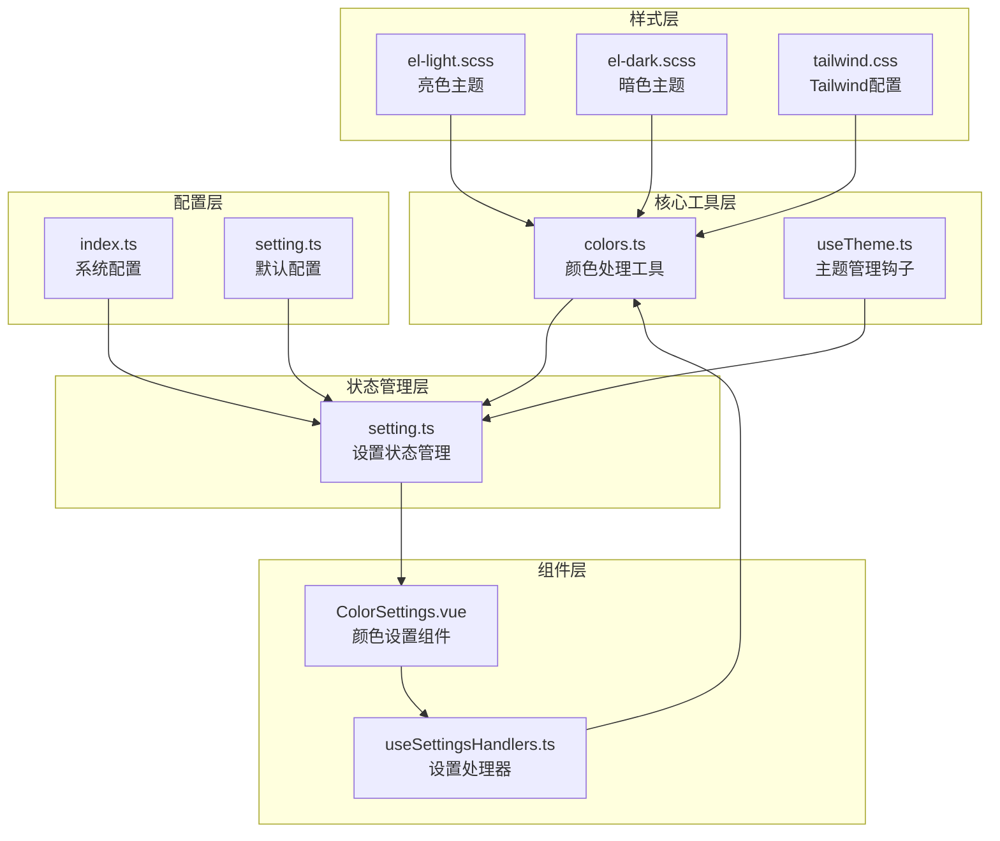
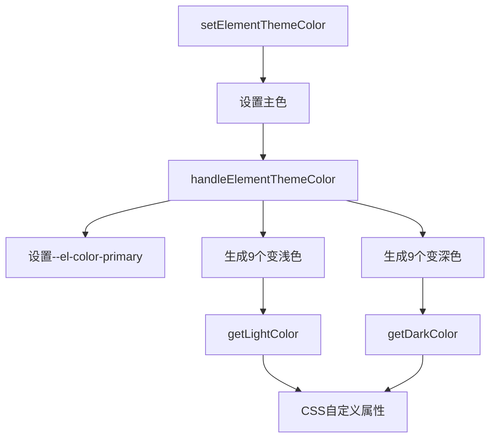
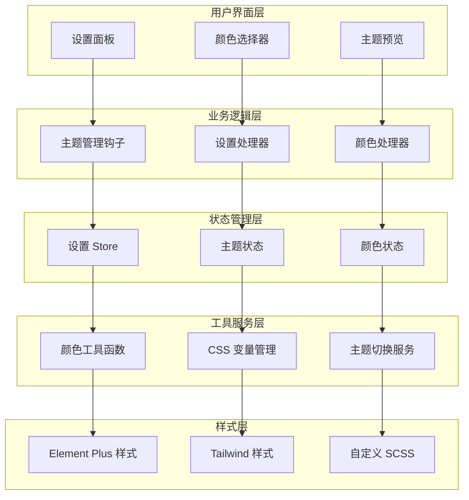
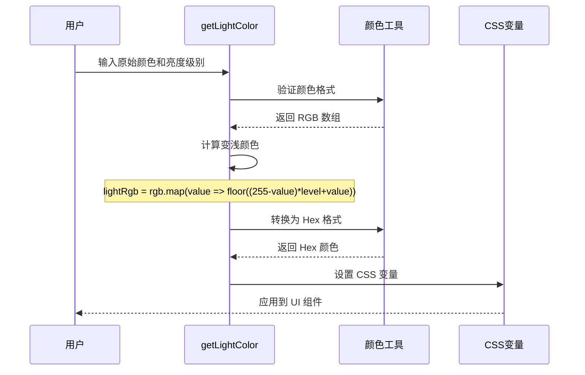
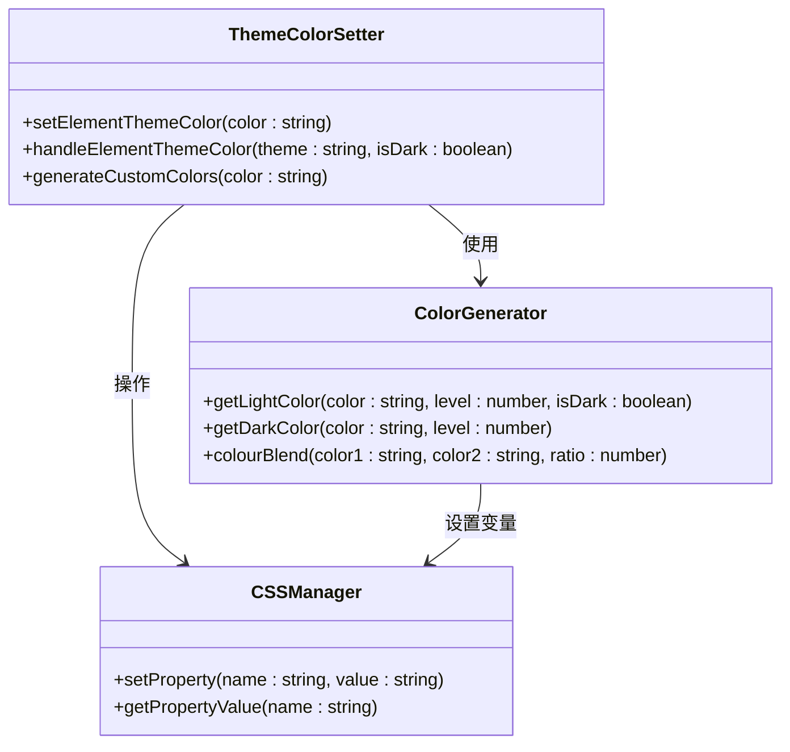
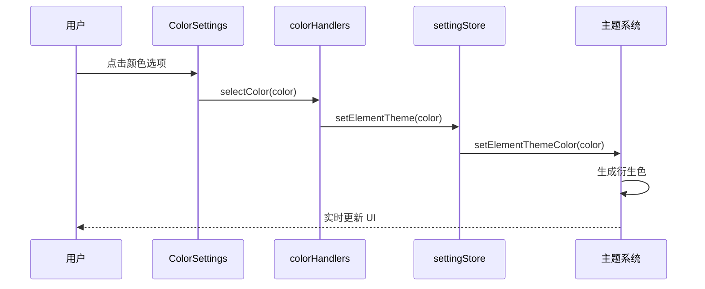
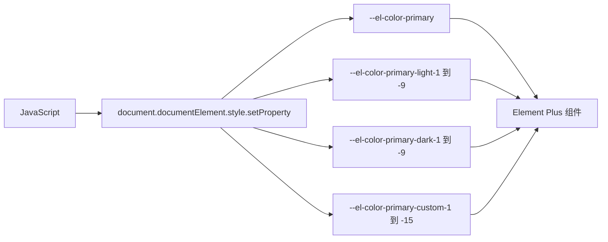
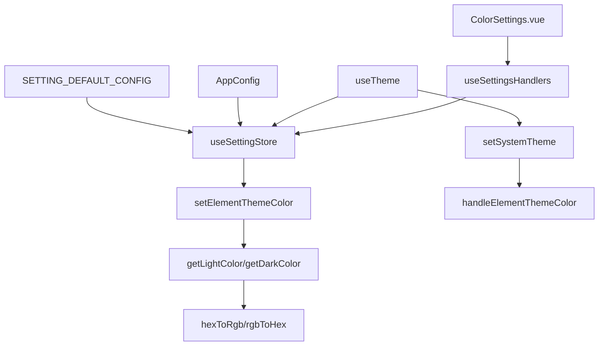

# 自定义主题色

<cite>
**本文档引用的文件**
- [colors.ts](file://src/utils/ui/colors.ts)
- [useTheme.ts](file://src/hooks/core/useTheme.ts)
- [setting.ts](file://src/store/modules/setting.ts)
- [useSettingsHandlers.ts](file://src/components/core/layouts/art-settings-panel/composables/useSettingsHandlers.ts)
- [ColorSettings.vue](file://src/components/core/layouts/art-settings-panel/widget/ColorSettings.vue)
- [index.ts](file://src/config/index.ts)
- [el-light.scss](file://src/assets/styles/core/el-light.scss)
- [el-dark.scss](file://src/assets/styles/core/el-dark.scss)
- [theme-change.scss](file://src/assets/styles/core/theme-change.scss)
- [tailwind.css](file://src/assets/styles/core/tailwind.css)
- [el-ui.scss](file://src/assets/styles/core/el-ui.scss)
- [theme-svg/index.vue](file://src/components/core/theme/theme-svg/index.vue)
- [setting.ts](file://src/config/setting.ts)
</cite>

## 目录
1. [简介](#简介)
2. [项目结构概览](#项目结构概览)
3. [核心组件分析](#核心组件分析)
4. [架构概览](#架构概览)
5. [详细组件分析](#详细组件分析)
6. [依赖关系分析](#依赖关系分析)
7. [性能考虑](#性能考虑)
8. [故障排除指南](#故障排除指南)
9. [结论](#结论)

## 简介

Art Design Pro 提供了一套完整的自定义主题色系统，允许用户通过设置面板动态修改主色调，并实现 Element Plus 组件库的主题适配。该系统基于 CSS 自定义属性和 JavaScript 工具函数，提供了灵活且高效的色彩管理解决方案。

核心功能包括：
- 通过 `settingStore.systemThemeColor` 获取主色调
- 使用 `getLightColor` 和 `getDarkColor` 工具函数生成9个明暗层级的衍生色
- 通过 `setElementThemeColor` 函数将颜色值设置为 CSS 自定义属性
- 实时反映在 UI 组件系统中
- 扩展自定义颜色变量的方法

## 项目结构概览

主题色系统的文件组织结构如下：



**图表来源**
- [colors.ts](file://src/utils/ui/colors.ts#L1-L274)
- [useTheme.ts](file://src/hooks/core/useTheme.ts#L1-L174)
- [setting.ts](file://src/store/modules/setting.ts#L1-L451)

## 核心组件分析

### 颜色处理工具模块

颜色处理工具模块是整个主题色系统的核心，提供了完整的颜色格式转换和处理功能。

#### 主要功能特性

| 功能模块 | 描述 | 支持格式 |
|---------|------|----------|
| 颜色转换 | Hex 与 RGB/RGBA 格式互转 | #FFF, #FFFFFF, rgb(), rgba() |
| 颜色混合 | 两种颜色按比例混合 | 混合比例 0-1 |
| 明暗处理 | 生成变浅/变深的颜色 | 9个层级 |
| 元素主题 | 自动生成 Element Plus 主题色 | --el-color-primary-* |

#### 关键函数说明



**图表来源**
- [colors.ts](file://src/utils/ui/colors.ts#L258-L273)

**章节来源**
- [colors.ts](file://src/utils/ui/colors.ts#L1-L274)

### 主题管理钩子

主题管理钩子负责处理主题切换和颜色适配逻辑，提供流畅的主题切换体验。

#### 主要功能

| 功能 | 描述 | 实现方式 |
|------|------|----------|
| 主题切换 | 支持亮色、暗色、自动三种模式 | CSS 类名切换 |
| 自动模式 | 根据系统偏好自动切换 | usePreferredDark |
| 颜色适配 | 自动调整主题色的明暗变体 | getLightColor/getDarkColor |
| 过渡优化 | 切换时临时禁用过渡效果 | CSS 动画控制 |
| 状态持久化 | 主题设置自动保存到 store | localStorage |

**章节来源**
- [useTheme.ts](file://src/hooks/core/useTheme.ts#L1-L174)

## 架构概览

主题色系统采用分层架构设计，从底层的颜色处理工具到顶层的用户界面组件，形成了完整的色彩管理体系。



**图表来源**
- [useTheme.ts](file://src/hooks/core/useTheme.ts#L42-L123)
- [setting.ts](file://src/store/modules/setting.ts#L47-L442)
- [colors.ts](file://src/utils/ui/colors.ts#L258-L273)

## 详细组件分析

### 颜色工具函数详解

#### getLightColor 函数

`getLightColor` 函数用于生成指定颜色的变浅版本，支持明暗主题适配。



**图表来源**
- [colors.ts](file://src/utils/ui/colors.ts#L200-L214)

#### getDarkColor 函数

`getDarkColor` 函数用于生成指定颜色的变深版本。

```mermaid
flowchart TD
A[输入颜色和深度级别] --> B{验证颜色格式}
B --> |无效| C[抛出错误]
B --> |有效| D[转换为 RGB]
D --> E[计算变深 RGB]
E --> F[rgb.map(value => floor(value*(1-level))) ]
F --> G[转换为 Hex]
G --> H[返回变深颜色]
```

**图表来源**
- [colors.ts](file://src/utils/ui/colors.ts#L222-L232)

#### setElementThemeColor 函数

该函数是主题色系统的核心入口，负责设置完整的 Element Plus 主题色系统。



**图表来源**
- [colors.ts](file://src/utils/ui/colors.ts#L258-L273)

**章节来源**
- [colors.ts](file://src/utils/ui/colors.ts#L200-L273)

### 设置面板组件

#### ColorSettings 组件

颜色设置组件提供了直观的颜色选择界面，用户可以通过点击预设颜色来修改主题色。



**图表来源**
- [ColorSettings.vue](file://src/components/core/layouts/art-settings-panel/widget/ColorSettings.vue#L1-L35)
- [useSettingsHandlers.ts](file://src/components/core/layouts/art-settings-panel/composables/useSettingsHandlers.ts#L142-L146)

**章节来源**
- [ColorSettings.vue](file://src/components/core/layouts/art-settings-panel/widget/ColorSettings.vue#L1-L35)
- [useSettingsHandlers.ts](file://src/components/core/layouts/art-settings-panel/composables/useSettingsHandlers.ts#L141-L146)

### 配置系统

#### 系统配置

系统配置文件定义了可用的主色调列表和默认设置。

| 配置项 | 默认值 | 描述 |
|--------|--------|------|
| systemMainColor | ['#5D87FF', '#B48DF3', '#1D84FF', '#60C041', '#38C0FC', '#F9901F', '#FF80C8'] | 预设颜色列表 |
| systemThemeColor | AppConfig.systemMainColor[0] | 当前主题色 |
| systemThemeType | SystemThemeEnum.AUTO | 主题类型 |

**章节来源**
- [index.ts](file://src/config/index.ts#L119-L128)
- [setting.ts](file://src/config/setting.ts#L44-L45)

### 样式系统集成

#### CSS 自定义属性

主题色系统通过 CSS 自定义属性实现样式的动态绑定。



**图表来源**
- [colors.ts](file://src/utils/ui/colors.ts#L240-L254)
- [el-ui.scss](file://src/assets/styles/core/el-ui.scss#L1-L43)

#### Tailwind 集成

系统还集成了 Tailwind CSS 的颜色系统，支持 OKLCH 格式的颜色定义。

**章节来源**
- [tailwind.css](file://src/assets/styles/core/tailwind.css#L1-L150)
- [el-ui.scss](file://src/assets/styles/core/el-ui.scss#L1-L43)

## 依赖关系分析

主题色系统的依赖关系呈现清晰的层次结构：



**图表来源**
- [ColorSettings.vue](file://src/components/core/layouts/art-settings-panel/widget/ColorSettings.vue#L25-L35)
- [useSettingsHandlers.ts](file://src/components/core/layouts/art-settings-panel/composables/useSettingsHandlers.ts#L142-L146)
- [setting.ts](file://src/store/modules/setting.ts#L47-L442)

**章节来源**
- [ColorSettings.vue](file://src/components/core/layouts/art-settings-panel/widget/ColorSettings.vue#L1-L35)
- [useSettingsHandlers.ts](file://src/components/core/layouts/art-settings-panel/composables/useSettingsHandlers.ts#L1-L168)
- [setting.ts](file://src/store/modules/setting.ts#L1-L451)

## 性能考虑

主题色系统在设计时充分考虑了性能优化：

### 渐进式渲染
- 使用 `requestAnimationFrame` 确保主题切换的流畅性
- 临时禁用过渡效果避免闪烁
- 分批设置 CSS 变量减少重绘

### 缓存机制
- 颜色计算结果缓存
- CSS 变量值复用
- 避免重复的颜色转换操作

### 内存优化
- 及时清理临时样式元素
- 最小化 DOM 操作
- 合理使用事件监听器

## 故障排除指南

### 常见问题及解决方案

#### 主题色不生效
1. 检查 `systemThemeColor` 是否正确设置
2. 验证 CSS 变量是否成功注入
3. 确认 Element Plus 版本兼容性

#### 颜色计算异常
1. 验证输入颜色格式是否正确
2. 检查颜色值范围（0-255）
3. 确认主题模式设置

#### 性能问题
1. 减少频繁的主题切换
2. 优化自定义颜色变量数量
3. 检查是否有内存泄漏

**章节来源**
- [colors.ts](file://src/utils/ui/colors.ts#L200-L232)
- [useTheme.ts](file://src/hooks/core/useTheme.ts#L45-L98)

## 结论

Art Design Pro 的自定义主题色系统提供了一个完整、高效且易于扩展的色彩管理解决方案。通过合理的架构设计和丰富的功能特性，该系统能够满足现代 Web 应用对个性化主题的需求。

### 主要优势

1. **灵活性**：支持多种颜色格式和自定义颜色变量
2. **性能**：优化的主题切换体验和内存使用
3. **可维护性**：清晰的代码结构和完善的类型定义
4. **扩展性**：易于添加新的颜色处理功能

### 最佳实践建议

1. 使用 CSS 自定义属性进行样式绑定
2. 合理利用颜色工具函数生成衍生色
3. 保持颜色格式的一致性
4. 定期清理未使用的颜色变量

该主题色系统不仅为用户提供了丰富的个性化选项，也为开发者提供了强大的扩展能力，是现代前端应用主题管理的优秀范例。