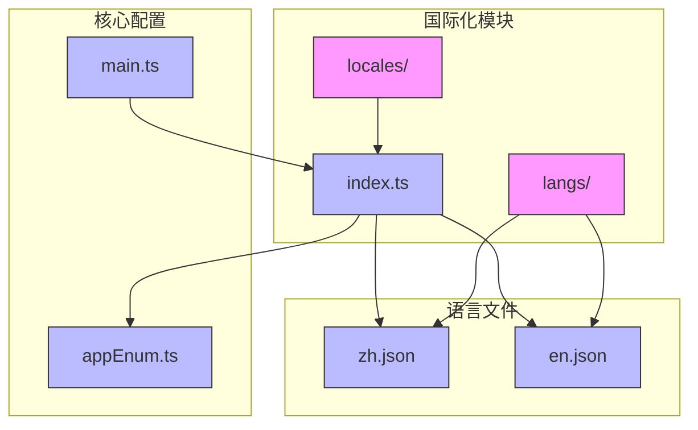
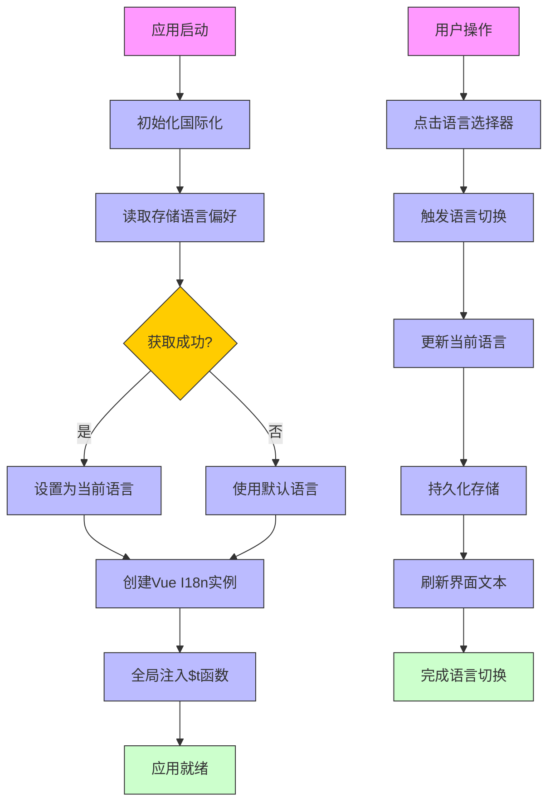
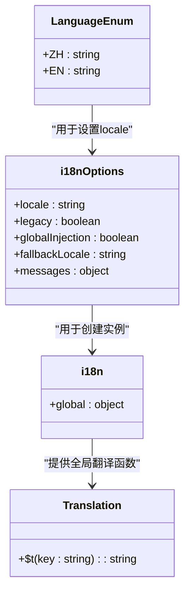
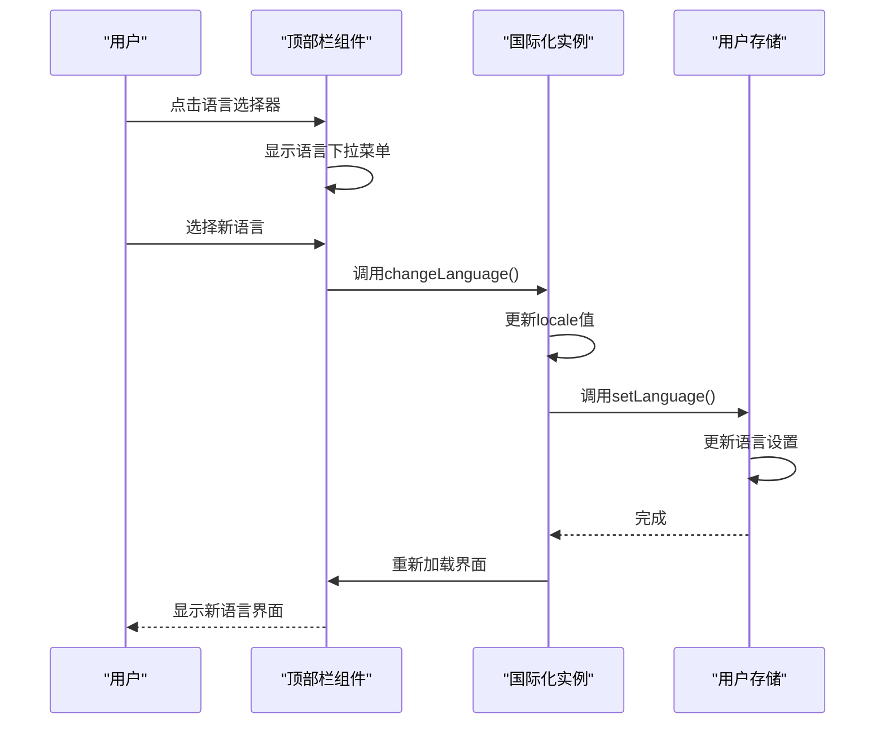
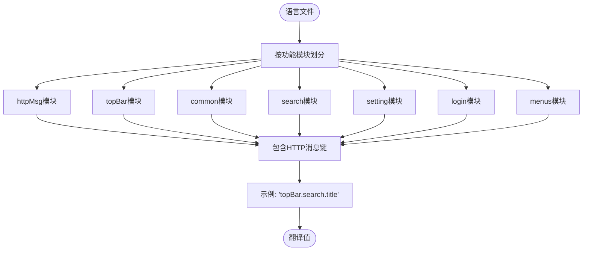
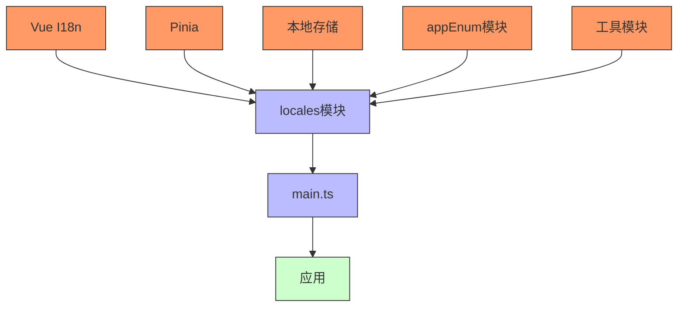

# 国际化

<cite>
**本文档引用的文件**  
- [index.ts](file://src/locales/index.ts)
- [en.json](file://src/locales/langs/en.json)
- [zh.json](file://src/locales/langs/zh.json)
- [main.ts](file://src/main.ts)
- [appEnum.ts](file://src/enums/appEnum.ts)
- [art-header-bar/index.vue](file://src/components/core/layouts/art-header-bar/index.vue)
- [AuthTopBar.vue](file://src/components/core/views/login/AuthTopBar.vue)
- [setting.ts](file://src/store/modules/setting.ts)
- [storage-key-manager.ts](file://src/utils/storage/storage-key-manager.ts)
</cite>

## 目录
1. [简介](#简介)
2. [项目结构](#项目结构)
3. [核心组件](#核心组件)
4. [架构概述](#架构概述)
5. [详细组件分析](#详细组件分析)
6. [依赖分析](#依赖分析)
7. [性能考虑](#性能考虑)
8. [故障排除指南](#故障排除指南)
9. [结论](#结论)
10. [附录](#附录)（如有必要）

## 简介
本项目实现了基于 Vue I18n 的多语言国际化解决方案，支持中文和英文两种语言的动态切换。系统通过语言包管理机制实现了完整的多语言支持，用户界面语言选择器允许用户在运行时切换语言，且语言偏好会自动持久化存储。国际化架构设计考虑了类型安全，提供了 TypeScript 类型支持，并通过全局注入的方式使翻译函数在任何组件中都可使用。语言文件采用 JSON 格式组织，按照功能模块进行分类，确保了良好的可维护性。系统还处理了复数形式、日期时间格式化和数字格式化等特殊场景，提供了完整的国际化体验。

## 项目结构
项目中的国际化功能主要集中在 `src/locales` 目录下，该目录包含了语言文件和国际化配置。语言文件以 JSON 格式存储在 `langs` 子目录中，每个语言对应一个独立的 JSON 文件。国际化配置文件 `index.ts` 负责初始化 Vue I18n 实例并管理语言切换逻辑。系统通过枚举文件定义了支持的语言类型，并在主应用文件中集成国际化功能。

**Diagram sources**
- [index.ts](file://src/locales/index.ts)
- [zh.json](file://src/locales/langs/zh.json)
- [en.json](file://src/locales/langs/en.json)
- [appEnum.ts](file://src/enums/appEnum.ts)
- [main.ts](file://src/main.ts)

**Section sources**
- [index.ts](file://src/locales/index.ts)
- [zh.json](file://src/locales/langs/zh.json)
- [en.json](file://src/locales/langs/en.json)

## 核心组件
国际化功能的核心组件包括语言配置管理、语言文件组织、语言切换机制和持久化存储。系统通过 `src/locales/index.ts` 文件创建 Vue I18n 实例，导入中英文语言文件，并配置默认语言和回退语言。语言选项列表用于语言选择器的下拉菜单，包含中文和英文两种语言。系统从本地存储中恢复用户的语言偏好，如果获取失败则使用默认语言。全局翻译函数 `$t` 被注入到应用中，可在任何组件中使用。

**Section sources**
- [index.ts](file://src/locales/index.ts)
- [appEnum.ts](file://src/enums/appEnum.ts)

## 架构概述
国际化架构基于 Vue I18n 实现，采用模块化设计，将语言配置、语言文件和使用界面分离。系统在应用启动时初始化国际化实例，从存储中获取用户的语言偏好，并设置为当前语言。语言文件采用嵌套的 JSON 结构，按功能模块组织翻译键，如 httpMsg、topBar、common 等。用户界面通过语言选择器组件触发语言切换，系统更新当前语言并持久化存储用户的偏好。整个架构支持运行时动态切换语言，无需刷新页面。

**Diagram sources**
- [index.ts](file://src/locales/index.ts)
- [main.ts](file://src/main.ts)

## 详细组件分析
### 国际化配置分析
国际化配置组件负责初始化 Vue I18n 实例并管理语言相关的逻辑。系统定义了语言枚举类型，包含中文（zh）和英文（en）两种语言。语言消息对象将每种语言映射到其对应的语言文件。配置选项设置了默认语言、是否启用传统模式、是否全局注入以及回退语言。系统提供了全局翻译函数 `$t`，可在任何地方使用，无需导入 useI18n。

#### 国际化配置类图

**Diagram sources**
- [index.ts](file://src/locales/index.ts)
- [appEnum.ts](file://src/enums/appEnum.ts)

### 语言切换功能分析
语言切换功能通过用户界面的语言选择器实现，用户点击选择器后可以切换到不同的语言。系统在顶部栏和登录页都集成了语言选择器组件，确保用户在任何页面都能方便地切换语言。选择器使用下拉菜单显示可用的语言选项，当前选中的语言会显示选中状态。切换语言后，系统会更新当前语言并持久化存储用户的偏好。

#### 语言切换序列图

**Diagram sources**
- [art-header-bar/index.vue](file://src/components/core/layouts/art-header-bar/index.vue)
- [index.ts](file://src/locales/index.ts)
- [setting.ts](file://src/store/modules/setting.ts)

### 语言文件组织分析
语言文件采用 JSON 格式，按功能模块组织翻译键。每个语言文件包含多个模块，如 httpMsg、topBar、common、search、setting 等，每个模块又包含具体的翻译键值对。这种组织结构使得语言文件易于维护和扩展。翻译键采用点号分隔的路径形式，反映了其在对象结构中的位置，如 "topBar.search.title" 表示顶部栏搜索模块的标题。

#### 语言文件结构流程图

**Diagram sources**
- [zh.json](file://src/locales/langs/zh.json)
- [en.json](file://src/locales/langs/en.json)

**Section sources**
- [zh.json](file://src/locales/langs/zh.json)
- [en.json](file://src/locales/langs/en.json)

## 依赖分析
国际化功能依赖于多个核心模块和外部库。系统依赖 Vue I18n 库实现多语言支持，依赖 Pinia 进行状态管理，依赖本地存储进行持久化。国际化模块与用户存储模块紧密耦合，用于保存和读取用户的语言偏好。系统还依赖枚举模块定义语言类型，依赖工具模块处理存储键管理和数据迁移。

**Diagram sources**
- [index.ts](file://src/locales/index.ts)
- [main.ts](file://src/main.ts)
- [appEnum.ts](file://src/enums/appEnum.ts)
- [storage-key-manager.ts](file://src/utils/storage/storage-key-manager.ts)

**Section sources**
- [index.ts](file://src/locales/index.ts)
- [main.ts](file://src/main.ts)

## 性能考虑
国际化系统的性能表现良好，语言文件在应用启动时同步加载，确保了翻译的即时性。系统采用持久化存储机制，避免了每次启动时重新获取语言偏好的开销。语言切换操作轻量高效，仅需更新当前语言设置即可触发界面重新渲染。全局注入的翻译函数 `$t` 经过优化，调用开销极小。对于大型应用，可以考虑按需加载语言文件以减少初始加载时间。

## 故障排除指南
在使用国际化功能时可能遇到一些常见问题。如果语言切换后界面文本未更新，检查是否正确调用了 `changeLanguage` 方法并更新了 `locale` 值。如果无法从存储中恢复语言偏好，检查存储键管理器是否正常工作，以及存储数据格式是否正确。如果翻译键找不到对应的翻译值，确保语言文件中存在该键，并检查键名拼写是否正确。对于类型安全问题，确保 TypeScript 类型定义与实际的语言文件结构一致。

**Section sources**
- [index.ts](file://src/locales/index.ts)
- [storage-key-manager.ts](file://src/utils/storage/storage-key-manager.ts)

## 结论
本项目的国际化实现采用了成熟的技术方案，基于 Vue I18n 构建了完整的多语言支持系统。架构设计合理，代码组织清晰，具有良好的可维护性和扩展性。系统成功实现了语言动态切换、持久化存储、全局翻译函数等核心功能，为用户提供了一致的多语言体验。通过模块化的语言文件组织和清晰的命名规范，使得添加新语言和维护现有翻译变得简单高效。整体实现符合现代前端应用的国际化需求，为未来的功能扩展奠定了坚实基础。

## 附录
### 添加新语言的完整流程
1. 在 `src/locales/langs` 目录下创建新的语言文件，如 `fr.json`（法语）
2. 复制现有语言文件的内容结构，将所有翻译值转换为目标语言
3. 在 `src/enums/appEnum.ts` 文件的 `LanguageEnum` 枚举中添加新的语言项
4. 在 `src/locales/index.ts` 文件中导入新的语言文件
5. 将新语言添加到 `messages` 对象中，使用枚举值作为键
6. 在 `languageOptions` 数组中添加新的语言选项
7. 重新构建应用，新语言即可在语言选择器中使用

### 翻译键命名规范
- 使用小写字母和连字符（kebab-case）命名模块，如 `top-bar`、`user-profile`
- 模块内部使用点号分隔的路径形式，如 `top-bar.search.title`
- 保持层级结构合理，避免过深的嵌套（建议不超过3层）
- 使用描述性名称，清晰表达翻译内容的含义
- 避免使用缩写，除非是广泛认可的术语
- 保持命名一致性，相同概念在不同模块中使用相同的键名

### 特殊场景处理
系统通过 Vue I18n 的内置功能处理复数形式、日期时间格式化和数字格式化等特殊场景。对于复数形式，可以使用 Vue I18n 的复数规则定义不同数量下的翻译。日期时间格式化通过内置的日期过滤器实现，支持多种格式和时区。数字格式化支持货币、百分比和科学计数法等格式，可根据用户区域设置自动调整显示方式。