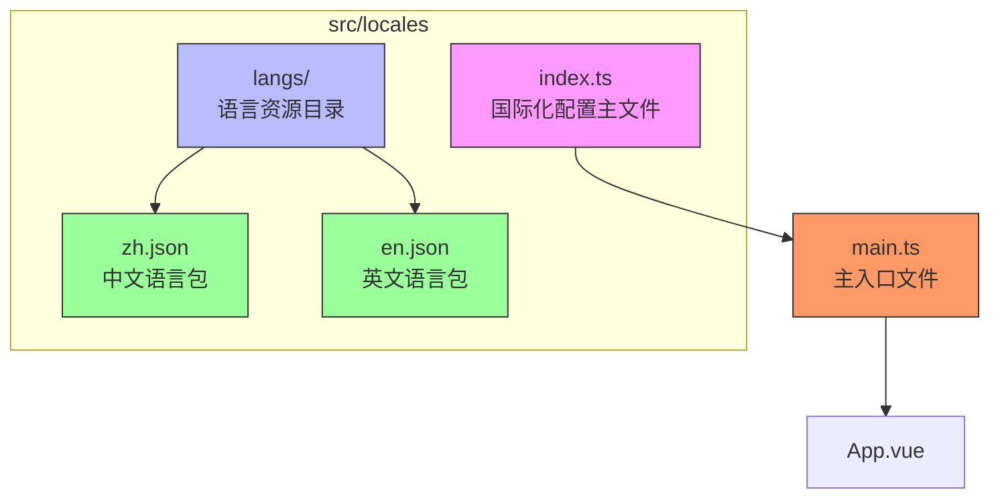
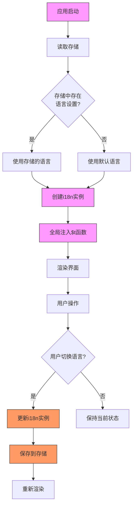
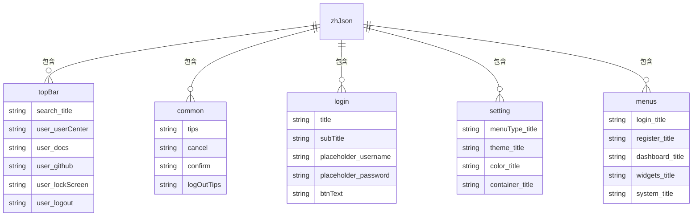
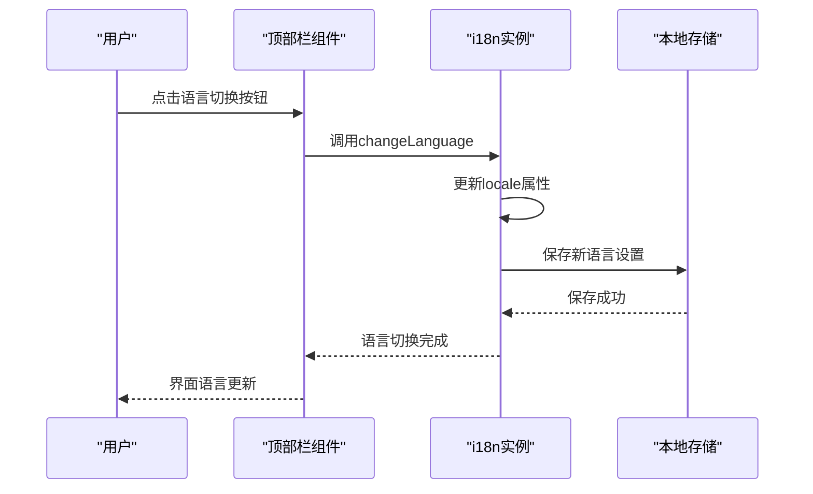
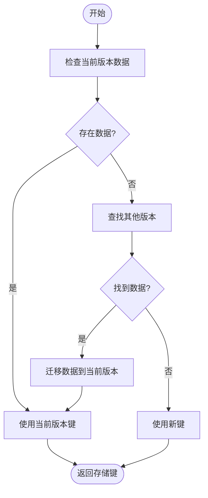
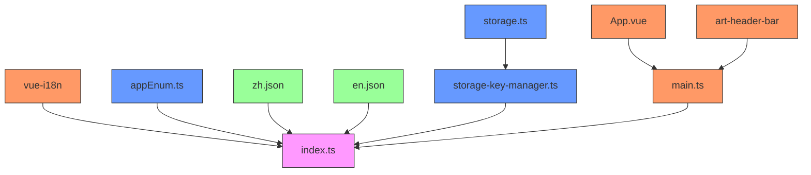

# 多语言支持

<cite>
**本文档引用的文件**   
- [index.ts](file://src/locales/index.ts)
- [zh.json](file://src/locales/langs/zh.json)
- [en.json](file://src/locales/langs/en.json)
- [appEnum.ts](file://src/enums/appEnum.ts)
- [main.ts](file://src/main.ts)
- [art-header-bar/index.vue](file://src/components/core/layouts/art-header-bar/index.vue)
- [LoginLeftView.vue](file://src/components/core/views/login/LoginLeftView.vue)
- [setting.ts](file://src/store/modules/setting.ts)
- [storage-key-manager.ts](file://src/utils/storage/storage-key-manager.ts)
- [clean-dev.ts](file://scripts/clean-dev.ts)
</cite>

## 目录
1. [简介](#简介)
2. [项目结构](#项目结构)
3. [核心组件](#核心组件)
4. [架构概述](#架构概述)
5. [详细组件分析](#详细组件分析)
6. [依赖分析](#依赖分析)
7. [性能考虑](#性能考虑)
8. [故障排除指南](#故障排除指南)
9. [结论](#结论)

## 简介
本项目实现了完整的多语言支持功能，基于 vue-i18n 库构建国际化解决方案。系统支持中文（zh）和英文（en）两种语言，通过JSON语言文件进行文本管理，并实现了语言偏好持久化存储。用户可以在运行时动态切换语言，无需刷新页面即可看到界面文本的实时变化。系统通过全局注入的 `$t` 函数在任何组件中进行文本翻译，同时提供了类型安全的TypeScript支持。语言设置会自动从本地存储中恢复，确保用户偏好在页面刷新后依然保持。

## 项目结构
项目中的多语言支持功能主要集中在 `src/locales` 目录下，该目录包含了所有与国际化相关的配置和语言资源文件。



**图示来源**
- [index.ts](file://src/locales/index.ts)
- [zh.json](file://src/locales/langs/zh.json)
- [en.json](file://src/locales/langs/en.json)
- [main.ts](file://src/main.ts)

**本节来源**
- [index.ts](file://src/locales/index.ts#L1-L123)
- [main.ts](file://src/main.ts#L1-L25)

## 核心组件
多语言支持的核心组件包括语言配置文件、语言资源文件和语言切换机制。系统通过 `src/locales/index.ts` 文件创建和配置 vue-i18n 实例，同步导入 `zh.json` 和 `en.json` 语言文件作为消息源。`LanguageEnum` 枚举定义了支持的语言类型，确保类型安全。`getDefaultLanguage` 函数负责从本地存储中恢复用户的语言偏好，如果获取失败则返回默认的中文语言。全局注入的 `$t` 函数使得在任何组件中都可以方便地进行文本翻译，而无需重复导入 i18n 实例。

**本节来源**
- [index.ts](file://src/locales/index.ts#L1-L123)
- [appEnum.ts](file://src/enums/appEnum.ts#L66-L71)

## 架构概述
系统的多语言架构基于 vue-i18n 库，采用模块化设计，将语言配置、资源管理和持久化存储分离。语言资源以JSON格式存储在 `langs` 目录中，每个语言对应一个独立的JSON文件。主配置文件 `index.ts` 负责创建 i18n 实例，配置默认语言、后备语言和消息源。语言切换功能通过全局状态管理实现，用户的语言偏好会持久化存储在本地存储中，支持版本化的数据迁移。系统在启动时自动检测并恢复用户的语言设置，确保用户体验的一致性。



**图示来源**
- [index.ts](file://src/locales/index.ts#L1-L123)
- [storage-key-manager.ts](file://src/utils/storage/storage-key-manager.ts)

## 详细组件分析

### 语言配置分析
语言配置组件负责初始化和管理多语言功能，包括语言实例创建、默认语言设置和全局函数注入。

```mermaid
classDiagram
class I18nConfig {
+createI18n() : I18n
+getDefaultLanguage() : LanguageEnum
+$t(key : string) : string
}
class LanguageMessages {
+zhMessages : object
+enMessages : object
+messages : object
}
class LanguageOptions {
+languageOptions : Array{value, label}
}
I18nConfig --> LanguageMessages : "使用"
I18nConfig --> LanguageOptions : "导出"
I18nConfig --> LanguageEnum : "依赖"
class LanguageEnum {
+ZH : 'zh'
+EN : 'en'
}
```

**图示来源**
- [index.ts](file://src/locales/index.ts#L24-L123)
- [appEnum.ts](file://src/enums/appEnum.ts#L66-L71)

#### 语言资源文件分析
语言资源文件采用JSON格式组织，按照功能模块进行分类，如 httpMsg、topBar、common、login 等。每个模块包含相应的键值对翻译，支持嵌套结构以更好地组织内容。中文和英文文件保持相同的键名结构，确保翻译的一致性。系统通过同步导入的方式加载语言文件，虽然简单直接，但可能影响首屏加载性能。建议在大型项目中考虑按需加载或懒加载策略来优化性能。



**图示来源**
- [zh.json](file://src/locales/langs/zh.json)
- [en.json](file://src/locales/langs/en.json)

#### 语言切换机制分析
语言切换机制通过监听用户操作来动态更新界面语言。系统首先尝试从版本化的存储中获取语言设置，如果失败则尝试从系统存储中获取，最后返回默认的中文语言。存储键管理器 `StorageKeyManager` 负责处理版本化的存储键名生成和数据迁移，确保在应用版本升级时用户的数据不会丢失。当用户切换语言时，系统会更新 i18n 实例的 locale 属性，并将新的语言设置保存到本地存储中。



**图示来源**
- [index.ts](file://src/locales/index.ts#L56-L92)
- [art-header-bar/index.vue](file://src/components/core/layouts/art-header-bar/index.vue#L91-L105)
- [storage-key-manager.ts](file://src/utils/storage/storage-key-manager.ts)

### 持久化存储分析
持久化存储机制确保用户的语言偏好在页面刷新后依然保持。系统采用版本化的存储策略，存储键格式为 `sys-v{version}-{storeId}`，支持多版本数据隔离和迁移。`StorageKeyManager` 类负责智能地管理存储键名，优先使用当前版本的存储键，如果当前版本无数据，则查找并迁移其他版本的同名数据。这种设计避免了版本升级导致的数据丢失问题，实现了平滑的版本过渡。



**图示来源**
- [storage-key-manager.ts](file://src/utils/storage/storage-key-manager.ts)
- [storage-config.ts](file://src/utils/storage/storage-config.ts)

**本节来源**
- [index.ts](file://src/locales/index.ts#L37-L92)
- [storage-key-manager.ts](file://src/utils/storage/storage-key-manager.ts)
- [storage-config.ts](file://src/utils/storage/storage-config.ts)

## 依赖分析
多语言支持功能依赖于多个核心模块和工具类，形成了一个完整的依赖链。



**图示来源**
- [index.ts](file://src/locales/index.ts)
- [appEnum.ts](file://src/enums/appEnum.ts)
- [storage-key-manager.ts](file://src/utils/storage/storage-key-manager.ts)
- [main.ts](file://src/main.ts)

**本节来源**
- [index.ts](file://src/locales/index.ts#L24-L32)
- [main.ts](file://src/main.ts#L5)
- [appEnum.ts](file://src/enums/appEnum.ts)

## 性能考虑
目前的多语言实现采用同步导入语言文件的方式，这在应用启动时会加载所有语言资源，可能影响首屏加载性能。对于大型项目，建议考虑以下优化措施：实现按需加载或懒加载策略，只在需要时加载特定语言包；对语言文件进行代码分割，利用Webpack的动态导入功能；实现语言包的缓存机制，减少重复加载；监控语言文件的大小，避免过度膨胀。此外，版本化的存储键管理虽然提供了良好的数据迁移能力，但也增加了存储管理的复杂性，需要权衡其带来的好处和维护成本。

## 故障排除指南
在使用多语言功能时可能遇到以下常见问题及解决方案：

1. **语言切换无效**：检查 `index.ts` 中的 i18n 实例是否正确注入到应用中，确保 `main.ts` 中调用了 `app.use(language)`。

2. **翻译文本不显示**：确认JSON语言文件中的键名与代码中使用的键名完全匹配，包括大小写和嵌套路径。

3. **存储数据丢失**：检查 `StorageKeyManager` 是否正确处理了版本迁移，确保旧版本的数据能够正确迁移到新版本。

4. **类型安全问题**：确保 `LanguageEnum` 枚举与语言文件中的键名保持同步，避免硬编码语言值。

5. **性能问题**：如果语言文件过大，考虑实现懒加载或按需加载策略，优化首屏加载时间。

**本节来源**
- [index.ts](file://src/locales/index.ts)
- [main.ts](file://src/main.ts)
- [storage-key-manager.ts](file://src/utils/storage/storage-key-manager.ts)

## 结论
本项目的多语言支持功能设计合理，基于 vue-i18n 实现了完整的国际化解决方案。系统通过模块化的JSON文件组织语言资源，采用版本化的存储策略确保用户偏好的持久化，提供了全局可用的翻译函数简化开发。然而，同步导入语言文件的方式可能影响性能，建议在大型项目中考虑懒加载优化。整体架构清晰，依赖关系明确，易于维护和扩展，为用户提供了一致的多语言体验。