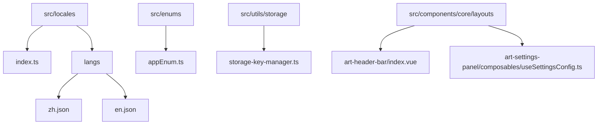
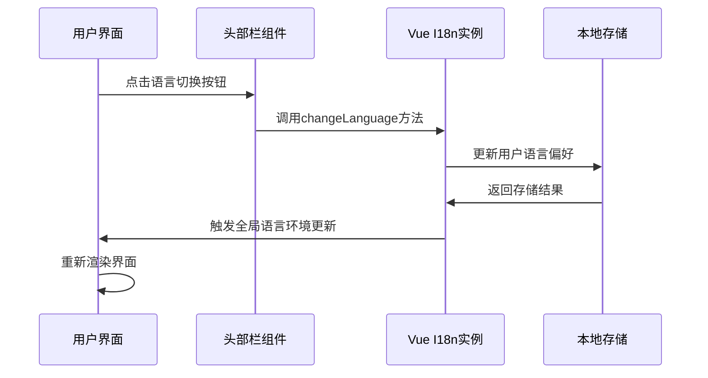
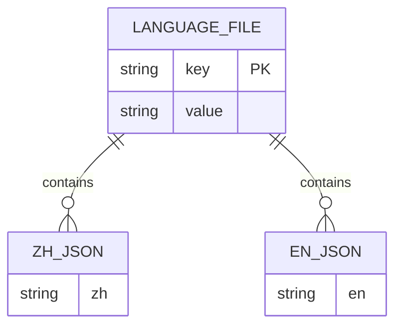
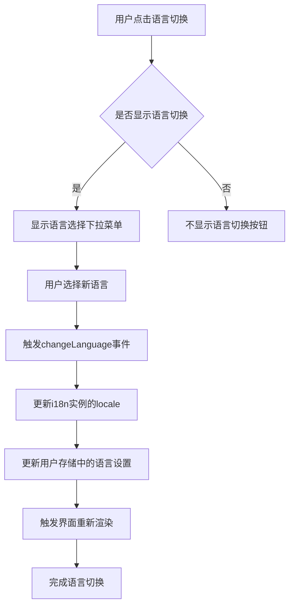
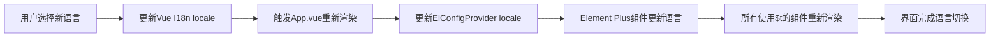
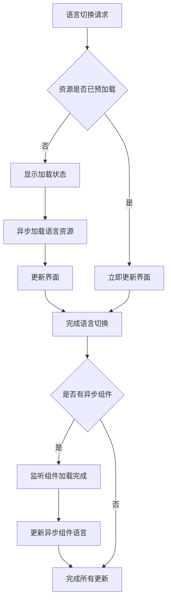

# 语言切换机制

<cite>
**本文档引用文件**  
- [index.ts](file://src/locales/index.ts)
- [appEnum.ts](file://src/enums/appEnum.ts)
- [storage-key-manager.ts](file://src/utils/storage/storage-key-manager.ts)
- [setting.ts](file://src/store/modules/setting.ts)
- [App.vue](file://src/App.vue)
- [art-header-bar/index.vue](file://src/components/core/layouts/art-header-bar/index.vue)
- [useSettingsConfig.ts](file://src/components/core/layouts/art-settings-panel/composables/useSettingsConfig.ts)
- [zh.json](file://src/locales/langs/zh.json)
- [en.json](file://src/locales/langs/en.json)
</cite>

## 目录
1. [项目结构](#项目结构)
2. [核心组件](#核心组件)
3. [语言切换执行流程](#语言切换执行流程)
4. [自定义语言切换函数使用示例](#自定义语言切换函数使用示例)
5. [异步组件语言加载问题及解决方案](#异步组件语言加载问题及解决方案)

## 项目结构



**Diagram sources**  
- [index.ts](file://src/locales/index.ts)
- [appEnum.ts](file://src/enums/appEnum.ts)
- [storage-key-manager.ts](file://src/utils/storage/storage-key-manager.ts)
- [art-header-bar/index.vue](file://src/components/core/layouts/art-header-bar/index.vue)
- [useSettingsConfig.ts](file://src/components/core/layouts/art-settings-panel/composables/useSettingsConfig.ts)

**Section sources**  
- [index.ts](file://src/locales/index.ts)
- [appEnum.ts](file://src/enums/appEnum.ts)
- [storage-key-manager.ts](file://src/utils/storage/storage-key-manager.ts)

## 核心组件

### Vue I18n 实例初始化配置

在 `src/locales/index.ts` 文件中，Vue I18n 实例的初始化配置包含了默认语言设置、语言变更事件监听和语言状态持久化等关键功能。

**默认语言设置**

通过 `getDefaultLanguage` 函数实现默认语言的获取逻辑，该函数按照优先级顺序从不同存储位置读取用户的语言偏好：

1. 首先尝试从版本化的用户存储中获取语言设置
2. 如果失败，则尝试从系统存储中获取
3. 如果仍然失败，则返回默认语言（简体中文）

```typescript
const getDefaultLanguage = (): LanguageEnum => {
  // 尝试从版本化的存储中获取语言设置
  try {
    const storageKey = storageKeyManager.getStorageKey('user')
    const userStore = localStorage.getItem(storageKey)

    if (userStore) {
      const { language } = JSON.parse(userStore)
      if (language && Object.values(LanguageEnum).includes(language)) {
        return language
      }
    }
  } catch (error) {
    console.warn('[i18n] 从版本化存储获取语言设置失败:', error)
  }

  // 尝试从系统存储中获取语言设置
  try {
    const sys = getSystemStorage()
    if (sys) {
      const { user } = JSON.parse(sys)
      if (user?.language && Object.values(LanguageEnum).includes(user.language)) {
        return user.language
      }
    }
  } catch (error) {
    console.warn('[i18n] 从系统存储获取语言设置失败:', error)
  }

  // 返回默认语言
  console.debug('[i18n] 使用默认语言:', LanguageEnum.ZH)
  return LanguageEnum.ZH
}
```

**语言状态持久化**

语言状态的持久化通过 `StorageKeyManager` 类实现，该类提供了智能的版本化存储键管理和数据迁移功能：

- 自动生成当前版本的存储键名
- 检测当前版本数据是否存在
- 查找其他版本的同名存储数据
- 自动将旧版本数据迁移到当前版本
- 数据迁移日志记录
- 迁移失败的错误处理



**Diagram sources**  
- [index.ts](file://src/locales/index.ts)
- [storage-key-manager.ts](file://src/utils/storage/storage-key-manager.ts)
- [art-header-bar/index.vue](file://src/components/core/layouts/art-header-bar/index.vue)

**Section sources**  
- [index.ts](file://src/locales/index.ts#L60-L92)
- [storage-key-manager.ts](file://src/utils/storage/storage-key-manager.ts#L38-L97)

### 语言文件结构

项目支持两种语言：简体中文（zh）和英文（en），分别对应 `zh.json` 和 `en.json` 文件。这些文件包含了应用程序中所有需要翻译的文本内容，按照功能模块进行组织：

- httpMsg: HTTP请求相关消息
- topBar: 顶部栏相关文本
- common: 通用提示文本
- search: 搜索功能相关文本
- setting: 设置面板相关文本
- notice: 通知相关文本
- worktab: 工作标签相关文本
- login: 登录页面相关文本
- menus: 菜单相关文本
- table: 表格相关文本



**Diagram sources**  
- [zh.json](file://src/locales/langs/zh.json)
- [en.json](file://src/locales/langs/en.json)

**Section sources**  
- [zh.json](file://src/locales/langs/zh.json)
- [en.json](file://src/locales/langs/en.json)

## 语言切换执行流程

### UI交互到全局语言环境更新的响应链条

当用户触发语言切换时，系统会执行一系列操作来完成语言环境的更新和界面重渲染。这个过程涉及多个组件和模块的协同工作。

**头部栏语言切换组件**

在 `art-header-bar/index.vue` 组件中，通过 ElDropdown 组件实现了语言切换的UI交互：

```vue
<ElDropdown @command="changeLanguage" v-if="shouldShowLanguage">
  <ArtIconButton icon="ri:translate-2" class="language-btn text-[19px]" />
  <template #dropdown>
    <ElDropdownMenu>
      <div v-for="item in languageOptions" :key="item.value" class="lang-btn-item">
        <ElDropdownItem :command="item.value" :class="{ 'is-selected': locale === item.value }">
          <span class="menu-txt">{{ item.label }}</span>
          <ArtSvgIcon icon="ri:check-fill" v-if="locale === item.value" />
        </ElDropdownItem>
      </div>
    </ElDropdownMenu>
  </template>
</ElDropdown>
```

**语言切换事件处理**

当用户选择新的语言时，`changeLanguage` 方法会被调用，该方法负责更新语言设置并触发相应的状态变更。



**Diagram sources**  
- [art-header-bar/index.vue](file://src/components/core/layouts/art-header-bar/index.vue#L90-L110)

**Section sources**  
- [art-header-bar/index.vue](file://src/components/core/layouts/art-header-bar/index.vue#L90-L110)

### 全局语言环境更新机制

语言环境的全局更新是通过 Vue I18n 的响应式机制实现的。当语言发生变化时，所有使用 `$t` 函数进行翻译的组件都会自动重新渲染。

**App.vue 中的语言环境绑定**

在根组件 `App.vue` 中，通过 `ElConfigProvider` 组件将 Element Plus 的语言环境与 Vue I18n 的语言环境同步：

```vue
<template>
  <ElConfigProvider size="default" :locale="locales[language]" :z-index="3000">
    <RouterView></RouterView>
  </ElConfigProvider>
</template>

<script setup lang="ts">
const locales = {
  zh: zh,
  en: en
}

const userStore = useUserStore()
const { language } = storeToRefs(userStore)
</script>
```

这种绑定方式确保了不仅应用程序自身的文本能够正确翻译，第三方组件库（如 Element Plus）的界面文本也能随着语言切换而更新。



**Diagram sources**  
- [App.vue](file://src/App.vue#L2-L4)
- [index.ts](file://src/locales/index.ts)

**Section sources**  
- [App.vue](file://src/App.vue#L2-L4)
- [index.ts](file://src/locales/index.ts)

## 自定义语言切换函数使用示例

### 基本使用方法

项目提供了 `languageOptions` 导出，方便在任何需要语言选择的地方使用：

```typescript
export const languageOptions = [
  { value: LanguageEnum.ZH, label: '简体中文' },
  { value: LanguageEnum.EN, label: 'English' }
]
```

### 在组件中使用语言切换

以下是一个在设置面板中使用语言切换功能的示例：

```typescript
// src/components/core/layouts/art-settings-panel/composables/useSettingsConfig.ts
{
  key: 'showLanguage',
  label: t('setting.basics.list.language'),
  type: 'switch' as const,
  handler: 'language',
  headerBarKey: 'language' as const
}
```

### 全局翻译函数 $t 的使用

项目导出了全局翻译函数 `$t`，可以在任何地方使用，无需导入 `useI18n`：

```typescript
export const $t = i18n.global.t as Translation
```

使用示例：

```typescript
// 在任何JavaScript/TypeScript文件中
console.log($t('common.tips')) // 输出: "提示" 或 "Prompt"

// 在模板中
{{ $t('login.title') }}
```

```mermaid
classDiagram
class LanguageService {
+languageOptions : Array<{value : string, label : string}>
+$t(key : string) : string
+getDefaultLanguage() : LanguageEnum
+changeLanguage(lang : LanguageEnum) : void
}
class Translation {
+key : string
+value : string
}
LanguageService --> Translation : "manages"
LanguageService ..> VueI18n : "uses"
```

**Diagram sources**  
- [index.ts](file://src/locales/index.ts)
- [useSettingsConfig.ts](file://src/components/core/layouts/art-settings-panel/composables/useSettingsConfig.ts)

**Section sources**  
- [index.ts](file://src/locales/index.ts#L51-L54)
- [useSettingsConfig.ts](file://src/components/core/layouts/art-settings-panel/composables/useSettingsConfig.ts#L150-L155)

## 异步组件语言加载问题及解决方案

### 可能出现的问题

在实际应用中，语言切换过程中可能会遇到一些问题，特别是与异步组件相关的语言加载延迟问题：

1. **异步组件加载延迟**：当页面包含异步加载的组件时，这些组件可能在语言切换后才开始加载，导致初始显示为默认语言，然后才切换到目标语言。
2. **动态内容翻译延迟**：通过API获取的动态内容可能在语言切换后才返回，导致这些内容的翻译延迟。
3. **第三方库语言更新延迟**：某些第三方库可能没有正确监听语言变化事件，导致其界面文本更新不及时。

### 解决方案

#### 1. 预加载语言资源

为了避免异步组件的语言加载延迟，可以预先加载所有支持的语言资源：

```typescript
// 在应用初始化时预加载所有语言资源
const preloadLanguages = async () => {
  await Promise.all([
    import('./langs/zh.json'),
    import('./langs/en.json')
  ])
}
```

#### 2. 使用 Suspense 处理异步组件

利用 Vue 3 的 Suspense 组件来优雅地处理异步组件的加载过程：

```vue
<Suspense>
  <template #default>
    <AsyncComponent />
  </template>
  <template #fallback>
    <LoadingSpinner />
  </template>
</Suspense>
```

#### 3. 确保所有组件响应语言变化

通过在组件中监听语言变化事件，确保所有组件都能正确响应语言切换：

```typescript
// 在组件中监听语言变化
watch(() => i18n.global.locale, (newLocale) => {
  // 执行必要的更新操作
  updateComponentText()
})
```

#### 4. 使用 Pinia Store 管理语言状态

将语言状态集中管理在 Pinia Store 中，确保状态的一致性和可预测性：

```typescript
// src/store/modules/setting.ts
const showLanguage = ref(SETTING_DEFAULT_CONFIG.showLanguage)

const setLanguage = () => {
  showLanguage.value = !showLanguage.value
}
```



**Diagram sources**  
- [setting.ts](file://src/store/modules/setting.ts#L82-L83)
- [index.ts](file://src/locales/index.ts)

**Section sources**  
- [setting.ts](file://src/store/modules/setting.ts#L82-L83)
- [index.ts](file://src/locales/index.ts)