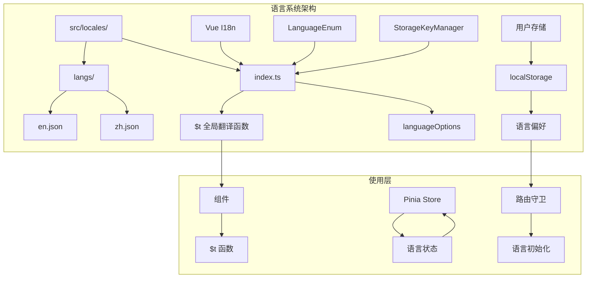
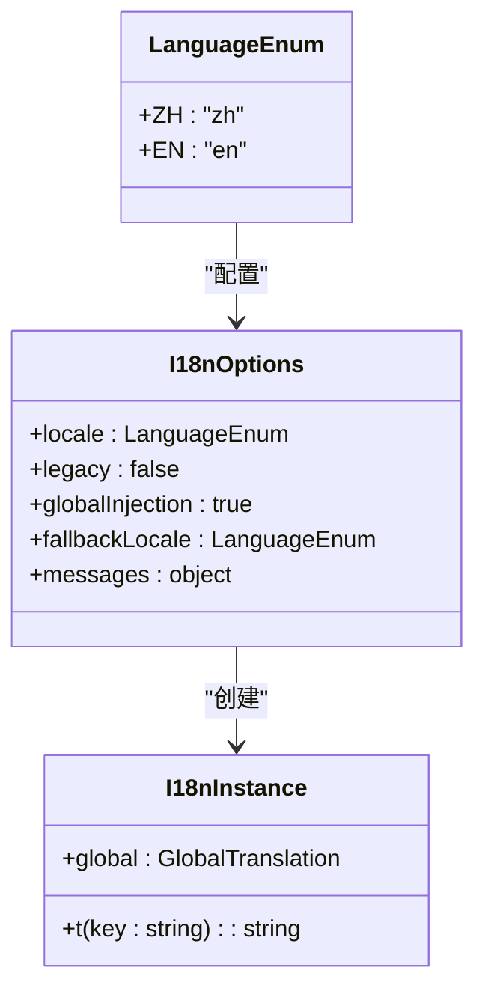
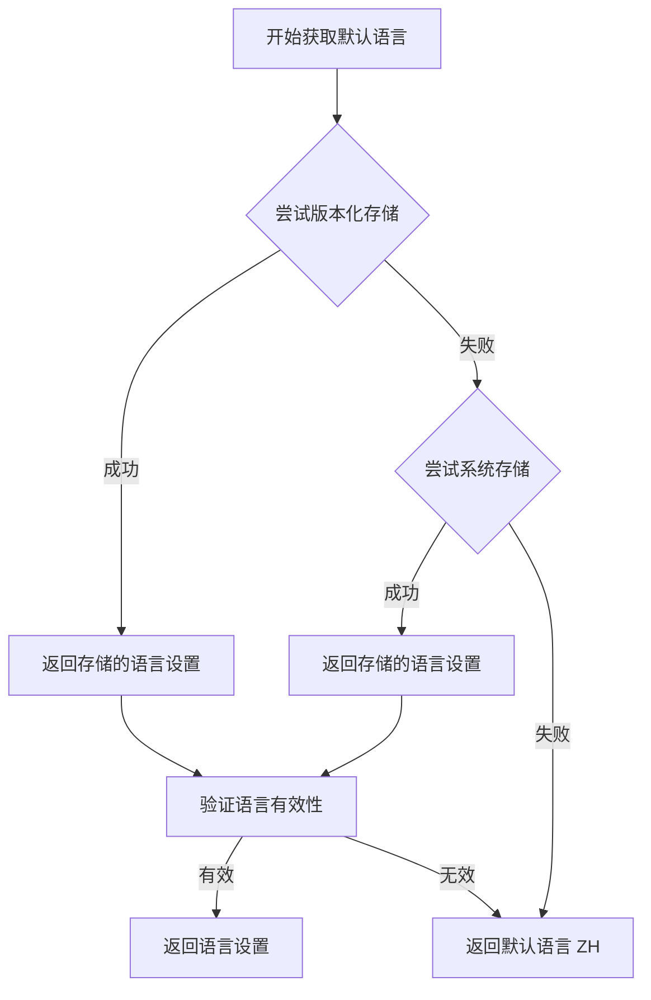
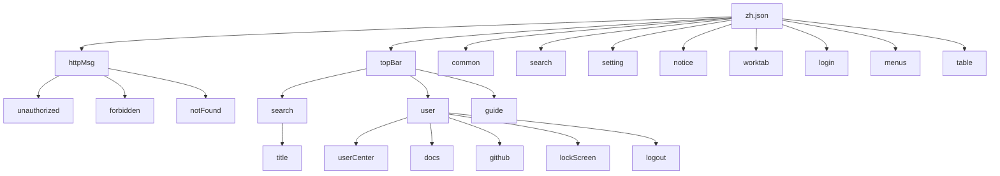
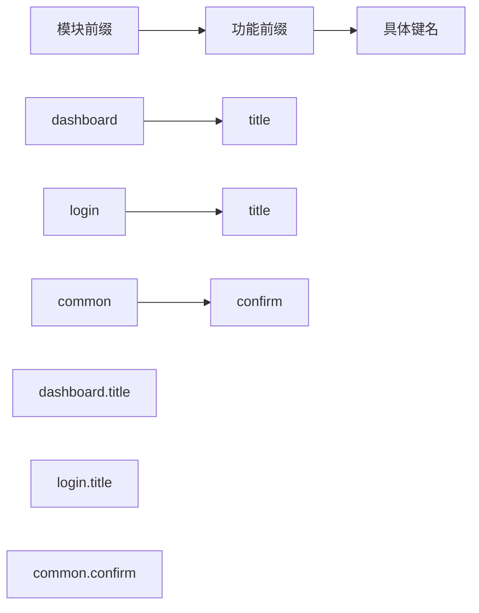
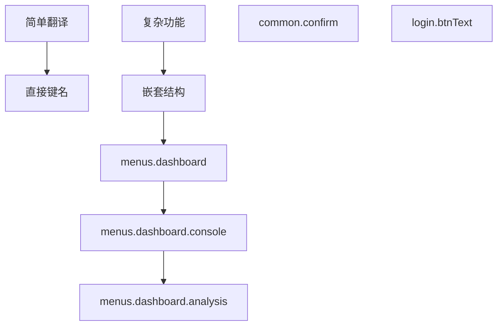
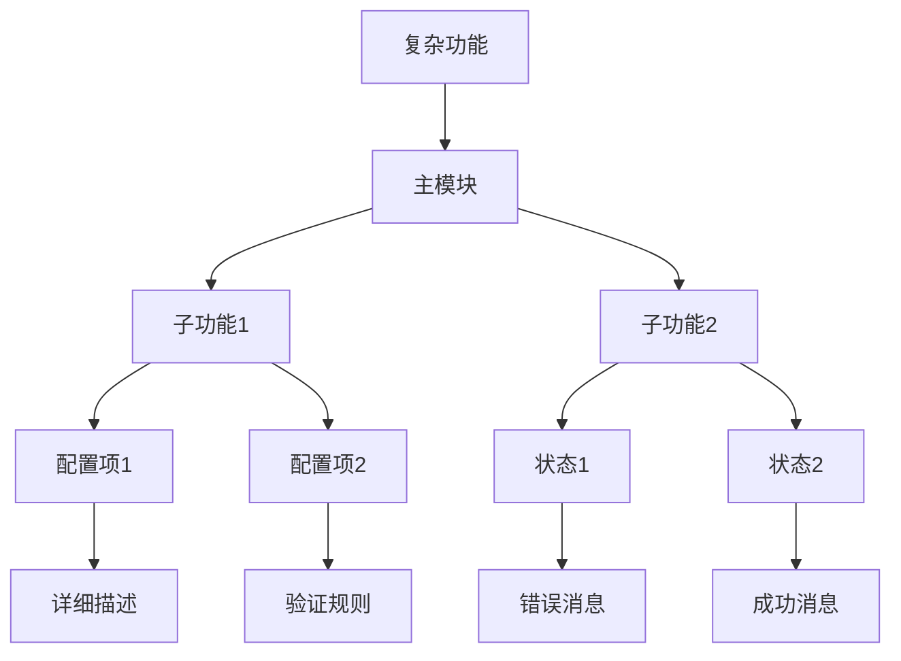
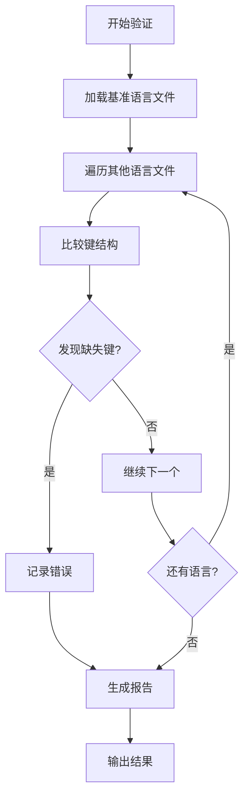
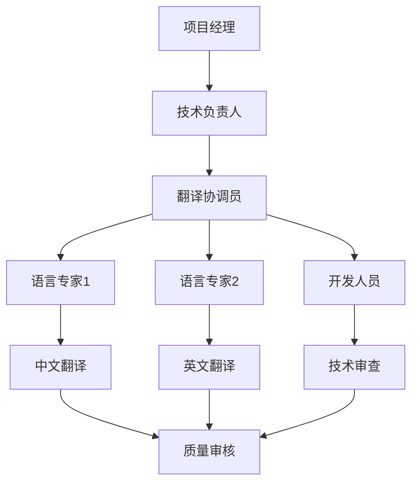
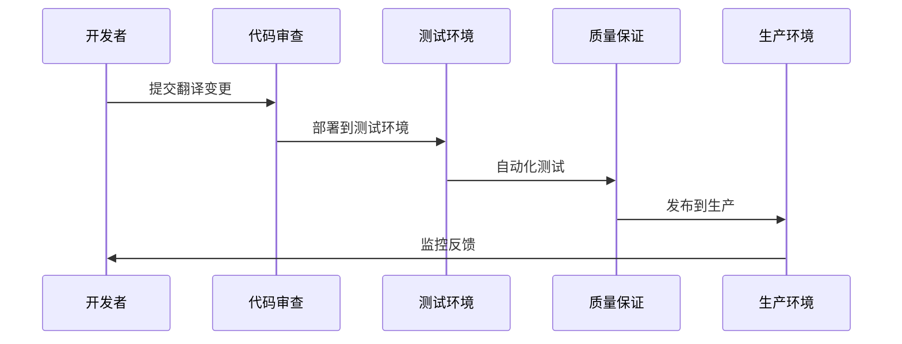

# 语言文件管理

<cite>
**本文档中引用的文件**
- [src/locales/index.ts](file://src/locales/index.ts)
- [src/locales/langs/en.json](file://src/locales/langs/en.json)
- [src/locales/langs/zh.json](file://src/locales/langs/zh.json)
- [src/enums/appEnum.ts](file://src/enums/appEnum.ts)
- [src/store/modules/user.ts](file://src/store/modules/user.ts)
- [src/utils/storage/storage-key-manager.ts](file://src/utils/storage/storage-key-manager.ts)
- [src/utils/storage/storage-config.ts](file://src/utils/storage/storage-config.ts)
- [package.json](file://package.json)
- [scripts/clean-dev.ts](file://scripts/clean-dev.ts)
</cite>

## 目录
1. [简介](#简介)
2. [项目架构概览](#项目架构概览)
3. [核心组件分析](#核心组件分析)
4. [语言文件结构](#语言文件结构)
5. [新增语言流程](#新增语言流程)
6. [命名约定与最佳实践](#命名约定与最佳实践)
7. [高级用例处理](#高级用例处理)
8. [质量保证与验证](#质量保证与验证)
9. [团队协作最佳实践](#团队协作最佳实践)
10. [故障排除指南](#故障排除指南)
11. [总结](#总结)

## 简介

本文档系统性地介绍了 Art Design Pro 项目中的语言文件管理系统。该系统基于 Vue I18n 实现，提供了完整的多语言国际化解决方案，支持中文和英文的无缝切换，并具备强大的扩展性和维护性。

### 主要特性

- **多语言支持**：内置中文（简体）和英文两种语言
- **运行时切换**：支持动态语言切换，无需页面刷新
- **持久化存储**：自动保存和恢复用户的语言偏好
- **类型安全**：提供完整的 TypeScript 类型支持
- **全局注入**：可在任何组件中直接使用翻译函数
- **灵活配置**：支持复杂的翻译键结构和参数插值

## 项目架构概览



**图表来源**
- [src/locales/index.ts](file://src/locales/index.ts#L1-L124)
- [src/enums/appEnum.ts](file://src/enums/appEnum.ts#L63-L71)

**章节来源**
- [src/locales/index.ts](file://src/locales/index.ts#L1-L124)
- [src/enums/appEnum.ts](file://src/enums/appEnum.ts#L63-L71)

## 核心组件分析

### 语言配置模块

语言系统的核心配置位于 [`src/locales/index.ts`](file://src/locales/index.ts)，它负责：

#### 1. 语言枚举定义
系统使用 `LanguageEnum` 枚举来标准化语言标识符：



**图表来源**
- [src/locales/index.ts](file://src/locales/index.ts#L97-L103)
- [src/enums/appEnum.ts](file://src/enums/appEnum.ts#L66-L71)

#### 2. 语言选项配置
[`languageOptions`](file://src/locales/index.ts#L51-L54) 数组定义了语言切换下拉框的选项：

| 属性 | 值 | 描述 |
|------|-----|------|
| value | LanguageEnum.ZH/EN | 语言标识符 |
| label | "简体中文"/"English" | 显示文本 |

#### 3. 默认语言获取机制
系统实现了智能的默认语言获取策略：



**图表来源**
- [src/locales/index.ts](file://src/locales/index.ts#L60-L91)

**章节来源**
- [src/locales/index.ts](file://src/locales/index.ts#L1-L124)
- [src/enums/appEnum.ts](file://src/enums/appEnum.ts#L63-L71)

## 语言文件结构

### JSON 文件格式

每个语言文件都采用层次化的 JSON 结构，支持嵌套组织复杂翻译内容。

#### 中文语言文件结构示例



**图表来源**
- [src/locales/langs/zh.json](file://src/locales/langs/zh.json#L1-L349)

#### 英文语言文件结构对比

英文语言文件遵循相同的结构模式，但包含对应的翻译文本。两个文件的键结构完全一致，确保翻译的一致性。

### 关键翻译模块

| 模块名称 | 功能描述 | 示例键 |
|----------|----------|--------|
| httpMsg | HTTP 错误消息 | `httpMsg.unauthorized` |
| topBar | 顶部栏功能 | `topBar.search.title` |
| common | 通用词汇 | `common.confirm` |
| login | 登录相关 | `login.title`, `login.btnText` |
| menus | 菜单导航 | `menus.dashboard.title` |
| setting | 设置面板 | `setting.basics.list.multiTab` |

**章节来源**
- [src/locales/langs/zh.json](file://src/locales/langs/zh.json#L1-L349)
- [src/locales/langs/en.json](file://src/locales/langs/en.json#L1-L349)

## 新增语言流程

### 完整操作步骤

#### 第一步：创建新的语言文件

1. **在 langs 目录下创建新文件**
   ```
   src/locales/langs/[languageCode].json
   ```
   例如：`src/locales/langs/fr.json`（法语）

2. **复制标准结构**
   从现有语言文件复制结构，保持键的一致性：
   ```json
   {
     "httpMsg": {},
     "topBar": {},
     "common": {},
     "login": {},
     "menus": {}
   }
   ```

3. **填充翻译内容**
   根据目标语言的语法和文化特点填写翻译文本。

#### 第二步：定义翻译键结构

推荐的键命名结构：



**图表来源**
- [src/locales/langs/zh.json](file://src/locales/langs/zh.json#L224-L229)

#### 第三步：在 i18n 配置中注册新语言

1. **导入语言文件**
   在 [`src/locales/index.ts`](file://src/locales/index.ts#L31-L32) 中添加：
   ```typescript
   import frMessages from './langs/fr.json'
   ```

2. **更新语言消息对象**
   修改 [`messages`](file://src/locales/index.ts#L42-L45) 对象：
   ```typescript
   const messages = {
     [LanguageEnum.EN]: enMessages,
     [LanguageEnum.ZH]: zhMessages,
     [LanguageEnum.FR]: frMessages
   }
   ```

3. **添加语言选项**
   更新 [`languageOptions`](file://src/locales/index.ts#L51-L54)：
   ```typescript
   export const languageOptions = [
     { value: LanguageEnum.ZH, label: '简体中文' },
     { value: LanguageEnum.EN, label: 'English' },
     { value: LanguageEnum.FR, label: 'Français' }
   ]
   ```

4. **更新 LanguageEnum**
   在 [`src/enums/appEnum.ts`](file://src/enums/appEnum.ts#L66-L71) 中添加：
   ```typescript
   export enum LanguageEnum {
     ZH = 'zh',
     EN = 'en',
     FR = 'fr'
   }
   ```

#### 第四步：测试新语言

1. **启动开发服务器**
   ```bash
   npm run dev
   ```

2. **验证语言切换**
   - 检查语言切换功能是否正常
   - 验证所有翻译键是否正确显示
   - 测试特殊字符和编码

**章节来源**
- [src/locales/index.ts](file://src/locales/index.ts#L30-L54)
- [src/enums/appEnum.ts](file://src/enums/appEnum.ts#L66-L71)

## 命名约定与最佳实践

### 键命名规范

#### 1. 模块前缀规则
使用清晰的模块前缀来组织翻译键：

```typescript
// 推荐：模块前缀 + 具体功能
"dashboard.title"        // 仪表盘标题
"login.form.username"    // 登录表单用户名
"settings.profile.email" // 设置-个人资料-邮箱

// 不推荐：过于宽泛的键名
"title"
"username"
"email"
```

#### 2. 嵌套结构原则
根据功能复杂度合理使用嵌套：



**图表来源**
- [src/locales/langs/zh.json](file://src/locales/langs/zh.json#L224-L229)

#### 3. 文化适应性考虑
- **日期格式**：使用目标语言的日期格式
- **货币符号**：使用正确的货币单位
- **称呼方式**：尊重当地的文化习惯

### 组织结构建议

| 模块类别 | 建议前缀 | 示例 |
|----------|----------|------|
| 页面标题 | `[page].title` | `dashboard.title` |
| 表单字段 | `[form].[field]` | `login.username` |
| 按钮文本 | `[action].[verb]` | `common.confirm` |
| 错误消息 | `error.[type]` | `error.validation` |
| 菜单项 | `menu.[category]` | `menu.userManagement` |

**章节来源**
- [src/locales/langs/zh.json](file://src/locales/langs/zh.json#L1-L349)
- [src/locales/langs/en.json](file://src/locales/langs/en.json#L1-L349)

## 高级用例处理

### 动态参数插值

#### 基本插值用法

```typescript
// 在组件中使用
$t('welcome.message', { name: '张三' })

// 翻译文件中的定义
{
  "welcome": {
    "message": "欢迎 {name} 使用系统"
  }
}
```

#### 复数形式处理

虽然当前系统主要使用简单替换，但可以通过以下方式实现复数：

```typescript
// 方法一：条件判断
$t('item.count', { count: itemCount }) // 简单替换

// 方法二：函数处理
const getItemText = (count: number) => {
  return count === 1 
    ? $t('item.singular') 
    : $t('item.plural', { count })
}
```

#### 上下文敏感翻译

```typescript
// 根据上下文提供不同翻译
const getActionText = (action: 'create' | 'edit' | 'delete') => {
  return $t(`action.${action}.title`)
}

// 翻译文件
{
  "action": {
    "create": {
      "title": "创建新项目"
    },
    "edit": {
      "title": "编辑项目"
    },
    "delete": {
      "title": "删除项目"
    }
  }
}
```

### 复杂嵌套结构

对于复杂的业务场景，可以使用更深层的嵌套：



**图表来源**
- [src/locales/langs/zh.json](file://src/locales/langs/zh.json#L290-L304)

### 条件翻译

```typescript
// 根据条件选择翻译
const getGreeting = (time: string) => {
  const greetingKey = `greeting.${time}`
  return $t(greetingKey) || $t('greeting.default')
}
```

**章节来源**
- [src/locales/index.ts](file://src/locales/index.ts#L117-L122)

## 质量保证与验证

### 自动化验证脚本

基于项目中的清理脚本，我们可以开发专门的语言文件验证工具：

#### 键一致性检查

```typescript
// 验证脚本示例
async function validateLanguageConsistency() {
  const languages = ['zh', 'en'] // 添加新语言
  
  const baseLang = await loadLanguageFile(languages[0])
  const errors = []
  
  for (let i = 1; i < languages.length; i++) {
    const currentLang = await loadLanguageFile(languages[i])
    const missingKeys = findMissingKeys(baseLang, currentLang)
    
    if (missingKeys.length > 0) {
      errors.push({
        language: languages[i],
        missingKeys
      })
    }
  }
  
  return errors
}
```

#### 脚本执行流程



**图表来源**
- [scripts/clean-dev.ts](file://scripts/clean-dev.ts#L436-L485)

### 手动验证清单

#### 1. 结构完整性检查
- [ ] 所有必需模块都有对应翻译
- [ ] 嵌套层级一致
- [ ] 键名拼写正确

#### 2. 内容准确性验证
- [ ] 翻译语义准确
- [ ] 文化适应性良好
- [ ] 术语使用一致

#### 3. 技术层面检查
- [ ] JSON 格式正确
- [ ] 字符编码无误
- [ ] 特殊字符处理

### 持续集成集成

建议在 CI/CD 流程中添加语言验证步骤：

```yaml
# GitHub Actions 示例
name: Language Validation
on: [push, pull_request]
jobs:
  validate-languages:
    runs-on: ubuntu-latest
    steps:
      - uses: actions/checkout@v2
      - name: Install dependencies
        run: npm install
      - name: Run language validation
        run: npm run validate-languages
```

**章节来源**
- [scripts/clean-dev.ts](file://scripts/clean-dev.ts#L436-L485)

## 团队协作最佳实践

### 分工协作模式

#### 1. 翻译负责人制度



#### 2. 版本控制策略

| 状态 | 分支策略 | 合并要求 |
|------|----------|----------|
| 开发中 | feature/i18n-new-lang | 单人审查 |
| 测试阶段 | develop | 团队审查 |
| 生产发布 | main | 完整测试 |

#### 3. 会议与沟通

- **周会**：讨论翻译进度和问题
- **月度**：评估翻译质量和文化适应性
- **紧急**：即时沟通重要变更

### 文档维护规范

#### 1. 翻译键文档

```markdown
# 翻译键文档

## 用户管理模块
- `user.title`: 用户管理页面标题
- `user.addUser`: 添加用户按钮文本
- `user.deleteConfirm`: 删除确认提示

## 系统设置模块
- `settings.title`: 系统设置页面标题
- `settings.language`: 语言设置选项
```

#### 2. 变更日志

```markdown
# 语言文件变更日志

## v1.2.0
- 新增法语支持 (fr)
- 更新登录页面翻译
- 修复菜单项重复问题

## v1.1.0
- 新增西班牙语支持 (es)
- 优化表格相关翻译
```

### 质量保证流程

#### 1. 多重验证机制



#### 2. 回归测试清单

- [ ] 语言切换功能正常
- [ ] 所有页面翻译完整
- [ ] 特殊字符显示正确
- [ ] RTL 语言支持（如适用）

**章节来源**
- [src/locales/index.ts](file://src/locales/index.ts#L1-L124)
- [src/store/modules/user.ts](file://src/store/modules/user.ts#L1-L235)

## 故障排除指南

### 常见问题及解决方案

#### 1. 语言切换失效

**症状**：点击语言切换按钮无反应

**排查步骤**：
1. 检查 `languageOptions` 配置
2. 验证 `LanguageEnum` 枚举定义
3. 确认存储键管理器正常工作

**解决方案**：
```typescript
// 检查语言选项配置
console.log(languageOptions)

// 检查当前语言设置
console.log(i18n.global.locale.value)
```

#### 2. 翻译键缺失

**症状**：显示原始键名而非翻译文本

**排查步骤**：
1. 检查 JSON 文件语法
2. 验证键名拼写
3. 确认文件导入路径

**解决方案**：
```typescript
// 使用调试函数检查可用键
function debugTranslations() {
  const translations = i18n.global.messages
  console.log('可用翻译:', Object.keys(translations))
}
```

#### 3. 存储问题

**症状**：语言偏好无法保存或恢复

**排查步骤**：
1. 检查 localStorage 访问权限
2. 验证存储键格式
3. 确认数据序列化正确

**解决方案**：
```typescript
// 检查存储状态
const storageKey = storageKeyManager.getStorageKey('user')
const storedData = localStorage.getItem(storageKey)
console.log('存储数据:', storedData)
```

### 性能优化建议

#### 1. 懒加载策略

```typescript
// 按需加载语言文件
const loadLanguageAsync = async (lang: string) => {
  const module = await import(`./langs/${lang}.json`)
  return module.default
}
```

#### 2. 缓存机制

```typescript
// 实现翻译缓存
const translationCache = new Map()

const getCachedTranslation = (key: string) => {
  const cacheKey = `${i18n.global.locale.value}:${key}`
  if (!translationCache.has(cacheKey)) {
    translationCache.set(cacheKey, $t(key))
  }
  return translationCache.get(cacheKey)
}
```

### 调试工具

#### 1. 翻译调试器

```typescript
// 开发环境下的翻译调试工具
if (process.env.NODE_ENV === 'development') {
  window.__DEBUG_TRANSLATIONS__ = {
    getAllKeys: () => Object.keys(i18n.global.messages),
    getMissingKeys: (baseLang: string) => {
      // 实现缺失键检测逻辑
    },
    validateStructure: () => {
      // 实现结构验证逻辑
    }
  }
}
```

**章节来源**
- [src/locales/index.ts](file://src/locales/index.ts#L60-L91)
- [src/utils/storage/storage-key-manager.ts](file://src/utils/storage/storage-key-manager.ts#L53-L97)

## 总结

Art Design Pro 的语言文件管理系统提供了完整而灵活的国际化解决方案。通过本文档的详细介绍，开发者可以：

### 核心优势

1. **易于扩展**：新增语言只需创建 JSON 文件并更新配置
2. **类型安全**：完整的 TypeScript 支持确保开发时的类型检查
3. **持久化支持**：自动保存用户语言偏好，提升用户体验
4. **结构化组织**：清晰的键命名规范和嵌套结构便于维护

### 最佳实践要点

- 遵循模块前缀和层级结构的命名约定
- 保持翻译键的一致性和完整性
- 建立完善的验证和测试流程
- 实施团队协作和文档维护规范

### 未来发展建议

1. **自动化工具**：开发更多自动化验证和同步工具
2. **机器翻译集成**：考虑与翻译服务的集成
3. **实时预览**：提供在线翻译预览功能
4. **社区贡献**：建立开源翻译贡献机制

通过持续的优化和改进，这个语言文件管理系统将为项目的全球化发展提供坚实的基础支撑。