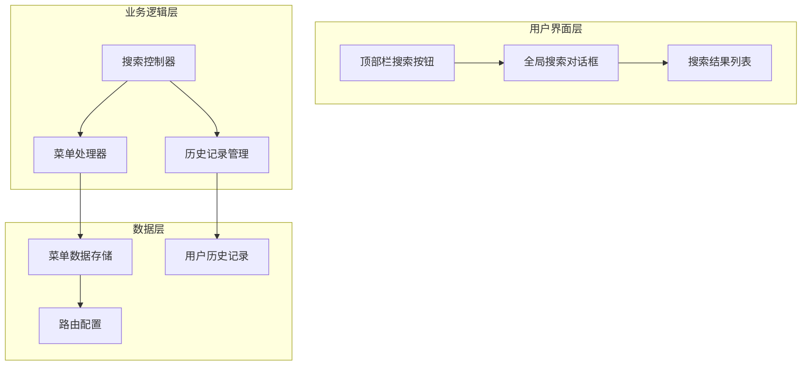
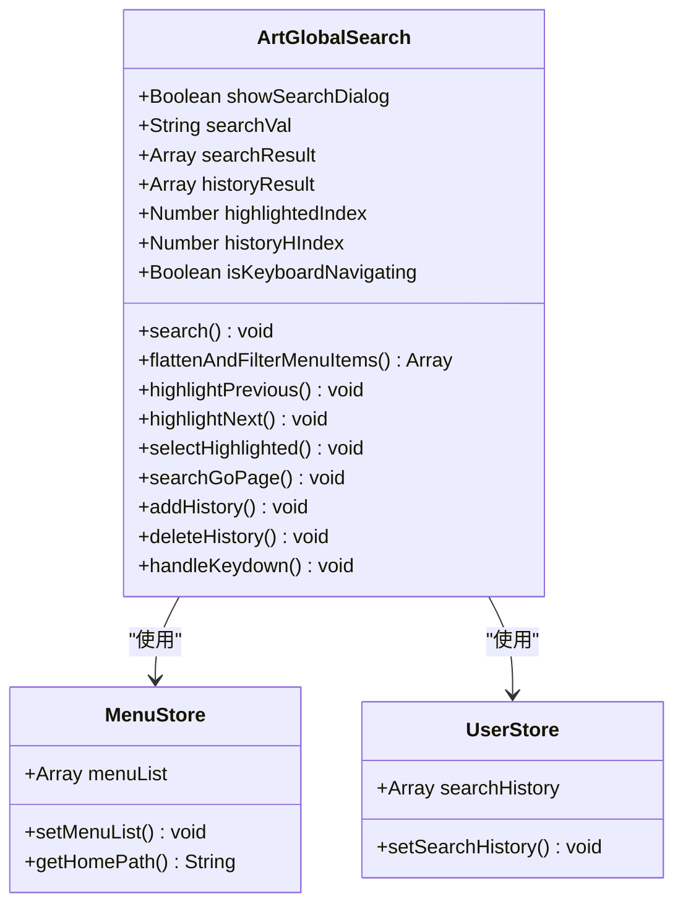
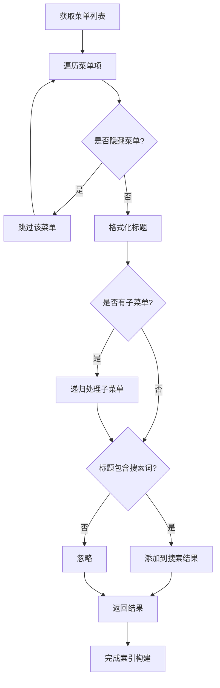
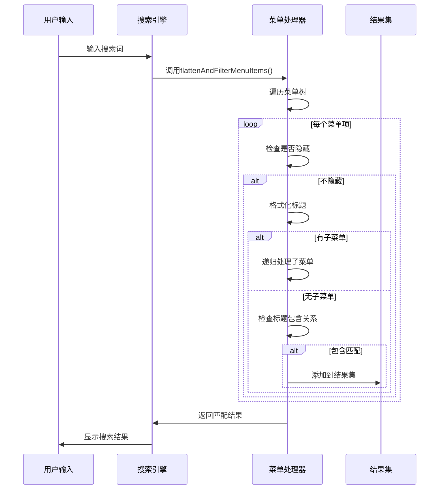
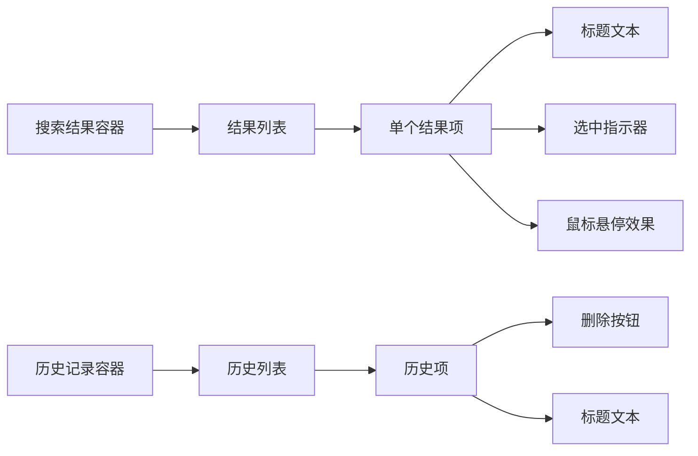
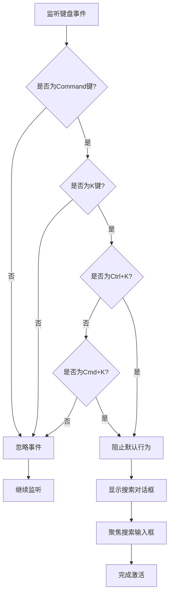
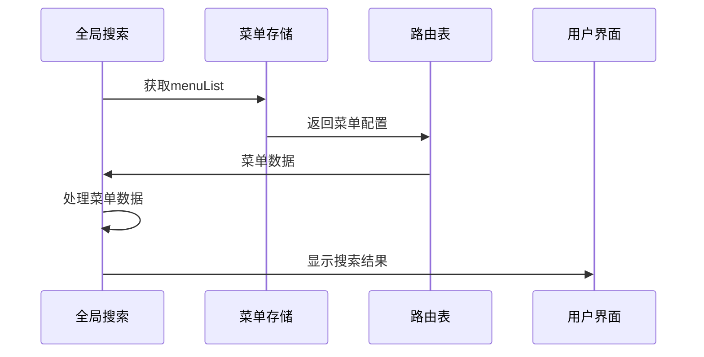
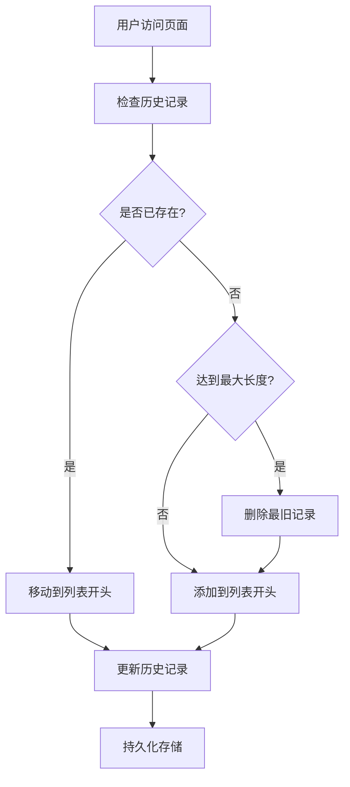

# 全局搜索

<cite>
**本文档引用的文件**
- [src/components/core/layouts/art-global-search/index.vue](file://src/components/core/layouts/art-global-search/index.vue)
- [src/components/core/layouts/art-header-bar/index.vue](file://src/components/core/layouts/art-header-bar/index.vue)
- [src/store/modules/menu.ts](file://src/store/modules/menu.ts)
- [src/store/modules/user.ts](file://src/store/modules/user.ts)
- [src/utils/router.ts](file://src/utils/router.ts)
- [src/locales/langs/zh.json](file://src/locales/langs/zh.json)
- [src/locales/langs/en.json](file://src/locales/langs/en.json)
- [src/types/router/index.ts](file://src/types/router/index.ts)
</cite>

## 目录
1. [简介](#简介)
2. [项目架构](#项目架构)
3. [核心组件分析](#核心组件分析)
4. [搜索索引构建](#搜索索引构建)
5. [模糊匹配算法](#模糊匹配算法)
6. [搜索结果展示](#搜索结果展示)
7. [快捷键激活机制](#快捷键激活机制)
8. [与路由系统的集成](#与路由系统的集成)
9. [搜索历史管理](#搜索历史管理)
10. [国际化支持](#国际化支持)
11. [性能优化策略](#性能优化策略)
12. [故障排除指南](#故障排除指南)
13. [扩展建议](#扩展建议)

## 简介

全局搜索功能是 Art Design Pro 后台管理系统的核心特性之一，它为用户提供了一个统一的页面导航入口。该功能通过快捷键激活，支持实时搜索、历史记录管理和键盘导航，能够快速定位系统中的各种页面和功能模块。

### 主要特性

- **快捷键激活**：支持 Ctrl+K（Windows）或 Cmd+K（Mac）快速打开搜索框
- **实时搜索**：输入即搜索，提供即时反馈
- **智能匹配**：基于菜单标题的模糊匹配算法
- **历史记录**：自动保存最近访问的页面
- **键盘导航**：支持方向键和回车键进行快速选择
- **国际化支持**：支持中英文界面切换
- **响应式设计**：适配不同屏幕尺寸

## 项目架构

全局搜索功能采用模块化架构设计，主要由以下几个部分组成：



**图表来源**
- [src/components/core/layouts/art-header-bar/index.vue](file://src/components/core/layouts/art-header-bar/index.vue#L65-L78)
- [src/components/core/layouts/art-global-search/index.vue](file://src/components/core/layouts/art-global-search/index.vue#L1-L427)

## 核心组件分析

### 全局搜索组件 (ArtGlobalSearch)

全局搜索组件是整个功能的核心，负责处理搜索逻辑、结果显示和用户交互。

#### 组件结构



**图表来源**
- [src/components/core/layouts/art-global-search/index.vue](file://src/components/core/layouts/art-global-search/index.vue#L96-L361)
- [src/store/modules/menu.ts](file://src/store/modules/menu.ts#L41-L109)
- [src/store/modules/user.ts](file://src/store/modules/user.ts#L50-L236)

#### 关键属性和方法

| 属性/方法 | 类型 | 描述 |
|-----------|------|------|
| `showSearchDialog` | Boolean | 控制搜索对话框的显示状态 |
| `searchVal` | String | 用户输入的搜索关键词 |
| `searchResult` | Array | 搜索结果列表 |
| `historyResult` | Array | 搜索历史记录 |
| `highlightedIndex` | Number | 当前高亮的搜索结果索引 |
| `historyHIndex` | Number | 当前高亮的历史记录索引 |
| `search()` | Function | 执行搜索操作 |
| `flattenAndFilterMenuItems()` | Function | 展平并过滤菜单项 |
| `highlightPrevious()` | Function | 高亮上一个结果 |
| `highlightNext()` | Function | 高亮下一个结果 |

**章节来源**
- [src/components/core/layouts/art-global-search/index.vue](file://src/components/core/layouts/art-global-search/index.vue#L111-L122)

## 搜索索引构建

### 菜单数据结构

全局搜索功能基于系统的菜单数据构建搜索索引。菜单数据通过 `menuList` 存储，每个菜单项包含以下关键信息：

| 字段 | 类型 | 描述 |
|------|------|------|
| `path` | String | 页面路由路径 |
| `meta.title` | String | 菜单显示标题 |
| `meta.isHide` | Boolean | 是否隐藏菜单 |
| `children` | Array | 子菜单列表 |

### 索引构建过程



**图表来源**
- [src/components/core/layouts/art-global-search/index.vue](file://src/components/core/layouts/art-global-search/index.vue#L178-L199)

**章节来源**
- [src/components/core/layouts/art-global-search/index.vue](file://src/components/core/layouts/art-global-search/index.vue#L178-L199)

## 模糊匹配算法

### 匹配逻辑实现

全局搜索采用简单的字符串包含匹配算法，具有以下特点：

1. **大小写不敏感**：将搜索词和菜单标题都转换为小写进行比较
2. **精确匹配**：使用 `String.prototype.includes()` 方法进行字符串包含检查
3. **递归处理**：支持多级菜单的深度搜索

### 匹配算法流程



**图表来源**
- [src/components/core/layouts/art-global-search/index.vue](file://src/components/core/layouts/art-global-search/index.vue#L178-L199)

### 性能考虑

当前实现采用线性扫描算法，对于大型菜单系统可能存在性能瓶颈。建议的优化方案：

- **索引预构建**：在应用启动时构建完整的搜索索引
- **分词处理**：对菜单标题进行分词处理，支持更灵活的匹配
- **缓存机制**：缓存搜索结果，减少重复计算

**章节来源**
- [src/components/core/layouts/art-global-search/index.vue](file://src/components/core/layouts/art-global-search/index.vue#L178-L199)

## 搜索结果展示

### 结果展示结构

搜索结果以列表形式展示，包含以下元素：



**图表来源**
- [src/components/core/layouts/art-global-search/index.vue](file://src/components/core/layouts/art-global-search/index.vue#L30-L72)

### 高亮显示机制

系统实现了智能高亮显示机制：

| 状态 | 样式类 | 效果 |
|------|--------|------|
| 默认 | `bg-g-200/80` | 浅灰色背景 |
| 鼠标悬停 | `highlighted !bg-theme/70 !text-white` | 主题色高亮 |
| 键盘选中 | `highlighted !bg-theme/70 !text-white` | 主题色高亮 |
| 删除按钮 | `[&_.selected-icon]:!text-white` | 白色图标 |

### 滚动同步

当用户使用键盘导航时，系统会自动滚动到当前高亮项的位置，确保用户始终能看到选中的结果。

**章节来源**
- [src/components/core/layouts/art-global-search/index.vue](file://src/components/core/layouts/art-global-search/index.vue#L37-L44)
- [src/components/core/layouts/art-global-search/index.vue](file://src/components/core/layouts/art-global-search/index.vue#L233-L280)

## 快捷键激活机制

### 快捷键配置

全局搜索支持跨平台的快捷键激活：

| 平台 | 快捷键 | 功能 |
|------|--------|------|
| Windows/Linux | `Ctrl+K` | 打开搜索对话框 |
| macOS | `Cmd+K` | 打开搜索对话框 |

### 快捷键处理流程



**图表来源**
- [src/components/core/layouts/art-global-search/index.vue](file://src/components/core/layouts/art-global-search/index.vue#L135-L160)

### 键盘导航支持

搜索对话框支持完整的键盘导航：

| 键盘操作 | 功能 | 实现方法 |
|----------|------|----------|
| `↑` | 上一个结果 | `highlightPrevious()` |
| `↓` | 下一个结果 | `highlightNext()` |
| `Enter` | 选择当前结果 | `selectHighlighted()` |
| `Esc` | 关闭对话框 | `showSearchDialog = false` |

**章节来源**
- [src/components/core/layouts/art-global-search/index.vue](file://src/components/core/layouts/art-global-search/index.vue#L135-L160)

## 与路由系统的集成

### 路由数据获取

全局搜索功能通过 `useMenuStore` 获取路由数据：



**图表来源**
- [src/components/core/layouts/art-global-search/index.vue](file://src/components/core/layouts/art-global-search/index.vue#L109-L110)

### 路由跳转机制

当用户选择搜索结果时，系统执行以下步骤：

1. **关闭搜索对话框**：`showSearchDialog.value = false`
2. **添加到历史记录**：`addHistory(item)`
3. **路由跳转**：`router.push(item.path)`
4. **重置搜索状态**：清空搜索词和结果

### 路由权限控制

搜索功能会自动过滤掉没有权限访问的页面，确保用户只能搜索和访问有权限的页面。

**章节来源**
- [src/components/core/layouts/art-global-search/index.vue](file://src/components/core/layouts/art-global-search/index.vue#L299-L304)

## 搜索历史管理

### 历史记录存储

搜索历史记录存储在用户状态管理中，具有以下特性：

| 特性 | 实现方式 | 限制 |
|------|----------|------|
| 持久化 | LocalStorage | 页面刷新后保留 |
| 最大长度 | 10条 | 自动清理最旧记录 |
| 数据结构 | AppRouteRecord | 与菜单数据兼容 |
| 清理机制 | FIFO | 先进先出原则 |

### 历史记录管理流程



**图表来源**
- [src/components/core/layouts/art-global-search/index.vue](file://src/components/core/layouts/art-global-search/index.vue#L314-L329)

### 历史记录操作

| 操作 | 方法 | 功能 |
|------|------|------|
| 添加 | `addHistory()` | 将页面添加到历史记录 |
| 删除 | `deleteHistory()` | 从历史记录中删除 |
| 更新 | `updateHistory()` | 持久化历史记录变更 |
| 清理 | 自动清理 | 超过最大长度时自动清理 |

**章节来源**
- [src/components/core/layouts/art-global-search/index.vue](file://src/components/core/layouts/art-global-search/index.vue#L307-L335)

## 国际化支持

### 多语言配置

全局搜索功能支持中英文两种语言界面：

| 界面元素 | 中文 | 英文 |
|----------|------|------|
| 占位符 | "搜索页面" | "Search page" |
| 历史标题 | "搜索历史" | "Search history" |
| 切换说明 | "切换" | "Navigate" |
| 选择说明 | "选择" | "Select" |
| 关闭说明 | "关闭" | "Close" |

### 国际化实现

```mermaid
graph LR
A[用户语言设置] --> B[翻译键值]
B --> C[$t()翻译函数]
C --> D[显示对应语言文本]
E[搜索历史] --> F[格式化菜单标题]
F --> G[国际化标题]
G --> H[显示给用户]
```

**图表来源**
- [src/locales/langs/zh.json](file://src/locales/langs/zh.json#L41-L46)
- [src/locales/langs/en.json](file://src/locales/langs/en.json#L41-L46)

### 标题格式化

系统使用 `formatMenuTitle` 函数处理菜单标题的国际化：

- 检查标题是否以 `menus.` 开头
- 使用 `$t()` 函数进行翻译
- 如果翻译不存在，返回标题的最后一部分

**章节来源**
- [src/utils/router.ts](file://src/utils/router.ts#L47-L61)

## 性能优化策略

### 当前性能状况

全局搜索功能在小型到中型应用中表现良好，但在以下方面可能存在性能瓶颈：

1. **大数据量菜单**：菜单项数量超过1000时可能出现延迟
2. **频繁搜索**：连续搜索可能导致内存占用增加
3. **复杂标题**：包含大量特殊字符的标题可能影响匹配速度

### 优化建议

#### 1. 索引预构建

```typescript
// 预构建搜索索引
const buildSearchIndex = (menuList: AppRouteRecord[]): SearchIndex => {
    const index: SearchIndex = {};
    
    const traverseMenu = (item: AppRouteRecord) => {
        if (!item.meta?.isHide && item.meta?.title) {
            const title = formatMenuTitle(item.meta.title).toLowerCase();
            const path = item.path;
            
            // 基础匹配
            if (path) {
                index[path] = { title, path };
            }
            
            // 分词匹配（可选）
            const tokens = title.split(/\s+/);
            tokens.forEach(token => {
                if (token.length > 1) {
                    if (!index[token]) {
                        index[token] = [];
                    }
                    index[token].push({ title, path });
                }
            });
        }
        
        if (item.children && item.children.length > 0) {
            item.children.forEach(traverseMenu);
        }
    };
    
    menuList.forEach(traverseMenu);
    return index;
};
```

#### 2. 智能防抖

```typescript
// 智能防抖搜索
const smartDebounceSearch = (callback: Function, delay: number = 300) => {
    let timer: ReturnType<typeof setTimeout>;
    let lastArgs: any[];
    
    return (...args: any[]) => {
        lastArgs = args;
        
        clearTimeout(timer);
        timer = setTimeout(() => {
            callback(...lastArgs);
        }, delay);
    };
};
```

#### 3. 虚拟滚动

对于大量搜索结果，可以考虑使用虚拟滚动技术：

```typescript
// 虚拟滚动配置
const virtualScrollConfig = {
    itemHeight: 48, // 每个结果项的高度
    visibleItems: 10, // 可见项数量
    threshold: 200, // 预加载阈值
};
```

### 内存管理

- **及时清理**：搜索完成后及时清理搜索结果
- **弱引用**：对大型数据结构使用弱引用
- **懒加载**：按需加载搜索索引

## 故障排除指南

### 常见问题及解决方案

#### 1. 搜索无结果

**症状**：输入关键词但没有搜索结果

**可能原因**：
- 菜单数据为空或未正确加载
- 搜索词包含特殊字符
- 菜单项被设置为隐藏

**解决方案**：
```typescript
// 检查菜单数据
console.log('菜单数据:', menuList.value);

// 检查搜索词处理
const debugSearch = (term: string) => {
    const lowerTerm = term.toLowerCase();
    console.log('搜索词:', term);
    console.log('处理后:', lowerTerm);
};

// 检查菜单项过滤
const checkMenuItem = (item: AppRouteRecord) => {
    console.log('菜单项:', {
        title: item.meta?.title,
        isHide: item.meta?.isHide,
        path: item.path,
        hasChildren: !!item.children
    });
};
```

#### 2. 快捷键无响应

**症状**：按下 Ctrl+K 或 Cmd+K 无反应

**可能原因**：
- 事件监听器未正确绑定
- 其他组件阻止了键盘事件
- 浏览器安全设置限制

**解决方案**：
```typescript
// 检查事件监听器
console.log('事件监听器状态:', document.hasEventListener('keydown'));

// 检查事件冒泡
document.addEventListener('keydown', (e) => {
    console.log('键盘事件:', {
        key: e.key,
        ctrlKey: e.ctrlKey,
        metaKey: e.metaKey,
        preventDefault: e.preventDefault
    });
});
```

#### 3. 搜索历史不显示

**症状**：访问页面后历史记录不更新

**可能原因**：
- 用户状态未正确保存
- 历史记录存储失败
- 权限问题

**解决方案**：
```typescript
// 检查用户状态
console.log('用户状态:', userStore.$state);

// 检查历史记录
console.log('搜索历史:', userStore.searchHistory);

// 检查本地存储
console.log('LocalStorage:', localStorage.getItem('user'));
```

#### 4. 性能问题

**症状**：搜索响应缓慢，界面卡顿

**可能原因**：
- 菜单数据过大
- 匹配算法效率低
- DOM 操作过多

**解决方案**：
```typescript
// 性能监控
const performanceMonitor = {
    startTime: 0,
    
    start() {
        this.startTime = performance.now();
    },
    
    end(label: string) {
        const duration = performance.now() - this.startTime;
        console.log(`${label} 耗时: ${duration.toFixed(2)}ms`);
    }
};

// 优化搜索逻辑
const optimizedSearch = (term: string) => {
    performanceMonitor.start();
    
    const results = flattenAndFilterMenuItems(menuList.value, term);
    
    performanceMonitor.end('搜索');
    return results;
};
```

### 调试工具

#### 1. 搜索调试面板

```typescript
// 调试面板组件
const SearchDebugger = {
    template: `
        <div class="search-debugger">
            <h3>搜索调试</h3>
            <pre>{{ debugInfo }}</pre>
        </div>
    `,
    
    setup() {
        const debugInfo = computed(() => ({
            menuCount: menuList.value.length,
            searchResults: searchResult.value.length,
            historyCount: historyResult.value.length,
            searchTime: searchTime.value,
            memoryUsage: performance.memory?.usedJSHeapSize
        }));
        
        return { debugInfo };
    }
};
```

#### 2. 性能分析

```typescript
// 性能分析工具
const performanceAnalyzer = {
    analyzeSearchPerformance() {
        const results = [];
        
        for (let i = 0; i < 10; i++) {
            const start = performance.now();
            search('test');
            const end = performance.now();
            
            results.push(end - start);
        }
        
        return {
            average: results.reduce((a, b) => a + b) / results.length,
            min: Math.min(...results),
            max: Math.max(...results)
        };
    }
};
```

## 扩展建议

### 1. 增强搜索功能

#### 多维度搜索

```typescript
interface SearchCriteria {
    title: string;
    path: string;
    tags: string[];
    category: string;
}

const enhancedSearch = (criteria: SearchCriteria): SearchResult[] => {
    return menuList.value.flatMap(group => 
        group.items.filter(item => 
            matchesCriteria(item, criteria)
        )
    );
};

const matchesCriteria = (item: MenuItem, criteria: SearchCriteria): boolean => {
    const { title, path, tags, category } = criteria;
    
    return (
        item.title.toLowerCase().includes(title.toLowerCase()) &&
        (!path || item.path.includes(path)) &&
        (!tags || tags.every(tag => item.tags?.includes(tag))) &&
        (!category || item.category === category)
    );
};
```

#### 智能推荐

```typescript
const searchRecommendations = (searchTerm: string): Recommendation[] => {
    const recommendations: Recommendation[] = [];
    
    // 基于历史记录推荐
    const recentItems = userStore.searchHistory.slice(0, 3);
    recommendations.push(...recentItems);
    
    // 基于相似度推荐
    const similarItems = findSimilarItems(searchTerm);
    recommendations.push(...similarItems);
    
    // 去重
    return Array.from(new Set(recommendations));
};
```

### 2. 集成外部搜索

#### Elasticsearch 集成

```typescript
const elasticsearchSearch = async (query: string): Promise<SearchResult[]> => {
    try {
        const response = await axios.post('/api/search', {
            query,
            size: 10,
            fields: ['title', 'content', 'tags', 'path']
        });
        
        return response.data.hits.map(hit => ({
            title: hit._source.title,
            path: hit._source.path,
            score: hit._score,
            snippet: hit.highlight?.content || hit._source.content.substring(0, 200)
        }));
    } catch (error) {
        console.error('Elasticsearch 搜索失败:', error);
        return [];
    }
};
```

#### AI 辅助搜索

```typescript
const aiAssistedSearch = async (query: string): Promise<SearchResult[]> => {
    const embeddings = await generateEmbeddings(query);
    
    const results = await vectorSearch(embeddings);
    
    return results.map(result => ({
        ...result,
        relevanceScore: calculateRelevanceScore(query, result)
    })).sort((a, b) => b.relevanceScore - a.relevanceScore);
};
```

### 3. 个性化定制

#### 用户偏好学习

```typescript
const userPreferenceLearning = {
    recordUserBehavior(searchTerm: string, clickedItem: string) {
        const preference = this.getUserPreference(searchTerm);
        preference.clicks[clickedItem] = (preference.clicks[clickedItem] || 0) + 1;
        preference.lastUsed = Date.now();
        
        this.saveUserPreference(searchTerm, preference);
    },
    
    getPersonalizedResults(searchTerm: string): SearchResult[] {
        const preference = this.getUserPreference(searchTerm);
        const baseResults = this.basicSearch(searchTerm);
        
        return baseResults.sort((a, b) => {
            const aScore = preference.clicks[a.path] || 0;
            const bScore = preference.clicks[b.path] || 0;
            return bScore - aScore;
        });
    }
};
```

#### 主题化配置

```typescript
const searchThemeConfig = {
    light: {
        backgroundColor: '#ffffff',
        textColor: '#333333',
        highlightColor: '#1890ff',
        borderColor: '#d9d9d9'
    },
    
    dark: {
        backgroundColor: '#1f1f1f',
        textColor: '#ffffff',
        highlightColor: '#1890ff',
        borderColor: '#404040'
    }
};
```

### 4. 移动端优化

#### 触摸友好的界面

```typescript
const mobileOptimizedSearch = {
    touchThreshold: 10,
    
    handleTouchStart(event: TouchEvent) {
        this.touchStart = {
            x: event.touches[0].clientX,
            y: event.touches[0].clientY
        };
    },
    
    handleTouchEnd(event: TouchEvent) {
        const touchEnd = {
            x: event.changedTouches[0].clientX,
            y: event.changedTouches[0].clientY
        };
        
        const deltaX = touchEnd.x - this.touchStart.x;
        const deltaY = touchEnd.y - this.touchStart.y;
        
        if (Math.abs(deltaX) > this.touchThreshold) {
            // 水平滑动
            this.handleSwipe(deltaX > 0 ? 'right' : 'left');
        } else if (Math.abs(deltaY) > this.touchThreshold) {
            // 垂直滑动
            this.handleSwipe(deltaY > 0 ? 'down' : 'up');
        }
    }
};
```

#### 响应式设计

```typescript
const responsiveSearch = {
    getSearchConfig(): SearchConfig {
        const width = window.innerWidth;
        
        return {
            dialogWidth: width < 768 ? '100%' : '600px',
            maxHeight: width < 768 ? '60vh' : '370px',
            itemHeight: width < 768 ? 56 : 48,
            maxResults: width < 768 ? 5 : 10
        };
    }
};
```

通过这些扩展建议，全局搜索功能可以进一步提升用户体验，适应更多使用场景，并为未来的功能增强奠定基础。