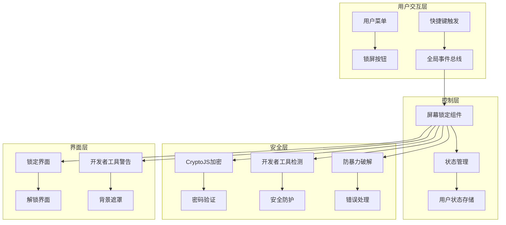
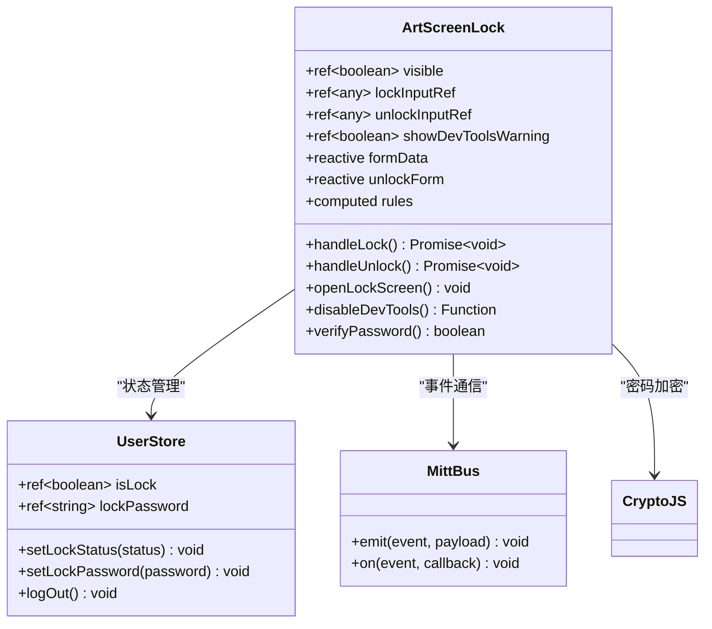
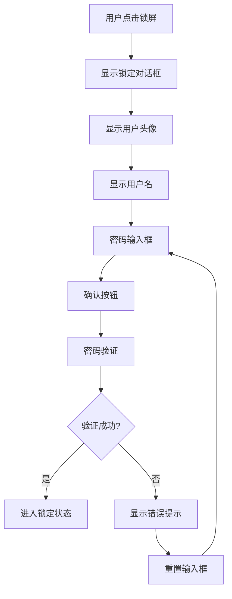
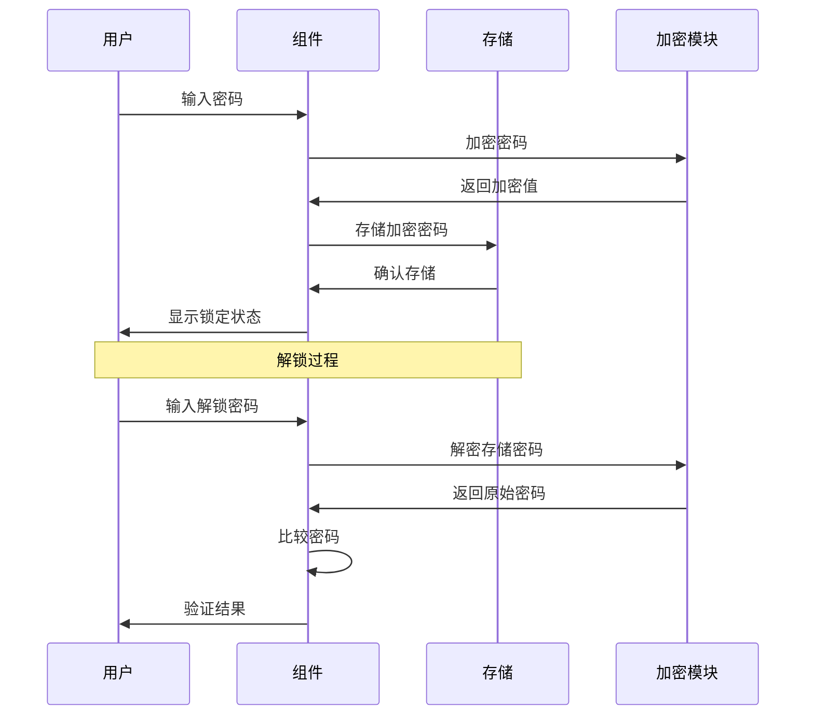
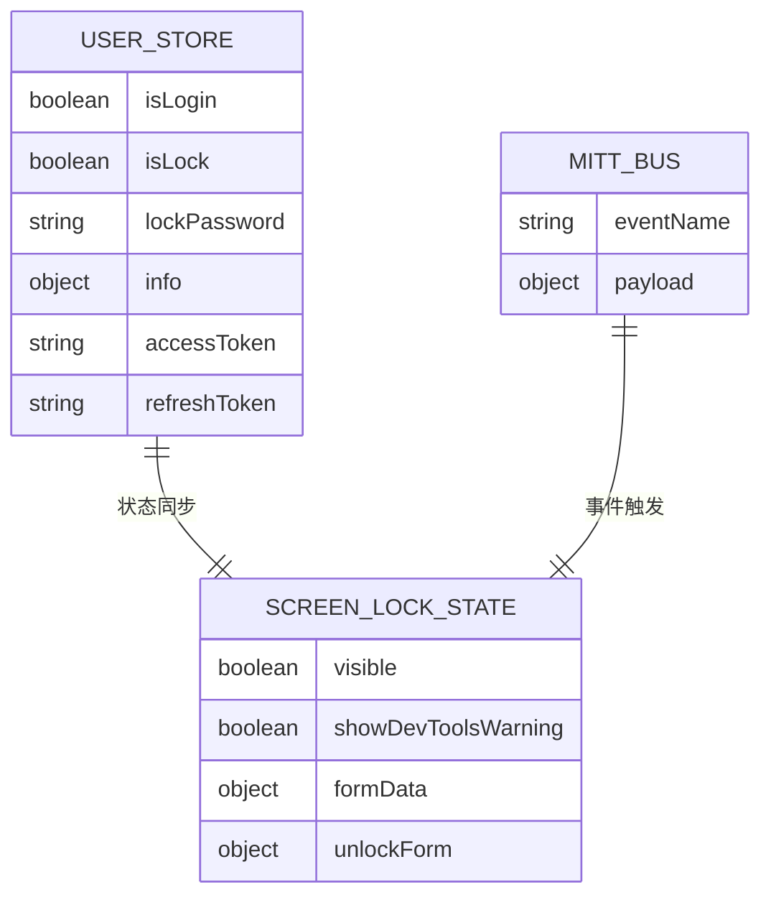
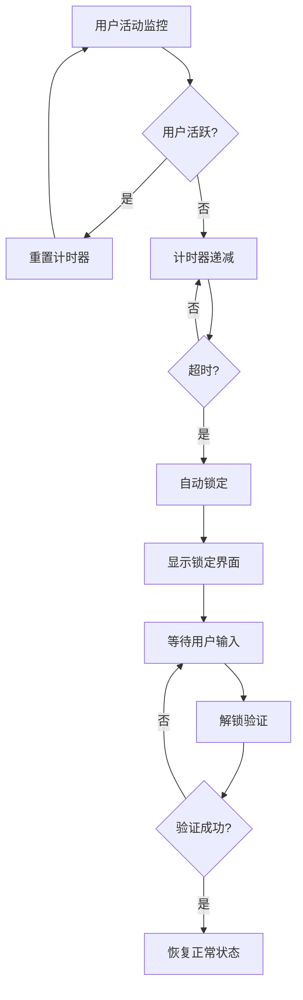
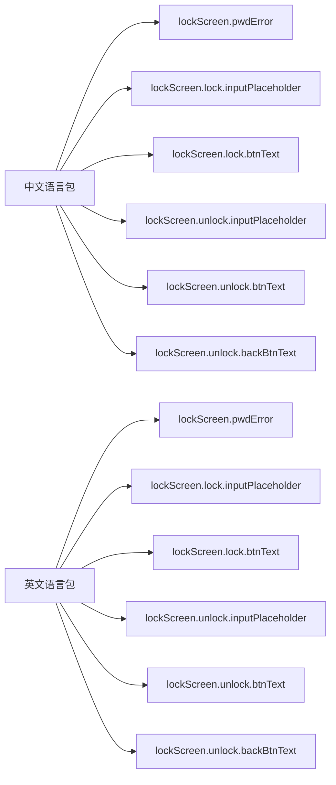

# 屏幕锁定功能技术文档

<cite>
**本文档引用的文件**
- [src/components/core/layouts/art-screen-lock/index.vue](file://src/components/core/layouts/art-screen-lock/index.vue)
- [src/store/modules/user.ts](file://src/store/modules/user.ts)
- [src/utils/sys/mittBus.ts](file://src/utils/sys/mittBus.ts)
- [src/components/core/layouts/art-header-bar/widget/ArtUserMenu.vue](file://src/components/core/layouts/art-header-bar/widget/ArtUserMenu.vue)
- [src/locales/langs/zh.json](file://src/locales/langs/zh.json)
- [src/components/core/layouts/art-header-bar/index.vue](file://src/components/core/layouts/art-header-bar/index.vue)
- [src/config/modules/headerBar.ts](file://src/config/modules/headerBar.ts)
</cite>

## 目录
1. [功能概述](#功能概述)
2. [架构设计](#架构设计)
3. [核心组件分析](#核心组件分析)
4. [用户界面设计](#用户界面设计)
5. [安全机制](#安全机制)
6. [状态管理](#状态管理)
7. [触发机制](#触发机制)
8. [配置选项](#配置选项)
9. [安全性考虑](#安全性考虑)
10. [故障排除](#故障排除)

## 功能概述

屏幕锁定功能是一个重要的安全特性，旨在保护用户在离开工作区域时的数据安全。该功能提供手动锁定和自动锁定两种触发方式，并具备强大的安全防护机制。

### 主要安全目的
- **数据保护**：防止未经授权的访问
- **会话安全**：保护用户的登录状态
- **隐私保护**：隐藏敏感信息
- **物理安全**：应对用户离开场景

### 使用场景
- 用户离开工作台时手动锁定
- 系统空闲超时自动锁定
- 开发者工具检测到异常时强制锁定
- 紧急情况下快速锁定

## 架构设计

屏幕锁定功能采用模块化架构设计，主要由以下几个层次组成：

**架构图来源**
- [src/components/core/layouts/art-screen-lock/index.vue](file://src/components/core/layouts/art-screen-lock/index.vue#L1-L486)
- [src/utils/sys/mittBus.ts](file://src/utils/sys/mittBus.ts#L1-L64)

## 核心组件分析

### 屏幕锁定组件 (ArtScreenLock)

屏幕锁定组件是整个功能的核心，负责管理锁定状态、用户界面和安全验证。

#### 组件结构

**类图来源**
- [src/components/core/layouts/art-screen-lock/index.vue](file://src/components/core/layouts/art-screen-lock/index.vue#L107-L486)
- [src/store/modules/user.ts](file://src/store/modules/user.ts#L50-L236)

#### 关键功能实现

1. **锁定状态管理**
   - 使用 Pinia store 管理锁定状态
   - 支持持久化存储
   - 实时状态同步

2. **密码加密验证**
   - 使用 CryptoJS AES 加密算法
   - 环境变量配置密钥
   - 明文密码加密存储

3. **开发者工具防护**
   - 实时检测开发者工具状态
   - 禁用关键快捷键
   - 禁用右键菜单和拖拽

**章节来源**
- [src/components/core/layouts/art-screen-lock/index.vue](file://src/components/core/layouts/art-screen-lock/index.vue#L107-L486)
- [src/store/modules/user.ts](file://src/store/modules/user.ts#L50-L236)

## 用户界面设计

### 锁定界面

锁定界面提供简洁直观的操作体验：

**流程图来源**
- [src/components/core/layouts/art-screen-lock/index.vue](file://src/components/core/layouts/art-screen-lock/index.vue#L349-L362)

### 解锁界面

解锁界面设计注重安全性和用户体验：

- **视觉反馈**：密码错误时触发抖动动画
- **键盘支持**：支持 Enter 键快速提交
- **返回选项**：提供直接登出功能
- **响应式设计**：适配不同屏幕尺寸

### 开发者工具警告界面

当检测到开发者工具时，系统会显示专门的安全警告：

- **视觉警示**：红色警告标志和醒目的标题
- **操作限制**：完全禁用开发者工具功能
- **安全提示**：明确告知用户安全风险

**章节来源**
- [src/components/core/layouts/art-screen-lock/index.vue](file://src/components/core/layouts/art-screen-lock/index.vue#L4-L18)

## 安全机制

### 密码验证机制

系统采用多层安全验证机制：

**序列图来源**
- [src/components/core/layouts/art-screen-lock/index.vue](file://src/components/core/layouts/art-screen-lock/index.vue#L322-L332)

### 开发者工具防护

系统实现了全面的开发者工具防护机制：

1. **快捷键禁用**
   - F12 键禁用
   - Ctrl+Shift+I/J/C/K 组合键禁用
   - Ctrl+R 和 F5 刷新键禁用

2. **界面操作限制**
   - 禁用右键菜单
   - 禁用文本选择
   - 禁用拖拽操作

3. **实时检测**
   - 基于窗口尺寸差异检测
   - 移动设备自动禁用检测
   - 定期轮询检查状态

### 防暴力破解措施

- **错误提示**：密码错误时显示友好提示
- **输入框动画**：错误输入时触发抖动动画
- **无重试限制**：不限制尝试次数但提供良好用户体验

**章节来源**
- [src/components/core/layouts/art-screen-lock/index.vue](file://src/components/core/layouts/art-screen-lock/index.vue#L161-L321)

## 状态管理

### 用户状态存储

屏幕锁定功能与用户状态管理系统深度集成：

**实体关系图来源**
- [src/store/modules/user.ts](file://src/store/modules/user.ts#L50-L236)
- [src/utils/sys/mittBus.ts](file://src/utils/sys/mittBus.ts#L47-L57)

### 状态持久化

- **本地存储**：使用 localStorage 持久化锁定状态
- **自动清理**：登出时自动清理相关状态
- **跨会话保持**：支持浏览器重启后状态恢复

### 状态同步机制

- **实时监听**：使用 Vue 的 watch 监听状态变化
- **生命周期管理**：在组件挂载和卸载时正确处理状态
- **事件驱动**：通过 mittBus 实现组件间状态同步

**章节来源**
- [src/store/modules/user.ts](file://src/store/modules/user.ts#L50-L236)

## 触发机制

### 手动触发

用户可以通过多种方式手动触发屏幕锁定：

1. **顶部栏菜单**
   - 用户头像下拉菜单中的"锁定屏幕"选项
   - 点击后立即触发锁定

2. **快捷键触发**
   - Alt + ¬ 组合键（仅限桌面端）
   - 全局键盘事件监听

3. **程序化触发**
   - 通过 mittBus 发送 `openLockScreen` 事件
   - 支持组件间通信触发

### 自动触发

系统支持基于用户行为的自动锁定：

**流程图来源**
- [src/components/core/layouts/art-screen-lock/index.vue](file://src/components/core/layouts/art-screen-lock/index.vue#L335-L341)

### 触发时机

- **组件挂载**：自动检查当前锁定状态
- **事件监听**：监听全局事件总线
- **键盘事件**：捕获特定快捷键组合
- **状态变更**：监听用户状态变化

**章节来源**
- [src/components/core/layouts/art-screen-lock/index.vue](file://src/components/core/layouts/art-screen-lock/index.vue#L425-L448)
- [src/components/core/layouts/art-header-bar/widget/ArtUserMenu.vue](file://src/components/core/layouts/art-header-bar/widget/ArtUserMenu.vue#L101-L106)

## 配置选项

### 环境变量配置

系统支持通过环境变量进行配置：

| 配置项 | 描述 | 默认值 | 示例 |
|--------|------|--------|------|
| VITE_LOCK_ENCRYPT_KEY | 密码加密密钥 | - | "your-secret-key" |

### 国际化配置

支持多语言界面：

**配置图来源**
- [src/locales/langs/zh.json](file://src/locales/langs/zh.json#L187-L198)

### 主题配置

支持亮色和暗色主题：

- **亮色主题**：使用浅色背景和深色文字
- **暗色主题**：使用深色背景和浅色文字
- **自动适配**：根据系统主题自动切换

### 功能开关配置

通过头部栏配置文件控制功能启用状态：

- **锁定功能**：可通过配置文件启用或禁用
- **开发者工具检测**：移动端自动禁用
- **快捷键支持**：桌面端启用

**章节来源**
- [src/locales/langs/zh.json](file://src/locales/langs/zh.json#L187-L198)
- [src/config/modules/headerBar.ts](file://src/config/modules/headerBar.ts#L1-L63)

## 安全性考虑

### 数据安全

1. **密码加密存储**
   - 使用 AES 对称加密算法
   - 密钥通过环境变量配置
   - 避免明文存储敏感信息

2. **内存安全**
   - 密码输入后立即清空
   - 错误信息不泄露具体细节
   - 敏感数据及时销毁

3. **传输安全**
   - 本地存储加密数据
   - 避免敏感信息在网络中传输

### 访问控制

1. **权限验证**
   - 严格的身份验证机制
   - 支持多种验证方式
   - 防止未授权访问

2. **会话管理**
   - 自动清理无效会话
   - 支持多设备会话管理
   - 提供会话超时机制

### 防护措施

1. **攻击防护**
   - 防止暴力破解攻击
   - 检测异常行为
   - 限制操作频率

2. **恶意软件防护**
   - 检测开发者工具使用
   - 禁用危险操作
   - 提供安全警告

### 合规性考虑

- **数据保护法规**：符合 GDPR 等数据保护要求
- **行业标准**：遵循信息安全最佳实践
- **审计支持**：提供操作日志和审计跟踪

## 故障排除

### 常见问题及解决方案

#### 锁定功能无法正常工作

**问题描述**：点击锁定按钮后没有反应

**可能原因**：
1. 环境变量配置错误
2. 密码加密密钥缺失
3. 组件初始化失败

**解决方案**：
1. 检查 `.env` 文件中的 `VITE_LOCK_ENCRYPT_KEY` 配置
2. 确保密钥长度符合要求
3. 查看浏览器控制台错误信息

#### 解锁失败

**问题描述**：输入正确密码仍无法解锁

**可能原因**：
1. 密码加密算法不匹配
2. 存储的密码损坏
3. 时间同步问题

**解决方案**：
1. 检查加密密钥配置
2. 重新设置锁屏密码
3. 清除浏览器缓存

#### 开发者工具检测失效

**问题描述**：开发者工具被禁用但系统未检测到

**可能原因**：
1. 移动设备自动禁用检测
2. 浏览器兼容性问题
3. 检测阈值设置不当

**解决方案**：
1. 检查设备类型判断逻辑
2. 调整检测阈值参数
3. 更新浏览器版本

### 性能优化建议

1. **减少不必要的重渲染**
   - 使用 `shallowRef` 优化状态管理
   - 避免频繁的状态更新

2. **优化事件监听**
   - 正确清理事件监听器
   - 使用防抖和节流技术

3. **内存管理**
   - 及时清理定时器
   - 避免内存泄漏

### 调试技巧

1. **启用调试模式**
   - 在开发环境中启用详细日志
   - 使用浏览器开发者工具监控状态变化

2. **状态检查**
   - 检查 Pinia store 中的状态
   - 验证加密算法的正确性

3. **网络监控**
   - 监控本地存储的读写操作
   - 检查事件总线的消息传递

**章节来源**
- [src/components/core/layouts/art-screen-lock/index.vue](file://src/components/core/layouts/art-screen-lock/index.vue#L322-L332)

## 结论

屏幕锁定功能作为系统安全的重要组成部分，提供了全面的安全保护机制。通过模块化的架构设计、强大的安全验证机制和友好的用户界面，该功能能够有效保护用户数据安全，同时提供良好的用户体验。

### 最佳实践建议

1. **定期更新密钥**：定期更换加密密钥以提高安全性
2. **监控异常行为**：建立异常行为监控机制
3. **用户教育**：教育用户正确使用锁定功能
4. **定期测试**：定期测试功能的可靠性和安全性

### 未来发展方向

1. **生物识别支持**：集成指纹或面部识别
2. **多因素认证**：支持多种认证方式
3. **智能检测**：基于行为模式的智能检测
4. **云端同步**：支持跨设备的锁定状态同步

通过持续的改进和优化，屏幕锁定功能将继续为用户提供可靠的安全保障。