# 快速入口功能详细文档

<cite>
**本文档引用的文件**
- [src/components/core/layouts/art-fast-enter/index.vue](file://src/components/core/layouts/art-fast-enter/index.vue)
- [src/hooks/core/useFastEnter.ts](file://src/hooks/core/useFastEnter.ts)
- [src/config/modules/fastEnter.ts](file://src/config/modules/fastEnter.ts)
- [src/store/modules/setting.ts](file://src/store/modules/setting.ts)
- [src/types/config/index.ts](file://src/types/config/index.ts)
- [src/components/core/layouts/art-header-bar/index.vue](file://src/components/core/layouts/art-header-bar/index.vue)
- [src/components/core/layouts/art-global-search/index.vue](file://src/components/core/layouts/art-global-search/index.vue)
- [src/config/modules/headerBar.ts](file://src/config/modules/headerBar.ts)
- [src/hooks/core/useHeaderBar.ts](file://src/hooks/core/useHeaderBar.ts)
- [src/assets/styles/core/app.scss](file://src/assets/styles/core/app.scss)
</cite>

## 目录
1. [功能概述](#功能概述)
2. [核心架构](#核心架构)
3. [配置系统](#配置系统)
4. [视觉呈现与交互](#视觉呈现与交互)
5. [键盘快捷键机制](#键盘快捷键机制)
6. [用户偏好设置同步](#用户偏好设置同步)
7. [集成与协同](#集成与协同)
8. [性能优化](#性能优化)
9. [实际代码示例](#实际代码示例)
10. [故障排除](#故障排除)

## 功能概述

快速入口功能是 Art Design Pro 框架中的一个重要组件，旨在提升用户的操作效率。它提供了一个智能的快速访问面板，允许用户通过鼠标悬停或点击快速导航到常用应用和功能。

### 主要特性

- **智能应用列表**：包含系统核心功能的应用图标和描述
- **快速链接**：提供常用页面的快速访问入口
- **响应式设计**：根据屏幕宽度自动调整显示
- **个性化配置**：支持启用/禁用、排序和自定义
- **键盘快捷键**：支持全局搜索快捷键 Ctrl+K/Cmd+K
- **主题适配**：完全适配深色和浅色主题

## 核心架构

快速入口功能采用模块化架构设计，主要由以下几个核心部分组成：

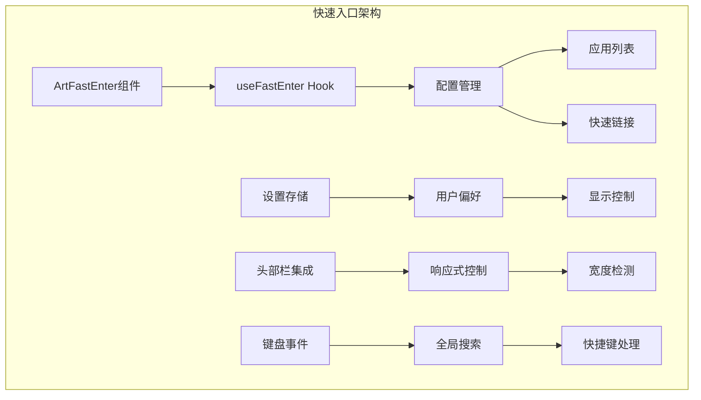

**架构图来源**
- [src/components/core/layouts/art-fast-enter/index.vue](file://src/components/core/layouts/art-fast-enter/index.vue#L1-L114)
- [src/hooks/core/useFastEnter.ts](file://src/hooks/core/useFastEnter.ts#L1-L56)

### 组件层次结构

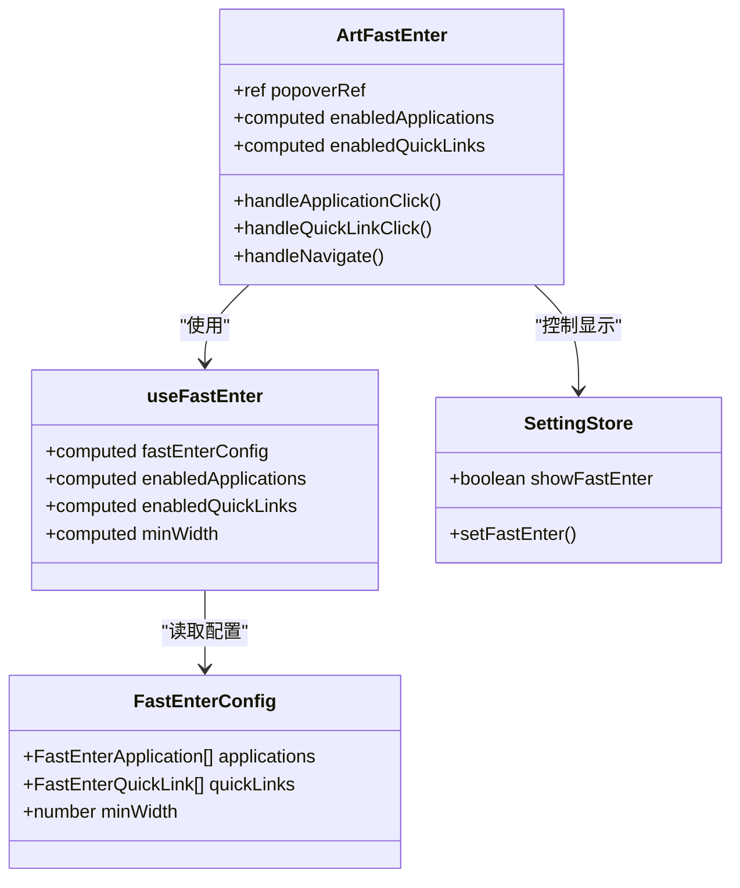

**类图来源**
- [src/components/core/layouts/art-fast-enter/index.vue](file://src/components/core/layouts/art-fast-enter/index.vue#L65-L114)
- [src/hooks/core/useFastEnter.ts](file://src/hooks/core/useFastEnter.ts#L22-L55)
- [src/types/config/index.ts](file://src/types/config/index.ts#L118-L125)

**章节来源**
- [src/components/core/layouts/art-fast-enter/index.vue](file://src/components/core/layouts/art-fast-enter/index.vue#L1-L114)
- [src/hooks/core/useFastEnter.ts](file://src/hooks/core/useFastEnter.ts#L1-L56)

## 配置系统

快速入口功能的配置系统提供了灵活的定制能力，支持通过配置文件进行各种设置。

### 默认配置结构

快速入口的配置分为两个主要部分：

1. **应用列表配置**：包含系统核心功能的应用项
2. **快速链接配置**：提供常用页面的快速访问

### 应用列表配置详解

每个应用项包含以下属性：

| 属性 | 类型 | 描述 | 示例值 |
|------|------|------|--------|
| name | string | 应用名称 | "工作台" |
| description | string | 应用描述 | "系统概览与数据统计" |
| icon | string | 图标代码 | "ri:pie-chart-line" |
| iconColor | string | 图标颜色 | "#377dff" |
| enabled | boolean | 是否启用 | true |
| order | number | 排序权重 | 1 |
| routeName | string | 路由名称 | "Console" |
| link | string | 外部链接 | WEB_LINKS.DOCS |

### 快速链接配置

快速链接配置相对简单，主要用于提供常用页面的快速访问：

| 属性 | 类型 | 描述 | 示例值 |
|------|------|------|--------|
| name | string | 链接名称 | "登录" |
| enabled | boolean | 是否启用 | true |
| order | number | 排序权重 | 1 |
| routeName | string | 路由名称 | "Login" |

### 配置文件位置

配置文件位于：`src/config/modules/fastEnter.ts`

### 动态配置管理

系统支持运行时动态修改配置，通过 Vue 的响应式系统自动更新界面：

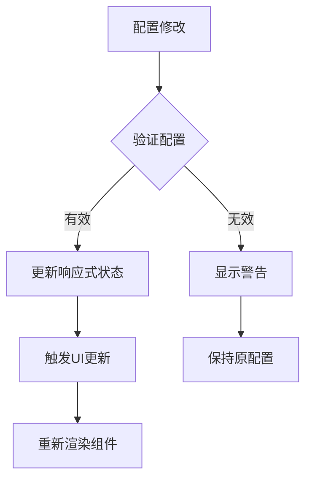

**流程图来源**
- [src/hooks/core/useFastEnter.ts](file://src/hooks/core/useFastEnter.ts#L26-L48)

**章节来源**
- [src/config/modules/fastEnter.ts](file://src/config/modules/fastEnter.ts#L1-L128)
- [src/types/config/index.ts](file://src/types/config/index.ts#L90-L125)

## 视觉呈现与交互

快速入口组件采用了现代化的设计理念，提供直观且高效的用户体验。

### 设计原则

1. **简洁直观**：采用网格布局，清晰区分应用列表和快速链接
2. **视觉层次**：通过颜色、大小和间距建立清晰的视觉层次
3. **交互反馈**：提供丰富的鼠标悬停和点击反馈
4. **响应式设计**：适应不同屏幕尺寸和设备

### 组件布局

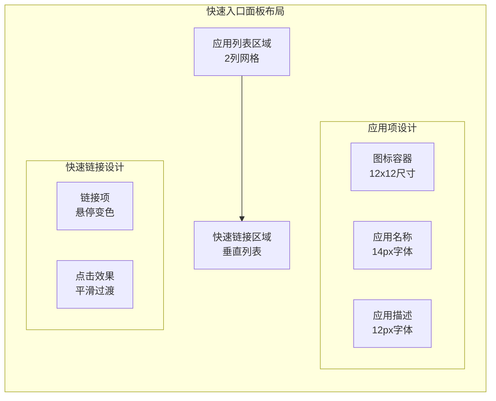

**布局图来源**
- [src/components/core/layouts/art-fast-enter/index.vue](file://src/components/core/layouts/art-fast-enter/index.vue#L22-L59)

### 交互行为

#### 鼠标交互

1. **悬停效果**：
   - 应用项：背景色渐变，图标容器透明
   - 快速链接：文字颜色变化

2. **点击行为**：
   - 应用项：导航到指定路由或外部链接
   - 快速链接：执行相应导航操作

3. **弹出层控制**：
   - 鼠标移出时自动隐藏
   - 点击外部区域时关闭

#### 视觉反馈

组件使用了多种视觉反馈机制：

- **悬停状态**：背景色渐变效果
- **点击状态**：平滑的过渡动画
- **焦点状态**：清晰的边界指示

### 响应式设计

快速入口组件具有完善的响应式设计：

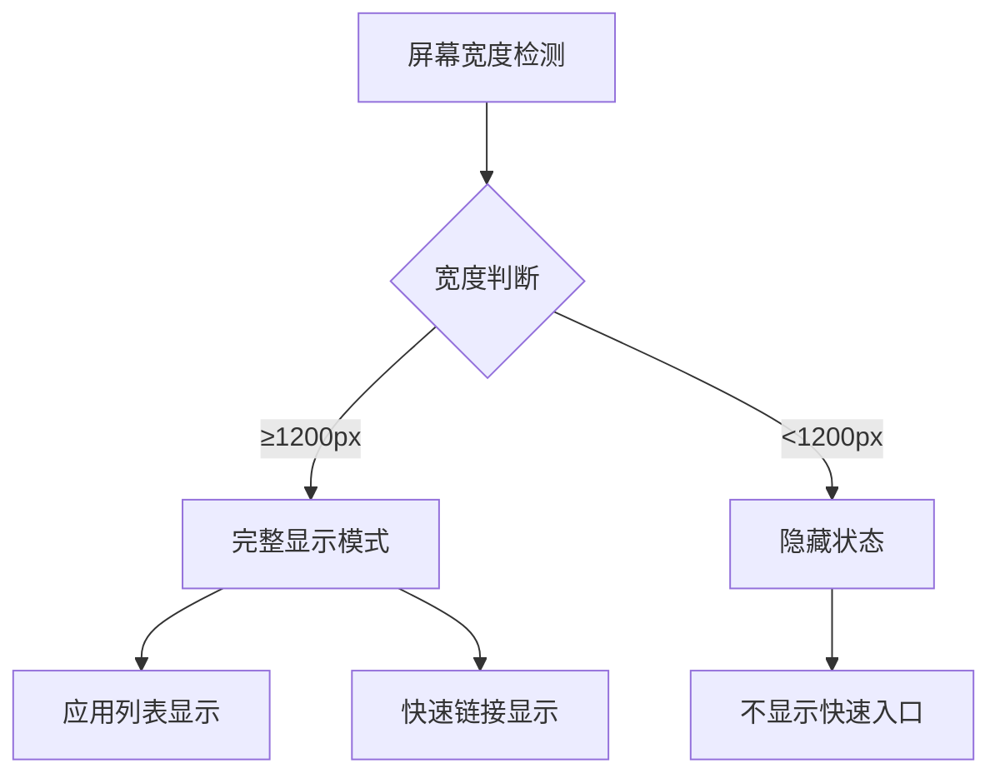

**流程图来源**
- [src/hooks/core/useFastEnter.ts](file://src/hooks/core/useFastEnter.ts#L44-L47)

**章节来源**
- [src/components/core/layouts/art-fast-enter/index.vue](file://src/components/core/layouts/art-fast-enter/index.vue#L1-L114)

## 键盘快捷键机制

快速入口功能集成了强大的键盘快捷键系统，特别是与全局搜索功能的深度集成。

### 全局搜索快捷键

系统支持通过键盘快捷键快速打开全局搜索功能：

- **Windows/Linux**: Ctrl + K
- **Mac**: Cmd + K

### 快捷键实现机制

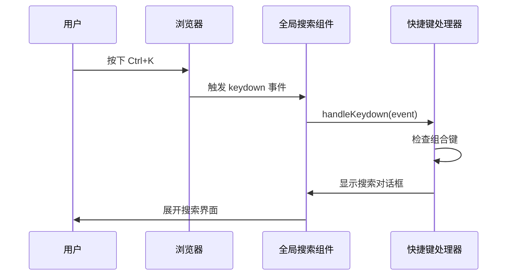

**序列图来源**
- [src/components/core/layouts/art-global-search/index.vue](file://src/components/core/layouts/art-global-search/index.vue#L134-L160)

### 快捷键配置

全局搜索组件支持以下键盘操作：

| 快捷键 | 功能 | 描述 |
|--------|------|------|
| Ctrl+K/Cmd+K | 打开搜索 | 在任意页面打开全局搜索对话框 |
| ↑/↓ | 导航选择 | 在搜索结果间上下移动 |
| Enter | 确认选择 | 打开选中的搜索结果 |
| ESC | 关闭搜索 | 关闭搜索对话框 |

### 快捷键处理逻辑

快捷键处理采用了平台检测机制，能够自动识别操作系统并使用相应的修饰键：

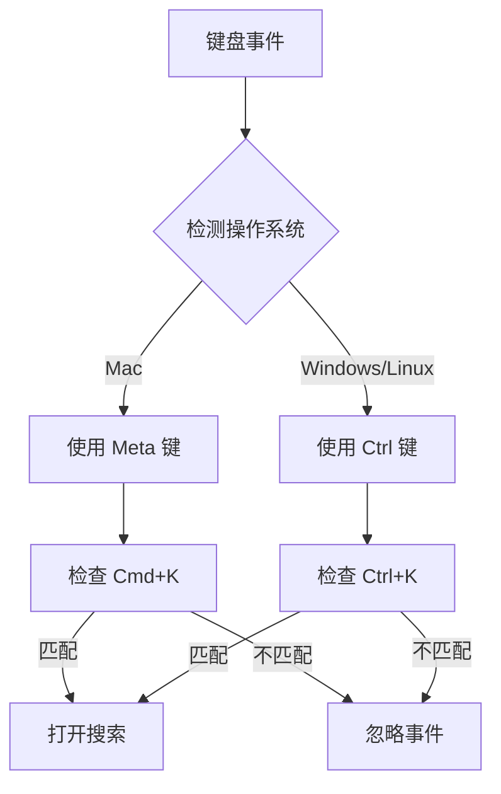

**流程图来源**
- [src/components/core/layouts/art-global-search/index.vue](file://src/components/core/layouts/art-global-search/index.vue#L135-L143)

**章节来源**
- [src/components/core/layouts/art-global-search/index.vue](file://src/components/core/layouts/art-global-search/index.vue#L75-L90)

## 用户偏好设置同步

快速入口功能与系统的用户偏好设置紧密集成，实现了完整的个性化配置持久化。

### 设置存储架构

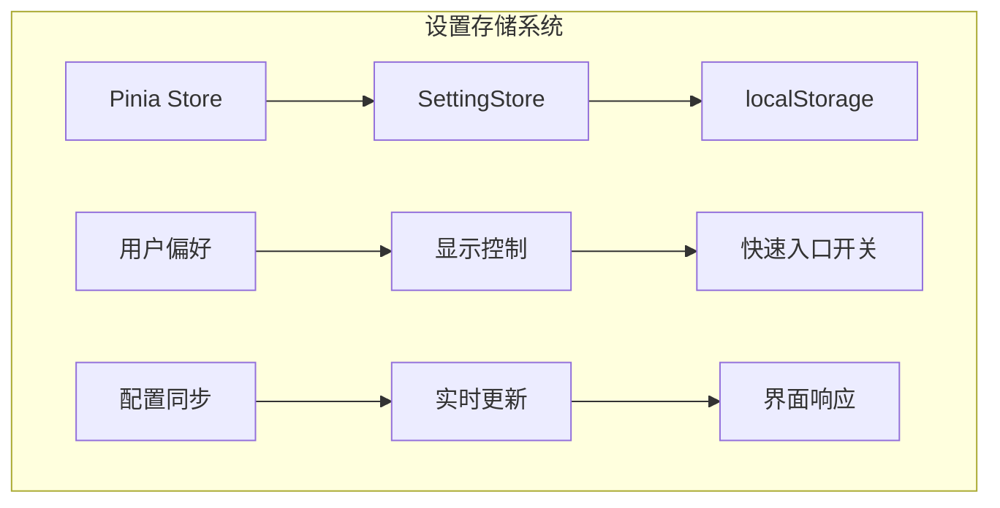

**架构图来源**
- [src/store/modules/setting.ts](file://src/store/modules/setting.ts#L444-L449)

### 持久化机制

系统使用 Pinia 的持久化插件将设置保存到 localStorage：

- **存储键名**：`setting`
- **存储格式**：JSON 格式
- **版本管理**：支持跨版本数据迁移

### 同步流程

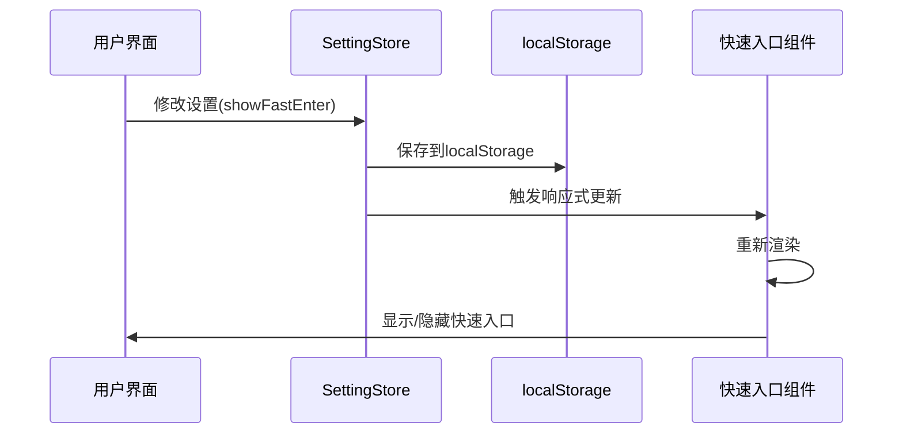

**序列图来源**
- [src/store/modules/setting.ts](file://src/store/modules/setting.ts#L235-L240)

### 配置项映射

快速入口功能的设置项在系统设置中的映射关系：

| 设置项 | 存储键 | 类型 | 默认值 |
|--------|--------|------|--------|
| showFastEnter | showFastEnter | boolean | true |

### 实时同步

系统实现了完整的实时同步机制：

1. **设置变更监听**：自动监听设置变化
2. **状态传播**：设置变更自动传播到相关组件
3. **界面更新**：UI 状态与设置状态保持同步

**章节来源**
- [src/store/modules/setting.ts](file://src/store/modules/setting.ts#L73-L74)
- [src/store/modules/setting.ts](file://src/store/modules/setting.ts#L235-L240)

## 集成与协同

快速入口功能与系统中的其他工具功能形成了良好的协同关系，特别是在全局搜索功能上的集成。

### 与全局搜索的协同

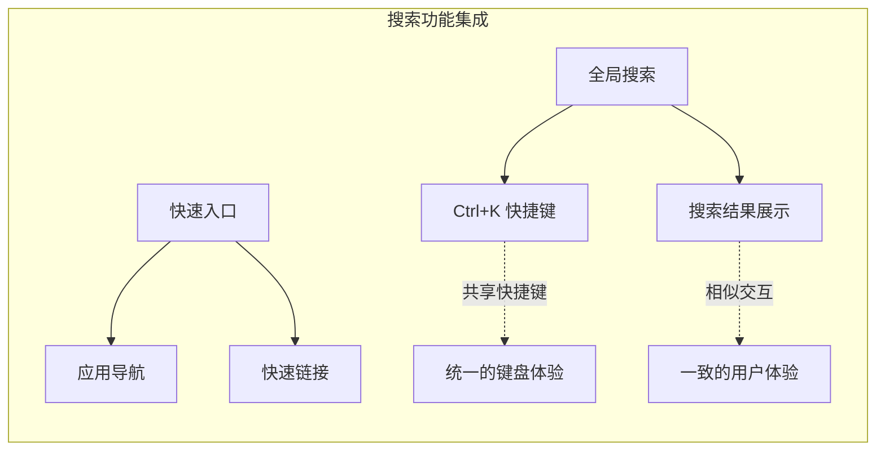

**集成图来源**
- [src/components/core/layouts/art-header-bar/index.vue](file://src/components/core/layouts/art-header-bar/index.vue#L46-L79)
- [src/components/core/layouts/art-global-search/index.vue](file://src/components/core/layouts/art-global-search/index.vue#L134-L160)

### 头部栏集成

快速入口作为头部栏的一个功能模块，与其它头部功能协同工作：

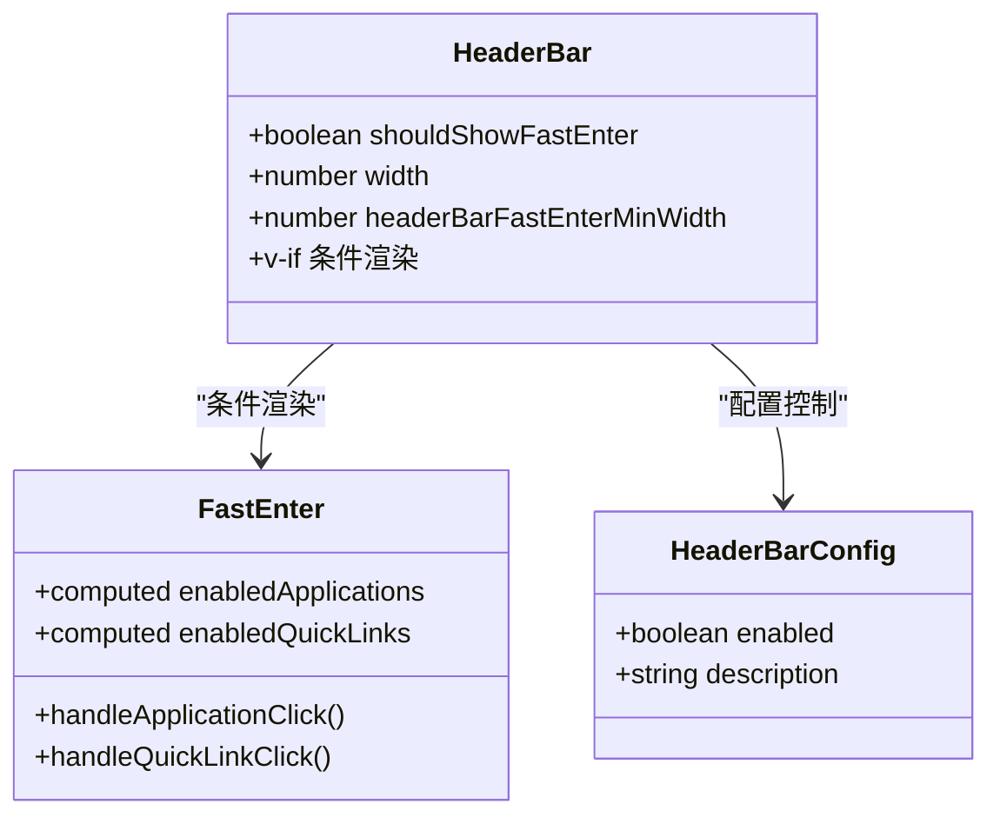

**类图来源**
- [src/components/core/layouts/art-header-bar/index.vue](file://src/components/core/layouts/art-header-bar/index.vue#L46-L49)
- [src/hooks/core/useHeaderBar.ts](file://src/hooks/core/useHeaderBar.ts#L66-L69)

### 功能协同场景

#### 场景1：快捷导航
用户可以通过快速入口直接访问常用功能，提高工作效率。

#### 场景2：搜索结合
当快速入口无法满足需求时，用户可以使用全局搜索功能查找更多内容。

#### 场景3：个性化配置
用户可以根据自己的使用习惯，启用或禁用快速入口功能。

### 性能协同

快速入口功能在设计时考虑了性能优化：

- **懒加载**：只有在需要时才渲染组件
- **响应式控制**：根据屏幕宽度动态调整显示
- **事件节流**：优化鼠标悬停和点击事件

**章节来源**
- [src/components/core/layouts/art-header-bar/index.vue](file://src/components/core/layouts/art-header-bar/index.vue#L46-L79)
- [src/hooks/core/useHeaderBar.ts](file://src/hooks/core/useHeaderBar.ts#L66-L69)

## 性能优化

快速入口功能在设计和实现过程中充分考虑了性能优化，确保在各种环境下都能提供流畅的用户体验。

### 渲染优化

#### 响应式渲染控制

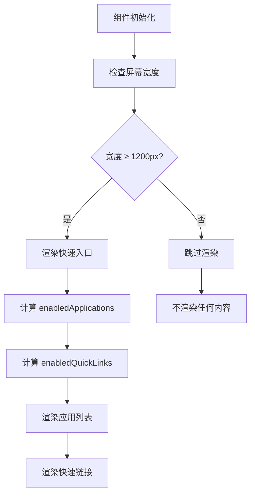

**流程图来源**
- [src/hooks/core/useFastEnter.ts](file://src/hooks/core/useFastEnter.ts#L26-L48)

#### 计算属性优化

系统使用 Vue 的计算属性来优化性能：

1. **缓存机制**：计算属性会缓存结果，只有依赖变化时才重新计算
2. **惰性求值**：只有在实际使用时才计算值
3. **依赖追踪**：自动追踪依赖变化

### 内存优化

#### 组件卸载优化

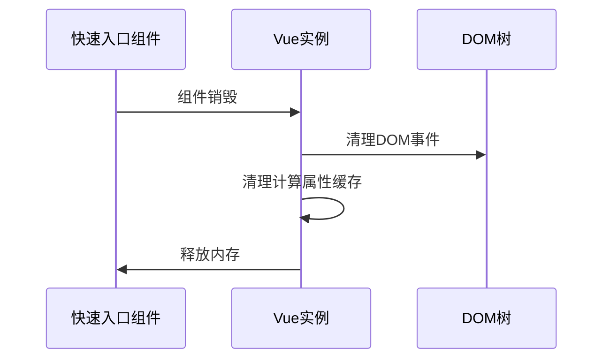

#### 事件监听器管理

- **自动清理**：组件销毁时自动清理事件监听器
- **防泄漏**：避免内存泄漏问题
- **性能监控**：定期检查内存使用情况

### 网络优化

#### 图标资源优化

- **SVG图标**：使用矢量图标，减少文件大小
- **图标复用**：相同图标在多个地方复用
- **按需加载**：只加载必要的图标资源

### 用户体验优化

#### 加载性能

1. **即时响应**：组件加载速度快，用户操作无延迟
2. **平滑过渡**：使用CSS动画提供流畅的视觉效果
3. **预加载策略**：关键资源提前加载

#### 交互性能

- **事件防抖**：鼠标悬停事件使用防抖处理
- **批量更新**：多个状态变更批量处理
- **异步处理**：耗时操作使用异步处理

**章节来源**
- [src/hooks/core/useFastEnter.ts](file://src/hooks/core/useFastEnter.ts#L26-L48)
- [src/components/core/layouts/art-fast-enter/index.vue](file://src/components/core/layouts/art-fast-enter/index.vue#L26-L59)

## 实际代码示例

以下是快速入口功能的实际代码示例，展示了如何集成和使用该功能。

### 基本集成示例

```typescript
// 在头部栏中集成快速入口
<template>
  <div>
    <!-- 快速入口 -->
    <ArtFastEnter v-if="shouldShowFastEnter && width >= headerBarFastEnterMinWidth">
      <ArtIconButton icon="ri:function-line" class="ml-3" />
    </ArtFastEnter>
  </div>
</template>

<script setup lang="ts">
import { useHeaderBar } from '@/hooks/core/useHeaderBar'

const { shouldShowFastEnter } = useHeaderBar()
</script>
```

### 自定义配置示例

```typescript
// 添加新的应用项
const customFastEnterConfig = {
  applications: [
    {
      name: '自定义功能',
      description: '自定义功能描述',
      icon: 'ri:custom-icon-line',
      iconColor: '#FF6B6B',
      enabled: true,
      order: 9,
      routeName: 'CustomPage'
    }
  ],
  quickLinks: [
    {
      name: '帮助中心',
      enabled: true,
      order: 7,
      link: 'https://help.example.com'
    }
  ]
}
```

### 动态配置修改示例

```typescript
// 在设置面板中控制快速入口显示
<template>
  <div>
    <el-switch 
      v-model="showFastEnter" 
      @change="toggleFastEnter"
      :active-text="$t('settings.showFastEnter')"
    />
  </div>
</template>

<script setup lang="ts">
import { useSettingStore } from '@/store/modules/setting'

const settingStore = useSettingStore()
const showFastEnter = ref(settingStore.showFastEnter)

const toggleFastEnter = (value: boolean) => {
  settingStore.setFastEnter()
}
</script>
```

### 错误处理示例

```typescript
// 安全的导航处理
const handleNavigation = (application: FastEnterApplication) => {
  try {
    const targetPath = application.routeName || application.link
    
    if (!targetPath) {
      throw new Error('导航配置无效：缺少路由名称或链接')
    }
    
    if (targetPath.startsWith('http')) {
      window.open(targetPath, '_blank')
    } else {
      router.push({ name: targetPath })
    }
    
    // 关闭弹出层
    popoverRef.value?.hide()
  } catch (error) {
    console.error('导航失败:', error)
    ElMessage.error('导航失败，请稍后重试')
  }
}
```

### 样式定制示例

```scss
// 自定义快速入口样式
.fast-enter-popover {
  // 自定义边框样式
  border: 1px solid var(--custom-border-color);
  
  // 自定义圆角
  border-radius: calc(var(--custom-radius) / 2 + 4px);
  
  // 自定义阴影
  box-shadow: 0 4px 12px rgba(0, 0, 0, 0.1);
  
  // 自定义背景色
  background-color: var(--custom-bg-color);
}

// 应用项样式定制
.art-fast-enter-item {
  // 自定义悬停效果
  &:hover {
    background-color: var(--hover-bg-color);
    transform: translateY(-2px);
    transition: all 0.2s ease;
  }
  
  // 自定义图标样式
  .app-icon {
    background-color: var(--icon-bg-color);
    border: 1px solid var(--icon-border-color);
  }
}
```

**章节来源**
- [src/components/core/layouts/art-fast-enter/index.vue](file://src/components/core/layouts/art-fast-enter/index.vue#L1-L114)
- [src/hooks/core/useFastEnter.ts](file://src/hooks/core/useFastEnter.ts#L22-L55)

## 故障排除

在使用快速入口功能时，可能会遇到一些常见问题。以下是详细的故障排除指南。

### 常见问题及解决方案

#### 问题1：快速入口不显示

**症状**：快速入口组件没有出现在界面上

**可能原因**：
1. 屏幕宽度不足（小于1200px）
2. 快速入口功能被禁用
3. 配置文件错误

**解决方案**：
```typescript
// 检查屏幕宽度
console.log('当前屏幕宽度:', window.innerWidth)

// 检查快速入口配置
import appConfig from '@/config'
console.log('快速入口配置:', appConfig.fastEnter)

// 检查设置状态
import { useSettingStore } from '@/store/modules/setting'
const settingStore = useSettingStore()
console.log('快速入口显示状态:', settingStore.showFastEnter)
```

#### 问题2：应用项无法点击

**症状**：点击应用项没有反应

**可能原因**：
1. 路由配置错误
2. 外部链接无效
3. 导航函数异常

**解决方案**：
```typescript
// 添加调试信息
const handleApplicationClick = (application: FastEnterApplication) => {
  console.log('点击的应用:', application)
  console.log('路由名称:', application.routeName)
  console.log('外部链接:', application.link)
  
  try {
    handleNavigate(application.routeName, application.link)
  } catch (error) {
    console.error('应用点击处理失败:', error)
  }
}
```

#### 问题3：样式显示异常

**症状**：快速入口样式错乱或不显示

**可能原因**：
1. CSS变量未正确设置
2. 主题配置冲突
3. 样式覆盖问题

**解决方案**：
```scss
// 检查CSS变量
:root {
  --default-border: #ebeef5;
  --custom-radius: 0.5rem;
  --theme-color: #409eff;
}

// 检查主题适配
@media (prefers-color-scheme: dark) {
  .fast-enter-popover {
    background-color: #2c3e50;
    border-color: #34495e;
  }
}
```

#### 问题4：键盘快捷键失效

**症状**：Ctrl+K/Cmd+K 快捷键没有反应

**可能原因**：
1. 事件监听器未正确绑定
2. 其他组件阻止了键盘事件
3. 浏览器兼容性问题

**解决方案**：
```typescript
// 检查事件监听器
document.addEventListener('keydown', (event) => {
  console.log('按键事件:', event.key, event.ctrlKey, event.metaKey)
})

// 检查事件冒泡
document.addEventListener('keydown', (event) => {
  if (event.key === 'k' && (event.ctrlKey || event.metaKey)) {
    event.stopPropagation()
    event.preventDefault()
    console.log('快捷键被拦截')
  }
})
```

### 性能问题诊断

#### 问题：组件渲染缓慢

**诊断步骤**：
1. 使用浏览器开发者工具的 Performance 面板
2. 检查组件渲染时间
3. 分析内存使用情况

**优化建议**：
```typescript
// 使用虚拟滚动（如果应用项很多）
import { VirtualList } from 'vue-virtual-scroll-list'

// 限制同时渲染的数量
const MAX_VISIBLE_ITEMS = 10

// 使用计算属性缓存
const visibleApplications = computed(() => {
  return enabledApplications.value.slice(0, MAX_VISIBLE_ITEMS)
})
```

#### 问题：内存占用过高

**诊断工具**：
```typescript
// 监控内存使用
window.addEventListener('beforeunload', () => {
  const memory = (performance as any).memory
  if (memory) {
    console.log('内存使用情况:', {
      used: memory.usedJSHeapSize,
      total: memory.totalJSHeapSize,
      limit: memory.jsHeapSizeLimit
    })
  }
})
```

### 调试工具

#### 开发者工具集成

```typescript
// 在开发环境中添加调试功能
if (process.env.NODE_ENV === 'development') {
  // 添加全局调试方法
  (window as any).debugFastEnter = () => {
    console.log('快速入口调试信息:')
    console.log('- 配置:', appConfig.fastEnter)
    console.log('- 应用项数量:', enabledApplications.value.length)
    console.log('- 快速链接数量:', enabledQuickLinks.value.length)
    console.log('- 最小宽度:', minWidth.value)
  }
}
```

#### 日志记录

```typescript
// 添加详细的日志记录
const logDebugInfo = (context: string, data: any) => {
  if (process.env.NODE_ENV === 'development') {
    console.log(`[FastEnter Debug] ${context}:`, data)
  }
}

// 在关键位置添加日志
const handleApplicationClick = (application: FastEnterApplication) => {
  logDebugInfo('应用点击', application)
  // ... 原有逻辑
}
```

**章节来源**
- [src/components/core/layouts/art-fast-enter/index.vue](file://src/components/core/layouts/art-fast-enter/index.vue#L76-L114)
- [src/hooks/core/useFastEnter.ts](file://src/hooks/core/useFastEnter.ts#L26-L48)