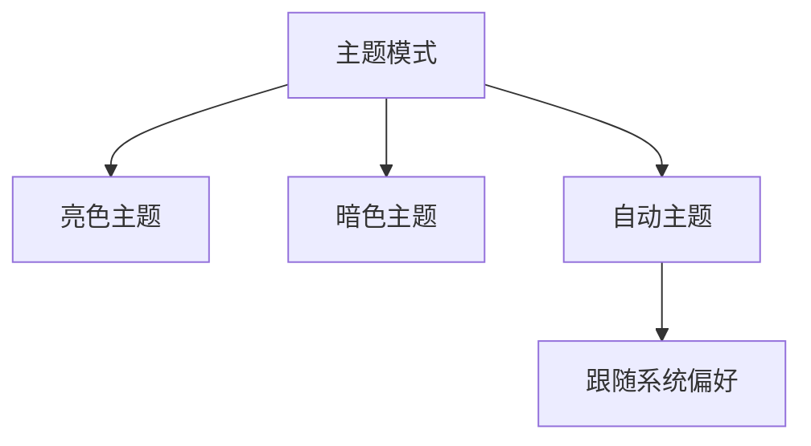
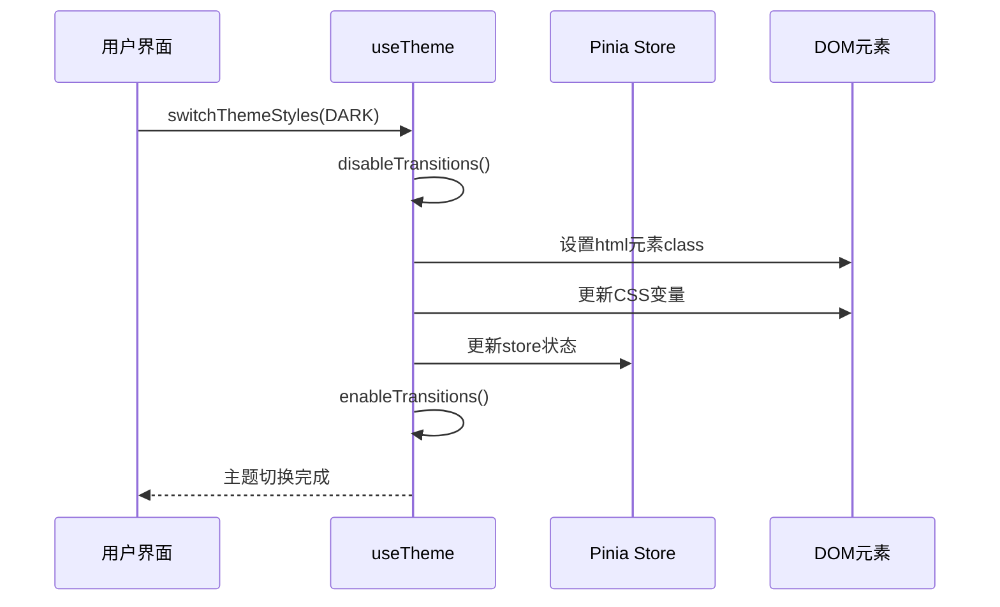
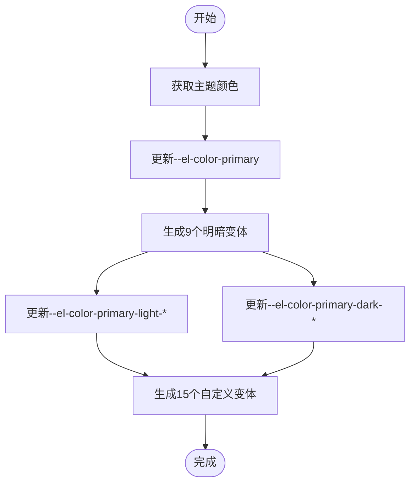
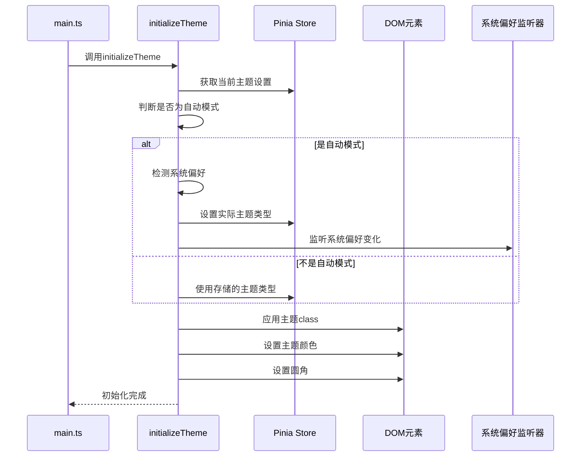

# 主题设置

<cite>
**本文档引用文件**  
- [useTheme.ts](file://src/hooks/core/useTheme.ts)
- [theme-change.scss](file://src/assets/styles/core/theme-change.scss)
- [one-dark-pro.scss](file://src/assets/styles/custom/one-dark-pro.scss)
- [ThemeSettings.vue](file://src/components/core/layouts/art-settings-panel/widget/ThemeSettings.vue)
- [setting.ts](file://src/config/setting.ts)
- [config/index.ts](file://src/config/index.ts)
- [colors.ts](file://src/utils/ui/colors.ts)
- [setting.ts](file://src/store/modules/setting.ts)
</cite>

## 目录
1. [简介](#简介)
2. [主题切换功能](#主题切换功能)
3. [useTheme组合式函数](#useTheme组合式函数)
4. [CSS变量与动态主题](#css变量与动态主题)
5. [自定义主题包开发](#自定义主题包开发)
6. [主题初始化流程](#主题初始化流程)
7. [性能优化策略](#性能优化策略)

## 简介
主题设置模块为系统提供完整的主题管理功能，支持明暗主题切换、自动模式以及自定义主题包加载。该模块通过组合式函数、CSS自定义属性和状态管理实现毫秒级的主题切换体验，同时确保用户偏好设置的持久化存储。

**Section sources**
- [useTheme.ts](file://src/hooks/core/useTheme.ts#L1-L32)
- [config/index.ts](file://src/config/index.ts#L1-L30)

## 主题切换功能
系统支持三种主题模式：亮色主题、暗色主题和自动主题。自动主题模式会根据用户的系统偏好自动切换，提供无缝的用户体验。主题设置面板通过可视化界面让用户轻松切换不同主题。



**Diagram sources**
- [config/index.ts](file://src/config/index.ts#L44-L47)
- [appEnum.ts](file://src/enums/appEnum.ts#L33-L40)

## useTheme组合式函数
`useTheme`组合式函数是主题管理的核心，负责协调CSS变量更新、本地存储持久化和全局状态同步。该函数提供了一系列API来管理主题切换的完整生命周期。

### 核心功能
- **主题切换**：通过`switchThemeStyles`方法切换不同主题
- **过渡优化**：临时禁用CSS过渡效果，避免切换时的闪烁
- **状态持久化**：自动将主题设置保存到Pinia store和localStorage
- **自动模式**：监听系统偏好变化，自动调整主题



**Diagram sources**
- [useTheme.ts](file://src/hooks/core/useTheme.ts#L42-L124)
- [setting.ts](file://src/store/modules/setting.ts#L183-L187)

**Section sources**
- [useTheme.ts](file://src/hooks/core/useTheme.ts#L42-L124)
- [ThemeSettings.vue](file://src/components/core/layouts/art-settings-panel/widget/ThemeSettings.vue#L8-L10)

## CSS变量与动态主题
主题系统通过CSS自定义属性实现动态主题切换，利用`theme-change.scss`中的动态类生成逻辑，实现毫秒级的主题切换效果。

### 动态主题类生成
`theme-change.scss`文件定义了主题切换时的过渡优化规则，通过临时禁用所有过渡效果来避免视觉闪烁：

```scss
.theme-change {
  * {
    transition: 0s !important;
  }
  
  .el-switch__core,
  .el-switch__action {
    transition: all 0.3s !important;
  }
}
```

### CSS变量更新机制
系统通过JavaScript动态更新CSS变量，实现主题颜色的实时变化。`setElementThemeColor`函数负责更新Element Plus组件库的主题变量：



**Diagram sources**
- [theme-change.scss](file://src/assets/styles/core/theme-change.scss#L1-L12)
- [colors.ts](file://src/utils/ui/colors.ts#L261-L273)

**Section sources**
- [theme-change.scss](file://src/assets/styles/core/theme-change.scss#L1-L12)
- [colors.ts](file://src/utils/ui/colors.ts#L261-L273)

## 自定义主题包开发
系统支持自定义主题包的开发和加载，开发者可以创建如`one-dark-pro`这样的自定义主题。

### 开发流程
1. **颜色体系设计**：定义主题的完整颜色体系
2. **SCSS变量映射**：将颜色映射到CSS变量
3. **主题注册**：通过API注册新主题
4. **样式文件创建**：创建主题样式文件

### one-dark-pro主题示例
`one-dark-pro.scss`文件展示了自定义主题包的实现方式，通过覆盖Highlight.js的样式来实现代码高亮主题：

```scss
.hljs {
  color: #a6accd;
}

.hljs-string,
.hljs-section,
.hljs-selector-class {
  color: #aed07e !important;
}

.hljs-comment,
.hljs-quote {
  color: #6f747d;
}
```

**Section sources**
- [one-dark-pro.scss](file://src/assets/styles/custom/one-dark-pro.scss#L1-L99)
- [config/index.ts](file://src/config/index.ts#L49-L74)

## 主题初始化流程
系统在启动时通过`initializeTheme`函数初始化主题系统，确保用户上次使用的主题设置被正确恢复。



**Diagram sources**
- [useTheme.ts](file://src/hooks/core/useTheme.ts#L129-L174)
- [main.ts](file://src/main.ts#L18-L25)

**Section sources**
- [useTheme.ts](file://src/hooks/core/useTheme.ts#L129-L174)

## 性能优化策略
主题系统采用多种性能优化策略，确保主题切换的流畅性和用户体验。

### 过渡效果管理
通过临时禁用过渡效果来避免主题切换时的闪烁：

```typescript
const disableTransitions = () => {
  const style = document.createElement('style')
  style.setAttribute('id', 'disable-transitions')
  style.textContent = '* { transition: none !important; }'
  document.head.appendChild(style)
}

const enableTransitions = () => {
  const style = document.getElementById('disable-transitions')
  if (style) {
    style.remove()
  }
}
```

### 双重requestAnimationFrame
使用双重`requestAnimationFrame`确保在下一帧恢复过渡效果，避免布局抖动：

```typescript
requestAnimationFrame(() => {
  requestAnimationFrame(() => {
    enableTransitions()
  })
})
```

**Section sources**
- [useTheme.ts](file://src/hooks/core/useTheme.ts#L45-L59)
- [useTheme.ts](file://src/hooks/core/useTheme.ts#L92-L97)