# 基础设置

<cite>
**本文档中引用的文件**
- [src/components/core/layouts/art-settings-panel/index.vue](file://src/components/core/layouts/art-settings-panel/index.vue)
- [src/components/core/layouts/art-settings-panel/composables/useSettingsState.ts](file://src/components/core/layouts/art-settings-panel/composables/useSettingsState.ts)
- [src/components/core/layouts/art-settings-panel/composables/useSettingsConfig.ts](file://src/components/core/layouts/art-settings-panel/composables/useSettingsConfig.ts)
- [src/components/core/layouts/art-settings-panel/composables/useSettingsHandlers.ts](file://src/components/core/layouts/art-settings-panel/composables/useSettingsHandlers.ts)
- [src/components/core/layouts/art-settings-panel/composables/useSettingsPanel.ts](file://src/components/core/layouts/art-settings-panel/composables/useSettingsPanel.ts)
- [src/components/core/layouts/art-settings-panel/widget/BasicSettings.vue](file://src/components/core/layouts/art-settings-panel/widget/BasicSettings.vue)
- [src/components/core/layouts/art-settings-panel/widget/SettingItem.vue](file://src/components/core/layouts/art-settings-panel/widget/SettingItem.vue)
- [src/components/core/layouts/art-settings-panel/widget/SettingDrawer.vue](file://src/components/core/layouts/art-settings-panel/widget/SettingDrawer.vue)
- [src/components/core/layouts/art-settings-panel/widget/SettingActions.vue](file://src/components/core/layouts/art-settings-panel/widget/SettingActions.vue)
- [src/store/modules/setting.ts](file://src/store/modules/setting.ts)
- [src/config/setting.ts](file://src/config/setting.ts)
- [src/enums/appEnum.ts](file://src/enums/appEnum.ts)
- [src/assets/styles/core/router-transition.scss](file://src/assets/styles/core/router-transition.scss)
- [src/assets/styles/core/theme-animation.scss](file://src/assets/styles/core/theme-animation.scss)
- [src/assets/styles/core/theme-change.scss](file://src/assets/styles/core/theme-change.scss)
</cite>

## 目录
1. [简介](#简介)
2. [项目结构](#项目结构)
3. [核心组件](#核心组件)
4. [架构概览](#架构概览)
5. [详细组件分析](#详细组件分析)
6. [配置项详解](#配置项详解)
7. [状态管理](#状态管理)
8. [UI组件交互](#ui组件交互)
9. [自定义扩展](#自定义扩展)
10. [最佳实践](#最佳实践)

## 简介

Art Design Pro 的基础设置模块是一个完整的系统配置管理解决方案，提供了丰富的界面定制选项和用户偏好设置功能。该模块通过组合式函数模式实现了高度可复用的状态管理和配置逻辑，支持主题切换、菜单布局、页面过渡动画等多种系统行为配置。

### 主要特性

- **全面的系统配置**：涵盖主题、菜单、界面显示、功能开关等各个方面
- **响应式设计**：支持移动端和桌面端的不同配置需求
- **持久化存储**：配置信息自动保存到 localStorage
- **实时预览**：配置更改即时生效，无需刷新页面
- **国际化支持**：多语言界面配置选项
- **主题动画**：平滑的主题切换过渡效果

## 项目结构

基础设置模块采用分层架构设计，主要包含以下几个层次：

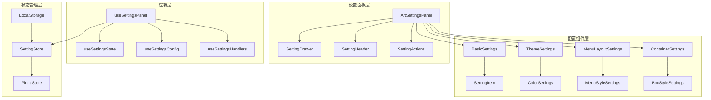

**图表来源**
- [src/components/core/layouts/art-settings-panel/index.vue](file://src/components/core/layouts/art-settings-panel/index.vue#L1-L73)
- [src/components/core/layouts/art-settings-panel/composables/useSettingsPanel.ts](file://src/components/core/layouts/art-settings-panel/composables/useSettingsPanel.ts#L1-L192)

**章节来源**
- [src/components/core/layouts/art-settings-panel/index.vue](file://src/components/core/layouts/art-settings-panel/index.vue#L1-L73)
- [src/components/core/layouts/art-settings-panel/composables/useSettingsPanel.ts](file://src/components/core/layouts/art-settings-panel/composables/useSettingsPanel.ts#L1-L192)

## 核心组件

### 设置面板主组件

设置面板的核心组件 `ArtSettingsPanel` 是整个配置系统的入口点，负责协调各个子组件的工作。

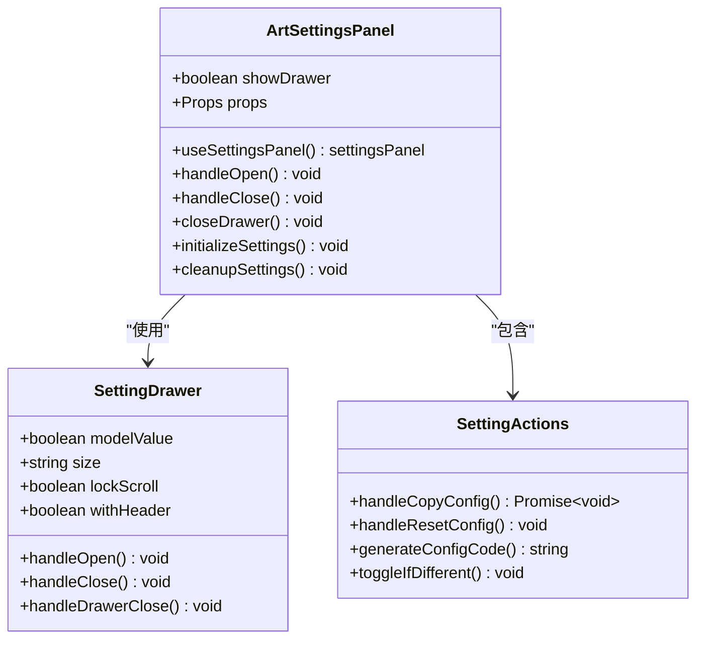

**图表来源**
- [src/components/core/layouts/art-settings-panel/index.vue](file://src/components/core/layouts/art-settings-panel/index.vue#L28-L73)
- [src/components/core/layouts/art-settings-panel/widget/SettingDrawer.vue](file://src/components/core/layouts/art-settings-panel/widget/SettingDrawer.vue#L1-L52)
- [src/components/core/layouts/art-settings-panel/widget/SettingActions.vue](file://src/components/core/layouts/art-settings-panel/widget/SettingActions.vue#L1-L236)

### 基础设置组件

基础设置组件 `BasicSettings` 负责管理所有基础功能开关和界面显示选项。

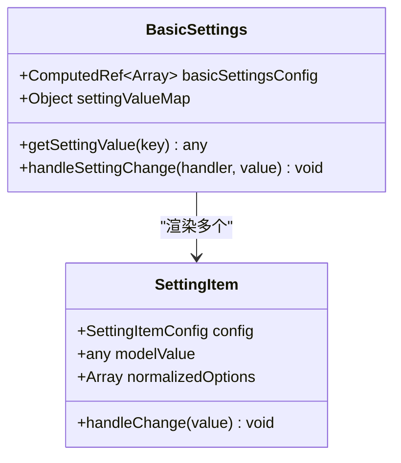

**图表来源**
- [src/components/core/layouts/art-settings-panel/widget/BasicSettings.vue](file://src/components/core/layouts/art-settings-panel/widget/BasicSettings.vue#L1-L78)
- [src/components/core/layouts/art-settings-panel/widget/SettingItem.vue](file://src/components/core/layouts/art-settings-panel/widget/SettingItem.vue#L1-L102)

**章节来源**
- [src/components/core/layouts/art-settings-panel/index.vue](file://src/components/core/layouts/art-settings-panel/index.vue#L1-L73)
- [src/components/core/layouts/art-settings-panel/widget/BasicSettings.vue](file://src/components/core/layouts/art-settings-panel/widget/BasicSettings.vue#L1-L78)

## 架构概览

基础设置模块采用组合式函数架构，通过多个独立的 composable 函数实现关注点分离：

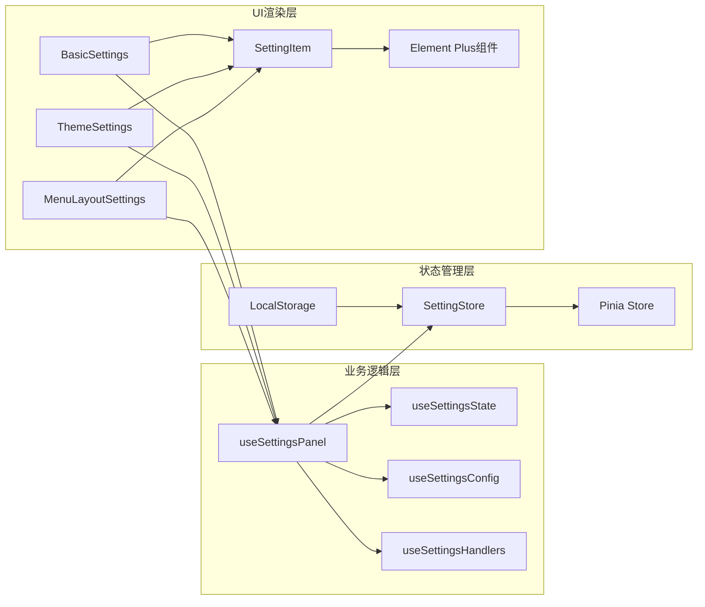

**图表来源**
- [src/components/core/layouts/art-settings-panel/composables/useSettingsPanel.ts](file://src/components/core/layouts/art-settings-panel/composables/useSettingsPanel.ts#L10-L192)
- [src/store/modules/setting.ts](file://src/store/modules/setting.ts#L47-L451)

## 详细组件分析

### useSettingsState 组合式函数

`useSettingsState` 负责管理设置相关的状态逻辑，主要包括色弱模式初始化和菜单布局切换功能。

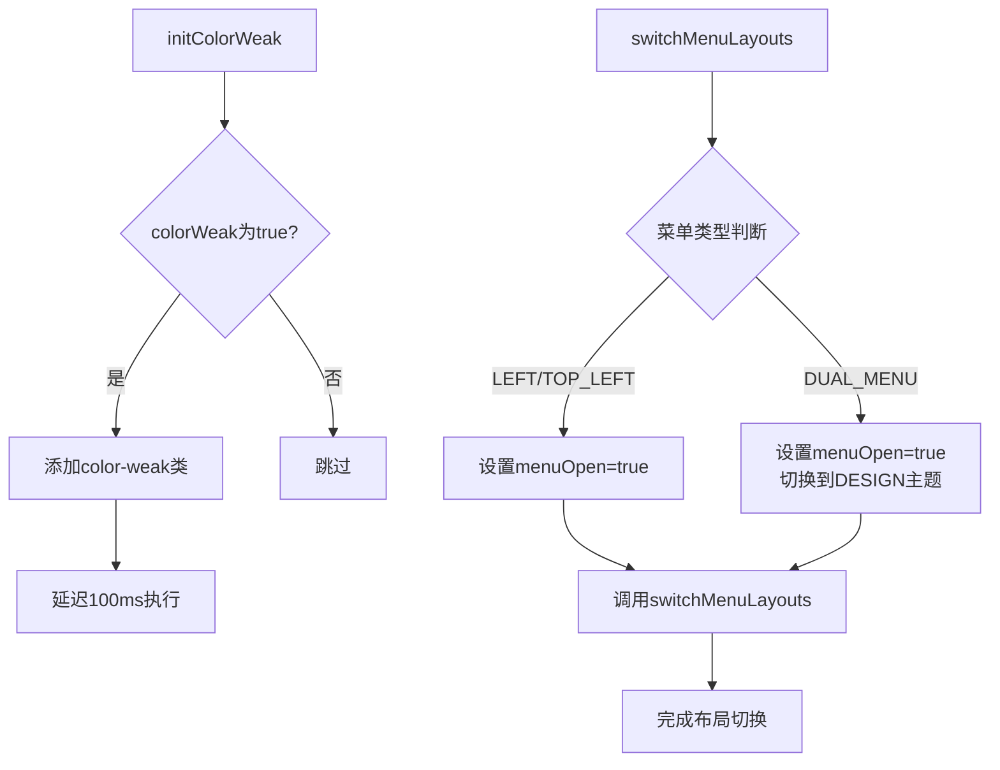

**图表来源**
- [src/components/core/layouts/art-settings-panel/composables/useSettingsState.ts](file://src/components/core/layouts/art-settings-panel/composables/useSettingsState.ts#L7-L38)

### useSettingsConfig 组合式函数

`useSettingsConfig` 提供配置项的定义和选项管理功能，支持动态生成设置项配置。

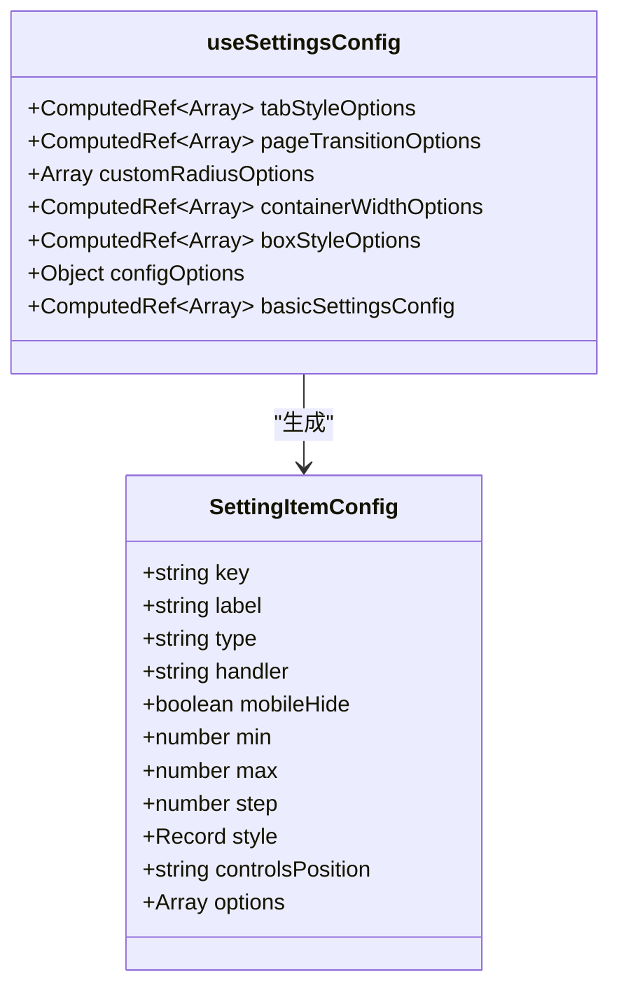

**图表来源**
- [src/components/core/layouts/art-settings-panel/composables/useSettingsConfig.ts](file://src/components/core/layouts/art-settings-panel/composables/useSettingsConfig.ts#L1-L249)

### useSettingsHandlers 组合式函数

`useSettingsHandlers` 包含所有设置项的处理逻辑，提供统一的事件处理机制。

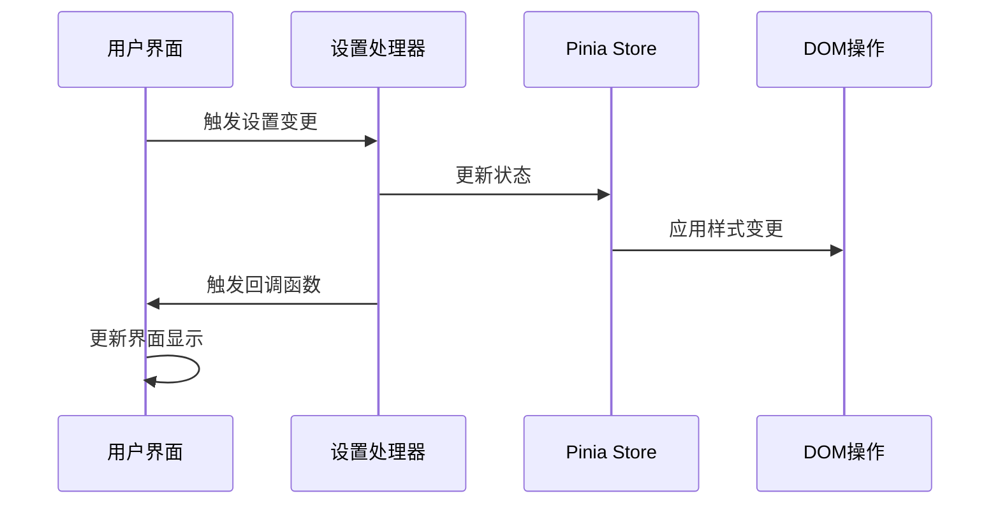

**图表来源**
- [src/components/core/layouts/art-settings-panel/composables/useSettingsHandlers.ts](file://src/components/core/layouts/art-settings-panel/composables/useSettingsHandlers.ts#L1-L168)

**章节来源**
- [src/components/core/layouts/art-settings-panel/composables/useSettingsState.ts](file://src/components/core/layouts/art-settings-panel/composables/useSettingsState.ts#L1-L38)
- [src/components/core/layouts/art-settings-panel/composables/useSettingsConfig.ts](file://src/components/core/layouts/art-settings-panel/composables/useSettingsConfig.ts#L1-L249)
- [src/components/core/layouts/art-settings-panel/composables/useSettingsHandlers.ts](file://src/components/core/layouts/art-settings-panel/composables/useSettingsHandlers.ts#L1-L168)

## 配置项详解

### 基础配置项

| 配置项 | 数据类型 | 默认值 | 描述 | 影响范围 |
|--------|----------|--------|------|----------|
| showWorkTab | boolean | true | 是否显示工作台标签页 | 标签页显示 |
| uniqueOpened | boolean | true | 是否启用菜单手风琴模式 | 菜单折叠行为 |
| showMenuButton | boolean | true | 是否显示菜单折叠按钮 | 侧边栏控制 |
| showFastEnter | boolean | true | 是否显示快速入口功能 | 快速访问 |
| showRefreshButton | boolean | true | 是否显示页面刷新按钮 | 页面控制 |
| showCrumbs | boolean | true | 是否显示面包屑导航 | 导航显示 |
| showLanguage | boolean | true | 是否显示语言切换功能 | 国际化 |
| showNprogress | boolean | false | 是否显示页面进度条 | 加载指示 |
| colorWeak | boolean | false | 是否启用色弱模式 | 视觉辅助 |
| watermarkVisible | boolean | false | 是否显示水印 | 版权保护 |

### 主题配置项

| 配置项 | 数据类型 | 默认值 | 描述 | 影响范围 |
|--------|----------|--------|------|----------|
| systemThemeType | SystemThemeEnum | AUTO | 系统主题类型 | 整体主题 |
| systemThemeMode | SystemThemeEnum | AUTO | 系统主题模式 | 明暗切换 |
| menuThemeType | MenuThemeEnum | DESIGN | 菜单主题类型 | 菜单外观 |
| systemThemeColor | string | 主题色列表第一项 | 系统主题颜色 | 主色调 |
| boxBorderMode | boolean | true | 盒子样式模式 | 容器外观 |

### 布局配置项

| 配置项 | 数据类型 | 默认值 | 描述 | 影响范围 |
|--------|----------|--------|------|----------|
| menuType | MenuTypeEnum | LEFT | 菜单布局类型 | 菜单位置 |
| menuOpenWidth | number | 230 | 菜单展开宽度 | 侧边栏尺寸 |
| menuOpen | boolean | true | 菜单初始展开状态 | 菜单可见性 |
| dualMenuShowText | boolean | false | 双菜单是否显示文本 | 菜单显示 |
| containerWidth | ContainerWidthEnum | FULL | 容器宽度 | 页面布局 |

### 样式配置项

| 配置项 | 数据类型 | 默认值 | 描述 | 影响范围 |
|--------|----------|--------|------|----------|
| pageTransition | string | slide-left | 页面切换动画 | 路由过渡 |
| tabStyle | string | tab-default | 标签页样式 | 标签页外观 |
| customRadius | string | 0.75 | 自定义圆角大小 | 元素圆角 |
| boxStyle | string | border-mode | 盒子样式 | 容器装饰 |

**章节来源**
- [src/config/setting.ts](file://src/config/setting.ts#L29-L88)
- [src/store/modules/setting.ts](file://src/store/modules/setting.ts#L50-L115)

## 状态管理

### SettingStore 架构

SettingStore 采用 Pinia 状态管理库，提供完整的系统设置状态管理功能。

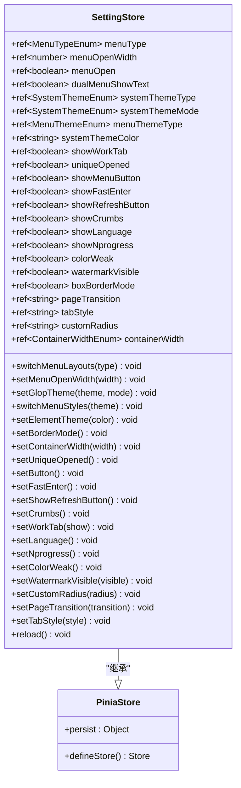

**图表来源**
- [src/store/modules/setting.ts](file://src/store/modules/setting.ts#L47-L451)

### 持久化机制

设置状态通过 Pinia 的持久化插件自动保存到 localStorage：

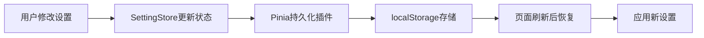

**图表来源**
- [src/store/modules/setting.ts](file://src/store/modules/setting.ts#L444-L449)

**章节来源**
- [src/store/modules/setting.ts](file://src/store/modules/setting.ts#L1-L451)

## UI组件交互

### SettingItem 组件

SettingItem 是基础设置项的通用渲染组件，支持多种输入类型：

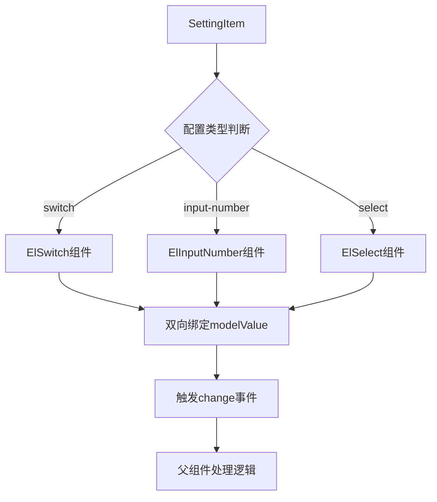

**图表来源**
- [src/components/core/layouts/art-settings-panel/widget/SettingItem.vue](file://src/components/core/layouts/art-settings-panel/widget/SettingItem.vue#L1-L102)

### 事件处理机制

设置项的事件处理遵循统一的模式：

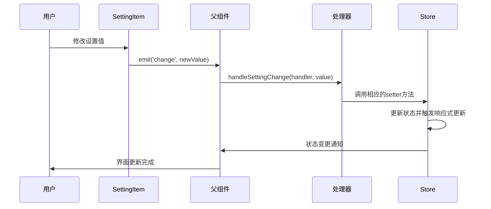

**图表来源**
- [src/components/core/layouts/art-settings-panel/widget/BasicSettings.vue](file://src/components/core/layouts/art-settings-panel/widget/BasicSettings.vue#L68-L77)

**章节来源**
- [src/components/core/layouts/art-settings-panel/widget/SettingItem.vue](file://src/components/core/layouts/art-settings-panel/widget/SettingItem.vue#L1-L102)
- [src/components/core/layouts/art-settings-panel/widget/BasicSettings.vue](file://src/components/core/layouts/art-settings-panel/widget/BasicSettings.vue#L1-L78)

## 自定义扩展

### 添加新的基础设置项

要添加新的基础设置项，需要修改 `useSettingsConfig` 中的 `basicSettingsConfig` 计算属性：

```typescript
// 在 basicSettingsConfig 中添加新的配置项
{
  key: 'newFeatureEnabled',
  label: t('setting.basics.list.newFeature'),
  type: 'switch' as const,
  handler: 'newFeature',
  headerBarKey: null
}
```

然后在 `useSettingsHandlers` 中添加对应的处理器：

```typescript
// 在 basicHandlers 中添加新的处理器
newFeature: createToggleHandler(() => settingStore.setNewFeature(!settingStore.newFeatureEnabled))
```

### 自定义设置项类型

可以通过扩展 `SettingItemConfig` 接口来支持新的配置类型：

```typescript
interface CustomSettingItemConfig extends SettingItemConfig {
  customProp?: string
  validator?: (value: any) => boolean
}

// 在 SettingItem 中处理自定义类型
const handleCustomChange = (value: any) => {
  if (props.config.validator?.(value)) {
    emit('change', value)
  } else {
    console.warn('Invalid value for custom setting')
  }
}
```

### 响应式绑定机制

设置项的响应式绑定通过 Vue 的 `storeToRefs` 和计算属性实现：

```typescript
// 在 BasicSettings 中创建响应式映射
const settingValueMap = {
  newFeatureEnabled: computed(() => settingStore.newFeatureEnabled),
  // ... 其他设置项
}

// 获取设置值的方法
const getSettingValue = (key: string) => {
  const settingRef = settingValueMap[key as keyof typeof settingValueMap]
  return settingRef?.value ?? null
}
```

**章节来源**
- [src/components/core/layouts/art-settings-panel/composables/useSettingsConfig.ts](file://src/components/core/layouts/art-settings-panel/composables/useSettingsConfig.ts#L102-L234)
- [src/components/core/layouts/art-settings-panel/composables/useSettingsHandlers.ts](file://src/components/core/layouts/art-settings-panel/composables/useSettingsHandlers.ts#L61-L117)

## 最佳实践

### 性能优化

1. **使用 VueUse 的响应式工具**：利用 `useBreakpoints` 优化移动端适配
2. **懒加载组件**：按需加载设置面板组件
3. **防抖处理**：对频繁的设置变更进行防抖处理

### 错误处理

1. **配置验证**：在设置处理器中添加输入验证
2. **回滚机制**：设置失败时自动回滚到上一个有效状态
3. **错误提示**：提供清晰的错误信息和解决建议

### 国际化支持

1. **翻译键命名规范**：使用层级化的翻译键名
2. **动态语言切换**：支持运行时语言切换
3. **本地化测试**：确保所有配置项都支持国际化

### 主题动画

1. **渐进式增强**：优先支持现代浏览器的 View Transition API
2. **降级处理**：为不支持的浏览器提供替代方案
3. **性能考虑**：避免在动画期间进行大量计算

### 测试策略

1. **单元测试**：测试各个组合式函数的逻辑
2. **集成测试**：测试组件间的交互
3. **端到端测试**：测试完整的设置流程

通过遵循这些最佳实践，可以确保基础设置模块的稳定性、可维护性和用户体验质量。