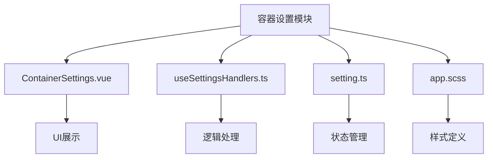
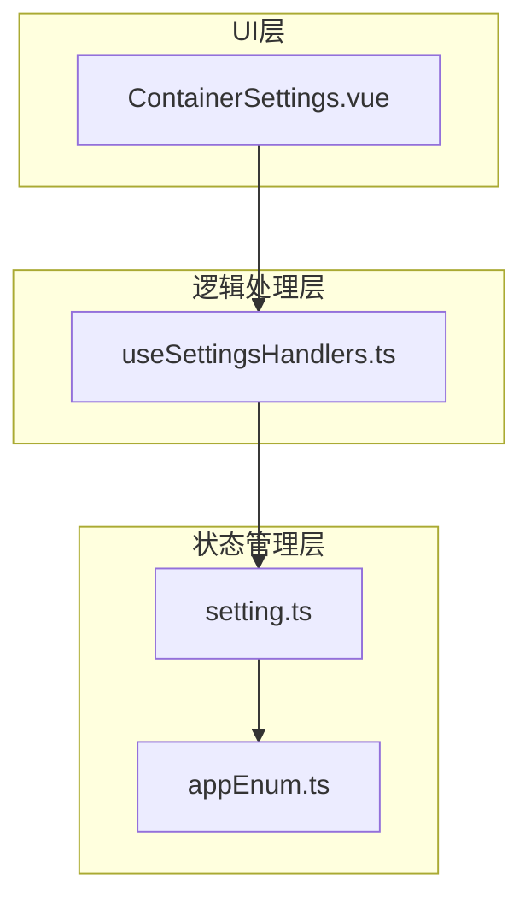
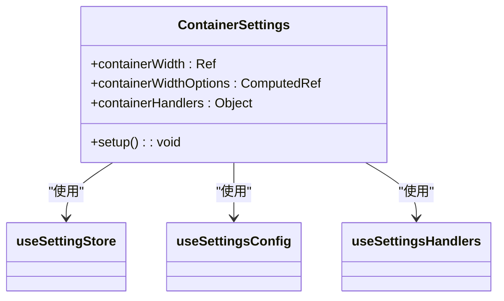
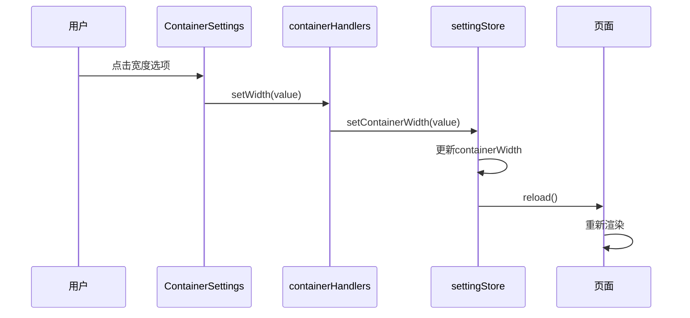
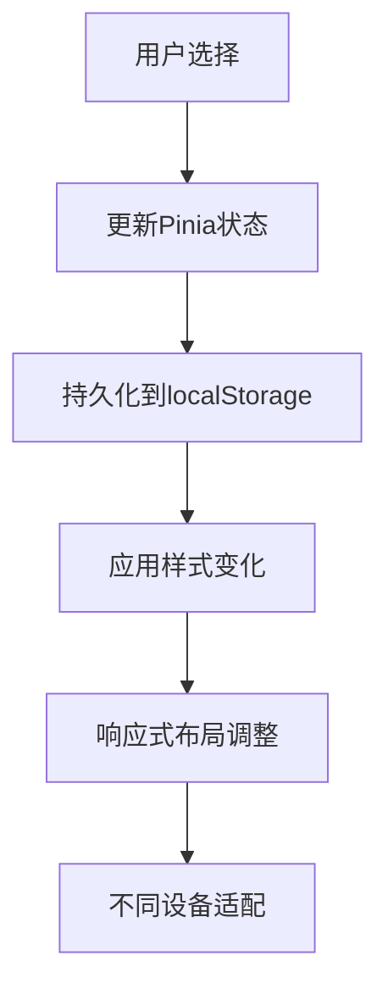
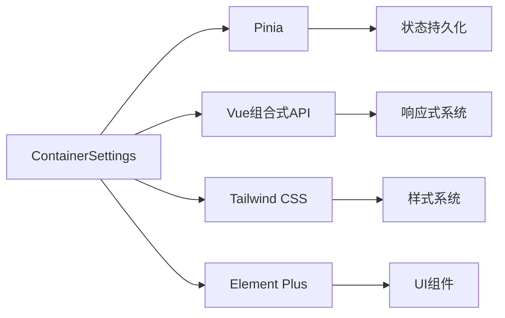

# 容器设置

<cite>
**本文档引用文件**  
- [ContainerSettings.vue](file://src/components/core/layouts/art-settings-panel/widget/ContainerSettings.vue)
- [useSettingsHandlers.ts](file://src/components/core/layouts/art-settings-panel/composables/useSettingsHandlers.ts)
- [setting.ts](file://src/store/modules/setting.ts)
- [app.scss](file://src/assets/styles/core/app.scss)
- [art-page-content/index.vue](file://src/components/core/layouts/art-page-content/index.vue)
- [useLayoutHeight.ts](file://src/hooks/core/useLayoutHeight.ts)
- [appEnum.ts](file://src/enums/appEnum.ts)
- [setting.ts](file://src/config/setting.ts)
</cite>

## 目录
1. [简介](#简介)
2. [项目结构](#项目结构)
3. [核心组件](#核心组件)
4. [架构概述](#架构概述)
5. [详细组件分析](#详细组件分析)
6. [依赖分析](#依赖分析)
7. [性能考虑](#性能考虑)
8. [故障排除指南](#故障排除指南)
9. [结论](#结论)

## 简介
容器设置模块是系统布局配置的核心组件，负责管理页面内容区域的宽度模式、内边距和最大宽度限制。该模块通过响应式设计策略，确保应用在不同设备和屏幕尺寸下都能提供最佳的用户体验。通过与布局组件的通信机制，容器设置能够动态调整样式，实现全屏和固定宽度模式之间的无缝切换。

## 项目结构
容器设置功能主要分布在设置面板组件中，通过组合式API实现状态管理和逻辑处理。核心文件包括容器设置组件、状态管理模块和样式定义文件。

**图示来源**  
- [ContainerSettings.vue](file://src/components/core/layouts/art-settings-panel/widget/ContainerSettings.vue)
- [useSettingsHandlers.ts](file://src/components/core/layouts/art-settings-panel/composables/useSettingsHandlers.ts)
- [setting.ts](file://src/store/modules/setting.ts)
- [app.scss](file://src/assets/styles/core/app.scss)

## 核心组件
容器设置组件提供用户界面，允许用户选择不同的容器宽度模式。组件通过Pinia状态管理与全局设置进行同步，并通过事件处理机制更新应用状态。

**组件来源**  
- [ContainerSettings.vue](file://src/components/core/layouts/art-settings-panel/widget/ContainerSettings.vue)
- [setting.ts](file://src/store/modules/setting.ts)

## 架构概述
容器设置模块采用分层架构设计，包含UI层、逻辑处理层和状态管理层。UI层负责展示设置选项，逻辑处理层处理用户交互，状态管理层维护和持久化设置数据。

**图示来源**  
- [ContainerSettings.vue](file://src/components/core/layouts/art-settings-panel/widget/ContainerSettings.vue)
- [useSettingsHandlers.ts](file://src/components/core/layouts/art-settings-panel/composables/useSettingsHandlers.ts)
- [setting.ts](file://src/store/modules/setting.ts)
- [appEnum.ts](file://src/enums/appEnum.ts)

## 详细组件分析

### 容器设置组件分析
容器设置组件提供直观的界面，让用户能够选择全屏或固定宽度模式。组件通过计算属性获取当前设置状态，并在用户选择时触发相应的处理函数。

**图示来源**  
- [ContainerSettings.vue](file://src/components/core/layouts/art-settings-panel/widget/ContainerSettings.vue)
- [useSettingsConfig.ts](file://src/components/core/layouts/art-settings-panel/composables/useSettingsConfig.ts)
- [useSettingsHandlers.ts](file://src/components/core/layouts/art-settings-panel/composables/useSettingsHandlers.ts)

### 逻辑处理分析
容器设置的逻辑处理通过`useSettingsHandlers`组合式函数实现。该函数提供`setWidth`方法，用于更新容器宽度设置并触发页面刷新。

**图示来源**  
- [ContainerSettings.vue](file://src/components/core/layouts/art-settings-panel/widget/ContainerSettings.vue)
- [useSettingsHandlers.ts](file://src/components/core/layouts/art-settings-panel/composables/useSettingsHandlers.ts)
- [setting.ts](file://src/store/modules/setting.ts)

### 状态管理分析
容器宽度设置通过Pinia状态管理进行持久化存储。设置数据在浏览器刷新后仍能保持，确保用户体验的一致性。

**图示来源**  
- [setting.ts](file://src/store/modules/setting.ts)
- [setting.ts](file://src/config/setting.ts)

## 依赖分析
容器设置模块依赖于多个核心组件和工具，包括状态管理、组合式API和样式系统。这些依赖关系确保了模块的完整性和可维护性。

**图示来源**  
- [setting.ts](file://src/store/modules/setting.ts)
- [useSettingsHandlers.ts](file://src/components/core/layouts/art-settings-panel/composables/useSettingsHandlers.ts)
- [app.scss](file://src/assets/styles/core/app.scss)

## 性能考虑
容器设置模块在设计时充分考虑了性能优化，避免了过度重绘和布局抖动。通过使用CSS变量和响应式计算，确保布局调整的高效性。

**优化策略来源**  
- [useLayoutHeight.ts](file://src/hooks/core/useLayoutHeight.ts)
- [app.scss](file://src/assets/styles/core/app.scss)
- [art-page-content/index.vue](file://src/components/core/layouts/art-page-content/index.vue)

## 故障排除指南
当容器设置功能出现异常时，可按照以下步骤进行排查：

1. 检查Pinia状态是否正确更新
2. 验证localStorage中的设置数据
3. 确认CSS类名是否正确应用
4. 检查响应式计算是否正常工作

**故障排除来源**  
- [setting.ts](file://src/store/modules/setting.ts)
- [useSettingsHandlers.ts](file://src/components/core/layouts/art-settings-panel/composables/useSettingsHandlers.ts)

## 结论
容器设置模块通过清晰的架构设计和高效的实现方式，为应用提供了灵活的布局配置能力。模块的响应式特性确保了在各种设备上的良好表现，而状态持久化机制则提升了用户体验的一致性。通过与其他布局设置的协同工作，容器设置模块构成了系统整体布局管理的重要组成部分。