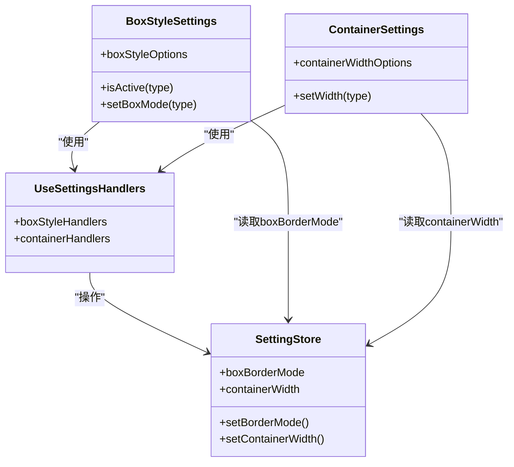
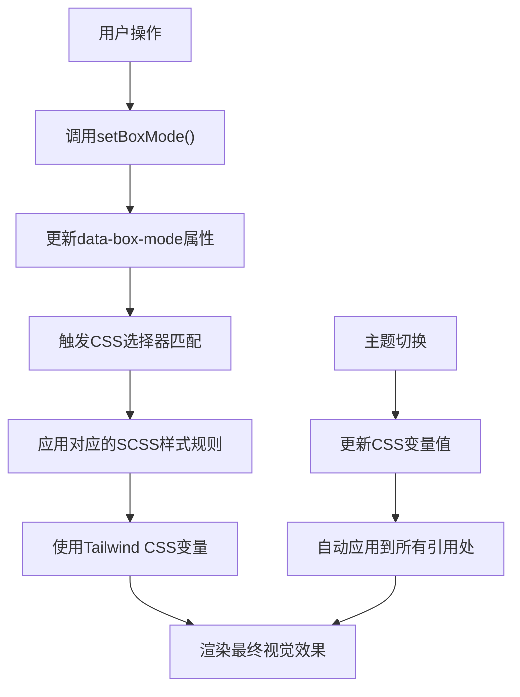
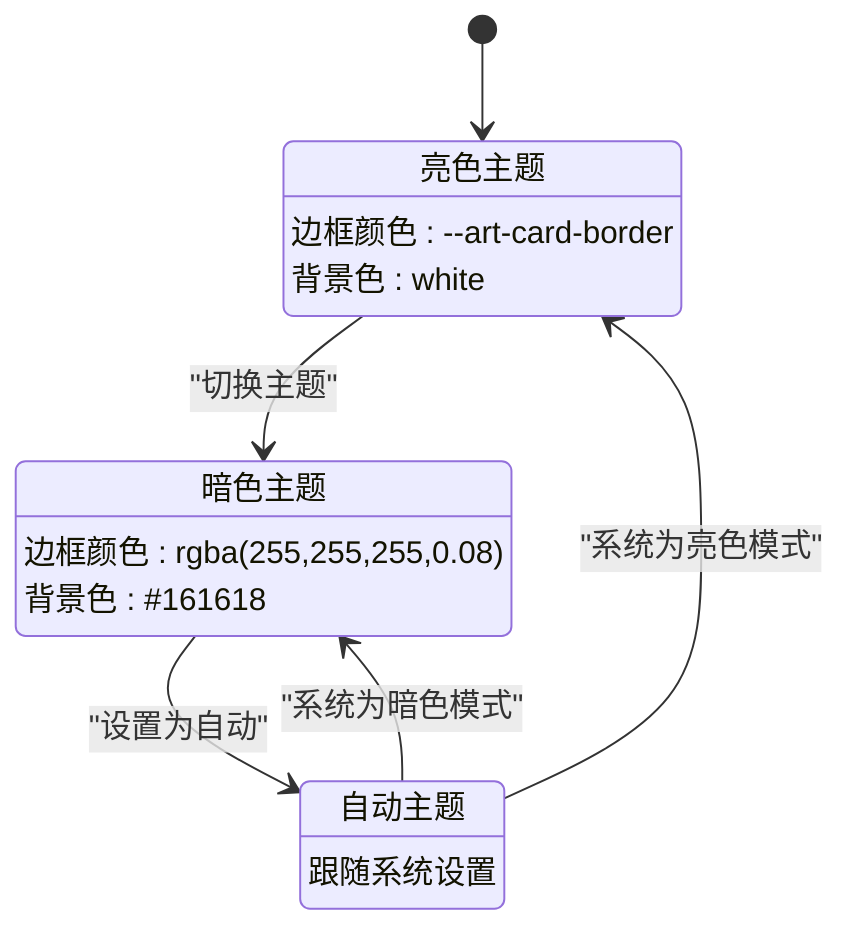

# 盒子样式设置

<cite>
**本文档引用文件**  
- [BoxStyleSettings.vue](file://src/components/core/layouts/art-settings-panel/widget/BoxStyleSettings.vue)
- [ContainerSettings.vue](file://src/components/core/layouts/art-settings-panel/widget/ContainerSettings.vue)
- [useSettingsConfig.ts](file://src/components/core/layouts/art-settings-panel/composables/useSettingsConfig.ts)
- [useSettingsHandlers.ts](file://src/components/core/layouts/art-settings-panel/composables/useSettingsHandlers.ts)
- [setting.ts](file://src/store/modules/setting.ts)
- [app.scss](file://src/assets/styles/core/app.scss)
- [tailwind.css](file://src/assets/styles/core/tailwind.css)
- [theme-change.scss](file://src/assets/styles/core/theme-change.scss)
- [appEnum.ts](file://src/enums/appEnum.ts)
- [setting.ts](file://src/config/setting.ts)
</cite>

## 目录
1. [简介](#简介)
2. [核心功能](#核心功能)
3. [组件关联性分析](#组件关联性分析)
4. [样式动态注入原理](#样式动态注入原理)
5. [主题模式下的样式表现差异](#主题模式下的样式表现差异)
6. [布局异常调试检查清单](#布局异常调试检查清单)

## 简介
盒子样式设置模块是系统界面定制化的重要组成部分，用于控制页面容器是否启用卡片式布局（box layout）。该功能通过切换边框模式和阴影模式，显著影响整体UI的视觉层次结构。本模块与容器设置模块紧密关联，共同实现页面布局的精细化控制。

**Section sources**
- [BoxStyleSettings.vue](file://src/components/core/layouts/art-settings-panel/widget/BoxStyleSettings.vue#L1-L38)
- [ContainerSettings.vue](file://src/components/core/layouts/art-settings-panel/widget/ContainerSettings.vue#L1-L33)

## 核心功能
盒子样式设置提供两种主要布局模式：边框模式（border-mode）和阴影模式（shadow-mode）。用户可通过设置面板切换这两种模式，系统会相应地调整页面容器的视觉表现。

在边框模式下，页面内容区域（`.page-content`）和表格卡片（`.art-table-card`）会显示1px的实线边框，使用`--art-card-border`变量定义的颜色。而在阴影模式下，这些元素则会应用轻微的阴影效果（`box-shadow: 0px 0px 4px 0px rgba(0, 0, 0, 0.04)`）并配合`--art-gray-200`的边框颜色，创造出更立体的视觉效果。

该功能通过`data-box-mode`属性在根元素上进行状态管理，当用户选择不同模式时，系统会调用`domOperations.setRootAttribute`方法更新此属性，从而触发相应的CSS样式规则。

**Section sources**
- [BoxStyleSettings.vue](file://src/components/core/layouts/art-settings-panel/widget/BoxStyleSettings.vue#L1-L38)
- [useSettingsHandlers.ts](file://src/components/core/layouts/art-settings-panel/composables/useSettingsHandlers.ts#L120-L137)
- [setting.ts](file://src/store/modules/setting.ts#L209-L211)
- [app.scss](file://src/assets/styles/core/app.scss#L104-L134)

## 组件关联性分析
盒子样式设置模块与容器设置模块存在紧密的关联性，二者共同作用于页面布局的视觉呈现。容器设置控制页面的宽度模式（全屏或固定宽度），而盒子样式设置则决定容器的视觉表现形式。

当容器设置为固定宽度（boxed）时，盒子样式设置的效果最为明显，能够充分展现卡片式布局的设计美感。两个组件通过Pinia状态管理器共享状态，`settingStore`中的`boxBorderMode`和`containerWidth`分别存储了盒子样式和容器宽度的当前状态。

在样式冲突处理方面，系统采用CSS优先级和属性覆盖机制。通过在`[data-box-mode]`属性选择器上使用`!important`标记，确保盒子样式设置能够优先于其他样式规则。同时，利用CSS自定义属性（CSS Variables）实现样式的动态注入，避免了样式冲突问题。

**Diagram sources**
- [BoxStyleSettings.vue](file://src/components/core/layouts/art-settings-panel/widget/BoxStyleSettings.vue#L1-L38)
- [ContainerSettings.vue](file://src/components/core/layouts/art-settings-panel/widget/ContainerSettings.vue#L1-L33)
- [useSettingsHandlers.ts](file://src/components/core/layouts/art-settings-panel/composables/useSettingsHandlers.ts#L119-L156)
- [setting.ts](file://src/store/modules/setting.ts#L106-L114)

**Section sources**
- [BoxStyleSettings.vue](file://src/components/core/layouts/art-settings-panel/widget/BoxStyleSettings.vue#L1-L38)
- [ContainerSettings.vue](file://src/components/core/layouts/art-settings-panel/widget/ContainerSettings.vue#L1-L33)
- [useSettingsConfig.ts](file://src/components/core/layouts/art-settings-panel/composables/useSettingsConfig.ts#L62-L88)
- [setting.ts](file://src/store/modules/setting.ts#L106-L114)

## 样式动态注入原理
系统采用Tailwind CSS与SCSS混合的样式管理方案，通过CSS自定义属性实现样式的动态注入。核心原理是利用`tailwind.css`中定义的主题变量与`app.scss`中的Sass混合宏（mixin）相结合。

在`tailwind.css`文件中，系统定义了暗色模式下的颜色变量，如`--art-gray-200`、`--art-card-border`等。这些变量在`app.scss`中被引用，特别是在`art-card-base`混合宏中作为参数使用。当主题切换时，这些CSS变量的值会自动更新，从而实现样式的动态变化。

**Diagram sources**
- [tailwind.css](file://src/assets/styles/core/tailwind.css#L50-L101)
- [app.scss](file://src/assets/styles/core/app.scss#L89-L96)
- [theme-change.scss](file://src/assets/styles/core/theme-change.scss#L1-L11)

**Section sources**
- [tailwind.css](file://src/assets/styles/core/tailwind.css#L50-L101)
- [app.scss](file://src/assets/styles/core/app.scss#L89-L160)
- [theme-change.scss](file://src/assets/styles/core/theme-change.scss#L1-L11)

## 主题模式下的样式表现差异
盒子样式在不同主题模式下表现出显著的视觉差异，系统通过CSS的`:root`和`.dark`选择器实现主题适配。

在亮色主题下，边框模式使用较深的灰色边框（`--art-card-border`），而阴影模式则采用浅灰色边框（`--art-gray-200`）配合轻微阴影，营造出轻盈的卡片效果。在暗色主题下，边框颜色调整为带有透明度的白色（`rgba(255, 255, 255, 0.08)`），阴影效果也相应调整以适应暗色背景。

特别值得注意的是，系统在暗色模式下对卡片背景色进行了优化，使用`--default-box-color`变量（值为`#161618`）作为卡片背景，既保证了与整体暗色主题的协调性，又通过细微的色差创造了足够的视觉层次。

**Diagram sources**
- [tailwind.css](file://src/assets/styles/core/tailwind.css#L50-L84)
- [app.scss](file://src/assets/styles/core/app.scss#L104-L160)

**Section sources**
- [tailwind.css](file://src/assets/styles/core/tailwind.css#L50-L84)
- [app.scss](file://src/assets/styles/core/app.scss#L104-L160)
- [setting.ts](file://src/store/modules/setting.ts#L62-L64)

## 布局异常调试检查清单
当出现布局异常时，可按照以下检查清单进行排查：

### 边距计算检查
1. 检查`.page-content`元素的`margin`和`padding`设置
2. 验证`box-sizing`属性是否为`border-box`
3. 确认父容器的布局模式（flex或grid）是否影响子元素尺寸计算

### 阴影层级检查
1. 检查`box-shadow`属性的z-index值是否与其他元素冲突
2. 验证`position`属性设置是否正确
3. 确认`overflow`属性是否裁剪了阴影效果

### 响应式断点适配检查
1. 检查在不同屏幕尺寸下的`containerWidth`设置
2. 验证媒体查询断点是否正确应用
3. 确认移动端特殊样式是否覆盖了桌面端样式

### 样式冲突排查
1. 检查浏览器开发者工具中的样式优先级
2. 验证`!important`标记是否被正确应用
3. 确认CSS变量是否被正确继承和覆盖

### 状态同步检查
1. 验证`settingStore`中的`boxBorderMode`状态是否正确
2. 检查`data-box-mode`属性是否与状态同步
3. 确认Pinia状态持久化是否正常工作

**Section sources**
- [app.scss](file://src/assets/styles/core/app.scss#L104-L160)
- [BoxStyleSettings.vue](file://src/components/core/layouts/art-settings-panel/widget/BoxStyleSettings.vue#L1-L38)
- [useSettingsHandlers.ts](file://src/components/core/layouts/art-settings-panel/composables/useSettingsHandlers.ts#L120-L137)
- [setting.ts](file://src/store/modules/setting.ts#L106-L114)