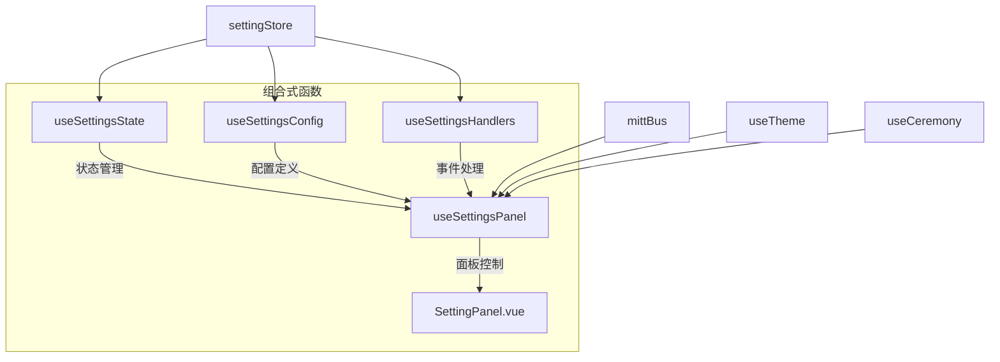
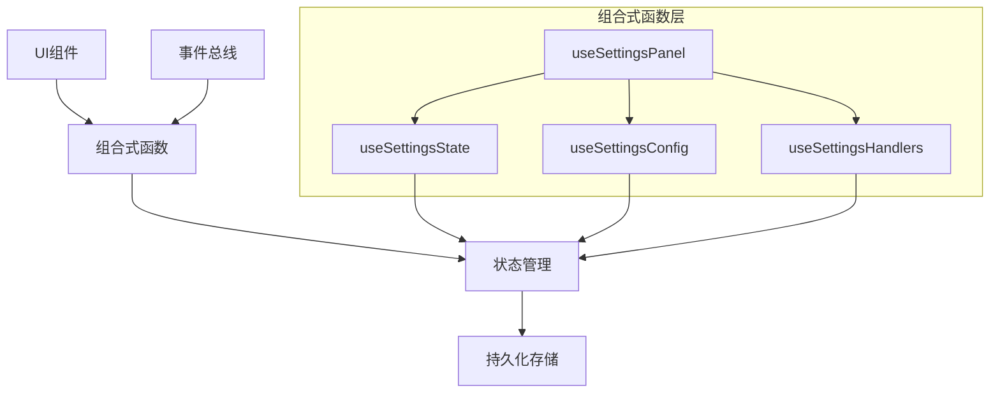
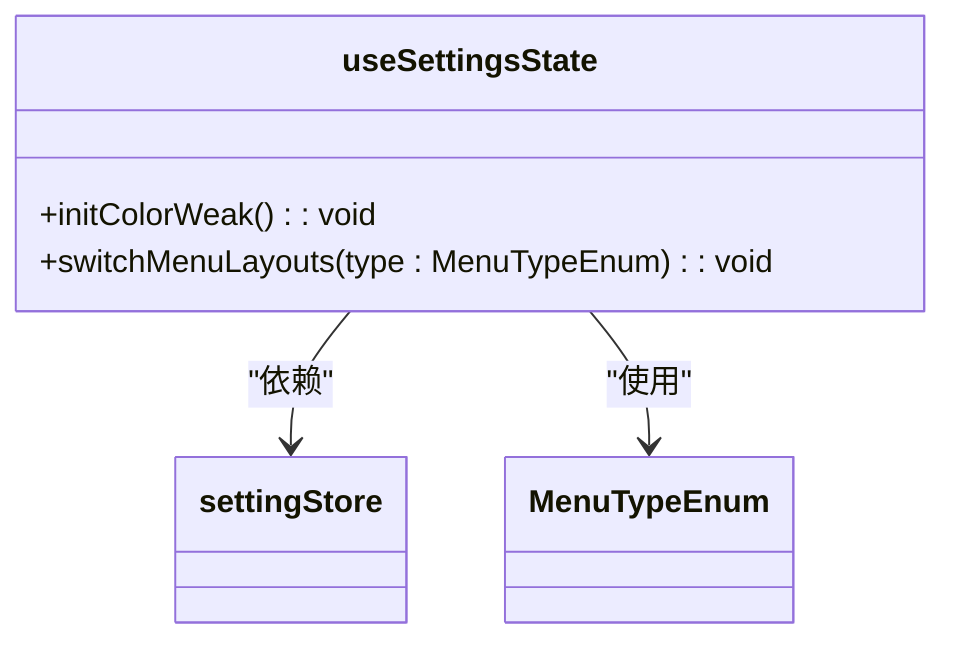
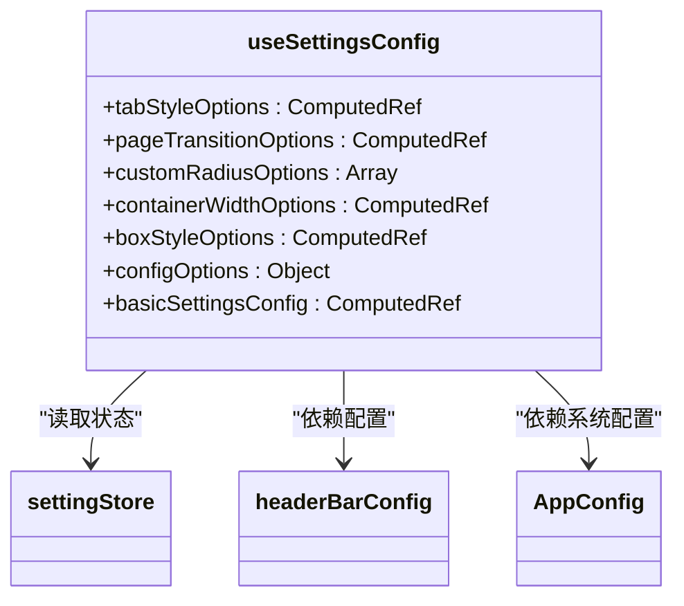
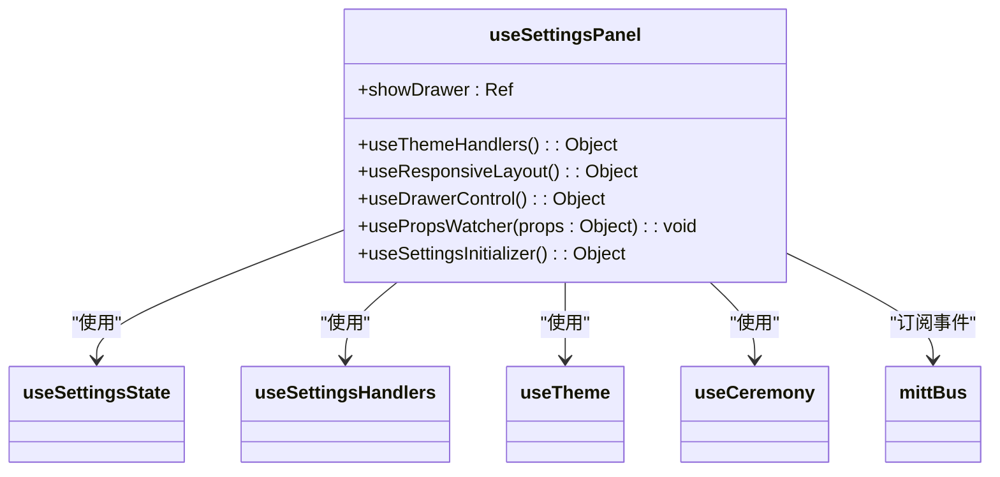
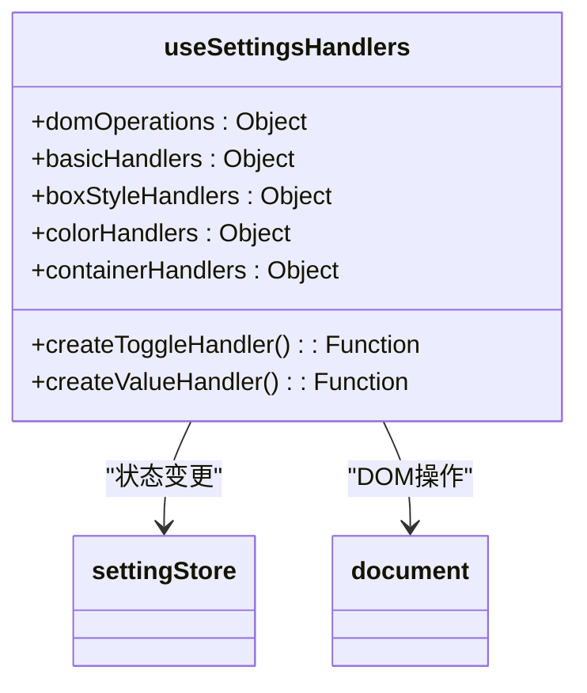
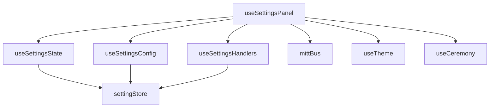

# 组合式函数

<cite>
**本文档引用的文件**
- [useSettingsState.ts](file://src/components/core/layouts/art-settings-panel/composables/useSettingsState.ts)
- [useSettingsConfig.ts](file://src/components/core/layouts/art-settings-panel/composables/useSettingsConfig.ts)
- [useSettingsPanel.ts](file://src/components/core/layouts/art-settings-panel/composables/useSettingsPanel.ts)
- [useSettingsHandlers.ts](file://src/components/core/layouts/art-settings-panel/composables/useSettingsHandlers.ts)
- [setting.ts](file://src/store/modules/setting.ts)
- [appEnum.ts](file://src/enums/appEnum.ts)
- [setting.ts](file://src/config/setting.ts)
- [index.ts](file://src/types/config/index.ts)
- [mittBus.ts](file://src/utils/sys/mittBus.ts)
- [index.vue](file://src/components/core/layouts/art-settings-panel/index.vue)
</cite>

## 目录
1. [引言](#引言)
2. [项目结构](#项目结构)
3. [核心组件](#核心组件)
4. [架构概述](#架构概述)
5. [详细组件分析](#详细组件分析)
6. [依赖分析](#依赖分析)
7. [性能考虑](#性能考虑)
8. [故障排除指南](#故障排除指南)
9. [结论](#结论)
10. [附录](#附录)（如有必要）

## 引言
本文档系统性地解析了设置面板的组合式函数架构，重点阐述了`useSettingsState`（状态管理）、`useSettingsConfig`（配置定义）、`useSettingsPanel`（面板控制）和`useSettingsHandlers`（事件处理）四个核心组合式函数的职责划分与协作机制。通过深入分析响应式状态的构建方式、配置项的Schema定义与UI生成机制、事件总线模式在跨组件通信中的应用以及错误边界处理策略，为开发者提供完整的开发范式指导。同时，文档还提供了扩展新组合式函数的最佳实践，包括类型定义、依赖注入和单元测试建议。

## 项目结构
设置面板的组合式函数系统位于`src/components/core/layouts/art-settings-panel/composables/`目录下，采用模块化设计，将不同职责分离到独立的文件中。这种设计模式遵循了单一职责原则，使得每个组合式函数专注于特定领域的功能实现。

**图示来源**
- [useSettingsState.ts](file://src/components/core/layouts/art-settings-panel/composables/useSettingsState.ts)
- [useSettingsConfig.ts](file://src/components/core/layouts/art-settings-panel/composables/useSettingsConfig.ts)
- [useSettingsPanel.ts](file://src/components/core/layouts/art-settings-panel/composables/useSettingsPanel.ts)
- [useSettingsHandlers.ts](file://src/components/core/layouts/art-settings-panel/composables/useSettingsHandlers.ts)
- [setting.ts](file://src/store/modules/setting.ts)
- [mittBus.ts](file://src/utils/sys/mittBus.ts)

**本节来源**
- [useSettingsState.ts](file://src/components/core/layouts/art-settings-panel/composables/useSettingsState.ts)
- [useSettingsConfig.ts](file://src/components/core/layouts/art-settings-panel/composables/useSettingsConfig.ts)
- [useSettingsPanel.ts](file://src/components/core/layouts/art-settings-panel/composables/useSettingsPanel.ts)
- [useSettingsHandlers.ts](file://src/components/core/layouts/art-settings-panel/composables/useSettingsHandlers.ts)

## 核心组件
设置面板的组合式函数系统由四个核心组件构成，它们通过清晰的职责划分和紧密的协作，实现了复杂的状态管理和UI交互逻辑。`useSettingsState`负责基础状态操作，`useSettingsConfig`管理配置选项，`useSettingsPanel`作为协调中心控制整体流程，而`useSettingsHandlers`则提供通用的事件处理逻辑。

**本节来源**
- [useSettingsState.ts](file://src/components/core/layouts/art-settings-panel/composables/useSettingsState.ts)
- [useSettingsConfig.ts](file://src/components/core/layouts/art-settings-panel/composables/useSettingsConfig.ts)
- [useSettingsPanel.ts](file://src/components/core/layouts/art-settings-panel/composables/useSettingsPanel.ts)
- [useSettingsHandlers.ts](file://src/components/core/layouts/art-settings-panel/composables/useSettingsHandlers.ts)

## 架构概述
设置面板的架构采用分层设计模式，上层为UI组件，中层为组合式函数，底层为状态管理。这种架构实现了关注点分离，使得代码更易于维护和扩展。事件总线模式被用于解耦组件间的直接依赖，实现了跨层级的通信。

**图示来源**
- [useSettingsPanel.ts](file://src/components/core/layouts/art-settings-panel/composables/useSettingsPanel.ts)
- [setting.ts](file://src/store/modules/setting.ts)
- [mittBus.ts](file://src/utils/sys/mittBus.ts)

## 详细组件分析
本节将深入分析每个核心组合式函数的实现细节，包括其职责、内部逻辑和与其他组件的交互方式。

### useSettingsState 分析
`useSettingsState`组合式函数主要负责管理设置面板的基础状态操作，包括色弱模式初始化和菜单布局切换。它通过Pinia store进行状态管理，确保状态的响应性和一致性。

**图示来源**
- [useSettingsState.ts](file://src/components/core/layouts/art-settings-panel/composables/useSettingsState.ts)
- [setting.ts](file://src/store/modules/setting.ts)
- [appEnum.ts](file://src/enums/appEnum.ts)

**本节来源**
- [useSettingsState.ts](file://src/components/core/layouts/art-settings-panel/composables/useSettingsState.ts)

### useSettingsConfig 分析
`useSettingsConfig`组合式函数负责管理设置项的配置选项，包括各种下拉选项、开关配置和输入限制。它通过计算属性动态生成配置选项，并根据系统配置和用户偏好进行过滤，确保UI显示的配置项是有效的。

**图示来源**
- [useSettingsConfig.ts](file://src/components/core/layouts/art-settings-panel/composables/useSettingsConfig.ts)
- [setting.ts](file://src/store/modules/setting.ts)
- [index.ts](file://src/types/config/index.ts)

**本节来源**
- [useSettingsConfig.ts](file://src/components/core/layouts/art-settings-panel/composables/useSettingsConfig.ts)

### useSettingsPanel 分析
`useSettingsPanel`是设置面板的核心协调者，负责整合其他组合式函数的功能，管理抽屉的打开关闭、响应式布局调整和系统主题初始化。它通过提供一系列"use"前缀的方法组合，实现了功能的模块化和可复用性。

**图示来源**
- [useSettingsPanel.ts](file://src/components/core/layouts/art-settings-panel/composables/useSettingsPanel.ts)
- [useSettingsState.ts](file://src/components/core/layouts/art-settings-panel/composables/useSettingsState.ts)
- [useSettingsHandlers.ts](file://src/components/core/layouts/art-settings-panel/composables/useSettingsHandlers.ts)
- [mittBus.ts](file://src/utils/sys/mittBus.ts)

**本节来源**
- [useSettingsPanel.ts](file://src/components/core/layouts/art-settings-panel/composables/useSettingsPanel.ts)

### useSettingsHandlers 分析
`useSettingsHandlers`组合式函数提供了通用的事件处理逻辑，包括DOM操作、状态切换和值变更处理。它通过高阶函数`createToggleHandler`和`createValueHandler`实现了事件处理逻辑的抽象和复用，减少了代码重复。

**图示来源**
- [useSettingsHandlers.ts](file://src/components/core/layouts/art-settings-panel/composables/useSettingsHandlers.ts)
- [setting.ts](file://src/store/modules/setting.ts)

**本节来源**
- [useSettingsHandlers.ts](file://src/components/core/layouts/art-settings-panel/composables/useSettingsHandlers.ts)

## 依赖分析
设置面板的组合式函数系统具有清晰的依赖关系，每个组件都有明确的职责边界。`useSettingsPanel`作为顶层协调者，依赖于其他三个组合式函数；而所有组合式函数都依赖于Pinia store进行状态管理。事件总线模式的使用进一步降低了组件间的耦合度。

**图示来源**
- [useSettingsPanel.ts](file://src/components/core/layouts/art-settings-panel/composables/useSettingsPanel.ts)
- [useSettingsState.ts](file://src/components/core/layouts/art-settings-panel/composables/useSettingsState.ts)
- [useSettingsConfig.ts](file://src/components/core/layouts/art-settings-panel/composables/useSettingsConfig.ts)
- [useSettingsHandlers.ts](file://src/components/core/layouts/art-settings-panel/composables/useSettingsHandlers.ts)
- [setting.ts](file://src/store/modules/setting.ts)
- [mittBus.ts](file://src/utils/sys/mittBus.ts)

**本节来源**
- [useSettingsPanel.ts](file://src/components/core/layouts/art-settings-panel/composables/useSettingsPanel.ts)
- [useSettingsState.ts](file://src/components/core/layouts/art-settings-panel/composables/useSettingsState.ts)
- [useSettingsConfig.ts](file://src/components/core/layouts/art-settings-panel/composables/useSettingsConfig.ts)
- [useSettingsHandlers.ts](file://src/components/core/layouts/art-settings-panel/composables/useSettingsHandlers.ts)
- [setting.ts](file://src/store/modules/setting.ts)

## 性能考虑
设置面板的性能优化主要体现在以下几个方面：使用`useBreakpoints`进行响应式布局管理，避免了频繁的窗口大小监听；通过计算属性缓存配置选项，减少了重复计算；在初始化时合理管理事件监听器的生命周期，防止内存泄漏。此外，组合式函数的设计使得功能可以按需引入，避免了不必要的代码加载。

## 故障排除指南
当设置面板功能出现异常时，可以按照以下步骤进行排查：
1. 检查Pinia store的状态是否正确初始化
2. 验证事件总线的订阅和发布是否正常工作
3. 确认组合式函数之间的依赖注入是否正确
4. 检查响应式状态的更新是否触发了预期的UI变化
5. 验证配置选项的过滤逻辑是否符合预期

**本节来源**
- [setting.ts](file://src/store/modules/setting.ts)
- [mittBus.ts](file://src/utils/sys/mittBus.ts)
- [useSettingsPanel.ts](file://src/components/core/layouts/art-settings-panel/composables/useSettingsPanel.ts)

## 结论
本文档详细解析了设置面板组合式函数系统的架构设计和实现细节。通过`useSettingsState`、`useSettingsConfig`、`useSettingsPanel`和`useSettingsHandlers`四个核心组合式函数的协作，实现了复杂的状态管理和UI交互逻辑。该设计模式具有良好的可维护性和扩展性，为开发者提供了清晰的开发范式。未来可以在此基础上进一步优化性能，增加更多的配置选项和交互功能。

## 附录
### 组合式函数开发范式
#### 类型定义
新组合式函数应遵循TypeScript类型系统，明确定义输入参数和返回值的类型。对于复杂对象，应使用接口或类型别名进行定义。

#### 依赖注入
组合式函数应通过参数接收其依赖项，而不是直接导入，以提高可测试性和灵活性。对于Pinia store等全局状态，可以使用use函数进行获取。

#### 单元测试建议
1. 为每个组合式函数编写独立的单元测试
2. 使用jest或vitest进行测试
3. 模拟Pinia store和其他依赖项
4. 测试各种边界条件和错误情况
5. 确保覆盖率达标