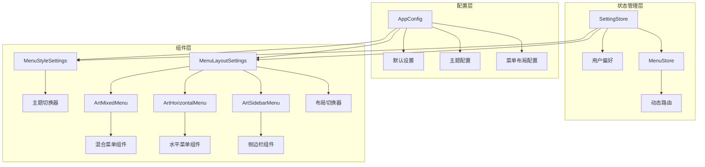
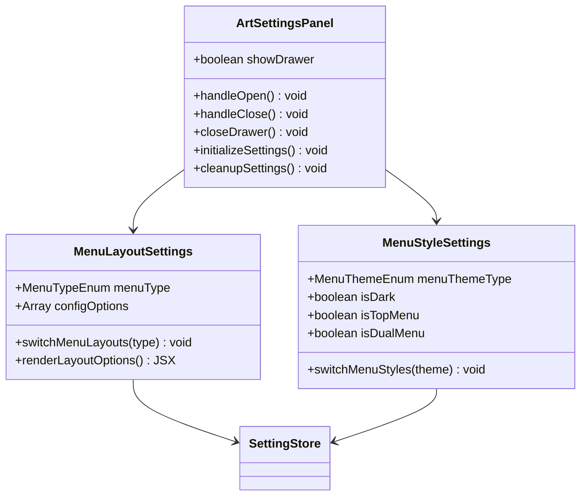
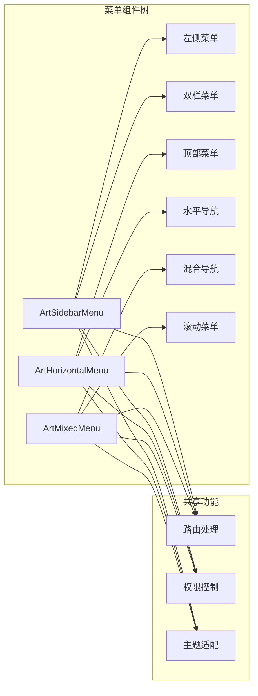
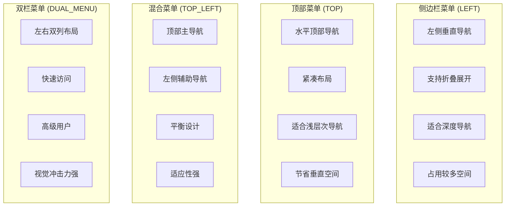
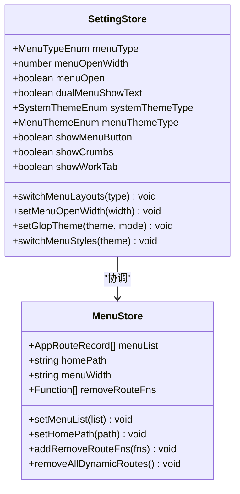
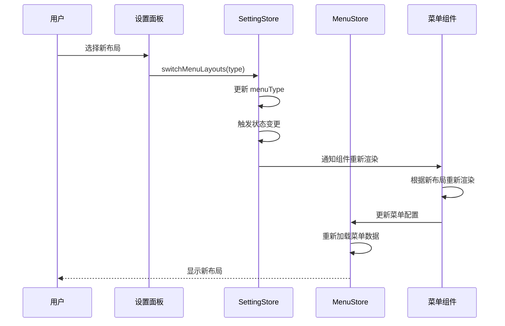
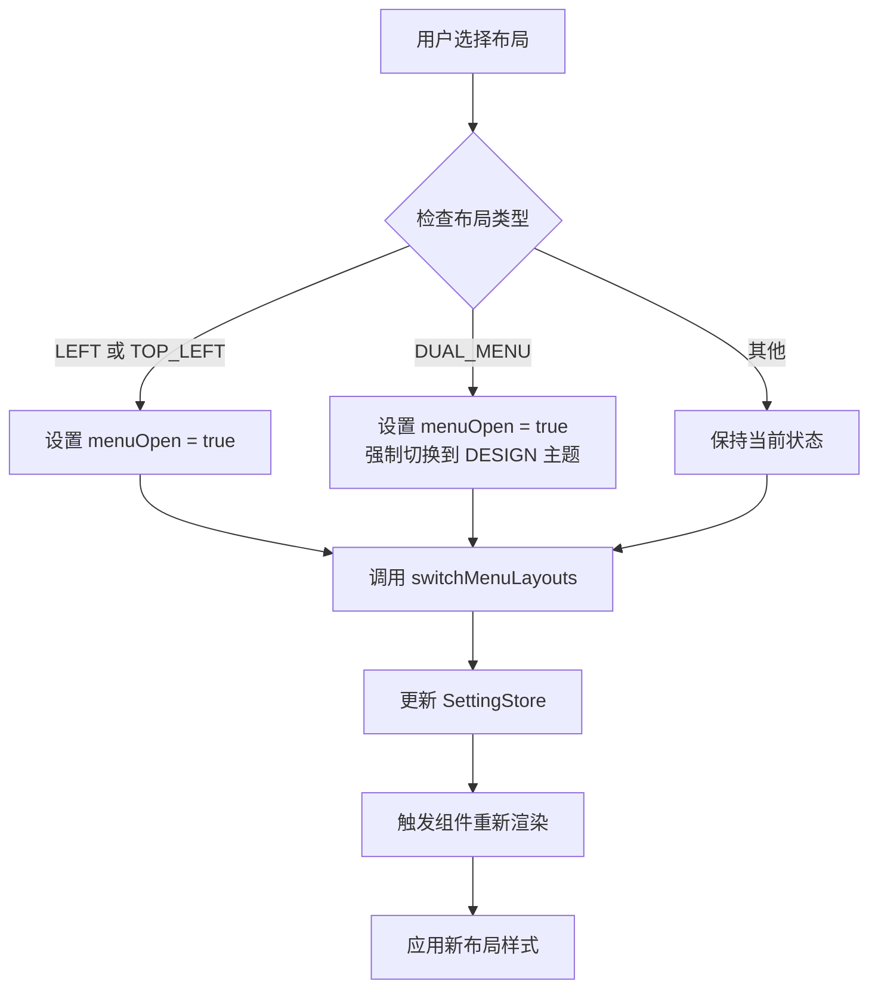
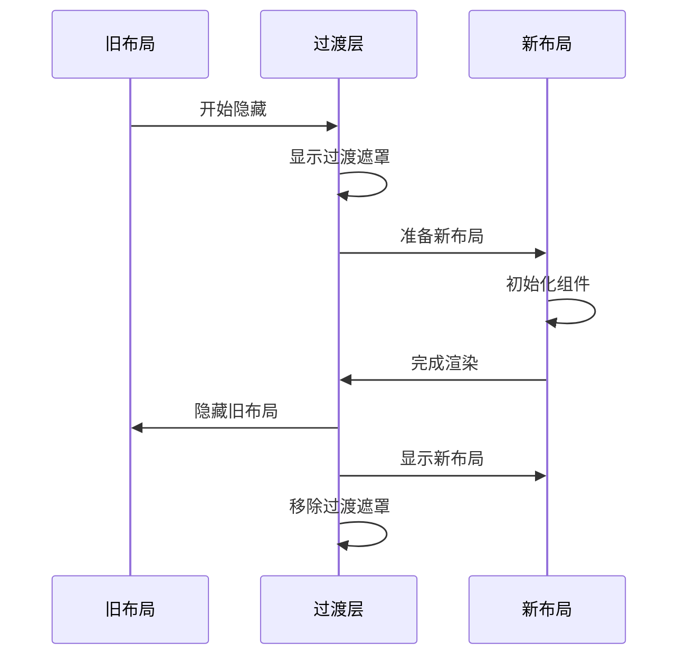
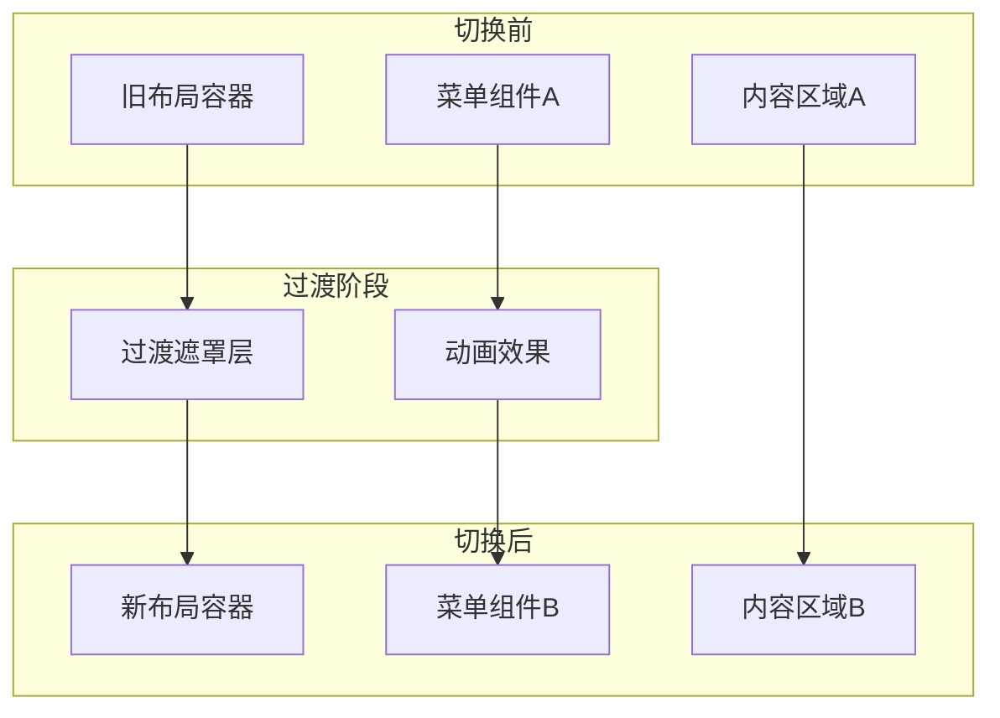

# 菜单布局设置

<cite>
**本文档引用的文件**
- [src/store/modules/setting.ts](file://src/store/modules/setting.ts)
- [src/store/modules/menu.ts](file://src/store/modules/menu.ts)
- [src/enums/appEnum.ts](file://src/enums/appEnum.ts)
- [src/config/setting.ts](file://src/config/setting.ts)
- [src/config/index.ts](file://src/config/index.ts)
- [src/components/core/layouts/art-settings-panel/widget/MenuLayoutSettings.vue](file://src/components/core/layouts/art-settings-panel/widget/MenuLayoutSettings.vue)
- [src/components/core/layouts/art-settings-panel/widget/MenuStyleSettings.vue](file://src/components/core/layouts/art-settings-panel/widget/MenuStyleSettings.vue)
- [src/components/core/layouts/art-settings-panel/composables/useSettingsState.ts](file://src/components/core/layouts/art-settings-panel/composables/useSettingsState.ts)
- [src/components/core/layouts/art-settings-panel/composables/useSettingsConfig.ts](file://src/components/core/layouts/art-settings-panel/composables/useSettingsConfig.ts)
- [src/components/core/layouts/art-menus/art-sidebar-menu/index.vue](file://src/components/core/layouts/art-menus/art-sidebar-menu/index.vue)
- [src/components/core/layouts/art-menus/art-horizontal-menu/index.vue](file://src/components/core/layouts/art-menus/art-horizontal-menu/index.vue)
- [src/components/core/layouts/art-menus/art-mixed-menu/index.vue](file://src/components/core/layouts/art-menus/art-mixed-menu/index.vue)
- [src/types/store/index.ts](file://src/types/store/index.ts)
</cite>

## 目录
1. [概述](#概述)
2. [项目架构](#项目架构)
3. [核心组件](#核心组件)
4. [菜单布局类型](#菜单布局类型)
5. [状态管理](#状态管理)
6. [布局切换机制](#布局切换机制)
7. [动画过渡效果](#动画过渡效果)
8. [自定义开发指南](#自定义开发指南)
9. [最佳实践](#最佳实践)
10. [故障排除](#故障排除)

## 概述

Art Design Pro 的菜单布局设置模块是一个高度可配置的系统，支持多种菜单布局模式，包括侧边栏+头部、混合模式、水平模式和双栏模式。该模块通过统一的状态管理和组件化设计，实现了灵活的布局切换和无缝的用户体验。

### 主要特性

- **多布局支持**：四种主要菜单布局模式
- **状态持久化**：基于 Pinia 的状态管理
- **响应式设计**：移动端适配
- **主题兼容**：支持亮色、暗色和自动主题
- **动画过渡**：流畅的布局切换动画
- **自定义扩展**：易于添加新的布局模式

## 项目架构



**图表来源**
- [src/store/modules/setting.ts](file://src/store/modules/setting.ts#L47-L450)
- [src/config/index.ts](file://src/config/index.ts#L38-L135)
- [src/components/core/layouts/art-settings-panel/widget/MenuLayoutSettings.vue](file://src/components/core/layouts/art-settings-panel/widget/MenuLayoutSettings.vue#L20-L30)

## 核心组件

### 设置面板组件

设置面板是菜单布局配置的主要入口，提供了直观的布局选择界面。



**图表来源**
- [src/components/core/layouts/art-settings-panel/index.vue](file://src/components/core/layouts/art-settings-panel/index.vue#L27-L72)
- [src/components/core/layouts/art-settings-panel/widget/MenuLayoutSettings.vue](file://src/components/core/layouts/art-settings-panel/widget/MenuLayoutSettings.vue#L20-L30)

**章节来源**
- [src/components/core/layouts/art-settings-panel/index.vue](file://src/components/core/layouts/art-settings-panel/index.vue#L1-L73)
- [src/components/core/layouts/art-settings-panel/widget/MenuLayoutSettings.vue](file://src/components/core/layouts/art-settings-panel/widget/MenuLayoutSettings.vue#L1-L31)

### 菜单组件架构



**图表来源**
- [src/components/core/layouts/art-menus/art-sidebar-menu/index.vue](file://src/components/core/layouts/art-menus/art-sidebar-menu/index.vue#L1-L89)
- [src/components/core/layouts/art-menus/art-horizontal-menu/index.vue](file://src/components/core/layouts/art-menus/art-horizontal-menu/index.vue#L1-L54)
- [src/components/core/layouts/art-menus/art-mixed-menu/index.vue](file://src/components/core/layouts/art-menus/art-mixed-menu/index.vue#L1-L97)

## 菜单布局类型

### 布局类型枚举

系统支持四种主要的菜单布局类型：

| 布局类型 | 枚举值 | 描述 | 适用场景 |
|---------|--------|------|----------|
| 侧边栏菜单 | `LEFT` | 传统的左侧垂直菜单 | 大屏幕桌面应用，需要大量导航选项 |
| 顶部菜单 | `TOP` | 水平顶部导航菜单 | 移动优先设计，简洁界面 |
| 混合菜单 | `TOP_LEFT` | 顶部+左侧组合布局 | 平衡桌面和移动体验 |
| 双栏菜单 | `DUAL_MENU` | 左侧+右侧双列布局 | 高级用户，需要快速访问 |

### 布局特点对比



**章节来源**
- [src/enums/appEnum.ts](file://src/enums/appEnum.ts#L20-L28)
- [src/config/index.ts](file://src/config/index.ts#L76-L80)

## 状态管理

### SettingStore 状态结构



**图表来源**
- [src/store/modules/setting.ts](file://src/store/modules/setting.ts#L47-L450)
- [src/store/modules/menu.ts](file://src/store/modules/menu.ts#L41-L109)

### 状态变更流程



**图表来源**
- [src/components/core/layouts/art-settings-panel/composables/useSettingsState.ts](file://src/components/core/layouts/art-settings-panel/composables/useSettingsState.ts#L20-L35)
- [src/store/modules/setting.ts](file://src/store/modules/setting.ts#L162-L168)

**章节来源**
- [src/store/modules/setting.ts](file://src/store/modules/setting.ts#L1-L451)
- [src/store/modules/menu.ts](file://src/store/modules/menu.ts#L1-L110)

## 布局切换机制

### 切换逻辑实现

布局切换的核心逻辑在 `useSettingsState` 组合函数中实现：



**图表来源**
- [src/components/core/layouts/art-settings-panel/composables/useSettingsState.ts](file://src/components/core/layouts/art-settings-panel/composables/useSettingsState.ts#L21-L30)

### 主题兼容性处理

不同布局对主题的支持程度不同：

| 布局类型 | 主题支持 | 特殊处理 |
|---------|----------|----------|
| 侧边栏菜单 | 全部主题 | 正常支持 |
| 顶部菜单 | 仅 DESIGN 和 LIGHT | 禁用 DARK 主题 |
| 混合菜单 | 仅 DESIGN 和 LIGHT | 禁用 DARK 主题 |
| 双栏菜单 | 仅 DESIGN | 强制使用 DESIGN 主题 |

**章节来源**
- [src/components/core/layouts/art-settings-panel/composables/useSettingsState.ts](file://src/components/core/layouts/art-settings-panel/composables/useSettingsState.ts#L1-L38)
- [src/components/core/layouts/art-settings-panel/widget/MenuStyleSettings.vue](file://src/components/core/layouts/art-settings-panel/widget/MenuStyleSettings.vue#L32-L43)

## 动画过渡效果

### 布局切换动画

系统为布局切换提供了流畅的动画过渡效果：



### DOM 结构调整机制

布局切换时的 DOM 结构变化：



**章节来源**
- [src/components/core/layouts/art-menus/art-sidebar-menu/index.vue](file://src/components/core/layouts/art-menus/art-sidebar-menu/index.vue#L1-L89)
- [src/components/core/layouts/art-menus/art-horizontal-menu/index.vue](file://src/components/core/layouts/art-menus/art-horizontal-menu/index.vue#L1-L54)

## 自定义开发指南

### 添加新布局模式

要添加新的菜单布局模式，需要完成以下步骤：

#### 1. 定义布局类型枚举

在 `appEnum.ts` 中添加新的布局类型：

```typescript
export enum MenuTypeEnum {
  // ... 现有类型
  CUSTOM_LAYOUT = 'custom-layout'  // 新增自定义布局
}
```

#### 2. 配置布局选项

在 `AppConfig` 中添加布局配置：

```typescript
// 在 src/config/index.ts 中
menuLayoutList: [
  // ... 现有配置
  { 
    name: 'Custom Layout', 
    value: MenuTypeEnum.CUSTOM_LAYOUT, 
    img: customLayoutImage 
  }
]
```

#### 3. 创建布局组件

创建新的菜单布局组件：

```vue
<!-- src/components/core/layouts/art-menus/art-custom-menu/index.vue -->
<template>
  <div class="custom-menu-layout">
    <!-- 自定义布局内容 -->
  </div>
</template>

<script setup lang="ts">
defineOptions({ name: 'ArtCustomMenu' })

interface Props {
  list: AppRouteRecord[]
}

const props = withDefaults(defineProps<Props>(), {
  list: () => []
})
</script>
```

#### 4. 注册组件

在设置面板中注册新布局：

```typescript
// 在 useSettingsConfig.ts 中
const configOptions = {
  menuLayoutList: [
    // ... 现有配置
    { 
      name: 'Custom Layout', 
      value: MenuTypeEnum.CUSTOM_LAYOUT, 
      img: customLayoutImage 
    }
  ]
}
```

#### 5. 实现切换逻辑

在 `useSettingsState` 中添加切换处理：

```typescript
const switchMenuLayouts = (type: MenuTypeEnum) => {
  // ... 现有逻辑
  
  if (type === MenuTypeEnum.CUSTOM_LAYOUT) {
    // 自定义布局特定逻辑
    settingStore.setMenuOpen(true)
    // 可能需要特殊的主题或样式处理
  }
}
```

### 样式适配指南

#### 响应式设计

确保新布局在不同设备上正常显示：

```scss
.custom-menu-layout {
  @media only screen and (width <= 640px) {
    // 移动端样式
  }
  
  @media only screen and (width > 640px) {
    // 桌面端样式
  }
}
```

#### 主题兼容

实现主题切换支持：

```scss
.custom-menu-layout {
  background: var(--background-color);
  color: var(--text-color);
  
  &.dark {
    // 暗色主题样式
  }
  
  &.light {
    // 亮色主题样式
  }
}
```

**章节来源**
- [src/enums/appEnum.ts](file://src/enums/appEnum.ts#L20-L28)
- [src/config/index.ts](file://src/config/index.ts#L76-L80)
- [src/components/core/layouts/art-settings-panel/composables/useSettingsState.ts](file://src/components/core/layouts/art-settings-panel/composables/useSettingsState.ts#L20-L35)

## 最佳实践

### 性能优化

1. **懒加载组件**：只在需要时加载特定布局组件
2. **状态缓存**：合理使用 Pinia 的持久化功能
3. **动画优化**：避免复杂的 CSS 动画影响性能

### 用户体验

1. **渐进式增强**：确保基本功能在所有布局下可用
2. **无障碍支持**：为所有布局提供键盘导航支持
3. **响应式设计**：确保移动端友好体验

### 代码维护

1. **模块化设计**：保持组件职责单一
2. **类型安全**：充分利用 TypeScript 类型系统
3. **文档完整**：为新布局提供详细的使用说明

## 故障排除

### 常见问题

#### 布局切换不生效

**原因**：状态更新未正确触发组件重新渲染

**解决方案**：
1. 检查 SettingStore 的响应式状态
2. 确认组件正确监听状态变化
3. 验证 `switchMenuLayouts` 方法调用

#### 主题样式异常

**原因**：布局与主题不兼容

**解决方案**：
1. 检查 `MenuStyleSettings` 的禁用逻辑
2. 确认主题配置正确应用
3. 验证 CSS 变量正确设置

#### 移动端显示问题

**原因**：响应式断点未正确处理

**解决方案**：
1. 检查媒体查询断点
2. 验证触摸事件处理
3. 确认滚动行为正常

**章节来源**
- [src/components/core/layouts/art-settings-panel/widget/MenuStyleSettings.vue](file://src/components/core/layouts/art-settings-panel/widget/MenuStyleSettings.vue#L32-L43)
- [src/components/core/layouts/art-menus/art-sidebar-menu/style.scss](file://src/components/core/layouts/art-menus/art-sidebar-menu/style.scss#L235-L253)