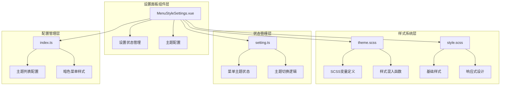
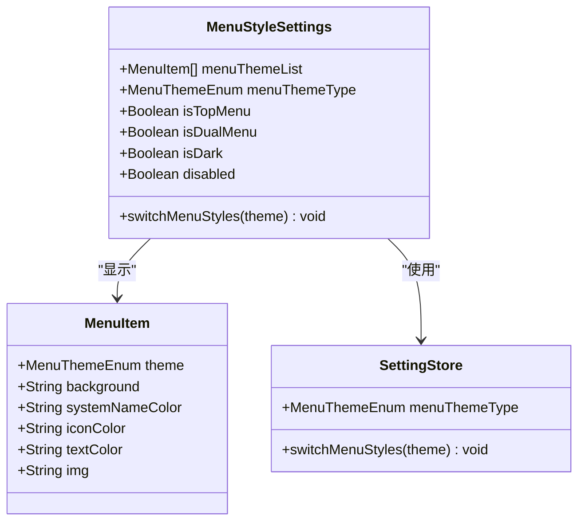
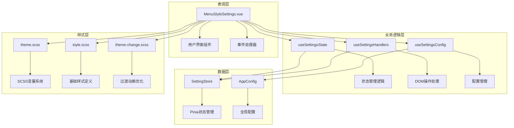
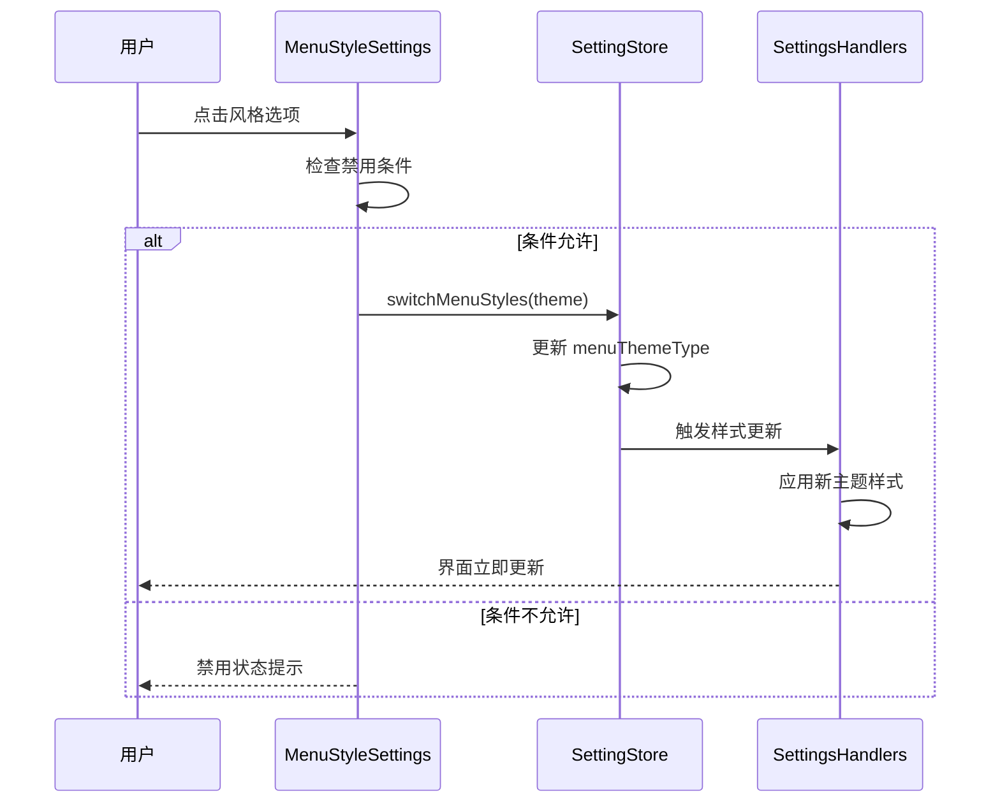
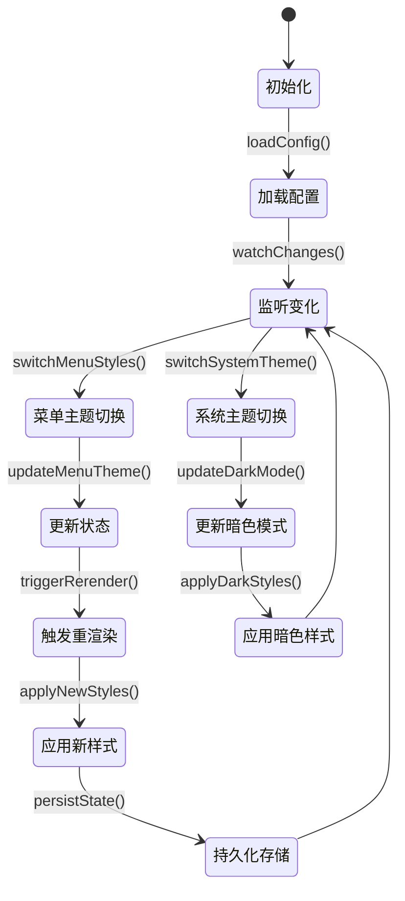
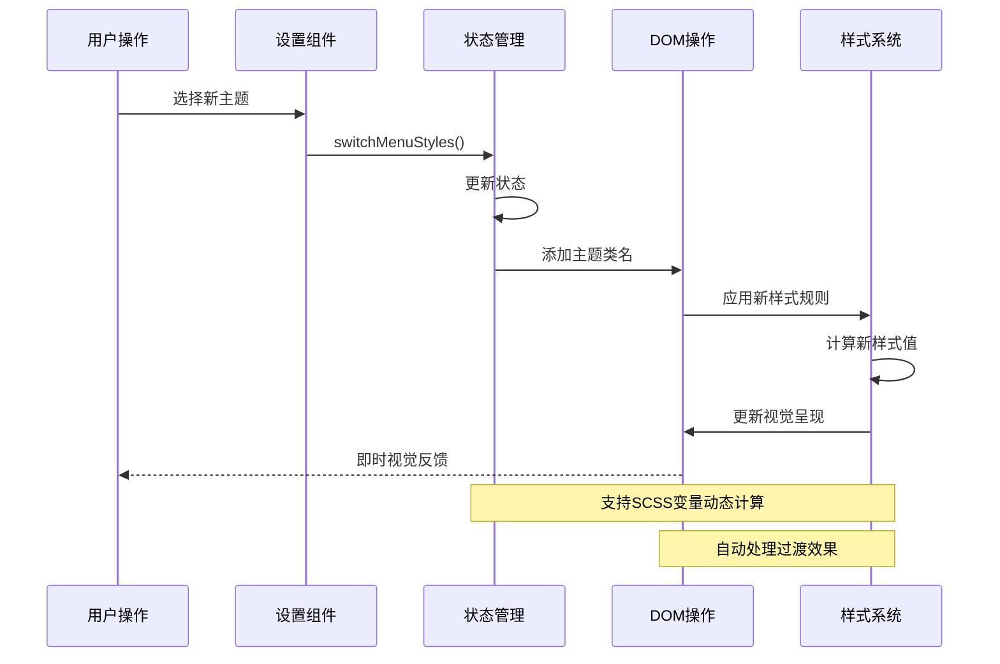
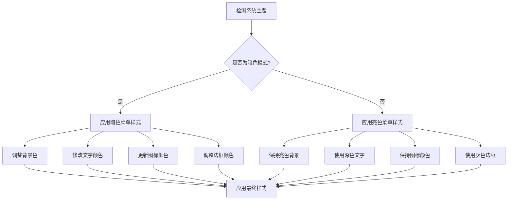

# 菜单风格设置

<cite>
**本文档引用的文件**
- [MenuStyleSettings.vue](file://src/components/core/layouts/art-settings-panel/widget/MenuStyleSettings.vue)
- [theme.scss](file://src/components/core/layouts/art-menus/art-sidebar-menu/theme.scss)
- [style.scss](file://src/components/core/layouts/art-menus/art-sidebar-menu/style.scss)
- [appEnum.ts](file://src/enums/appEnum.ts)
- [setting.ts](file://src/store/modules/setting.ts)
- [useSettingsState.ts](file://src/components/core/layouts/art-settings-panel/composables/useSettingsState.ts)
- [useSettingsHandlers.ts](file://src/components/core/layouts/art-settings-panel/composables/useSettingsHandlers.ts)
- [index.ts](file://src/config/index.ts)
- [theme-change.scss](file://src/assets/styles/core/theme-change.scss)
</cite>

## 目录
1. [简介](#简介)
2. [项目结构](#项目结构)
3. [核心组件](#核心组件)
4. [架构概览](#架构概览)
5. [详细组件分析](#详细组件分析)
6. [样式系统设计](#样式系统设计)
7. [主题切换机制](#主题切换机制)
8. [开发流程指南](#开发流程指南)
9. [故障排除指南](#故障排除指南)
10. [总结](#总结)

## 简介

菜单风格设置模块是 Art Design Pro 系统中的核心主题配置组件，提供了丰富的菜单外观定制功能。该模块支持三种主要的菜单主题风格：设计风格（DESIGN）、暗色风格（DARK）和亮色风格（LIGHT），同时具备动态主题切换、样式隔离和响应式设计等高级特性。

该模块采用模块化的架构设计，通过 SCSS 变量系统和 CSS 类切换机制，实现了灵活的主题定制能力和即时的视觉反馈效果。用户可以通过设置面板直观地切换菜单风格，系统会自动应用相应的样式配置并保持全局的一致性。

## 项目结构

菜单风格设置模块在项目中的组织结构体现了清晰的职责分离和模块化设计原则：



**图表来源**
- [MenuStyleSettings.vue](file://src/components/core/layouts/art-settings-panel/widget/MenuStyleSettings.vue#L1-L45)
- [theme.scss](file://src/components/core/layouts/art-menus/art-sidebar-menu/theme.scss#L1-L258)
- [setting.ts](file://src/store/modules/setting.ts#L1-L451)

**章节来源**
- [MenuStyleSettings.vue](file://src/components/core/layouts/art-settings-panel/widget/MenuStyleSettings.vue#L1-L45)
- [theme.scss](file://src/components/core/layouts/art-menus/art-sidebar-menu/theme.scss#L1-L258)

## 核心组件

### 菜单风格设置组件

菜单风格设置组件是用户交互的核心入口，提供了直观的风格切换界面：



**图表来源**
- [MenuStyleSettings.vue](file://src/components/core/layouts/art-settings-panel/widget/MenuStyleSettings.vue#L24-L44)
- [appEnum.ts](file://src/enums/appEnum.ts#L46-L53)

### 主题枚举定义

系统定义了完整的菜单主题枚举体系，确保类型安全和配置一致性：

| 枚举类型 | 值 | 描述 | 适用场景 |
|---------|-----|------|----------|
| MenuThemeEnum.DESIGN | 'design' | 设计风格主题 | 默认推荐，适合大多数应用场景 |
| MenuThemeEnum.DARK | 'dark' | 暗色主题 | 夜间模式、深色环境 |
| MenuThemeEnum.LIGHT | 'light' | 亮色主题 | 白色背景、明亮环境 |

**章节来源**
- [appEnum.ts](file://src/enums/appEnum.ts#L46-L53)
- [MenuStyleSettings.vue](file://src/components/core/layouts/art-settings-panel/widget/MenuStyleSettings.vue#L29-L30)

## 架构概览

菜单风格设置模块采用了分层架构设计，实现了关注点分离和高度的可维护性：



**图表来源**
- [MenuStyleSettings.vue](file://src/components/core/layouts/art-settings-panel/widget/MenuStyleSettings.vue#L24-L44)
- [useSettingsState.ts](file://src/components/core/layouts/art-settings-panel/composables/useSettingsState.ts#L7-L38)
- [useSettingsHandlers.ts](file://src/components/core/layouts/art-settings-panel/composables/useSettingsHandlers.ts#L8-L168)

## 详细组件分析

### 菜单风格设置组件实现

菜单风格设置组件通过 Vue 3 的组合式 API 实现了响应式的主题切换功能：



**图表来源**
- [MenuStyleSettings.vue](file://src/components/core/layouts/art-settings-panel/widget/MenuStyleSettings.vue#L37-L43)
- [useSettingsHandlers.ts](file://src/components/core/layouts/art-settings-panel/composables/useSettingsHandlers.ts#L140-L168)

### SCSS 样式系统架构

主题样式系统采用模块化的 SCSS 架构，通过变量定义和混入函数实现样式的复用和扩展：

```mermaid
flowchart TD
A[SCSS变量系统] --> B[基础变量定义]
A --> C[主题变量定义]
A --> D[响应式变量]
B --> E[$menu-height: 42px]
B --> F[$menu-icon-size: 20px]
B --> G[$hover-bg-color: var(--art-gray-200)]
C --> H[设计主题变量]
C --> I[暗色主题变量]
C --> J[亮色主题变量]
D --> K[弹窗菜单变量]
D --> L[移动端变量]
M[样式混入函数] --> N[通用菜单项样式]
M --> O[悬停效果样式]
M --> P[激活状态样式]
M --> Q[弹窗菜单样式]
A --> M
```

**图表来源**
- [theme.scss](file://src/components/core/layouts/art-menus/art-sidebar-menu/theme.scss#L4-L12)
- [theme.scss](file://src/components/core/layouts/art-menus/art-sidebar-menu/theme.scss#L14-L60)

**章节来源**
- [theme.scss](file://src/components/core/layouts/art-menus/art-sidebar-menu/theme.scss#L1-L258)
- [MenuStyleSettings.vue](file://src/components/core/layouts/art-settings-panel/widget/MenuStyleSettings.vue#L1-L45)

### 状态管理机制

设置状态管理通过 Pinia 实现了响应式的状态同步和持久化存储：



**图表来源**
- [setting.ts](file://src/store/modules/setting.ts#L190-L196)
- [useSettingsState.ts](file://src/components/core/layouts/art-settings-panel/composables/useSettingsState.ts#L20-L30)

**章节来源**
- [setting.ts](file://src/store/modules/setting.ts#L1-L451)
- [useSettingsState.ts](file://src/components/core/layouts/art-settings-panel/composables/useSettingsState.ts#L1-L38)

## 样式系统设计

### SCSS 变量系统

菜单风格设置模块采用了精心设计的 SCSS 变量系统，实现了样式的统一管理和灵活定制：

#### 基础变量定义

| 变量名 | 默认值 | 用途 | 影响范围 |
|--------|--------|------|----------|
| $menu-height | 42px | 菜单项高度 | 所有菜单主题 |
| $menu-icon-size | 20px | 图标尺寸 | 所有菜单主题 |
| $menu-font-size | 14px | 字体大小 | 所有菜单主题 |
| $hover-bg-color | var(--art-gray-200) | 悬停背景色 | 浅色主题 |
| $popup-menu-height | 40px | 弹窗菜单高度 | 弹窗菜单样式 |
| $popup-menu-padding | 8px | 弹窗内边距 | 弹窗菜单样式 |

#### 主题特定变量

每个菜单主题都有其独特的变量配置，确保视觉效果的一致性和特色：

```mermaid
graph LR
subgraph "设计主题变量"
A1[#FFFFFF] --> A2[背景色]
A3[var(--art-gray-800)] --> A4[系统名称颜色]
A5[#6B6B6B] --> A6[图标颜色]
A7[#29343D] --> A8[文字颜色]
end
subgraph "暗色主题变量"
B1[#191A23] --> B2[背景色]
B3[#D9DADB] --> B4[系统名称颜色]
B5[#BABBBD] --> B6[图标颜色]
B7[#BABBBD] --> B8[文字颜色]
end
subgraph "亮色主题变量"
C1[#FFFFFF] --> C2[背景色]
C3[var(--art-gray-800)] --> C4[系统名称颜色]
C5[#6B6B6B] --> C6[图标颜色]
C7[#29343D] --> C8[文字颜色]
end
```

**图表来源**
- [index.ts](file://src/config/index.ts#L83-L107)
- [theme.scss](file://src/components/core/layouts/art-menus/art-sidebar-menu/theme.scss#L84-L107)

### 样式混入函数系统

系统定义了多个可复用的 SCSS 混入函数，简化了样式代码的编写和维护：

#### 通用菜单项样式混入

```scss
@mixin menu-item-base {
  width: calc(100% - 16px);
  margin-left: 8px;
  border-radius: 6px;
  
  .menu-icon {
    margin-left: -7px;
  }
}
```

#### 悬停效果混入

```scss
@mixin menu-hover($bg-color) {
  .el-sub-menu__title:hover,
  .el-menu-item:not(.is-active):hover {
    background: $bg-color !important;
  }
}
```

#### 激活状态混入

```scss
@mixin menu-active($color, $bg-color, $icon-color: var(--theme-color)) {
  .el-menu-item.is-active {
    color: $color !important;
    background-color: $bg-color;
    
    .menu-icon {
      .art-svg-icon {
        color: $icon-color !important;
      }
    }
  }
}
```

**章节来源**
- [theme.scss](file://src/components/core/layouts/art-menus/art-sidebar-menu/theme.scss#L14-L60)

## 主题切换机制

### 动态样式加载

菜单风格设置模块实现了智能的动态样式加载机制，确保主题切换时的流畅体验：



**图表来源**
- [useSettingsHandlers.ts](file://src/components/core/layouts/art-settings-panel/composables/useSettingsHandlers.ts#L140-L168)
- [theme-change.scss](file://src/assets/styles/core/theme-change.scss#L1-L12)

### 样式隔离机制

为了确保主题切换不会影响其他组件的样式，系统采用了严格的样式隔离策略：

#### CSS 类命名规范

| 类名前缀 | 作用域 | 示例 | 说明 |
|----------|--------|------|------|
| .layout-sidebar | 侧边栏菜单 | .layout-sidebar | 侧边栏整体样式 |
| .el-menu-design | 设计主题 | .el-menu-design | 设计风格菜单 |
| .el-menu-dark | 暗色主题 | .el-menu-dark | 暗色风格菜单 |
| .el-menu-light | 亮色主题 | .el-menu-light | 亮色风格菜单 |

#### 响应式样式隔离

系统通过媒体查询和条件样式确保不同屏幕尺寸下的样式隔离：

```scss
@media only screen and (width <= 640px) {
  .layout-sidebar {
    .el-menu-design {
      > .el-sub-menu {
        margin-left: 0;
      }
      
      .el-sub-menu {
        width: 100% !important;
      }
    }
  }
}
```

**章节来源**
- [theme.scss](file://src/components/core/layouts/art-menus/art-sidebar-menu/theme.scss#L211-L222)
- [style.scss](file://src/components/core/layouts/art-menus/art-sidebar-menu/style.scss#L190-L239)

### 暗色模式适配

系统提供了完整的暗色模式适配方案，确保在不同主题模式下都能提供优质的用户体验：



**图表来源**
- [theme.scss](file://src/components/core/layouts/art-menus/art-sidebar-menu/theme.scss#L231-L258)
- [setting.ts](file://src/store/modules/setting.ts#L121-L131)

**章节来源**
- [theme.scss](file://src/components/core/layouts/art-menus/art-sidebar-menu/theme.scss#L231-L258)
- [setting.ts](file://src/store/modules/setting.ts#L121-L131)

## 开发流程指南

### 新增菜单风格开发流程

开发新的菜单风格需要遵循标准化的流程，确保代码质量和系统稳定性：

#### 第一步：定义主题枚举

在 `appEnum.ts` 中添加新的菜单主题枚举：

```typescript
export enum MenuThemeEnum {
  // 现有枚举...
  NEW_THEME = 'new-theme'  // 新增主题
}
```

#### 第二步：配置主题变量

在 `config/index.ts` 的 `themeList` 数组中添加新主题配置：

```typescript
themeList: [
  // 现有主题...
  {
    theme: MenuThemeEnum.NEW_THEME,
    background: '#F5F7FA',
    systemNameColor: 'var(--art-gray-800)',
    iconColor: '#6B6B6B',
    textColor: '#29343D',
    img: configImages.menuStyles.newTheme  // 新增预览图
  }
]
```

#### 第三步：定义SCSS变量

在 `theme.scss` 中添加新主题的SCSS变量和样式规则：

```scss
// 新主题变量
$new-theme-background: #F5F7FA;
$new-theme-system-name-color: var(--art-gray-800);
$new-theme-icon-color: #6B6B6B;
$new-theme-text-color: #29343D;

// 新主题样式规则
.el-menu-new-theme {
  @include theme-menu-base;
  @include menu-active($new-theme-text-color, $new-theme-background);
  @include menu-hover($hover-bg-color);
  
  .el-sub-menu__icon-arrow {
    color: var(--art-gray-600);
  }
}
```

#### 第四步：注册主题到样式系统

在 `theme.scss` 的样式规则部分添加新主题的CSS类：

```scss
.layout-sidebar {
  // 现有主题样式...
  
  // 新主题样式
  .el-menu-new-theme {
    @include theme-menu-base;
    @include menu-active($new-theme-text-color, $new-theme-background);
    @include menu-hover($hover-bg-color);
    
    .el-sub-menu__icon-arrow {
      color: var(--art-gray-600);
    }
  }
}
```

#### 第五步：测试和验证

完成开发后，需要进行以下测试验证：

1. **功能测试**：验证新主题在不同菜单布局下的显示效果
2. **响应式测试**：确保在移动设备上的适配效果
3. **暗色模式测试**：验证暗色模式下的兼容性
4. **性能测试**：检查主题切换的性能表现

### 主题注册最佳实践

#### 变量命名规范

```scss
// 正确的变量命名
$menu-height: 42px;
$hover-bg-color: var(--art-gray-200);
$popup-menu-height: 40px;

// 错误的变量命名示例
$height: 42px;  // 缺乏语义性
$bg: #fff;      // 过于简略
```

#### 样式混入函数设计

```scss
// 推荐的混入函数设计
@mixin menu-item-base {
  width: calc(100% - 16px);
  margin-left: 8px;
  border-radius: 6px;
  
  .menu-icon {
    margin-left: -7px;
  }
}

// 避免过度复杂的混入
@mixin overly_complex_mixin($param1, $param2, $param3, $param4, $param5) {
  // 不推荐：参数过多导致使用困难
}
```

**章节来源**
- [appEnum.ts](file://src/enums/appEnum.ts#L46-L53)
- [index.ts](file://src/config/index.ts#L83-L107)
- [theme.scss](file://src/components/core/layouts/art-menus/art-sidebar-menu/theme.scss#L1-L258)

## 故障排除指南

### 常见问题及解决方案

#### 主题切换无效果

**问题描述**：点击菜单风格切换按钮后，界面没有发生变化。

**可能原因**：
1. 禁用条件检查失败
2. SCSS变量未正确编译
3. CSS类名冲突

**解决方案**：
```javascript
// 检查禁用条件
const disabled = computed(() => {
  const isTopMenu = menuType.value === MenuTypeEnum.TOP;
  const isDualMenu = menuType.value === MenuTypeEnum.DUAL_MENU;
  const isDark = isDark.value;
  
  console.log('禁用条件:', { isTopMenu, isDualMenu, isDark });
  return isTopMenu || isDualMenu || isDark;
});
```

#### 样式显示异常

**问题描述**：新主题样式显示不正确或出现布局错乱。

**排查步骤**：
1. 检查SCSS变量定义是否完整
2. 验证CSS类名是否正确应用
3. 确认媒体查询条件是否匹配

**调试技巧**：
```scss
// 在开发环境中添加调试样式
.debug-theme {
  outline: 2px solid red !important;
}
```

#### 性能问题

**问题描述**：主题切换时出现明显的延迟或卡顿。

**优化建议**：
1. 减少不必要的CSS重排
2. 使用CSS变量替代SCSS变量
3. 优化媒体查询条件

```scss
// 优化后的样式规则
.layout-sidebar {
  // 使用CSS变量减少重计算
  --menu-height: 42px;
  --menu-icon-size: 20px;
  
  .el-sub-menu__title,
  .el-menu-item {
    height: var(--menu-height) !important;
    line-height: var(--menu-height) !important;
  }
}
```

**章节来源**
- [MenuStyleSettings.vue](file://src/components/core/layouts/art-settings-panel/widget/MenuStyleSettings.vue#L35-L43)
- [theme.scss](file://src/components/core/layouts/art-menus/art-sidebar-menu/theme.scss#L120-L132)

## 总结

菜单风格设置模块作为 Art Design Pro 系统的核心主题配置组件，展现了现代前端框架在样式管理和主题切换方面的最佳实践。通过模块化的架构设计、完善的SCSS变量系统和智能的状态管理机制，该模块实现了高度的可扩展性和维护性。

### 主要特性总结

1. **多样化主题选择**：支持设计、暗色、亮色三种主流菜单风格
2. **智能条件控制**：根据菜单布局和系统主题动态调整可用选项
3. **无缝切换体验**：通过CSS类切换实现即时的主题更新
4. **样式隔离保护**：严格的样式作用域避免全局污染
5. **响应式设计支持**：完整的移动端适配方案
6. **开发者友好**：标准化的开发流程和完善的错误处理

### 技术亮点

- **SCSS变量系统**：提供了灵活的样式定制能力
- **组合式API**：利用Vue 3的组合式API实现响应式状态管理
- **模块化架构**：清晰的职责分离和高度的可维护性
- **性能优化**：智能的样式加载和缓存机制

该模块不仅为用户提供了丰富的个性化定制选项，也为开发者提供了一个优秀的主题系统开发范例，展示了如何在大型前端项目中实现复杂的状态管理和样式控制。