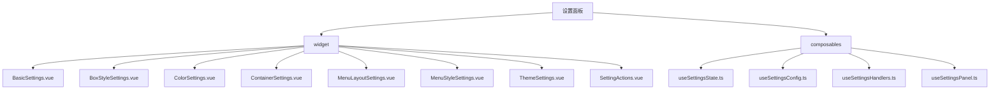
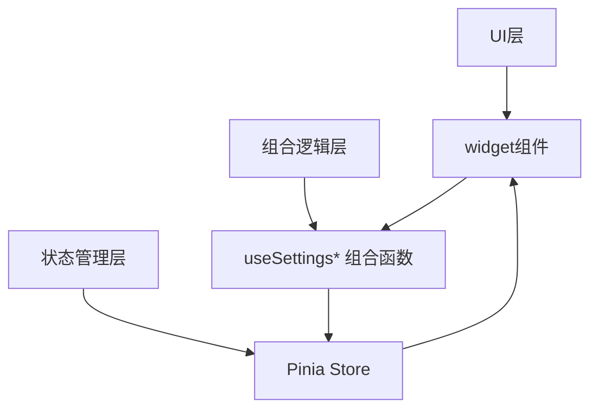
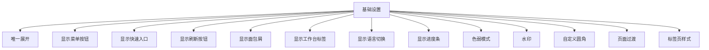
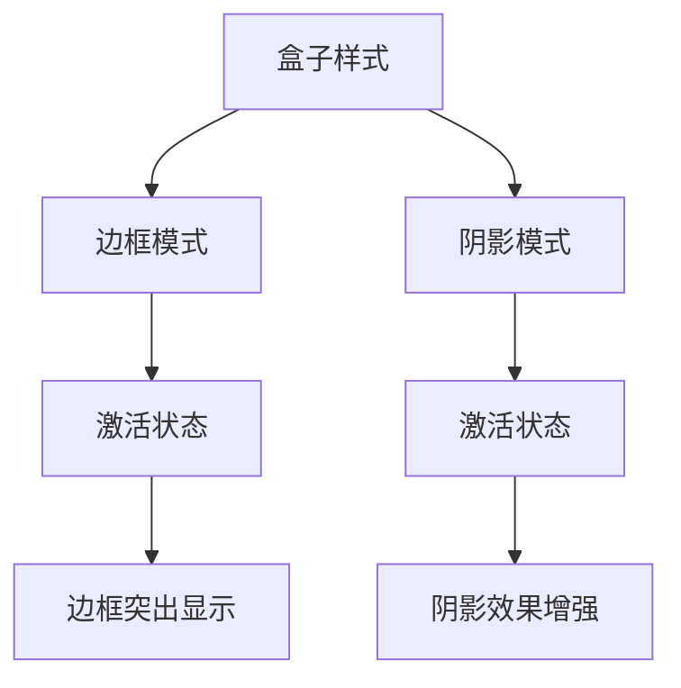
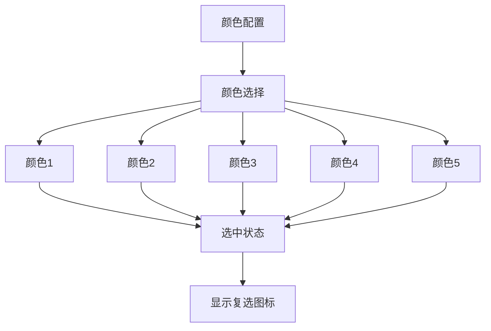
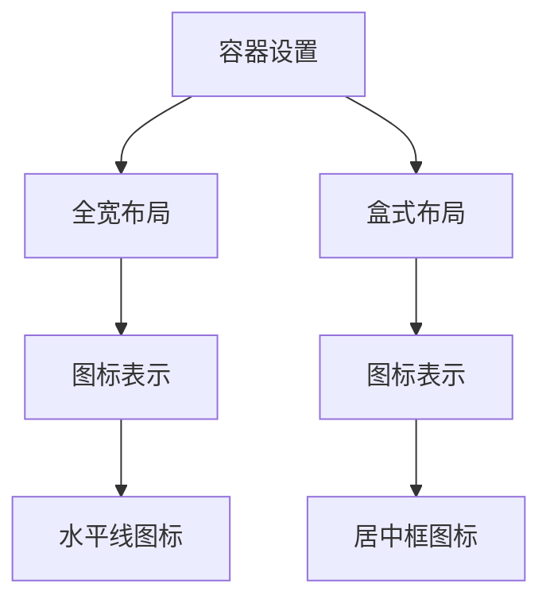
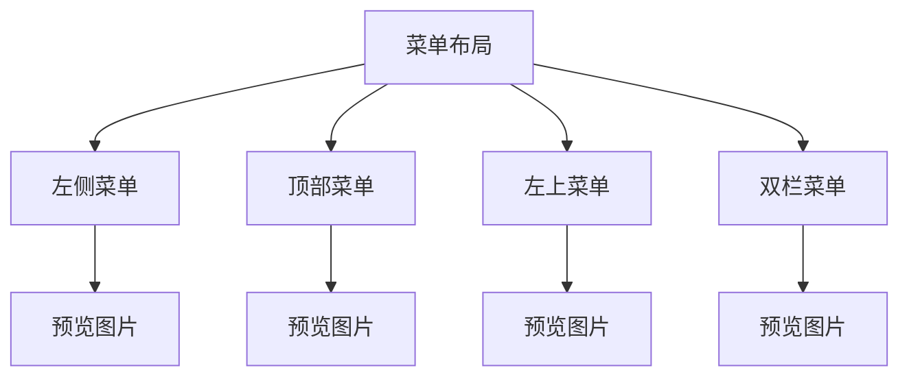
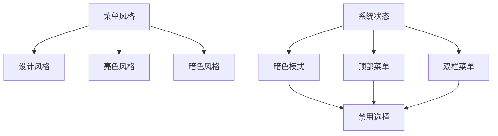
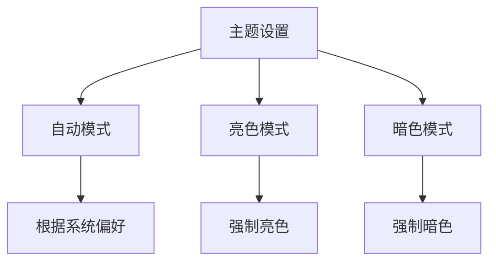
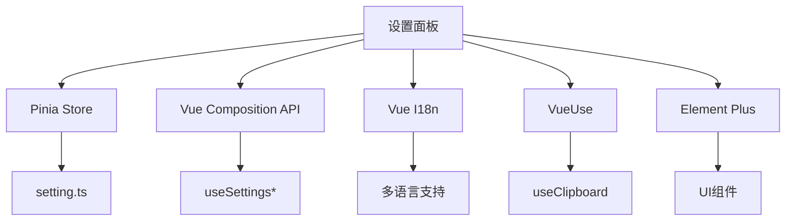

# 设置面板

<cite>
**本文档引用的文件**
- [index.vue](file://src/components/core/layouts/art-settings-panel/index.vue)
- [useSettingsState.ts](file://src/components/core/layouts/art-settings-panel/composables/useSettingsState.ts)
- [useSettingsConfig.ts](file://src/components/core/layouts/art-settings-panel/composables/useSettingsConfig.ts)
- [useSettingsHandlers.ts](file://src/components/core/layouts/art-settings-panel/composables/useSettingsHandlers.ts)
- [useSettingsPanel.ts](file://src/components/core/layouts/art-settings-panel/composables/useSettingsPanel.ts)
- [BasicSettings.vue](file://src/components/core/layouts/art-settings-panel/widget/BasicSettings.vue)
- [BoxStyleSettings.vue](file://src/components/core/layouts/art-settings-panel/widget/BoxStyleSettings.vue)
- [ColorSettings.vue](file://src/components/core/layouts/art-settings-panel/widget/ColorSettings.vue)
- [ContainerSettings.vue](file://src/components/core/layouts/art-settings-panel/widget/ContainerSettings.vue)
- [MenuLayoutSettings.vue](file://src/components/core/layouts/art-settings-panel/widget/MenuLayoutSettings.vue)
- [MenuStyleSettings.vue](file://src/components/core/layouts/art-settings-panel/widget/MenuStyleSettings.vue)
- [ThemeSettings.vue](file://src/components/core/layouts/art-settings-panel/widget/ThemeSettings.vue)
- [SettingActions.vue](file://src/components/core/layouts/art-settings-panel/widget/SettingActions.vue)
- [setting.ts](file://src/config/setting.ts)
- [setting.ts](file://src/store/modules/setting.ts)
</cite>

## 目录
1. [介绍](#介绍)
2. [项目结构](#项目结构)
3. [核心组件](#核心组件)
4. [架构概述](#架构概述)
5. [详细组件分析](#详细组件分析)
6. [依赖分析](#依赖分析)
7. [性能考虑](#性能考虑)
8. [故障排除指南](#故障排除指南)
9. [结论](#结论)

## 介绍
设置面板是系统个性化配置的核心模块，提供全面的界面定制功能。该面板允许用户通过直观的界面调整系统各项设置，包括主题、布局、样式等，实现高度个性化的用户体验。设置面板采用现代化的组合式API设计，通过多个可复用的组合式函数（composables）实现关注点分离和逻辑复用。所有用户偏好设置均通过localStorage进行持久化存储，确保配置在页面刷新后依然保持。面板支持响应式设计，在不同设备尺寸下提供最佳的用户体验。

## 项目结构
设置面板的文件组织遵循清晰的模块化结构，将UI组件与业务逻辑分离。主要分为两个目录：widget目录存放可视化的UI组件，composables目录存放可复用的逻辑组合函数。这种分离使得UI展示与业务逻辑解耦，提高了代码的可维护性和可测试性。

**图示来源**
- [index.vue](file://src/components/core/layouts/art-settings-panel/index.vue)

**本节来源**
- [index.vue](file://src/components/core/layouts/art-settings-panel/index.vue)

## 核心组件
设置面板的核心由多个功能模块组成，每个模块负责特定的配置功能。这些模块通过组合式函数共享状态和逻辑，形成一个完整的配置系统。基础设置模块管理界面显示开关和功能开关，盒子样式模块控制边框和阴影效果，颜色配置模块允许用户选择主题颜色，容器设置模块调整页面布局宽度，菜单布局和风格模块控制导航菜单的外观和行为，主题设置模块管理整体的亮色/暗色主题。

**本节来源**
- [BasicSettings.vue](file://src/components/core/layouts/art-settings-panel/widget/BasicSettings.vue)
- [BoxStyleSettings.vue](file://src/components/core/layouts/art-settings-panel/widget/BoxStyleSettings.vue)
- [ColorSettings.vue](file://src/components/core/layouts/art-settings-panel/widget/ColorSettings.vue)

## 架构概述
设置面板采用分层架构设计，从上到下分为UI层、组合逻辑层和状态管理层。UI层由多个独立的widget组件构成，每个组件负责特定的配置界面展示。组合逻辑层通过composables提供可复用的业务逻辑，包括状态管理、配置定义和事件处理。状态管理层使用Pinia store集中管理所有设置状态，确保状态的一致性和可预测性。这种架构实现了关注点分离，使得各个层次可以独立开发和测试。

**图示来源**
- [index.vue](file://src/components/core/layouts/art-settings-panel/index.vue)
- [useSettingsState.ts](file://src/components/core/layouts/art-settings-panel/composables/useSettingsState.ts)
- [setting.ts](file://src/store/modules/setting.ts)

## 详细组件分析
设置面板的每个功能模块都经过精心设计，提供直观的用户交互体验。组件之间通过清晰的接口进行通信，确保系统的可维护性和扩展性。

### 基础设置分析
基础设置模块提供系统最常用的配置选项，包括界面显示开关和功能开关。该模块通过SettingItem组件统一渲染各种类型的设置项，支持开关、数字输入和选择器等多种输入类型。

**图示来源**
- [BasicSettings.vue](file://src/components/core/layouts/art-settings-panel/widget/BasicSettings.vue)
- [SettingItem.vue](file://src/components/core/layouts/art-settings-panel/widget/SettingItem.vue)

**本节来源**
- [BasicSettings.vue](file://src/components/core/layouts/art-settings-panel/widget/BasicSettings.vue)

### 盒子样式分析
盒子样式模块允许用户在边框模式和阴影模式之间切换，改变界面元素的视觉表现。该模块提供直观的视觉反馈，当前激活的模式会以不同的样式高亮显示。

**图示来源**
- [BoxStyleSettings.vue](file://src/components/core/layouts/art-settings-panel/widget/BoxStyleSettings.vue)

**本节来源**
- [BoxStyleSettings.vue](file://src/components/core/layouts/art-settings-panel/widget/BoxStyleSettings.vue)

### 颜色配置分析
颜色配置模块提供主题颜色选择功能，用户可以从预定义的颜色列表中选择自己喜欢的主题色。选中的颜色会通过复选图标直观显示，提供良好的用户体验。

**图示来源**
- [ColorSettings.vue](file://src/components/core/layouts/art-settings-panel/widget/ColorSettings.vue)

**本节来源**
- [ColorSettings.vue](file://src/components/core/layouts/art-settings-panel/widget/ColorSettings.vue)

### 容器设置分析
容器设置模块允许用户选择页面布局的宽度模式，包括全宽和盒式布局。不同的布局模式通过图标直观表示，帮助用户理解每种模式的视觉效果。

**图示来源**
- [ContainerSettings.vue](file://src/components/core/layouts/art-settings-panel/widget/ContainerSettings.vue)

**本节来源**
- [ContainerSettings.vue](file://src/components/core/layouts/art-settings-panel/widget/ContainerSettings.vue)

### 菜单布局分析
菜单布局模块提供多种导航菜单布局选择，包括左侧菜单、顶部菜单、左上菜单和双栏菜单。每种布局都配有预览图片，帮助用户直观了解不同布局的外观。

**图示来源**
- [MenuLayoutSettings.vue](file://src/components/core/layouts/art-settings-panel/widget/MenuLayoutSettings.vue)

**本节来源**
- [MenuLayoutSettings.vue](file://src/components/core/layouts/art-settings-panel/widget/MenuLayoutSettings.vue)

### 菜单风格分析
菜单风格模块允许用户选择菜单的主题风格，如设计风格、亮色风格和暗色风格。该模块会根据当前系统主题和菜单类型动态调整可用选项。

**图示来源**
- [MenuStyleSettings.vue](file://src/components/core/layouts/art-settings-panel/widget/MenuStyleSettings.vue)

**本节来源**
- [MenuStyleSettings.vue](file://src/components/core/layouts/art-settings-panel/widget/MenuStyleSettings.vue)

### 主题设置分析
主题设置模块管理系统的整体主题模式，支持自动、亮色和暗色三种模式。用户选择的主题会立即应用到整个界面，提供即时的视觉反馈。

**图示来源**
- [ThemeSettings.vue](file://src/components/core/layouts/art-settings-panel/widget/ThemeSettings.vue)

**本节来源**
- [ThemeSettings.vue](file://src/components/core/layouts/art-settings-panel/widget/ThemeSettings.vue)

## 依赖分析
设置面板依赖于多个核心模块和外部库，形成了一个完整的依赖网络。主要依赖包括Pinia状态管理、Vue组合式API、国际化支持和剪贴板操作等。

**图示来源**
- [setting.ts](file://src/store/modules/setting.ts)
- [useSettingsState.ts](file://src/components/core/layouts/art-settings-panel/composables/useSettingsState.ts)
- [SettingActions.vue](file://src/components/core/layouts/art-settings-panel/widget/SettingActions.vue)

**本节来源**
- [setting.ts](file://src/store/modules/setting.ts)
- [useSettingsState.ts](file://src/components/core/layouts/art-settings-panel/composables/useSettingsState.ts)

## 性能考虑
设置面板在设计时充分考虑了性能优化。通过使用组合式函数避免了逻辑重复，提高了代码复用率。状态管理采用Pinia的响应式系统，确保状态变更的高效传播。UI组件采用按需渲染策略，只在必要时渲染特定模块。事件处理经过优化，避免不必要的重新渲染。配置持久化使用localStorage，提供快速的读写性能。

## 故障排除指南
当设置面板出现问题时，可以按照以下步骤进行排查：首先检查浏览器控制台是否有错误信息；其次确认localStorage是否被禁用或已满；然后检查网络请求是否正常；最后尝试清除本地存储数据并重置设置。对于特定功能问题，可以检查相关模块的配置是否正确，状态是否正常更新。

**本节来源**
- [setting.ts](file://src/store/modules/setting.ts)
- [SettingActions.vue](file://src/components/core/layouts/art-settings-panel/widget/SettingActions.vue)

## 结论
设置面板作为系统个性化配置的核心，提供了全面而直观的界面定制功能。通过合理的架构设计和模块化组织，实现了高内聚低耦合的代码结构。组合式函数的使用提高了代码的可复用性和可维护性。状态管理的集中化确保了配置的一致性和可靠性。未来可以考虑增加更多个性化选项，如字体选择、动画效果调节等，进一步提升用户体验。