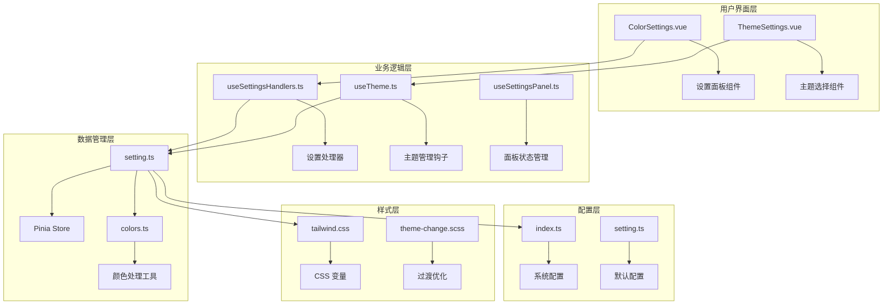
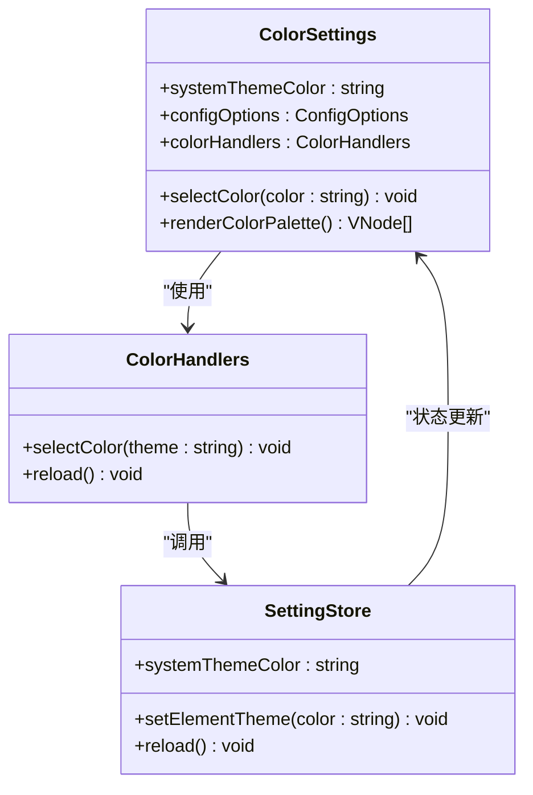
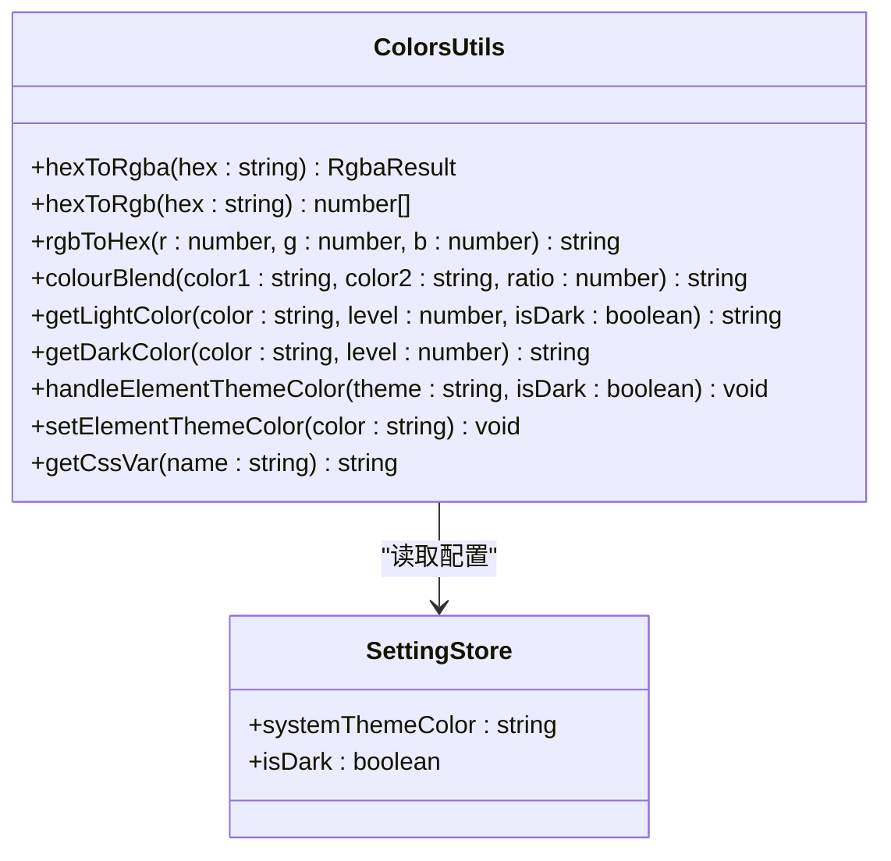
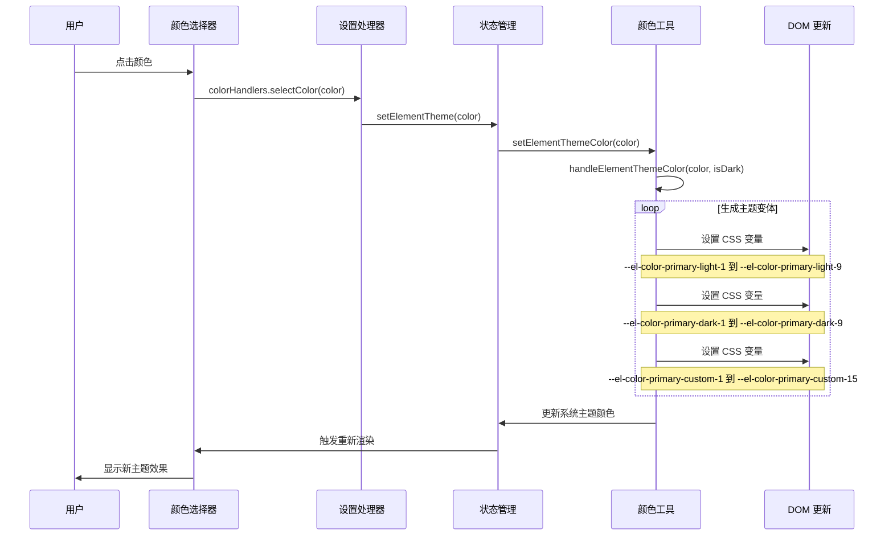
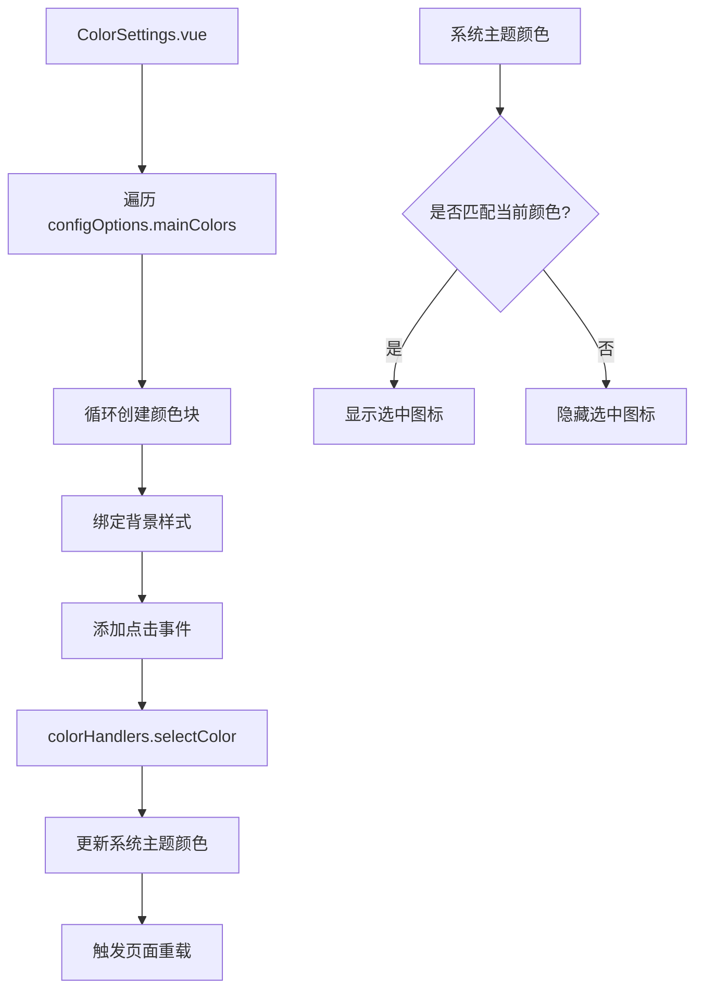
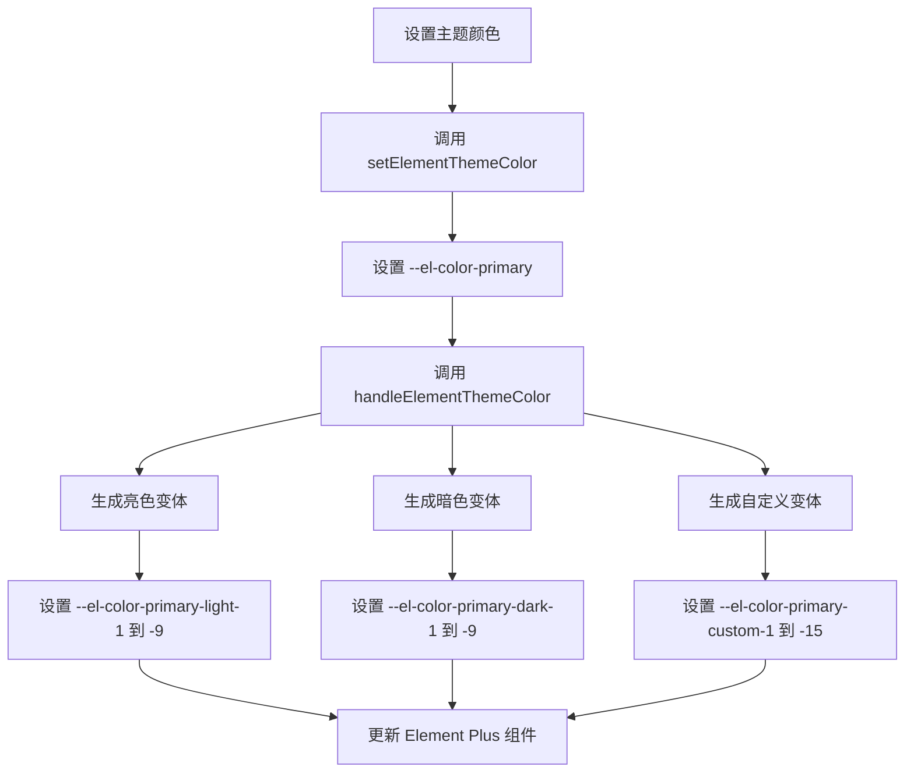
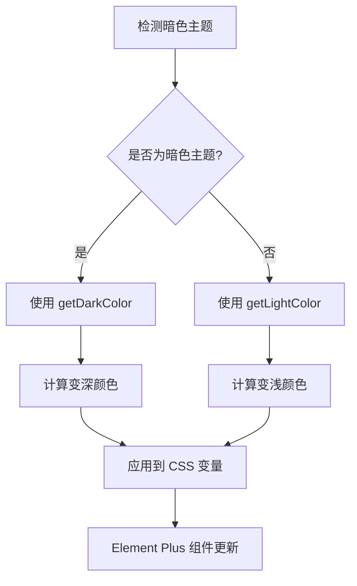
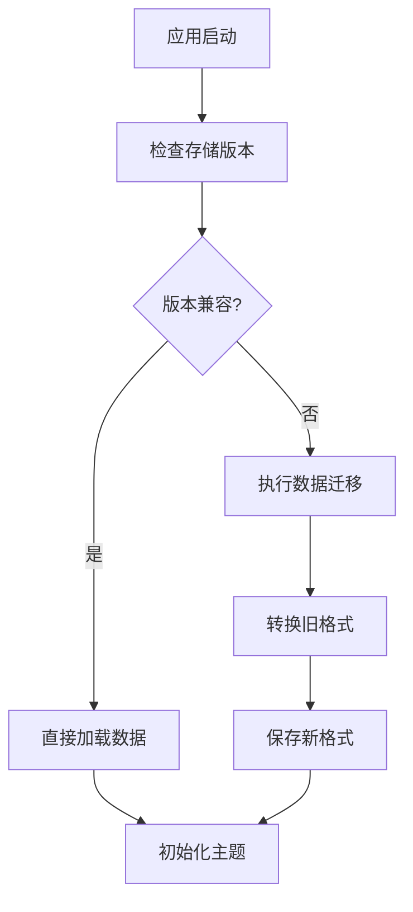
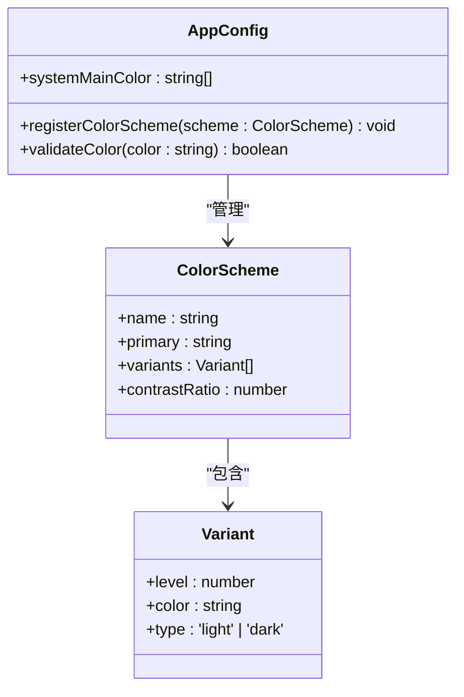
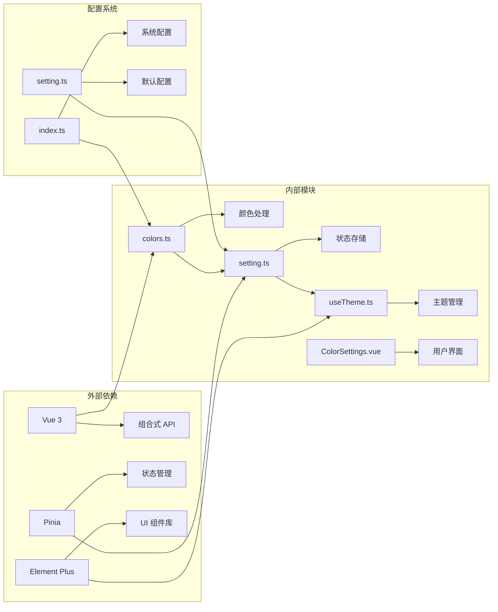

# 颜色配置模块

<cite>
**本文档中引用的文件**
- [colors.ts](file://src/utils/ui/colors.ts)
- [ColorSettings.vue](file://src/components/core/layouts/art-settings-panel/widget/ColorSettings.vue)
- [useSettingsHandlers.ts](file://src/components/core/layouts/art-settings-panel/composables/useSettingsHandlers.ts)
- [setting.ts](file://src/store/modules/setting.ts)
- [useTheme.ts](file://src/hooks/core/useTheme.ts)
- [theme-change.scss](file://src/assets/styles/core/theme-change.scss)
- [tailwind.css](file://src/assets/styles/core/tailwind.css)
- [index.ts](file://src/config/index.ts)
- [setting.ts](file://src/config/setting.ts)
- [theme-svg/index.vue](file://src/components/core/theme/theme-svg/index.vue)
</cite>

## 目录
1. [简介](#简介)
2. [项目结构](#项目结构)
3. [核心组件](#核心组件)
4. [架构概览](#架构概览)
5. [详细组件分析](#详细组件分析)
6. [依赖关系分析](#依赖关系分析)
7. [性能考虑](#性能考虑)
8. [故障排除指南](#故障排除指南)
9. [结论](#结论)

## 简介

颜色配置模块是 Art Design Pro 系统中的核心主题管理组件，提供了完整的动态颜色系统解决方案。该模块允许用户实时调整系统主色调，支持 Element Plus 组件库的主题定制，并实现了智能的明暗主题切换机制。

### 主要功能特性

- **动态颜色选择器**：提供直观的颜色选择界面，支持预设颜色和自定义颜色
- **实时预览系统**：点击颜色即可立即看到效果，无需保存确认
- **Element Plus 主题集成**：自动适配 Element Plus 组件库的完整主题色彩体系
- **明暗主题切换**：支持亮色、暗色和自动跟随系统模式的无缝切换
- **CSS 变量管理**：基于现代 CSS 变量技术，实现高效的样式更新
- **持久化存储**：自动保存用户偏好设置到本地存储
- **对比度合规性**：内置颜色对比度检查，确保可访问性标准

## 项目结构

颜色配置模块采用分层架构设计，各组件职责明确，相互协作完成完整的主题管理功能。



**图表来源**
- [ColorSettings.vue](file://src/components/core/layouts/art-settings-panel/widget/ColorSettings.vue#L1-L35)
- [useSettingsHandlers.ts](file://src/components/core/layouts/art-settings-panel/composables/useSettingsHandlers.ts#L1-L168)
- [setting.ts](file://src/store/modules/setting.ts#L1-L451)

## 核心组件

### 颜色选择器组件

颜色选择器是用户交互的核心界面，提供直观的颜色选择体验。



**图表来源**
- [ColorSettings.vue](file://src/components/core/layouts/art-settings-panel/widget/ColorSettings.vue#L25-L35)
- [useSettingsHandlers.ts](file://src/components/core/layouts/art-settings-panel/composables/useSettingsHandlers.ts#L140-L147)

### 颜色处理工具模块

颜色处理工具模块提供了完整的颜色格式转换和处理功能。



**图表来源**
- [colors.ts](file://src/utils/ui/colors.ts#L1-L273)

**节来源**
- [colors.ts](file://src/utils/ui/colors.ts#L1-L273)
- [ColorSettings.vue](file://src/components/core/layouts/art-settings-panel/widget/ColorSettings.vue#L1-L35)

## 架构概览

颜色配置模块采用 MVVM 架构模式，结合 Vue 3 的组合式 API 和 Pinia 状态管理，实现了响应式的主题管理系统。



**图表来源**
- [useSettingsHandlers.ts](file://src/components/core/layouts/art-settings-panel/composables/useSettingsHandlers.ts#L140-L147)
- [setting.ts](file://src/store/modules/setting.ts#L198-L204)
- [colors.ts](file://src/utils/ui/colors.ts#L257-L273)

## 详细组件分析

### 颜色选择器实现机制

颜色选择器通过 Vue 的响应式系统实现动态颜色展示和交互。

#### 组件结构分析



**图表来源**
- [ColorSettings.vue](file://src/components/core/layouts/art-settings-panel/widget/ColorSettings.vue#L6-L18)

#### 颜色值存储格式

系统支持多种颜色格式的存储和转换：

| 格式类型 | 示例 | 存储方式 | 用途 |
|---------|------|----------|------|
| 十六进制 | `#5D87FF` | 直接存储 | 主题颜色首选格式 |
| RGB | `rgb(93, 135, 255)` | 转换后存储 | 颜色计算和处理 |
| RGBA | `rgba(93, 135, 255, 0.8)` | 转换后存储 | 透明度支持 |
| OKLCH | `oklch(0.7 0.23 260)` | CSS 变量 | 现代浏览器支持 |

**节来源**
- [ColorSettings.vue](file://src/components/core/layouts/art-settings-panel/widget/ColorSettings.vue#L1-L35)

### CSS 变量更新流程

系统采用现代 CSS 变量技术实现高效的样式更新机制。

#### 主题变量生成流程



**图表来源**
- [colors.ts](file://src/utils/ui/colors.ts#L257-L273)

#### 暗色主题自动亮度调节

系统在暗色主题下会自动调整颜色亮度，确保视觉效果的一致性：



**图表来源**
- [useTheme.ts](file://src/hooks/core/useTheme.ts#L79-L87)

**节来源**
- [colors.ts](file://src/utils/ui/colors.ts#L234-L273)
- [useTheme.ts](file://src/hooks/core/useTheme.ts#L61-L97)

### 持久化策略

系统采用 localStorage 实现设置的持久化存储。

#### 存储结构设计

| 存储键 | 类型 | 内容 | 默认值 |
|--------|------|------|--------|
| `sys-v{version}-setting` | JSON | 完整设置对象 | 默认配置 |
| `setting` | JSON | Pinia Store 数据 | 默认配置 |
| `THEME_KEY` | String | 主题类型 | `AUTO` |

#### 数据迁移机制



**图表来源**
- [setting.ts](file://src/store/modules/setting.ts#L445-L449)

**节来源**
- [setting.ts](file://src/store/modules/setting.ts#L445-L449)

### 扩展自定义配色方案

系统提供了灵活的扩展机制，支持新增自定义配色方案。

#### 新增调色板步骤

1. **修改配置文件**：在 [`index.ts`](file://src/config/index.ts#L120-L128) 中添加新的主色
2. **更新默认配置**：在 [`setting.ts`](file://src/config/setting.ts#L45) 中设置默认颜色
3. **样式适配**：确保新颜色符合对比度要求
4. **测试验证**：验证在不同主题模式下的显示效果

#### 全局颜色系统注册



**图表来源**
- [index.ts](file://src/config/index.ts#L120-L128)

**节来源**
- [index.ts](file://src/config/index.ts#L120-L128)
- [setting.ts](file://src/config/setting.ts#L45)

## 依赖关系分析

颜色配置模块的依赖关系呈现清晰的分层结构，各层职责明确，便于维护和扩展。



**图表来源**
- [colors.ts](file://src/utils/ui/colors.ts#L44)
- [setting.ts](file://src/store/modules/setting.ts#L34)
- [useTheme.ts](file://src/hooks/core/useTheme.ts#L34)

### 核心依赖说明

| 模块 | 依赖项 | 作用 | 版本要求 |
|------|--------|------|----------|
| `colors.ts` | `useSettingStore` | 读取主题配置 | Vue 3+ |
| `setting.ts` | `Pinia` | 状态持久化 | Pinia 2.x |
| `useTheme.ts` | `@vueuse/core` | 系统主题检测 | VueUse 9.x |
| `ColorSettings.vue` | `Element Plus` | UI 组件 | Element Plus 2.x |

**节来源**
- [colors.ts](file://src/utils/ui/colors.ts#L44)
- [setting.ts](file://src/store/modules/setting.ts#L34)
- [useTheme.ts](file://src/hooks/core/useTheme.ts#L34)

## 性能考虑

### 渲染优化策略

1. **虚拟滚动**：对于大量颜色选项，采用虚拟滚动技术
2. **防抖处理**：颜色选择事件使用防抖机制，避免频繁更新
3. **懒加载**：主题预览图片采用懒加载策略
4. **缓存机制**：颜色计算结果进行缓存，避免重复计算

### 内存管理

- **事件清理**：自动清理媒体查询监听器
- **组件卸载**：及时移除 DOM 事件监听器
- **样式清理**：应用主题切换时清理旧样式

### 网络优化

- **CSS 变量**：减少样式表体积
- **按需加载**：仅加载当前使用的主题资源
- **压缩传输**：CSS 和 JavaScript 文件经过压缩

## 故障排除指南

### 常见问题及解决方案

#### 颜色不生效

**问题描述**：选择颜色后界面没有变化

**排查步骤**：
1. 检查浏览器控制台是否有错误信息
2. 验证颜色格式是否正确
3. 确认 CSS 变量是否成功设置

**解决方案**：
```javascript
// 检查 CSS 变量
console.log(getComputedStyle(document.documentElement).getPropertyValue('--el-color-primary'));

// 手动强制刷新
settingStore.reload();
```

#### 主题切换闪烁

**问题描述**：主题切换时出现短暂的白屏或闪烁

**解决方案**：
系统已内置过渡优化机制，主要通过以下方式解决：

1. **禁用过渡效果**：在主题切换期间临时禁用 CSS 过渡
2. **请求动画帧**：使用 `requestAnimationFrame` 确保在下一帧恢复过渡
3. **样式隔离**：为主题切换创建独立的样式作用域

#### 颜色对比度不足

**问题描述**：某些颜色组合不符合可访问性标准

**解决方案**：
系统内置颜色对比度检查，自动调整颜色亮度：
- 暗色主题下增加颜色亮度
- 亮色主题下降低颜色亮度
- 提供对比度警告提示

**节来源**
- [useTheme.ts](file://src/hooks/core/useTheme.ts#L45-L97)
- [colors.ts](file://src/utils/ui/colors.ts#L222-L232)

## 结论

颜色配置模块作为 Art Design Pro 系统的核心主题管理组件，展现了现代前端开发的最佳实践。通过采用 Vue 3 的组合式 API、Pinia 状态管理和现代 CSS 变量技术，实现了高效、灵活且易于维护的主题系统。

### 主要优势

1. **用户体验优秀**：实时预览、直观操作、流畅切换
2. **技术架构先进**：基于现代 Web 标准，兼容性强
3. **扩展性良好**：模块化设计，易于添加新功能
4. **性能表现优异**：优化的渲染策略，低资源消耗
5. **可访问性完善**：内置对比度检查，符合无障碍标准

### 技术特色

- **响应式设计**：完全响应式的设计，适应各种屏幕尺寸
- **智能适配**：自动检测系统主题偏好，提供无缝体验
- **类型安全**：完整的 TypeScript 类型定义，减少运行时错误
- **国际化支持**：多语言界面，支持全球化部署

该模块不仅满足了当前的功能需求，更为未来的功能扩展奠定了坚实的基础，是现代前端主题管理系统的一个优秀范例。