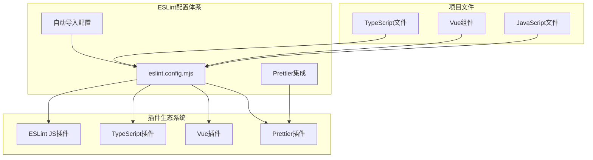
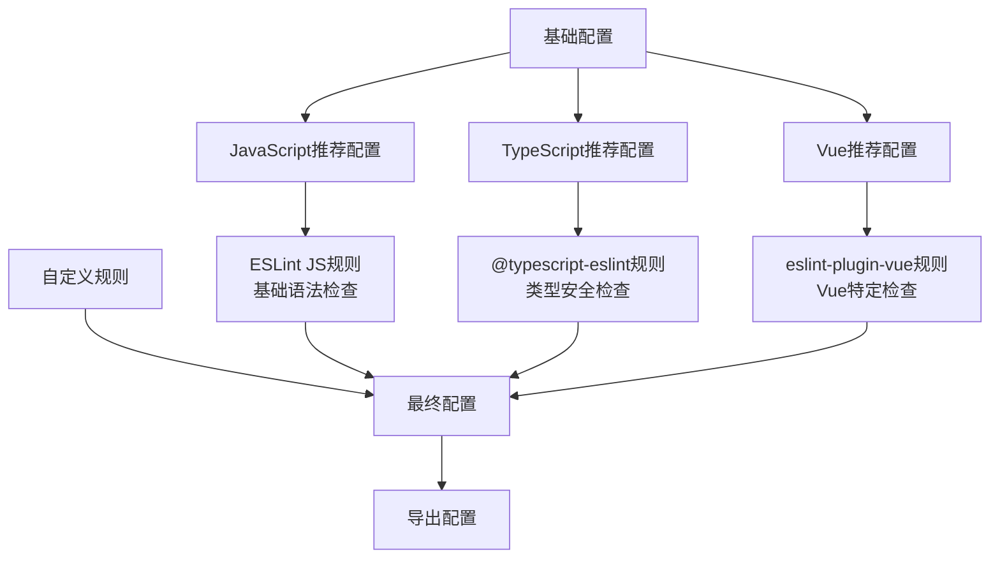

# ESLint配置详细文档

<cite>
**本文档引用的文件**
- [eslint.config.mjs](file://eslint.config.mjs)
- [package.json](file://package.json)
- [vite.config.ts](file://vite.config.ts)
- [tsconfig.json](file://tsconfig.json)
- [src/App.vue](file://src/App.vue)
- [src/main.ts](file://src/main.ts)
- [src/store/index.ts](file://src/store/index.ts)
- [src/components/core/base/art-logo/index.vue](file://src/components/core/base/art-logo/index.vue)
- [src/hooks/core/useAppMode.ts](file://src/hooks/core/useAppMode.ts)
</cite>

## 目录
1. [简介](#简介)
2. [项目结构概览](#项目结构概览)
3. [核心配置文件分析](#核心配置文件分析)
4. [配置架构详解](#配置架构详解)
5. [详细组件分析](#详细组件分析)
6. [自动导入系统集成](#自动导入系统集成)
7. [规则强制执行机制](#规则强制执行机制)
8. [性能考虑](#性能考虑)
9. [故障排除指南](#故障排除指南)
10. [总结](#总结)

## 简介

本文档深入解析了Art Design Pro项目中的ESLint配置系统，重点分析`eslint.config.mjs`文件的配置结构和实现原理。该配置采用了现代ESLint的扁平化配置格式，集成了TypeScript、Vue和Prettier等多种工具链，形成了一个完整的代码质量保证体系。

## 项目结构概览

该项目采用现代化的前端技术栈，包含以下关键特性：
- **TypeScript支持**：完整的TypeScript类型检查和配置
- **Vue 3 Composition API**：基于组合式API的组件开发
- **自动导入系统**：通过unplugin-auto-import实现智能导入
- **样式统一**：集成Tailwind CSS和SCSS预处理器
- **代码质量**：ESLint + Prettier + Stylelint的全方位代码规范



**图表来源**
- [eslint.config.mjs](file://eslint.config.mjs#L1-L84)
- [package.json](file://package.json#L83-L121)

## 核心配置文件分析

### 文件匹配规则配置

ESLint配置的第一部分定义了需要检查的文件范围：

```javascript
{
  files: ['**/*.{js,mjs,cjs,ts,vue}']
}
```

这个配置确保了以下文件类型都会被ESLint检查：
- **JavaScript文件**：`.js`, `.mjs`, `.cjs`
- **TypeScript文件**：`.ts`
- **Vue单文件组件**：`.vue`

这种广泛的文件匹配确保了整个项目的代码质量一致性，涵盖了项目中所有的源码文件。

**章节来源**
- [eslint.config.mjs](file://eslint.config.mjs#L24-L26)

### 全局变量设置

配置中同时启用了浏览器和Node.js环境的全局变量：

```javascript
languageOptions: {
  globals: {
    ...globals.browser,
    ...globals.node
  }
}
```

这种配置提供了：
- **浏览器环境**：DOM API、BOM对象等浏览器特有的全局变量
- **Node.js环境**：`require`、`module`、`process`等服务器端全局变量
- **跨平台兼容性**：同时支持客户端和服务端开发场景

**章节来源**
- [eslint.config.mjs](file://eslint.config.mjs#L29-L34)

## 配置架构详解

### 继承的推荐配置

ESLint配置采用了多层次的继承结构：



**图表来源**
- [eslint.config.mjs](file://eslint.config.mjs#L37-L39)

#### JavaScript推荐配置
来自`@eslint/js`插件的基础推荐配置，提供：
- **基础语法检查**：变量声明、函数定义等基本语法规范
- **最佳实践**：避免常见错误和不良编程习惯
- **安全性**：防止潜在的安全漏洞

#### TypeScript推荐配置
来自`typescript-eslint`团队维护的配置：
- **类型安全**：严格的类型检查规则
- **最佳实践**：TypeScript特有的编码规范
- **性能优化**：避免不必要的类型转换和检查

#### Vue推荐配置
来自`eslint-plugin-vue`的Vue 3推荐配置：
- **Composition API**：针对Vue 3组合式API的检查规则
- **模板语法**：Vue模板中的语法和最佳实践
- **组件规范**：Vue组件的结构和命名约定

**章节来源**
- [eslint.config.mjs](file://eslint.config.mjs#L37-L39)

## 详细组件分析

### 自定义规则配置

自定义规则配置是整个ESLint配置的核心部分，包含了项目特定的代码风格要求：

#### 字符串和分号规范

```javascript
rules: {
  quotes: ['error', 'single'],        // 使用单引号
  semi: ['error', 'never'],          // 语句末尾不加分号
  'no-var': 'error'                  // 要求使用 let 或 const 而不是 var
}
```

这些规则体现了现代JavaScript开发的最佳实践：
- **单引号优先**：保持字符串字面量的一致性
- **无分号结尾**：遵循现代JavaScript的流行趋势
- **let/const替代var**：使用更现代的变量声明方式

#### 类型检查配置

```javascript
'@typescript-eslint/no-explicit-any': 'off'  // 禁用 any 检查
```

这个配置允许在必要时使用`any`类型，但设置了警告级别，鼓励开发者谨慎使用：
- **灵活性**：在复杂类型场景下提供灵活性
- **渐进式改进**：允许逐步替换`any`类型
- **团队协作**：平衡开发效率和类型安全

#### Vue组件命名规则

```javascript
'vue/multi-word-component-names': 'off'  // 禁用对 Vue 组件名称的多词要求检查
```

这个规则的关闭原因及其影响：

**关闭原因**：
1. **项目规模适中**：组件数量相对较少，命名冲突风险低
2. **开发效率**：简化组件命名，减少命名复杂度
3. **团队共识**：团队成员达成一致，认为多词命名不是必需

**对项目的影响**：
- **组件命名自由度**：可以使用简短的单字母或单词组件名
- **代码可读性**：需要依靠其他约定（如目录结构）来保证可读性
- **维护成本**：可能增加组件查找和管理的难度

#### 代码格式化规则

```javascript
'no-multiple-empty-lines': ['warn', { max: 1 }],  // 不允许多个空行
'no-unexpected-multiline': 'error'                // 禁止空余的多行
```

这些规则确保了代码的整洁性和一致性：
- **空行控制**：限制连续空行数量，保持代码紧凑
- **多行表达式**：防止意外的多行语法错误

**章节来源**
- [eslint.config.mjs](file://eslint.config.mjs#L53-L61)

### Vue特定配置

针对Vue单文件组件的特殊配置：

```javascript
{
  files: ['**/*.vue'],
  languageOptions: {
    parserOptions: { parser: tseslint.parser }
  }
}
```

这个配置的作用：
- **TypeScript解析器**：使用`typescript-eslint`的解析器处理Vue文件中的TypeScript代码
- **统一解析**：确保TypeScript和Vue的类型检查一致性
- **最佳实践**：遵循Vue官方推荐的配置方式

**章节来源**
- [eslint.config.mjs](file://eslint.config.mjs#L64-L68)

### 忽略文件配置

为了提高性能和避免误报，配置了多个忽略规则：

```javascript
ignores: [
  'node_modules',
  'dist',
  'public',
  '.vscode/**',
  'src/assets/**',
  'src/utils/console.ts'
]
```

这些忽略规则的设计原则：
- **构建产物**：忽略编译输出目录
- **第三方库**：避免检查node_modules中的代码
- **开发工具**：排除IDE配置文件
- **静态资源**：忽略图片、字体等非代码文件
- **调试工具**：保留console语句用于开发调试

**章节来源**
- [eslint.config.mjs](file://eslint.config.mjs#L71-L80)

## 自动导入系统集成

### auto-import.json文件的作用

ESLint配置通过读取`.auto-import.json`文件来同步自动导入的全局变量：

```javascript
const autoImportConfig = JSON.parse(
  fs.readFileSync(path.resolve(__dirname, '.auto-import.json'), 'utf-8')
)
```

这个文件是由Vite插件`unplugin-auto-import`自动生成的，包含了：
- **Vue API**：`ref`, `reactive`, `computed`等Vue 3 API
- **组合式函数**：`useRouter`, `useStore`等组合式函数
- **工具函数**：`useDebounce`, `useThrottle`等工具函数

### 自动导入配置集成

在ESLint配置中，自动导入的全局变量被合并到语言选项中：

```javascript
languageOptions: {
  globals: {
    ...autoImportConfig.globals,
    Api: 'readonly'
  }
}
```

这种集成方式的优势：
- **实时同步**：ESLint配置与自动导入系统保持同步
- **类型安全**：确保导入的变量在ESLint中被正确识别
- **开发体验**：减少IDE中的未定义变量警告

**章节来源**
- [eslint.config.mjs](file://eslint.config.mjs#L17-L20)
- [eslint.config.mjs](file://eslint.config.mjs#L47-L51)

### Vite配置中的自动导入设置

Vite配置中也集成了相同的自动导入功能：

```javascript
AutoImport({
  imports: ['vue', 'vue-router', 'pinia', '@vueuse/core'],
  eslintrc: {
    enabled: true,
    filepath: './.auto-import.json',
    globalsPropValue: true
  }
})
```

这种双向配置确保了：
- **一致性**：Vite和ESLint使用相同的导入配置
- **自动化**：`.auto-import.json`文件自动生成和更新
- **完整性**：覆盖所有需要的API和组合式函数

**章节来源**
- [vite.config.ts](file://vite.config.ts#L72-L80)

## 规则强制执行机制

### 规则级别说明

ESLint配置中使用了不同的规则级别来控制代码质量：

| 规则级别 | 说明 | 示例 |
|---------|------|------|
| `'error'` | 错误级别，违反时会阻止代码提交 | `quotes: ['error', 'single']` |
| `'warn'` | 警告级别，显示但不阻止 | `no-multiple-empty-lines: ['warn', { max: 1 }]` |
| `'off'` | 关闭规则 | `@typescript-eslint/no-explicit-any: 'off'` |

### 实际代码示例验证

让我们通过实际代码示例来说明这些规则的强制执行：

#### 单引号和无分号规则

**符合规范的代码**：
```typescript
const message = 'Hello, world!'
const count = 42
```

**违反规范的代码**：
```typescript
const message = "Hello, world!"  // 双引号
const count = 42;                // 多余的分号
```

#### any类型检查规则

**符合规范的代码**：
```typescript
function processData(data: unknown): any {
  if (typeof data === 'string') {
    return data.toUpperCase()
  }
  return null
}
```

**违反规范的代码**：
```typescript
function processData(data: any): any {
  return data
}
```

#### Vue组件命名规则

**符合规范的代码**：
```vue
<script setup>
defineOptions({ name: 'ArtLogo' })
</script>
```

**违反规范的代码**：
```vue
<script setup>
defineOptions({ name: 'logo' })  // 单词组件名
</script>
```

### Prettier集成

配置最后集成了Prettier推荐配置：

```javascript
eslintPluginPrettierRecommended
```

这确保了：
- **代码格式一致性**：Prettier负责格式化，ESLint负责逻辑检查
- **冲突解决**：两者协同工作，避免格式化冲突
- **开发体验**：提供一致的代码风格

**章节来源**
- [eslint.config.mjs](file://eslint.config.mjs#L82)

## 性能考虑

### 文件过滤优化

ESLint配置通过精确的文件匹配和忽略规则来优化性能：

1. **精确匹配**：只检查必要的文件类型
2. **智能忽略**：排除大型目录和临时文件
3. **增量检查**：配合lint-staged实现增量检查

### 缓存机制

虽然配置中没有显式启用缓存，但ESLint本身具有内置的缓存机制：
- **增量检查**：只重新检查修改过的文件
- **性能优化**：避免重复处理未变更的文件
- **CI友好**：在持续集成环境中提高效率

### 并行处理

现代ESLint配置支持并行处理：
- **多核利用**：充分利用多核CPU性能
- **快速反馈**：减少代码检查等待时间
- **开发体验**：提供即时的代码质量反馈

## 故障排除指南

### 常见问题及解决方案

#### 1. 自动导入变量未识别

**问题症状**：ESLint报告未定义的变量错误

**解决方案**：
- 确保`.auto-import.json`文件存在且最新
- 检查Vite配置中的自动导入设置
- 运行`pnpm lint`重新生成配置文件

#### 2. Vue组件命名规则冲突

**问题症状**：Vue组件命名不符合规则

**解决方案**：
- 检查`vue/multi-word-component-names`规则设置
- 确认组件命名是否符合团队约定
- 考虑升级到Vue 3的组合式API命名规范

#### 3. TypeScript类型检查问题

**问题症状**：TypeScript类型相关规则报错

**解决方案**：
- 检查`tsconfig.json`配置是否正确
- 确认`typescript-eslint`插件版本兼容性
- 验证项目中使用的TypeScript版本

#### 4. 性能问题

**问题症状**：ESLint检查速度过慢

**解决方案**：
- 检查忽略规则是否合理
- 确认文件匹配模式是否过于宽泛
- 考虑使用`eslint --cache`启用缓存

### 调试技巧

1. **详细日志**：使用`eslint --debug`查看详细信息
2. **规则测试**：使用在线ESLint规则测试工具
3. **配置验证**：运行`eslint --print-config`检查最终配置
4. **增量检查**：使用`lint-staged`进行局部检查

**章节来源**
- [eslint.config.mjs](file://eslint.config.mjs#L71-L80)

## 总结

Art Design Pro项目的ESLint配置展现了现代前端项目的最佳实践：

### 核心优势

1. **全面覆盖**：涵盖JavaScript、TypeScript和Vue三种主要技术栈
2. **现代标准**：采用ESLint 9.x的扁平化配置格式
3. **团队协作**：通过自动导入系统确保团队成员使用相同的API
4. **性能优化**：合理的文件过滤和忽略规则
5. **开发体验**：与Prettier集成提供一致的代码风格

### 配置特点

- **灵活的规则设置**：根据项目需求调整严格程度
- **智能的自动导入**：与Vite插件无缝集成
- **渐进式改进**：允许在严格性和实用性之间找到平衡
- **持续集成友好**：支持CI/CD流程中的代码质量检查

### 最佳实践建议

1. **定期更新**：保持ESLint插件和配置的最新版本
2. **团队共识**：确保团队成员对配置规则达成一致
3. **渐进式实施**：从推荐配置开始，逐步添加项目特定规则
4. **监控性能**：关注ESLint检查对开发效率的影响
5. **文档维护**：记录配置变更的原因和影响

这套ESLint配置为Art Design Pro项目提供了坚实的代码质量保障，确保了项目的可维护性和开发效率。通过合理的规则设置和工具集成，它成功地平衡了代码质量要求和开发便利性。