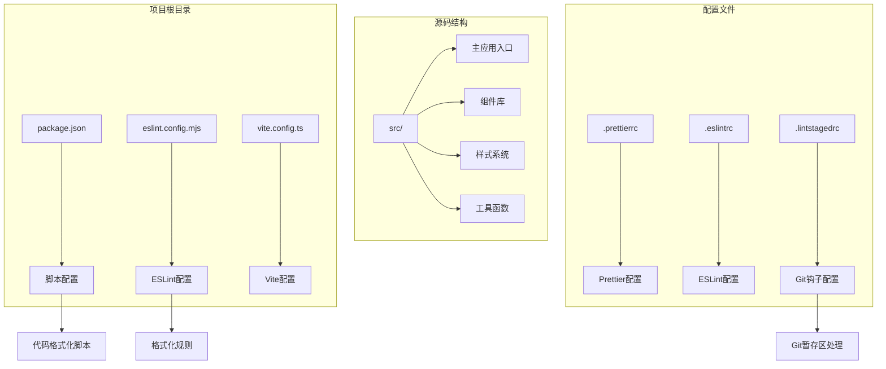
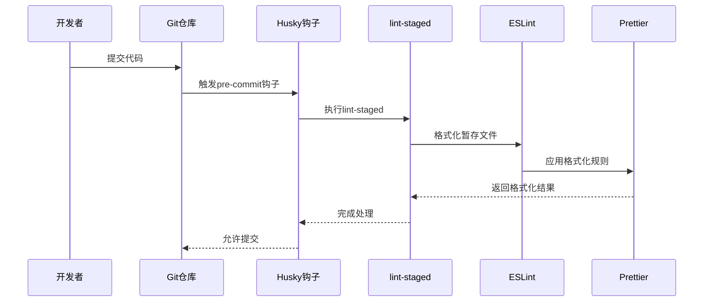
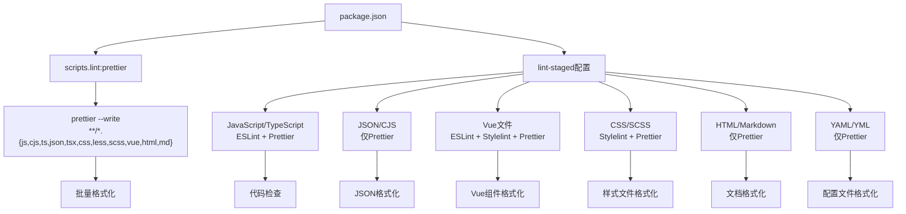
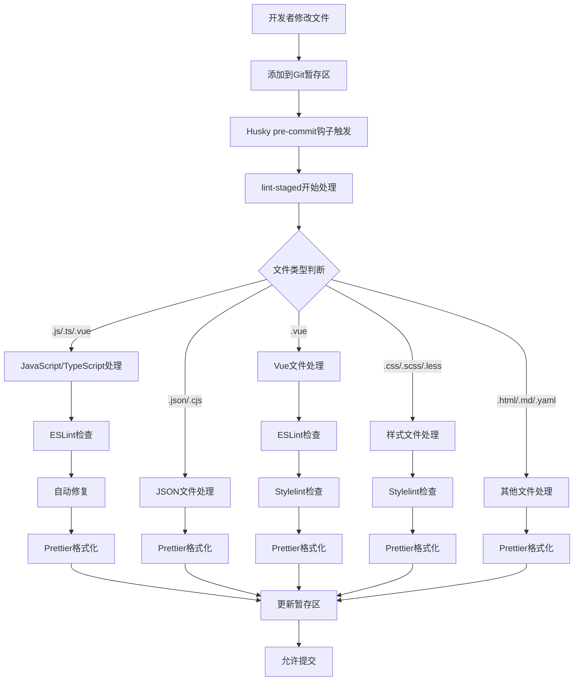
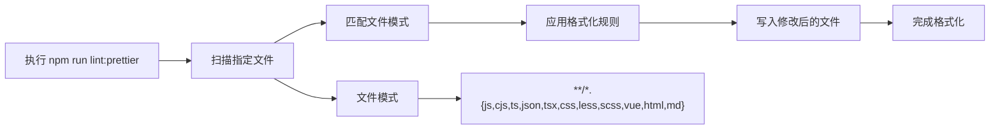
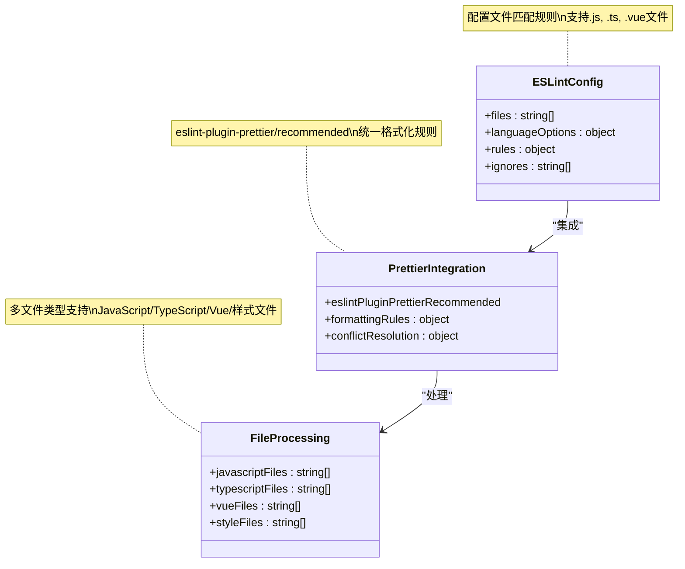
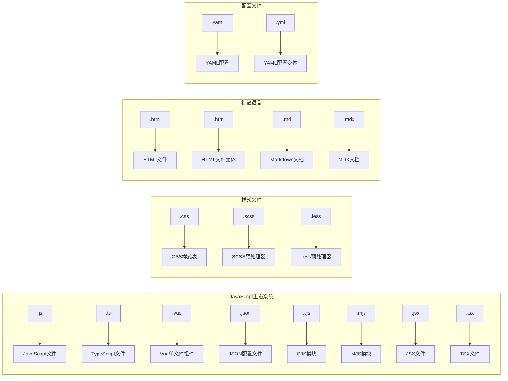
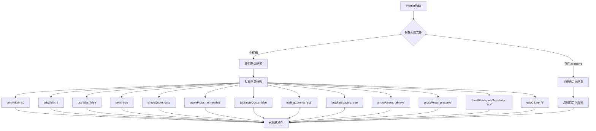
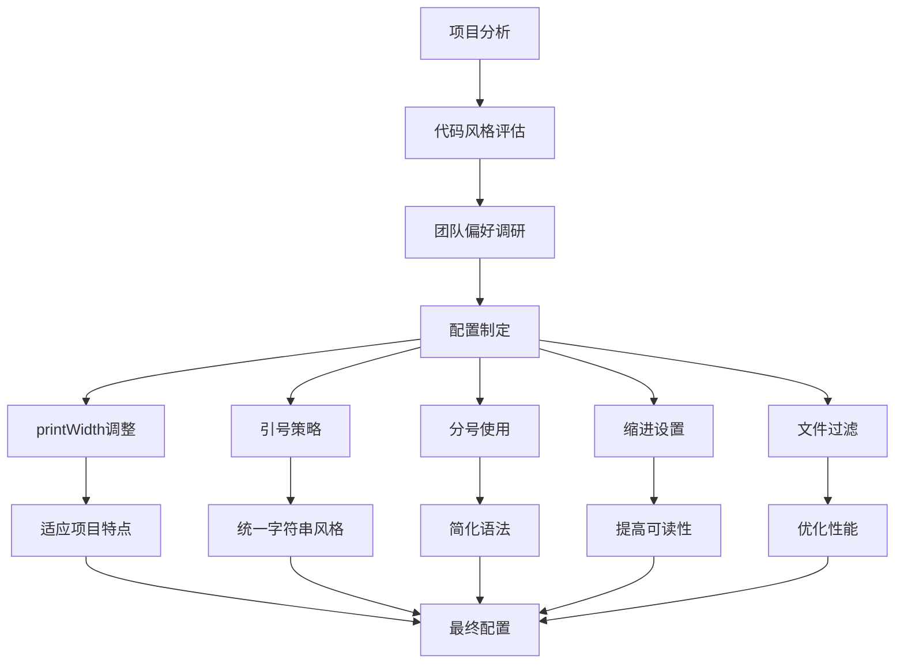
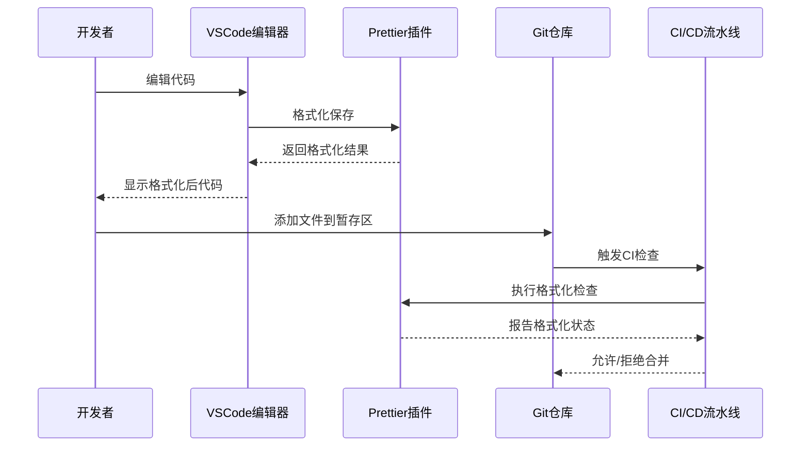

# Prettier代码格式化

<cite>
**本文档引用的文件**
- [package.json](file://package.json)
- [eslint.config.mjs](file://eslint.config.mjs)
- [src/main.ts](file://src/main.ts)
- [src/App.vue](file://src/App.vue)
- [vite.config.ts](file://vite.config.ts)
- [src/assets/styles/index.scss](file://src/assets/styles/index.scss)
- [src/assets/styles/core/app.scss](file://src/assets/styles/core/app.scss)
</cite>

## 目录
1. [简介](#简介)
2. [项目结构概览](#项目结构概览)
3. [Prettier集成架构](#prettier集成架构)
4. [核心配置分析](#核心配置分析)
5. [代码格式化流程](#代码格式化流程)
6. [ESLint与Prettier协同工作](#eslint与prettier协同工作)
7. [文件类型支持](#文件类型支持)
8. [默认配置说明](#默认配置说明)
9. [定制化建议](#定制化建议)
10. [最佳实践](#最佳实践)
11. [故障排除指南](#故障排除指南)
12. [总结](#总结)

## 简介

Prettier是一个流行的代码格式化工具，在本项目中被深度集成到代码质量工作流中。通过与ESLint、lint-staged等工具的协同工作，确保了整个团队代码风格的一致性和可维护性。

该项目使用Prettier v3.5.3版本，配合ESLint插件实现代码检查与格式化的统一管理。通过精心设计的配置策略，支持多种文件类型的自动格式化，包括JavaScript、TypeScript、Vue单文件组件、CSS/SCSS等。

## 项目结构概览

项目采用现代化的前端技术栈，包含丰富的组件库和样式系统：



**图表来源**
- [package.json](file://package.json#L9-L17)
- [eslint.config.mjs](file://eslint.config.mjs#L1-L84)

**章节来源**
- [package.json](file://package.json#L1-L124)
- [eslint.config.mjs](file://eslint.config.mjs#L1-L84)

## Prettier集成架构

项目中的Prettier集成采用了多层次的架构设计，确保代码格式化工作的高效性和准确性：



**图表来源**
- [package.json](file://package.json#L17-L52)
- [eslint.config.mjs](file://eslint.config.mjs#L82)

### 核心集成点

1. **脚本层集成**：通过`lint:prettier`脚本提供独立的格式化能力
2. **Git工作流集成**：通过lint-staged在提交前自动格式化
3. **ESLint集成**：通过eslint-plugin-prettier实现规则执行
4. **多文件类型支持**：覆盖项目中的各种代码文件

**章节来源**
- [package.json](file://package.json#L15-L17)
- [eslint.config.mjs](file://eslint.config.mjs#L7-L8)

## 核心配置分析

### package.json中的Prettier配置

项目在package.json中定义了关键的Prettier配置：



**图表来源**
- [package.json](file://package.json#L15-L52)

### lint-staged配置详解

lint-staged提供了精确的文件分类处理机制：

| 文件类型 | 处理规则 | 工具组合 |
|---------|---------|---------|
| `*.{js,ts,mjs,mts,tsx}` | ESLint检查 + Prettier格式化 | ESLint --fix + prettier --write |
| `*.{cjs,json,jsonc}` | 仅Prettier格式化 | prettier --write |
| `*.vue` | ESLint + Stylelint + Prettier | ESLint --fix + stylelint --fix + prettier --write |
| `*.{html,htm}` | 仅Prettier格式化 | prettier --write |
| `*.{scss,css,less}` | Stylelint + Prettier | stylelint --fix + prettier --write |
| `*.{md,mdx}` | 仅Prettier格式化 | prettier --write |
| `*.{yaml,yml}` | 仅Prettier格式化 | prettier --write |

**章节来源**
- [package.json](file://package.json#L27-L52)

## 代码格式化流程

### Git暂存区处理流程



**图表来源**
- [package.json](file://package.json#L17-L18)

### 单独格式化流程

对于独立的格式化需求，项目提供了专门的脚本：



**图表来源**
- [package.json](file://package.json#L15)

**章节来源**
- [package.json](file://package.json#L15-L17)

## ESLint与Prettier协同工作

### 集成方式分析

项目通过eslint-plugin-prettier/recommended实现了ESLint与Prettier的深度集成：



**图表来源**
- [eslint.config.mjs](file://eslint.config.mjs#L82)
- [eslint.config.mjs](file://eslint.config.mjs#L24-L26)

### 规则冲突解决

ESLint通过eslint-plugin-prettier插件将Prettier作为规则执行：

| 集成特性 | 实现方式 | 作用 |
|---------|---------|------|
| 规则统一 | eslint-plugin-prettier/recommended | 将Prettier规则集成到ESLint配置中 |
| 冲突检测 | prettier/prettier规则 | 检测ESLint与Prettier规则冲突 |
| 自动修复 | --fix标志 | 自动修复格式化问题 |
| 错误报告 | ESLint错误输出 | 在ESLint错误报告中显示格式化问题 |

**章节来源**
- [eslint.config.mjs](file://eslint.config.mjs#L7-L82)

## 文件类型支持

### 支持的文件扩展名

项目全面支持现代前端开发中的各种文件类型：



**图表来源**
- [package.json](file://package.json#L15)
- [package.json](file://package.json#L27-L52)

### 文件处理策略

不同文件类型的处理策略体现了项目对不同类型代码的专业化处理：

| 文件类型 | 处理工具 | 特殊配置 | 处理重点 |
|---------|---------|---------|---------|
| `.js/.ts` | ESLint + Prettier | TypeScript解析器 | 语法检查 + 代码格式化 |
| `.vue` | ESLint + Stylelint + Prettier | Vue解析器 | 组件结构 + 样式 + 格式化 |
| `.json` | Prettier | JSON格式化 | 结构化数据格式化 |
| `.css/.scss/.less` | Stylelint + Prettier | SCSS解析器 | 样式规范 + 格式化 |
| `.html` | Prettier | HTML解析器 | 标记语言格式化 |
| `.md/.mdx` | Prettier | Markdown解析器 | 文档格式化 |
| `.yaml/.yml` | Prettier | YAML解析器 | 配置文件格式化 |

**章节来源**
- [package.json](file://package.json#L27-L52)

## 默认配置说明

### Prettier默认行为

由于项目中没有提供`.prettierrc`配置文件，Prettier将使用其内置的默认配置：



**图表来源**
- [package.json](file://package.json#L100)

### 默认配置参数详解

| 配置项 | 默认值 | 说明 |
|-------|--------|------|
| `printWidth` | 80 | 每行最大字符数 |
| `tabWidth` | 2 | 制表符宽度 |
| `useTabs` | false | 使用空格而非制表符 |
| `semi` | true | 语句末尾添加分号 |
| `singleQuote` | false | 使用双引号而非单引号 |
| `quoteProps` | 'as-needed' | 对象属性引号策略 |
| `jsxSingleQuote` | false | JSX使用双引号 |
| `trailingComma` | 'es5' | 尾随逗号策略 |
| `bracketSpacing` | true | 对象大括号内空格 |
| `arrowParens` | 'always' | 箭头函数参数括号 |
| `proseWrap` | 'preserve' | Markdown换行策略 |
| `htmlWhitespaceSensitivity` | 'css' | HTML空白敏感度 |
| `endOfLine` | 'lf' | 行结束符类型 |

**章节来源**
- [package.json](file://package.json#L100)

## 定制化建议

### 项目特定配置需求

基于项目的实际使用情况，建议考虑以下定制化配置：



### 推荐配置方案

#### 1. printWidth配置
```javascript
{
  "printWidth": 100, // 适应现代宽屏显示器
  "tabWidth": 2,     // 保持一致的缩进
  "useTabs": false,  // 使用空格提高一致性
  "semi": false,     // 移除不必要的分号
  "singleQuote": true, // 统一使用单引号
  "trailingComma": "all", // 添加尾随逗号
  "bracketSpacing": true, // 保持对象大括号内空格
  "arrowParens": "avoid" // 箭头函数简化
}
```

#### 2. 文件过滤优化
```javascript
{
  "overrides": [
    {
      "files": "*.vue",
      "options": {
        "parser": "vue"
      }
    },
    {
      "files": "*.json",
      "options": {
        "tabWidth": 2,
        "useTabs": false
      }
    }
  ]
}
```

#### 3. 性能优化配置
```javascript
{
  "ignorePath": ".prettierignore", // 排除不需要格式化的文件
  "filepath": "src/**/*.vue",      // 指定处理范围
  "requirePragma": false,         // 不需要pragma注释
  "insertPragma": false           // 不插入pragma注释
}
```

### 配置文件结构建议

创建`.prettierrc.js`文件：

```javascript
module.exports = {
  // 基础配置
  printWidth: 100,
  tabWidth: 2,
  useTabs: false,
  semi: false,
  singleQuote: true,
  quoteProps: 'as-needed',
  jsxSingleQuote: false,
  trailingComma: 'all',
  bracketSpacing: true,
  bracketSameLine: false,
  arrowParens: 'avoid',
  proseWrap: 'preserve',
  htmlWhitespaceSensitivity: 'css',
  endOfLine: 'lf',
  
  // Vue特殊配置
  vueIndentScriptAndStyle: true,
  
  // JSON配置
  jsonRecursiveSort: true,
  
  // 排除文件
  ignorePath: '.gitignore',
  
  // 解析器配置
  overrides: [
    {
      files: '*.vue',
      options: {
        parser: 'vue'
      }
    },
    {
      files: '*.json',
      options: {
        parser: 'json'
      }
    }
  ]
};
```

## 最佳实践

### 开发工作流程



### 团队协作规范

#### 1. 代码提交前检查
- 确保本地安装了最新版本的Prettier
- 运行`npm run lint:prettier`验证格式化效果
- 检查是否有格式化冲突或错误

#### 2. Git钩子配置
- 确保Husky和lint-staged正确安装
- 验证pre-commit钩子正常工作
- 测试文件格式化是否自动应用

#### 3. 编辑器集成
- VSCode用户安装Prettier插件
- 配置保存时自动格式化
- 设置编辑器格式化优先级

#### 4. CI/CD集成
- 在CI流水线中添加格式化检查
- 设置格式化失败时阻止合并
- 提供格式化指导文档

### 性能优化建议

#### 1. 文件处理优化
```bash
# 只格式化修改过的文件
npm run lint:lint-staged

# 批量格式化特定目录
npx prettier --write src/components/

# 排除大型文件或临时文件
echo "dist/" >> .prettierignore
echo "node_modules/" >> .prettierignore
```

#### 2. 缓存机制利用
```javascript
// .prettierrc.js
module.exports = {
  // 启用缓存（如果使用相关工具）
  cache: true,
  cacheStrategy: 'content', // 基于内容的缓存
  
  // 并行处理
  parallel: true,
  
  // 忽略大型文件
  ignoreUnknown: true,
  ignore: [
    '**/dist/**',
    '**/node_modules/**',
    '**/*.min.js',
    '**/*.bundle.js'
  ]
};
```

## 故障排除指南

### 常见问题及解决方案

#### 1. 格式化冲突问题

**问题描述**：ESLint与Prettier规则冲突导致格式化失败

**解决方案**：
```javascript
// 在.eslintrc.js中添加
module.exports = {
  extends: [
    'plugin:prettier/recommended'
  ],
  rules: {
    // 显式关闭可能冲突的规则
    'prettier/prettier': 'error',
    'quotes': 'off', // 让Prettier处理引号
    'semi': 'off',   // 让Prettier处理分号
    'comma-dangle': 'off' // 让Prettier处理尾随逗号
  }
}
```

#### 2. Vue文件格式化问题

**问题描述**：Vue单文件组件格式化异常

**解决方案**：
```javascript
// .prettierrc.js
module.exports = {
  // 确保Vue解析器正确配置
  overrides: [
    {
      files: '*.vue',
      options: {
        parser: 'vue',
        // Vue特有的格式化选项
        vueIndentScriptAndStyle: true,
        singleAttributePerLine: true
      }
    }
  ]
}
```

#### 3. 性能问题

**问题描述**：格式化大型项目时速度过慢

**解决方案**：
```bash
# 1. 使用并行处理
npx prettier --write --parallel "**/*.{js,ts,vue}"

# 2. 增加内存限制
NODE_OPTIONS="--max-old-space-size=4096" npx prettier --write .

# 3. 排除不需要的文件
npx prettier --write "**/*.{js,ts}" --ignore-path .gitignore
```

#### 4. Git钩子不工作

**问题描述**：lint-staged或Husky钩子失效

**解决方案**：
```bash
# 1. 检查依赖安装
npm install husky lint-staged --save-dev

# 2. 初始化Husky
npx husky install

# 3. 添加pre-commit钩子
npx husky add .husky/pre-commit "npx lint-staged"

# 4. 检查权限
chmod +x .husky/*

# 5. 验证配置
npx lint-staged --verbose
```

### 调试技巧

#### 1. 详细日志输出
```bash
# 启用详细输出
npx prettier --write --loglevel debug .

# 查看具体文件的格式化过程
npx prettier --check --debug-check .
```

#### 2. 配置验证
```bash
# 检查配置文件语法
npx prettier --check --config .prettierrc.js .

# 测试特定文件的格式化
npx prettier --check src/main.ts
```

#### 3. 性能分析
```bash
# 测量格式化时间
time npx prettier --write .

# 分析文件处理统计
npx prettier --write --list-different .
```

**章节来源**
- [package.json](file://package.json#L17-L18)
- [eslint.config.mjs](file://eslint.config.mjs#L82)

## 总结

本项目通过精心设计的Prettier集成方案，实现了代码格式化的自动化和标准化。主要特点包括：

### 核心优势

1. **全面的文件类型支持**：覆盖JavaScript、TypeScript、Vue、CSS、HTML、Markdown等多种文件格式
2. **智能的Git工作流集成**：通过lint-staged实现在提交前的自动格式化
3. **ESLint深度集成**：通过eslint-plugin-prettier实现规则统一和冲突解决
4. **灵活的配置策略**：支持默认配置和项目定制化配置
5. **高效的性能表现**：通过并行处理和智能缓存提升格式化效率

### 技术亮点

- **多层次集成架构**：从脚本层到Git钩子的完整工作流
- **文件分类处理**：针对不同文件类型采用专门的处理策略
- **冲突解决机制**：ESLint与Prettier的规则冲突自动解决
- **性能优化**：通过缓存和并行处理提升处理效率

### 发展方向

随着项目的发展，可以考虑以下改进方向：
- 引入更严格的格式化规则
- 增加自定义解析器支持
- 优化大型项目的处理性能
- 增强团队协作的格式化规范

通过持续的优化和改进，这个Prettier集成方案将继续为项目的代码质量和开发体验提供强有力的支持。