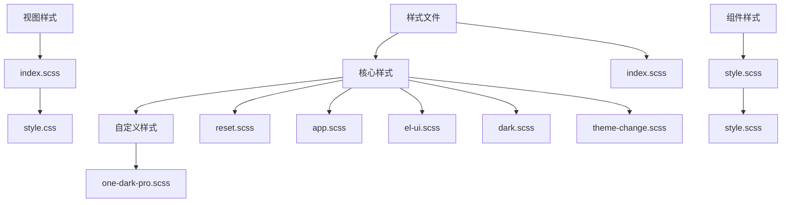
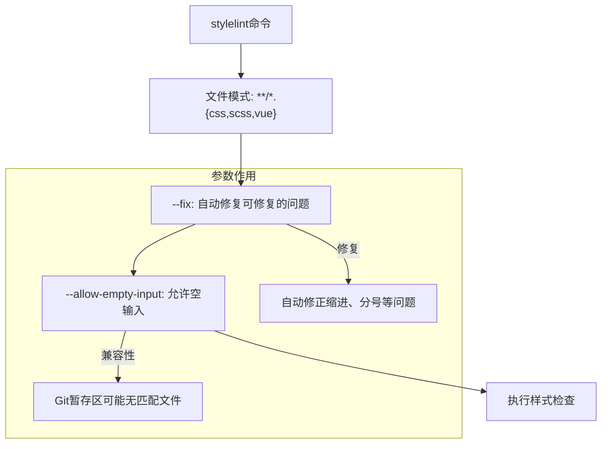
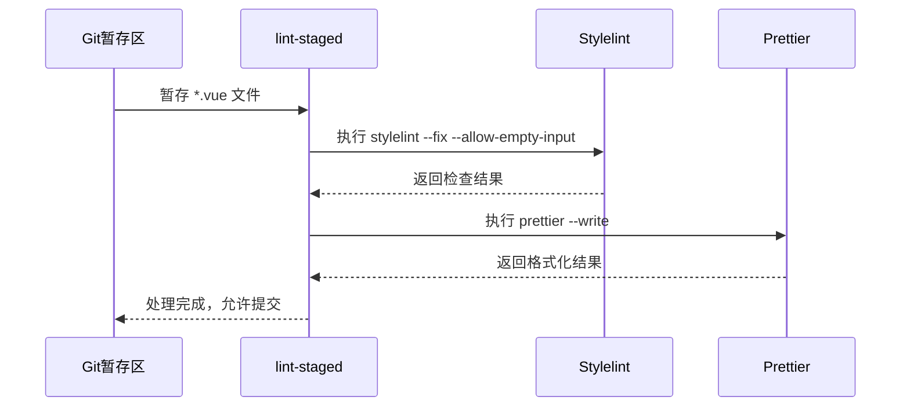
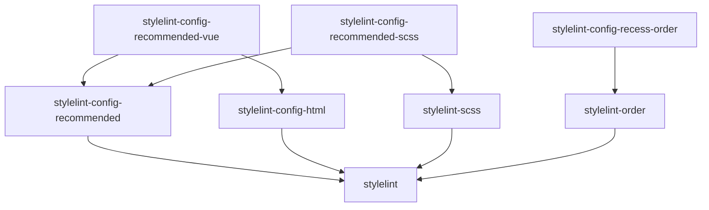

# Stylelint CSS检查

<cite>
**本文档引用的文件**  
- [package.json](file://package.json#L15-L46)
- [pnpm-lock.yaml](file://pnpm-lock.yaml#L5648-L5695)
- [src/assets/styles/index.scss](file://src/assets/styles/index.scss)
- [src/assets/styles/core/app.scss](file://src/assets/styles/core/app.scss)
- [src/components/core/layouts/art-settings-panel/style.scss](file://src/components/core/layouts/art-settings-panel/style.scss)
- [src/components/core/forms/art-wang-editor/style.scss](file://src/components/core/forms/art-wang-editor/style.scss)
- [src/views/index/style.scss](file://src/views/index/style.scss)
- [src/views/auth/login/style.css](file://src/views/auth/login/style.css)
</cite>

## 目录
1. [简介](#简介)
2. [项目结构](#项目结构)
3. [核心组件](#核心组件)
4. [架构概述](#架构概述)
5. [详细组件分析](#详细组件分析)
6. [依赖分析](#依赖分析)
7. [性能考虑](#性能考虑)
8. [故障排除指南](#故障排除指南)
9. [结论](#结论)
10. [附录](#附录)（如有必要）

## 简介
本文档详细介绍了Art Design Pro项目中Stylelint CSS检查系统的配置和使用方法。Stylelint是一个强大的现代化CSS检查工具，用于确保项目中的样式代码遵循一致的编码规范和最佳实践。本项目通过集成Stylelint与lint-staged、Prettier等工具，实现了对CSS、SCSS和Vue文件中样式代码的自动化检查和修复。文档将深入解析`package.json`中的`lint:stylelint`脚本和`lint-staged`配置，解释`stylelint --fix --allow-empty-input`命令的含义及其在不同场景下的应用，并介绍项目中使用的Stylelint配置插件及其协同工作方式。

## 项目结构
项目中的样式文件主要位于`src/assets/styles/`目录下，采用模块化的方式组织。核心样式文件被组织在`core/`子目录中，包括重置样式、应用全局样式、Element Plus组件库样式优化、暗黑主题样式等。此外，各个组件和视图也可以拥有自己的局部样式文件。这种分层结构使得样式管理更加清晰和可维护。



**Diagram sources**
- [src/assets/styles/index.scss](file://src/assets/styles/index.scss)
- [src/assets/styles/core/app.scss](file://src/assets/styles/core/app.scss)

**Section sources**
- [src/assets/styles/index.scss](file://src/assets/styles/index.scss)
- [src/assets/styles/core/app.scss](file://src/assets/styles/core/app.scss)

## 核心组件
Stylelint在本项目中的核心功能是通过`package.json`中的脚本和`lint-staged`配置来实现的。`lint:stylelint`脚本用于手动运行Stylelint对所有CSS、SCSS和Vue文件进行检查和修复。`lint-staged`配置则在Git暂存文件时自动触发Stylelint，确保提交的代码符合样式规范。项目使用了多个Stylelint配置插件，如`stylelint-config-recommended-scss`和`stylelint-config-recommended-vue`，以提供针对SCSS和Vue文件的最佳实践规则。

**Section sources**
- [package.json](file://package.json#L15-L46)
- [pnpm-lock.yaml](file://pnpm-lock.yaml#L5648-L5695)

## 架构概述
本项目的代码质量保障体系由ESLint、Prettier和Stylelint三个主要工具构成，它们通过`lint-staged`协调工作。当开发者暂存文件时，`lint-staged`会根据文件类型执行相应的检查和格式化命令。对于样式文件，首先由Stylelint进行检查和修复，然后由Prettier进行格式化。这种分层处理方式确保了代码既符合语法规则，又具有统一的格式风格。

```mermaid
graph LR
A[开发者修改文件] --> B[git add 暂存文件]
B --> C{lint-staged 根据文件类型}
C --> |*.vue| D[ESLint --fix]
C --> |*.vue| E[Stylelint --fix --allow-empty-input]
C --> |*.vue| F[Prettier --write]
C --> |*.{scss,css,less}| G[Stylelint --fix --allow-empty-input]
C --> |*.{scss,css,less}| H[Prettier --write]
D --> I[提交代码]
E --> I
F --> I
G --> I
H --> I
```

**Diagram sources**
- [package.json](file://package.json#L27-L46)

## 详细组件分析
### Stylelint配置分析
项目通过`package.json`中的`devDependencies`引入了多个Stylelint相关的配置包，这些包共同构成了项目的样式检查规则集。`stylelint-config-recommended-scss`提供了SCSS的最佳实践规则，`stylelint-config-recommended-vue`则针对Vue单文件组件中的样式部分提供了推荐规则。`stylelint-config-recess-order`用于强制样式属性的排序，提高代码可读性。

#### Stylelint命令参数说明


**Diagram sources**
- [package.json](file://package.json#L16)
- [package.json](file://package.json#L37)
- [package.json](file://package.json#L44)

**Section sources**
- [package.json](file://package.json#L15-L46)

### lint-staged执行规则分析
`lint-staged`配置定义了不同文件类型的处理流程。对于`*.vue`文件，执行顺序为`eslint --fix`、`stylelint --fix --allow-empty-input`、`prettier --write`。对于`*.{scss,css,less}`文件，执行`stylelint --fix --allow-empty-input`和`prettier --write`。这种顺序确保了先进行语法和样式检查修复，再进行代码格式化。



**Diagram sources**
- [package.json](file://package.json#L35-L38)
- [package.json](file://package.json#L43-L46)

**Section sources**
- [package.json](file://package.json#L27-L46)

## 依赖分析
项目依赖的Stylelint配置包之间存在明确的依赖关系。`stylelint-config-recommended-vue`依赖于`stylelint-config-html`和`stylelint-config-recommended`，而`stylelint-config-recommended-scss`则依赖于`stylelint-scss`和`stylelint-config-recommended`。这种依赖结构确保了规则集的完整性和一致性。



**Diagram sources**
- [pnpm-lock.yaml](file://pnpm-lock.yaml#L5648-L5695)

**Section sources**
- [pnpm-lock.yaml](file://pnpm-lock.yaml#L5648-L5695)

## 性能考虑
Stylelint的检查过程可能会对大型项目产生性能影响。本项目通过`lint-staged`仅对暂存文件进行检查，有效减少了需要处理的文件数量，提高了检查效率。此外，`--allow-empty-input`参数避免了在没有匹配文件时产生错误，保证了工作流的顺畅。

## 故障排除指南
当Stylelint检查失败时，开发者应首先检查相关文件的语法是否正确。如果遇到`No files matching the pattern were found`警告，这通常是由于`lint-staged`在暂存区找不到匹配的样式文件所致，属于正常情况，可忽略。若Stylelint报告大量错误，建议先运行`npm run lint:stylelint`手动修复所有问题，然后再进行提交。

**Section sources**
- [package.json](file://package.json#L16)
- [package.json](file://package.json#L37)
- [package.json](file://package.json#L44)

## 结论
Art Design Pro项目通过集成Stylelint、Prettier和lint-staged，建立了一套完善的前端代码质量保障体系。Stylelint负责确保样式代码的规范性和一致性，其配置灵活且可扩展，能够满足项目不断发展的需求。通过自动化的工作流，开发者可以在提交代码前自动发现并修复样式问题，从而提高代码质量和团队协作效率。