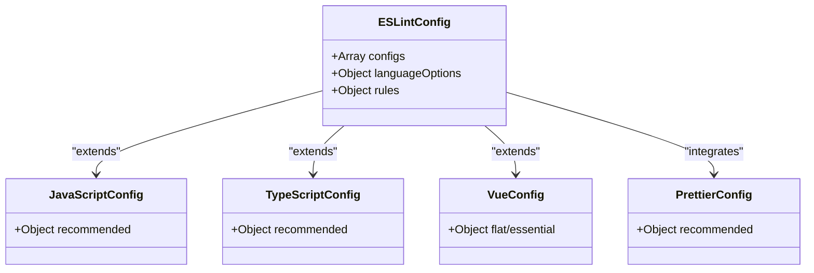
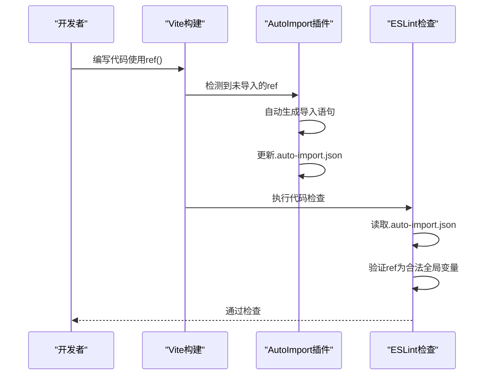
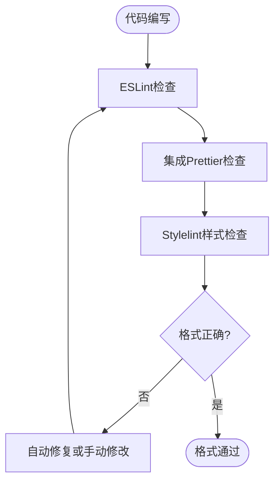
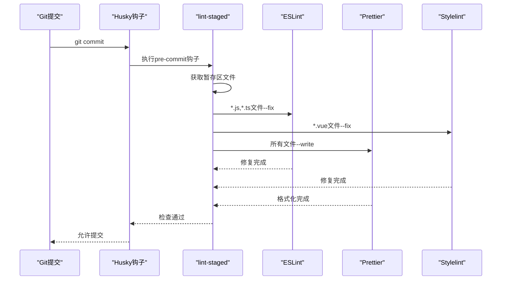
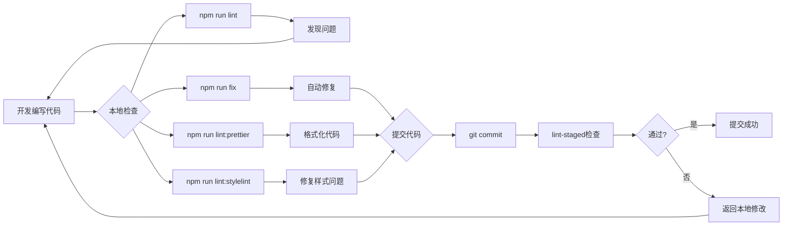
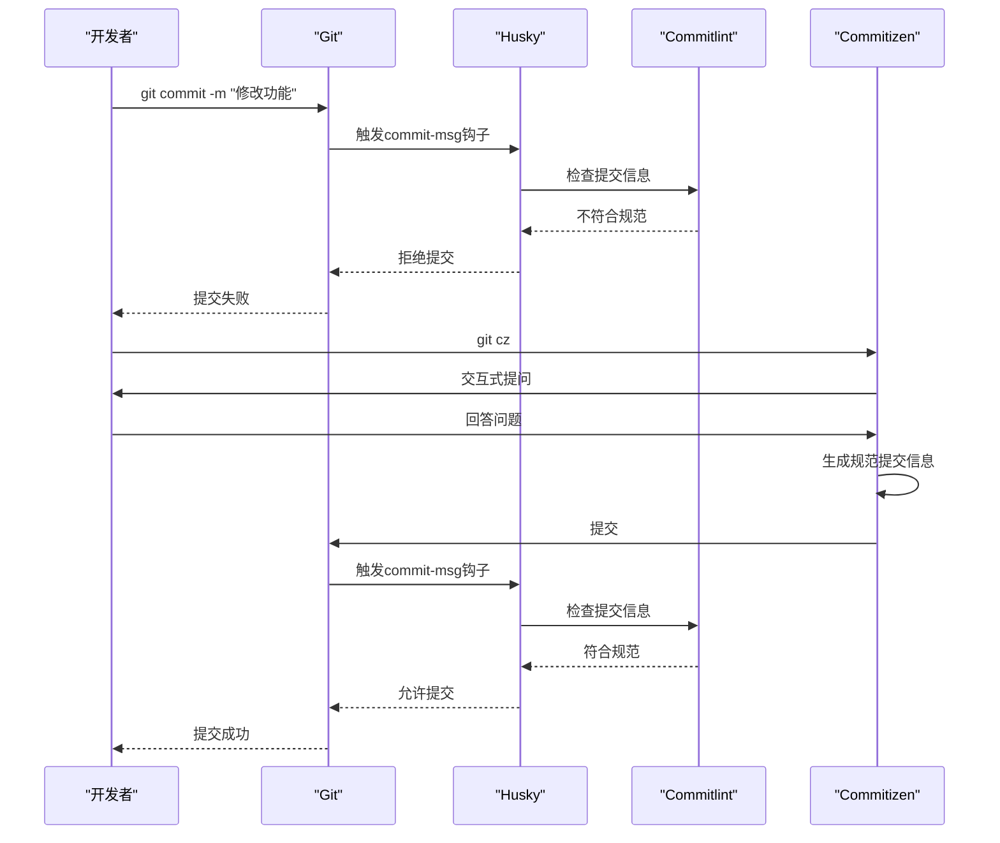

# 代码规范

<cite>
**本文档中引用的文件**  
- [eslint.config.mjs](file://eslint.config.mjs)
- [.auto-import.json](file://.auto-import.json)
- [vite.config.ts](file://vite.config.ts)
- [package.json](file://package.json)
- [tsconfig.json](file://tsconfig.json)
</cite>

## 目录
1. [ESLint配置详解](#eslint配置详解)
2. [自动导入与全局变量同步](#自动导入与全局变量同步)
3. [Prettier与Stylelint集成](#prettier与stylelint集成)
4. [Git提交前检查流程](#git提交前检查流程)
5. [代码质量保障工作流](#代码质量保障工作流)
6. [提交规范与Husky集成](#提交规范与husky集成)

## ESLint配置详解

本项目通过`eslint.config.mjs`文件定义了全面的代码质量检查规则。该配置采用ESLint的新Flat Config格式，提供了模块化和灵活的配置方式。

配置首先通过导入`@eslint/js`、`typescript-eslint`和`eslint-plugin-vue`等插件的推荐规则集，为JavaScript、TypeScript和Vue项目建立了基础的代码检查标准。这些推荐配置涵盖了语法正确性、潜在错误检测和最佳实践。

在环境配置方面，项目同时启用了浏览器和Node.js的全局变量支持，通过`globals.browser`和`globals.node`的合并，确保在不同运行环境中都能正确识别全局对象。

**图表来源**
- [eslint.config.mjs](file://eslint.config.mjs#L7-L39)

**章节来源**
- [eslint.config.mjs](file://eslint.config.mjs#L1-L84)

## 自动导入与全局变量同步

项目通过`unplugin-auto-import`插件实现了自动导入功能，并与ESLint配置无缝集成。在`vite.config.ts`中，`AutoImport`插件配置了Vue、Vue Router、Pinia和VueUse等核心库的自动导入，大大提升了开发效率。

关键的集成点在于`.auto-import.json`文件的生成和使用。当`AutoImport`插件的`eslintrc.enabled`设置为`true`时，插件会自动生成`.auto-import.json`文件，其中包含了所有自动导入的全局变量。ESLint配置通过读取这个文件，将其中的全局变量同步到ESLint的全局变量列表中，避免了手动维护的繁琐和潜在错误。

这种机制确保了开发时的自动补全和代码检查的一致性，开发者可以自由使用自动导入的API而无需担心ESLint报错。

**图表来源**
- [vite.config.ts](file://vite.config.ts#L72-L80)
- [eslint.config.mjs](file://eslint.config.mjs#L17-L20)

**章节来源**
- [vite.config.ts](file://vite.config.ts#L70-L86)
- [eslint.config.mjs](file://eslint.config.mjs#L17-L20)

## Prettier与Stylelint集成

项目采用了Prettier进行代码格式化，并通过`eslint-plugin-prettier`将其集成到ESLint工作流中。这种集成方式确保了代码风格的一致性，避免了ESLint和Prettier之间的规则冲突。

在`eslint.config.mjs`中，通过引入`eslint-plugin-prettier/recommended`配置，将Prettier作为ESLint的一个规则执行。这意味着Prettier的格式化检查会作为ESLint检查的一部分，如果代码格式不符合Prettier规则，ESLint检查就会失败。

对于样式文件，项目使用Stylelint进行CSS/SCSS代码的检查。Stylelint配置了`stylelint-config-recommended-scss`和`stylelint-config-recess-order`等规则集，确保样式代码的规范性和可维护性。同时，`stylelint-config-recommended-vue`确保了Vue单文件组件中样式部分的质量。

**图表来源**
- [package.json](file://package.json#L15-L16)
- [eslint.config.mjs](file://eslint.config.mjs#L81-L82)

**章节来源**
- [package.json](file://package.json#L93-L107)
- [eslint.config.mjs](file://eslint.config.mjs#L81-L82)

## Git提交前检查流程

项目通过`lint-staged`和`husky`实现了Git提交前的自动化代码检查流程。`lint-staged`配置在`package.json`的`lint-staged`字段中，定义了不同文件类型的检查和格式化命令。

当开发者执行`git commit`时，`husky`触发的`pre-commit`钩子会调用`lint-staged`，`lint-staged`会获取暂存区中修改的文件，并根据文件类型执行相应的检查和格式化命令。例如，JavaScript/TypeScript文件会先通过ESLint修复，然后通过Prettier格式化；Vue文件会依次执行ESLint修复、Stylelint修复和Prettier格式化。

这种分阶段的检查流程确保了只有符合代码规范的代码才能被提交到版本库，有效维护了代码库的整体质量。

**图表来源**
- [package.json](file://package.json#L27-L52)
- [package.json](file://package.json#L18)

**章节来源**
- [package.json](file://package.json#L27-L52)

## 代码质量保障工作流

项目通过`package.json`中的脚本命令构建了完整的代码质量保障工作流。这些脚本为开发者提供了便捷的代码检查和修复工具。

`lint`脚本用于执行ESLint检查，发现代码中的潜在问题；`fix`脚本在`lint`的基础上添加`--fix`参数，自动修复大部分可修复的问题；`lint:prettier`脚本专门用于Prettier格式化，确保代码风格统一；`lint:stylelint`脚本用于样式文件的检查和修复。

这些脚本可以单独运行，也可以组合使用，为开发者提供了灵活的代码质量检查方式。结合`lint-staged`的Git钩子，形成了从本地开发到代码提交的完整质量保障闭环。

**图表来源**
- [package.json](file://package.json#L13-L17)

**章节来源**
- [package.json](file://package.json#L13-L17)

## 提交规范与Husky集成

项目通过`commitlint`和`husky`实现了提交信息的规范化。`husky`作为Git钩子管理工具，在`package.json`的`prepare`脚本中自动安装，确保团队成员在克隆项目后能自动配置Git钩子。

`commitlint`配置了`@commitlint/config-conventional`规则集，要求提交信息遵循约定式提交（Conventional Commits）规范。当开发者执行`git commit`时，`husky`触发的`commit-msg`钩子会调用`commitlint`检查提交信息是否符合规范。

这种机制确保了提交历史的清晰和可读性，便于生成变更日志和进行版本管理。结合`commitizen`提供的`git-cz`交互式提交工具，进一步降低了遵循提交规范的难度。

**图表来源**
- [package.json](file://package.json#L18-L19)
- [package.json](file://package.json#L83-L84)

**章节来源**
- [package.json](file://package.json#L18-L19)