# 开发工具

<cite>
**本文档中引用的文件**
- [vite.config.ts](file://vite.config.ts)
- [eslint.config.mjs](file://eslint.config.mjs)
- [package.json](file://package.json)
- [tsconfig.json](file://tsconfig.json)
- [scripts/clean-dev.ts](file://scripts/clean-dev.ts)
- [src/env.d.ts](file://src/env.d.ts)
- [src/types/config/index.ts](file://src/types/config/index.ts)
- [src/hooks/core/useAppMode.ts](file://src/hooks/core/useAppMode.ts)
</cite>

## 目录
1. [项目概述](#项目概述)
2. [开发工具链架构](#开发工具链架构)
3. [Vite 构建工具配置](#vite-构建工具配置)
4. [ESLint 代码质量检查](#eslint-代码质量检查)
5. [TypeScript 类型系统](#typescript-类型系统)
6. [npm/pnpm 脚本管理](#npmpnpm-脚本管理)
7. [环境变量管理系统](#环境变量管理系统)
8. [代码分割与性能优化](#代码分割与性能优化)
9. [开发环境配置](#开发环境配置)
10. [调试技巧与最佳实践](#调试技巧与最佳实践)
11. [故障排除指南](#故障排除指南)

## 项目概述

Art Design Pro 是一个基于 Vue 3 的现代化前端项目，采用最新的前端技术栈构建。项目集成了完整的开发工具链，包括 Vite 构建工具、ESLint 代码检查、TypeScript 类型系统和丰富的 npm 脚本，为开发者提供了高效、可靠的开发体验。

### 技术栈特点

- **构建工具**: Vite 7.x，提供快速的开发服务器和高效的生产构建
- **代码质量**: ESLint + Prettier，确保代码风格一致性和质量
- **类型系统**: TypeScript 5.6+，提供强大的类型安全保障
- **UI 框架**: Element Plus + TailwindCSS，灵活的主题定制能力
- **包管理**: pnpm，高效的依赖管理和缓存机制

## 开发工具链架构

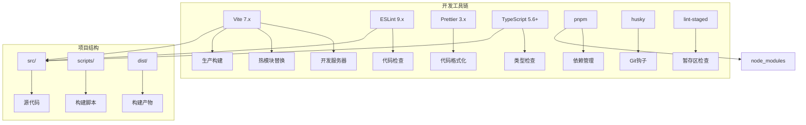

**图表来源**
- [vite.config.ts](file://vite.config.ts#L1-L157)
- [package.json](file://package.json#L1-L124)

## Vite 构建工具配置

### 核心配置架构

Vite 配置文件采用了模块化的架构设计，支持开发和生产环境的不同需求。

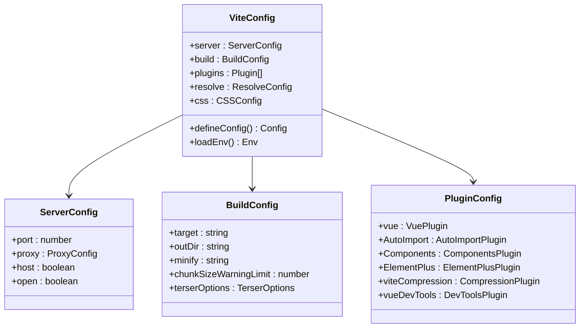

**图表来源**
- [vite.config.ts](file://vite.config.ts#L14-L157)

### 开发服务器配置

开发服务器提供了丰富的功能，包括端口配置、代理设置和热模块替换。

| 配置项 | 默认值 | 说明 |
|--------|--------|------|
| `port` | VITE_PORT | 开发服务器端口号 |
| `host` | true | 允许外部访问 |
| `proxy` | VITE_API_PROXY_URL | API 代理配置 |
| `open` | true | 自动打开浏览器 |

### 构建优化配置

生产环境构建经过精心优化，确保最佳的性能表现。

| 优化策略 | 实现方式 | 效果 |
|----------|----------|------|
| 代码压缩 | Terser 压缩器 | 移除 console 和 debugger |
| 代码分割 | 动态导入 | 按需加载组件 |
| 资源压缩 | Gzip 压缩 | 减少传输体积 |
| 缓存优化 | 文件指纹 | 长期缓存策略 |

### 插件生态系统

项目集成了多个高质量的插件，提供自动化的开发体验。

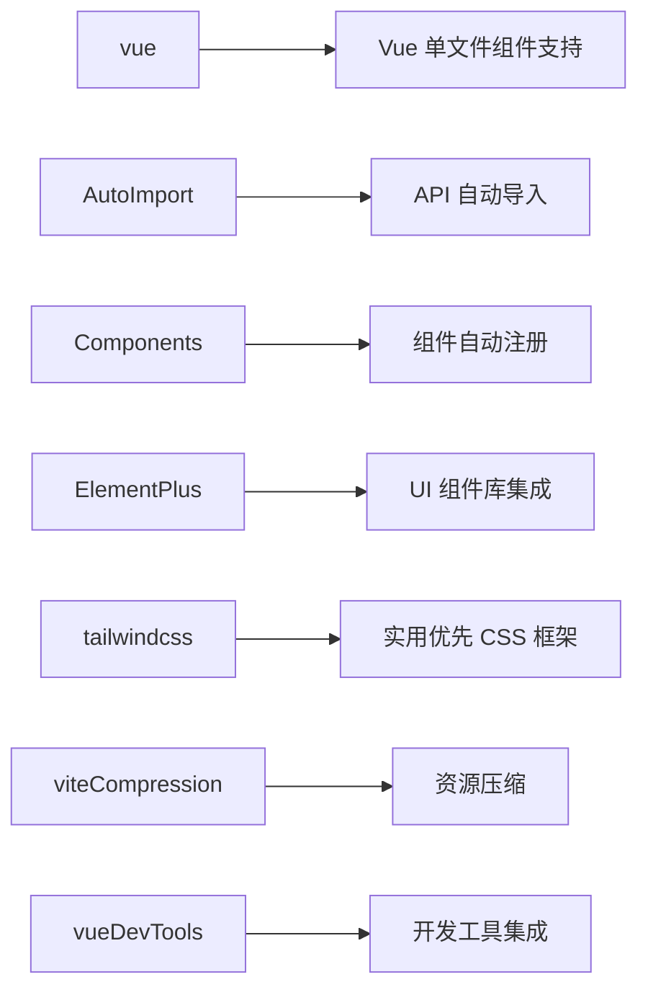

**图表来源**
- [vite.config.ts](file://vite.config.ts#L68-L107)

**章节来源**
- [vite.config.ts](file://vite.config.ts#L1-L157)

## ESLint 代码质量检查

### 配置架构设计

ESLint 配置采用了分层的设计模式，支持 JavaScript、TypeScript 和 Vue 文件的统一检查。

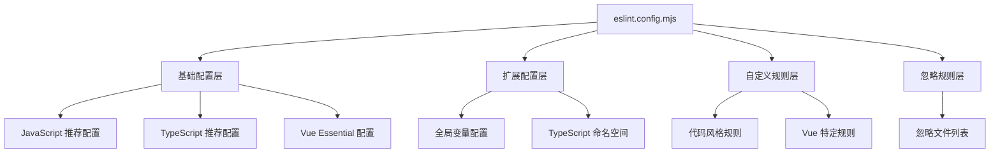

**图表来源**
- [eslint.config.mjs](file://eslint.config.mjs#L1-L84)

### 代码规范配置

项目制定了严格的代码规范，涵盖语法、风格和最佳实践。

| 规范类别 | 规则名称 | 配置值 | 说明 |
|----------|----------|--------|------|
| 引号使用 | quotes | single | 强制使用单引号 |
| 分号规范 | semi | never | 语句末尾不加分号 |
| 变量声明 | no-var | error | 要求使用 let 或 const |
| any 类型 | @typescript-eslint/no-explicit-any | off | 关闭 any 类型检查 |
| 组件命名 | vue/multi-word-component-names | off | 禁用多词组件名称要求 |
| 空行限制 | no-multiple-empty-lines | warn | 不允许多个空行 |
| 多行语法 | no-unexpected-multiline | error | 禁止意外的多行语法 |

### 自动导入配置

ESLint 与 AutoImport 插件深度集成，自动识别和导入全局变量。

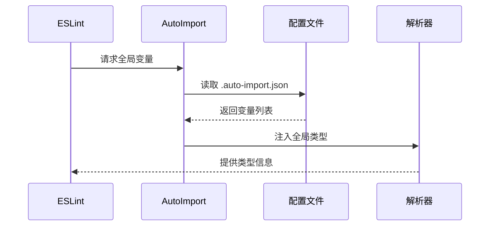

**图表来源**
- [eslint.config.mjs](file://eslint.config.mjs#L17-L20)
- [eslint.config.mjs](file://eslint.config.mjs#L47-L51)

**章节来源**
- [eslint.config.mjs](file://eslint.config.mjs#L1-L84)

## TypeScript 类型系统

### 类型配置架构

TypeScript 配置提供了完整的类型安全保障，支持现代 JavaScript 特性和 Vue 3 组件。

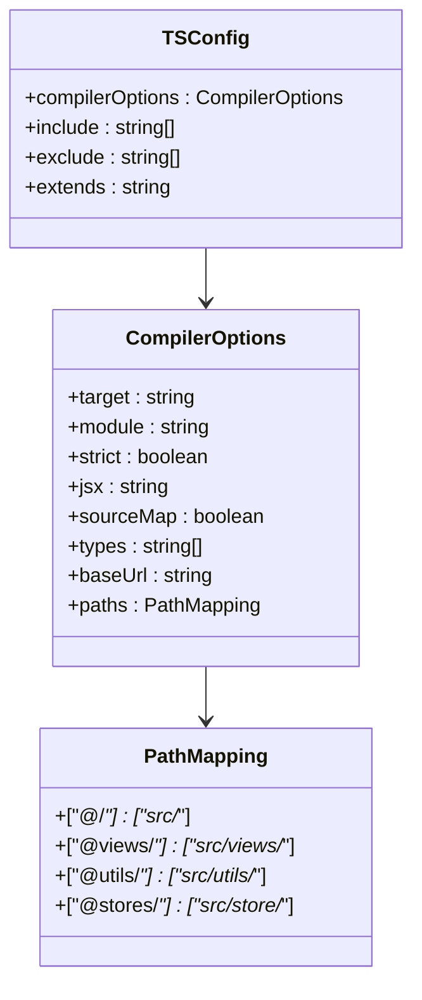

**图表来源**
- [tsconfig.json](file://tsconfig.json#L1-L29)

### 路径别名配置

项目使用了丰富的路径别名，简化了模块导入路径。

| 别名 | 实际路径 | 用途 |
|------|----------|------|
| `@/*` | `src/*` | 源代码根目录 |
| `@views/*` | `src/views/*` | 页面组件目录 |
| `@utils/*` | `src/utils/*` | 工具函数目录 |
| `@stores/*` | `src/store/*` | 状态管理目录 |
| `@styles/*` | `src/assets/styles/*` | 样式文件目录 |

### 类型声明文件

项目包含了专门的类型声明文件，提供完整的类型支持。

**章节来源**
- [tsconfig.json](file://tsconfig.json#L1-L29)
- [src/env.d.ts](file://src/env.d.ts#L1-L35)

## npm/pnpm 脚本管理

### 生命周期脚本

项目定义了完整的 npm 脚本集合，覆盖开发、构建、测试和部署的各个环节。

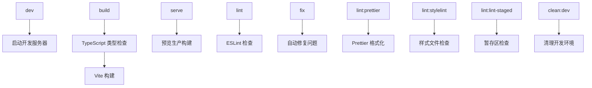

**图表来源**
- [package.json](file://package.json#L9-L20)

### 开发脚本详解

| 脚本名称 | 命令 | 功能描述 |
|----------|------|----------|
| `dev` | `vite --open` | 启动开发服务器并自动打开浏览器 |
| `build` | `vue-tsc --noEmit && vite build` | TypeScript 类型检查后进行生产构建 |
| `serve` | `vite preview` | 预览生产环境构建结果 |
| `lint` | `eslint` | 执行 ESLint 代码检查 |
| `fix` | `eslint --fix` | 自动修复可修复的代码问题 |
| `lint:prettier` | `prettier --write` | 格式化各种文件类型的代码 |
| `lint:stylelint` | `stylelint --fix` | 检查和修复样式文件 |
| `lint:lint-staged` | `lint-staged` | 在暂存区文件上执行检查 |
| `clean:dev` | `tsx scripts/clean-dev.ts` | 清理演示内容，准备开发环境 |

### Git 集成脚本

项目集成了 Git 工作流自动化工具。

| 工具 | 功能 | 配置位置 |
|------|------|----------|
| Husky | Git 钩子管理 | `.husky/` 目录 |
| lint-staged | 暂存区检查 | `lint-staged` 字段 |
| commitizen | 标准化提交消息 | `config.commitizen` |

**章节来源**
- [package.json](file://package.json#L1-L124)

## 环境变量管理系统

### 环境变量架构

项目采用 Vite 的环境变量系统，支持多种环境的配置管理。

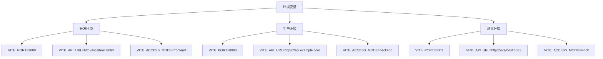

**图表来源**
- [vite.config.ts](file://vite.config.ts#L16-L17)
- [src/types/config/index.ts](file://src/types/config/index.ts#L150-L166)

### 核心环境变量

| 变量名 | 类型 | 默认值 | 说明 |
|--------|------|--------|------|
| `VITE_VERSION` | string | "0.0.0" | 应用版本号 |
| `VITE_PORT` | string | "3000" | 开发服务器端口 |
| `VITE_BASE_URL` | string | "/" | 应用基础路径 |
| `VITE_API_URL` | string | "" | API 基础地址 |
| `VITE_API_PROXY_URL` | string | "" | API 代理地址 |
| `VITE_ACCESS_MODE` | string | "frontend" | 访问模式（frontend/backend） |

### 应用模式管理

项目提供了智能的应用模式检测机制，支持前端和后端两种权限控制模式。

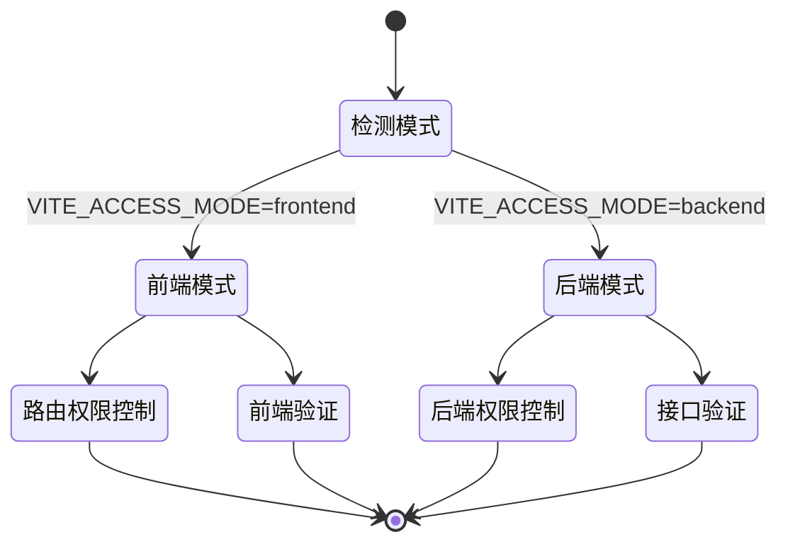

**图表来源**
- [src/hooks/core/useAppMode.ts](file://src/hooks/core/useAppMode.ts#L21-L44)

**章节来源**
- [src/types/config/index.ts](file://src/types/config/index.ts#L150-L166)
- [src/hooks/core/useAppMode.ts](file://src/hooks/core/useAppMode.ts#L1-L45)

## 代码分割与性能优化

### 动态导入策略

项目采用了智能的代码分割策略，优化应用的加载性能。

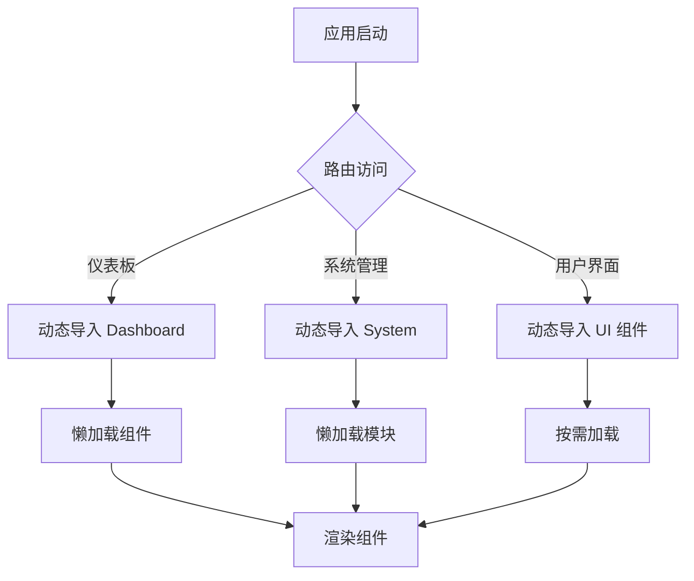

**图表来源**
- [vite.config.ts](file://vite.config.ts#L62-L66)

### 依赖预构建优化

项目配置了关键依赖的预构建，提升首次加载速度。

| 预构建模块 | 用途 | 优化效果 |
|------------|------|----------|
| echarts | 图表库 | 减少运行时加载时间 |
| xlsx | Excel 处理 | 提升数据导出性能 |
| xgplayer | 视频播放器 | 优化媒体播放体验 |
| crypto-js | 加密算法 | 安全性保障 |
| vue-img-cutter | 图片裁剪 | 图像处理功能 |

### 生产环境优化

生产构建包含了多项性能优化措施。

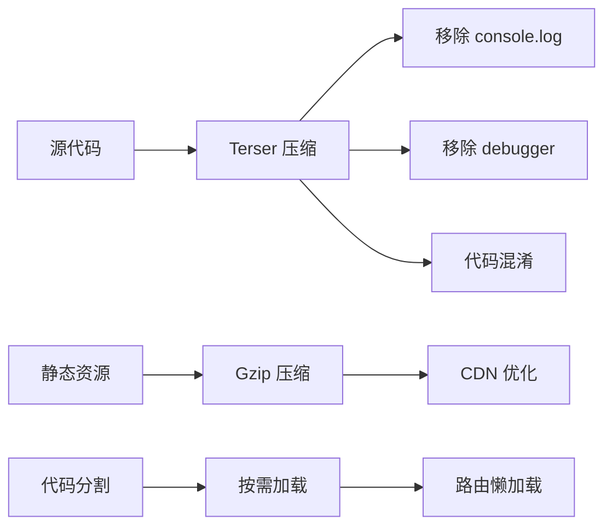

**图表来源**
- [vite.config.ts](file://vite.config.ts#L53-L61)
- [vite.config.ts](file://vite.config.ts#L91-L99)

**章节来源**
- [vite.config.ts](file://vite.config.ts#L49-L125)

## 开发环境配置

### IDE 配置建议

为了获得最佳的开发体验，建议使用以下 IDE 配置：

| IDE | 插件推荐 | 配置要点 |
|-----|----------|----------|
| VS Code | Vue Language Features (Volar) | 启用 Volar 插件，禁用 Vetur |
| VS Code | ESLint | 自动修复功能，实时检查 |
| VS Code | Prettier | 格式化快捷键配置 |
| WebStorm | 内置支持 | TypeScript、Vue、SCSS 支持 |

### 开发工具集成

项目集成了多种开发工具，提供完整的开发体验。

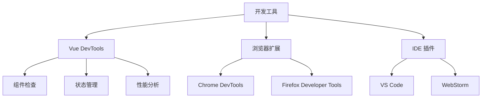

**图表来源**
- [vite.config.ts](file://vite.config.ts#L100)

### 调试配置

项目提供了多种调试选项和工具。

| 调试工具 | 功能 | 使用场景 |
|----------|------|----------|
| Vue DevTools | 组件调试 | 组件状态和生命周期 |
| Chrome DevTools | 性能分析 | 性能瓶颈定位 |
| VS Code Debugger | 断点调试 | 代码逻辑跟踪 |
| Network Monitor | 网络调试 | API 请求监控 |

**章节来源**
- [vite.config.ts](file://vite.config.ts#L100)

## 调试技巧与最佳实践

### 开发调试流程

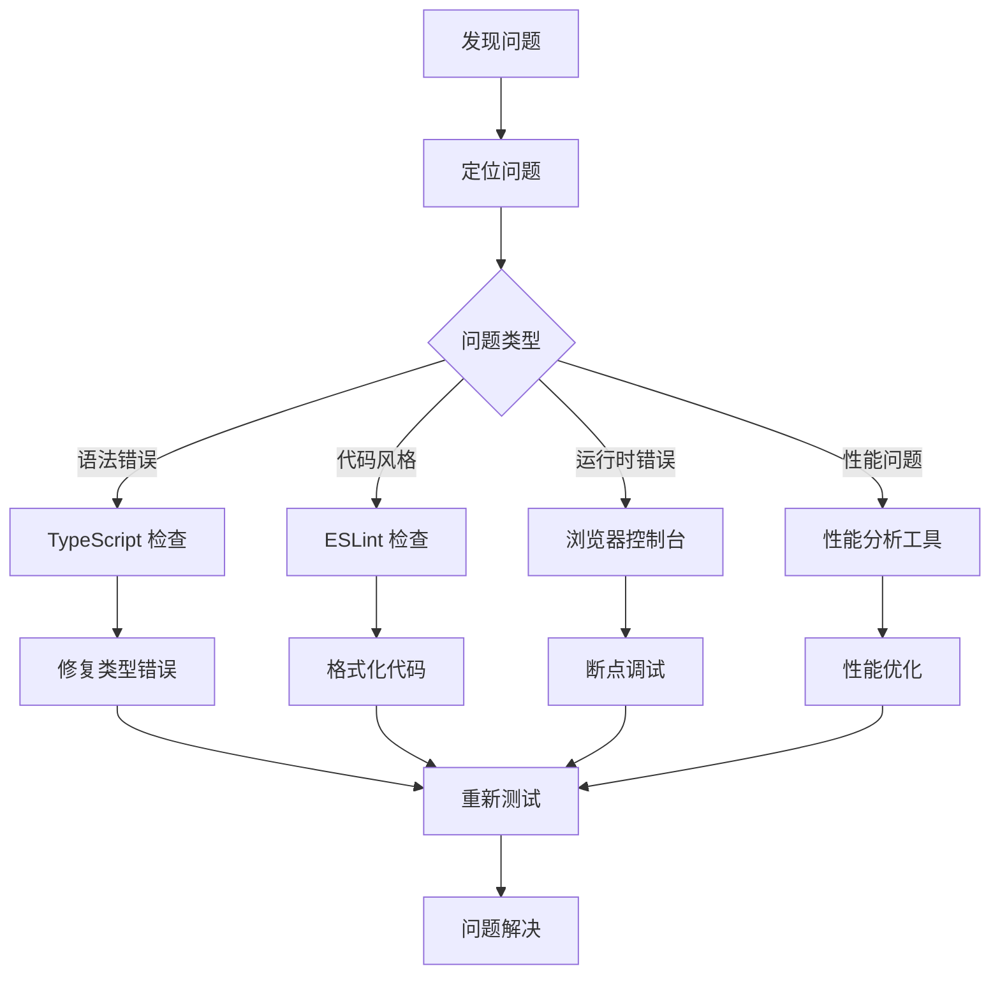

### 常见调试场景

| 场景 | 调试方法 | 工具推荐 |
|------|----------|----------|
| 组件状态异常 | Vue DevTools | 组件树检查 |
| API 请求失败 | Network 面板 | 请求响应分析 |
| 性能问题 | Performance 面板 | 加载时间分析 |
| 样式问题 | Elements 面板 | CSS 属性检查 |
| 路由问题 | Vue DevTools | 路由状态检查 |

### 开发效率提升

项目提供了专门的开发环境清理脚本，帮助开发者快速切换到干净的开发环境。

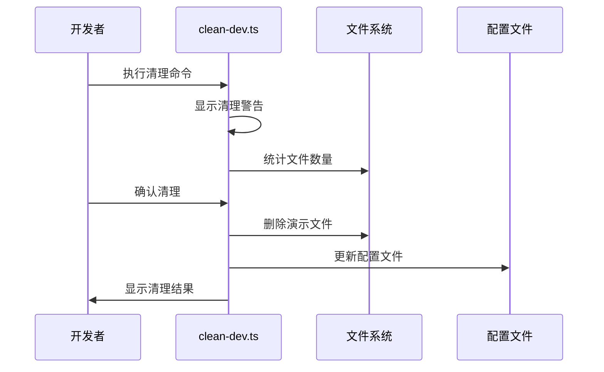

**图表来源**
- [scripts/clean-dev.ts](file://scripts/clean-dev.ts#L1-L839)

**章节来源**
- [scripts/clean-dev.ts](file://scripts/clean-dev.ts#L1-L839)

## 故障排除指南

### 常见问题解决方案

| 问题类型 | 症状 | 解决方案 |
|----------|------|----------|
| 依赖安装失败 | pnpm install 报错 | 检查 Node.js 版本，使用 pnpm install --frozen-lockfile |
| 开发服务器启动失败 | 端口被占用 | 修改 VITE_PORT 或终止占用端口的进程 |
| TypeScript 类型错误 | 构建时报类型错误 | 运行 `npm run fix` 自动修复或手动修改 |
| ESLint 检查失败 | 代码检查报错 | 使用 `npm run lint:prettier` 格式化代码 |
| 热更新失效 | 修改代码后不刷新 | 检查文件监听权限，重启开发服务器 |

### 性能问题诊断

当遇到性能问题时，可以按照以下步骤进行诊断：

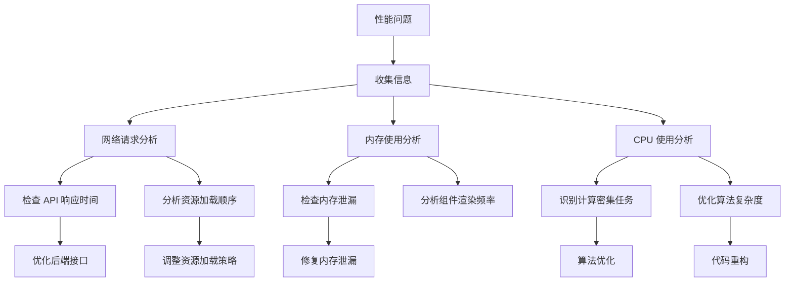

### 环境配置检查清单

在遇到环境相关问题时，可以参考以下检查清单：

| 检查项目 | 检查方法 | 注意事项 |
|----------|----------|----------|
| Node.js 版本 | `node --version` | 确保 >= 20.19.0 |
| pnpm 版本 | `pnpm --version` | 确保 >= 8.8.0 |
| 环境变量 | 检查 .env 文件 | 确保所有必需变量已设置 |
| 依赖完整性 | `pnpm list` | 检查是否有缺失的依赖 |
| TypeScript 配置 | `npx tsc --noEmit` | 确保类型检查通过 |

**章节来源**
- [package.json](file://package.json#L5-L8)