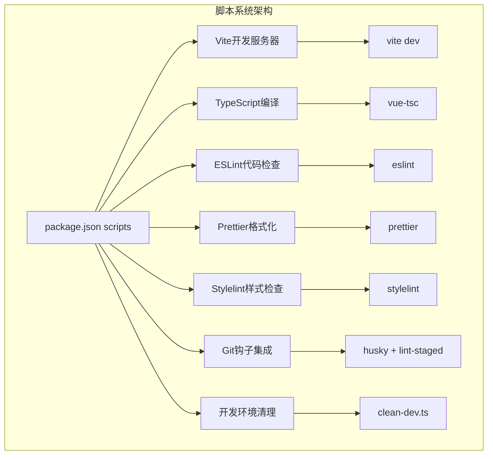
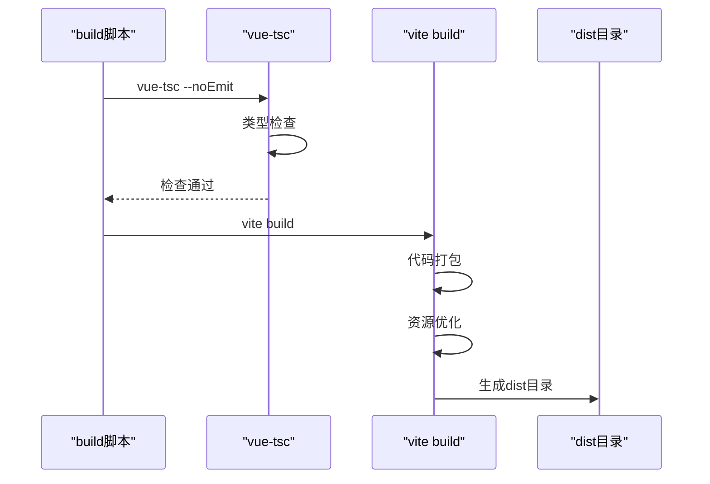
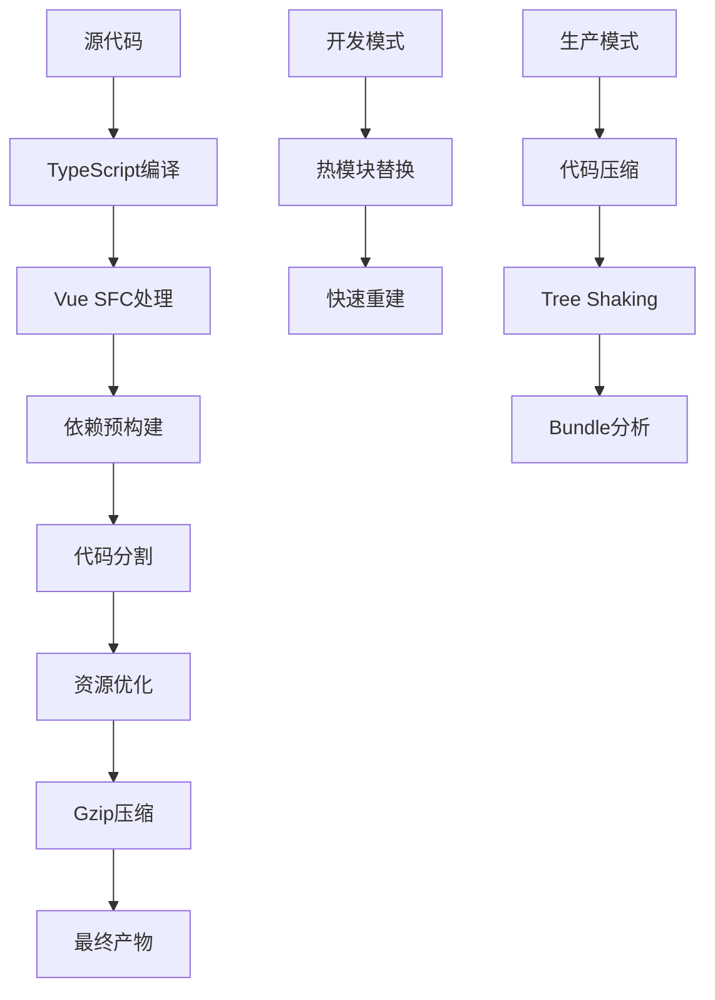
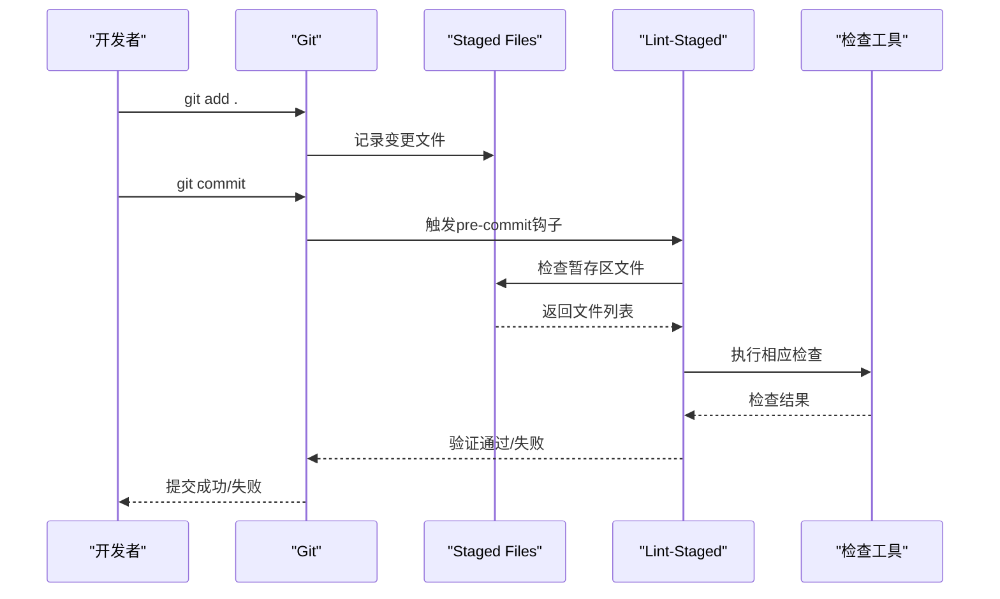

# 开发脚本

<cite>
**本文档中引用的文件**
- [package.json](file://package.json)
- [scripts/clean-dev.ts](file://scripts/clean-dev.ts)
- [vite.config.ts](file://vite.config.ts)
- [eslint.config.mjs](file://eslint.config.mjs)
- [tsconfig.json](file://tsconfig.json)
- [commitlint.config.cjs](file://commitlint.config.cjs)
</cite>

## 目录
1. [简介](#简介)
2. [项目结构概述](#项目结构概述)
3. [核心开发脚本](#核心开发脚本)
4. [构建系统详解](#构建系统详解)
5. [代码质量检查系统](#代码质量检查系统)
6. [Git工作流程集成](#git工作流程集成)
7. [开发环境清理工具](#开发环境清理工具)
8. [最佳实践建议](#最佳实践建议)
9. [故障排除指南](#故障排除指南)
10. [总结](#总结)

## 简介

本文档详细介绍了ART Design Pro项目的开发脚本系统，涵盖了从开发服务器启动到生产构建、代码质量检查、Git提交流程等完整的开发工作流。该项目采用现代化的前端技术栈，基于Vue 3、TypeScript、Vite构建，提供了丰富的开发工具链支持。

## 项目结构概述

项目采用模块化的脚本组织方式，主要包含以下核心组件：



**图表来源**
- [package.json](file://package.json#L9-L20)
- [vite.config.ts](file://vite.config.ts#L1-L157)

## 核心开发脚本

### 开发服务器启动 (dev)

开发服务器脚本提供了快速启动开发环境的能力：

```bash
npm run dev
```

**功能特性：**
- 基于Vite的热模块替换(HMR)
- 自动打开浏览器窗口
- 支持TypeScript类型检查
- 内置开发工具集成

**技术实现：**
- 使用`vite --open`命令启动开发服务器
- 自动检测并应用`.env`环境变量
- 集成Vue DevTools扩展

**使用场景：**
- 日常开发调试
- 组件开发测试
- 快速原型验证

### 生产构建 (build)

生产构建脚本负责将开发代码转换为生产就绪的应用：

```bash
npm run build
```

**协同工作机制：**



**图表来源**
- [package.json](file://package.json#L10-L11)
- [vite.config.ts](file://vite.config.ts#L49-L67)

**构建优化特性：**
- ES2015目标兼容性
- Terser代码压缩
- 动态导入优化
- Gzip压缩支持
- 代码分割策略

### 预览构建结果 (serve)

用于本地预览生产构建结果：

```bash
npm run serve
```

**功能特点：**
- 启动静态文件服务器
- 模拟生产环境行为
- 支持构建产物验证

### 代码检查 (lint)

全局代码质量检查：

```bash
npm run lint
```

**检查范围：**
- JavaScript/TypeScript文件
- Vue单文件组件
- 配置文件检查

### 自动修复 (fix)

自动修复可修复的代码问题：

```bash
npm run fix
```

**修复能力：**
- 语法错误修复
- 代码风格统一
- 部分类型错误修复

### 格式化 (lint:prettier)

专门的代码格式化任务：

```bash
npm run lint:prettier
```

**支持的文件类型：**
- JavaScript/TypeScript文件
- JSON配置文件
- Vue单文件组件
- CSS/SCSS样式文件
- HTML模板文件
- Markdown文档

### 样式检查 (lint:stylelint)

CSS/SCSS样式规范检查：

```bash
npm run lint:stylelint
```

**检查规则：**
- 标准CSS规范
- SCSS语法正确性
- 样式一致性检查
- 响应式设计规范

**节来源**
- [package.json](file://package.json#L12-L16)

## 构建系统详解

### Vue Type Checker (vue-tsc) 集成

项目采用`vue-tsc`作为TypeScript类型检查器，与Vite构建系统深度集成：

**类型检查流程：**
1. **预构建检查**：在实际构建前进行类型验证
2. **增量检查**：仅检查变更的文件
3. **错误报告**：提供详细的类型错误信息
4. **IDE集成**：支持开发环境实时类型提示

**配置特点：**
- `--noEmit`参数：仅检查类型，不生成输出文件
- 与Vite构建无缝衔接
- 支持Vue单文件组件类型检查

### Vite构建优化

Vite构建系统提供了多项优化特性：



**图表来源**
- [vite.config.ts](file://vite.config.ts#L49-L67)

**性能优化策略：**
- **动态导入优化**：智能代码分割
- **依赖预构建**：减少运行时开销
- **压缩策略**：多种压缩算法支持
- **缓存机制**：增量构建支持

**节来源**
- [vite.config.ts](file://vite.config.ts#L1-L157)
- [tsconfig.json](file://tsconfig.json#L1-L29)

## 代码质量检查系统

### ESLint配置体系

项目采用现代化的ESLint配置，支持多种文件类型的代码检查：

**配置层次结构：**
1. **基础配置**：JavaScript/TypeScript通用规则
2. **Vue插件**：Vue单文件组件特定规则
3. **TypeScript插件**：TypeScript类型相关规则
4. **Prettier集成**：代码格式化统一

**核心规则配置：**

| 规则类别 | 具体规则 | 作用 |
|---------|---------|------|
| 语法规范 | `quotes: ['single']` | 强制使用单引号 |
| 语法规则 | `semi: ['never']` | 禁用语句末尾分号 |
| 变量声明 | `no-var: 'error'` | 要求使用let/const |
| 类型检查 | `@typescript-eslint/no-explicit-any: 'off'` | 关闭any类型限制 |
| Vue组件 | `vue/multi-word-component-names: 'off'` | 禁用多词组件名检查 |

### Prettier格式化配置

统一的代码格式化标准：

**格式化规则：**
- 单引号字符串
- 行尾无分号
- 2空格缩进
- 最大行宽80字符
- 尾随逗号

### Stylelint样式检查

专门的CSS/SCSS检查系统：

**检查范围：**
- CSS语法正确性
- SCSS语法规范
- 样式命名约定
- 响应式设计规范

**节来源**
- [eslint.config.mjs](file://eslint.config.mjs#L1-L84)

## Git工作流程集成

### Husky Git钩子系统

项目集成了Husky来管理Git钩子，确保代码质量在提交前得到验证：

**钩子配置：**
- `prepare`钩子：初始化Husky
- `commit`钩子：集成Commitizen
- `pre-commit`钩子：自动化代码检查

### Commitizen集成

提供标准化的Git提交流程：

**提交类型支持：**
- `feat`: 新功能开发
- `fix`: 缺陷修复
- `docs`: 文档变更
- `style`: 代码格式调整
- `refactor`: 代码重构
- `perf`: 性能优化
- `test`: 测试相关
- `build`: 构建配置
- `ci`: 持续集成
- `revert`: 回滚提交
- `chore`: 辅助工具变更

### Lint-Staged自动化检查

提交时的自动化代码检查流程：



**图表来源**
- [package.json](file://package.json#L27-L52)

**文件类型对应规则：**

| 文件类型 | 检查工具 | 操作 |
|---------|---------|------|
| `*.{js,ts,mjs,mts,tsx}` | ESLint + Prettier | 修复 + 格式化 |
| `*.{cjs,json,jsonc}` | Prettier | 格式化 |
| `*.vue` | ESLint + Stylelint + Prettier | 多工具检查 |
| `*.{html,htm}` | Prettier | 格式化 |
| `*.{scss,css,less}` | Stylelint + Prettier | 样式检查 + 格式化 |
| `*.{md,mdx}` | Prettier | 格式化 |
| `*.{yaml,yml}` | Prettier | 格式化 |

### Commitlint规范验证

严格的提交信息规范：

**验证规则：**
- 提交类型必须符合预定义列表
- Subject部分大小写不强制
- 支持AI辅助生成提交信息
- 自定义提交模板

**节来源**
- [package.json](file://package.json#L17-L19)
- [commitlint.config.cjs](file://commitlint.config.cjs#L1-L98)

## 开发环境清理工具

### Clean-Dev脚本功能

项目提供了专门的开发环境清理工具，用于移除演示内容，快速切换到开发模式：

```bash
npm run clean:dev
```

**清理范围：**

```mermaid
mindmap
root((清理目标))
演示页面
widgets
template
article
examples
safeguard
路由模块
dashboard.ts
system.ts
index.ts
Mock数据
JSON文件
临时数据
资源文件
图片资源
3D模型
运维图片
组件库
地图组件
评论组件
多语言文件
中文语言包
英文语言包
快速入口
分析页
礼花效果
聊天功能
```

**图表来源**
- [scripts/clean-dev.ts](file://scripts/clean-dev.ts#L153-L176)

### 清理流程设计

**清理步骤：**
1. **统计阶段**：计算待清理文件总数
2. **确认阶段**：用户确认清理操作
3. **执行阶段**：批量删除演示内容
4. **重构阶段**：重写核心路由模块
5. **验证阶段**：检查清理结果

**安全保障：**
- 操作不可逆，提供确认机制
- 详细的统计信息
- 错误处理和回滚能力

### 核心模块重构

**路由模块清理：**
- 移除演示路由模块
- 保留核心功能模块（dashboard、system、result、exception）
- 重写路由配置文件

**语言文件清理：**
- 移除演示菜单项
- 保留核心导航结构
- 保持国际化功能

**组件库优化：**
- 移除演示专用组件
- 保留核心业务组件
- 保持组件库完整性

**节来源**
- [scripts/clean-dev.ts](file://scripts/clean-dev.ts#L1-L839)

## 最佳实践建议

### 开发工作流程

**日常开发建议：**
1. **启动开发服务器**：使用`npm run dev`快速启动
2. **代码质量保证**：定期运行`npm run lint`和`npm run fix`
3. **提交前检查**：确保`lint-staged`检查通过
4. **构建验证**：使用`npm run build`验证生产构建

**团队协作规范：**
1. **提交规范**：使用`npm run commit`遵循提交规范
2. **代码审查**：配合ESLint和Stylelint进行代码审查
3. **分支管理**：建立清晰的分支命名和合并策略
4. **版本控制**：合理使用Git标签和变更日志

### 性能优化建议

**开发阶段优化：**
- 利用Vite的热模块替换提高开发效率
- 合理配置TypeScript编译选项
- 使用适当的构建优化策略

**生产环境优化：**
- 启用代码压缩和混淆
- 配置合适的缓存策略
- 优化资源加载顺序

### 工具链维护

**定期维护任务：**
1. **依赖更新**：定期更新项目依赖
2. **配置同步**：保持开发工具配置一致
3. **性能监控**：监控构建时间和包大小
4. **错误追踪**：及时处理类型检查和构建错误

## 故障排除指南

### 常见问题解决

**开发服务器问题：**
- **端口冲突**：修改`VITE_PORT`环境变量
- **依赖缺失**：运行`npm install`重新安装
- **类型错误**：检查TypeScript配置和依赖版本

**构建失败问题：**
- **类型检查失败**：修复TypeScript类型错误
- **内存不足**：增加Node.js内存限制
- **依赖冲突**：清理`node_modules`重新安装

**代码检查问题：**
- **ESLint错误**：运行`npm run fix`自动修复
- **Stylelint错误**：检查CSS语法和命名规范
- **Prettier格式化**：配置编辑器自动保存格式化

### 调试技巧

**开发调试：**
- 使用Vue DevTools进行组件调试
- 利用浏览器开发者工具
- 启用详细的错误堆栈信息

**构建调试：**
- 查看构建日志详细信息
- 使用Vite的调试模式
- 分析Bundle分析报告

## 总结

ART Design Pro项目提供了一套完整而强大的开发脚本系统，涵盖了从前端开发到生产部署的全流程。通过合理的脚本组织和工具集成，项目实现了：

**技术优势：**
- 现代化的开发工具链
- 自动化的代码质量保证
- 完善的Git工作流程
- 高效的构建优化策略

**开发体验：**
- 快速的开发响应速度
- 严格的代码规范约束
- 智能的错误提示和修复
- 清晰的工作流程指导

这套开发脚本系统不仅提高了开发效率，还确保了代码质量和项目的一致性，为团队协作和项目维护奠定了坚实的基础。通过持续的工具优化和流程改进，项目能够适应不断变化的技术需求和开发挑战。