# 开发服务器配置

<cite>
**本文档引用的文件**
- [vite.config.ts](file://vite.config.ts)
- [package.json](file://package.json)
- [src/utils/http/index.ts](file://src/utils/http/index.ts)
- [src/api/auth.ts](file://src/api/auth.ts)
- [src/api/system-manage.ts](file://src/api/system-manage.ts)
- [src/types/config/index.ts](file://src/types/config/index.ts)
- [src/config/setting.ts](file://src/config/setting.ts)
</cite>

## 目录
1. [简介](#简介)
2. [项目结构概览](#项目结构概览)
3. [核心配置文件分析](#核心配置文件分析)
4. [开发服务器架构](#开发服务器架构)
5. [详细配置项解析](#详细配置项解析)
6. [环境变量配置](#环境变量配置)
7. [代理配置详解](#代理配置详解)
8. [最佳实践指南](#最佳实践指南)
9. [常见问题解决方案](#常见问题解决方案)
10. [总结](#总结)

## 简介

本文档深入解析了基于Vite的前端项目开发服务器配置，重点说明了vite.config.ts中server对象的各项配置，包括端口设置、主机绑定、代理配置等核心功能。通过分析实际项目配置，为开发者提供完整的开发服务器配置指南。

## 项目结构概览

该项目采用现代化的Vue 3 + TypeScript + Vite技术栈，具有清晰的项目结构：

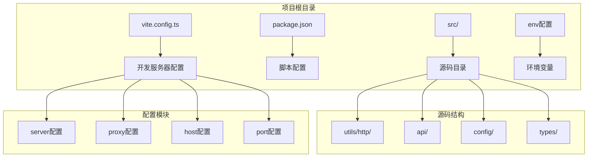
```mermaid
graph TB
subgraph "项目根目录"
A[vite.config.ts] --> B[开发服务器配置]
C[package.json] --> D[脚本配置]
E[src/] --> F[源码目录]
G[env配置] --> H[环境变量]
end
subgraph "源码结构"
F --> I[utils/http/]
F --> J[api/]
F --> K[config/]
F --> L[types/]
end
subgraph "配置模块"
B --> M[server配置]
B --> N[proxy配置]
B --> O[host配置]
B --> P[port配置]
end
```

**图表来源**
- [vite.config.ts](file://vite.config.ts#L14-L36)
- [package.json](file://package.json#L9-L12)

## 核心配置文件分析

### vite.config.ts 文件结构

项目的核心配置集中在vite.config.ts文件中，该文件采用了动态配置模式：

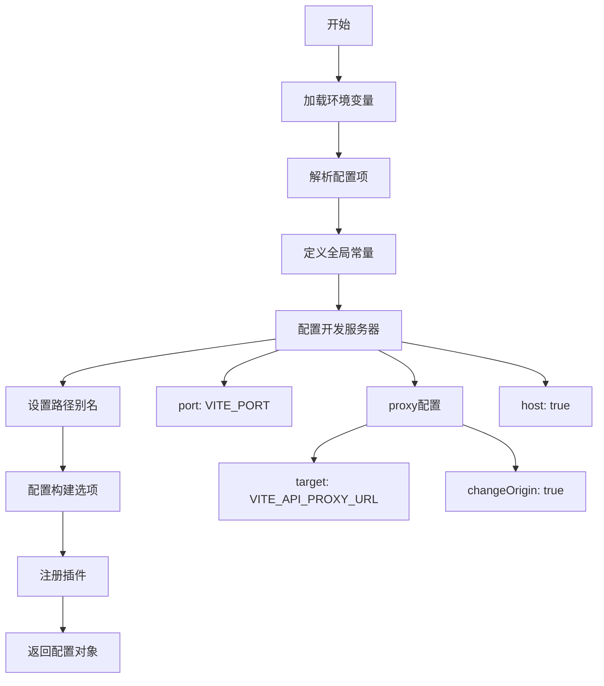
```mermaid
flowchart TD
A[开始] --> B[加载环境变量]
B --> C[解析配置项]
C --> D[定义全局常量]
D --> E[配置开发服务器]
E --> F[设置路径别名]
F --> G[配置构建选项]
G --> H[注册插件]
H --> I[返回配置对象]
E --> E1[port: VITE_PORT]
E --> E2[proxy配置]
E --> E3[host: true]
E2 --> E2a[target: VITE_API_PROXY_URL]
E2 --> E2b[changeOrigin: true]
```

**图表来源**
- [vite.config.ts](file://vite.config.ts#L14-L36)

**章节来源**
- [vite.config.ts](file://vite.config.ts#L14-L36)

## 开发服务器架构

### 服务器配置层次结构

开发服务器配置采用分层设计，确保配置的灵活性和可维护性：

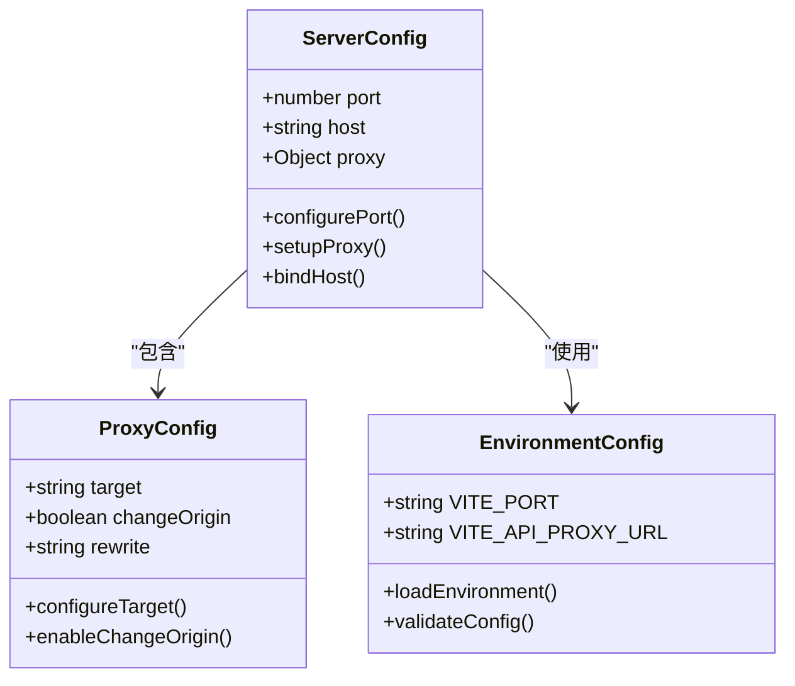
```mermaid
classDiagram
class ServerConfig {
+number port
+string host
+Object proxy
+configurePort()
+setupProxy()
+bindHost()
}
class ProxyConfig {
+string target
+boolean changeOrigin
+string rewrite
+configureTarget()
+enableChangeOrigin()
}
class EnvironmentConfig {
+string VITE_PORT
+string VITE_API_PROXY_URL
+loadEnvironment()
+validateConfig()
}
ServerConfig --> ProxyConfig : "包含"
ServerConfig --> EnvironmentConfig : "使用"
```

**图表来源**
- [vite.config.ts](file://vite.config.ts#L27-L36)
- [src/types/config/index.ts](file://src/types/config/index.ts#L150-L167)

## 详细配置项解析

### 端口配置 (port)

#### VITE_PORT 环境变量控制

项目通过环境变量VITE_PORT实现端口的灵活配置：

| 配置项 | 类型 | 默认值 | 描述 |
|--------|------|--------|------|
| VITE_PORT | string | 3000 | 开发服务器监听端口 |
| port | number | Number(VITE_PORT) | 实际使用的端口号 |

**配置特点：**
- 使用Number()转换确保类型正确
- 支持通过环境变量动态调整
- 默认值为3000，符合开发习惯

#### 端口配置流程

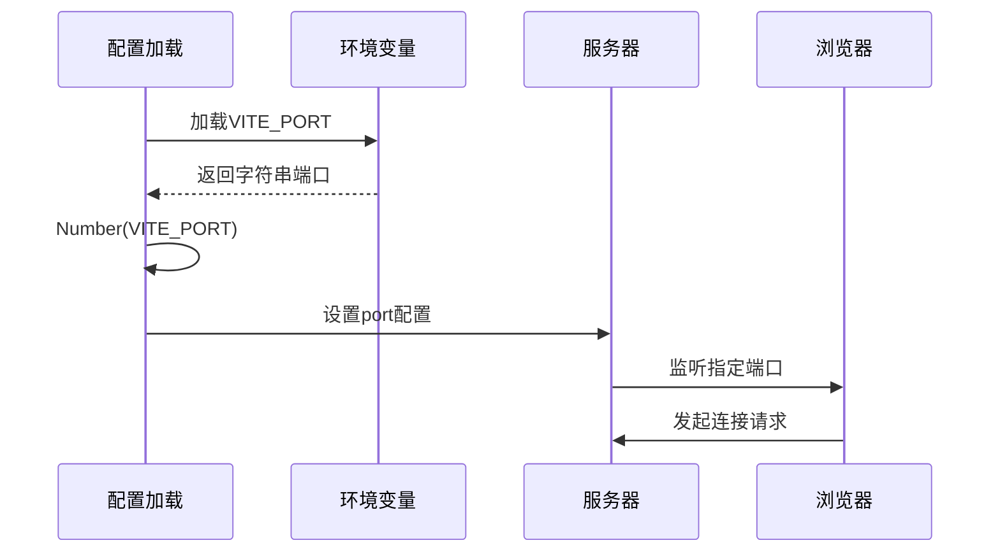
```mermaid
sequenceDiagram
participant Config as 配置加载
participant Env as 环境变量
participant Server as 服务器
participant Browser as 浏览器
Config->>Env : 加载VITE_PORT
Env-->>Config : 返回字符串端口
Config->>Config : Number(VITE_PORT)
Config->>Server : 设置port配置
Server->>Browser : 监听指定端口
Browser->>Server : 发起连接请求
```

**图表来源**
- [vite.config.ts](file://vite.config.ts#L27-L28)

**章节来源**
- [vite.config.ts](file://vite.config.ts#L16-L28)

### 主机绑定配置 (host)

#### host: true 的作用

主机绑定配置确保开发服务器能够被其他设备访问：

| 配置项 | 值 | 效果 |
|--------|-----|------|
| host | true | 监听所有网络接口 |
| host | '0.0.0.0' | 明确监听所有IPv4地址 |
| host | 'localhost' | 仅监听本地回环地址 |

**优势：**
- 支持多设备调试
- 方便移动端测试
- 便于团队协作开发

#### 主机配置决策树

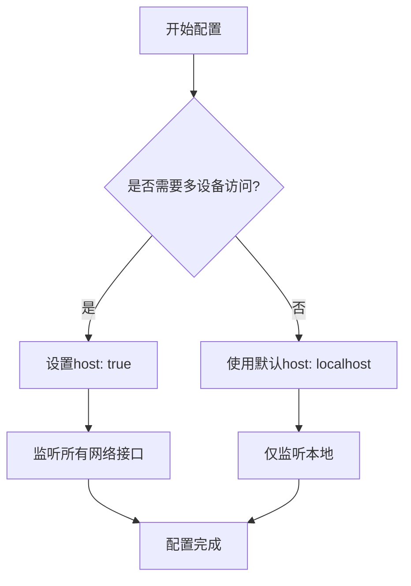
```mermaid
flowchart TD
A[开始配置] --> B{是否需要多设备访问?}
B --> |是| C[设置host: true]
B --> |否| D[使用默认host: localhost]
C --> E[监听所有网络接口]
D --> F[仅监听本地]
E --> G[配置完成]
F --> G
```

**图表来源**
- [vite.config.ts](file://vite.config.ts#L35)

**章节来源**
- [vite.config.ts](file://vite.config.ts#L35)

### 代理配置 (proxy)

#### /api 前缀代理

项目配置了专门的API代理规则，解决跨域问题：

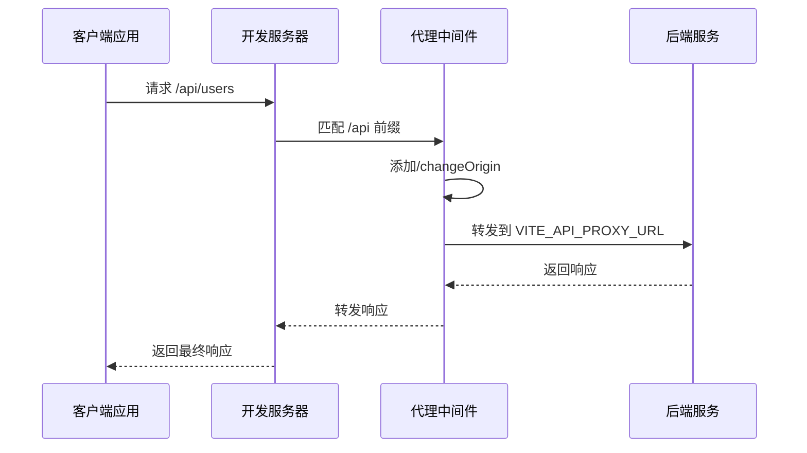
```mermaid
sequenceDiagram
participant Client as 客户端应用
participant DevServer as 开发服务器
participant Proxy as 代理中间件
participant Backend as 后端服务
Client->>DevServer : 请求 /api/users
DevServer->>Proxy : 匹配 /api 前缀
Proxy->>Proxy : 添加/changeOrigin
Proxy->>Backend : 转发到 VITE_API_PROXY_URL
Backend-->>Proxy : 返回响应
Proxy-->>DevServer : 转发响应
DevServer-->>Client : 返回最终响应
```

**图表来源**
- [vite.config.ts](file://vite.config.ts#L29-L33)
- [src/utils/http/index.ts](file://src/utils/http/index.ts#L45)

#### 代理配置详解

| 配置项 | 值 | 作用 |
|--------|-----|------|
| /api | Object | 匹配所有/api开头的请求 |
| target | VITE_API_PROXY_URL | 后端服务地址 |
| changeOrigin | true | 修改请求的origin头 |

**代理配置特点：**
- 自动添加changeOrigin，解决跨域问题
- 支持动态配置后端服务地址
- 透明转发，对前端代码无侵入

**章节来源**
- [vite.config.ts](file://vite.config.ts#L29-L33)

## 环境变量配置

### 环境变量类型定义

项目通过TypeScript提供了完整的环境变量类型定义：

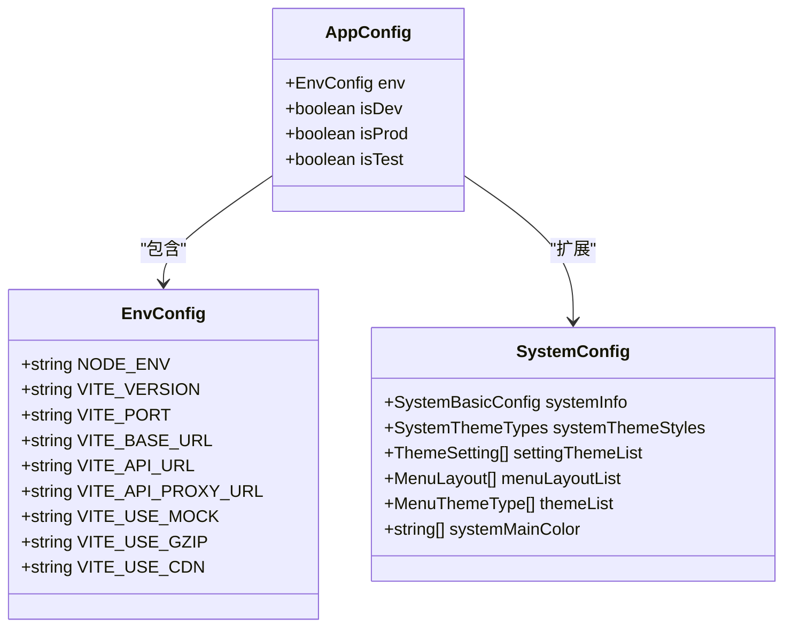
```mermaid
classDiagram
class EnvConfig {
+string NODE_ENV
+string VITE_VERSION
+string VITE_PORT
+string VITE_BASE_URL
+string VITE_API_URL
+string VITE_API_PROXY_URL
+string VITE_USE_MOCK
+string VITE_USE_GZIP
+string VITE_USE_CDN
}
class SystemConfig {
+SystemBasicConfig systemInfo
+SystemThemeTypes systemThemeStyles
+ThemeSetting[] settingThemeList
+MenuLayout[] menuLayoutList
+MenuThemeType[] themeList
+string[] systemMainColor
}
class AppConfig {
+EnvConfig env
+boolean isDev
+boolean isProd
+boolean isTest
}
AppConfig --> EnvConfig : "包含"
AppConfig --> SystemConfig : "扩展"
```

**图表来源**
- [src/types/config/index.ts](file://src/types/config/index.ts#L150-L167)

### 环境变量使用方式

#### 在代码中使用环境变量

项目中有多种方式使用环境变量：

| 使用方式 | 示例 | 用途 |
|----------|------|------|
| import.meta.env | import.meta.env.VITE_PORT | Vite内置环境变量 |
| loadEnv API | loadEnv(mode, root) | 动态加载环境变量 |
| 类型定义 | VITE_API_PROXY_URL | TypeScript类型安全 |

#### 环境变量加载流程

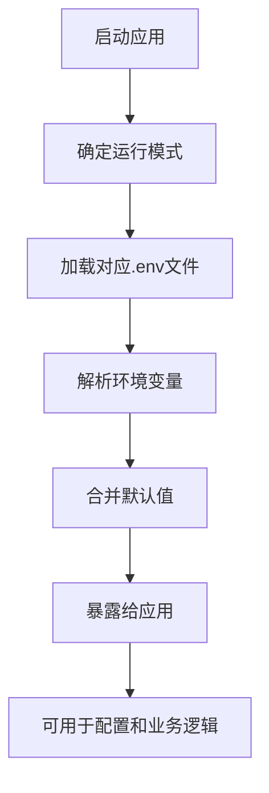
```mermaid
flowchart TD
A[启动应用] --> B[确定运行模式]
B --> C[加载对应.env文件]
C --> D[解析环境变量]
D --> E[合并默认值]
E --> F[暴露给应用]
F --> G[可用于配置和业务逻辑]
```

**图表来源**
- [vite.config.ts](file://vite.config.ts#L14-L20)

**章节来源**
- [vite.config.ts](file://vite.config.ts#L14-L20)
- [src/types/config/index.ts](file://src/types/config/index.ts#L150-L167)

## 代理配置详解

### HTTP客户端配置

项目中的HTTP客户端配置展示了代理的实际应用场景：

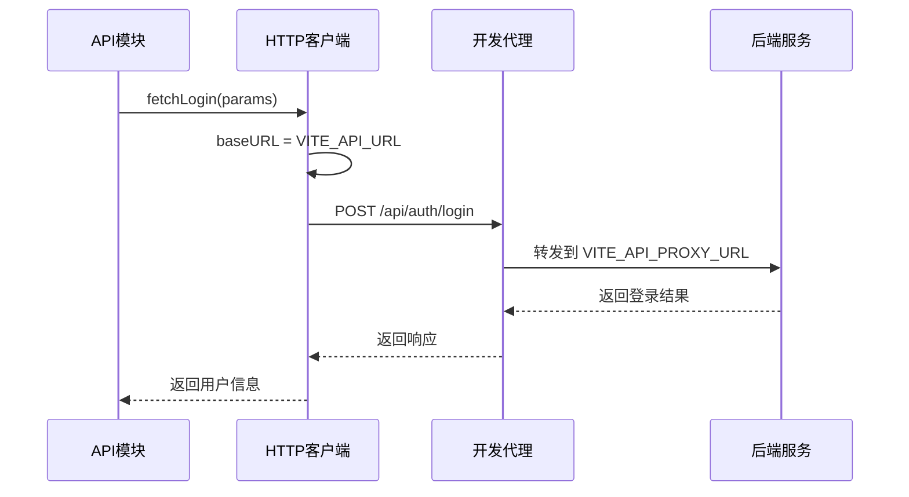
```mermaid
sequenceDiagram
participant API as API模块
participant HTTP as HTTP客户端
participant Proxy as 开发代理
participant Backend as 后端服务
API->>HTTP : fetchLogin(params)
HTTP->>HTTP : baseURL = VITE_API_URL
HTTP->>Proxy : POST /api/auth/login
Proxy->>Backend : 转发到 VITE_API_PROXY_URL
Backend-->>Proxy : 返回登录结果
Proxy-->>HTTP : 返回响应
HTTP-->>API : 返回用户信息
```

**图表来源**
- [src/api/auth.ts](file://src/api/auth.ts#L8-L14)
- [src/utils/http/index.ts](file://src/utils/http/index.ts#L45)

### 代理配置的实际应用

#### API调用示例

项目中的API调用展示了代理配置的实际效果：

| API路径 | 实际请求路径 | 说明 |
|---------|-------------|------|
| `/api/auth/login` | `VITE_API_PROXY_URL/api/auth/login` | 自动添加代理前缀 |
| `/api/user/info` | `VITE_API_PROXY_URL/api/user/info` | 用户信息获取 |
| `/api/user/list` | `VITE_API_PROXY_URL/api/user/list` | 用户列表查询 |

#### 代理配置的优势

```mermaid
mindmap
root((代理配置优势))
解决跨域问题
changeOrigin自动修改请求头
支持不同域名的API调用
开发便利性
统一的API入口
无需手动配置CORS
环境适配
开发环境代理
生产环境直接访问
调试友好
请求路径清晰
错误信息明确
```

**章节来源**
- [src/api/auth.ts](file://src/api/auth.ts#L8-L14)
- [src/api/system-manage.ts](file://src/api/system-manage.ts#L5-L8)
- [src/utils/http/index.ts](file://src/utils/http/index.ts#L45)

## 最佳实践指南

### 开发服务器配置最佳实践

#### 1. 端口配置策略

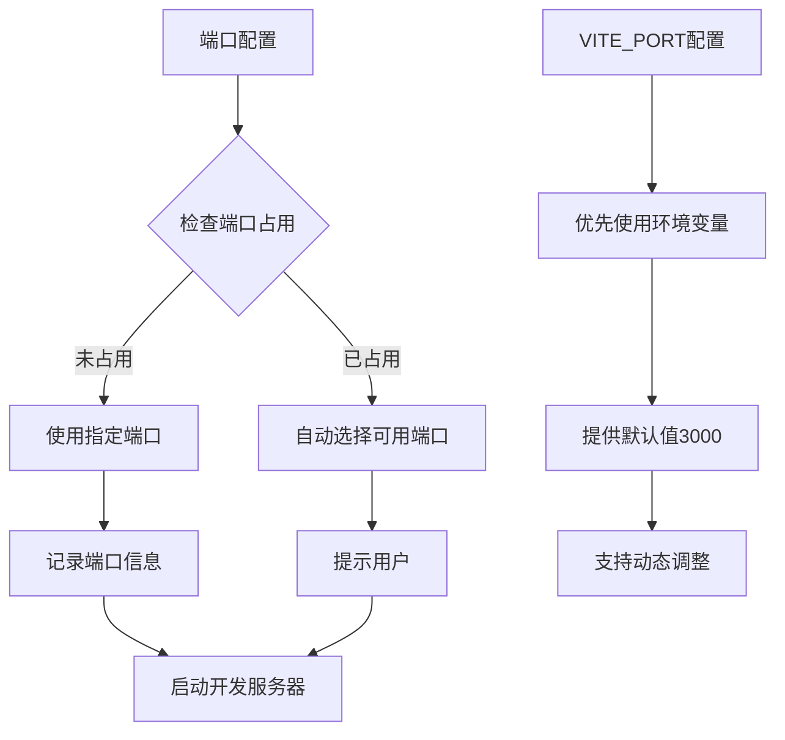
```mermaid
flowchart TD
A[端口配置] --> B{检查端口占用}
B --> |未占用| C[使用指定端口]
B --> |已占用| D[自动选择可用端口]
C --> E[记录端口信息]
D --> F[提示用户]
E --> G[启动开发服务器]
F --> G
H[VITE_PORT配置] --> I[优先使用环境变量]
I --> J[提供默认值3000]
J --> K[支持动态调整]
```

#### 2. 代理配置建议

| 配置项 | 推荐值 | 说明 |
|--------|--------|------|
| target | VITE_API_PROXY_URL | 使用环境变量动态配置 |
| changeOrigin | true | 必须启用以解决跨域 |
| rewrite | 根据后端API结构调整 | 确保路径正确映射 |

#### 3. 环境变量管理

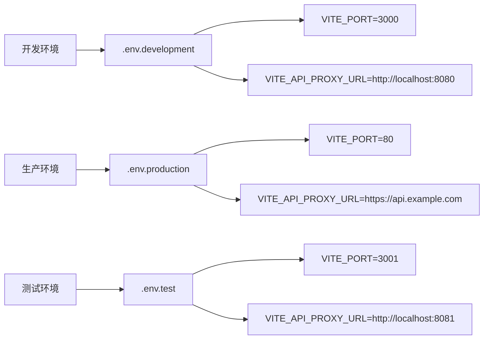
```mermaid
graph LR
A[开发环境] --> B[.env.development]
C[生产环境] --> D[.env.production]
E[测试环境] --> F[.env.test]
B --> G[VITE_PORT=3000]
B --> H[VITE_API_PROXY_URL=http://localhost:8080]
D --> I[VITE_PORT=80]
D --> J[VITE_API_PROXY_URL=https://api.example.com]
F --> K[VITE_PORT=3001]
F --> L[VITE_API_PROXY_URL=http://localhost:8081]
```

### 性能优化建议

#### 1. 服务器性能配置

| 配置项 | 优化建议 | 性能影响 |
|--------|----------|----------|
| host | 使用true或具体IP | 影响网络访问范围 |
| port | 避免使用低权限端口 | 防止权限问题 |
| proxy | 合理设置超时时间 | 避免请求阻塞 |

#### 2. 开发体验优化

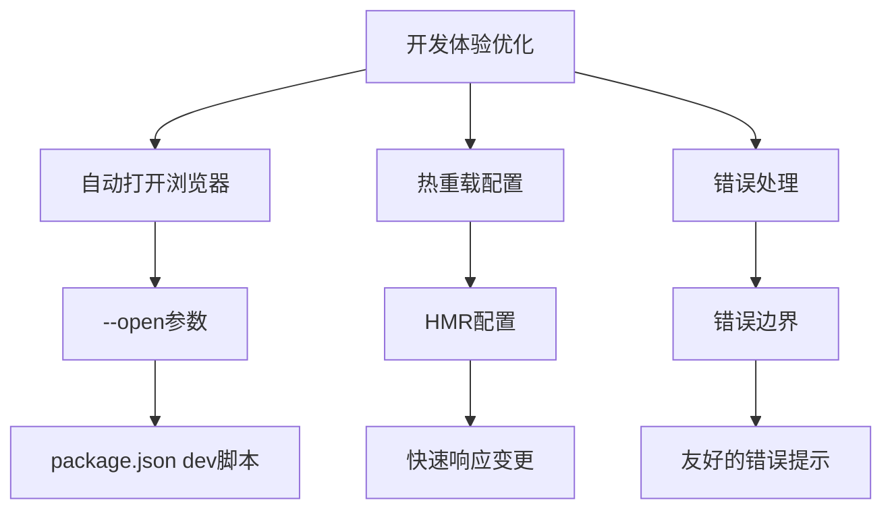
```mermaid
flowchart TD
A[开发体验优化] --> B[自动打开浏览器]
A --> C[热重载配置]
A --> D[错误处理]
B --> E[--open参数]
C --> F[HMR配置]
D --> G[错误边界]
E --> H[package.json dev脚本]
F --> I[快速响应变更]
G --> J[友好的错误提示]
```

**章节来源**
- [package.json](file://package.json#L10)

## 常见问题解决方案

### 1. 端口冲突问题

#### 问题描述
开发服务器无法启动，提示端口已被占用

#### 解决方案

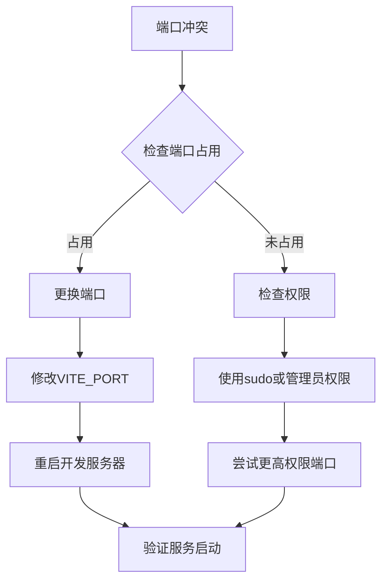
```mermaid
flowchart TD
A[端口冲突] --> B{检查端口占用}
B --> |占用| C[更换端口]
B --> |未占用| D[检查权限]
C --> E[修改VITE_PORT]
E --> F[重启开发服务器]
D --> G[使用sudo或管理员权限]
G --> H[尝试更高权限端口]
F --> I[验证服务启动]
H --> I
```

#### 配置步骤
1. 修改.env.development文件中的VITE_PORT
2. 或直接在package.json中修改端口
3. 重启开发服务器

### 2. 代理配置问题

#### 问题描述
API请求失败，出现跨域错误

#### 诊断流程

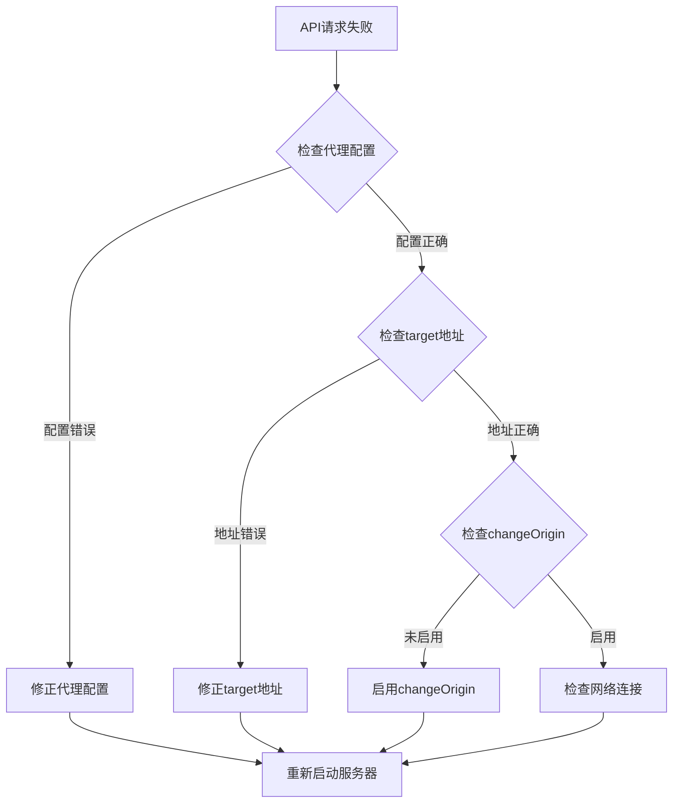
```mermaid
flowchart TD
A[API请求失败] --> B{检查代理配置}
B --> |配置正确| C{检查target地址}
B --> |配置错误| D[修正代理配置]
C --> |地址正确| E{检查changeOrigin}
C --> |地址错误| F[修正target地址]
E --> |启用| G[检查网络连接]
E --> |未启用| H[启用changeOrigin]
D --> I[重新启动服务器]
F --> I
H --> I
G --> I
```

#### 常见代理问题及解决方案

| 问题类型 | 症状 | 解决方案 |
|----------|------|----------|
| 跨域错误 | CORS policy denied | 确保changeOrigin: true |
| 404错误 | 路径找不到 | 检查代理rewrite规则 |
| 500错误 | 服务器内部错误 | 检查后端服务状态 |
| 连接超时 | 请求无响应 | 检查网络连接和防火墙 |

### 3. 环境变量问题

#### 问题描述
环境变量未生效或类型不匹配

#### 解决方案

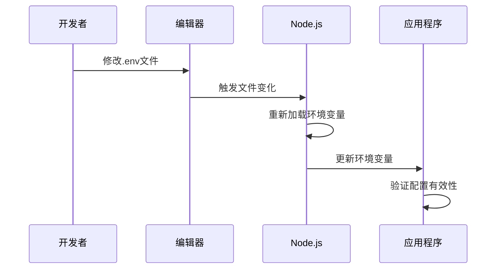
```mermaid
sequenceDiagram
participant Dev as 开发者
participant VSCode as 编辑器
participant Node as Node.js
participant App as 应用程序
Dev->>VSCode : 修改.env文件
VSCode->>Node : 触发文件变化
Node->>Node : 重新加载环境变量
Node->>App : 更新环境变量
App->>App : 验证配置有效性
```

#### 环境变量验证清单

| 验证项 | 检查内容 | 通过标准 |
|--------|----------|----------|
| 文件存在 | .env.development文件是否存在 | 文件必须存在 |
| 格式正确 | KEY=VALUE格式是否正确 | 不能有空格 |
| 类型匹配 | VITE_PORT是否为数字字符串 | 字符串形式的数字 |
| 权限正确 | 文件读取权限是否正常 | 开发者可读 |

### 4. 热重载问题

#### 问题描述
文件修改后页面不自动刷新

#### 解决方案

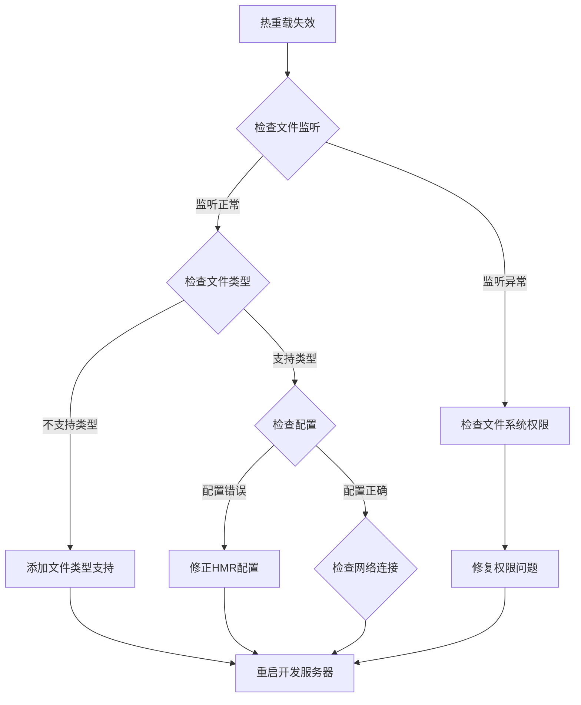
```mermaid
flowchart TD
A[热重载失效] --> B{检查文件监听}
B --> |监听正常| C{检查文件类型}
B --> |监听异常| D[检查文件系统权限]
C --> |支持类型| E{检查配置}
C --> |不支持类型| F[添加文件类型支持]
E --> |配置正确| G{检查网络连接}
E --> |配置错误| H[修正HMR配置]
D --> I[修复权限问题]
F --> J[重启开发服务器]
H --> J
G --> J
I --> J
```

**章节来源**
- [vite.config.ts](file://vite.config.ts#L27-L36)
- [package.json](file://package.json#L10)

## 总结

本文档全面解析了Vite开发服务器的配置机制，重点涵盖了以下几个方面：

### 核心配置要点

1. **端口配置**：通过VITE_PORT环境变量实现灵活的端口管理
2. **主机绑定**：host: true确保多设备访问能力
3. **代理配置**：/api前缀代理解决跨域问题
4. **环境变量**：完整的类型定义和动态加载机制

### 实际应用价值

- **开发效率**：自动化的代理配置减少手动设置
- **团队协作**：统一的配置标准便于团队开发
- **环境适配**：灵活的环境变量支持多环境部署
- **调试便利**：完善的错误处理和日志记录

### 最佳实践总结

1. 使用环境变量管理配置，避免硬编码
2. 合理配置代理规则，确保API调用顺畅
3. 建立完善的环境变量验证机制
4. 提供清晰的错误诊断和解决方案

通过遵循这些配置原则和最佳实践，开发者可以构建高效、稳定的开发环境，提升开发体验和项目质量。