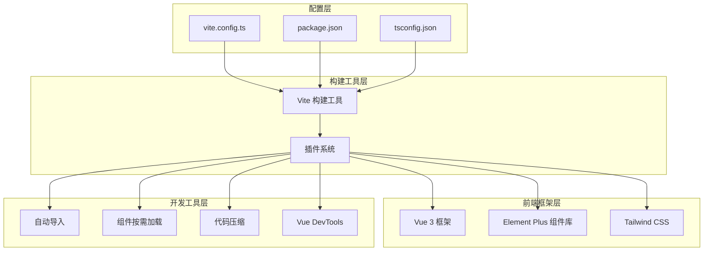
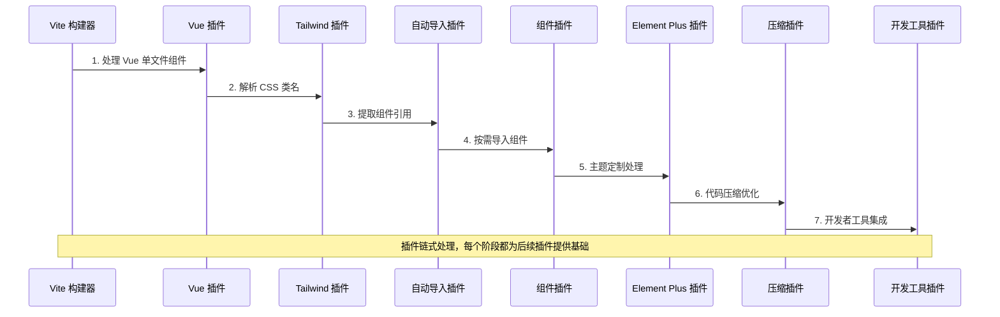
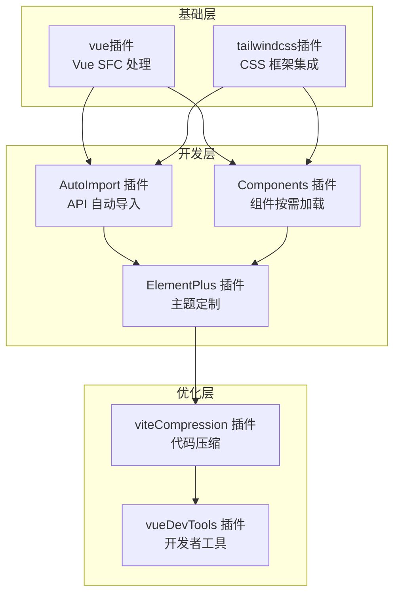
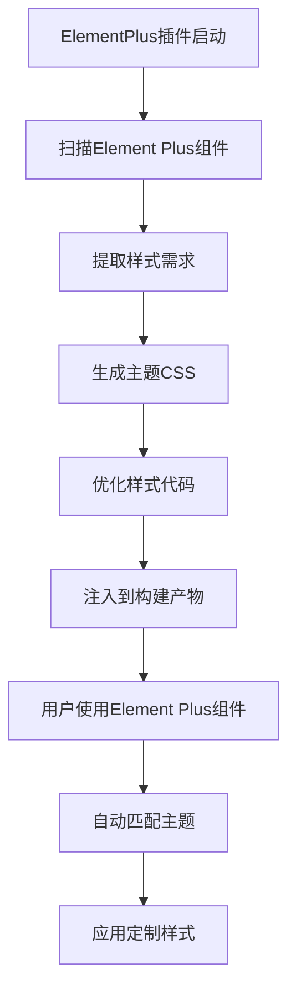
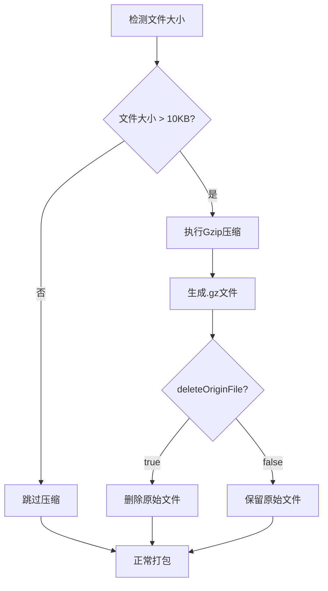
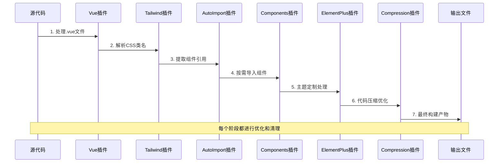
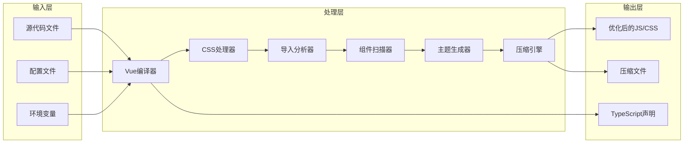

# 插件配置

<cite>
**本文档中引用的文件**
- [vite.config.ts](file://vite.config.ts)
- [package.json](file://package.json)
- [src/main.ts](file://src/main.ts)
- [src/assets/styles/core/tailwind.css](file://src/assets/styles/core/tailwind.css)
- [src/config/modules/component.ts](file://src/config/modules/component.ts)
- [src/components/core/forms/art-form/index.vue](file://src/components/core/forms/art-form/index.vue)
- [src/components/core/forms/art-search-bar/index.vue](file://src/components/core/forms/art-search-bar/index.vue)
- [tsconfig.json](file://tsconfig.json)
</cite>

## 目录
1. [简介](#简介)
2. [项目结构概览](#项目结构概览)
3. [核心插件系统](#核心插件系统)
4. [插件架构详解](#插件架构详解)
5. [详细插件分析](#详细插件分析)
6. [插件协同工作机制](#插件协同工作机制)
7. [配置最佳实践](#配置最佳实践)
8. [故障排除指南](#故障排除指南)
9. [总结](#总结)

## 简介

本文档详细介绍了基于Vite构建的现代前端项目中的插件系统配置。该项目采用了一套完整的插件生态系统，包括Vue单文件组件处理、CSS框架集成、自动化导入、组件按需加载、主题定制、代码压缩和开发者工具等核心功能。通过深入分析每个插件的作用机制、配置选项和最佳实践，帮助开发者理解和优化项目的构建流程。

## 项目结构概览

该项目采用了模块化的插件架构设计，主要包含以下核心模块：



**图表来源**
- [vite.config.ts](file://vite.config.ts#L1-L157)
- [package.json](file://package.json#L1-L124)

**章节来源**
- [vite.config.ts](file://vite.config.ts#L1-L157)
- [package.json](file://package.json#L1-L124)

## 核心插件系统

项目的核心插件系统由以下七个主要插件组成，它们协同工作以提供完整的开发体验：

```mermaid
flowchart LR
subgraph "插件配置顺序"
A[vue()] --> B[tailwindcss()]
B --> C[AutoImport]
C --> D[Components]
D --> E[ElementPlus]
E --> F[viteCompression]
F --> G[vueDevTools]
end
subgraph "功能分类"
H[框架支持] --> A
I[样式框架] --> B
J[开发效率] --> C
J --> D
K[主题定制] --> E
L[性能优化] --> F
M[调试工具] --> G
end
```

**图表来源**
- [vite.config.ts](file://vite.config.ts#L68-L100)

**章节来源**
- [vite.config.ts](file://vite.config.ts#L68-L100)

## 插件架构详解

### 插件加载机制

Vite插件按照配置顺序依次加载，每个插件都有特定的功能定位：



**图表来源**
- [vite.config.ts](file://vite.config.ts#L68-L100)

### 插件依赖关系

各插件之间存在明确的依赖关系和协作模式：



**图表来源**
- [vite.config.ts](file://vite.config.ts#L68-L100)

**章节来源**
- [vite.config.ts](file://vite.config.ts#L68-L100)

## 详细插件分析

### 1. Vue 插件 (@vitejs/plugin-vue)

Vue插件是整个系统的基础，负责处理Vue单文件组件（SFC）的编译和热更新。

#### 核心功能
- **单文件组件编译**：将`.vue`文件编译为JavaScript模块
- **模板预编译**：优化模板渲染性能
- **热模块替换**：支持开发时的实时更新
- **TypeScript 支持**：无缝集成Vue 3 + TypeScript

#### 配置特点
- 默认配置，无需额外参数
- 与Vue 3.5.21版本完全兼容
- 支持最新的Vue Composition API

**章节来源**
- [vite.config.ts](file://vite.config.ts#L69)

### 2. Tailwind CSS 插件 (@tailwindcss/vite)

Tailwind CSS插件集成了现代化的实用优先CSS框架，提供响应式设计能力和主题定制功能。

#### 核心功能
- **实用类生成**：根据配置动态生成CSS类
- **响应式设计**：内置移动端优先的响应式断点
- **暗色模式支持**：自动适配系统主题
- **自定义主题**：支持变量驱动的主题系统

#### 配置特性
- **自定义颜色系统**：基于OKLCH色彩空间的颜色定义
- **响应式断点**：移动优先的设计理念
- **暗色模式变量**：智能的主题切换支持

#### 主题配置详情

| 颜色类别 | 浅色模式变量 | 深色模式变量 | 用途 |
|---------|-------------|-------------|------|
| 主色调 | `--art-primary: oklch(0.7 0.23 260)` | `--art-primary: oklch(0.7 0.23 260)` | 应用主品牌色 |
| 次色调 | `--art-secondary: oklch(0.72 0.19 231.6)` | `--art-secondary: oklch(0.72 0.19 231.6)` | 辅助功能色 |
| 成功色 | `--art-success: oklch(0.78 0.17 166.1)` | `--art-success: oklch(0.78 0.17 166.1)` | 正面操作反馈 |
| 错误色 | `--art-error: oklch(0.73 0.15 25.3)` | `--art-error: oklch(0.73 0.15 25.3)` | 错误状态指示 |

**章节来源**
- [vite.config.ts](file://vite.config.ts#L70)
- [src/assets/styles/core/tailwind.css](file://src/assets/styles/core/tailwind.css#L1-L209)

### 3. AutoImport 插件 (unplugin-auto-import)

AutoImport插件实现了API的自动导入功能，显著提升开发效率并减少样板代码。

#### 核心功能
- **自动导入Vue API**：包括reactivity、computed、ref等
- **路由自动导入**：vue-router相关功能
- **状态管理**：Pinia store辅助函数
- **工具库**：@vueuse/core组合式API

#### 配置选项详解

| 配置项 | 值 | 说明 |
|-------|-----|------|
| `imports` | `['vue', 'vue-router', 'pinia', '@vueuse/core']` | 导入的API集合 |
| `dts` | `'src/types/import/auto-imports.d.ts'` | TypeScript声明文件路径 |
| `resolvers` | `[ElementPlusResolver()]` | Element Plus解析器 |
| `eslintrc.enabled` | `true` | 启用ESLint规则生成 |
| `eslintrc.filepath` | `'./.auto-import.json'` | ESLint配置文件路径 |

#### ElementPlusResolver配置

ElementPlusResolver提供了对Element Plus组件的智能解析：
- **按需导入**：只导入实际使用的组件
- **样式自动引入**：同步导入对应的CSS样式
- **国际化支持**：自动处理多语言配置

**章节来源**
- [vite.config.ts](file://vite.config.ts#L72-L80)

### 4. Components 插件 (unplugin-vue-components)

Components插件实现了UI组件的按需加载，优化包体积和加载性能。

#### 核心功能
- **自动组件发现**：扫描指定目录下的Vue组件
- **按需导入**：只打包实际使用的组件
- **命名规范**：支持kebab-case和PascalCase组件名
- **类型支持**：生成TypeScript类型声明

#### 配置特点

| 配置项 | 值 | 说明 |
|-------|-----|------|
| `dts` | `'src/types/import/components.d.ts'` | 组件类型声明文件 |
| `resolvers` | `[ElementPlusResolver()]` | Element Plus组件解析器 |

#### 组件扫描策略
- **目录扫描**：自动发现`src/components`目录下的组件
- **递归遍历**：支持多层级组件结构
- **过滤机制**：排除测试文件和非组件文件

**章节来源**
- [vite.config.ts](file://vite.config.ts#L83-L85)

### 5. ElementPlus 插件 (unplugin-element-plus)

ElementPlus插件专门用于Element Plus组件库的主题定制和样式优化。

#### 核心功能
- **主题定制**：支持源码级别的主题修改
- **样式优化**：移除未使用的样式代码
- **按需加载**：配合Components插件实现完全按需
- **国际化支持**：自动处理多语言配置

#### 配置选项

| 配置项 | 值 | 说明 |
|-------|-----|------|
| `useSource` | `true` | 使用Element Plus源码进行构建 |

#### 主题定制流程



**图表来源**
- [vite.config.ts](file://vite.config.ts#L88-L90)

**章节来源**
- [vite.config.ts](file://vite.config.ts#L88-L90)

### 6. viteCompression 插件 (vite-plugin-compression)

viteCompression插件提供Gzip压缩功能，优化生产环境的资源传输效率。

#### 核心功能
- **Gzip压缩**：使用标准Gzip算法压缩静态资源
- **智能阈值**：只对大文件进行压缩处理
- **多种算法**：支持gzip、brotli等多种压缩算法
- **构建优化**：提升CDN和服务器部署效率

#### 配置详解

| 配置项 | 值 | 说明 | 性能影响 |
|-------|-----|------|----------|
| `verbose` | `false` | 控制台输出压缩信息 | 开发体验 |
| `disable` | `false` | 是否禁用压缩 | 生产部署 |
| `algorithm` | `'gzip'` | 压缩算法选择 | 压缩率和速度 |
| `ext` | `'.gz'` | 压缩文件扩展名 | 文件识别 |
| `threshold` | `10240` | 压缩阈值（字节） | 压缩策略 |
| `deleteOriginFile` | `false` | 删除原始文件 | 存储优化 |

#### 压缩策略分析



**图表来源**
- [vite.config.ts](file://vite.config.ts#L92-L98)

**章节来源**
- [vite.config.ts](file://vite.config.ts#L92-L98)

### 7. vueDevTools 插件 (vite-plugin-vue-devtools)

vueDevTools插件集成了Vue官方开发者工具，提供强大的调试和开发辅助功能。

#### 核心功能
- **组件检查器**：可视化组件树结构
- **状态管理**：实时查看Pinia状态
- **性能监控**：组件渲染性能分析
- **时间旅行**：Vue状态的时间旅行调试

#### 集成特点
- **自动集成**：无需额外配置即可使用
- **开发友好**：仅在开发环境中激活
- **性能优化**：最小化对生产环境的影响

**章节来源**
- [vite.config.ts](file://vite.config.ts#L100)

## 插件协同工作机制

### 插件链式处理流程

各插件按照配置顺序形成一个高效的处理链，每个插件都为后续插件提供优化的基础：



**图表来源**
- [vite.config.ts](file://vite.config.ts#L68-L100)

### 数据流传递机制

插件之间的数据传递遵循清晰的接口约定：



**图表来源**
- [vite.config.ts](file://vite.config.ts#L1-L157)

### 性能优化协同效应

多个插件的协同工作产生了显著的性能优化效果：

| 优化维度 | Vue插件 | Tailwind插件 | AutoImport插件 | Components插件 | ElementPlus插件 | 压缩插件 |
|---------|---------|--------------|----------------|----------------|-----------------|----------|
| 包体积 | ✓ | ✓ | ✓ | ✓ | ✓ | ✓ |
| 加载速度 | ✓ | ✓ | ✓ | ✓ | ✓ | ✓ |
| 编译速度 | ✓ | ✓ | ✓ | ✓ | ✓ | ✓ |
| 开发体验 | ✓ | ✓ | ✓ | ✓ | ✓ | ✓ |
| 生产性能 | ✓ | ✓ | ✓ | ✓ | ✓ | ✓ |

**章节来源**
- [vite.config.ts](file://vite.config.ts#L68-L100)

## 配置最佳实践

### 1. 插件配置顺序优化

插件的配置顺序直接影响构建性能和功能效果：

```typescript
// 推荐的插件配置顺序
export default defineConfig({
  plugins: [
    vue(),                    // 基础框架支持
    tailwindcss(),            // 样式框架集成
    AutoImport({              // 开发效率提升
      imports: ['vue', 'vue-router', 'pinia', '@vueuse/core'],
      resolvers: [ElementPlusResolver()]
    }),
    Components({              // 组件按需加载
      resolvers: [ElementPlusResolver()]
    }),
    ElementPlus({             // 主题定制
      useSource: true
    }),
    viteCompression({         // 性能优化
      threshold: 10240,
      algorithm: 'gzip'
    }),
    vueDevTools()             // 开发工具
  ]
})
```

### 2. 性能配置调优

针对不同环境的性能优化配置：

| 环境 | 压缩阈值 | 算法选择 | 开发工具 | 其他优化 |
|------|---------|----------|----------|----------|
| 开发环境 | `1024` | `gzip` | ✅ | 快速构建 |
| 测试环境 | `5120` | `gzip` | ✅ | 中等优化 |
| 生产环境 | `10240` | `gzip` | ❌ | 最大优化 |

### 3. 类型安全配置

确保TypeScript类型系统的完整性：

```typescript
// tsconfig.json 配置要点
{
  "compilerOptions": {
    "types": ["vite/client", "node", "element-plus/global"],
    "paths": {
      "@/*": ["src/*"],
      "@components/*": ["src/components/*"]
    }
  }
}
```

### 4. 环境变量配置

合理的环境变量配置提升开发和部署体验：

```typescript
// vite.config.ts 环境变量处理
export default ({ mode }: { mode: string }) => {
  const env = loadEnv(mode, process.cwd())
  const { 
    VITE_VERSION, 
    VITE_PORT, 
    VITE_BASE_URL, 
    VITE_API_URL, 
    VITE_API_PROXY_URL 
  } = env
  
  return defineConfig({
    define: {
      __APP_VERSION__: JSON.stringify(VITE_VERSION)
    },
    // ... 其他配置
  })
}
```

**章节来源**
- [vite.config.ts](file://vite.config.ts#L14-L25)
- [tsconfig.json](file://tsconfig.json#L1-L28)

## 故障排除指南

### 常见问题及解决方案

#### 1. AutoImport 不生效

**症状**：无法自动导入Vue API或组合式函数

**排查步骤**：
- 检查`eslintrc.enabled`是否设置为`true`
- 验证`resolvers`配置是否正确
- 确认TypeScript声明文件生成路径

**解决方案**：
```typescript
AutoImport({
  imports: ['vue', 'vue-router', 'pinia', '@vueuse/core'],
  dts: 'src/types/import/auto-imports.d.ts',
  resolvers: [ElementPlusResolver()],
  eslintrc: {
    enabled: true,        // 确保启用
    filepath: './.auto-import.json'
  }
})
```

#### 2. Components 按需加载失败

**症状**：组件导入路径错误或未找到组件

**排查步骤**：
- 检查组件文件命名规范
- 验证`resolvers`配置
- 确认组件导出方式

**解决方案**：
```typescript
Components({
  dirs: ['src/components'],  // 明确指定扫描目录
  resolvers: [ElementPlusResolver()]
})
```

#### 3. Tailwind CSS 类名不生效

**症状**：使用Tailwind类名但样式未应用

**排查步骤**：
- 检查CSS文件导入顺序
- 验证Tailwind配置文件
- 确认类名拼写正确

**解决方案**：
```typescript
// 确保正确的导入顺序
import '@styles/core/tailwind.css'
import '@styles/index.scss'
```

#### 4. ElementPlus 主题定制失效

**症状**：自定义主题颜色未生效

**排查步骤**：
- 检查`useSource`配置
- 验证CSS变量定义
- 确认样式文件加载顺序

**解决方案**：
```typescript
ElementPlus({
  useSource: true,  // 使用源码构建
  // 确保CSS变量正确定义
})
```

#### 5. viteCompression 压缩效果差

**症状**：压缩后文件大小没有明显变化

**排查步骤**：
- 检查`threshold`设置是否合理
- 验证文件类型是否支持压缩
- 确认`deleteOriginFile`配置

**解决方案**：
```typescript
viteCompression({
  threshold: 10240,        // 设置合适的阈值
  algorithm: 'gzip',       // 选择合适的算法
  deleteOriginFile: false  // 保留原始文件便于调试
})
```

### 性能监控和调试

#### 开发环境调试技巧

```typescript
// 启用详细的插件日志
export default defineConfig({
  plugins: [
    vue(),
    tailwindcss(),
    AutoImport({
      // 添加调试信息
      eslintrc: {
        enabled: true,
        globalsPropValue: true
      }
    }),
    Components({
      // 启用调试模式
      dts: 'src/types/import/components.d.ts'
    })
  ],
  // 开发服务器配置
  server: {
    open: true,           // 自动打开浏览器
    strictPort: true,     // 严格端口模式
    hmr: {                // 热更新配置
      overlay: true
    }
  }
})
```

#### 生产环境优化检查清单

- [ ] 确认所有开发工具插件已禁用
- [ ] 验证压缩插件正常工作
- [ ] 检查TypeScript声明文件生成
- [ ] 确认包体积符合预期
- [ ] 测试构建产物的加载性能

**章节来源**
- [vite.config.ts](file://vite.config.ts#L72-L100)

## 总结

本项目采用的Vite插件系统展现了现代前端工程化的最佳实践。通过精心设计的插件组合，实现了以下核心目标：

### 核心优势

1. **开发效率提升**：AutoImport和Components插件大幅减少了样板代码
2. **包体积优化**：按需加载和压缩插件有效控制了应用体积
3. **样式管理增强**：Tailwind CSS和Element Plus的结合提供了强大的样式解决方案
4. **开发体验优化**：vueDevTools和完善的TypeScript支持提升了开发舒适度
5. **性能表现优秀**：多层优化策略确保了应用的高性能表现

### 技术特色

- **模块化架构**：每个插件职责明确，便于维护和扩展
- **智能按需加载**：自动识别和优化资源使用
- **主题定制能力**：深度集成Element Plus的主题系统
- **构建性能优化**：多层次的压缩和优化策略
- **开发友好性**：丰富的调试工具和类型支持

### 最佳实践总结

1. **合理配置插件顺序**：确保依赖关系得到正确处理
2. **环境差异化配置**：根据不同环境调整优化策略
3. **持续监控性能**：定期评估插件效果和构建性能
4. **保持依赖更新**：及时跟进插件版本更新
5. **文档化配置**：为团队成员提供清晰的配置说明

这套插件系统不仅满足了当前项目的需求，也为未来的功能扩展和技术升级奠定了坚实的基础。通过深入理解和合理运用这些插件，开发者可以构建出高质量、高性能的现代Web应用程序。