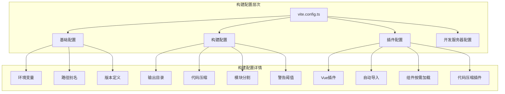
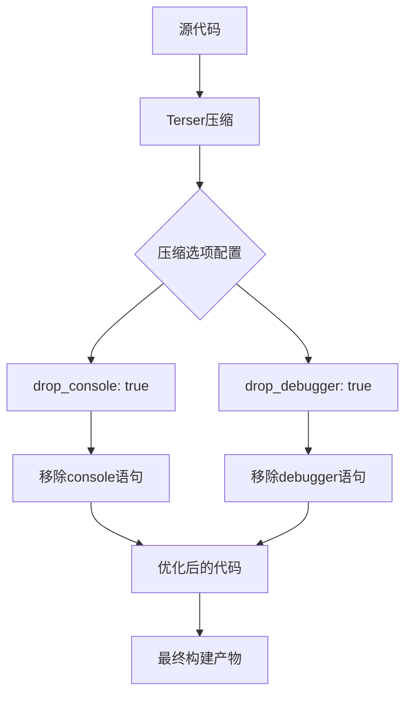
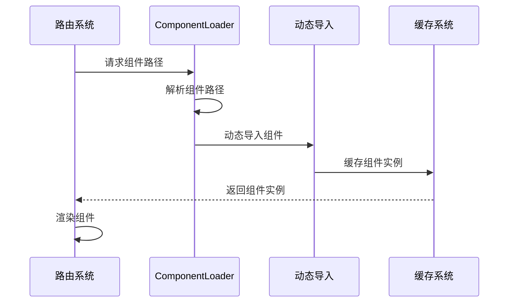
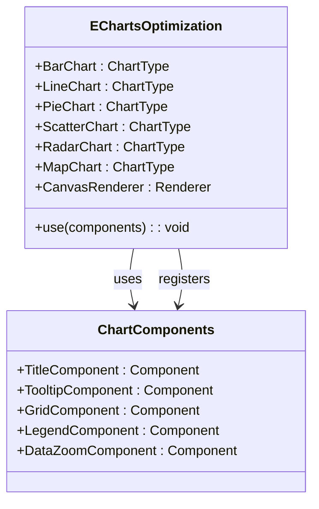

# Vite构建优化策略详细文档

<cite>
**本文档中引用的文件**
- [vite.config.ts](file://vite.config.ts)
- [package.json](file://package.json)
- [tsconfig.json](file://tsconfig.json)
- [src/plugins/echarts.ts](file://src/plugins/echarts.ts)
- [src/router/core/ComponentLoader.ts](file://src/router/core/ComponentLoader.ts)
- [src/hooks/core/useLayoutHeight.ts](file://src/hooks/core/useLayoutHeight.ts)
</cite>

## 目录
1. [项目概述](#项目概述)
2. [构建配置架构](#构建配置架构)
3. [核心构建优化配置](#核心构建优化配置)
4. [代码压缩与优化](#代码压缩与优化)
5. [模块分割与打包策略](#模块分割与打包策略)
6. [依赖预构建优化](#依赖预构建优化)
7. [类型检查与构建集成](#类型检查与构建集成)
8. [性能监控与分析](#性能监控与分析)
9. [常见问题排查](#常见问题排查)
10. [最佳实践建议](#最佳实践建议)

## 项目概述

Art Design Pro是一个基于Vue3、TypeScript、Vite和Element-Plus的企业级后台管理系统模板。该项目采用现代化的前端技术栈，注重开发效率和用户体验，同时在构建优化方面进行了深度优化以确保生产环境的高性能表现。

### 技术栈特点
- **框架**: Vue 3.5.21 + TypeScript 5.6.3
- **构建工具**: Vite 7.1.5
- **UI组件库**: Element Plus 2.11.2
- **样式处理**: Tailwind CSS 4.1.14 + SCSS
- **包管理**: PNPM 8.8.0+

## 构建配置架构

Vite构建系统采用了模块化的配置架构，通过`vite.config.ts`文件集中管理所有构建相关的配置项。



**图表来源**
- [vite.config.ts](file://vite.config.ts#L14-L157)

**章节来源**
- [vite.config.ts](file://vite.config.ts#L1-L157)

## 核心构建优化配置

### 输出目录配置

项目将构建产物输出到`dist`目录，这是Vite的默认配置，但明确指定有助于理解项目的部署结构。

```typescript
// 输出目录配置
outDir: 'dist'
```

### 目标兼容性设置

```typescript
// 目标浏览器兼容性
target: 'es2015'
```

**兼容性考虑**：
- ES2015是现代浏览器的标准支持版本
- 提供了良好的浏览器兼容性同时保持较新的语法特性
- 与Vue 3和TypeScript的最佳实践保持一致

### Chunk大小警告阈值

```typescript
// Chunk大小警告阈值设置为2000KB
chunkSizeWarningLimit: 2000
```

**优化策略**：
- 设置合理的警告阈值防止过度拆分
- 平衡加载性能和网络请求数量
- 适用于中大型应用的模块化需求

**章节来源**
- [vite.config.ts](file://vite.config.ts#L50-L52)

## 代码压缩与优化

### Terser压缩配置

项目采用Terser作为JavaScript压缩工具，这是Vite的默认选择，具有出色的压缩效果和兼容性。



**图表来源**
- [vite.config.ts](file://vite.config.ts#L53-L60)

#### 生产环境代码清理

**drop_console配置**：
- 移除所有`console.*`调用
- 包括`console.log`、`console.warn`、`console.error`等
- 大幅减少生产环境的调试信息输出
- 提升代码安全性，防止敏感信息泄露

**drop_debugger配置**：
- 移除所有`debugger`语句
- 防止生产环境中意外的断点行为
- 提升应用的稳定性和性能
- 减少不必要的执行开销

### 压缩算法配置

项目集成了gzip压缩插件，进一步优化静态资源的传输效率。

```typescript
// Gzip压缩配置
viteCompression({
  verbose: false,
  disable: false,
  algorithm: 'gzip',
  ext: '.gz',
  threshold: 10240, // 10KB
  deleteOriginFile: false
})
```

**压缩策略**：
- 只对大于10KB的资源进行压缩
- 支持gzip和brotli算法
- 保留原始文件用于开发调试
- 显著减少传输数据量

**章节来源**
- [vite.config.ts](file://vite.config.ts#L53-L60)
- [vite.config.ts](file://vite.config.ts#L91-L99)

## 模块分割与打包策略

### 动态导入配置

```typescript
// 动态导入变量选项
dynamicImportVarsOptions: {
  warnOnError: true,
  exclude: [],
  include: ['src/views/**/*.vue']
}
```

**配置策略**：
- 启用动态导入错误警告
- 专门针对视图组件进行动态导入
- 支持按需加载路由组件
- 提升首屏加载性能

### 组件懒加载机制

项目通过`ComponentLoader`类实现了智能的组件懒加载：



**图表来源**
- [src/router/core/ComponentLoader.ts](file://src/router/core/ComponentLoader.ts#L17-L57)

**章节来源**
- [vite.config.ts](file://vite.config.ts#L62-L66)
- [src/router/core/ComponentLoader.ts](file://src/router/core/ComponentLoader.ts#L1-L57)

## 依赖预构建优化

### 关键依赖预构建

项目对大型第三方库进行了预构建优化，避免在运行时重复处理：

```typescript
// 依赖预构建配置
optimizeDeps: {
  include: [
    'echarts/core',
    'echarts/charts',
    'echarts/components',
    'echarts/renderers',
    'xlsx',
    'xgplayer',
    'crypto-js',
    'file-saver',
    'vue-img-cutter',
    'element-plus/es',
    'element-plus/es/components/*/style/css',
    'element-plus/es/components/*/style/index'
  ]
}
```

**优化效果**：
- **ECharts**: 按需导入图表类型和组件
- **Element Plus**: 按需加载组件样式
- **第三方库**: 预编译常用工具库
- **提升性能**: 减少运行时编译开销

### ECharts按需加载优化

项目实现了精细化的ECharts按需加载策略：



**图表来源**
- [src/plugins/echarts.ts](file://src/plugins/echarts.ts#L12-L69)

**章节来源**
- [vite.config.ts](file://vite.config.ts#L110-L124)
- [src/plugins/echarts.ts](file://src/plugins/echarts.ts#L1-L76)

## 类型检查与构建集成

### 构建脚本配置

项目在`package.json`中定义了严格的构建流程：

```json
{
  "scripts": {
    "build": "vue-tsc --noEmit && vite build"
  }
}
```

**构建流程**：
1. **类型检查**: `vue-tsc --noEmit` - 检查TypeScript类型但不生成文件
2. **构建验证**: 确保类型安全后再进行构建
3. **构建执行**: 正常的Vite构建过程

### TypeScript配置优化

```typescript
// tsconfig.json配置
{
  "compilerOptions": {
    "target": "esnext",
    "module": "esnext",
    "strict": true,
    "jsx": "preserve",
    "sourceMap": true,
    "moduleResolution": "node"
  }
}
```

**配置优势**：
- 使用最新的ES特性
- 启用严格类型检查
- 保留JSX语法
- 生成源码映射便于调试

**章节来源**
- [package.json](file://package.json#L11)
- [tsconfig.json](file://tsconfig.json#L2-L13)

## 性能监控与分析

### 打包分析工具

虽然当前配置中注释掉了打包分析插件，但项目预留了分析能力：

```typescript
// 打包分析配置（已注释）
// visualizer({
//   open: true,
//   gzipSize: true,
//   brotliSize: true,
//   filename: 'dist/stats.html'
// })
```

**分析功能**：
- 可视化包大小组成
- Gzip和Brotli压缩效果分析
- 识别大型依赖模块
- 优化打包策略

### 开发服务器优化

```typescript
// 开发服务器配置
server: {
  port: Number(VITE_PORT),
  proxy: {
    '/api': {
      target: VITE_API_PROXY_URL,
      changeOrigin: true
    }
  },
  host: true
}
```

**优化特性**：
- 端口配置支持
- API代理解决跨域问题
- Host配置支持局域网访问

**章节来源**
- [vite.config.ts](file://vite.config.ts#L27-L36)
- [vite.config.ts](file://vite.config.ts#L101-L107)

## 常见问题排查

### 构建体积过大问题

**排查步骤**：

1. **启用打包分析**
   ```bash
   # 取消注释visualizer插件
   # npm run build
   ```

2. **检查依赖大小**
   ```bash
   # 使用包大小分析工具
   npx webpack-bundle-analyzer dist/stats.html
   ```

3. **优化第三方库**
   - 检查是否过度引入功能
   - 使用按需加载替代全量引入
   - 考虑替换为更轻量的替代方案

### Chunk过大警告

**解决方案**：
- 调整`chunkSizeWarningLimit`值
- 优化模块分割策略
- 检查是否有单个文件过大

### 类型检查失败

**排查方法**：
- 检查`vue-tsc --noEmit`的输出
- 确认TypeScript配置正确
- 验证类型定义文件完整性

### 依赖预构建问题

**常见原因**：
- 新增依赖未包含在预构建列表
- 依赖版本冲突
- 缓存问题

**解决方法**：
- 更新`optimizeDeps.include`配置
- 清理node_modules重新安装
- 检查依赖版本兼容性

## 最佳实践建议

### 构建优化策略

1. **合理设置警告阈值**
   - 根据应用规模调整`chunkSizeWarningLimit`
   - 平衡加载性能和网络请求数量

2. **持续监控包大小**
   - 定期分析打包结果
   - 跟踪依赖变化对包大小的影响
   - 制定包大小增长阈值

3. **优化第三方库使用**
   - 优先选择按需加载的库
   - 避免重复引入相同功能的库
   - 考虑使用CDN加速

### 开发流程优化

1. **类型安全优先**
   - 始终在构建前进行类型检查
   - 使用严格的TypeScript配置
   - 及时修复类型错误

2. **模块化设计**
   - 合理划分功能模块
   - 使用懒加载提升性能
   - 避免循环依赖

3. **性能测试**
   - 在不同网络条件下测试
   - 监控首屏加载时间
   - 优化关键路径

### 维护建议

1. **定期更新依赖**
   - 关注安全漏洞公告
   - 测试新版本兼容性
   - 保持工具链最新

2. **文档维护**
   - 记录构建配置变更
   - 更新优化策略文档
   - 分享最佳实践经验

3. **团队协作**
   - 统一构建环境配置
   - 制定代码规范标准
   - 定期进行性能回顾

通过以上详细的构建优化策略，Art Design Pro项目实现了高效、稳定的生产环境部署，为开发者提供了优秀的开发体验和用户性能体验。这些优化措施不仅提升了应用的加载速度和运行效率，还为项目的长期维护和发展奠定了坚实的基础。