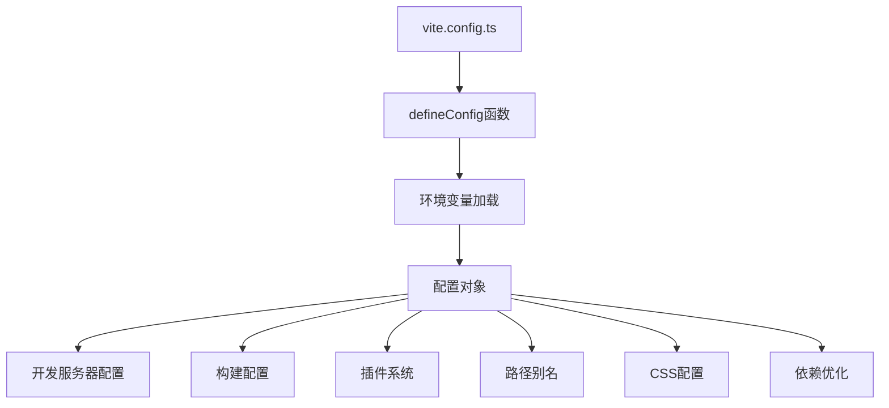
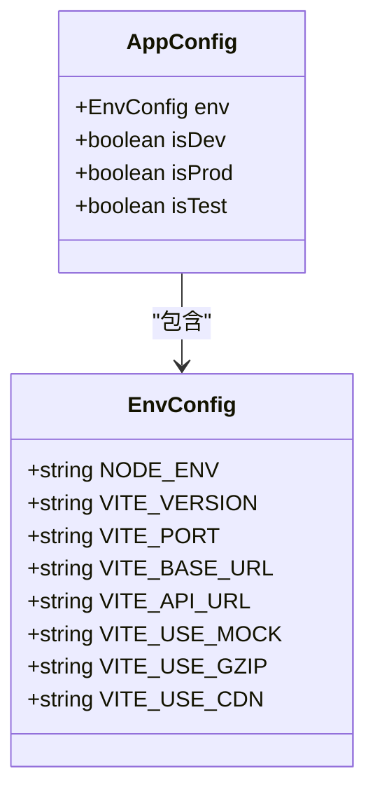
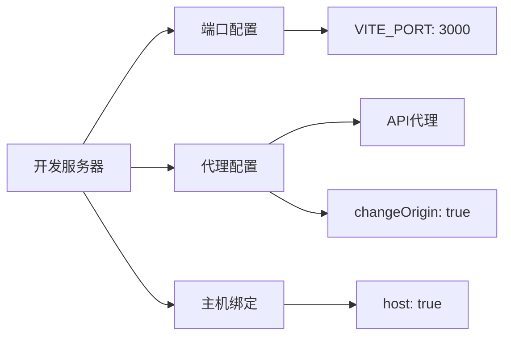
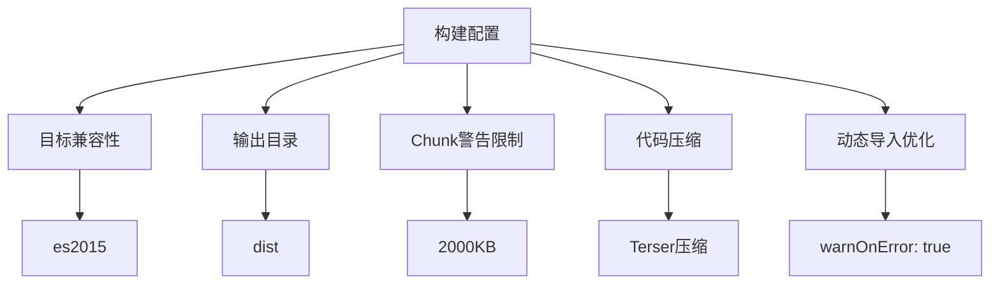
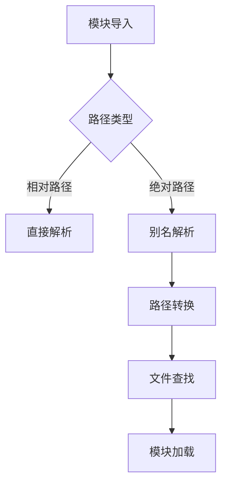
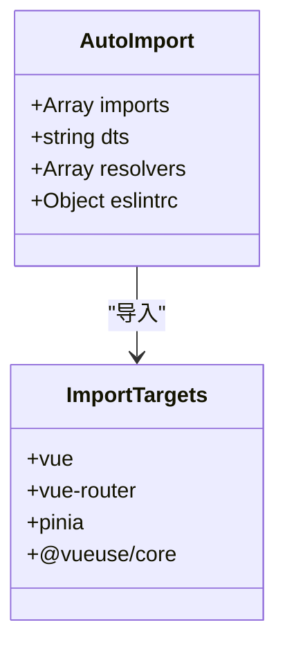
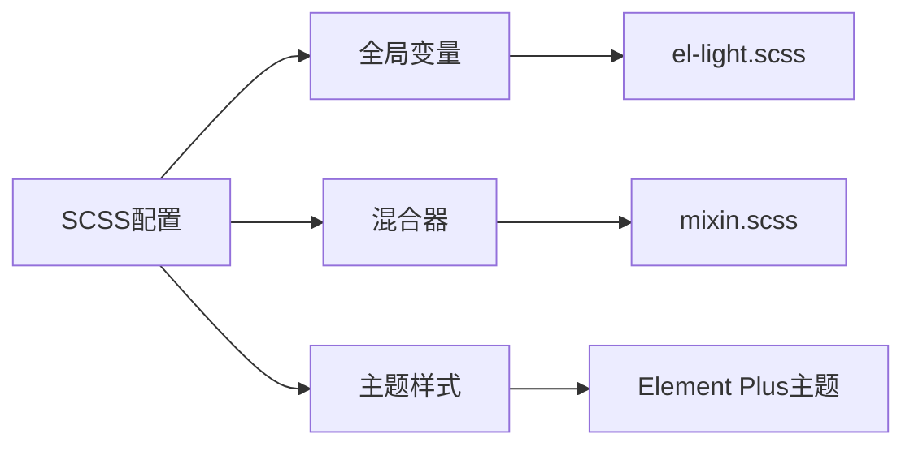
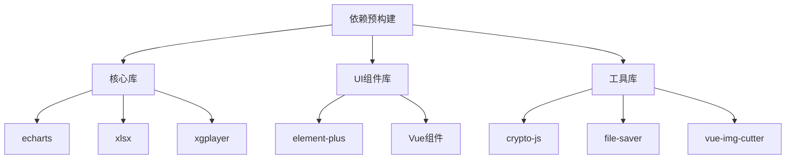
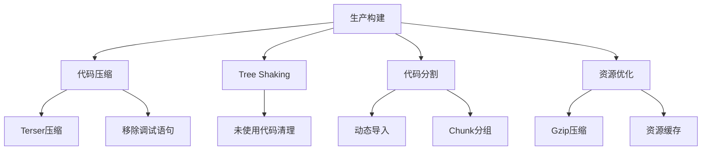
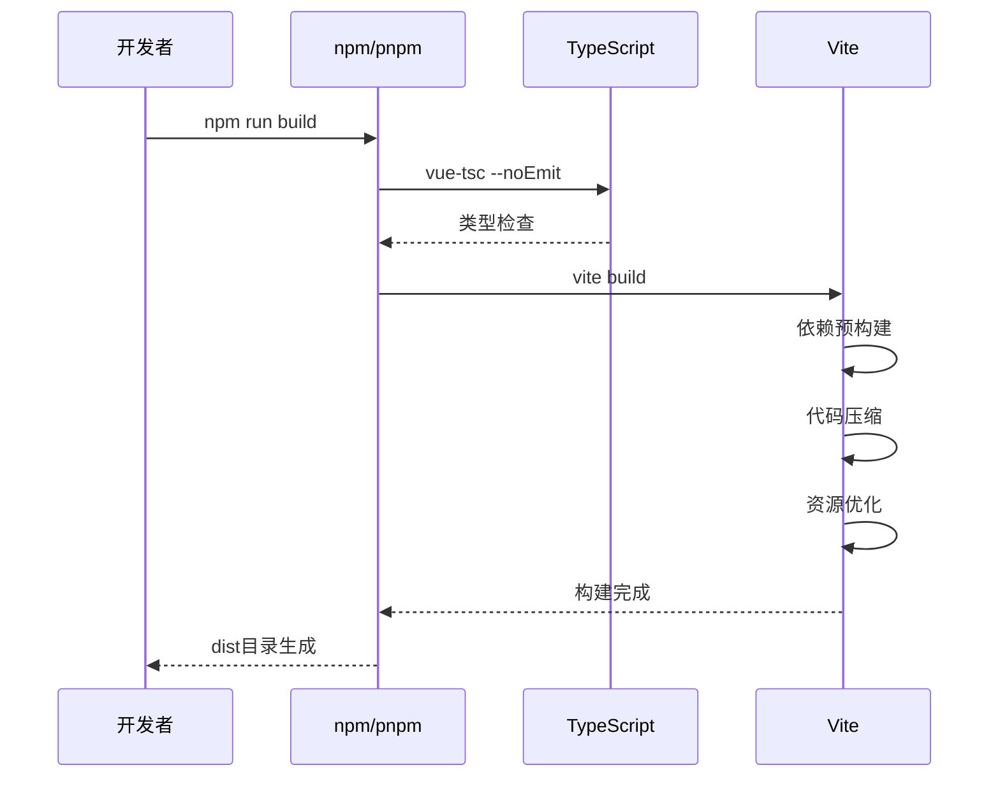

# Vite构建配置详细文档

<cite>
**本文档引用的文件**
- [vite.config.ts](file://vite.config.ts)
- [package.json](file://package.json)
- [tsconfig.json](file://tsconfig.json)
- [src/env.d.ts](file://src/env.d.ts)
- [src/types/config/index.ts](file://src/types/config/index.ts)
- [src/config/setting.ts](file://src/config/setting.ts)
</cite>

## 目录
1. [项目概述](#项目概述)
2. [核心配置架构](#核心配置架构)
3. [环境变量配置](#环境变量配置)
4. [开发服务器配置](#开发服务器配置)
5. [构建输出配置](#构建输出配置)
6. [路径别名配置](#路径别名配置)
7. [插件系统详解](#插件系统详解)
8. [CSS预处理器配置](#css预处理器配置)
9. [依赖预构建优化](#依赖预构建优化)
10. [生产构建优化策略](#生产构建优化策略)
11. [完整构建流程](#完整构建流程)
12. [最佳实践建议](#最佳实践建议)

## 项目概述

本项目采用现代化的Vite构建工具作为前端工程的核心构建系统，支持Vue 3、TypeScript、Tailwind CSS等技术栈。项目配置充分体现了现代前端工程的最佳实践，包括环境变量管理、插件化架构、性能优化等多个方面。

## 核心配置架构

Vite配置采用函数式配置方式，支持根据不同的构建模式动态调整配置：



**图表来源**
- [vite.config.ts](file://vite.config.ts#L14-L152)

**章节来源**
- [vite.config.ts](file://vite.config.ts#L1-L157)

## 环境变量配置

项目通过VITE前缀的环境变量实现配置管理，支持多环境部署：

### 核心环境变量

| 变量名 | 类型 | 默认值 | 作用描述 |
|--------|------|--------|----------|
| VITE_VERSION | string | - | 应用版本号 |
| VITE_PORT | number | 3000 | 开发服务器端口 |
| VITE_BASE_URL | string | '/' | 应用基础路径 |
| VITE_API_URL | string | - | API基础地址 |
| VITE_API_PROXY_URL | string | - | API代理目标地址 |

### 环境变量使用方式

```typescript
// 在代码中访问环境变量
const version = import.meta.env.VITE_VERSION
const apiUrl = import.meta.env.VITE_API_URL
```

### 类型安全配置

项目通过TypeScript提供了完整的环境变量类型定义：



**图表来源**
- [src/types/config/index.ts](file://src/types/config/index.ts#L149-L167)

**章节来源**
- [vite.config.ts](file://vite.config.ts#L16-L17)
- [src/types/config/index.ts](file://src/types/config/index.ts#L149-L167)

## 开发服务器配置

开发服务器配置提供了完整的本地开发体验，包括端口设置、代理配置和主机绑定：

### 服务器配置详解



**图表来源**
- [vite.config.ts](file://vite.config.ts#L27-L36)

### 代理配置机制

代理配置实现了前后端分离开发模式下的API请求转发：

- **代理路径**: `/api` → 目标服务器
- **变更源**: `changeOrigin: true`确保代理请求的Host头正确
- **开发友好**: 自动处理跨域问题

**章节来源**
- [vite.config.ts](file://vite.config.ts#L27-L36)

## 构建输出配置

构建配置针对生产环境进行了深度优化，包括代码压缩、chunk大小管理和动态导入优化：

### 构建配置层次结构



**图表来源**
- [vite.config.ts](file://vite.config.ts#L49-L66)

### Terser压缩配置

生产环境采用Terser进行代码压缩，移除调试信息：

- **移除console**: `drop_console: true`
- **移除debugger**: `drop_debugger: true`
- **代码混淆**: 提升安全性

### Chunk大小监控

设置chunk大小警告阈值为2000KB，帮助开发者识别潜在的性能问题。

**章节来源**
- [vite.config.ts](file://vite.config.ts#L49-L66)

## 路径别名配置

项目配置了丰富的路径别名，提升代码可读性和维护性：

### 路径别名映射表

| 别名 | 实际路径 | 用途描述 |
|------|----------|----------|
| `@` | `./src` | 源码根目录 |
| `@views` | `src/views` | 视图组件目录 |
| `@imgs` | `src/assets/images` | 图片资源目录 |
| `@icons` | `src/assets/icons` | 图标资源目录 |
| `@utils` | `src/utils` | 工具函数目录 |
| `@stores` | `src/store` | 状态管理目录 |
| `@styles` | `src/assets/styles` | 样式资源目录 |

### 路径解析机制



**图表来源**
- [vite.config.ts](file://vite.config.ts#L38-L47)

**章节来源**
- [vite.config.ts](file://vite.config.ts#L38-L47)
- [tsconfig.json](file://tsconfig.json#L15-L23)

## 插件系统详解

项目集成了多个强大的插件，形成了完整的开发和构建生态：

### 插件架构概览

```mermaid
graph TB
A[Vite插件系统] --> B[Vue插件]
A --> C[UI框架插件]
A --> D[工具类插件]
A --> E[开发辅助插件]
B --> B1[@vitejs/plugin-vue]
C --> C1[unplugin-element-plus]
C --> C2[unplugin-vue-components]
D --> D1[unplugin-auto-import]
D --> D2[vite-plugin-compression]
E --> E1[@tailwindcss/vite]
E --> E2[vite-plugin-vue-devtools]
```

**图表来源**
- [vite.config.ts](file://vite.config.ts#L68-L107)

### Vue插件配置

Vue插件是项目的基础，负责处理Vue单文件组件的编译：

- **核心功能**: Vue SFC编译、热更新支持
- **性能优化**: 支持Tree Shaking

### Element Plus插件配置

Element Plus插件提供了完整的UI组件库支持：

- **按需加载**: `unplugin-element-plus`
- **主题定制**: 支持源码引入和样式定制
- **自动导入**: 组件和API的自动导入

### 自动导入系统

#### AutoImport配置



**图表来源**
- [vite.config.ts](file://vite.config.ts#L72-L80)

#### Components配置

组件自动导入系统支持：

- **组件扫描**: 自动发现和注册组件
- **按需加载**: 减少打包体积
- **类型定义**: 自动生成TS类型声明

### Tailwind CSS集成

Tailwind CSS插件提供了现代化的CSS解决方案：

- **Vite集成**: `@tailwindcss/vite`
- **样式预设**: 完整的实用类库
- **响应式设计**: 移动优先的设计理念

### Gzip压缩插件

Vite Compression插件提供静态资源压缩：

- **算法选择**: Gzip压缩
- **文件过滤**: 大于10KB的资源才进行压缩
- **性能考虑**: 不删除原始文件，便于调试

### Vue DevTools插件

Vue DevTools插件提供开发时的调试支持：

- **实时调试**: 组件状态监控
- **性能分析**: 渲染性能追踪
- **时间旅行**: 状态变化回溯

**章节来源**
- [vite.config.ts](file://vite.config.ts#L68-L107)

## CSS预处理器配置

项目配置了SCSS预处理器和PostCSS插件链，提供了强大的样式处理能力：

### SCSS配置



**图表来源**
- [vite.config.ts](file://vite.config.ts#L127-L134)

### PostCSS配置

项目配置了自定义的PostCSS插件来处理CSS特性：

- **Charset移除**: 自动移除`@charset`规则
- **浏览器兼容**: 确保CSS标准一致性

**章节来源**
- [vite.config.ts](file://vite.config.ts#L126-L149)

## 依赖预构建优化

依赖预构建是Vite的重要优化特性，显著提升了开发和生产环境的性能：

### 预构建策略



**图表来源**
- [vite.config.ts](file://vite.config.ts#L110-L124)

### 预构建清单

项目预构建包含了以下关键依赖：

| 类别 | 包名 | 用途 |
|------|------|------|
| 数据可视化 | echarts/core, echarts/charts | 图表绘制 |
| Excel处理 | xlsx | 表格操作 |
| 播放器 | xgplayer | 视频播放 |
| 加密工具 | crypto-js | 密码学功能 |
| 文件处理 | file-saver | 文件下载 |
| 图片裁剪 | vue-img-cutter | 图像编辑 |

**章节来源**
- [vite.config.ts](file://vite.config.ts#L110-L124)

## 生产构建优化策略

生产环境构建采用了多层次的优化策略，确保应用的最佳性能：

### 代码分割策略



### 压缩配置详解

生产环境采用严格的代码压缩策略：

- **压缩算法**: Terser
- **调试信息移除**: 自动移除`console`和`debugger`语句
- **代码混淆**: 提升代码安全性
- **大小监控**: Chunk大小警告阈值设置

### 动态导入优化

项目配置了智能的动态导入策略：

- **错误警告**: `warnOnError: true`确保导入错误可见
- **文件匹配**: 仅对`src/views/**/*.vue`文件启用动态导入
- **性能优化**: 减少初始包大小

**章节来源**
- [vite.config.ts](file://vite.config.ts#L53-L66)

## 完整构建流程

基于package.json中的脚本配置，项目提供了完整的构建流程：

### 构建脚本分析



**图表来源**
- [package.json](file://package.json#L10-L12)

### 构建命令详解

| 命令 | 功能 | 执行顺序 |
|------|------|----------|
| `vue-tsc --noEmit` | TypeScript类型检查 | 1 |
| `vite build` | Vite构建 | 2 |

### 开发脚本配置

- **开发模式**: `vite --open` 自动打开浏览器
- **预览模式**: `vite preview` 本地预览构建结果

**章节来源**
- [package.json](file://package.json#L9-L12)

## 最佳实践建议

基于项目的配置实践，总结以下最佳实践建议：

### 环境变量管理

1. **命名规范**: 使用VITE前缀标识环境变量
2. **类型安全**: 通过TypeScript提供完整的类型定义
3. **默认值**: 为可选环境变量提供合理的默认值

### 性能优化策略

1. **依赖预构建**: 将常用依赖加入预构建列表
2. **代码分割**: 合理使用动态导入
3. **资源压缩**: 启用Gzip压缩和代码压缩

### 开发体验优化

1. **路径别名**: 配置有意义的路径别名
2. **插件集成**: 选择合适的插件组合
3. **热更新**: 确保开发时的热更新效率

### 构建质量保证

1. **类型检查**: 在构建前进行类型检查
2. **代码压缩**: 生产环境启用代码压缩
3. **资源优化**: 合理配置资源优化策略

通过以上配置和实践，项目实现了现代化的前端工程构建体系，为开发团队提供了高效、稳定的开发和部署环境。