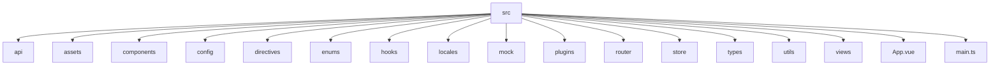
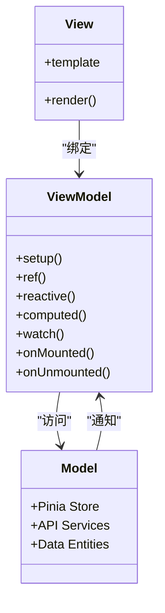
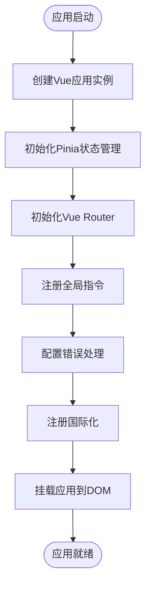
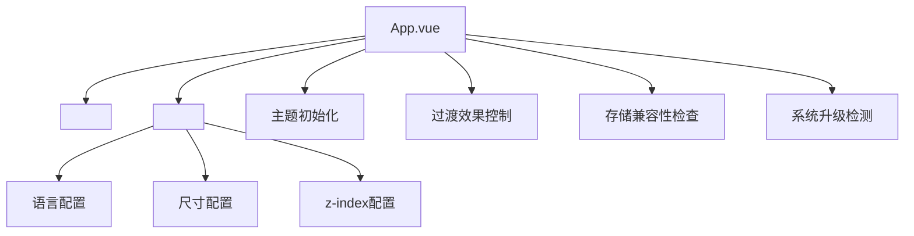
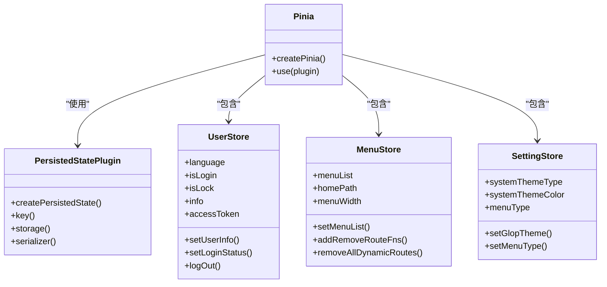
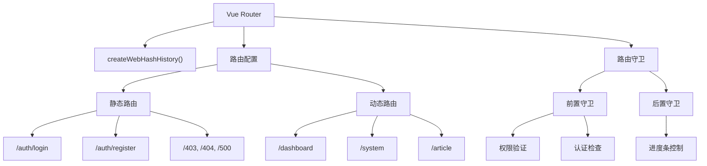
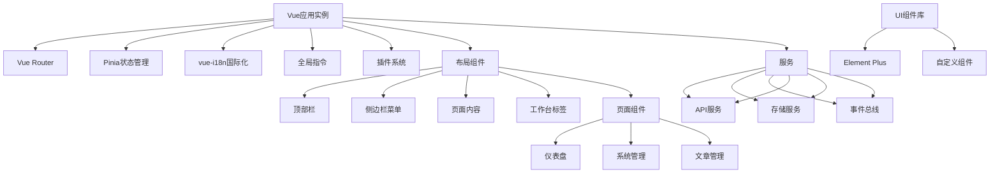
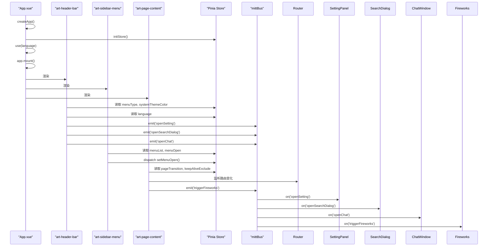

# 技术架构

<cite>
**本文档引用的文件**  
- [main.ts](file://src/main.ts)
- [App.vue](file://src/App.vue)
- [store/index.ts](file://src/store/index.ts)
- [store/modules/user.ts](file://src/store/modules/user.ts)
- [store/modules/menu.ts](file://src/store/modules/menu.ts)
- [router/index.ts](file://src/router/index.ts)
- [router/routes/staticRoutes.ts](file://src/router/routes/staticRoutes.ts)
- [hooks/core/useTheme.ts](file://src/hooks/core/useTheme.ts)
- [utils/sys/mittBus.ts](file://src/utils/sys/mittBus.ts)
- [components/core/layouts/art-page-content/index.vue](file://src/components/core/layouts/art-page-content/index.vue)
- [components/core/layouts/art-header-bar/index.vue](file://src/components/core/layouts/art-header-bar/index.vue)
- [components/core/layouts/art-menus/art-sidebar-menu/index.vue](file://src/components/core/layouts/art-menus/art-sidebar-menu/index.vue)
- [config/index.ts](file://src/config/index.ts)
</cite>

## 目录
1. [项目结构](#项目结构)
2. [MVVM架构与Vue3组合式API](#mvvm架构与vue3组合式api)
3. [应用初始化流程](#应用初始化流程)
4. [根组件与全局布局](#根组件与全局布局)
5. [模块化架构设计](#模块化架构设计)
6. [状态管理模式](#状态管理模式)
7. [路由系统架构](#路由系统架构)
8. [系统上下文图](#系统上下文图)
9. [组件交互图](#组件交互图)
10. [架构决策与可扩展性](#架构决策与可扩展性)

## 项目结构

Art Design Pro采用功能驱动的模块化项目结构，将代码按功能和职责进行清晰划分。项目根目录包含`src`源码目录、配置文件和构建脚本。`src`目录下主要分为`api`、`assets`、`components`、`config`、`directives`、`enums`、`hooks`、`locales`、`mock`、`plugins`、`router`、`store`、`types`、`utils`和`views`等核心模块。

**Diagram sources**
- [src](file://src)

**Section sources**
- [package.json](file://package.json)

## MVVM架构与Vue3组合式API

Art Design Pro基于Vue3的MVVM架构模式，采用组合式API（Composition API）作为核心开发范式。该架构将视图（View）、视图模型（ViewModel）和模型（Model）分离，通过响应式系统实现数据与视图的自动同步。

组合式API允许开发者通过`setup`函数和`<script setup>`语法糖组织逻辑，将相关功能的代码聚合在一起，提高了代码的可读性和可维护性。通过`ref`、`reactive`、`computed`等响应式API创建响应式数据，使用`watch`和`watchEffect`监听数据变化，利用`onMounted`、`onUnmounted`等生命周期钩子管理组件生命周期。

**Diagram sources**
- [App.vue](file://src/App.vue)
- [main.ts](file://src/main.ts)

**Section sources**
- [App.vue](file://src/App.vue#L7-L34)
- [main.ts](file://src/main.ts#L1-L25)

## 应用初始化流程

应用的初始化流程始于`main.ts`文件，该文件作为应用的入口点，负责创建Vue应用实例并配置全局依赖。初始化过程遵循严格的顺序，确保各模块正确加载和配置。

**Diagram sources**
- [main.ts](file://src/main.ts#L1-L25)

**Section sources**
- [main.ts](file://src/main.ts#L1-L25)

## 根组件与全局布局

`App.vue`作为应用的根组件，负责协调路由视图和全局布局组件的工作。它使用`<RouterView>`作为路由出口，将当前路由对应的视图组件渲染到页面中。通过`ElConfigProvider`为Element Plus组件库提供全局配置，包括语言、尺寸和z-index等。

根组件在`onBeforeMount`和`onMounted`生命周期钩子中执行关键的初始化任务，如主题初始化、过渡效果控制、存储兼容性检查和系统升级检测。它通过`useUserStore`获取用户状态，特别是语言设置，以动态配置Element Plus的国际化。

**Diagram sources**
- [App.vue](file://src/App.vue#L1-L35)

**Section sources**
- [App.vue](file://src/App.vue#L1-L35)

## 模块化架构设计

Art Design Pro采用功能模块化的架构设计原则，将代码按功能和职责进行组织。`components`目录包含可复用的UI组件，按功能划分为`business`、`core`、`layouts`等子目录。`views`目录存放页面级组件，按业务领域组织。`store`目录实现状态管理模块化，每个模块负责特定领域的状态。`router`目录将路由配置按功能模块拆分。

这种组织方式提高了代码的可维护性和可复用性，降低了模块间的耦合度。通过`@/`别名简化模块导入路径，增强代码的可读性。类型定义集中存放在`types`目录，确保类型安全。

**Section sources**
- [src](file://src)

## 状态管理模式

应用采用Pinia作为状态管理解决方案，在`store/index.ts`中进行全局配置。Pinia实例通过`createPinia()`创建，并配置了持久化插件`pinia-plugin-persistedstate`，实现状态的本地存储。

状态管理采用模块化设计，每个模块（如`user`、`menu`、`setting`）封装特定领域的状态和逻辑。`user`模块管理用户认证、个人信息和语言设置；`menu`模块管理菜单数据和动态路由；`setting`模块管理应用配置和主题设置。通过`defineStore`定义模块，使用`persist`选项配置持久化策略。

**Diagram sources**
- [store/index.ts](file://src/store/index.ts#L1-L53)
- [store/modules/user.ts](file://src/store/modules/user.ts#L1-L236)
- [store/modules/menu.ts](file://src/store/modules/menu.ts#L1-L110)

**Section sources**
- [store/index.ts](file://src/store/index.ts#L1-L53)
- [store/modules/user.ts](file://src/store/modules/user.ts#L1-L236)
- [store/modules/menu.ts](file://src/store/modules/menu.ts#L1-L110)

## 路由系统架构

路由系统基于Vue Router 4构建，采用静态路由和动态路由相结合的架构。`router/index.ts`文件创建路由实例并配置路由守卫。`routes/staticRoutes.ts`定义不需要权限的静态路由，如登录、注册和错误页面。

路由模块化配置在`router/modules`目录下，每个模块（如`dashboard`、`system`）定义自己的路由配置。通过`initRouter`函数初始化路由，配置NProgress进度条和前置/后置守卫。`RoutePermissionValidator`等核心类实现路由权限验证和动态路由注册。

**Diagram sources**
- [router/index.ts](file://src/router/index.ts#L1-L24)
- [router/routes/staticRoutes.ts](file://src/router/routes/staticRoutes.ts#L1-L73)
- [router/modules/dashboard.ts](file://src/router/modules/dashboard.ts#L1-L46)

**Section sources**
- [router/index.ts](file://src/router/index.ts#L1-L24)
- [router/routes/staticRoutes.ts](file://src/router/routes/staticRoutes.ts#L1-L73)
- [router/modules/dashboard.ts](file://src/router/modules/dashboard.ts#L1-L46)

## 系统上下文图

系统上下文图展示了Art Design Pro的核心组件及其相互关系。应用以Vue应用实例为核心，集成路由、状态管理、国际化等全局服务。UI组件库（Element Plus）提供基础UI组件，通过全局配置进行定制。布局组件构成应用的整体结构，页面组件实现具体业务功能。

**Diagram sources**
- [main.ts](file://src/main.ts#L1-L25)
- [App.vue](file://src/App.vue#L1-L35)
- [components/core/layouts/art-header-bar/index.vue](file://src/components/core/layouts/art-header-bar/index.vue#L1-L486)
- [components/core/layouts/art-menus/art-sidebar-menu/index.vue](file://src/components/core/layouts/art-menus/art-sidebar-menu/index.vue#L1-L356)
- [components/core/layouts/art-page-content/index.vue](file://src/components/core/layouts/art-page-content/index.vue#L1-L137)

## 组件交互图

组件交互图展示了核心组件之间的数据流和事件通信机制。`App.vue`作为根组件，通过`<RouterView>`渲染当前路由对应的页面组件。`art-header-bar`和`art-sidebar-menu`等布局组件通过Pinia Store访问全局状态，并通过事件总线（mittBus）与其他组件通信。

**Diagram sources**
- [App.vue](file://src/App.vue#L1-L35)
- [components/core/layouts/art-header-bar/index.vue](file://src/components/core/layouts/art-header-bar/index.vue#L1-L486)
- [components/core/layouts/art-menus/art-sidebar-menu/index.vue](file://src/components/core/layouts/art-menus/art-sidebar-menu/index.vue#L1-L356)
- [components/core/layouts/art-page-content/index.vue](file://src/components/core/layouts/art-page-content/index.vue#L1-L137)
- [utils/sys/mittBus.ts](file://src/utils/sys/mittBus.ts#L1-L64)
- [store/index.ts](file://src/store/index.ts#L1-L53)

## 架构决策与可扩展性

Art Design Pro的架构设计体现了多项关键决策和权衡取舍。选择Vue3组合式API而非选项式API，提高了代码组织的灵活性和逻辑复用性。采用Pinia而非Vuex，利用其更简洁的API和更好的TypeScript支持。路由系统采用模块化配置，便于大型应用的维护和扩展。

持久化策略通过`pinia-plugin-persistedstate`实现，使用`StorageKeyManager`生成版本化的存储键，支持跨版本数据迁移。主题系统通过`useTheme`组合式函数实现，支持亮色、暗色和自动模式，并优化了切换时的过渡效果。

可扩展性方面，应用通过`hooks`目录提供可复用的组合式函数，通过`directives`目录提供全局指令，通过`plugins`目录集成第三方库。模块化的设计使得新功能可以轻松添加，而不会影响现有代码。未来可扩展的方向包括微前端架构、服务端渲染（SSR）和PWA支持。

**Section sources**
- [config/index.ts](file://src/config/index.ts#L1-L136)
- [hooks/core/useTheme.ts](file://src/hooks/core/useTheme.ts#L1-L175)
- [store/index.ts](file://src/store/index.ts#L1-L53)
- [utils/storage/storage-key-manager.ts](file://src/utils/storage/storage-key-manager.ts)