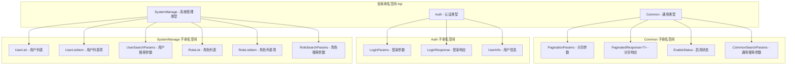
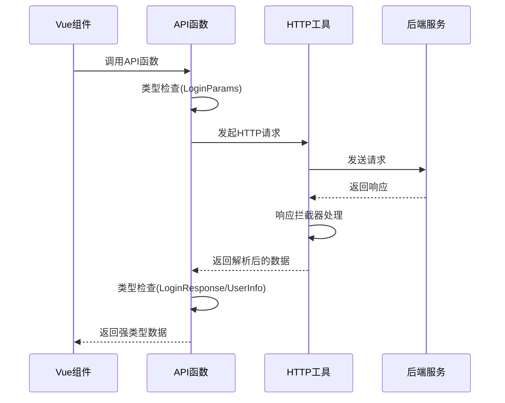
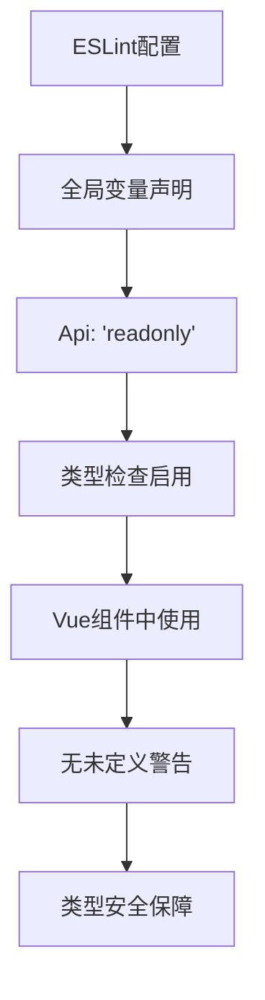

# API类型契约

<cite>
**本文档引用的文件**
- [src/types/api/api.d.ts](file://src/types/api/api.d.ts)
- [src/api/auth.ts](file://src/api/auth.ts)
- [src/api/system-manage.ts](file://src/api/system-manage.ts)
- [src/types/common/response.ts](file://src/types/common/response.ts)
- [src/types/common/index.ts](file://src/types/common/index.ts)
- [src/utils/http/index.ts](file://src/utils/http/index.ts)
- [eslint.config.mjs](file://eslint.config.mjs)
- [src/views/auth/login/index.vue](file://src/views/auth/login/index.vue)
- [src/views/system/user/index.vue](file://src/views/system/user/index.vue)
- [src/views/system/role/index.vue](file://src/views/system/role/index.vue)
- [src/types/index.ts](file://src/types/index.ts)
</cite>

## 目录
1. [概述](#概述)
2. [全局命名空间设计](#全局命名空间设计)
3. [核心接口类型定义](#核心接口类型定义)
4. [分页类型系统](#分页类型系统)
5. [API请求与响应类型绑定](#api请求与响应类型绑定)
6. [Vue组件中的类型使用](#vue组件中的类型使用)
7. [ESLint配置要求](#eslint配置要求)
8. [最佳实践与注意事项](#最佳实践与注意事项)
9. [总结](#总结)

## 概述

Art Design Pro项目采用了一套完整的API类型契约体系，通过全局命名空间`Api`实现了前后端接口的类型安全绑定。这套类型系统不仅提供了强类型支持，还确保了前后端数据结构的一致性，大大提升了开发效率和代码质量。

### 核心特性

- **全局命名空间设计**：通过`declare namespace Api`提供统一的类型入口
- **模块化组织**：按功能划分为`Auth`、`SystemManage`、`Common`等子命名空间
- **泛型支持**：广泛使用泛型实现灵活的数据类型定义
- **类型安全**：编译时确保请求参数和响应数据的类型正确性
- **零导入使用**：在Vue组件中无需显式导入即可使用类型

## 全局命名空间设计

### 命名空间结构



**图表来源**
- [src/types/api/api.d.ts](file://src/types/api/api.d.ts#L35-L135)

### 命名空间划分逻辑

全局命名空间`Api`按照功能领域进行清晰的划分：

1. **Common通用类型**：提供跨模块使用的基础设施类型
2. **Auth认证类型**：专门处理用户认证相关的类型定义
3. **SystemManage系统管理类型**：涵盖用户、角色、菜单等系统管理功能

这种划分遵循了单一职责原则，使得类型定义既具有内聚性又便于维护。

**章节来源**
- [src/types/api/api.d.ts](file://src/types/api/api.d.ts#L35-L135)

## 核心接口类型定义

### 认证相关类型

#### LoginParams - 登录参数类型

登录参数类型定义了用户登录时需要提供的基本信息：

```typescript
interface LoginParams {
  userName: string    // 用户名
  password: string    // 密码
}
```

该类型确保了登录请求必须包含用户名和密码两个必要字段，编译时就能捕获参数缺失的问题。

#### UserInfo - 用户信息类型

用户信息类型包含了用户的基本属性和权限信息：

```typescript
interface UserInfo {
  buttons: string[]     // 按钮权限列表
  roles: string[]      // 角色列表
  userId: number       // 用户ID
  userName: string     // 用户名
  email: string        // 邮箱
  avatar?: string      // 头像（可选）
}
```

这个类型的设计考虑了用户信息的完整性和扩展性，通过可选属性支持不同场景下的数据完整性。

### 系统管理类型

#### 用户相关类型

用户列表项类型定义了用户数据的标准结构：

```typescript
interface UserListItem {
  id: number                    // 主键ID
  avatar: string               // 头像URL
  status: string               // 用户状态
  userName: string             // 用户名
  userGender: string           // 性别
  nickName: string             // 昵称
  userPhone: string            // 手机号
  userEmail: string            // 邮箱
  userRoles: string[]          // 用户角色列表
  createBy: string             // 创建人
  createTime: string           // 创建时间
  updateBy: string             // 更新人
  updateTime: string           // 更新时间
}
```

#### 角色相关类型

角色列表项类型定义了角色数据的标准结构：

```typescript
interface RoleListItem {
  roleId: number              // 角色ID
  roleName: string           // 角色名称
  roleCode: string           // 角色编码
  description: string        // 角色描述
  enabled: boolean           // 是否启用
  createTime: string         // 创建时间
}
```

这些类型定义确保了系统管理功能中数据结构的一致性，便于后续的功能扩展和维护。

**章节来源**
- [src/types/api/api.d.ts](file://src/types/api/api.d.ts#L66-L134)

## 分页类型系统

### PaginationParams - 分页参数

分页参数是系统中最常用的查询参数之一，它定义了分页查询的基本要素：

```typescript
interface PaginationParams {
  current: number    // 当前页码
  size: number      // 每页条数
  total: number     // 总条数
}
```

这个类型为分页查询提供了标准化的参数结构，确保了不同接口间参数传递的一致性。

### CommonSearchParams - 通用搜索参数

通用搜索参数通过类型组合提供了灵活的搜索能力：

```typescript
type CommonSearchParams = Pick<PaginationParams, 'current' | 'size'>
```

这里使用了TypeScript的`Pick`工具类型，从`PaginationParams`中提取了`current`和`size`两个属性，形成了一个轻量级的搜索参数类型。

### PaginatedResponse<T> - 泛型分页响应

分页响应类型是整个类型系统中最复杂的泛型实现：

```typescript
interface PaginatedResponse<T = any> {
  records: T[]           // 数据记录数组
  current: number        // 当前页码
  size: number          // 每页条数
  total: number         // 总条数
}
```

#### 泛型应用详解

`PaginatedResponse<T>`是一个泛型接口，其中：
- `T`是数据记录的具体类型，默认为`any`
- `records`属性使用`T[]`表示数据记录数组
- 这种设计允许不同的业务模块使用相同的基础分页结构，同时保持数据类型的特异性

#### 实际应用场景

在系统管理模块中，分页响应类型的具体应用：

```typescript
// 用户列表类型
type UserList = Api.Common.PaginatedResponse<UserListItem>

// 角色列表类型  
type RoleList = Api.Common.PaginatedResponse<RoleListItem>
```

这种设计确保了：
1. **类型安全**：每个列表都有明确的数据类型
2. **结构一致**：所有分页响应都遵循相同的结构
3. **易于扩展**：新的业务模块可以轻松继承分页模式

**章节来源**
- [src/types/api/api.d.ts](file://src/types/api/api.d.ts#L39-L57)

## API请求与响应类型绑定

### HTTP请求封装

项目采用了基于Axios的HTTP请求封装，提供了统一的请求处理机制：



**图表来源**
- [src/api/auth.ts](file://src/api/auth.ts#L8-L29)
- [src/utils/http/index.ts](file://src/utils/http/index.ts#L166-L214)

### 认证API类型绑定

#### 登录API

登录API展示了完整的类型绑定流程：

```typescript
// API函数定义
export function fetchLogin(params: Api.Auth.LoginParams) {
  return request.post<Api.Auth.LoginResponse>({
    url: '/api/auth/login',
    params
  })
}

// 在Vue组件中使用
const { token, refreshToken } = await fetchLogin({
  userName: username,
  password
})
```

类型绑定过程：
1. **输入类型检查**：确保传入的参数符合`LoginParams`接口
2. **HTTP请求执行**：通过`request.post`发送请求
3. **响应类型检查**：确保返回的数据符合`LoginResponse`接口
4. **类型安全保障**：编译时和运行时的双重类型验证

#### 用户信息获取API

用户信息获取API展示了另一种类型绑定模式：

```typescript
export function fetchGetUserInfo() {
  return request.get<Api.Auth.UserInfo>({
    url: '/api/user/info'
  })
}
```

### 系统管理API类型绑定

#### 用户列表API

用户列表API展示了分页类型的完整应用：

```typescript
export function fetchGetUserList(params: Api.SystemManage.UserSearchParams) {
  return request.get<Api.SystemManage.UserList>({
    url: '/api/user/list',
    params
  })
}
```

#### 角色列表API

角色列表API同样使用了分页类型：

```typescript
export function fetchGetRoleList(params: Api.SystemManage.RoleSearchParams) {
  return request.get<Api.SystemManage.RoleList>({
    url: '/api/role/list',
    params
  })
}
```

### 响应类型系统

除了API特定的响应类型外，项目还提供了统一的基础响应类型：

```typescript
export interface BaseResponse<T = unknown> {
  code: number    // 状态码
  msg: string     // 消息
  data: T         // 数据
}
```

这个基础响应类型确保了所有API响应都遵循统一的结构，便于统一的错误处理和数据解析。

**章节来源**
- [src/api/auth.ts](file://src/api/auth.ts#L8-L29)
- [src/api/system-manage.ts](file://src/api/system-manage.ts#L5-L25)
- [src/types/common/response.ts](file://src/types/common/response.ts#L23-L30)

## Vue组件中的类型使用

### 直接使用全局类型

在Vue组件中，可以直接使用全局命名空间`Api`中的类型，无需显式导入：

```typescript
// 在Vue组件中直接使用
type UserListItem = Api.SystemManage.UserListItem
type RoleListItem = Api.SystemManage.RoleListItem
```

这种方式的优势：
- **零导入开销**：不需要在每个文件中单独导入类型
- **全局可用**：在任何地方都可以直接使用
- **类型一致性**：确保整个项目使用统一的类型定义

### 实际使用示例

#### 登录组件中的类型使用

在登录组件中，类型系统提供了完整的类型安全保障：

```typescript
// 登录表单数据类型
const formData = reactive({
  account: '',
  username: '',
  password: '',
  rememberPassword: true
})

// 登录请求参数类型
const { token, refreshToken } = await fetchLogin({
  userName: username,
  password
})
```

#### 用户管理组件中的类型使用

在用户管理组件中，类型系统确保了数据处理的正确性：

```typescript
// 用户列表数据类型
const {
  columns,
  columnChecks,
  data,
  loading,
  pagination,
  getData,
  searchParams,
  resetSearchParams,
  handleSizeChange,
  handleCurrentChange,
  refreshData
} = useTable({
  core: {
    apiFn: fetchGetUserList,
    apiParams: {
      current: 1,
      size: 20,
      ...searchForm.value
    }
  }
})
```

#### 角色管理组件中的类型使用

在角色管理组件中，类型系统提供了完整的类型支持：

```typescript
// 角色列表项类型
type RoleListItem = Api.SystemManage.RoleListItem

// 角色搜索表单类型
const searchForm = ref({
  roleName: undefined,
  roleCode: undefined,
  description: undefined,
  enabled: undefined,
  daterange: undefined
})
```

### 类型推导与智能提示

IDE能够根据全局类型定义提供智能提示：

```typescript
// 输入时自动提示
const user: Api.SystemManage.UserListItem = {
  id: 1,
  userName: 'admin',
  // 其他字段自动补全
}
```

这种类型推导机制大大提高了开发效率，减少了类型错误的发生。

**章节来源**
- [src/views/auth/login/index.vue](file://src/views/auth/login/index.vue#L116-L235)
- [src/views/system/user/index.vue](file://src/views/system/user/index.vue#L56-L261)
- [src/views/system/role/index.vue](file://src/views/system/role/index.vue#L70-L242)

## ESLint配置要求

### 全局变量配置

为了支持全局命名空间`Api`的使用，项目在ESLint配置中进行了特殊设置：

```javascript
// eslint.config.mjs 中的关键配置
{
  languageOptions: {
    globals: {
      ...autoImportConfig.globals,
      Api: 'readonly'
    }
  }
}
```

这个配置的作用：
- **Api全局可用**：告诉ESLint `Api`是一个只读的全局变量
- **避免未定义警告**：消除使用全局类型时的ESLint警告
- **类型安全检查**：保持TypeScript的类型检查功能

### 配置生效机制



**图表来源**
- [eslint.config.mjs](file://eslint.config.mjs#L47-L50)

### 配置文件位置

ESLint配置位于项目根目录的`eslint.config.mjs`文件中，通过`languageOptions.globals`属性声明了全局变量：

```javascript
// 关键配置片段
export default [
  {
    languageOptions: {
      globals: {
        // 合并从 autoImportConfig 中读取的全局变量配置
        ...autoImportConfig.globals,
        // TypeScript 全局命名空间
        Api: 'readonly'
      }
    }
  }
]
```

这种配置方式确保了：
1. **类型安全性**：TypeScript仍然提供完整的类型检查
2. **开发体验**：ESLint不会误报全局变量未定义的错误
3. **团队协作**：统一的配置确保团队成员使用相同的类型定义

**章节来源**
- [eslint.config.mjs](file://eslint.config.mjs#L47-L50)

## 最佳实践与注意事项

### 类型设计原则

1. **最小化原则**：只暴露必要的类型定义
2. **可扩展性**：预留扩展空间，避免过度限制
3. **一致性**：保持命名和结构的一致性
4. **文档化**：为复杂类型提供详细的注释说明

### 开发建议

#### 1. 类型优先设计

在开发新功能时，先定义类型再实现逻辑：

```typescript
// ✅ 推荐：先定义类型
interface NewFeatureParams {
  id: number
  name: string
  config?: Record<string, any>
}

// 再实现API函数
export function fetchNewFeature(params: NewFeatureParams) {
  return request.get<NewFeatureResponse>({
    url: '/api/new-feature',
    params
  })
}
```

#### 2. 类型安全的错误处理

利用类型系统进行错误处理：

```typescript
// 利用类型系统区分不同类型的错误
try {
  const result = await fetchSomeData()
  // 处理成功情况
} catch (error) {
  if (error instanceof HttpError) {
    // 处理HTTP错误
  } else {
    // 处理其他错误
  }
}
```

#### 3. 泛型的合理使用

在需要灵活性的场景下使用泛型：

```typescript
// ✅ 推荐：使用泛型提供灵活性
interface GenericResponse<T> {
  data: T
  metadata: {
    timestamp: string
    version: string
  }
}

// ❌ 避免：过度使用泛型导致复杂性
interface OverGenericResponse<T, U, V, W> {
  // 过多的泛型参数
}
```

### 性能考虑

1. **类型检查开销**：全局类型定义不会增加运行时开销
2. **编译性能**：合理的类型设计有助于提高编译速度
3. **内存使用**：类型系统只在编译时使用，不影响运行时性能

### 维护策略

1. **版本兼容性**：修改类型定义时注意向后兼容
2. **文档同步**：类型变更时及时更新相关文档
3. **测试覆盖**：为关键类型编写单元测试

## 总结

Art Design Pro项目的API类型契约体系展现了现代前端开发中类型安全的最佳实践。通过全局命名空间`Api`的设计，项目实现了：

### 核心优势

1. **类型安全保障**：编译时捕获类型错误，减少运行时问题
2. **开发效率提升**：智能提示和类型推导显著提高开发速度
3. **代码质量保证**：强类型约束确保代码的一致性和可靠性
4. **团队协作优化**：统一的类型定义促进团队间的协作

### 技术亮点

- **全局命名空间设计**：简洁而强大的类型组织方式
- **泛型应用**：灵活的数据类型处理机制
- **模块化划分**：清晰的功能边界和职责分离
- **ESLint集成**：完善的开发工具支持

### 应用价值

这套API类型契约体系不仅解决了当前的开发需求，更为项目的长期发展奠定了坚实的基础。通过类型驱动的开发方式，项目能够在快速迭代的同时保持高质量的代码标准，为构建稳定可靠的Web应用提供了强有力的技术保障。