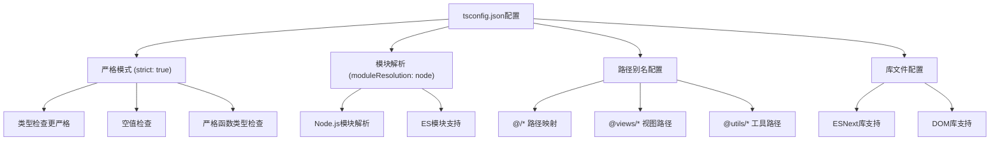
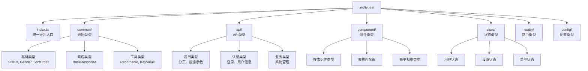
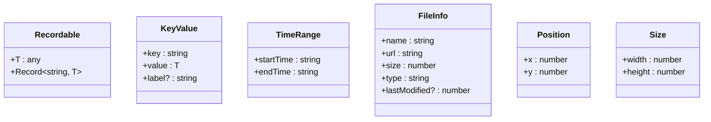
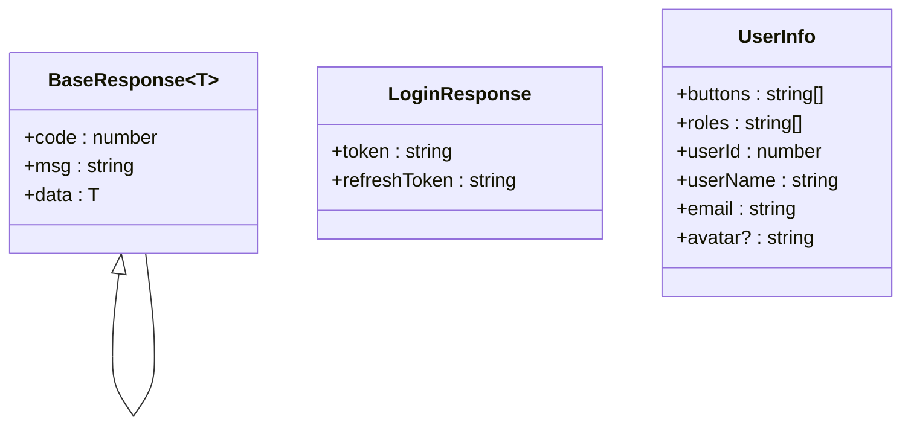
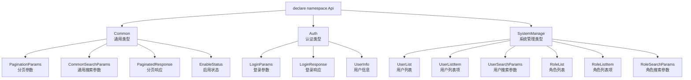
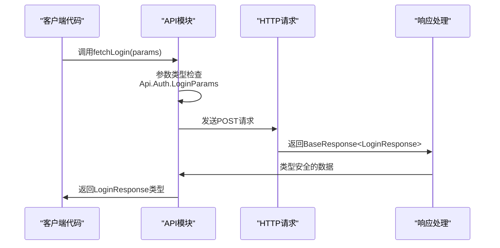
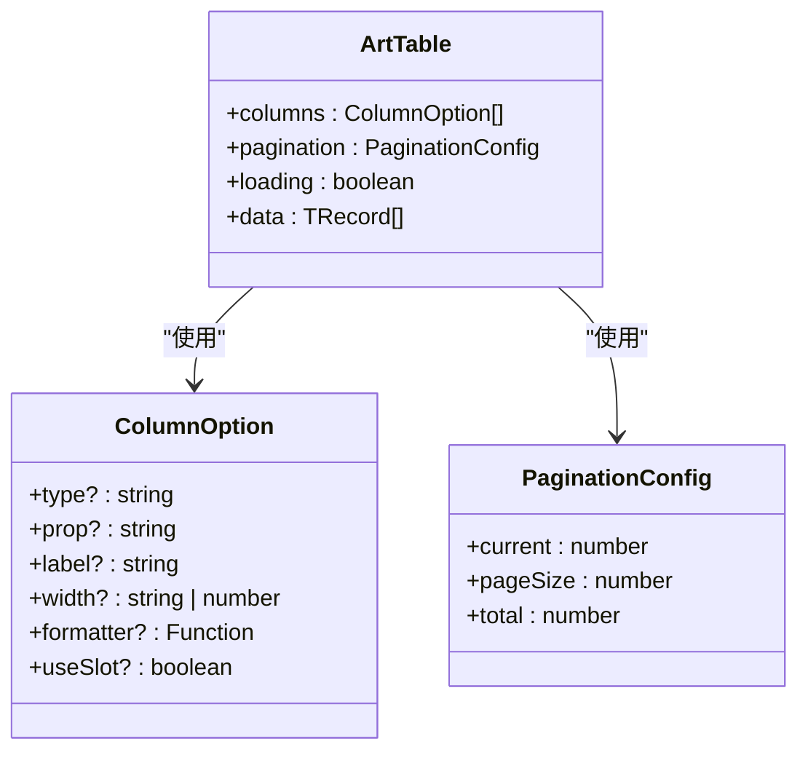
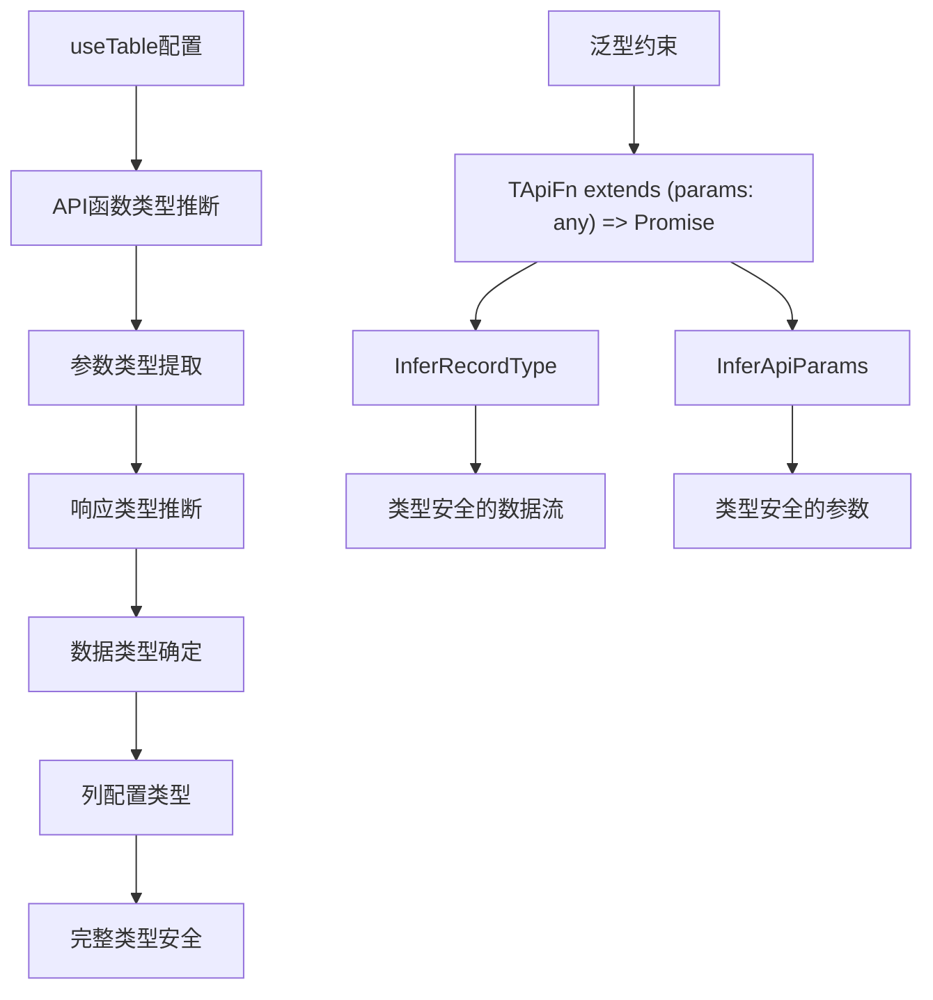

# TypeScript实践

<cite>
**本文档引用的文件**
- [tsconfig.json](file://tsconfig.json)
- [src/types/index.ts](file://src/types/index.ts)
- [src/types/common/index.ts](file://src/types/common/index.ts)
- [src/types/common/response.ts](file://src/types/common/response.ts)
- [src/types/api/api.d.ts](file://src/types/api/api.d.ts)
- [src/types/component/index.ts](file://src/types/component/index.ts)
- [src/types/store/index.ts](file://src/types/store/index.ts)
- [src/types/router/index.ts](file://src/types/router/index.ts)
- [src/types/config/index.ts](file://src/types/config/index.ts)
- [src/env.d.ts](file://src/env.d.ts)
- [src/api/auth.ts](file://src/api/auth.ts)
- [src/api/system-manage.ts](file://src/api/system-manage.ts)
- [src/hooks/core/useTable.ts](file://src/hooks/core/useTable.ts)
- [src/components/core/forms/art-form/index.vue](file://src/components/core/forms/art-form/index.vue)
- [src/components/core/tables/art-table/index.vue](file://src/components/core/tables/art-table/index.vue)
</cite>

## 目录
1. [概述](#概述)
2. [tsconfig.json编译配置详解](#tsconfigjson编译配置详解)
3. [类型定义文件组织架构](#类型定义文件组织架构)
4. [通用类型定义](#通用类型定义)
5. [API响应类型设计](#api响应类型设计)
6. [全局命名空间Api实现](#全局命名空间api实现)
7. [类型安全的端到端示例](#类型安全的端到端示例)
8. [最佳实践总结](#最佳实践总结)

## 概述

Art Design Pro采用严格的TypeScript配置，构建了一个完整的类型安全体系。该项目通过精心设计的类型定义架构，实现了从API接口到组件使用的全链路类型安全保障，大大提升了开发效率和代码质量。

## tsconfig.json编译配置详解

### 严格类型检查配置

项目启用了严格的TypeScript编译选项，确保类型安全：

**图表来源**
- [tsconfig.json](file://tsconfig.json#L2-L28)

### 关键配置解析

| 配置项 | 值 | 作用 | 影响 |
|--------|-----|------|------|
| `strict: true` | 启用 | 启用所有严格类型检查选项 | 提升类型安全性 |
| `moduleResolution: "node"` | node | 使用Node.js模块解析策略 | 支持现代模块语法 |
| `baseUrl: "."` | 当前目录 | 设置模块解析的基础路径 | 简化相对路径导入 |
| `paths` | 多个映射规则 | 定义路径别名 | 提高代码可读性 |

**章节来源**
- [tsconfig.json](file://tsconfig.json#L1-L29)

## 类型定义文件组织架构

### 层次化类型管理

项目采用模块化的类型定义架构，每个模块负责特定领域的类型定义：

**图表来源**
- [src/types/index.ts](file://src/types/index.ts#L1-L23)
- [src/types/common/index.ts](file://src/types/common/index.ts#L1-L96)

### 统一导出机制

通过统一的导出入口，简化了类型导入：

**章节来源**
- [src/types/index.ts](file://src/types/index.ts#L1-L23)

## 通用类型定义

### 基础业务类型

项目定义了一系列通用的基础业务类型，涵盖了常见的业务场景：

| 类型名称 | 定义 | 应用场景 | 示例 |
|----------|------|----------|------|
| `Status` | `0 \| 1` | 启用/禁用状态 | 用户状态、功能开关 |
| `Gender` | `'male' \| 'female' \| 'unknown'` | 性别枚举 | 用户性别、生物性别 |
| `SortOrder` | `'ascending' \| 'descending'` | 排序方向 | 表格排序、搜索结果排序 |
| `ActionType` | `'create' \| 'update' \| 'delete' \| 'view'` | 操作类型 | CRUD操作标识 |
| `EnableStatus` | `'1' \| '2'` | 启用状态字符串 | 数据库状态字段 |

### 工具类型定义

项目提供了丰富的工具类型，提升开发效率：

**图表来源**
- [src/types/common/index.ts](file://src/types/common/index.ts#L46-L80)

**章节来源**
- [src/types/common/index.ts](file://src/types/common/index.ts#L1-L96)

## API响应类型设计

### BaseResponse泛型设计

项目的核心API响应类型采用了强大的泛型设计：

**图表来源**
- [src/types/common/response.ts](file://src/types/common/response.ts#L23-L30)

### 泛型优势

1. **类型安全**：确保响应数据与预期类型匹配
2. **自动推断**：编译器自动推断返回类型
3. **错误预防**：避免运行时类型错误
4. **开发体验**：提供完整的IDE类型提示

**章节来源**
- [src/types/common/response.ts](file://src/types/common/response.ts#L1-L31)

## 全局命名空间Api实现

### 命名空间架构

项目通过全局命名空间Api实现了完整的接口类型定义：

**图表来源**
- [src/types/api/api.d.ts](file://src/types/api/api.d.ts#L35-L135)

### 使用方式

全局命名空间的设计使得类型定义可以直接使用，无需导入：

**章节来源**
- [src/types/api/api.d.ts](file://src/types/api/api.d.ts#L1-L136)

## 类型安全的端到端示例

### API调用示例

以下是完整的类型安全API调用流程：

**图表来源**
- [src/api/auth.ts](file://src/api/auth.ts#L8-L14)

### 组件使用示例

表格组件展示了完整的类型集成：

**图表来源**
- [src/components/core/tables/art-table/index.vue](file://src/components/core/tables/art-table/index.vue#L78-L200)

### Hook类型推断

useTable Hook展示了高级的类型推断能力：

**图表来源**
- [src/hooks/core/useTable.ts](file://src/hooks/core/useTable.ts#L115-L130)

**章节来源**
- [src/api/auth.ts](file://src/api/auth.ts#L1-L30)
- [src/api/system-manage.ts](file://src/api/system-manage.ts#L1-L26)
- [src/hooks/core/useTable.ts](file://src/hooks/core/useTable.ts#L1-L212)

## 最佳实践总结

### 配置层面的最佳实践

1. **严格模式启用**：始终启用`strict: true`确保类型安全
2. **路径别名**：合理使用路径别名提高代码可维护性
3. **模块解析**：选择合适的模块解析策略
4. **库文件配置**：包含必要的库文件支持

### 类型定义层面的最佳实践

1. **模块化组织**：按功能领域划分类型定义
2. **统一导出**：提供简洁的类型导入接口
3. **泛型设计**：充分利用泛型提升类型灵活性
4. **命名规范**：采用清晰的命名约定

### 开发层面的最佳实践

1. **类型推断**：让编译器自动推断类型
2. **接口约束**：使用接口而非类型别名
3. **联合类型**：使用联合类型表示枚举值
4. **可选属性**：合理使用可选属性

### 性能层面的最佳实践

1. **类型缓存**：利用TypeScript的类型缓存机制
2. **增量编译**：启用增量编译提升构建速度
3. **类型检查**：在必要时进行类型检查而非断言

通过遵循这些最佳实践，Art Design Pro构建了一个健壮、可维护的TypeScript类型安全体系，为开发者提供了优秀的开发体验和代码质量保障。