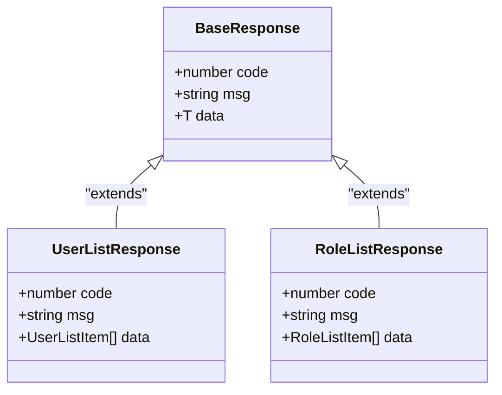
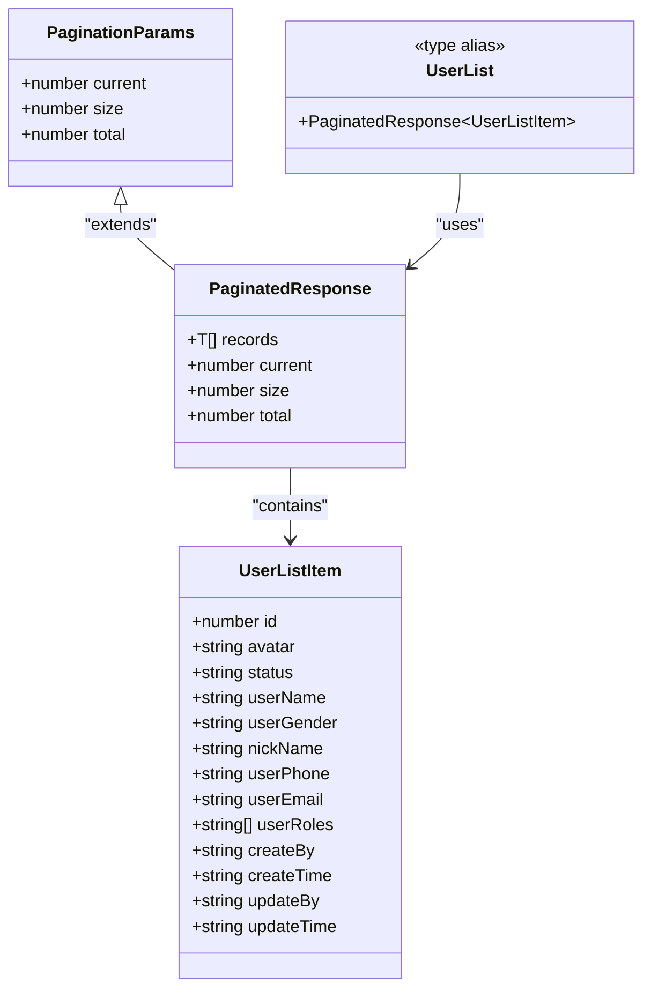
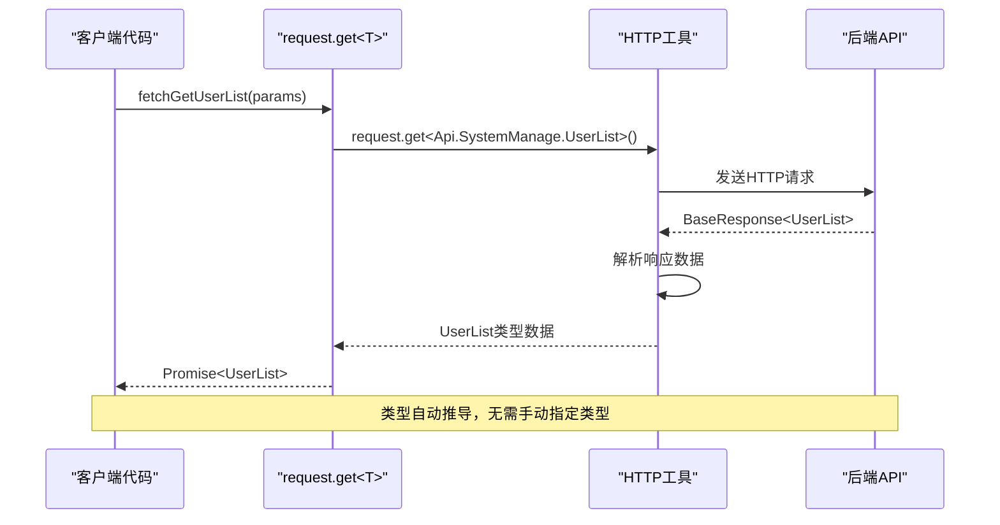
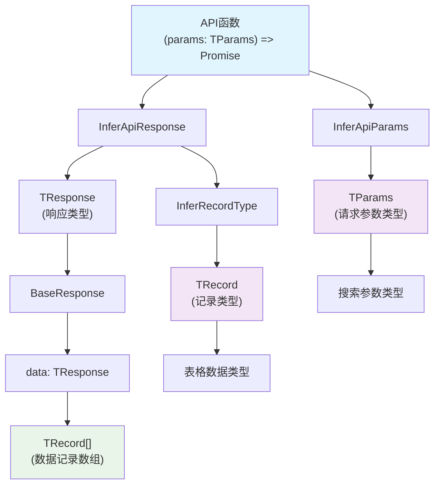
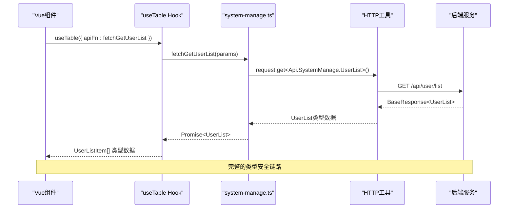
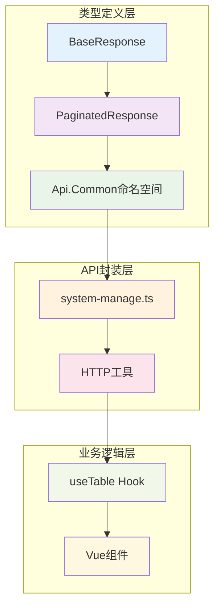

# 泛型设计模式

<cite>
**本文档引用的文件**
- [src/types/common/response.ts](file://src/types/common/response.ts)
- [src/types/api/api.d.ts](file://src/types/api/api.d.ts)
- [src/api/system-manage.ts](file://src/api/system-manage.ts)
- [src/utils/http/index.ts](file://src/utils/http/index.ts)
- [src/hooks/core/useTable.ts](file://src/hooks/core/useTable.ts)
- [src/utils/table/tableUtils.ts](file://src/utils/table/tableUtils.ts)
- [src/views/examples/tables/index.vue](file://src/views/examples/tables/index.vue)
- [src/types/common/index.ts](file://src/types/common/index.ts)
</cite>

## 目录
1. [引言](#引言)
2. [BaseResponse<T>泛型响应结构](#baseresponset泛型响应结构)
3. [PaginatedResponse<T>分页响应设计](#paginatedresponset分页响应设计)
4. [HTTP请求封装中的类型推导](#http请求封装中的类型推导)
5. [useTable Hook的类型推导机制](#usetable-hook的类型推导机制)
6. [实际应用案例分析](#实际应用案例分析)
7. [最佳实践与设计原则](#最佳实践与设计原则)
8. [总结](#总结)

## 引言

在现代前端开发中，类型安全是构建高质量应用程序的关键要素。本项目采用了一套完整的泛型设计模式，通过BaseResponse<T>和PaginatedResponse<T>等核心类型，实现了从API响应处理到组件使用的全链路类型安全。这种设计不仅提高了代码的可维护性，还为开发者提供了强大的类型提示和自动推导能力。

## BaseResponse<T>泛型响应结构

### 核心设计理念

BaseResponse<T>是整个类型系统的基础，它提供了一个统一的API响应结构，通过泛型参数T来适配不同的数据类型。

**图表来源**
- [src/types/common/response.ts](file://src/types/common/response.ts#L23-L30)

### 类型安全性优势

BaseResponse<T>的设计体现了以下类型安全优势：

1. **明确的数据结构约束**：每个响应都必须包含code、msg和data三个字段
2. **泛型参数适配**：通过T参数可以精确指定data字段的数据类型
3. **编译时类型检查**：确保API响应数据的正确性

### 实现细节分析

BaseResponse接口的定义展示了泛型的最佳实践：

- **默认类型参数**：`T = unknown`提供了灵活性
- **字段类型明确**：code为number，msg为string，data为泛型T
- **类型约束**：通过泛型确保数据类型的准确性

**章节来源**
- [src/types/common/response.ts](file://src/types/common/response.ts#L22-L30)

## PaginatedResponse<T>分页响应设计

### 分页响应结构

PaginatedResponse<T>专门用于处理分页数据的响应结构，它继承了通用的分页参数，并通过泛型适配具体的实体类型。

**图表来源**
- [src/types/api/api.d.ts](file://src/types/api/api.d.ts#L39-L57)
- [src/types/api/api.d.ts](file://src/types/api/api.d.ts#L90-L108)

### 泛型适配机制

PaginatedResponse<T>通过泛型参数T实现了对不同实体类型的适配：

1. **records字段**：使用泛型T作为数组元素类型
2. **类型别名简化**：如UserList = PaginatedResponse<UserListItem>
3. **灵活的类型约束**：支持任意类型的实体列表

### 分页参数设计

分页参数的设计体现了类型系统的完整性：

- **current字段**：当前页码，number类型
- **size字段**：每页条数，number类型  
- **total字段**：总条数，number类型
- **records字段**：数据记录，T[]类型

**章节来源**
- [src/types/api/api.d.ts](file://src/types/api/api.d.ts#L39-L57)

## HTTP请求封装中的类型推导

### 请求函数的泛型设计

HTTP请求封装通过泛型实现了类型自动推导，避免了any类型的使用。

**图表来源**
- [src/utils/http/index.ts](file://src/utils/http/index.ts#L166-L185)
- [src/api/system-manage.ts](file://src/api/system-manage.ts#L5-L9)

### 类型推导机制

HTTP请求封装实现了多层次的类型推导：

1. **API函数层面**：通过泛型参数指定期望的响应类型
2. **HTTP工具层面**：自动解析BaseResponse结构
3. **数据提取层面**：提取data字段的具体类型

### 避免any类型使用

通过泛型设计，项目完全避免了any类型的使用：

- **明确的类型约束**：每个API响应都有明确的类型定义
- **编译时检查**：类型错误在编译阶段就被发现
- **IDE智能提示**：提供完整的类型提示和自动补全

**章节来源**
- [src/utils/http/index.ts](file://src/utils/http/index.ts#L166-L185)

## useTable Hook的类型推导机制

### 类型推导工具类型

useTable Hook实现了复杂的类型推导机制，通过多个工具类型实现自动类型推导。

**图表来源**
- [src/hooks/core/useTable.ts](file://src/hooks/core/useTable.ts#L39-L42)

### 工具类型详解

项目使用了三个关键的工具类型来实现类型推导：

1. **InferApiParams<T>**：从API函数推导请求参数类型
2. **InferApiResponse<T>**：从API函数推导响应类型
3. **InferRecordType<T>**：从分页响应推导记录类型

### 配置接口设计

UseTableConfig接口通过泛型参数实现了完整的类型推导：

- **TApiFn**：API函数类型
- **TRecord**：记录类型（自动推导）
- **TParams**：请求参数类型（自动推导）
- **TResponse**：响应类型（自动推导）

**章节来源**
- [src/hooks/core/useTable.ts](file://src/hooks/core/useTable.ts#L39-L78)

## 实际应用案例分析

### getUserList()接口调用

以getUserList()接口为例，展示完整的类型安全流程。

**图表来源**
- [src/api/system-manage.ts](file://src/api/system-manage.ts#L5-L9)
- [src/views/examples/tables/index.vue](file://src/views/examples/tables/index.vue#L685-L686)

### 类型自动推导效果

在实际使用中，getUserList()接口展现了强大的类型推导能力：

1. **函数签名**：`fetchGetUserList(params: Api.SystemManage.UserSearchParams)`
2. **返回类型**：`Promise<Api.SystemManage.UserList>`
3. **数据类型**：`Promise<Api.Common.PaginatedResponse<UserListItem>>`

### 开发体验提升

这种设计显著提升了开发体验：

- **零配置使用**：无需手动指定类型参数
- **智能提示**：IDE提供完整的类型提示
- **错误预防**：类型错误在编译阶段被发现

**章节来源**
- [src/api/system-manage.ts](file://src/api/system-manage.ts#L5-L9)
- [src/views/examples/tables/index.vue](file://src/views/examples/tables/index.vue#L685-L686)

## 最佳实践与设计原则

### 类型设计原则

项目在泛型设计中遵循了以下原则：

1. **最小化约束**：使用泛型参数而不是具体类型
2. **最大化推导**：通过工具类型实现自动类型推导
3. **向下兼容**：新版本保持与旧版本的兼容性
4. **清晰表达**：类型定义清晰表达业务含义

### 架构设计模式

项目采用了以下架构设计模式：

### 性能优化考虑

在泛型设计中，项目也考虑了性能因素：

- **编译时优化**：类型推导在编译时完成
- **运行时无开销**：类型信息在编译后被擦除
- **内存效率**：合理的类型定义避免内存浪费

### 可维护性设计

为了提高可维护性，项目采用了以下策略：

1. **集中式类型定义**：所有类型定义集中在特定目录
2. **命名空间隔离**：不同模块使用独立的命名空间
3. **文档化注释**：详细的JSDoc注释帮助理解类型用途
4. **测试覆盖**：类型定义有相应的测试保障

## 总结

本项目通过BaseResponse<T>和PaginatedResponse<T>等核心泛型设计，建立了一个完整的类型安全体系。这套设计模式不仅确保了API响应的类型安全，还通过useTable Hook实现了复杂的类型自动推导，大大提升了开发效率和代码质量。

### 关键优势

1. **类型安全**：从API响应到组件使用的全链路类型安全
2. **自动推导**：复杂的类型推导机制减少手动配置
3. **开发体验**：优秀的IDE支持和智能提示
4. **可维护性**：清晰的类型定义和良好的架构设计

### 应用价值

这种泛型设计模式特别适合大型企业级应用，能够：

- **降低开发成本**：减少类型相关的bug
- **提高开发效率**：智能的类型提示和自动推导
- **增强代码质量**：编译时的类型检查
- **便于团队协作**：清晰的类型定义促进团队沟通

通过系统性的泛型设计，项目实现了类型安全与开发效率的完美平衡，为现代前端开发提供了优秀的参考范例。