# 类型定义规范

<cite>
**本文档引用的文件**
- [src/types/index.ts](file://src/types/index.ts)
- [src/types/common/index.ts](file://src/types/common/index.ts)
- [src/types/component/index.ts](file://src/types/component/index.ts)
- [src/types/store/index.ts](file://src/types/store/index.ts)
- [src/types/router/index.ts](file://src/types/router/index.ts)
- [src/types/config/index.ts](file://src/types/config/index.ts)
- [src/types/common/response.ts](file://src/types/common/response.ts)
- [src/types/component/chart.ts](file://src/types/component/chart.ts)
- [src/types/api/api.d.ts](file://src/types/api/api.d.ts)
- [src/store/modules/user.ts](file://src/store/modules/user.ts)
- [src/views/system/user/index.vue](file://src/views/system/user/index.vue)
</cite>

## 目录
1. [概述](#概述)
2. [类型定义架构](#类型定义架构)
3. [统一入口设计](#统一入口设计)
4. [模块化分类策略](#模块化分类策略)
5. [基础类型定义](#基础类型定义)
6. [业务类型定义](#业务类型定义)
7. [类型复用机制](#类型复用机制)
8. [交叉类型应用](#交叉类型应用)
9. [实际应用示例](#实际应用示例)
10. [最佳实践指南](#最佳实践指南)
11. [总结](#总结)

## 概述

Art Design Pro采用了一套完整的类型定义体系，通过src/types目录实现了类型系统的模块化管理和统一入口设计。该体系涵盖了从基础类型到业务类型的全方位类型定义，确保了代码的类型安全性和可维护性。

## 类型定义架构

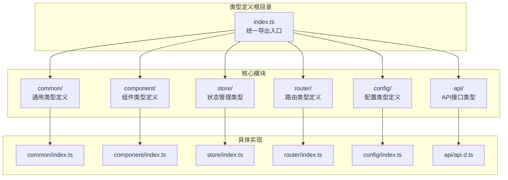

**图表来源**
- [src/types/index.ts](file://src/types/index.ts#L1-L23)

**章节来源**
- [src/types/index.ts](file://src/types/index.ts#L1-L23)

## 统一入口设计

### src/types/index.ts的核心作用

src/types/index.ts作为整个类型系统的统一入口，提供了模块化的类型导出机制：

```mermaid
flowchart LR
A[应用代码] --> B[import { UserState } from '@/types']
B --> C[src/types/index.ts]
C --> D[./common]
C --> E[./component]
C --> F[./store]
C --> G[./router]
C --> H[./config]
D --> I[基础类型]
E --> J[组件类型]
F --> K[状态类型]
G --> L[路由类型]
H --> M[配置类型]
```

**图表来源**
- [src/types/index.ts](file://src/types/index.ts#L10-L22)

### 导出策略

每个模块都采用统一的导出策略：
- **通配符导出**：使用`export * from './module'`实现批量导出
- **语义化注释**：为每个导出添加清晰的描述性注释
- **模块独立性**：各模块保持独立，便于维护和扩展

**章节来源**
- [src/types/index.ts](file://src/types/index.ts#L1-L23)

## 模块化分类策略

### common模块 - 通用类型定义

common模块提供项目中最基础和通用的类型定义：

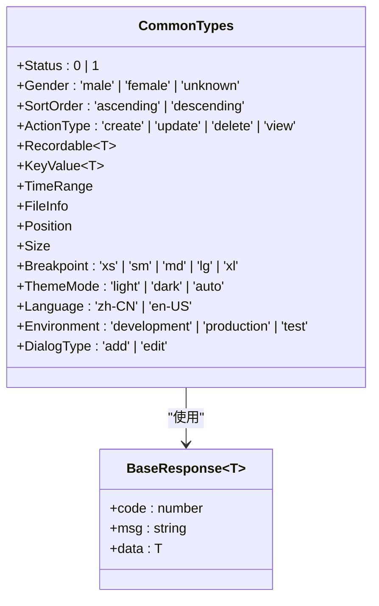

**图表来源**
- [src/types/common/index.ts](file://src/types/common/index.ts#L33-L96)
- [src/types/common/response.ts](file://src/types/common/response.ts#L23-L30)

### component模块 - 组件类型定义

component模块专注于UI组件相关的类型定义：

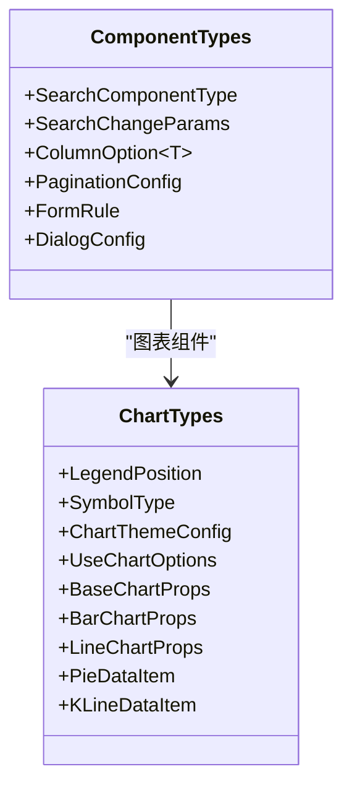

**图表来源**
- [src/types/component/index.ts](file://src/types/component/index.ts#L24-L146)
- [src/types/component/chart.ts](file://src/types/component/chart.ts#L30-L325)

### store模块 - 状态管理类型

store模块定义了Pinia状态管理相关的类型：

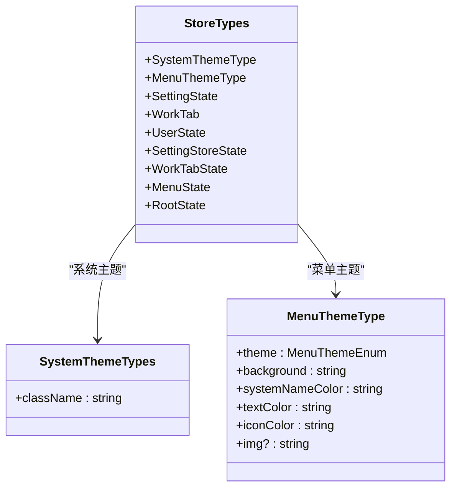

**图表来源**
- [src/types/store/index.ts](file://src/types/store/index.ts#L30-L158)

### router模块 - 路由类型定义

router模块处理路由相关的类型定义：

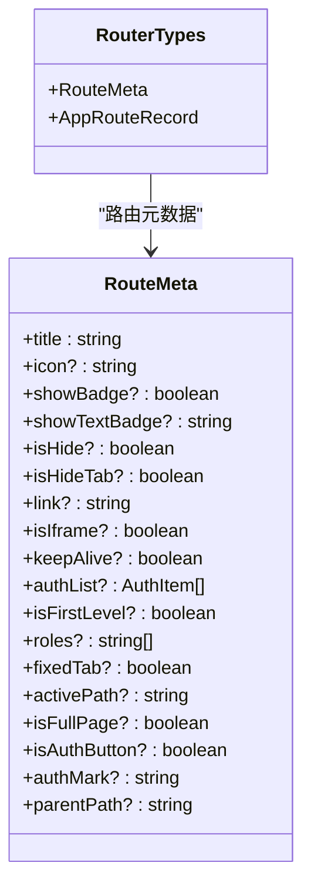

**图表来源**
- [src/types/router/index.ts](file://src/types/router/index.ts#L29-L81)

### config模块 - 配置类型定义

config模块定义系统配置相关的类型：

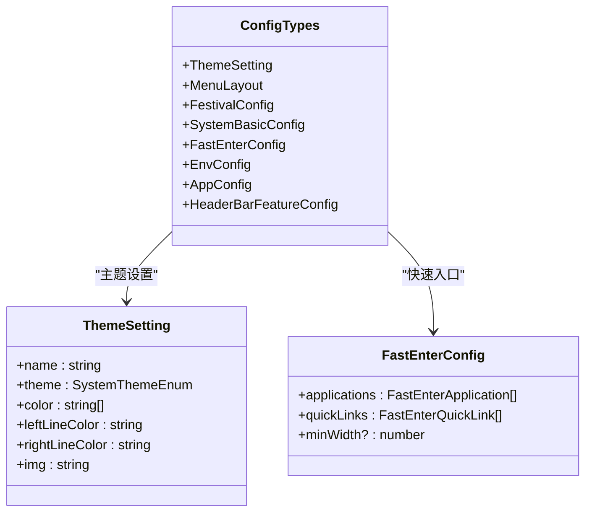

**图表来源**
- [src/types/config/index.ts](file://src/types/config/index.ts#L31-L212)

**章节来源**
- [src/types/common/index.ts](file://src/types/common/index.ts#L1-L96)
- [src/types/component/index.ts](file://src/types/component/index.ts#L1-L146)
- [src/types/store/index.ts](file://src/types/store/index.ts#L1-L158)
- [src/types/router/index.ts](file://src/types/router/index.ts#L1-L81)
- [src/types/config/index.ts](file://src/types/config/index.ts#L1-L212)

## 基础类型定义

### 枚举类型

基础枚举类型提供了严格的值约束：

| 类型名称 | 定义范围 | 使用场景 |
|---------|---------|---------|
| `Status` | `0 \| 1` | 启用/禁用状态 |
| `Gender` | `'male' \| 'female' \| 'unknown'` | 性别标识 |
| `SortOrder` | `'ascending' \| 'descending'` | 排序方向 |
| `ActionType` | `'create' \| 'update' \| 'delete' \| 'view'` | 操作类型 |
| `Breakpoint` | `'xs' \| 'sm' \| 'md' \| 'lg' \| 'xl'` | 响应式断点 |
| `ThemeMode` | `'light' \| 'dark' \| 'auto'` | 主题模式 |
| `Language` | `'zh-CN' \| 'en-US'` | 语言设置 |
| `Environment` | `'development' \| 'production' \| 'test'` | 环境标识 |
| `DialogType` | `'add' \| 'edit'` | 弹窗类型 |

### 工具类型

工具类型提供了类型操作和组合能力：

| 类型名称 | 定义 | 功能描述 |
|---------|------|---------|
| `Recordable<T>` | `Record<string, T>` | 可选的记录类型 |
| `KeyValue<T>` | `{key: string, value: T, label?: string}` | 键值对类型 |
| `TimeRange` | `{startTime: string, endTime: string}` | 时间范围类型 |
| `FileInfo` | `{name: string, url: string, size: number, type: string, lastModified?: number}` | 文件信息类型 |
| `Position` | `{x: number, y: number}` | 坐标类型 |
| `Size` | `{width: number, height: number}` | 尺寸类型 |

### 响应式类型

响应式类型确保API响应的一致性：

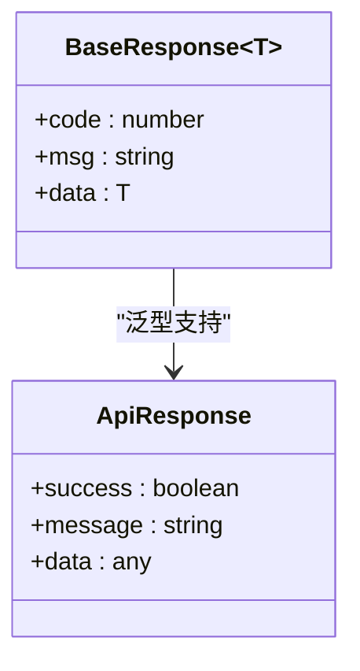

**图表来源**
- [src/types/common/response.ts](file://src/types/common/response.ts#L23-L30)

**章节来源**
- [src/types/common/index.ts](file://src/types/common/index.ts#L33-L96)
- [src/types/common/response.ts](file://src/types/common/response.ts#L1-L31)

## 业务类型定义

### 用户状态类型

用户状态类型定义了用户相关的完整状态结构：

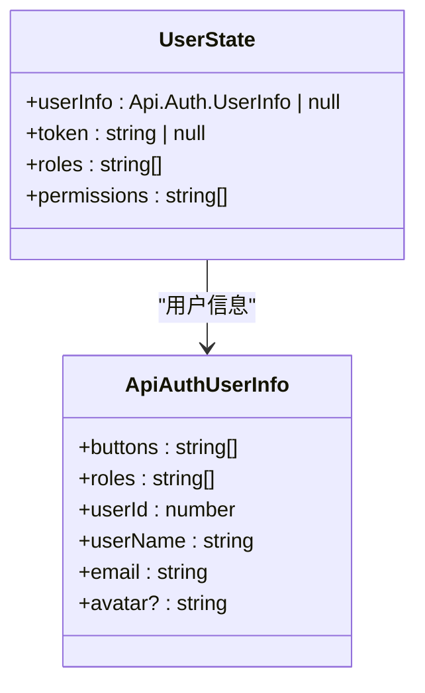

**图表来源**
- [src/types/store/index.ts](file://src/types/store/index.ts#L104-L113)

### 表格配置类型

表格配置类型提供了完整的表格组件配置：

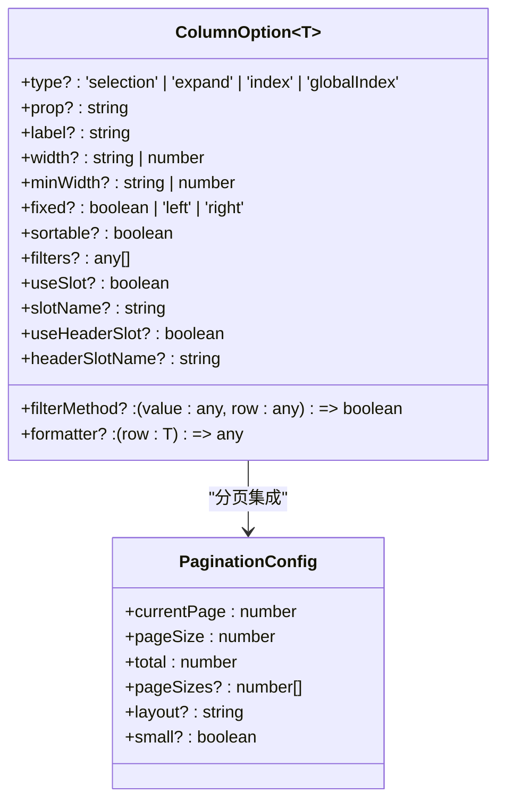

**图表来源**
- [src/types/component/index.ts](file://src/types/component/index.ts#L48-L89)

### 图表类型系统

图表类型系统提供了完整的图表组件类型定义：

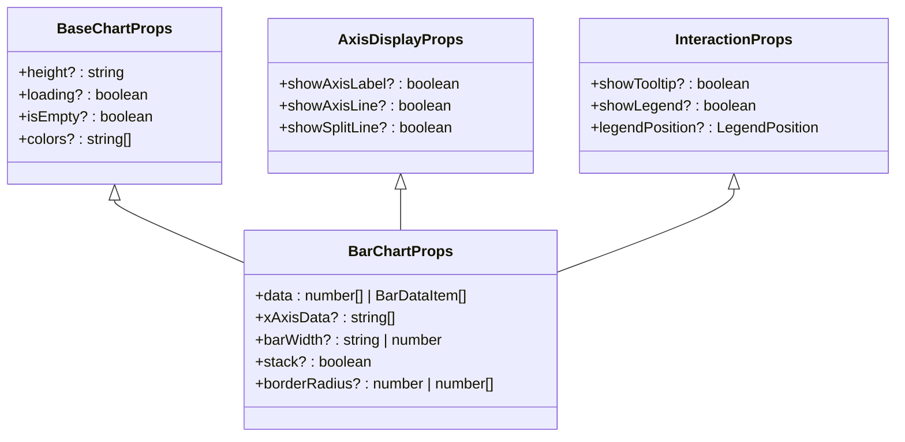

**图表来源**
- [src/types/component/chart.ts](file://src/types/component/chart.ts#L71-L126)

**章节来源**
- [src/types/store/index.ts](file://src/types/store/index.ts#L104-L158)
- [src/types/component/index.ts](file://src/types/component/index.ts#L48-L146)
- [src/types/component/chart.ts](file://src/types/component/chart.ts#L71-L325)

## 类型复用机制

### 模块间类型共享

类型系统通过模块化设计实现了高效的类型复用：

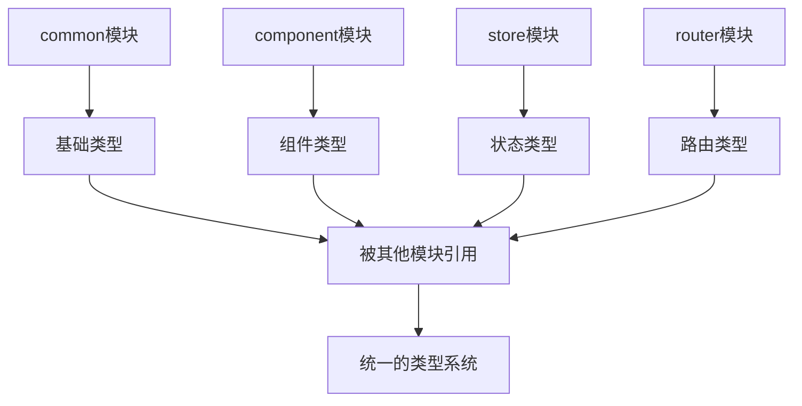

### 泛型类型复用

泛型类型提供了灵活的类型复用机制：

| 泛型类型 | 使用场景 | 示例 |
|---------|---------|------|
| `BaseResponse<T>` | API响应类型 | `BaseResponse<UserInfo>` |
| `Recordable<T>` | 键值对类型 | `Recordable<string>` |
| `ColumnOption<T>` | 表格列配置 | `ColumnOption<UserItem>` |
| `KeyValue<T>` | 配置项类型 | `KeyValue<number>` |

### 接口继承与扩展

通过接口继承实现了类型的功能扩展：

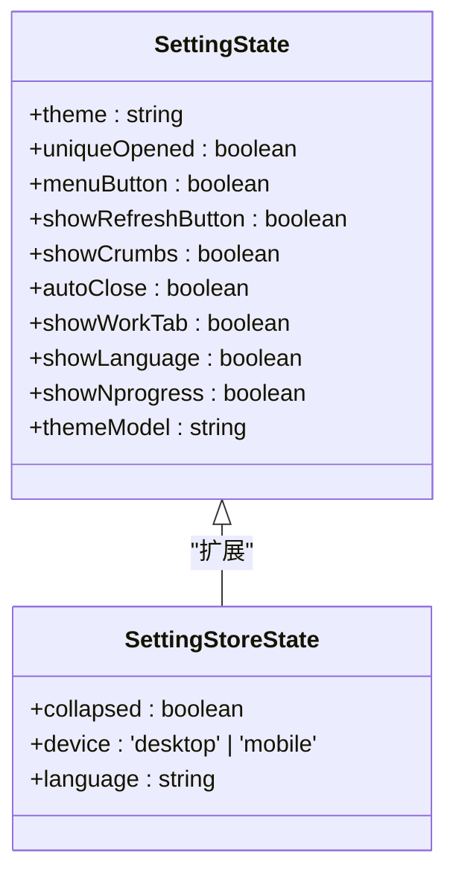

**图表来源**
- [src/types/store/index.ts](file://src/types/store/index.ts#L57-L125)

**章节来源**
- [src/types/common/response.ts](file://src/types/common/response.ts#L23-L30)
- [src/types/component/index.ts](file://src/types/component/index.ts#L48-L89)
- [src/types/store/index.ts](file://src/types/store/index.ts#L57-L125)

## 交叉类型应用

### 类型组合模式

类型系统采用了多种类型组合模式：

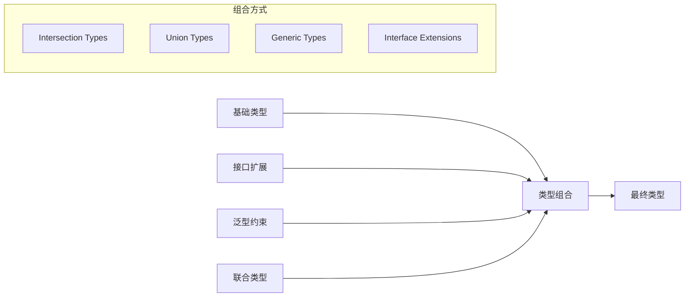

### 实际组合应用

在图表组件中展示了复杂的类型组合：


**图表来源**
- [src/types/component/chart.ts](file://src/types/component/chart.ts#L114-L126)

### 类型保护机制

通过交叉类型实现了类型保护：

| 保护机制 | 实现方式 | 应用场景 |
|---------|---------|---------|
| 类型守卫 | `typeof`、`in`操作符 | 运行时类型检查 |
| 接口断言 | `as`关键字 | 类型转换 |
| 泛型约束 | `extends`关键字 | 类型限制 |
| 可选属性 | `?`修饰符 | 可选字段处理 |

**章节来源**
- [src/types/component/chart.ts](file://src/types/component/chart.ts#L114-L126)

## 实际应用示例

### 组件中安全引入状态类型

在Vue组件中通过统一入口安全引入类型：

```typescript
// 用户管理页面示例
import { DialogType } from '@/types'

// 弹窗类型安全使用
const dialogType = ref<DialogType>('add')
const currentUserData = ref<Partial<UserListItem>>({})
```

### 状态管理中的类型应用

在Pinia store中应用类型定义：

```typescript
// 用户状态管理
import { UserState } from '@/types'

export const useUserStore = defineStore('userStore', () => {
  const info = ref<Partial<Api.Auth.UserInfo>>({})
  const token = ref<string | null>(null)
  
  const setUserInfo = (newInfo: Api.Auth.UserInfo) => {
    info.value = newInfo
  }
})
```

### API接口类型应用

在API调用中使用类型定义：

```typescript
// API类型使用
const params: Api.Auth.LoginParams = { 
  userName: 'admin', 
  password: '123456' 
}

const response: Api.Auth.UserInfo = await fetchUserInfo()
```

### 表格组件类型应用

在表格组件中应用类型定义：

```typescript
// 表格列配置类型
const columns: ColumnOption<UserItem>[] = [
  {
    prop: 'userName',
    label: '用户名',
    width: 150,
    sortable: true,
    formatter: (row) => row.userName
  }
]
```

**章节来源**
- [src/views/system/user/index.vue](file://src/views/system/user/index.vue#L52-L62)
- [src/store/modules/user.ts](file://src/store/modules/user.ts#L52-L62)
- [src/types/api/api.d.ts](file://src/types/api/api.d.ts#L26-L29)
- [src/types/component/index.ts](file://src/types/component/index.ts#L48-L89)

## 最佳实践指南

### 类型定义原则

1. **单一职责原则**：每个类型模块负责特定领域的类型定义
2. **最小暴露原则**：只导出必要的类型，避免类型污染
3. **一致性原则**：保持类型命名和结构的一致性
4. **可扩展性原则**：设计时考虑未来的扩展需求

### 命名规范

| 类型类别 | 命名规范 | 示例 |
|---------|---------|------|
| 枚举类型 | PascalCase | `Status`, `Gender` |
| 接口类型 | I + PascalCase | `IUserState` |
| 泛型类型 | T + PascalCase | `TUserItem` |
| 工具类型 | PascalCase | `Recordable`, `KeyValue` |
| 响应类型 | Base + PascalCase | `BaseResponse` |

### 类型设计模式

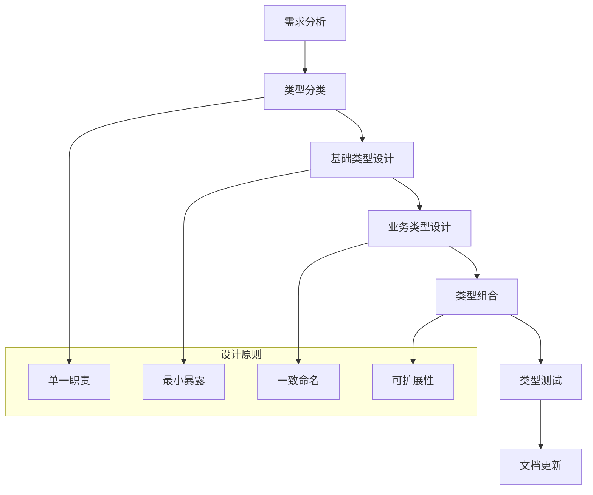

### 性能优化建议

1. **按需导入**：避免一次性导入所有类型
2. **类型缓存**：合理利用TypeScript的类型缓存机制
3. **避免循环依赖**：保持类型定义的扁平化结构
4. **及时清理**：定期清理未使用的类型定义

### 维护策略

1. **版本控制**：为类型定义建立版本管理
2. **变更追踪**：记录类型变更的影响范围
3. **兼容性检查**：确保类型变更的向后兼容性
4. **自动化测试**：建立类型定义的自动化测试流程

## 总结

Art Design Pro的类型定义体系展现了现代前端项目中类型系统设计的最佳实践。通过src/types/index.ts作为统一入口，实现了类型系统的模块化管理和高效复用。各个模块分工明确，从基础类型到业务类型形成了完整的类型生态。

该类型体系的主要优势包括：

1. **模块化设计**：清晰的模块边界和职责划分
2. **统一入口**：简洁的导入方式和良好的开发体验
3. **类型复用**：高效的类型共享和组合机制
4. **扩展性强**：灵活的类型设计支持未来扩展
5. **维护性好**：清晰的命名规范和文档体系

通过遵循这套类型定义规范，开发者可以构建更加类型安全、易于维护的前端应用程序，显著提升开发效率和代码质量。