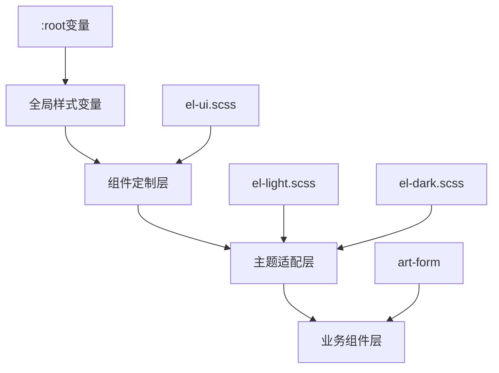
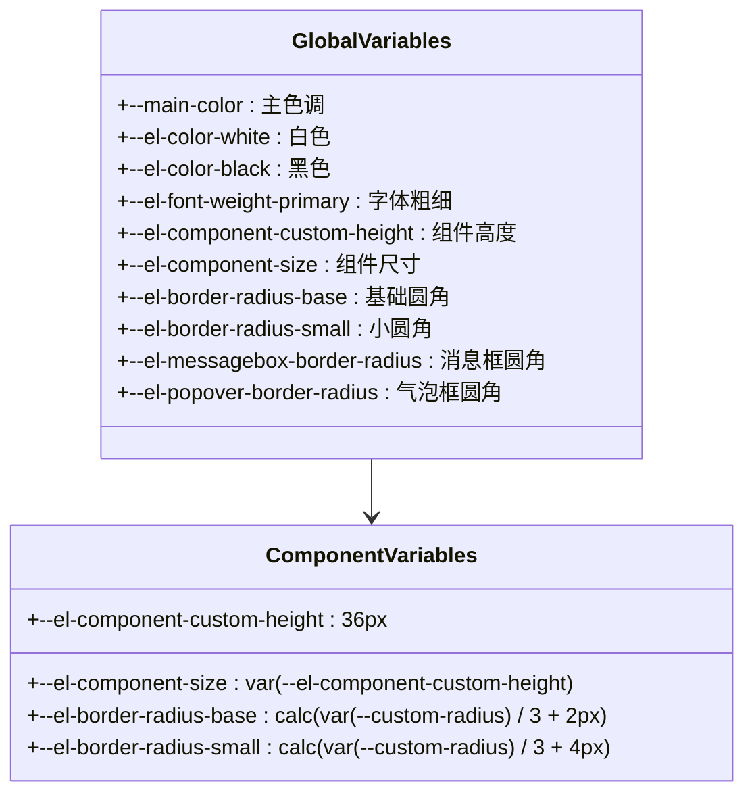
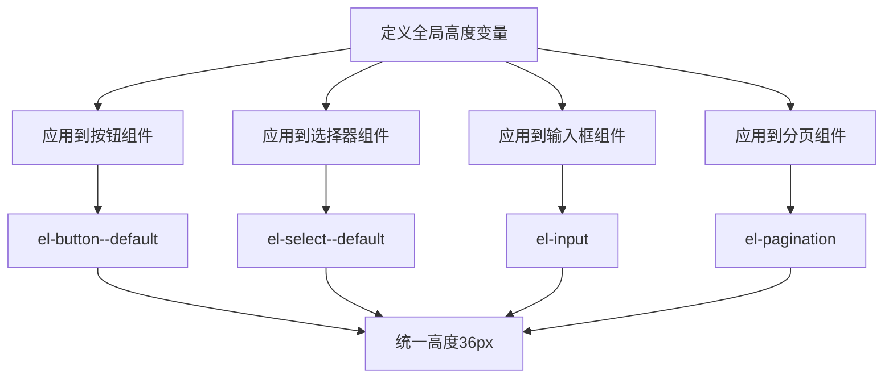
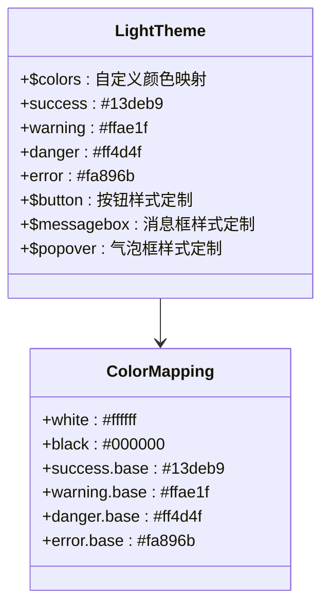
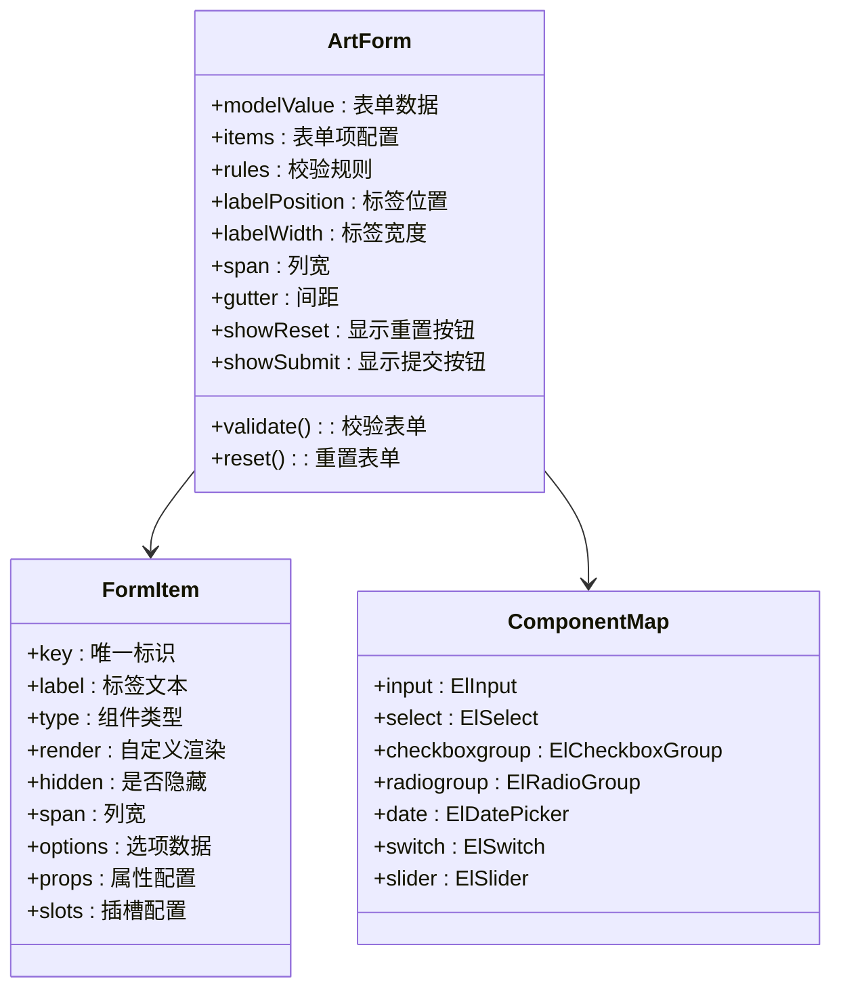
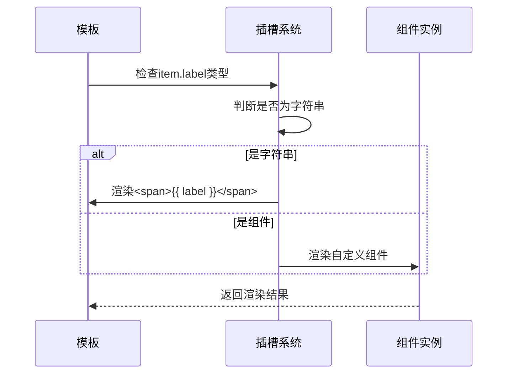
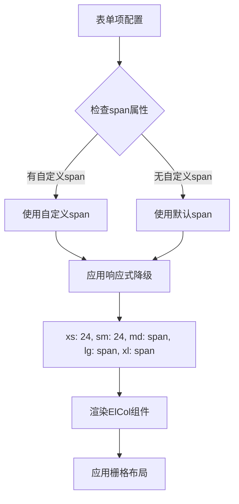
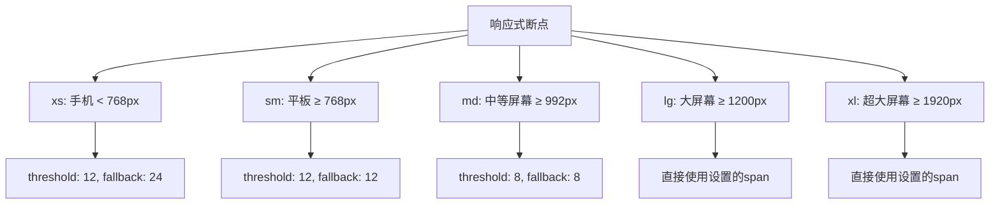
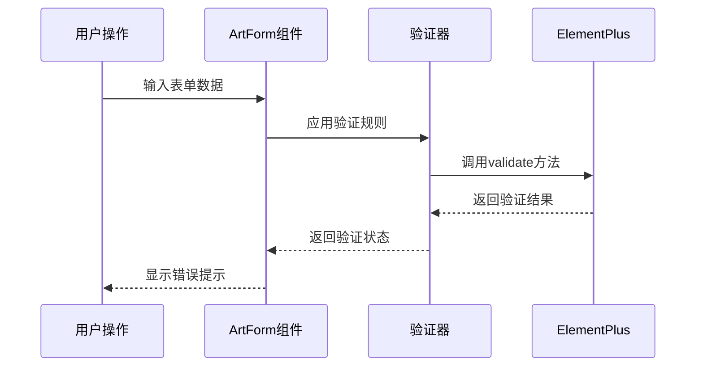
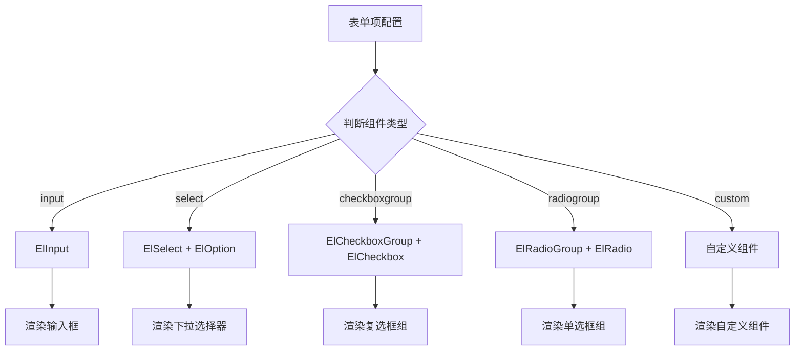

# Element Plus深度定制策略详解

<cite>
**本文档引用的文件**
- [el-ui.scss](file://src/assets/styles/core/el-ui.scss)
- [dark.scss](file://src/assets/styles/core/dark.scss)
- [el-dark.scss](file://src/assets/styles/core/el-dark.scss)
- [el-light.scss](file://src/assets/styles/core/el-light.scss)
- [index.vue](file://src/components/core/forms/art-form/index.vue)
- [responsive.ts](file://src/utils/form/responsive.ts)
- [mixin.scss](file://src/assets/styles/core/mixin.scss)
- [index.vue](file://src/views/examples/forms/index.vue)
- [style.scss](file://src/components/core/tables/art-table/style.scss)
</cite>

## 目录
1. [项目概述](#项目概述)
2. [核心定制策略](#核心定制策略)
3. [CSS变量系统](#css变量系统)
4. [组件高度统一化](#组件高度统一化)
5. [圆角样式优化](#圆角样式优化)
6. [主题适配机制](#主题适配机制)
7. [ArtForm组件深度分析](#artform组件深度分析)
8. [响应式栅格系统](#响应式栅格系统)
9. [表单验证集成](#表单验证集成)
10. [实际应用示例](#实际应用示例)
11. [性能优化考虑](#性能优化考虑)
12. [总结](#总结)

## 项目概述

该项目采用Element Plus作为主要UI组件库，通过深度定制策略实现了统一的设计语言和用户体验。核心定制围绕CSS变量系统、组件高度统一、圆角优化、主题适配等关键维度展开，形成了完整的样式体系。

## 核心定制策略

### 设计理念

项目采用了以下核心设计理念：

1. **统一性原则**：通过CSS变量确保所有组件的高度、圆角等属性的一致性
2. **可维护性**：集中式的变量管理和模块化的样式组织
3. **主题适配**：完善的深色/浅色主题切换机制
4. **响应式设计**：基于断点的智能布局适配

### 架构层次



**图表来源**
- [el-ui.scss](file://src/assets/styles/core/el-ui.scss#L3-L27)
- [el-light.scss](file://src/assets/styles/core/el-light.scss#L4-L35)
- [el-dark.scss](file://src/assets/styles/core/el-dark.scss#L1-L3)

## CSS变量系统

### 全局变量定义

项目在`:root`选择器中定义了一套完整的CSS变量系统，这些变量贯穿整个应用的样式体系：



**图表来源**
- [el-ui.scss](file://src/assets/styles/core/el-ui.scss#L3-L27)

### 变量命名规范

系统采用语义化命名规范，确保变量的可读性和可维护性：

- **主色调变量**：`--main-color`、`--theme-color`
- **组件尺寸变量**：`--el-component-custom-height`、`--el-component-size`
- **圆角变量**：`--el-border-radius-base`、`--el-border-radius-small`
- **颜色变量**：`--art-gray-200`、`--art-hover-color`、`--default-box-color`

**章节来源**
- [el-ui.scss](file://src/assets/styles/core/el-ui.scss#L3-L27)

## 组件高度统一化

### 统一高度策略

项目通过`--el-component-custom-height`变量实现了所有组件的高度统一：



**图表来源**
- [el-ui.scss](file://src/assets/styles/core/el-ui.scss#L84-L106)

### 具体实现细节

#### 按钮组件高度定制

```scss
// 修改 el-button 高度
.el-button--default {
  height: var(--el-component-custom-height) !important;
}

// circle 按钮宽度优化
.el-button--default.is-circle {
  width: var(--el-component-custom-height) !important;
}
```

#### 选择器组件高度定制

```scss
// 修改 el-select 高度
.el-select--default {
  .el-select__wrapper {
    min-height: var(--el-component-custom-height) !important;
  }
}
```

#### 复选框和单选框高度定制

```scss
// 修改 el-checkbox-button 和 el-radio-button 高度
.el-checkbox-button--default .el-checkbox-button__inner,
.el-radio-button--default .el-radio-button__inner {
  padding: 10px 15px !important;
}
```

**章节来源**
- [el-ui.scss](file://src/assets/styles/core/el-ui.scss#L84-L106)

## 圆角样式优化

### 圆角变量系统

项目建立了完整的圆角变量体系，支持不同场景的圆角需求：

```mermaid
graph LR
A[--custom-radius] --> B[--el-border-radius-base]
A --> C[--el-border-radius-small]
A --> D[--el-messagebox-border-radius]
A --> E[--el-popover-border-radius]
B --> F[基础圆角: calc(var(--custom-radius) / 3 + 2px)]
C --> G[小圆角: calc(var(--custom-radius) / 3 + 4px)]
D --> H[消息框圆角: calc(var(--custom-radius) / 3 + 4px)]
E --> I[气泡框圆角: calc(var(--custom-radius) / 3 + 4px)]
```

**图表来源**
- [el-ui.scss](file://src/assets/styles/core/el-ui.scss#L17-L23)

### 圆角应用场景

#### 对话框圆角优化

```scss
.el-dialog {
  border-radius: 100px !important;
  border-radius: calc(var(--custom-radius) / 1.2 + 2px) !important;
}
```

#### 下拉菜单圆角优化

```scss
.el-dropdown-menu {
  border-radius: 10px !important;
}

.el-dropdown-menu__item {
  border-radius: 6px !important;
}
```

#### 分页组件圆角优化

```scss
.el-pagination.is-background .btn-next,
.el-pagination.is-background .btn-prev,
.el-pagination.is-background .el-pager li {
  border-radius: 6px;
}
```

**章节来源**
- [el-ui.scss](file://src/assets/styles/core/el-ui.scss#L115-L118)
- [el-ui.scss](file://src/assets/styles/core/el-ui.scss#L109-L113)

## 主题适配机制

### 浅色主题定制

项目通过`el-light.scss`文件实现了浅色主题的深度定制：



**图表来源**
- [el-light.scss](file://src/assets/styles/core/el-light.scss#L4-L35)

### 深色主题适配

#### 深色主题背景色适配

```scss
html.dark {
  --el-bg-color: var(--default-box-color);
  --el-text-color-regular: #{$font-color};
}
```

#### el-card背景色适配

```scss
html.dark .el-card {
  --el-card-bg-color: var(--default-box-color) !important;
}
```

#### el-tree高亮适配

```scss
.dark {
  .el-tree--highlight-current .el-tree-node.is-current > .el-tree-node__content {
    background-color: var(--art-gray-300) !important;
  }
}
```

**章节来源**
- [dark.scss](file://src/assets/styles/core/dark.scss#L9-L13)
- [el-ui.scss](file://src/assets/styles/core/el-ui.scss#L40-L43)
- [el-ui.scss](file://src/assets/styles/core/el-ui.scss#L505-L508)

## ArtForm组件深度分析

### 组件架构设计

ArtForm组件是项目中表单功能的核心实现，它结合了ElForm与ElFormItem，提供了强大的表单布局控制能力：



**图表来源**
- [index.vue](file://src/components/core/forms/art-form/index.vue#L98-L312)

### 自定义label渲染机制

ArtForm组件支持灵活的label渲染方式：



**图表来源**
- [index.vue](file://src/components/core/forms/art-form/index.vue#L26-L30)

### 插槽支持系统

组件提供了完整的插槽支持，包括：

1. **表单项插槽**：`<slot :name="item.key" />`
2. **自定义组件插槽**：支持render函数渲染
3. **动态插槽**：运行时动态生成插槽

### 响应式栅格集成

ArtForm组件深度集成了Element Plus的栅格系统：



**图表来源**
- [index.vue](file://src/components/core/forms/art-form/index.vue#L14-L21)
- [responsive.ts](file://src/utils/form/responsive.ts#L55-L61)

**章节来源**
- [index.vue](file://src/components/core/forms/art-form/index.vue#L98-L312)

## 响应式栅格系统

### 断点配置策略

项目实现了智能的响应式断点管理系统：



**图表来源**
- [responsive.ts](file://src/utils/form/responsive.ts#L55-L61)

### 智能降级算法

```typescript
// 计算响应式列宽
export function calculateResponsiveSpan(
  itemSpan: number | undefined,
  defaultSpan: number,
  breakpoint: ResponsiveBreakpoint
): number {
  const finalSpan = itemSpan ?? defaultSpan
  const config = BREAKPOINT_CONFIG[breakpoint]
  
  // 如果没有配置（lg/xl），直接返回原始 span
  if (!config) {
    return finalSpan
  }
  
  // 如果 span 小于阈值，使用降级值
  return finalSpan >= config.threshold ? finalSpan : config.fallback
}
```

### 响应式布局示例

| 屏幕尺寸 | 默认span | 降级规则 | 最终span |
|---------|---------|---------|---------|
| xs (手机) | 6 | < 12 → 24 | 24 |
| sm (平板) | 6 | < 12 → 12 | 12 |
| md (中等屏幕) | 6 | < 8 → 8 | 8 |
| lg (大屏幕) | 6 | 直接使用 | 6 |
| xl (超大屏幕) | 6 | 直接使用 | 6 |

**章节来源**
- [responsive.ts](file://src/utils/form/responsive.ts#L65-L100)

## 表单验证集成

### 验证机制架构

项目提供了完整的表单验证集成方案：



### 验证规则配置

```typescript
// 表单校验规则示例
const formRules = {
  name: [{ required: true, message: '请输入用户名', trigger: 'blur' }],
  phone: [
    { required: true, message: '请输入手机号', trigger: 'blur' },
    { pattern: /^1[3-9]\d{9}$/, message: '请输入正确的手机号', trigger: 'blur' }
  ],
  email: [
    { required: true, message: '请输入邮箱', trigger: 'blur' },
    { type: 'email', message: '请输入有效的邮箱地址', trigger: 'blur' }
  ]
}
```

### 动态验证集成

ArtForm组件支持动态验证规则的集成：

```typescript
// 动态验证规则示例
const dynamicRules = computed(() => ({
  age: [
    { required: formData.value.ageRequired, message: '请输入年龄', trigger: 'blur' },
    { min: 18, message: '年龄不能小于18岁', trigger: 'blur' }
  ]
}))
```

**章节来源**
- [index.vue](file://src/views/examples/forms/index.vue#L126-L128)

## 实际应用示例

### 表单项动态渲染

项目展示了丰富的表单项动态渲染示例：



**图表来源**
- [index.vue](file://src/views/examples/forms/index.vue#L31-L67)

### 文件上传组件集成

```typescript
// 文件上传示例配置
{
  label: '文件上传',
  key: 'multipleFiles',
  span: 12,
  render: () =>
    h(ElUpload, {
      multiple: true,
      limit: 5,
      action: '#',
      autoUpload: false,
      showFileList: true,
      beforeUpload: (file: File) => {
        console.log('准备上传文件:', file.name)
        return true
      },
      onChange: (file: UploadFile, fileList: UploadFiles) => {
        formData.value.multipleFiles = fileList as UploadUserFile[]
      }
    })
}
```

### 富文本编辑器集成

```typescript
// 富文本编辑器示例配置
{
  label: '富文本编辑器',
  key: 'richTextContent',
  span: 24,
  render: () =>
    h(ArtWangEditor, {
      modelValue: formData.value.richTextContent,
      height: '500px',
      toolbarKeys: [
        'headerSelect', 'bold', 'italic', 'underline',
        'bulletedList', 'numberedList',
        'insertLink', 'insertImage',
        'undo', 'redo'
      ]
    })
}
```

**章节来源**
- [index.vue](file://src/views/examples/forms/index.vue#L577-L612)
- [index.vue](file://src/views/examples/forms/index.vue#L661-L690)

## 性能优化考虑

### CSS变量优化策略

1. **减少变量嵌套层级**：避免深层嵌套的CSS变量引用
2. **批量变量更新**：通过`:root`统一管理变量变更
3. **选择器优化**：使用更具体的选择器减少样式计算开销

### 组件懒加载机制

```typescript
// 组件按需加载示例
const componentMap = {
  input: ElInput,
  select: ElSelect,
  // 其他组件...
}

// 动态导入大型组件
const ArtWangEditor = defineAsyncComponent(() =>
  import('@/components/core/forms/art-wang-editor/index.vue')
)
```

### 样式缓存策略

项目通过以下方式优化样式性能：

1. **CSS变量缓存**：利用浏览器对CSS变量的缓存机制
2. **选择器复用**：避免重复的选择器定义
3. **样式压缩**：生产环境的CSS压缩和优化

## 总结

该项目通过深度定制Element Plus组件库，建立了一套完整的样式体系，主要体现在以下几个方面：

### 核心优势

1. **统一的设计语言**：通过CSS变量系统确保了组件样式的统一性
2. **灵活的主题适配**：完善的深色/浅色主题切换机制
3. **智能的响应式设计**：基于断点的智能布局适配
4. **强大的表单功能**：ArtForm组件提供了丰富的表单定制能力

### 技术特色

1. **模块化架构**：清晰的样式组织结构，便于维护和扩展
2. **类型安全**：TypeScript支持确保了开发体验
3. **性能优化**：合理的CSS变量使用和组件设计
4. **用户体验**：流畅的动画效果和交互反馈

### 应用价值

这套定制策略不仅提升了开发效率，更重要的是为用户提供了统一、美观、易用的界面体验。通过深度定制，项目成功地将Element Plus的通用性与项目的个性化需求完美结合，展现了现代前端开发的最佳实践。