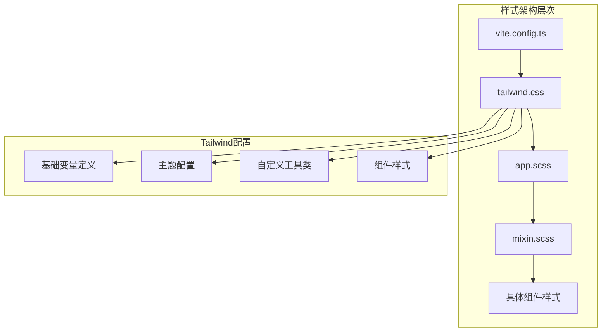
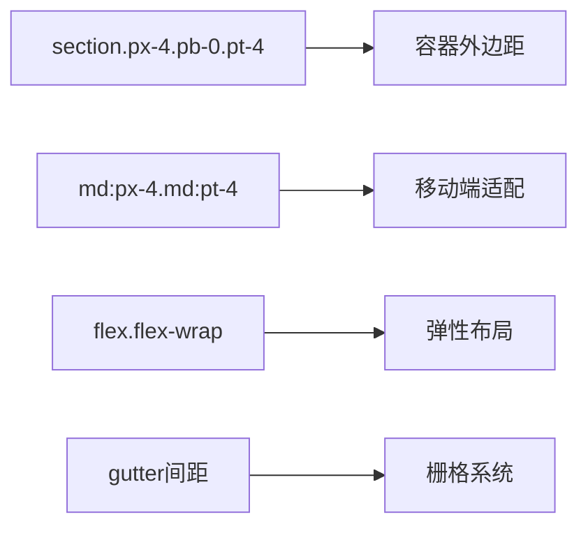
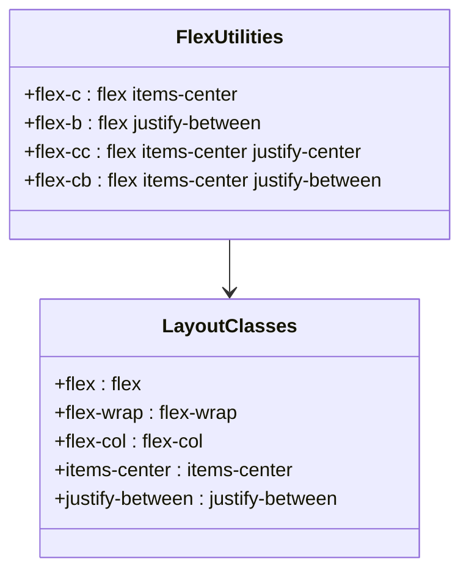
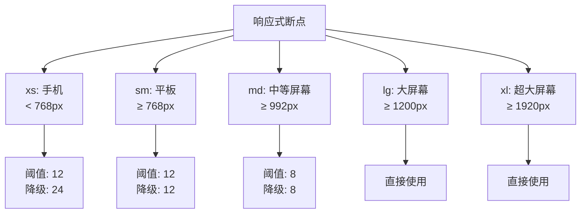
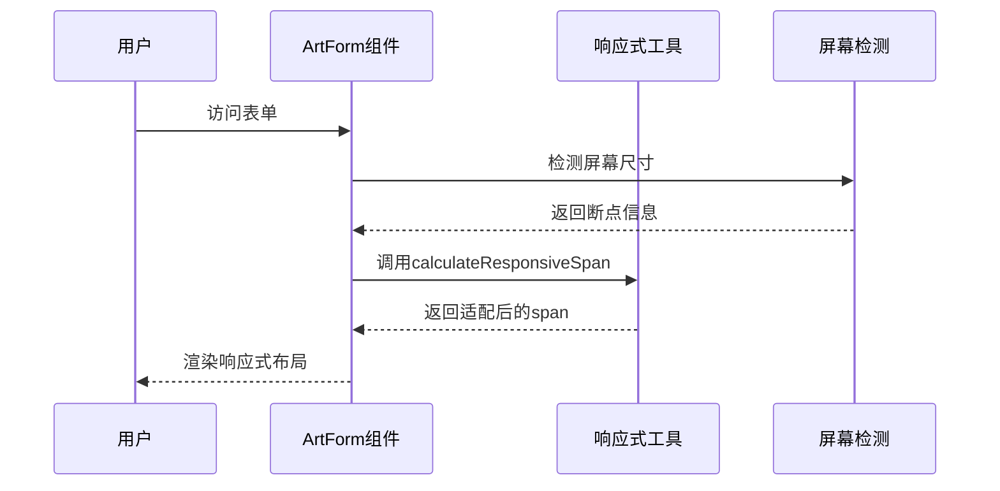
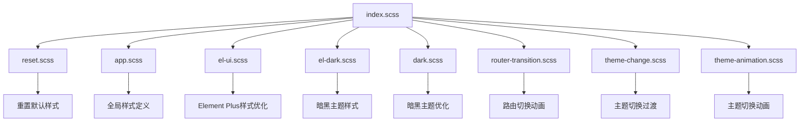
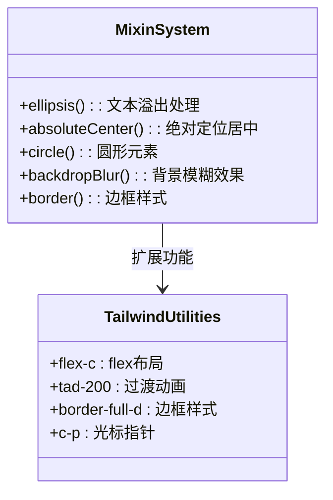
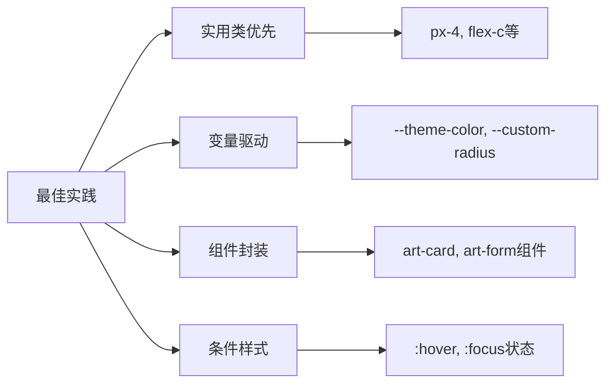
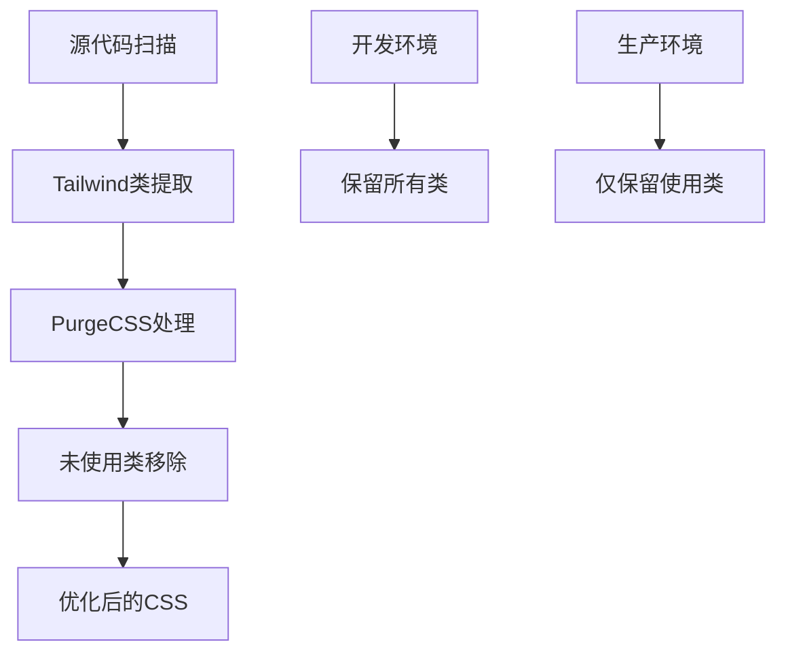
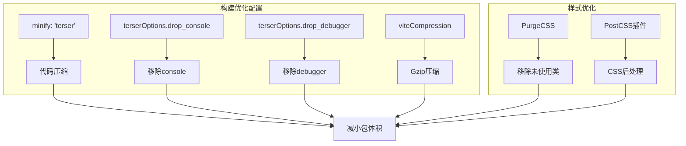

# Tailwind CSS应用

<cite>
**本文档引用的文件**
- [src/components/core/forms/art-form/index.vue](file://src/components/core/forms/art-form/index.vue)
- [src/App.vue](file://src/App.vue)
- [src/assets/styles/index.scss](file://src/assets/styles/index.scss)
- [src/assets/styles/core/tailwind.css](file://src/assets/styles/core/tailwind.css)
- [src/assets/styles/core/app.scss](file://src/assets/styles/core/app.scss)
- [src/assets/styles/core/mixin.scss](file://src/assets/styles/core/mixin.scss)
- [vite.config.ts](file://vite.config.ts)
- [src/utils/form/responsive.ts](file://src/utils/form/responsive.ts)
- [src/components/business/comment-widget/widget/CommentItem.vue](file://src/components/business/comment-widget/widget/CommentItem.vue)
- [src/components/core/banners/art-card-banner/index.vue](file://src/components/core/banners/art-card-banner/index.vue)
- [package.json](file://package.json)
</cite>

## 目录
1. [项目概述](#项目概述)
2. [Tailwind CSS架构配置](#tailwind-css架构配置)
3. [ArtForm组件中的实用类应用](#artform组件中的实用类应用)
4. [响应式断点系统](#响应式断点系统)
5. [App.vue中的样式编排](#appvue中的样式编排)
6. [SCSS与Tailwind的融合策略](#scss与tailwind的融合策略)
7. [最佳实践建议](#最佳实践建议)
8. [性能优化与PurgeCSS](#性能优化与purgecss)
9. [总结](#总结)

## 项目概述

Art Design Pro是一个基于Vue 3和Element Plus的企业级后台管理系统，采用了现代化的前端技术栈。项目中深度集成了Tailwind CSS作为主要的样式解决方案，实现了高度可定制化的响应式设计体系。

### 技术栈特点

- **Vue 3 + TypeScript**: 现代化的前端框架组合
- **Element Plus**: 企业级UI组件库
- **Tailwind CSS v4**: 实用优先的CSS框架
- **Vite**: 快速的构建工具
- **SCSS**: 增强的CSS预处理器

## Tailwind CSS架构配置

### 核心配置文件结构

项目采用分层的样式架构，将Tailwind CSS的配置与自定义样式有机结合：

**图表来源**
- [vite.config.ts](file://vite.config.ts#L10-L70)
- [src/assets/styles/core/tailwind.css](file://src/assets/styles/core/tailwind.css#L1-L209)

### 主题变量系统

Tailwind CSS在项目中通过CSS自定义属性实现了完整的主题系统：

#### 浅色模式变量
- **基础颜色**: `--art-color: #ffffff`
- **主题色彩**: 使用OKLCH格式的语义化颜色系统
- **灰度系统**: 从`--art-gray-100`到`--art-gray-900`的完整渐变
- **边界颜色**: `--art-card-border: rgba(0, 0, 0, 0.08)`
- **背景颜色**: `--default-bg-color: #fafbfc`

#### 暗色模式变量
- **基础颜色**: `--art-color: #000000`
- **灰度系统**: 对应浅色模式的深色版本
- **边界颜色**: `--art-card-border: rgba(255, 255, 255, 0.08)`
- **背景颜色**: `--default-bg-color: #070707`

**章节来源**
- [src/assets/styles/core/tailwind.css](file://src/assets/styles/core/tailwind.css#L1-L84)

## ArtForm组件中的实用类应用

### 基础间距控制

ArtForm组件是Tailwind CSS在实际业务场景中的典型应用案例，展示了如何通过实用类实现精确的间距控制：

#### 核心布局类应用

**图表来源**
- [src/components/core/forms/art-form/index.vue](file://src/components/core/forms/art-form/index.vue#L5-L13)

#### px-4间距类详解

- **左侧和右侧内边距**: `px-4`提供4个tailwind单位（1rem = 16px，所以4px-4 = 16px）
- **响应式扩展**: `md:px-4`在中等及以上屏幕尺寸生效
- **视觉一致性**: 确保表单在不同设备上保持统一的视觉间距

#### pb-0和pt-4组合

- **底部无间距**: `pb-0`移除底部外边距，避免不必要的空白区域
- **顶部间距**: `pt-4`提供4个单位的顶部间距，确保表单标题与内容的适当分离
- **响应式适配**: `md:pt-4`在桌面端保持相同的顶部间距

**章节来源**
- [src/components/core/forms/art-form/index.vue](file://src/components/core/forms/art-form/index.vue#L5-L6)

### 弹性布局系统

#### flex-c自定义工具类

项目中定义了多个自定义的flex布局工具类：

**图表来源**
- [src/assets/styles/core/tailwind.css](file://src/assets/styles/core/tailwind.css#L135-L155)

#### ElRow和ElCol栅格系统

- **flex-wrap**: 允许表单项在容器宽度不足时自动换行
- **gutter属性**: 通过`gutter="12"`设置列间距，实现灵活的栅格布局
- **响应式断点**: 支持`xs`、`sm`、`md`、`lg`、`xl`五个断点级别

**章节来源**
- [src/components/core/forms/art-form/index.vue](file://src/components/core/forms/art-form/index.vue#L12-L21)

## 响应式断点系统

### 断点配置策略

项目实现了智能的响应式断点系统，基于Element Plus的栅格系统：

**图表来源**
- [src/utils/form/responsive.ts](file://src/utils/form/responsive.ts#L55-L61)

### 智能降级机制

#### calculateResponsiveSpan函数

该函数实现了智能的列宽降级逻辑：

- **阈值检查**: 判断当前span值是否低于断点阈值
- **降级策略**: 根据断点配置返回适当的降级值
- **默认行为**: 对于lg和xl断点，直接使用原始span值

#### 实际应用场景

**图表来源**
- [src/utils/form/responsive.ts](file://src/utils/form/responsive.ts#L64-L100)

**章节来源**
- [src/utils/form/responsive.ts](file://src/utils/form/responsive.ts#L1-L123)

## App.vue中的样式编排

### class属性的实用类应用

虽然App.vue本身主要负责应用级别的配置，但其class属性的使用体现了Tailwind CSS在全局层面的应用理念：

#### 全局配置模式

- **简洁性**: 通过class属性直接应用实用类，避免复杂的样式继承
- **一致性**: 确保整个应用的样式风格统一
- **可维护性**: 集中管理全局样式配置

#### Element Plus配置集成

- **size="default"**: 设置全局组件尺寸为默认值
- **locale国际化**: 集成多语言支持
- **z-index管理**: 设置全局z-index基准值

**章节来源**
- [src/App.vue](file://src/App.vue#L1-L35)

## SCSS与Tailwind的融合策略

### @tailwind指令的引入顺序

项目采用了精心设计的SCSS导入顺序，确保Tailwind CSS与自定义SCSS的和谐共存：

**图表来源**
- [src/assets/styles/index.scss](file://src/assets/styles/index.scss#L1-L24)

### @use指令的优先级管理

#### SCSS混合宏与Tailwind工具类的协作

项目中大量使用SCSS混合宏来增强Tailwind CSS的功能：

**图表来源**
- [src/assets/styles/core/mixin.scss](file://src/assets/styles/core/mixin.scss#L1-L158)

#### 自定义工具类的创建

项目在tailwind.css中定义了丰富的自定义工具类：

- **Flexbox扩展**: `.flex-c`、`.flex-b`、`.flex-cc`等
- **过渡动画**: `.tad-200`、`.tad-300`等持续时间类
- **边框系统**: `.border-full-d`、`.border-b-d`等边框类
- **光标样式**: `.c-p`指针光标类

**章节来源**
- [src/assets/styles/core/tailwind.css](file://src/assets/styles/core/tailwind.css#L134-L186)
- [src/assets/styles/core/mixin.scss](file://src/assets/styles/core/mixin.scss#L1-L158)

## 最佳实践建议

### 避免过度使用!important

#### 优先级管理原则

1. **实用类优先**: 优先使用Tailwind的实用类，减少自定义CSS
2. **变量驱动**: 通过CSS自定义属性管理颜色和间距
3. **组件封装**: 将复杂样式封装到组件内部
4. **条件样式**: 使用`:hover`、`:focus`等伪类替代内联样式

#### 实际应用示例

### 合理组织样式层级

#### 分层架构设计

1. **基础层**: 重置样式和全局变量
2. **组件层**: 组件特定的样式定义
3. **工具层**: 可复用的工具类和混合宏
4. **应用层**: 应用级别的样式配置

#### 样式命名规范

- **语义化命名**: 使用描述性的类名而非表现性命名
- **层次清晰**: 通过前缀区分不同类型的样式
- **可读性强**: 类名应该直观易懂

### 利用PurgeCSS优化生产包体积

#### 构建时优化策略

项目通过Vite配置实现了高效的PurgeCSS优化：

**图表来源**
- [vite.config.ts](file://vite.config.ts#L49-L67)

#### 配置优化要点

- **内容扫描**: 包含所有Vue文件和JavaScript文件
- **排除规则**: 排除动态生成的类名
- **白名单**: 保留必要的保留类名
- **安全扫描**: 确保关键功能不受影响

**章节来源**
- [vite.config.ts](file://vite.config.ts#L49-L67)

## 性能优化与PurgeCSS

### 构建时优化配置

#### vite.config.ts中的优化设置

项目在构建配置中实现了多层次的性能优化：

**图表来源**
- [vite.config.ts](file://vite.config.ts#L49-L99)

#### 包体积监控

- **chunkSizeWarningLimit**: 设置警告阈值为2000KB
- **动态导入优化**: 智能处理路由组件的懒加载
- **依赖预构建**: 避免运行时重复转换

**章节来源**
- [vite.config.ts](file://vite.config.ts#L49-L67)

## 总结

Art Design Pro项目中的Tailwind CSS应用展现了现代前端开发的最佳实践：

### 核心优势

1. **开发效率**: 实用类的即时应用大大提升了开发速度
2. **维护性**: 结构化的样式架构便于长期维护
3. **响应式**: 智能的断点系统确保了良好的用户体验
4. **性能**: 通过PurgeCSS和构建优化实现了优秀的包体积控制

### 应用特色

- **深度集成**: Tailwind CSS与SCSS的完美融合
- **主题系统**: 完整的明暗主题切换支持
- **响应式设计**: 基于业务需求的智能断点策略
- **性能优化**: 全方位的构建时优化方案

### 未来发展方向

随着Tailwind CSS生态系统的不断发展，项目可以考虑：
- 迁移到Tailwind CSS v4的新特性
- 进一步优化自定义工具类的开发
- 探索更多创新的样式组合模式
- 加强TypeScript类型安全的支持

通过这种系统化的Tailwind CSS应用，Art Design Pro不仅实现了高效的产品开发，更为团队建立了可持续的样式开发标准。