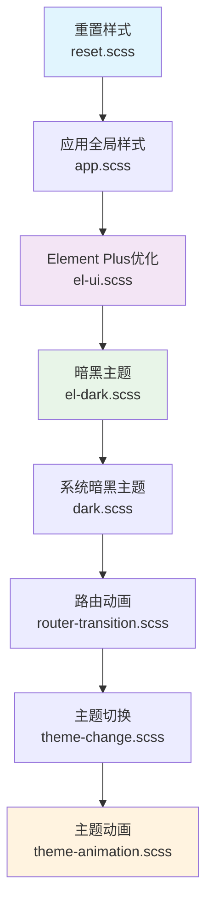
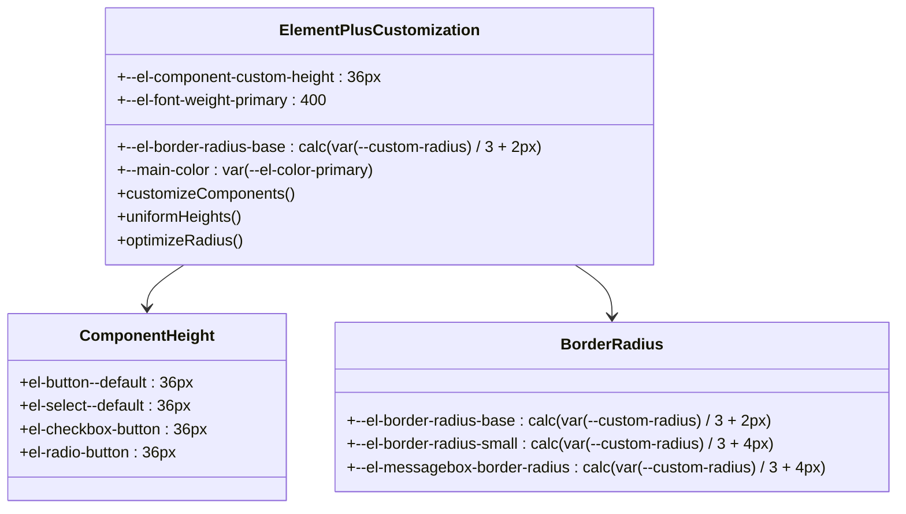
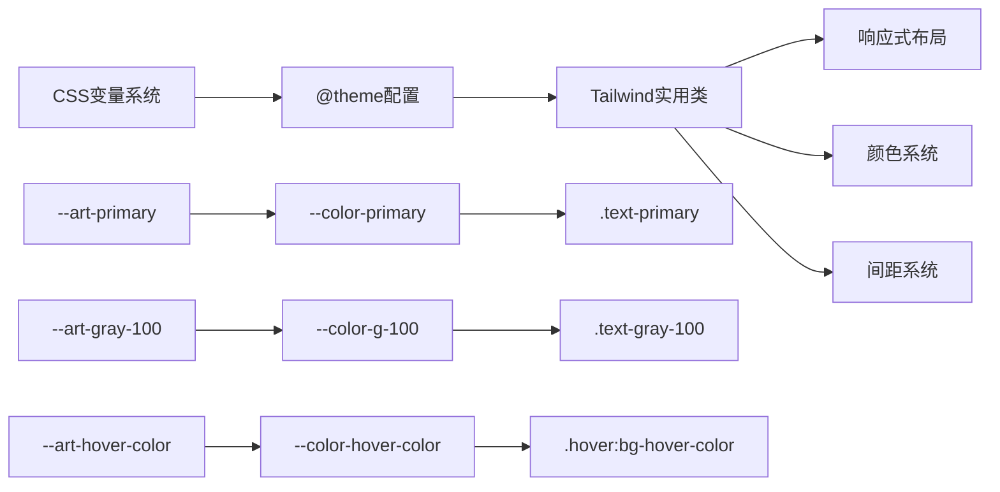
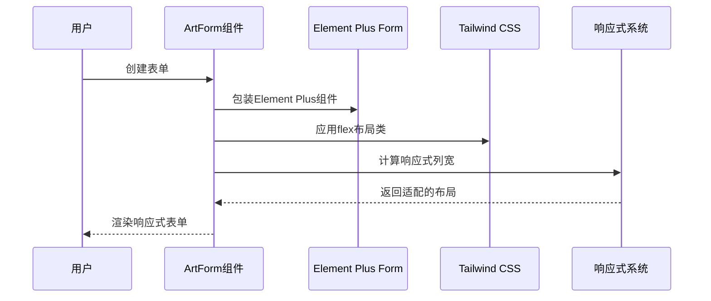
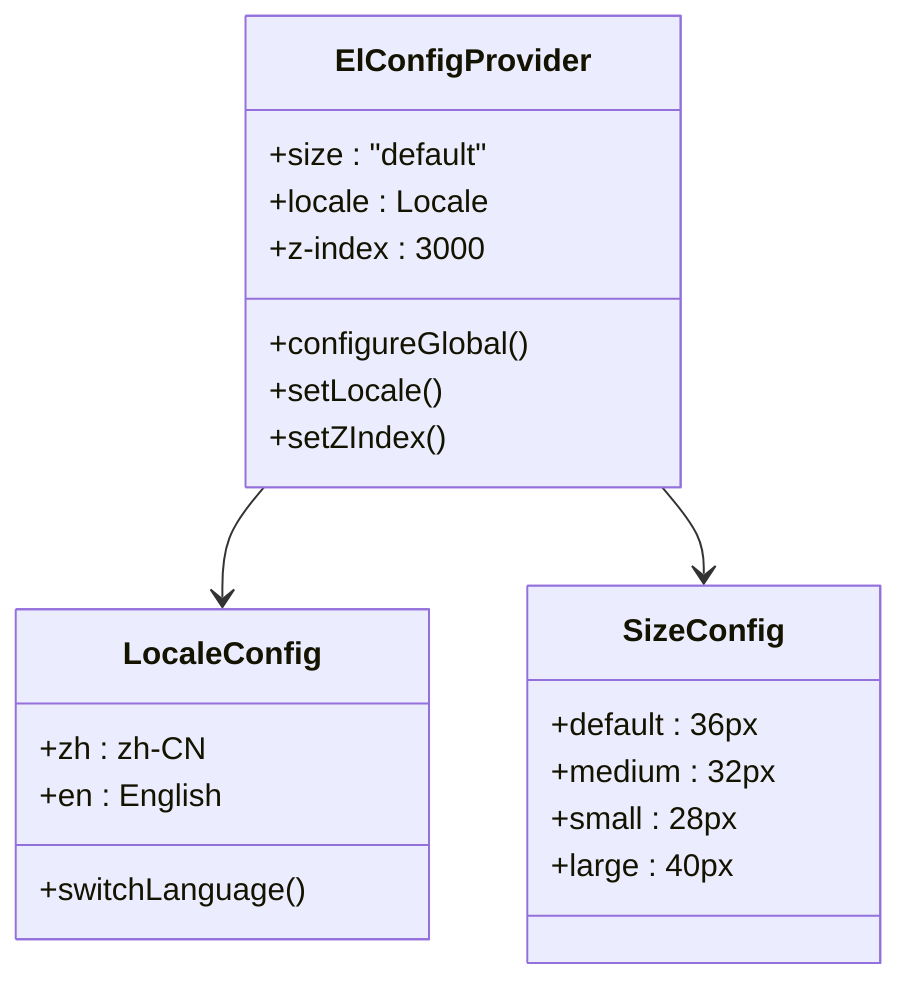
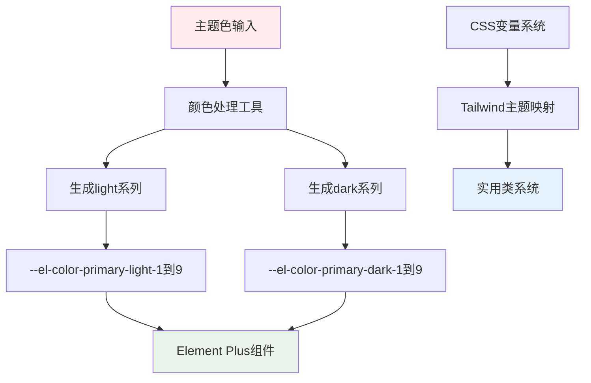
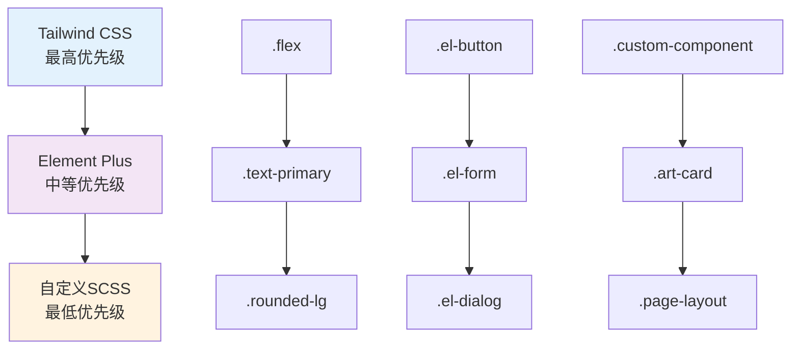

# UI框架集成

<cite>
**本文档引用的文件**
- [src/assets/styles/index.scss](file://src/assets/styles/index.scss)
- [src/assets/styles/core/el-ui.scss](file://src/assets/styles/core/el-ui.scss)
- [src/assets/styles/core/tailwind.css](file://src/assets/styles/core/tailwind.css)
- [src/App.vue](file://src/App.vue)
- [src/components/core/forms/art-form/index.vue](file://src/components/core/forms/art-form/index.vue)
- [src/main.ts](file://src/main.ts)
- [src/utils/ui/colors.ts](file://src/utils/ui/colors.ts)
- [src/hooks/core/useTheme.ts](file://src/hooks/core/useTheme.ts)
- [src/components/core/theme/theme-svg/index.vue](file://src/components/core/theme/theme-svg/index.vue)
- [src/assets/styles/core/mixin.scss](file://src/assets/styles/core/mixin.scss)
- [package.json](file://package.json)
</cite>

## 目录
1. [项目概述](#项目概述)
2. [样式架构设计](#样式架构设计)
3. [Element Plus深度定制](#element-plus深度定制)
4. [Tailwind CSS集成](#tailwind-css集成)
5. [响应式布局实现](#响应式布局实现)
6. [全局配置管理](#全局配置管理)
7. [主题色彩系统](#主题色彩系统)
8. [协同工作机制](#协同工作机制)
9. [最佳实践指南](#最佳实践指南)

## 项目概述

Art Design Pro采用现代化的UI框架集成策略，巧妙地将Element Plus与Tailwind CSS两大主流前端框架有机结合，构建了一个既具有丰富组件生态又具备高度灵活性的设计系统。这种集成方式不仅保留了Element Plus的完整组件库优势，还充分发挥了Tailwind CSS的实用类特性，实现了开发效率与设计自由度的最佳平衡。

### 技术栈特点

- **Element Plus**: 提供完整的Vue 3组件库，涵盖表单、表格、对话框等企业级应用所需的所有UI组件
- **Tailwind CSS**: 实用优先的CSS框架，提供原子化类名，支持快速原型开发和灵活样式定制
- **SCSS**: 作为样式预处理器，提供变量、混合宏、嵌套等高级特性
- **CSS变量**: 实现动态主题切换和颜色系统管理

## 样式架构设计

### 引入顺序与优先级控制

项目的样式架构采用了精心设计的引入顺序，确保不同框架的样式能够和谐共存且互不冲突。

**图表来源**
- [src/assets/styles/index.scss](file://src/assets/styles/index.scss#L1-L24)

### 样式文件组织结构

| 文件路径 | 功能描述 | 优先级 |
|---------|----------|--------|
| `reset.scss` | 全局样式重置，消除浏览器默认样式差异 | 最高 |
| `app.scss` | 应用基础样式，定义全局布局和通用样式 | 高 |
| `el-ui.scss` | Element Plus深度定制，统一组件样式 | 中 |
| `el-dark.scss` | Element Plus暗黑主题优化 | 中 |
| `dark.scss` | 系统暗黑主题全局样式 | 中 |
| `router-transition.scss` | 路由切换动画效果 | 低 |
| `theme-change.scss` | 主题切换过渡优化 | 低 |
| `theme-animation.scss` | 主题动画效果 | 最低 |

**章节来源**
- [src/assets/styles/index.scss](file://src/assets/styles/index.scss#L1-L24)

## Element Plus深度定制

### 核心定制原则

Element Plus的定制遵循"统一性、一致性、可扩展性"三大原则，通过CSS变量和混合宏实现全局样式控制。

**图表来源**
- [src/assets/styles/core/el-ui.scss](file://src/assets/styles/core/el-ui.scss#L3-L26)

### 关键定制特性

#### 1. 组件高度统一化
通过`--el-component-custom-height`变量实现所有组件的高度统一，确保界面视觉的一致性。

#### 2. 圆角系统优化
采用基于`--custom-radius`变量的圆角计算公式，使圆角大小与整体设计风格协调统一。

#### 3. 主题色关联
将`--main-color`与`--el-color-primary`建立关联，实现主题色的全局联动控制。

**章节来源**
- [src/assets/styles/core/el-ui.scss](file://src/assets/styles/core/el-ui.scss#L1-L525)

## Tailwind CSS集成

### 主题变量映射

Tailwind CSS通过`@theme`指令将CSS变量映射到实用类系统中，实现两套系统的无缝对接。

**图表来源**
- [src/assets/styles/core/tailwind.css](file://src/assets/styles/core/tailwind.css#L86-L122)

### 自定义工具类

项目扩展了丰富的自定义工具类，满足特定的设计需求：

| 工具类名称 | 功能描述 | CSS对应 |
|-----------|----------|---------|
| `.flex-c` | 居中对齐的flex布局 | `flex items-center` |
| `.flex-b` | 两端对齐的flex布局 | `flex justify-between` |
| `.rounded-custom-sm` | 自定义圆角尺寸 | `calc(var(--custom-radius) / 2 + 2px)` |
| `.border-full-d` | 默认边框样式 | `border border-[var(--default-border)]` |
| `.tad-200` | 200ms过渡动画 | `transition-all duration-200` |

**章节来源**
- [src/assets/styles/core/tailwind.css](file://src/assets/styles/core/tailwind.css#L124-L209)

## 响应式布局实现

### ArtForm组件的响应式设计

ArtForm组件是Element Plus与Tailwind CSS协同工作的典型代表，完美展示了如何结合两者实现响应式布局。

**图表来源**
- [src/components/core/forms/art-form/index.vue](file://src/components/core/forms/art-form/index.vue#L12-L71)

### 响应式断点系统

| 断点 | 屏幕宽度 | Tailwind类 | Element Plus适配 |
|------|----------|------------|------------------|
| xs | < 500px | `:xs="24"` | 单列布局 |
| sm | ≥ 500px | `:sm="24"` | 单列布局 |
| md | ≥ 768px | `:md="12"` | 双列布局 |
| lg | ≥ 1024px | `:lg="8"` | 三列布局 |
| xl | ≥ 1280px | `:xl="6"` | 四列布局 |

**章节来源**
- [src/components/core/forms/art-form/index.vue](file://src/components/core/forms/art-form/index.vue#L1-L312)

## 全局配置管理

### ElConfigProvider配置

App.vue中的ElConfigProvider提供了全局的Element Plus配置，确保整个应用的一致性。

**图表来源**
- [src/App.vue](file://src/App.vue#L2-L2)

### 配置参数详解

| 参数 | 值 | 作用 | 影响范围 |
|------|----|----- |----------|
| size | "default" | 统一组件尺寸 | 所有Element Plus组件 |
| locale | locales[language] | 国际化语言 | 消息提示、日期格式等 |
| z-index | 3000 | 全局z-index基准 | 对话框、弹窗、下拉菜单 |

**章节来源**
- [src/App.vue](file://src/App.vue#L1-L35)

## 主题色彩系统

### CSS变量驱动的主题系统

项目采用CSS变量作为主题系统的核心，实现了动态主题切换和颜色系统的精确控制。

**图表来源**
- [src/utils/ui/colors.ts](file://src/utils/ui/colors.ts#L235-L273)

### 主题色生成机制

#### 1. Element Plus主题色处理
通过`handleElementThemeColor`函数处理Element Plus的主题色系统，生成9个级别的颜色变体。

#### 2. 动态颜色计算
利用`getLightColor`和`getDarkColor`函数，根据基础主题色动态生成对应的亮色和暗色版本。

#### 3. 自定义颜色扩展
支持生成额外的自定义颜色变体，如`--el-color-primary-custom-1到16`。

**章节来源**
- [src/utils/ui/colors.ts](file://src/utils/ui/colors.ts#L1-L273)

## 协同工作机制

### 样式优先级规则

Element Plus与Tailwind CSS的协同遵循以下优先级规则：

### 混合使用策略

#### 1. 组件内部样式
- 使用Element Plus原生样式，确保组件功能完整性
- 通过CSS变量实现主题适配

#### 2. 布局和间距
- 使用Tailwind CSS的实用类进行快速布局
- 保持响应式设计的一致性

#### 3. 自定义装饰性样式
- 使用自定义SCSS文件处理特殊需求
- 通过混合宏提高代码复用性

**章节来源**
- [src/assets/styles/core/el-ui.scss](file://src/assets/styles/core/el-ui.scss#L1-L525)
- [src/assets/styles/core/tailwind.css](file://src/assets/styles/core/tailwind.css#L1-L209)

## 最佳实践指南

### 开发建议

#### 1. 样式命名规范
- Element Plus组件：使用原生类名，通过CSS变量定制外观
- 自定义组件：优先使用Tailwind CSS实用类
- 特殊样式：在自定义SCSS文件中定义

#### 2. 主题适配策略
- 通过CSS变量实现主题切换
- 避免硬编码颜色值
- 利用Tailwind CSS的主题映射

#### 3. 性能优化
- 合理使用CSS变量，避免过度嵌套
- 优先使用Tailwind CSS的原子化类
- 定期清理未使用的样式

### 维护建议

#### 1. 样式架构维护
- 定期检查样式文件的依赖关系
- 优化CSS变量的命名和组织
- 保持Element Plus版本的同步更新

#### 2. 主题系统维护
- 测试新主题色的兼容性
- 验证暗黑模式下的视觉效果
- 优化主题切换的性能

#### 3. 响应式设计维护
- 在不同设备上测试布局效果
- 优化移动端的交互体验
- 保持断点定义的一致性

通过这种精心设计的UI框架集成方案，Art Design Pro成功实现了Element Plus与Tailwind CSS的优势互补，为企业级应用开发提供了一个既强大又灵活的前端解决方案。