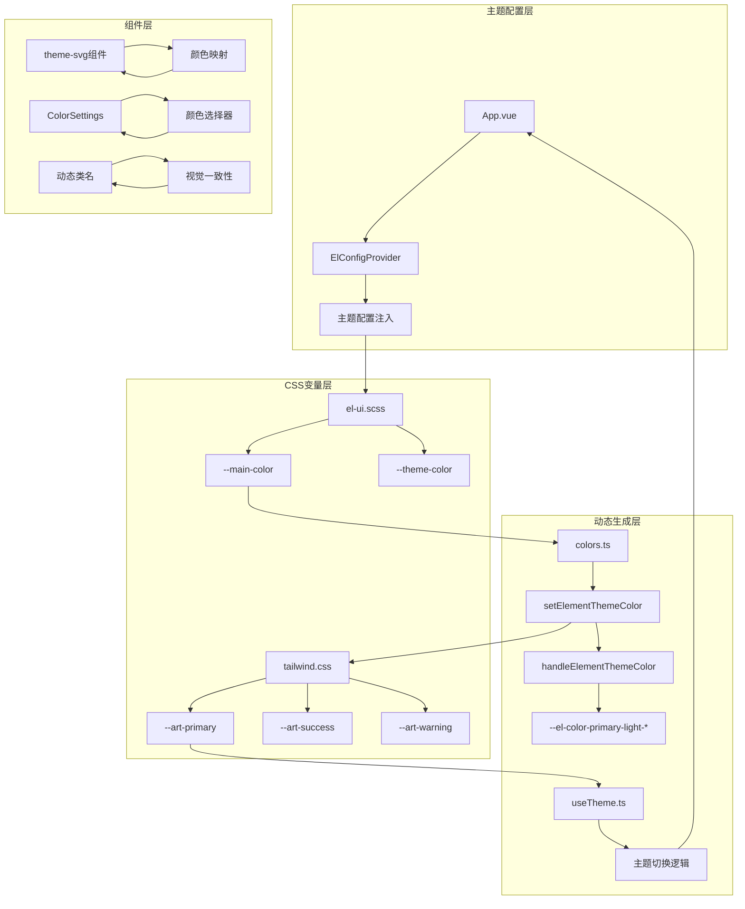
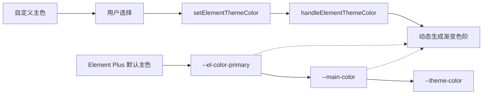
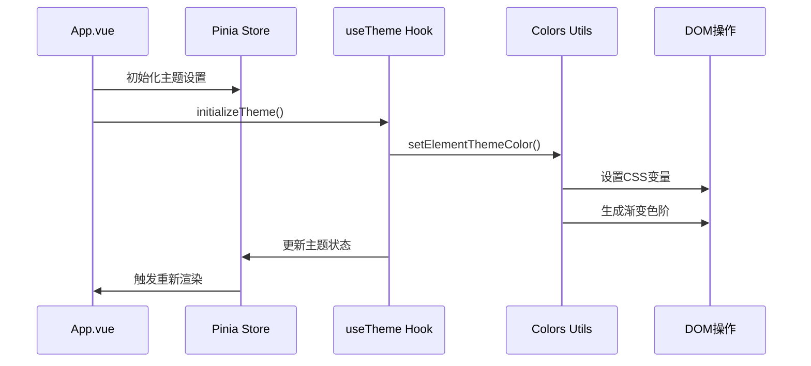
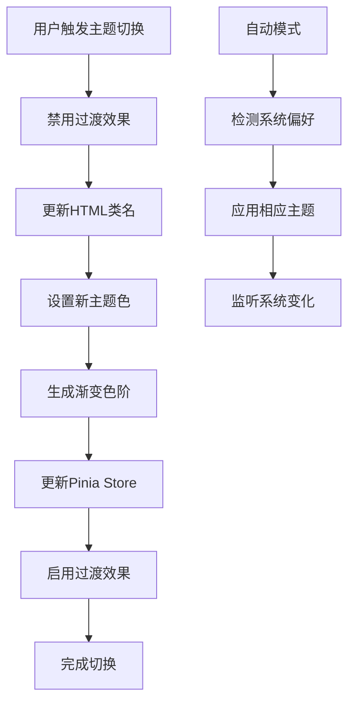

# 主题色融合

<cite>
**本文档引用的文件**
- [el-ui.scss](file://src/assets/styles/core/el-ui.scss)
- [App.vue](file://src/App.vue)
- [app.scss](file://src/assets/styles/core/app.scss)
- [tailwind.css](file://src/assets/styles/core/tailwind.css)
- [useTheme.ts](file://src/hooks/core/useTheme.ts)
- [colors.ts](file://src/utils/ui/colors.ts)
- [el-light.scss](file://src/assets/styles/core/el-light.scss)
- [el-dark.scss](file://src/assets/styles/core/el-dark.scss)
- [theme-svg/index.vue](file://src/components/core/theme/theme-svg/index.vue)
- [ColorSettings.vue](file://src/components/core/layouts/art-settings-panel/widget/ColorSettings.vue)
- [animation.ts](file://src/utils/ui/animation.ts)
- [theme-change.scss](file://src/assets/styles/core/theme-change.scss)
</cite>

## 目录
1. [概述](#概述)
2. [核心架构](#核心架构)
3. [CSS变量系统](#css变量系统)
4. [Element Plus主题集成](#element-plus主题集成)
5. [Tailwind CSS调色板同步](#tailwind-css调色板同步)
6. [主题配置注入](#主题配置注入)
7. [动态类名与视觉一致性](#动态类名与视觉一致性)
8. [运行时主题切换](#运行时主题切换)
9. [性能优化策略](#性能优化策略)
10. [最佳实践](#最佳实践)

## 概述

Art Design Pro采用了一套完整的主题色融合方案，通过CSS变量系统实现了Element Plus默认主题与自定义设计系统的无缝集成。该方案的核心在于通过`--main-color`和`--theme-color`两个关键CSS变量实现主色调的统一管理，并通过动态生成的`--el-color-primary-light-*`系列变量构建完整的渐变色阶。

### 主要特性

- **统一色彩管理**：基于CSS变量的主色调统一管理机制
- **动态主题切换**：支持亮色、暗色和自动模式的流畅切换
- **组件库集成**：Element Plus主题色的深度定制与同步
- **设计系统对齐**：Tailwind CSS调色板与Element Plus主题的完美匹配
- **性能优化**：智能的CSS变量更新策略和过渡效果优化

## 核心架构

### 主题系统架构图



**图表来源**
- [App.vue](file://src/App.vue#L1-L35)
- [el-ui.scss](file://src/assets/styles/core/el-ui.scss#L3-L27)
- [tailwind.css](file://src/assets/styles/core/tailwind.css#L5-L122)
- [colors.ts](file://src/utils/ui/colors.ts#L261-L273)

## CSS变量系统

### 核心变量定义

系统通过两层CSS变量体系实现主题色的统一管理：

#### 第一层：主色调变量
```scss
:root {
  --main-color: var(--el-color-primary);  // 主色变量，指向Element Plus主色
  --theme-color: var(--main-color);       // 主题色变量，用于全局主题标识
}
```

#### 第二层：Element Plus主题变量
```scss
// 在el-ui.scss中定义
:root {
  --el-color-primary: #409EFF;           // Element Plus主色
  --el-color-primary-light-1: #53a8ff;   // 渐变色阶1
  --el-color-primary-light-2: #66b1ff;   // 渐变色阶2
  // ... 更多渐变色阶
}
```

### 变量继承关系



**图表来源**
- [el-ui.scss](file://src/assets/styles/core/el-ui.scss#L3-L6)
- [colors.ts](file://src/utils/ui/colors.ts#L240-L273)

**章节来源**
- [el-ui.scss](file://src/assets/styles/core/el-ui.scss#L3-L27)
- [colors.ts](file://src/utils/ui/colors.ts#L240-L273)

## Element Plus主题集成

### 主题色动态生成机制

系统通过`setElementThemeColor`函数实现Element Plus主题色的动态生成：

#### 渐变色阶生成算法

```typescript
// 核心生成逻辑
for (let i = 1; i <= 9; i++) {
  document.documentElement.style.setProperty(
    `--el-color-primary-light-${i}`,
    getLightColor(theme, i / 10, isDark)
  )
}
```

#### 颜色混合策略

系统采用智能的颜色混合算法生成渐变色阶：

- **亮色模式**：基于白色背景的渐变混合
- **暗色模式**：基于黑色背景的渐变混合  
- **自定义混合**：支持15个自定义渐变级别

### 主题配置文件

#### 亮色主题配置
```scss
@forward 'element-plus/theme-chalk/src/common/var.scss' with (
  $colors: (
    'white': #ffffff,
    'black': #000000,
    'success': ('base': #13deb9),
    'warning': ('base': #ffae1f),
    'danger': ('base': #ff4d4f),
    'error': ('base': #fa896b)
  )
);
```

#### 暗色主题配置
```scss
// 导入暗黑主题基础样式
@use 'element-plus/theme-chalk/src/dark/css-vars.scss' as *;
```

**章节来源**
- [colors.ts](file://src/utils/ui/colors.ts#L240-L273)
- [el-light.scss](file://src/assets/styles/core/el-light.scss#L4-L34)
- [el-dark.scss](file://src/assets/styles/core/el-dark.scss#L1-L3)

## Tailwind CSS调色板同步

### 调色板映射关系

系统通过`@theme`指令将Element Plus主题色同步到Tailwind CSS：

```css
@theme {
  /* ElementPlus主题色映射 */
  --color-primary: var(--art-primary);
  --color-secondary: var(--art-secondary);
  --color-error: var(--art-error);
  --color-info: var(--art-info);
  --color-success: var(--art-success);
  --color-warning: var(--art-warning);
  --color-danger: var(--art-danger);
  
  /* 灰度色阶映射 */
  --color-g-100: var(--art-gray-100);
  --color-g-200: var(--art-gray-200);
  // ... 更多灰度色阶
}
```

### OKLCH颜色格式支持

系统采用OKLCH颜色格式提供更精确的颜色控制：

```css
/* OKLCH格式示例 */
--art-primary: oklch(0.7 0.23 260);
--art-success: oklch(0.78 0.17 166.1);
--art-warning: oklch(0.78 0.14 75.5);
```

### 动态类名生成

基于Tailwind的动态类名系统实现视觉一致性：

```vue
<div :class="[
  'text-primary/90',
  'border-primary/50',
  'bg-primary/10'
]"></div>
```

**章节来源**
- [tailwind.css](file://src/assets/styles/core/tailwind.css#L87-L122)
- [tailwind.css](file://src/assets/styles/core/tailwind.css#L10-L17)

## 主题配置注入

### ElConfigProvider配置

在`App.vue`中通过ElConfigProvider注入全局主题配置：

```vue
<template>
  <ElConfigProvider 
    size="default" 
    :locale="locales[language]" 
    :z-index="3000"
  >
    <RouterView></RouterView>
  </ElConfigProvider>
</template>
```

### 配置参数说明

| 参数 | 类型 | 说明 | 默认值 |
|------|------|------|--------|
| size | String | 组件尺寸 | default |
| locale | Object | 国际化语言配置 | zh |
| z-index | Number | 全局z-index基准值 | 3000 |

### 初始化流程



**图表来源**
- [App.vue](file://src/App.vue#L1-L35)
- [useTheme.ts](file://src/hooks/core/useTheme.ts#L129-L175)

**章节来源**
- [App.vue](file://src/App.vue#L1-L35)
- [useTheme.ts](file://src/hooks/core/useTheme.ts#L129-L175)

## 动态类名与视觉一致性

### 主题SVG组件

系统提供了专门的主题SVG组件，能够根据当前主题色自动调整图标颜色：

```vue
<script setup>
const COLOR_MAPPINGS = {
  '#C7DEFF': 'var(--el-color-primary-light-6)',
  '#071F4D': 'var(--el-color-primary-dark-2)',
  '#00E4E5': 'var(--el-color-primary-light-1)',
  '#006EFF': 'var(--el-color-primary)',
  '#fff': 'var(--default-box-color)',
  '#ffffff': 'var(--default-box-color)',
  '#DEEBFC': 'var(--el-color-primary-light-7)'
}
</script>
```

### 文本效果组件

文本滚动效果组件展示了如何在不同主题下保持视觉一致性：

```typescript
const themeClasses = computed(() => {
  const themeMap: Record<ThemeType, string> = {
    theme: 'text-theme/90 !border-theme/50',
    primary: 'text-primary/90 !border-primary/50',
    secondary: 'text-secondary/90 !border-secondary/50',
    error: 'text-error/90 !border-error/50',
    info: 'text-info/90 !border-info/50',
    success: 'text-success/90 !border-success/50',
    warning: 'text-warning/90 !border-warning/50',
    danger: 'text-danger/90 !border-danger/50'
  }
  return themeMap[props.type] || themeMap.theme
})
```

### 颜色映射策略

| 颜色值 | 映射变量 | 用途 |
|--------|----------|------|
| #C7DEFF | --el-color-primary-light-6 | 浅色强调色 |
| #071F4D | --el-color-primary-dark-2 | 深色强调色 |
| #00E4E5 | --el-color-primary-light-1 | 最浅主色 |
| #006EFF | --el-color-primary | 主色 |
| #fff/#ffffff | --default-box-color | 背景色 |
| #DEEBFC | --el-color-primary-light-7 | 中等浅色 |

**章节来源**
- [theme-svg/index.vue](file://src/components/core/theme/theme-svg/index.vue#L35-L43)
- [art-text-scroll/index.vue](file://src/components/core/text-effect/art-text-scroll/index.vue#L140-L153)

## 运行时主题切换

### 主题切换流程



**图表来源**
- [useTheme.ts](file://src/hooks/core/useTheme.ts#L61-L97)
- [useTheme.ts](file://src/hooks/core/useTheme.ts#L104-L116)

### CSS变量更新策略

#### 1. 禁用过渡效果
```typescript
const disableTransitions = () => {
  const style = document.createElement('style')
  style.setAttribute('id', 'disable-transitions')
  style.textContent = '* { transition: none !important; }'
  document.head.appendChild(style)
}
```

#### 2. 动态生成渐变色阶
```typescript
for (let i = 1; i <= 9; i++) {
  document.documentElement.style.setProperty(
    `--el-color-primary-light-${i}`,
    isDark ? `${getDarkColor(primary, i / 10)}` : `${getLightColor(primary, i / 10)}`
  )
}
```

#### 3. 恢复过渡效果
```typescript
requestAnimationFrame(() => {
  requestAnimationFrame(() => {
    enableTransitions()
  })
})
```

### 主题切换动画

系统提供了基于View Transition API的主题切换动画：

```typescript
export const themeAnimation = (e: any) => {
  const x = e.clientX
  const y = e.clientY
  const endRadius = Math.hypot(
    Math.max(x, innerWidth - x), 
    Math.max(y, innerHeight - y)
  )
  
  document.documentElement.style.setProperty('--x', x + 'px')
  document.documentElement.style.setProperty('--y', y + 'px')
  document.documentElement.style.setProperty('--r', endRadius + 'px')
  
  if (document.startViewTransition) {
    document.startViewTransition(() => toggleTheme())
  } else {
    toggleTheme()
  }
}
```

**章节来源**
- [useTheme.ts](file://src/hooks/core/useTheme.ts#L46-L97)
- [animation.ts](file://src/utils/ui/animation.ts#L40-L56)

## 性能优化策略

### 1. CSS变量缓存机制

系统采用CSS变量缓存策略减少重复计算：

```typescript
// 缓存已计算的颜色值
const colorCache = new Map()

export function getLightColor(color: string, level: number, isDark: boolean = false): string {
  const cacheKey = `${color}-${level}-${isDark}`
  if (colorCache.has(cacheKey)) {
    return colorCache.get(cacheKey)
  }
  
  // 计算并缓存结果
  const result = calculateColor(color, level, isDark)
  colorCache.set(cacheKey, result)
  return result
}
```

### 2. 批量CSS变量更新

避免频繁的DOM操作，采用批量更新策略：

```typescript
// 批量设置CSS变量
const batchSetCSSVariables = (variables: Record<string, string>) => {
  const style = document.documentElement.style
  Object.entries(variables).forEach(([prop, value]) => {
    style.setProperty(prop, value)
  })
}
```

### 3. 过渡效果优化

通过CSS类控制过渡效果的开启和关闭：

```scss
// 主题切换过渡优化
.theme-change {
  * {
    transition: 0s !important;
  }
  
  .el-switch__core,
  .el-switch__action {
    transition: all 0.3s !important;
  }
}
```

### 4. 内存管理

及时清理不需要的CSS变量和事件监听器：

```typescript
const cleanupThemeResources = () => {
  // 移除临时样式表
  const transitionsStyle = document.getElementById('disable-transitions')
  if (transitionsStyle) {
    transitionsStyle.remove()
  }
  
  // 清理颜色缓存
  colorCache.clear()
}
```

**章节来源**
- [theme-change.scss](file://src/assets/styles/core/theme-change.scss#L1-L11)
- [animation.ts](file://src/utils/ui/animation.ts#L70-L80)

## 最佳实践

### 1. 主题色选择指南

- **主色调选择**：选择符合品牌调性的颜色，避免过于鲜艳或刺眼的颜色
- **对比度要求**：确保文本与背景的对比度满足WCAG AA标准
- **色彩和谐**：考虑颜色的心理学效应和文化含义

### 2. 组件开发规范

- **使用CSS变量**：所有颜色相关的样式都应使用CSS变量
- **避免硬编码**：禁止在组件中直接写死颜色值
- **主题感知**：组件应能正确响应主题变化

### 3. 性能优化建议

- **合理使用缓存**：对复杂颜色计算结果进行缓存
- **批量操作**：尽量减少DOM操作次数
- **懒加载**：非关键主题资源采用懒加载方式

### 4. 兼容性考虑

- **浏览器支持**：确保CSS变量在目标浏览器中的兼容性
- **降级方案**：为不支持CSS变量的浏览器提供降级方案
- **测试覆盖**：全面测试各种主题组合下的显示效果

### 5. 维护和扩展

- **模块化设计**：保持主题系统的模块化和可扩展性
- **文档维护**：及时更新主题系统的使用文档
- **版本控制**：对主题变更进行版本控制和记录

通过这套完整的主题色融合方案，Art Design Pro实现了Element Plus与自定义设计系统的完美统一，为用户提供了一致且美观的视觉体验，同时保证了良好的性能和可维护性。