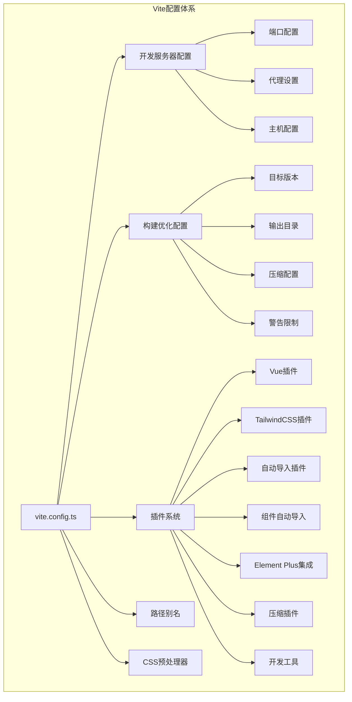
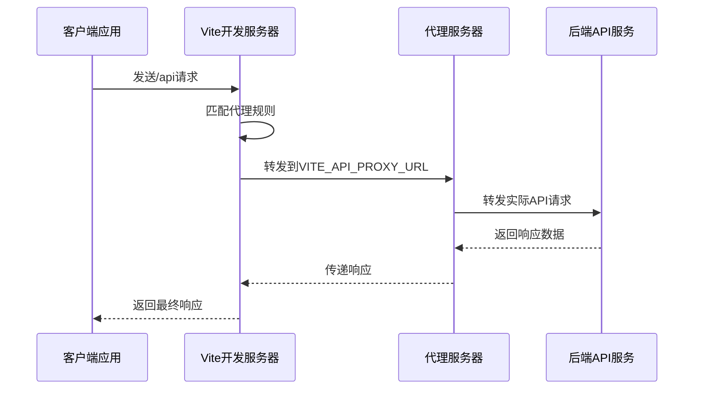
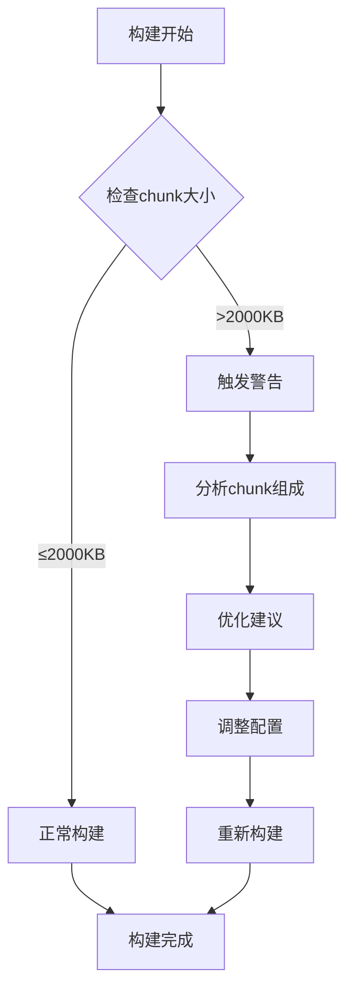
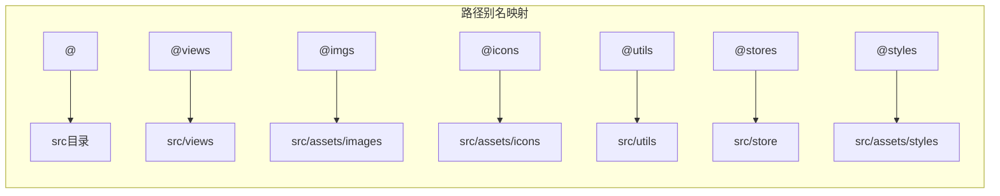
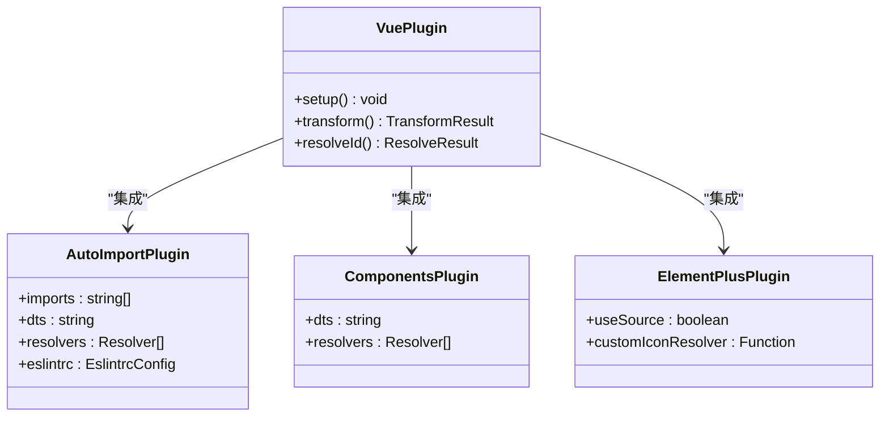
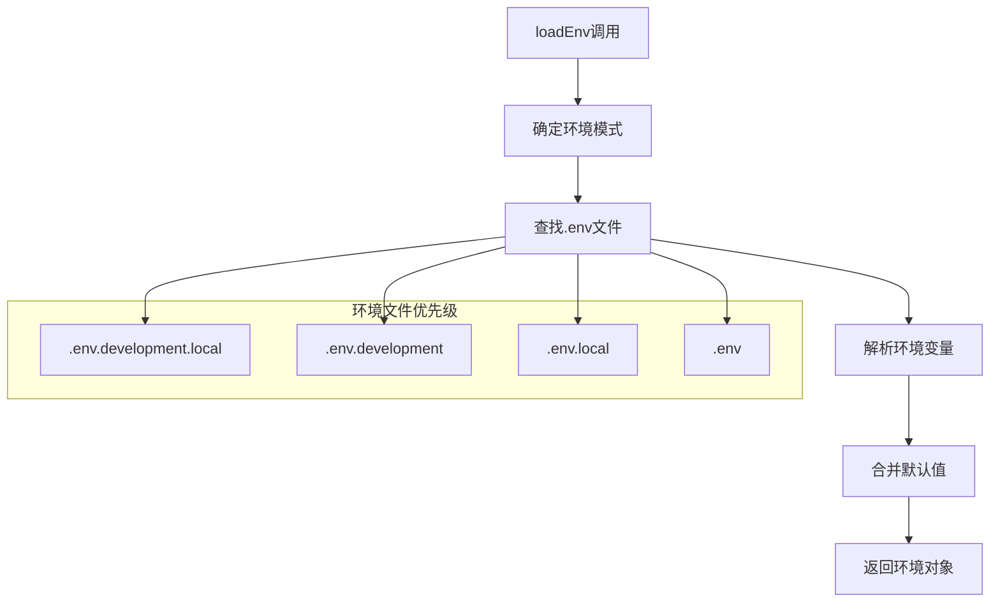
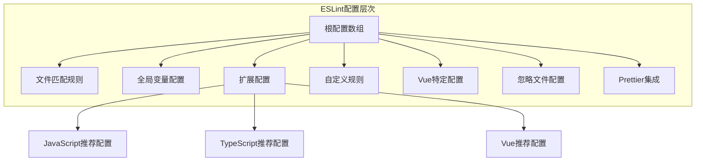
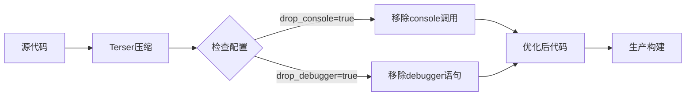
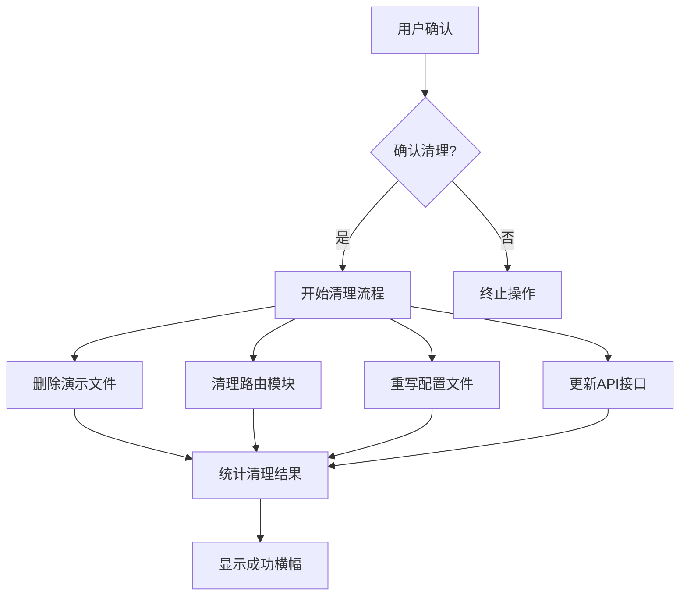

# Art Design Pro Vite构建配置与优化策略深度解析

<cite>
**本文档引用的文件**
- [vite.config.ts](file://vite.config.ts)
- [package.json](file://package.json)
- [eslint.config.mjs](file://eslint.config.mjs)
- [tsconfig.json](file://tsconfig.json)
- [src/env.d.ts](file://src/env.d.ts)
- [src/main.ts](file://src/main.ts)
- [src/types/config/index.ts](file://src/types/config/index.ts)
- [scripts/clean-dev.ts](file://scripts/clean-dev.ts)
</cite>

## 目录
1. [项目概述](#项目概述)
2. [Vite核心配置架构](#vite核心配置架构)
3. [开发服务器配置详解](#开发服务器配置详解)
4. [构建优化策略](#构建优化策略)
5. [路径别名系统](#路径别名系统)
6. [插件生态系统](#插件生态系统)
7. [环境变量管理](#环境变量管理)
8. [ESLint代码规范集成](#eslint代码规范集成)
9. [TypeScript配置优化](#typescript配置优化)
10. [性能优化实践案例](#性能优化实践案例)
11. [构建脚本与命令](#构建脚本与命令)
12. [总结与最佳实践](#总结与最佳实践)

## 项目概述

Art Design Pro是一个基于Vue 3和Vite构建的企业级前端解决方案，采用了现代化的构建工具链和工程化最佳实践。该项目展示了如何通过Vite的强大功能实现高效的开发体验和优化的生产构建。

### 技术栈特点
- **构建工具**: Vite 7.1.5 (基于Rollup)
- **框架**: Vue 3.5.21 + Vue Router 4.5.1 + Pinia 3.0.3
- **样式**: TailwindCSS 4.1.14 + SCSS
- **类型检查**: TypeScript 5.6.3
- **代码规范**: ESLint 9.9.1 + Prettier
- **包管理**: PNPM 8.8.0+

## Vite核心配置架构

### 配置文件结构分析

**图表来源**
- [vite.config.ts](file://vite.config.ts#L14-L157)

### 配置函数设计模式

Vite配置采用工厂函数模式，支持不同环境的动态配置：

**章节来源**
- [vite.config.ts](file://vite.config.ts#L14-L157)

## 开发服务器配置详解

### 代理配置实现API请求转发

项目的核心代理配置实现了前后端分离开发的最佳实践：

**图表来源**
- [vite.config.ts](file://vite.config.ts#L28-L34)

### 关键配置参数

| 配置项 | 默认值 | 说明 | 环境变量 |
|--------|--------|------|----------|
| `port` | 3000 | 开发服务器端口 | `VITE_PORT` |
| `host` | `false` | 是否监听所有网络接口 | - |
| `proxy` | `/api` | API请求代理规则 | `VITE_API_PROXY_URL` |

**章节来源**
- [vite.config.ts](file://vite.config.ts#L27-L36)

## 构建优化策略

### Chunk Size警告限制

项目设置了合理的chunk大小警告阈值，平衡了性能和打包效率：

**图表来源**
- [vite.config.ts](file://vite.config.ts#L50-L53)

### Terser压缩配置

生产环境的代码压缩策略针对不同场景进行了精细化配置：

| 压缩选项 | 配置值 | 作用 | 性能影响 |
|----------|--------|------|----------|
| `drop_console` | `true` | 移除console调用 | 减少包体积 |
| `drop_debugger` | `true` | 移除debugger语句 | 提升运行性能 |
| `minify` | `'terser'` | 使用Terser压缩器 | 平衡压缩率和兼容性 |

**章节来源**
- [vite.config.ts](file://vite.config.ts#L53-L61)

### 依赖预构建优化

项目预构建了大量第三方库，显著提升了开发服务器启动速度：

**章节来源**
- [vite.config.ts](file://vite.config.ts#L109-L124)

## 路径别名系统

### 丰富的别名配置

项目提供了全面的路径别名系统，简化了模块导入：

**图表来源**
- [vite.config.ts](file://vite.config.ts#L38-L47)

### 类型定义集成

路径别名不仅在运行时生效，还在TypeScript编译阶段提供智能提示：

**章节来源**
- [tsconfig.json](file://tsconfig.json#L14-L24)
- [src/env.d.ts](file://src/env.d.ts#L34-L35)

## 插件生态系统

### Vue插件配置

Vue插件作为核心插件，提供了完整的Vue 3开发支持：

**图表来源**
- [vite.config.ts](file://vite.config.ts#L68-L100)

### TailwindCSS集成

TailwindCSS插件提供了原生的CSS-in-JS支持，无需额外配置：

**章节来源**
- [vite.config.ts](file://vite.config.ts#L70-L70)

### 自动导入系统

#### AutoImport插件配置

AutoImport插件实现了智能的API自动导入功能：

| 导入类别 | 支持模块 | 自动生成类型 | ESLint集成 |
|----------|----------|--------------|------------|
| Vue Composition API | `vue` | ✅ | ✅ |
| Vue Router | `vue-router` | ✅ | ✅ |
| Pinia状态管理 | `pinia` | ✅ | ✅ |
| VueUse工具库 | `@vueuse/core` | ✅ | ✅ |

#### Components插件配置

组件自动导入系统大幅减少了模板中的导入语句：

**章节来源**
- [vite.config.ts](file://vite.config.ts#L71-L86)

### Element Plus主题定制

Element Plus插件支持按需加载和主题定制：

**章节来源**
- [vite.config.ts](file://vite.config.ts#L87-L91)

### 压缩插件配置

viteCompression插件提供了多种压缩算法支持：

| 参数 | 默认值 | 说明 | 性能影响 |
|------|--------|------|----------|
| `algorithm` | `'gzip'` | 压缩算法 | 高压缩率 |
| `threshold` | `10240` | 处理阈值(字节) | 减少传输时间 |
| `deleteOriginFile` | `false` | 删除原文件 | 节省存储空间 |

**章节来源**
- [vite.config.ts](file://vite.config.ts#L91-L99)

## 环境变量管理

### loadEnv机制

Vite的loadEnv函数提供了灵活的环境变量加载机制：

**图表来源**
- [vite.config.ts](file://vite.config.ts#L15-L17)

### 环境变量类型定义

项目提供了完整的环境变量类型定义，确保类型安全：

**章节来源**
- [src/types/config/index.ts](file://src/types/config/index.ts#L150-L167)
- [src/env.d.ts](file://src/env.d.ts#L34-L35)

### 版本号注入

项目通过define配置实现了编译时的版本号注入：

**章节来源**
- [vite.config.ts](file://vite.config.ts#L23-L25)

## ESLint代码规范集成

### 配置文件架构

ESLint配置采用了现代化的扁平化配置格式：

**图表来源**
- [eslint.config.mjs](file://eslint.config.mjs#L22-L84)

### 自动导入规则集成

项目通过读取AutoImport插件生成的配置文件，实现了ESLint对自动导入API的识别：

**章节来源**
- [eslint.config.mjs](file://eslint.config.mjs#L17-L20)
- [eslint.config.mjs](file://eslint.config.mjs#L47-L51)

### 代码规范规则

| 规则类别 | 具体规则 | 配置值 | 作用 |
|----------|----------|--------|------|
| 引号风格 | `quotes` | `'single'` | 统一使用单引号 |
| 分号规则 | `semi` | `'never'` | 移除语句末尾分号 |
| 变量声明 | `no-var` | `'error'` | 强制使用let/const |
| any类型 | `@typescript-eslint/no-explicit-any` | `'off'` | 关闭any类型检查 |
| Vue组件名 | `vue/multi-word-component-names` | `'off'` | 关闭多词组件名要求 |

**章节来源**
- [eslint.config.mjs](file://eslint.config.mjs#L54-L60)

## TypeScript配置优化

### 编译器选项

TypeScript配置针对现代Web开发进行了优化：

| 选项 | 值 | 说明 | 性能影响 |
|------|-----|------|----------|
| `target` | `esnext` | 最新ECMAScript特性 | 支持最新语法 |
| `module` | `esnext` | ES模块格式 | 更好的Tree Shaking |
| `strict` | `true` | 启用严格类型检查 | 提高代码质量 |
| `jsx` | `preserve` | 保留JSX语法 | 支持Vue SFC |
| `moduleResolution` | `node` | Node.js模块解析 | 兼容性更好 |

**章节来源**
- [tsconfig.json](file://tsconfig.json#L2-L13)

### 路径映射配置

TypeScript路径映射与Vite配置保持一致：

**章节来源**
- [tsconfig.json](file://tsconfig.json#L14-L24)

## 性能优化实践案例

### 生产环境去除console/debugger

项目通过Terser配置实现了生产环境的调试信息自动移除：

**图表来源**
- [vite.config.ts](file://vite.config.ts#L56-L60)

### 依赖预构建策略

项目预构建了大量第三方库，显著提升了开发体验：

**章节来源**
- [vite.config.ts](file://vite.config.ts#L109-L124)

### CSS优化配置

项目配置了SCSS预处理器和PostCSS插件，实现了CSS的自动化处理：

**章节来源**
- [vite.config.ts](file://vite.config.ts#L126-L149)

## 构建脚本与命令

### Package.json脚本映射

项目提供了完整的构建脚本集合：

| 脚本命令 | 对应Vite命令 | 用途 | 环境 |
|----------|-------------|------|------|
| `dev` | `vite --open` | 启动开发服务器 | 开发 |
| `build` | `vite build` | 生产环境构建 | 生产 |
| `serve` | `vite preview` | 预览生产构建 | 预览 |
| `lint` | `eslint` | 代码质量检查 | 全部 |
| `fix` | `eslint --fix` | 自动修复问题 | 全部 |
| `clean:dev` | `tsx scripts/clean-dev.ts` | 开发环境清理 | 开发 |

**章节来源**
- [package.json](file://package.json#L9-L20)

### 代码清理脚本

项目包含了一个专门的开发环境清理脚本，用于移除演示内容：

**图表来源**
- [scripts/clean-dev.ts](file://scripts/clean-dev.ts#L758-L839)

**章节来源**
- [scripts/clean-dev.ts](file://scripts/clean-dev.ts#L1-L800)

## 总结与最佳实践

### 构建配置最佳实践

1. **模块化配置**: 采用工厂函数模式，支持环境差异化配置
2. **插件生态**: 合理选择和配置插件，避免过度配置
3. **性能优化**: 通过预构建和压缩策略提升开发和运行性能
4. **类型安全**: 完整的TypeScript配置和类型定义
5. **开发体验**: 优秀的代理配置和热重载支持

### 工程化优势

- **开发效率**: 快速的热更新和智能的错误提示
- **构建质量**: 严格的代码规范和类型检查
- **部署优化**: 智能的资源压缩和缓存策略
- **维护成本**: 清晰的配置结构和完善的文档

### 适用场景

Art Design Pro的Vite配置方案特别适合：
- 企业级Vue应用开发
- 需要高性能构建的项目
- 团队协作开发项目
- 对代码质量要求较高的项目

通过深入理解和应用这些配置策略，开发者可以构建出高质量、高性能的现代Web应用程序。