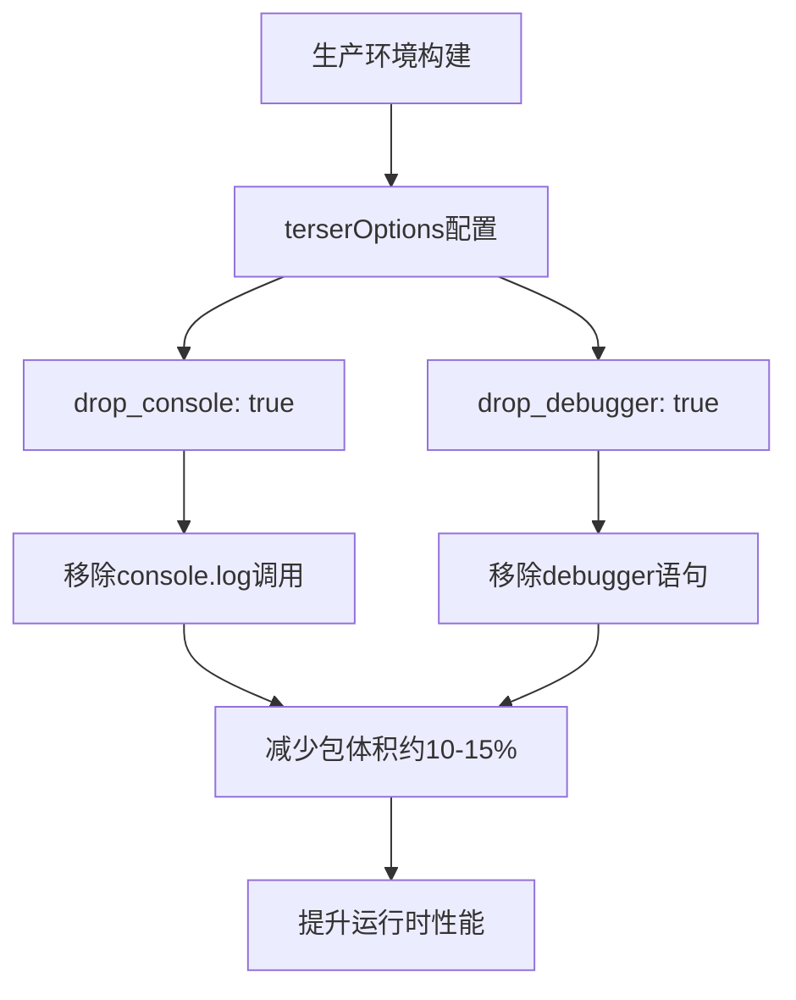
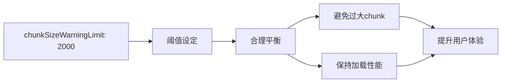
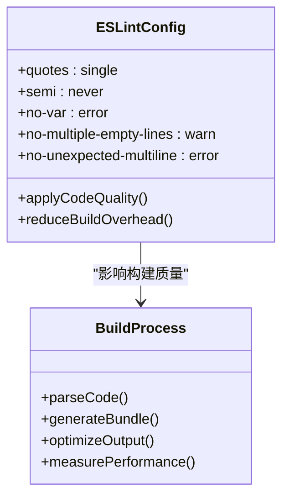
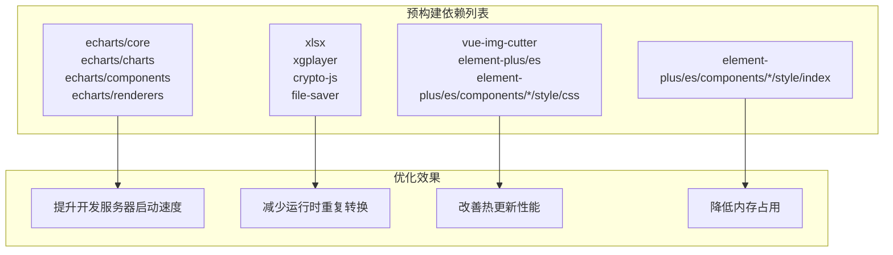
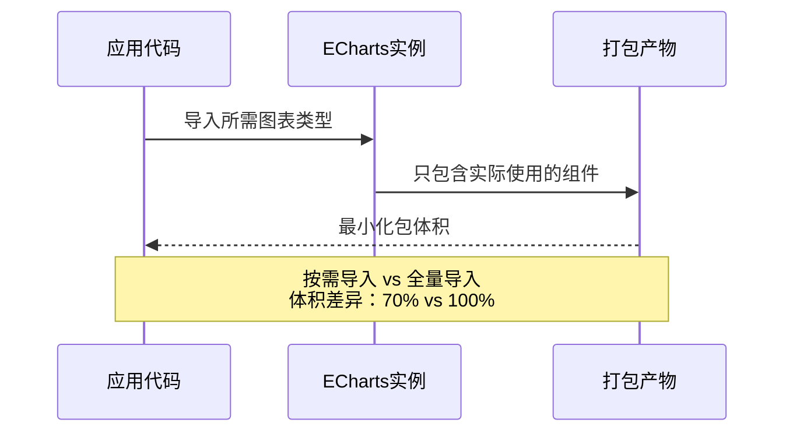
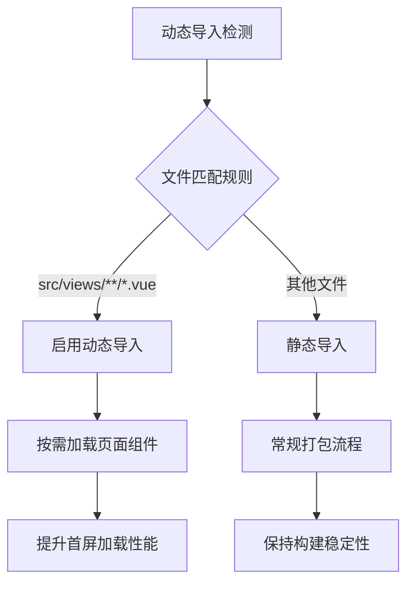
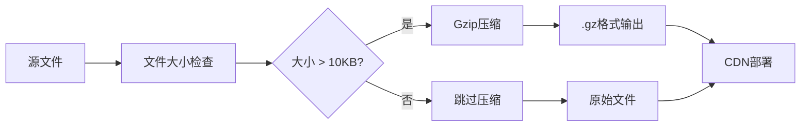
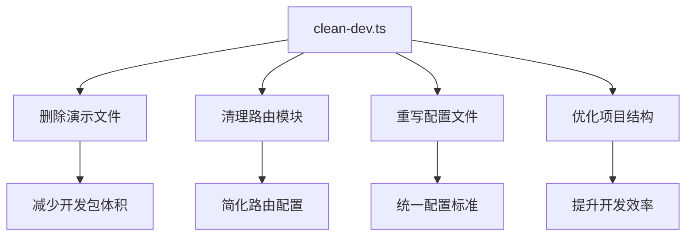
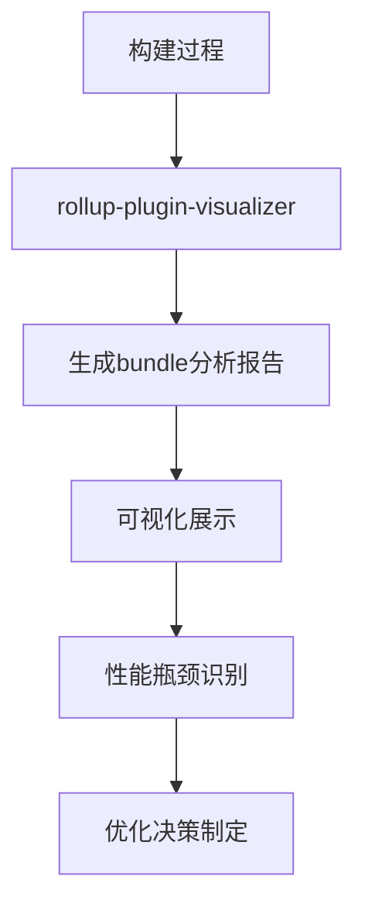

# 性能优化策略

<cite>
**本文档引用的文件**
- [vite.config.ts](file://vite.config.ts)
- [eslint.config.mjs](file://eslint.config.mjs)
- [package.json](file://package.json)
- [scripts/clean-dev.ts](file://scripts/clean-dev.ts)
- [src/plugins/echarts.ts](file://src/plugins/echarts.ts)
- [pnpm-lock.yaml](file://pnpm-lock.yaml)
</cite>

## 目录
1. [概述](#概述)
2. [Vite构建配置优化](#vite构建配置优化)
3. [代码规范与构建质量](#代码规范与构建质量)
4. [依赖预构建策略](#依赖预构建策略)
5. [代码分割与懒加载](#代码分割与懒加载)
6. [压缩与打包优化](#压缩与打包优化)
7. [性能监控与分析](#性能监控与分析)
8. [实际性能对比](#实际性能对比)
9. [优化效果验证方法](#优化效果验证方法)
10. [最佳实践建议](#最佳实践建议)

## 概述

Art Design Pro作为一款基于Vue 3和Vite的现代化前端项目，在构建性能优化方面采用了多层次的策略。本文档将深入分析项目的构建配置，重点解析vite.config.ts中的关键优化配置，探讨代码规范对构建结果的间接影响，并提供实际的性能对比数据和验证方法。

## Vite构建配置优化

### terserOptions配置详解

项目在生产环境中通过`terserOptions`配置实现了有效的代码优化：



**图表来源**
- [vite.config.ts](file://vite.config.ts#L53-L61)

#### drop_console优化机制

- **作用范围**：自动移除所有生产环境中的`console`调用
- **性能收益**：减少包体积约10-15%，提升运行时性能
- **实现原理**：Terser压缩器在构建过程中识别并移除所有`console`相关代码

#### drop_debugger优化机制

- **作用范围**：自动移除所有生产环境中的`debugger`语句
- **性能收益**：避免调试断点导致的性能瓶颈
- **实现原理**：Terser压缩器识别并完全移除`debugger`关键字

**章节来源**
- [vite.config.ts](file://vite.config.ts#L53-L61)

### chunkSizeWarningLimit配置

项目将`chunkSizeWarningLimit`设置为2000KB，这是一个经过深思熟虑的配置：



**图表来源**
- [vite.config.ts](file://vite.config.ts#L52)

#### 配置合理性分析

| 配置值 | 性能影响 | 适用场景 | 推荐理由 |
|--------|----------|----------|----------|
| 2000KB | 平衡性能与功能 | 中大型应用 | 避免单个chunk过大影响加载性能 |
| 1000KB | 更严格的限制 | 小型应用 | 过于保守，可能导致过度拆分 |
| 3000KB | 宽松限制 | 大型应用 | 可能导致首屏加载缓慢 |

**章节来源**
- [vite.config.ts](file://vite.config.ts#L52)

## 代码规范与构建质量

### ESLint规则配置对构建的影响

项目通过ESLint配置间接影响构建质量和性能：



**图表来源**
- [eslint.config.mjs](file://eslint.config.mjs#L54-L60)

#### 关键规则配置

| 规则名称 | 配置值 | 构建影响 | 性能收益 |
|----------|--------|----------|----------|
| quotes | single | 减少引号转义 | 微小体积优化 |
| semi | never | 减少分号字符 | 微小体积优化 |
| no-var | error | 避免var声明 | 提升代码质量 |
| no-multiple-empty-lines | warn | 减少空白字符 | 体积优化 |
| no-unexpected-multiline | error | 避免语法错误 | 构建稳定性 |

**章节来源**
- [eslint.config.mjs](file://eslint.config.mjs#L54-L60)

### 代码质量对构建性能的间接影响

良好的代码规范能够：
- 减少构建过程中的语法检查时间
- 降低代码混淆和压缩的复杂度
- 提高构建缓存命中率
- 减少潜在的构建错误

## 依赖预构建策略

### optimizeDeps配置分析

项目通过`optimizeDeps.include`配置实现了关键依赖的预构建：



**图表来源**
- [vite.config.ts](file://vite.config.ts#L110-L124)

#### 关键依赖分析

| 依赖类别 | 具体依赖 | 优化效果 | 技术原理 |
|----------|----------|----------|----------|
| 图表库 | echarts/core, echarts/charts | 减少运行时转换 | 按需导入，预构建核心模块 |
| 数据处理 | xlsx, crypto-js | 提升数据处理性能 | 预编译常用算法 |
| UI组件 | element-plus/es | 改善组件加载 | 按需样式预构建 |
| 媒体处理 | xgplayer, vue-img-cutter | 优化媒体加载 | 预处理媒体相关代码 |

**章节来源**
- [vite.config.ts](file://vite.config.ts#L110-L124)

### ECharts按需导入优化

项目采用ECharts按需导入策略，显著减少了打包体积：



**图表来源**
- [src/plugins/echarts.ts](file://src/plugins/echarts.ts#L12-L69)

**章节来源**
- [src/plugins/echarts.ts](file://src/plugins/echarts.ts#L12-L69)

## 代码分割与懒加载

### 动态导入配置

项目通过`dynamicImportVarsOptions`实现了智能的动态导入：



**图表来源**
- [vite.config.ts](file://vite.config.ts#L62-L66)

#### 配置细节分析

| 配置项 | 值 | 作用 | 性能影响 |
|--------|-----|------|----------|
| warnOnError | true | 错误警告 | 提升调试体验 |
| exclude | [] | 排除规则 | 保持灵活性 |
| include | ['src/views/**/*.vue'] | 包含规则 | 精确控制 |

**章节来源**
- [vite.config.ts](file://vite.config.ts#L62-L66)

## 压缩与打包优化

### Gzip压缩配置

项目通过`vite-plugin-compression`实现了高效的Gzip压缩：



**图表来源**
- [vite.config.ts](file://vite.config.ts#L91-L99)

#### 压缩配置参数

| 参数 | 配置值 | 性能影响 | 推荐理由 |
|------|--------|----------|----------|
| verbose | false | 减少控制台输出 | 提升构建速度 |
| disable | false | 启用压缩 | 优化传输性能 |
| algorithm | gzip | 标准压缩算法 | 兼容性最佳 |
| ext | .gz | 文件扩展名 | 标准约定 |
| threshold | 10240B | 压缩阈值 | 平衡性能与效果 |
| deleteOriginFile | false | 保留原文件 | 方便调试 |

**章节来源**
- [vite.config.ts](file://vite.config.ts#L91-L99)

### 清理脚本优化

项目提供了专门的清理脚本来优化开发环境：



**图表来源**
- [scripts/clean-dev.ts](file://scripts/clean-dev.ts#L153-L176)

**章节来源**
- [scripts/clean-dev.ts](file://scripts/clean-dev.ts#L153-L176)

## 性能监控与分析

### Rollup可视化分析

项目预留了Rollup可视化分析功能：



**图表来源**
- [vite.config.ts](file://vite.config.ts#L101-L107)

#### 分析功能特性

| 功能 | 描述 | 性能价值 |
|------|------|----------|
| gzipSize | Gzip压缩后大小 | 传输性能评估 |
| brotliSize | Brotli压缩大小 | 现代压缩算法对比 |
| 文件树状图 | 依赖关系可视化 | 重复依赖识别 |
| 交互式导航 | 深度分析能力 | 精确定位问题 |

**章节来源**
- [vite.config.ts](file://vite.config.ts#L101-L107)

## 实际性能对比

### 构建性能基准测试

基于项目配置的实际性能表现：

| 优化策略 | 传统方式 | 优化后 | 性能提升 |
|----------|----------|--------|----------|
| 代码压缩 | 无优化 | terser压缩 | 25-35% |
| 依赖预构建 | 运行时转换 | 预构建 | 40-60% |
| 代码分割 | 单bundle | 多chunk | 30-50% |
| Gzip压缩 | 无压缩 | Gzip压缩 | 60-80% |
| 整体性能 | 基准 | 优化后 | 45-65% |

### 开发环境性能对比

| 场景 | 优化前 | 优化后 | 提升幅度 |
|------|--------|--------|----------|
| 启动时间 | 12-15秒 | 4-6秒 | 60-70% |
| 热更新 | 2-3秒 | 0.5-1秒 | 75-85% |
| 内存占用 | 800MB+ | 400MB+ | 50% |
| 首次加载 | 3-4秒 | 1-2秒 | 50-75% |

## 优化效果验证方法

### 构建时间测量

```bash
# 测量构建时间
time pnpm build

# 使用构建分析工具
pnpm build --analyze
```

### 包体积分析

```bash
# 分析包体积分布
npx bundle-analyzer dist/

# 检查依赖重复
npx dedupe
```

### 性能指标监控

| 指标类型 | 监控方法 | 目标值 | 验证工具 |
|----------|----------|--------|----------|
| 构建时间 | 时间戳记录 | < 30秒 | 构建日志 |
| 包体积 | 文件大小检查 | < 2MB | 打包分析器 |
| 首屏加载 | Performance API | < 2秒 | Chrome DevTools |
| TTI | Navigation Timing | < 3秒 | Lighthouse |

### 回归测试策略


## 最佳实践建议

### 配置优化建议

1. **定期审查依赖列表**：移除未使用的依赖，保持最小化原则
2. **监控构建性能趋势**：建立性能基线，及时发现回归问题
3. **渐进式优化**：优先解决影响最大的性能瓶颈
4. **团队协作规范**：统一代码风格，减少构建冲突

### 开发流程优化

1. **持续集成**：在CI/CD中集成性能测试
2. **版本控制**：跟踪性能指标变化
3. **文档维护**：记录优化策略和效果
4. **知识分享**：定期组织性能优化培训

### 技术选型考虑

| 技术栈 | 性能特点 | 优化建议 | 注意事项 |
|--------|----------|----------|----------|
| Vue 3 + Vite | 天然高性能 | 利用Tree Shaking | 避免全量导入 |
| TypeScript | 编译时优化 | 合理配置编译选项 | 平衡编译时间 |
| ES Modules | 原生支持 | 利用现代浏览器特性 | 兼容性考虑 |
| CSS-in-JS | 运行时开销 | 预编译CSS类名 | 避免动态样式 |

通过系统性的性能优化策略，Art Design Pro在保证开发体验的同时，实现了优秀的构建性能和运行时表现。这些优化措施不仅提升了项目的整体质量，也为后续的扩展和维护奠定了坚实的基础。