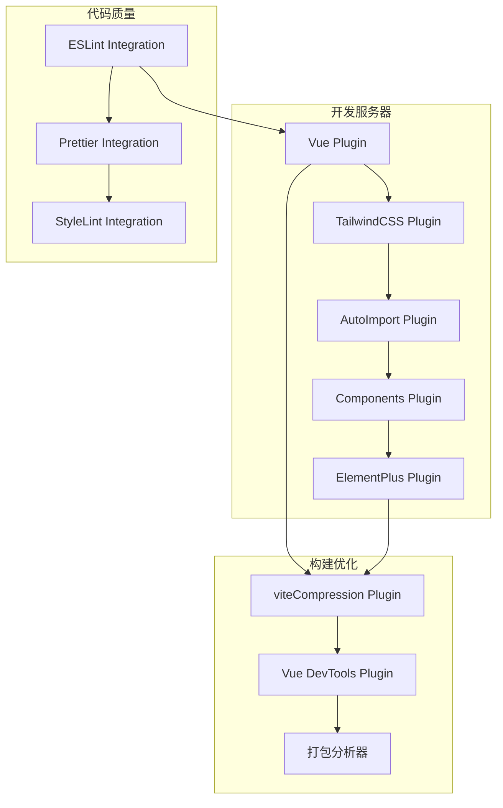
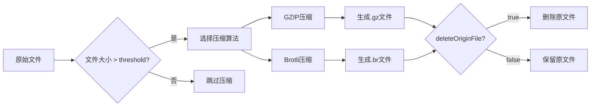
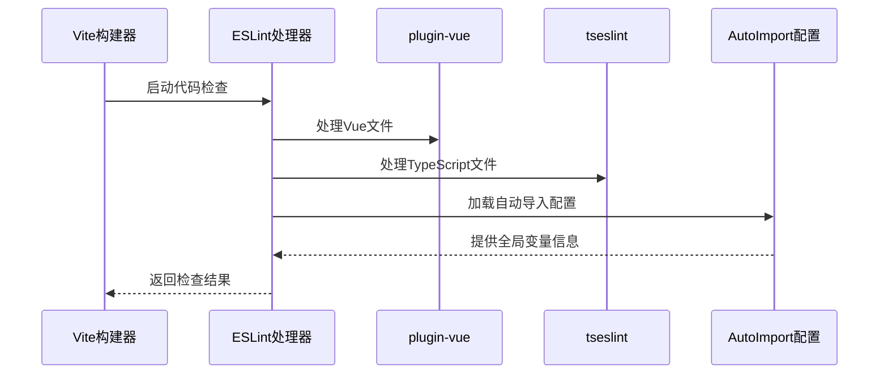
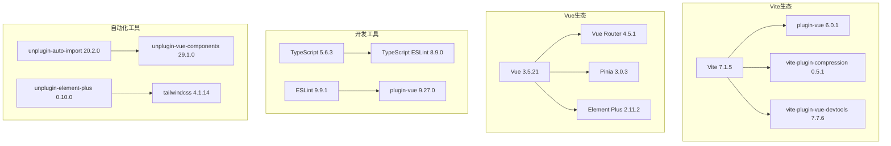
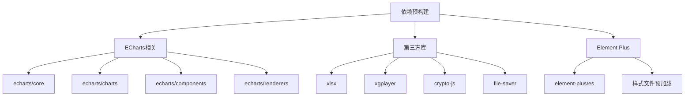

# 插件系统集成

<cite>
**本文档引用的文件**
- [vite.config.ts](file://vite.config.ts)
- [eslint.config.mjs](file://eslint.config.mjs)
- [package.json](file://package.json)
- [tsconfig.json](file://tsconfig.json)
- [src/types/import/auto-imports.d.ts](file://src/types/import/auto-imports.d.ts)
</cite>

## 目录
1. [概述](#概述)
2. [Vite插件架构](#vite插件架构)
3. [核心插件详解](#核心插件详解)
4. [ESLint集成配置](#eslint集成配置)
5. [版本兼容性分析](#版本兼容性分析)
6. [性能优化策略](#性能优化策略)
7. [故障排除指南](#故障排除指南)
8. [总结](#总结)

## 概述

Art Design Pro项目采用现代化的Vite构建工具作为开发和生产环境的核心基础设施，集成了完整的插件生态系统。该项目通过精心设计的插件配置，实现了高效的开发体验、代码质量保障和构建优化。本文档将深入分析项目中集成的各种Vite插件，重点探讨其配置细节、工作原理以及相互协作机制。

## Vite插件架构

### 插件系统概览

Art Design Pro的Vite配置采用了模块化的插件架构，每个插件承担特定的功能职责：



**图表来源**
- [vite.config.ts](file://vite.config.ts#L69-L100)

### 插件加载顺序

插件按照以下优先级顺序加载和执行：

1. **基础功能插件**：vue(), tailwindcss()
2. **开发辅助插件**：AutoImport, Components, ElementPlus
3. **构建优化插件**：viteCompression, vueDevTools
4. **调试工具插件**：打包分析器（可选）

**章节来源**
- [vite.config.ts](file://vite.config.ts#L68-L100)

## 核心插件详解

### Vue插件（@vitejs/plugin-vue）

Vue插件是整个开发体系的基础，负责处理Vue单文件组件（SFC）的编译和热更新。

#### 主要特性
- **单文件组件支持**：处理`.vue`文件的模板、脚本和样式部分
- **热模块替换（HMR）**：实现开发时的快速更新
- **TypeScript集成**：支持Vue组件中的TypeScript类型检查
- **自定义块处理**：支持非标准的自定义块（如i18n、docs）

#### 配置特点
- 默认启用，无需额外配置
- 与TypeScript编译器紧密集成
- 支持Vue 3 Composition API语法

**章节来源**
- [vite.config.ts](file://vite.config.ts#L69)

### TailwindCSS插件（@tailwindcss/vite）

TailwindCSS插件提供了现代化的CSS框架集成，支持原子化类名和响应式设计。

#### 核心功能
- **原子化CSS**：提供细粒度的样式控制
- **响应式设计**：内置断点和媒体查询支持
- **主题定制**：支持颜色、字体、间距等主题变量
- **暗色模式**：内置暗色模式切换机制

#### 集成方式
- 作为独立的Vite插件运行
- 与PostCSS插件链协同工作
- 支持动态类名检测和优化

**章节来源**
- [vite.config.ts](file://vite.config.ts#L70)

### AutoImport插件（unplugin-auto-import）

AutoImport插件实现了自动导入功能，显著减少样板代码的编写。

#### 配置参数详解

```mermaid
flowchart TD
A[AutoImport配置] --> B[imports数组]
A --> C[dts类型声明]
A --> D[resolvers解析器]
A --> E[eslintrc配置]
B --> B1[Vue API]
B --> B2[Vue Router]
B --> B3[Pinia状态管理]
B --> B4[@VueUse工具库]
D --> D1[ElementPlusResolver]
E --> E1[启用ESLint规则]
E --> E2[配置文件路径]
E --> E3[全局变量支持]
```

**图表来源**
- [vite.config.ts](file://vite.config.ts#L72-L80)

#### 关键配置项

| 参数 | 类型 | 默认值 | 说明 |
|------|------|--------|------|
| imports | Array<string\|object> | ['vue'] | 导入的目标模块列表 |
| dts | string | false | 自动生成的类型声明文件路径 |
| resolvers | Array<Resolver> | [] | 解析器数组，用于识别组件和API |
| eslintrc.enabled | boolean | false | 是否生成ESLint配置文件 |
| eslintrc.filepath | string | './.auto-imports.json' | ESLint配置文件路径 |
| eslintrc.globalsPropValue | boolean \| string | true | 全局变量属性值 |

#### 工作原理
1. **扫描阶段**：分析项目中的JavaScript/TypeScript文件
2. **识别阶段**：识别需要自动导入的API和组件
3. **生成阶段**：创建类型声明文件和ESLint配置
4. **注入阶段**：在编译时注入导入语句

**章节来源**
- [vite.config.ts](file://vite.config.ts#L72-L80)
- [src/types/import/auto-imports.d.ts](file://src/types/import/auto-imports.d.ts#L1-L320)

### Components插件（unplugin-vue-components）

Components插件实现了Vue组件的自动注册和按需加载。

#### 核心特性
- **自动注册**：扫描指定目录下的组件并自动注册
- **按需加载**：只加载实际使用的组件
- **命名规范**：支持多种组件命名约定
- **解析器支持**：与ElementPlus等UI库集成

#### 配置策略
- **目录扫描**：自动发现`src/components`目录下的组件
- **命名规则**：支持kebab-case和PascalCase命名
- **解析器集成**：与ElementPlus Resolver配合使用

#### 类型安全
- 自动生成组件类型声明
- 支持IDE智能提示和类型检查
- 与Vue SFC编译器深度集成

**章节来源**
- [vite.config.ts](file://vite.config.ts#L83-L86)

### ElementPlus按需引入插件（unplugin-element-plus）

ElementPlus插件专门处理Element Plus UI库的按需加载和主题定制。

#### 主题定制功能
- **源码引入**：直接从源码构建，支持完全定制
- **样式隔离**：确保样式不会污染全局
- **动态主题**：支持运行时主题切换

#### 配置选项
- **useSource**: boolean - 是否使用源码构建
- **outputStyle**: string - 输出样式的格式
- **injectStyles**: boolean - 是否自动注入样式

#### 与AutoImport的协作
- 共享ElementPlusResolver
- 统一的组件和API导入机制
- 协调的主题配置

**章节来源**
- [vite.config.ts](file://vite.config.ts#L88-L90)

### viteCompression打包压缩插件

viteCompression插件负责在构建过程中对静态资源进行压缩，优化部署性能。

#### 压缩算法配置



**图表来源**
- [vite.config.ts](file://vite.config.ts#L92-L99)

#### 配置参数详解

| 参数 | 类型 | 默认值 | 说明 | 性能影响 |
|------|------|--------|------|----------|
| verbose | boolean | true | 是否在控制台输出压缩结果 | 开发体验 |
| disable | boolean | false | 是否禁用压缩功能 | 构建时间 |
| algorithm | string | 'gzip' | 压缩算法：gzip/brotli | 压缩率和兼容性 |
| ext | string | '.gz' | 压缩文件扩展名 | 文件命名规则 |
| threshold | number | 10240 | 最小压缩文件大小（字节） | 压缩效率 |
| deleteOriginFile | boolean | false | 压缩后是否删除原文件 | 存储空间 |

#### 压缩效果分析

- **GZIP vs Brotli**：Brotli提供更好的压缩率但计算成本更高
- **阈值设置**：10KB的阈值平衡了压缩效果和性能开销
- **存储优化**：保留原文件便于调试和回滚

**章节来源**
- [vite.config.ts](file://vite.config.ts#L92-L99)

## ESLint集成配置

### 集成架构

ESLint与Vite的集成采用了现代化的配置方式，支持TypeScript和Vue文件的统一处理。



**图表来源**
- [eslint.config.mjs](file://eslint.config.mjs#L1-L84)

### 核心插件配置

#### pluginVue配置
- **flat/essential**：提供Vue文件的基本检查规则
- **TypeScript解析**：支持Vue SFC中的TypeScript部分
- **自定义解析器**：与TypeScript ESLint解析器集成

#### tseslint配置
- **推荐配置**：包含TypeScript的最佳实践规则
- **解析器集成**：使用`@typescript-eslint/parser`
- **装饰器支持**：处理Vue装饰器语法

#### 全局变量管理

ESLint配置通过读取AutoImport插件生成的配置文件，自动识别项目中的全局变量：

```javascript
// 从AutoImport配置中读取全局变量
const autoImportConfig = JSON.parse(
  fs.readFileSync(path.resolve(__dirname, '.auto-import.json'), 'utf-8')
)
```

**章节来源**
- [eslint.config.mjs](file://eslint.config.mjs#L1-L84)

### 规则配置策略

| 规则类别 | 配置要点 | 目的 |
|----------|----------|------|
| 代码风格 | single quotes, no semicolons | 保持一致的编码风格 |
| 类型检查 | @typescript-eslint/no-explicit-any off | 平衡类型安全与开发效率 |
| Vue规范 | vue/multi-word-component-names off | 支持简短的组件名称 |
| 空行控制 | no-multiple-empty-lines warn | 控制文件格式一致性 |
| 调试信息 | drop_console true | 生产环境移除调试信息 |

**章节来源**
- [eslint.config.mjs](file://eslint.config.mjs#L54-L60)

## 版本兼容性分析

### 核心依赖版本关系

基于package.json的依赖分析，各插件版本具有良好的兼容性：



**图表来源**
- [package.json](file://package.json#L54-L122)

### 版本兼容性矩阵

| 插件 | 当前版本 | 推荐版本 | 兼容性风险 | 升级建议 |
|------|----------|----------|------------|----------|
| @vitejs/plugin-vue | 6.0.1 | 6.x | 低 | 保持稳定版本 |
| vite-plugin-compression | 0.5.1 | 0.5.x | 低 | 定期更新 |
| unplugin-auto-import | 20.2.0 | 20.x | 低 | 功能增强版本 |
| unplugin-vue-components | 29.1.0 | 29.x | 低 | 性能优化版本 |
| unplugin-element-plus | 0.10.0 | 0.10.x | 低 | 主要修复版本 |
| @tailwindcss/vite | 4.1.14 | 4.x | 低 | 新特性版本 |

### TypeScript集成

项目使用严格的TypeScript配置，确保类型安全：

- **目标版本**：ESNext
- **模块系统**：ESNext
- **严格模式**：启用
- **JSX处理**：preserve
- **类型声明**：自动生成

**章节来源**
- [package.json](file://package.json#L54-L122)
- [tsconfig.json](file://tsconfig.json#L1-L28)

## 性能优化策略

### 构建性能优化

#### 依赖预构建（optimizeDeps）
项目配置了详细的依赖预构建策略，避免运行时重复请求：



**图表来源**
- [vite.config.ts](file://vite.config.ts#L110-L124)

#### 压缩策略优化
- **阈值设置**：10KB的压缩阈值平衡了压缩效果和性能
- **算法选择**：默认使用GZIP算法，兼顾压缩率和兼容性
- **文件保留**：保留原文件便于调试和问题排查

#### 代码分割优化
- **动态导入**：对视图组件使用动态导入
- **chunk大小限制**：2MB的警告阈值防止过大chunk
- **terser优化**：生产环境移除console和debugger

**章节来源**
- [vite.config.ts](file://vite.config.ts#L50-L66)

### 开发体验优化

#### 热更新优化
- **模块热替换**：Vue组件支持快速热更新
- **CSS热更新**：样式修改即时生效
- **类型检查**：TypeScript类型错误实时反馈

#### 调试工具集成
- **Vue DevTools**：提供强大的调试和分析功能
- **源码映射**：完整的Source Map支持
- **错误边界**：完善的错误捕获和显示机制

## 故障排除指南

### 常见问题及解决方案

#### AutoImport插件问题

**问题**：自动导入的API无法识别
**原因**：类型声明文件未正确生成
**解决方案**：
1. 检查`dts`配置路径
2. 清理`.auto-imports.json`文件
3. 重启开发服务器

**问题**：ESLint报错找不到导入的API
**原因**：ESLint配置未正确加载AutoImport配置
**解决方案**：
1. 确保`.auto-imports.json`文件存在
2. 检查ESLint配置中的全局变量设置
3. 重新启动ESLint服务

#### Components插件问题

**问题**：组件无法自动注册
**原因**：组件路径扫描配置错误
**解决方案**：
1. 检查组件目录结构
2. 确认解析器配置正确
3. 验证组件命名规范

#### ElementPlus插件问题

**问题**：主题样式不生效
**原因**：样式文件加载顺序错误
**解决方案**：
1. 检查CSS加载顺序
2. 确认useSource配置
3. 验证主题配置文件

#### viteCompression插件问题

**问题**：压缩文件未生成
**原因**：文件大小未达到阈值或算法配置错误
**解决方案**：
1. 检查threshold配置
2. 验证algorithm设置
3. 确认verbose输出

### 性能问题诊断

#### 构建速度慢
1. **检查依赖预构建**：确认optimizeDeps配置
2. **分析chunk大小**：调整chunkSizeWarningLimit
3. **优化压缩配置**：根据需求调整压缩参数

#### 内存占用过高
1. **减少并发任务**：调整build.parallel配置
2. **优化类型检查**：使用增量类型检查
3. **清理缓存**：定期清理构建缓存

**章节来源**
- [vite.config.ts](file://vite.config.ts#L68-L100)

## 总结

Art Design Pro项目的Vite插件体系展现了现代前端工程化的最佳实践。通过精心设计的插件组合，项目实现了：

### 技术优势
- **开发效率**：自动导入和组件注册大幅减少样板代码
- **代码质量**：ESLint和TypeScript确保代码规范性和类型安全
- **构建性能**：合理的压缩策略和依赖预构建优化构建速度
- **维护性**：模块化的插件架构便于维护和扩展

### 架构特色
- **统一配置**：ESLint与Vite的无缝集成
- **类型安全**：完整的TypeScript类型支持
- **主题定制**：Element Plus的灵活主题配置
- **性能优化**：多层次的性能优化策略

### 发展方向
- **插件生态**：持续关注新插件和工具的发展
- **性能优化**：探索更先进的构建优化技术
- **开发体验**：进一步提升开发和调试体验
- **团队协作**：标准化插件配置和最佳实践

这套插件系统不仅满足了当前项目的需求，也为未来的功能扩展和技术升级奠定了坚实的基础。通过合理的配置和持续的优化，它能够有效支撑大型Vue应用的开发和部署需求。