# 构建配置详解

<cite>
**本文档中引用的文件**
- [vite.config.ts](file://vite.config.ts)
- [package.json](file://package.json)
- [src/env.d.ts](file://src/env.d.ts)
- [tsconfig.json](file://tsconfig.json)
- [src/main.ts](file://src/main.ts)
- [src/utils/http/index.ts](file://src/utils/http/index.ts)
- [src/config/index.ts](file://src/config/index.ts)
- [src/config/setting.ts](file://src/config/setting.ts)
</cite>

## 目录
1. [项目概述](#项目概述)
2. [Vite配置架构](#vite配置架构)
3. [环境变量配置](#环境变量配置)
4. [开发服务器配置](#开发服务器配置)
5. [构建输出配置](#构建输出配置)
6. [路径别名配置](#路径别名配置)
7. [插件系统](#插件系统)
8. [CSS预处理器配置](#css预处理器配置)
9. [依赖优化配置](#依赖优化配置)
10. [脚本命令详解](#脚本命令详解)
11. [配置最佳实践](#配置最佳实践)
12. [常见问题解决](#常见问题解决)

## 项目概述

Art Design Pro是一个基于Vue 3、TypeScript和Vite构建的企业级前端框架。该项目采用了现代化的构建工具链，提供了完整的开发和生产环境配置。通过深入分析其vite.config.ts配置文件，我们可以了解如何构建一个高效、可维护的现代前端项目。

## Vite配置架构

Vite配置采用函数式导出模式，支持根据不同的构建模式动态调整配置：

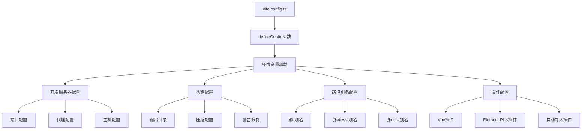

**图表来源**
- [vite.config.ts](file://vite.config.ts#L14-L157)

**章节来源**
- [vite.config.ts](file://vite.config.ts#L1-L157)

## 环境变量配置

### loadEnv机制

项目使用Vite的`loadEnv`函数实现环境变量的动态加载，支持不同构建模式下的配置分离：

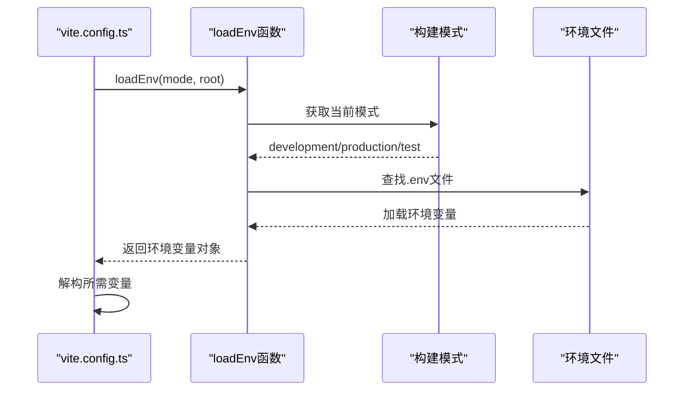

**图表来源**
- [vite.config.ts](file://vite.config.ts#L15-L17)

### 环境变量类型

项目定义了完整的环境变量类型系统，确保类型安全：

| 变量名 | 类型 | 描述 | 默认值 |
|--------|------|------|--------|
| VITE_VERSION | string | 应用版本号 | 从package.json读取 |
| VITE_PORT | string | 开发服务器端口 | 3000 |
| VITE_BASE_URL | string | 应用基础路径 | / |
| VITE_API_URL | string | API基础地址 | http://localhost:3000 |
| VITE_API_PROXY_URL | string | API代理目标地址 | http://localhost:3000 |

### 实际应用场景

环境变量在项目中的具体应用：

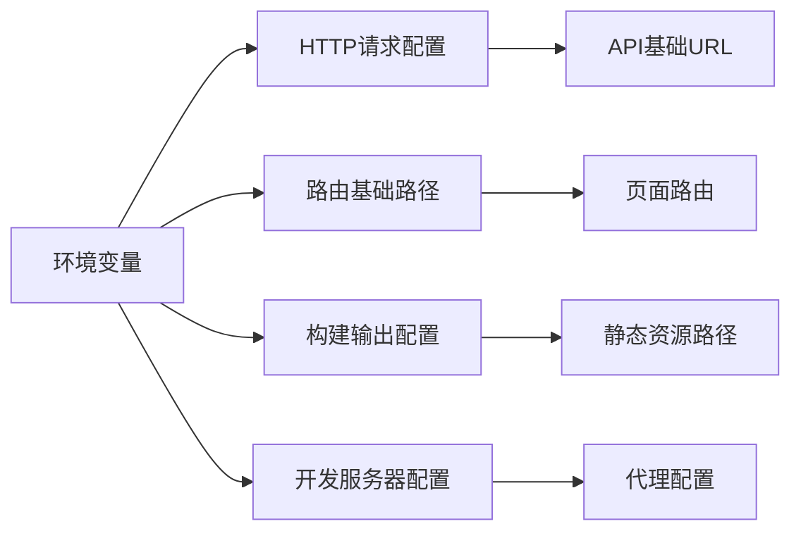

**图表来源**
- [src/utils/http/index.ts](file://src/utils/http/index.ts#L40-L47)
- [vite.config.ts](file://vite.config.ts#L25-L27)

**章节来源**
- [vite.config.ts](file://vite.config.ts#L14-L21)
- [src/utils/http/index.ts](file://src/utils/http/index.ts#L40-L47)

## 开发服务器配置

### 端口配置

开发服务器支持灵活的端口配置，通过环境变量控制：

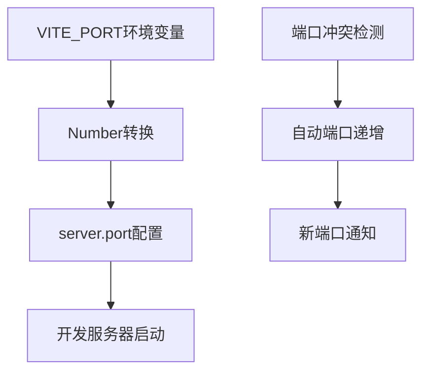

**图表来源**
- [vite.config.ts](file://vite.config.ts#L27-L28)

### 代理配置

项目实现了完整的API代理转发机制，支持跨域请求处理：

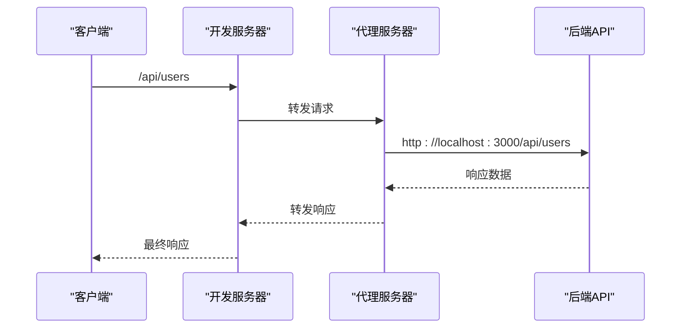

**图表来源**
- [vite.config.ts](file://vite.config.ts#L29-L33)

### 主机配置

开发服务器配置为`host: true`，允许通过局域网访问开发环境。

**章节来源**
- [vite.config.ts](file://vite.config.ts#L27-L36)

## 构建输出配置

### 输出目录配置

构建输出目录固定为`dist`，这是Vite的默认配置，便于部署和CDN集成。

### 块大小警告限制

项目设置了2000KB的块大小警告阈值，平衡了性能和用户体验：

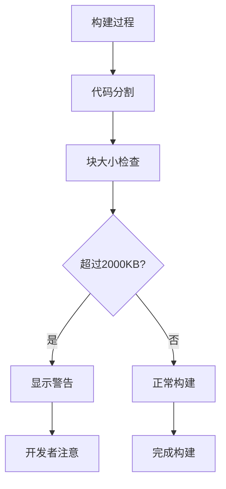

**图表来源**
- [vite.config.ts](file://vite.config.ts#L51-L52)

### 压缩配置

项目启用了Terser压缩，并针对生产环境进行了特殊优化：

| 优化选项 | 值 | 作用 |
|----------|-----|------|
| drop_console | true | 移除console语句 |
| drop_debugger | true | 移除debugger语句 |
| minify | terser | 使用Terser进行代码压缩 |

### 动态导入优化

配置了动态导入变量的警告和包含规则，确保只有必要的视图组件参与动态导入。

**章节来源**
- [vite.config.ts](file://vite.config.ts#L49-L66)

## 路径别名配置

### 别名体系设计

项目建立了完整的路径别名体系，提高代码可读性和维护性：

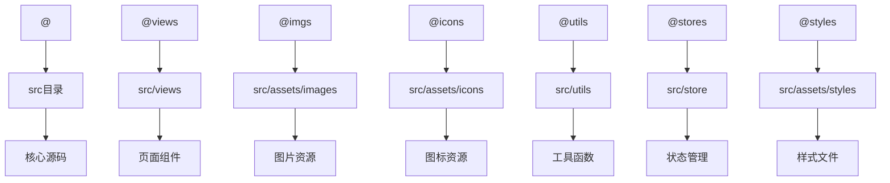

**图表来源**
- [vite.config.ts](file://vite.config.ts#L38-L47)
- [tsconfig.json](file://tsconfig.json#L15-L24)

### TypeScript集成

路径别名不仅在Vite中生效，在TypeScript编译器中也得到支持，确保IDE智能提示和类型检查的一致性。

### 自定义解析函数

项目使用自定义的`resolvePath`函数来解析相对路径，确保路径解析的准确性。

**章节来源**
- [vite.config.ts](file://vite.config.ts#L38-L47)
- [tsconfig.json](file://tsconfig.json#L15-L24)

## 插件系统

### 核心插件架构

项目集成了多个强大的Vite插件，形成了完整的开发和构建生态：

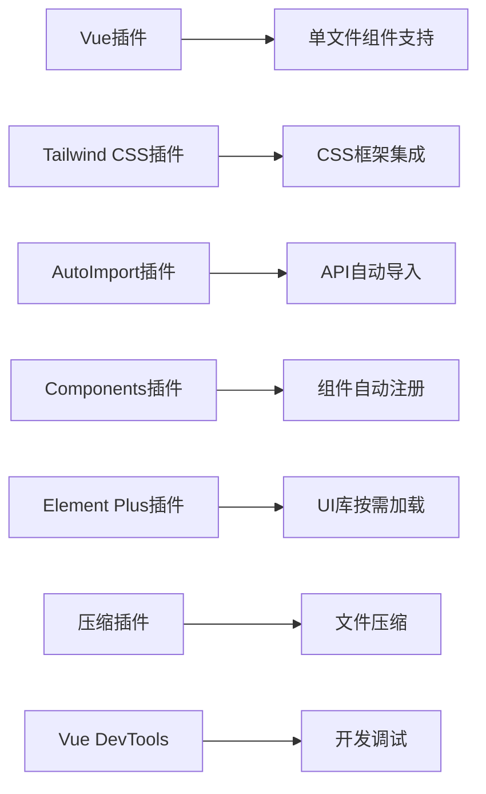

**图表来源**
- [vite.config.ts](file://vite.config.ts#L68-L100)

### 自动导入系统

#### API自动导入

AutoImport插件配置了多种API的自动导入：

| 导入类型 | 模块 | 用途 |
|----------|------|------|
| vue | Vue 3核心API | 响应式、组合式API |
| vue-router | 路由API | 路由导航和管理 |
| pinia | 状态管理 | 全局状态管理 |
| @vueuse/core | 工具函数 | 常用工具函数 |

#### 组件自动导入

Components插件实现了Vue组件的自动注册，支持Element Plus组件的按需加载。

### Element Plus集成

项目使用unplugin-element-plus实现UI库的按需加载和主题定制。

### 压缩优化

vite-plugin-compression插件提供了Gzip压缩支持，优化了生产环境的传输效率。

**章节来源**
- [vite.config.ts](file://vite.config.ts#L68-L100)

## CSS预处理器配置

### SCSS预处理器

项目配置了SCSS预处理器的全局变量和混入：

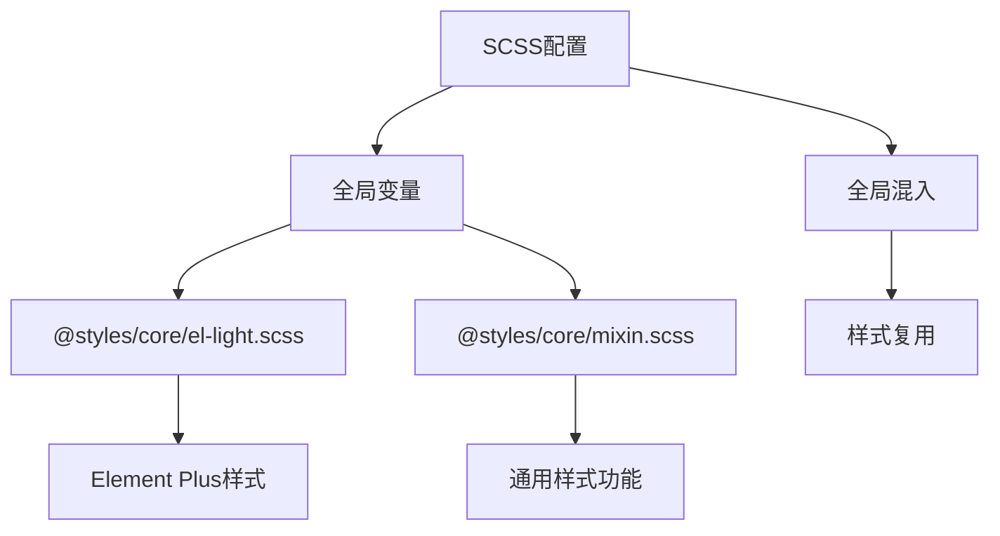

**图表来源**
- [vite.config.ts](file://vite.config.ts#L127-L134)

### PostCSS配置

项目配置了PostCSS插件来移除无用的字符集声明：


**图表来源**
- [vite.config.ts](file://vite.config.ts#L136-L149)

**章节来源**
- [vite.config.ts](file://vite.config.ts#L126-L149)

## 依赖优化配置

### 预构建优化

项目配置了详细的依赖预构建规则，提升首次加载性能：

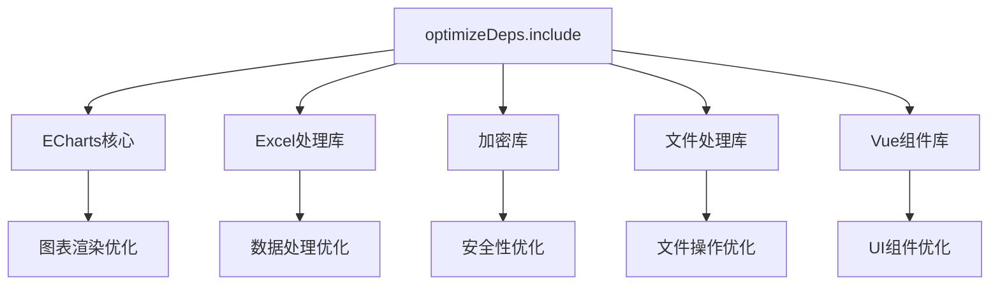

**图表来源**
- [vite.config.ts](file://vite.config.ts#L110-L124)

### 关键依赖分析

| 依赖类别 | 具体依赖 | 优化目的 |
|----------|----------|----------|
| 图表库 | echarts/core, echarts/charts | 提升图表渲染性能 |
| 数据处理 | xlsx | Excel文件处理优化 |
| 安全性 | crypto-js | 加密功能预构建 |
| 文件操作 | file-saver, vue-img-cutter | 文件处理性能优化 |
| UI组件 | element-plus/es | 组件库加载优化 |

**章节来源**
- [vite.config.ts](file://vite.config.ts#L110-L124)

## 脚本命令详解

### 开发命令

```bash
npm run dev
```

开发命令的完整流程：

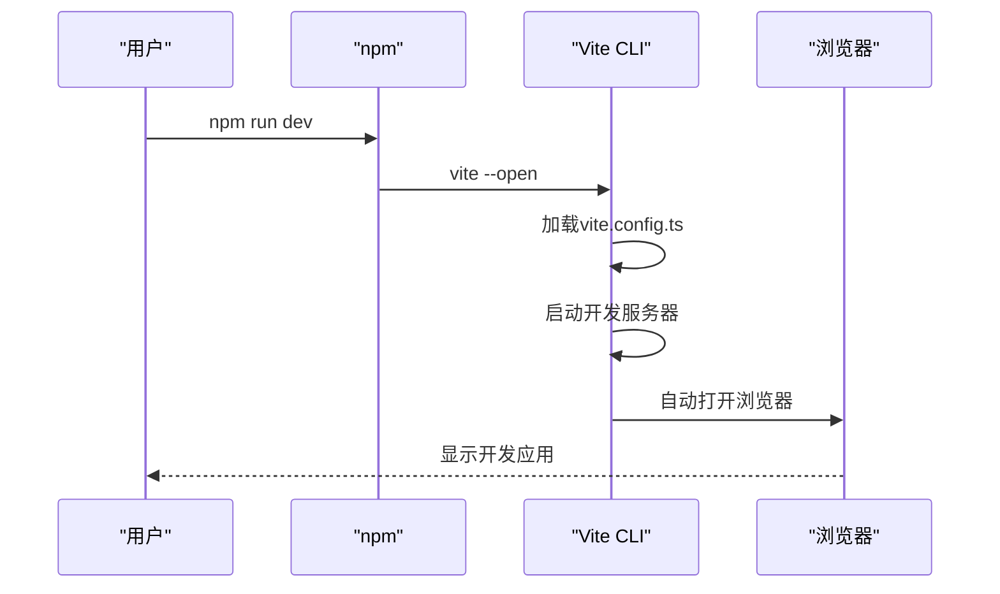

**图表来源**
- [package.json](file://package.json#L9-L12)

### 构建命令

```bash
npm run build
```

构建命令的执行流程：

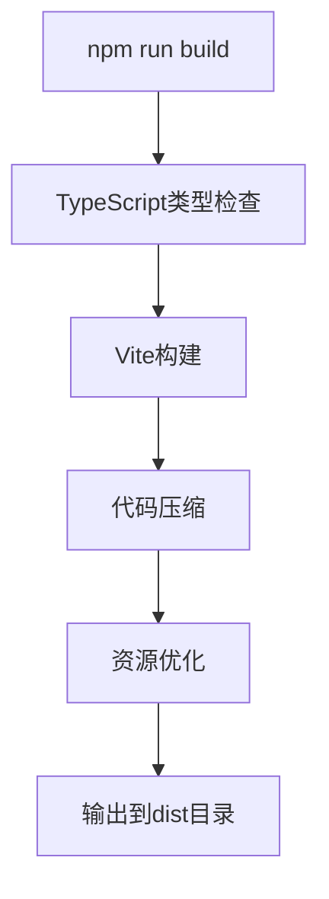

**图表来源**
- [package.json](file://package.json#L10-L11)

### 预览命令

```bash
npm run serve
```

预览命令用于本地测试生产构建结果。

### TypeScript类型检查

构建过程中会先执行`vue-tsc --noEmit`进行类型检查，确保代码质量。

**章节来源**
- [package.json](file://package.json#L9-L12)

## 配置最佳实践

### 环境变量管理

1. **命名规范**：使用`VITE_`前缀标识前端可用的环境变量
2. **类型安全**：通过TypeScript接口定义环境变量类型
3. **默认值**：为每个环境变量提供合理的默认值
4. **文档化**：在代码中注释每个环境变量的用途

### 性能优化建议

1. **代码分割**：合理配置动态导入，实现按需加载
2. **资源压缩**：启用Gzip压缩和代码混淆
3. **缓存策略**：配置适当的缓存头和版本控制
4. **懒加载**：对非关键资源实施懒加载

### 开发体验优化

1. **热更新**：确保开发服务器的热更新功能正常
2. **错误提示**：配置清晰的错误提示和堆栈跟踪
3. **调试工具**：集成Vue DevTools等调试工具
4. **代理配置**：正确配置API代理，避免跨域问题

### 部署配置建议

1. **基础路径**：根据部署环境设置正确的base URL
2. **CDN配置**：对于大型项目考虑CDN加速
3. **静态资源**：合理配置静态资源的缓存策略
4. **监控告警**：建立构建和部署的监控机制

## 常见问题解决

### 端口冲突处理

**问题描述**：开发服务器启动时提示端口已被占用

**解决方案**：
1. 检查`VITE_PORT`环境变量设置
2. 使用系统命令查找占用端口的进程
3. 更改`VITE_PORT`值或终止占用进程
4. 在代码中添加端口自动递增逻辑

### 代理配置错误排查

**问题描述**：API请求无法通过代理转发

**排查步骤**：
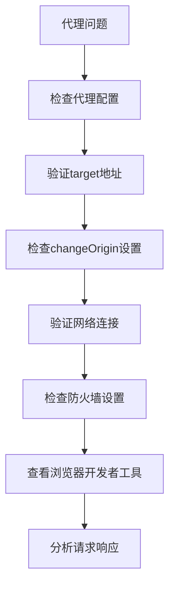

**图表来源**
- [vite.config.ts](file://vite.config.ts#L29-L33)

### 路径别名失效

**问题描述**：导入路径别名无法解析

**解决方案**：
1. 检查vite.config.ts中的alias配置
2. 验证tsconfig.json中的paths配置
3. 清理IDE缓存并重启编辑器
4. 确保文件路径拼写正确

### 构建失败问题

**问题描述**：构建过程中出现各种错误

**常见原因及解决方案**：

| 错误类型 | 可能原因 | 解决方案 |
|----------|----------|----------|
| 类型检查错误 | TypeScript类型不匹配 | 修复类型定义或添加类型断言 |
| 依赖解析错误 | 缺少必要依赖 | 安装缺失的依赖包 |
| 内存不足 | 构建过程内存溢出 | 增加Node.js内存限制 |
| 文件过大 | 单个文件超出限制 | 优化代码结构或拆分文件 |

### 环境变量加载失败

**问题描述**：环境变量无法正确加载

**排查方法**：
1. 检查.env文件是否存在且格式正确
2. 验证环境变量名称是否以VITE_开头
3. 确认构建模式参数传递正确
4. 检查环境变量值的引号使用

### 插件兼容性问题

**问题描述**：某些插件导致构建失败或功能异常

**解决方案**：
1. 检查插件版本兼容性
2. 更新到最新稳定版本
3. 查阅插件文档确认配置正确
4. 在社区论坛或GitHub Issues中寻求帮助

通过以上详细的配置分析和问题解决方案，开发者可以更好地理解和优化Art Design Pro项目的构建配置，提升开发效率和项目质量。