# Vue3架构设计与组合式API应用深度解析

<cite>
**本文档引用的文件**
- [src/App.vue](file://src/App.vue)
- [src/main.ts](file://src/main.ts)
- [src/hooks/core/useTheme.ts](file://src/hooks/core/useTheme.ts)
- [src/hooks/core/useAuth.ts](file://src/hooks/core/useAuth.ts)
- [src/hooks/core/useAppMode.ts](file://src/hooks/core/useAppMode.ts)
- [src/store/modules/user.ts](file://src/store/modules/user.ts)
- [src/store/modules/setting.ts](file://src/store/modules/setting.ts)
- [src/utils/ui/colors.ts](file://src/utils/ui/colors.ts)
- [src/types/store/index.ts](file://src/types/store/index.ts)
- [src/enums/appEnum.ts](file://src/enums/appEnum.ts)
</cite>

## 目录
1. [项目概述](#项目概述)
2. [Vue3组合式API架构设计](#vue3组合式api架构设计)
3. [setup语法糖在根组件中的应用](#setup语法糖在根组件中的应用)
4. [响应式系统深度解析](#响应式系统深度解析)
5. [computed和watch的优化策略](#computed和watch的优化策略)
6. [组合式函数封装与API设计](#组合式函数封装与api设计)
7. [生命周期管理与状态流转](#生命周期管理与状态流转)
8. [关注点分离与模块化设计](#关注点分离与模块化设计)
9. [性能优化与最佳实践](#性能优化与最佳实践)
10. [总结](#总结)

## 项目概述

Art Design Pro是一个基于Vue3技术栈的企业级后台管理系统，采用Composition API和TypeScript构建，展现了现代前端架构的最佳实践。项目的核心特色在于其深度集成的组合式API设计模式，通过精心设计的Hook系统实现了高度的代码复用性和可维护性。

### 技术栈特点
- **Vue3 Composition API**: 全面采用组合式API进行状态管理和业务逻辑封装
- **TypeScript**: 强类型支持，提升开发体验和代码质量
- **Pinia状态管理**: 基于Vue3的新一代状态管理方案
- **Element Plus**: 企业级UI组件库
- **VueUse**: Vue组合式API工具库

## Vue3组合式API架构设计

### 整体架构模式

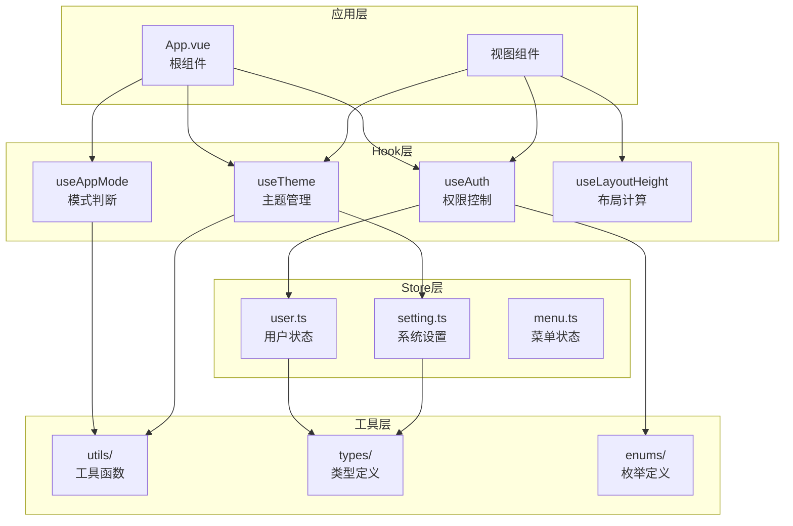

**架构图来源**
- [src/App.vue](file://src/App.vue#L7-L34)
- [src/hooks/core/useTheme.ts](file://src/hooks/core/useTheme.ts#L42-L123)
- [src/hooks/core/useAuth.ts](file://src/hooks/core/useAuth.ts#L43-L74)

### 分层设计理念

项目采用了清晰的分层架构，每一层都有明确的职责边界：

1. **表现层**: 视图组件负责UI渲染和用户交互
2. **逻辑层**: Hook函数封装业务逻辑和状态管理
3. **数据层**: Pinia Store管理应用状态
4. **工具层**: 提供通用工具函数和类型定义

## setup语法糖在根组件中的应用

### App.vue中的setup语法糖实现

在App.vue中，setup语法糖得到了完美体现，展示了现代Vue3开发的最佳实践。

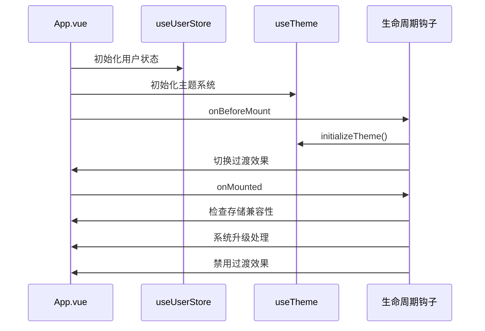

**序列图来源**
- [src/App.vue](file://src/App.vue#L24-L33)
- [src/hooks/core/useTheme.ts](file://src/hooks/core/useTheme.ts#L129-L174)

### 核心实现机制

1. **状态注入**: 通过`storeToRefs`将store状态转换为响应式引用
2. **国际化配置**: 动态导入Element Plus的多语言包
3. **生命周期管理**: 在合适的时机执行初始化和清理逻辑

**章节来源**
- [src/App.vue](file://src/App.vue#L1-L35)

## 响应式系统深度解析

### ref与reactive的巧妙运用

项目中对Vue3响应式系统的运用达到了精妙的境界，特别是在状态管理和主题切换场景中。

#### useUserStore中的响应式设计

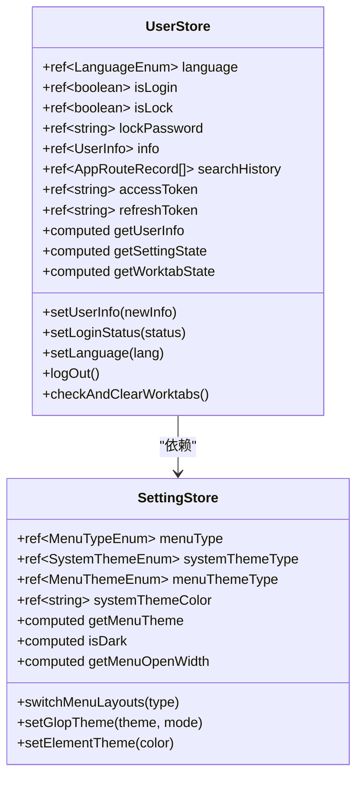

**类图来源**
- [src/store/modules/user.ts](file://src/store/modules/user.ts#L54-L136)
- [src/store/modules/setting.ts](file://src/store/modules/setting.ts#L51-L130)

### useTheme中的响应式机制

主题管理是项目中响应式系统应用的典型场景，展示了如何通过组合式API实现复杂的动态效果。

#### 主题切换的响应式流程

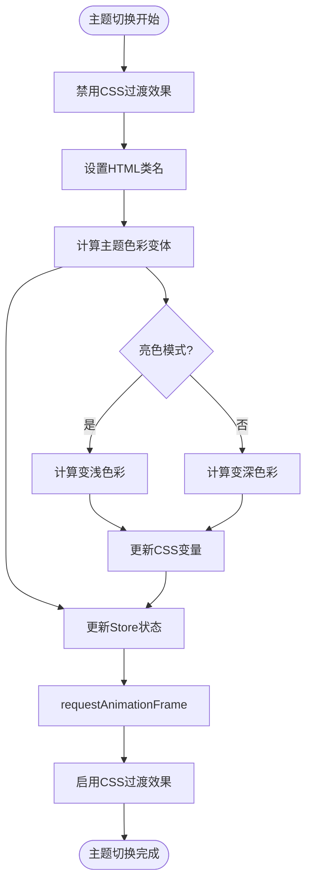

**流程图来源**
- [src/hooks/core/useTheme.ts](file://src/hooks/core/useTheme.ts#L61-L97)
- [src/utils/ui/colors.ts](file://src/utils/ui/colors.ts#L200-L232)

### 响应式系统的优化策略

1. **延迟计算**: 使用`computed`进行延迟计算，避免不必要的重复计算
2. **批量更新**: 通过`requestAnimationFrame`批量处理DOM更新
3. **条件渲染**: 基于响应式状态进行条件渲染优化

**章节来源**
- [src/hooks/core/useTheme.ts](file://src/hooks/core/useTheme.ts#L1-L175)
- [src/store/modules/user.ts](file://src/store/modules/user.ts#L1-L236)

## computed和watch的优化策略

### computed的高性能应用

项目中大量使用`computed`来实现高性能的派生状态计算。

#### useAuth中的computed优化

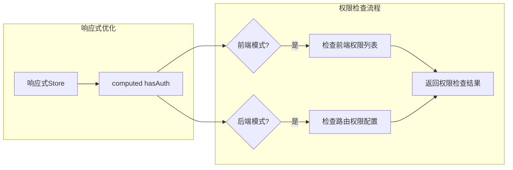

**流程图来源**
- [src/hooks/core/useAuth.ts](file://src/hooks/core/useAuth.ts#L57-L69)

### watch的智能监听策略

#### useTheme中的watch优化

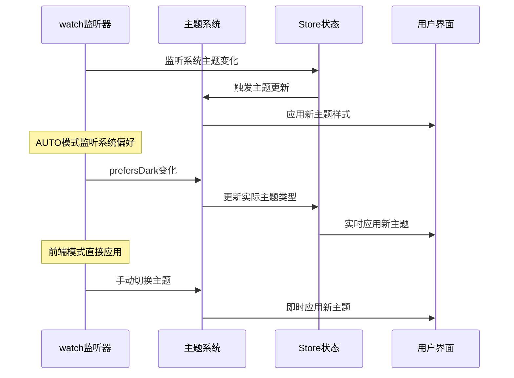

**序列图来源**
- [src/hooks/core/useTheme.ts](file://src/hooks/core/useTheme.ts#L161-L172)

### 性能优化技巧

1. **深度监听优化**: 使用`deep: true`时注意性能影响
2. **立即执行**: 合理使用`immediate: true`减少初始化开销
3. **清理机制**: 及时清理不需要的监听器避免内存泄漏

**章节来源**
- [src/hooks/core/useAuth.ts](file://src/hooks/core/useAuth.ts#L1-L75)
- [src/hooks/core/useTheme.ts](file://src/hooks/core/useTheme.ts#L161-L172)

## 组合式函数封装与API设计

### useAppMode的模式识别设计

useAppMode展示了如何通过组合式API实现灵活的模式识别和状态管理。

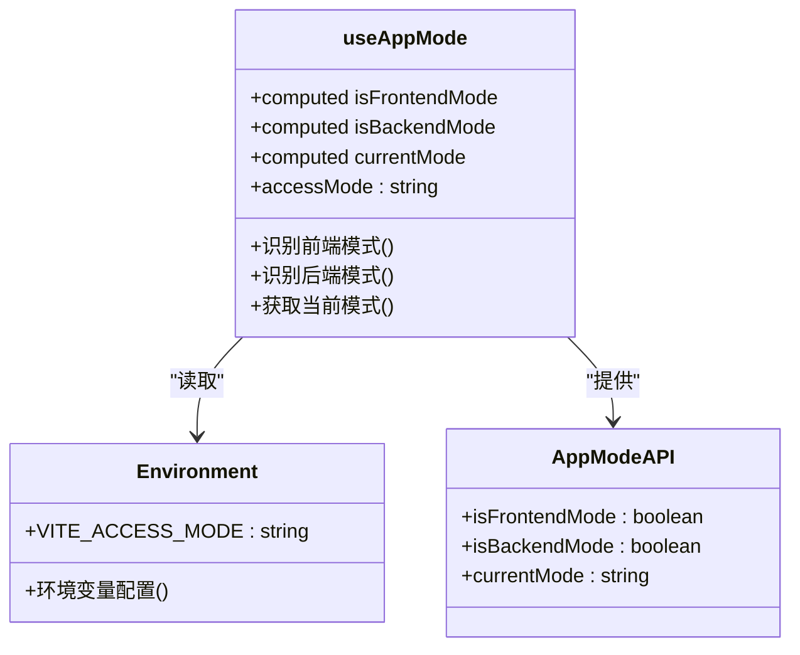

**类图来源**
- [src/hooks/core/useAppMode.ts](file://src/hooks/core/useAppMode.ts#L20-L45)

### useAuth的权限管理API

权限管理是企业级应用的核心需求，useAuth提供了简洁而强大的API接口。

#### 权限检查的双重模式支持

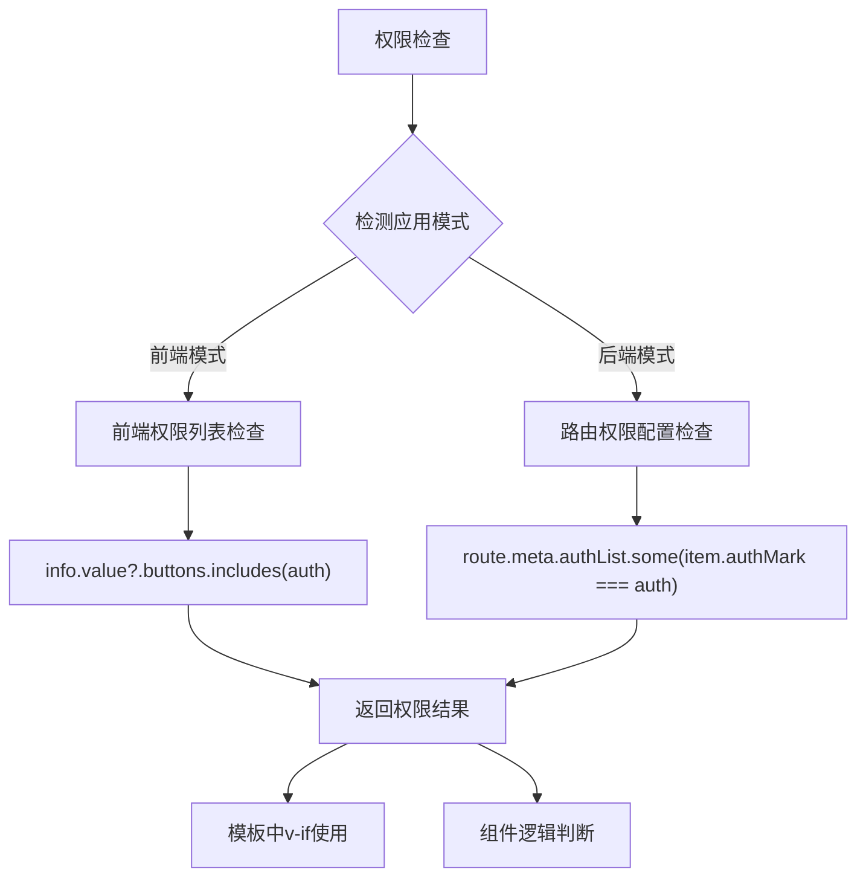

**流程图来源**
- [src/hooks/core/useAuth.ts](file://src/hooks/core/useAuth.ts#L57-L69)

### API设计的最佳实践

1. **单一职责**: 每个Hook专注于特定的功能领域
2. **响应式输出**: 返回响应式状态和方法
3. **类型安全**: 完整的TypeScript类型定义
4. **易于测试**: 清晰的输入输出接口

**章节来源**
- [src/hooks/core/useAppMode.ts](file://src/hooks/core/useAppMode.ts#L1-L46)
- [src/hooks/core/useAuth.ts](file://src/hooks/core/useAuth.ts#L1-L75)

## 生命周期管理与状态流转

### 完整的生命周期管理示例

项目展示了从组件初始化到状态管理的完整生命周期管理模式。

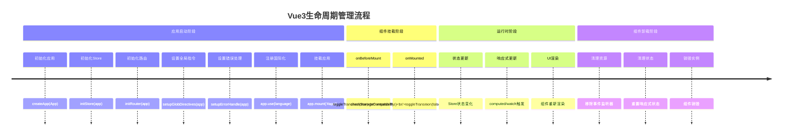

**时间线图来源**
- [src/main.ts](file://src/main.ts#L1-L25)
- [src/App.vue](file://src/App.vue#L24-L33)

### 状态流转的管理策略

#### 用户状态流转图

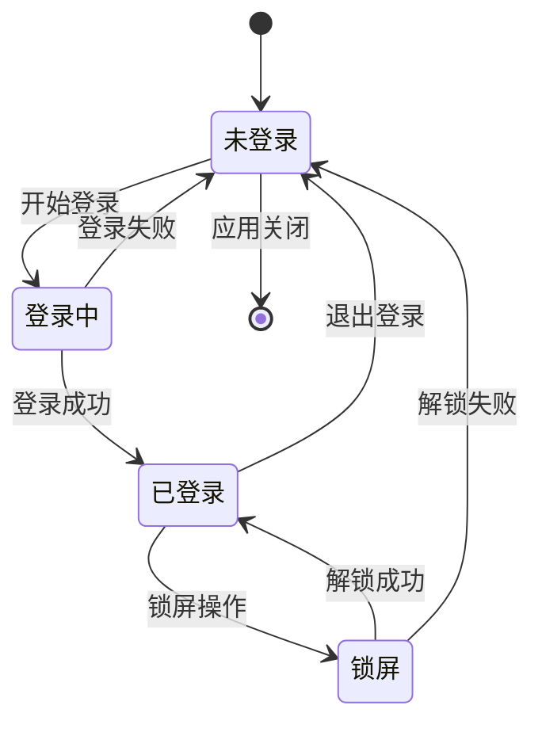

**状态图来源**
- [src/store/modules/user.ts](file://src/store/modules/user.ts#L139-L176)

### 生命周期钩子的最佳实践

1. **onBeforeMount**: 初始化静态资源和基础配置
2. **onMounted**: 执行DOM操作和异步初始化
3. **onBeforeUnmount**: 清理事件监听器和定时器
4. **onUnmounted**: 最终的资源清理

**章节来源**
- [src/App.vue](file://src/App.vue#L24-L33)
- [src/store/modules/user.ts](file://src/store/modules/user.ts#L139-L176)

## 关注点分离与模块化设计

### 水平分割 vs 垂直分割

项目采用了水平分割的设计策略，将功能按领域划分而不是简单的垂直层次。

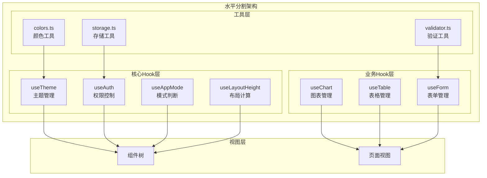

**架构图来源**
- [src/hooks/core/useTheme.ts](file://src/hooks/core/useTheme.ts#L42-L123)
- [src/hooks/core/useAuth.ts](file://src/hooks/core/useAuth.ts#L43-L74)

### 模块间的依赖关系

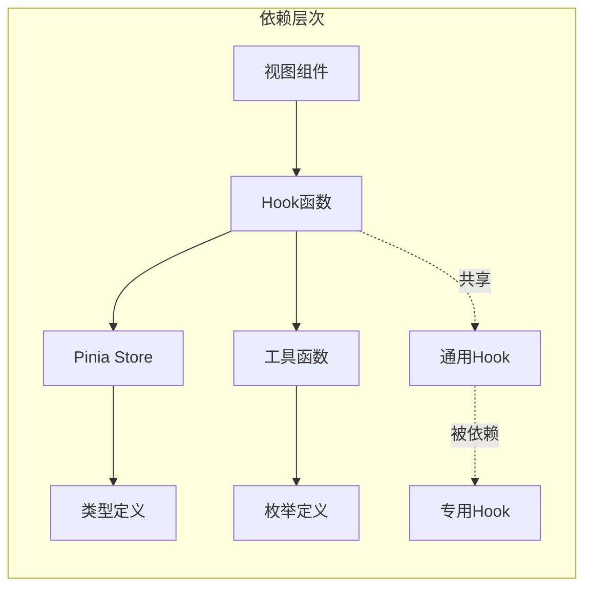

**依赖图来源**
- [src/types/store/index.ts](file://src/types/store/index.ts#L1-L158)
- [src/enums/appEnum.ts](file://src/enums/appEnum.ts#L1-L82)

### 关注点分离的优势

1. **高内聚低耦合**: 每个模块专注于特定功能
2. **易于测试**: 模块间依赖清晰，便于单元测试
3. **可扩展性**: 新功能可以独立开发而不影响现有代码
4. **可维护性**: 代码结构清晰，便于团队协作

**章节来源**
- [src/hooks/core/useTheme.ts](file://src/hooks/core/useTheme.ts#L1-L175)
- [src/hooks/core/useAuth.ts](file://src/hooks/core/useAuth.ts#L1-L75)

## 性能优化与最佳实践

### 响应式系统的性能优化

#### computed的懒执行优化

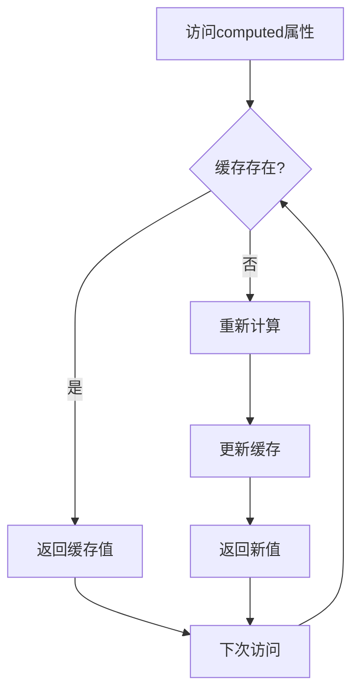

**流程图来源**
- [src/store/modules/setting.ts](file://src/store/modules/setting.ts#L121-L131)

### 内存管理优化

#### 监听器的智能清理

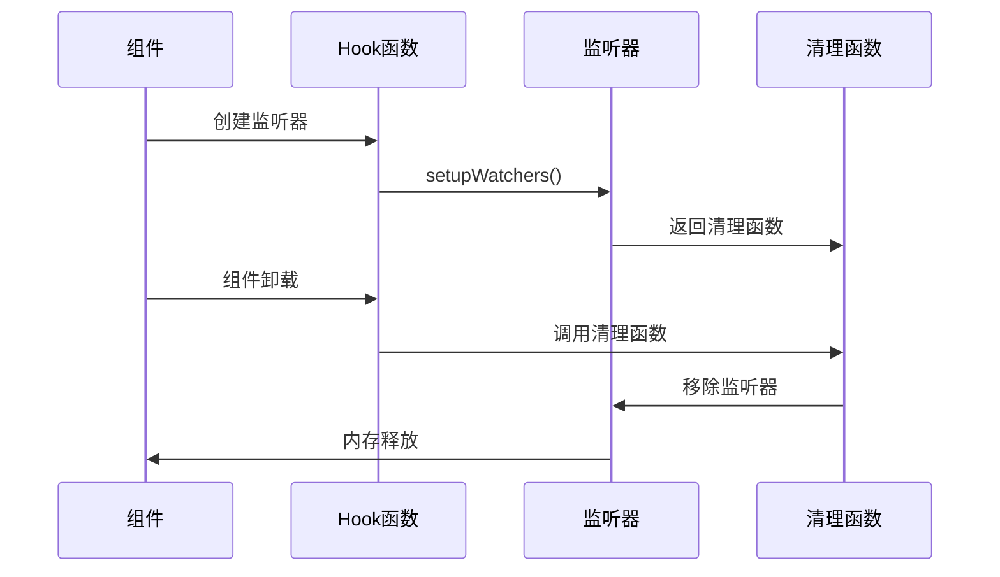

**序列图来源**
- [src/hooks/core/useChart.ts](file://src/hooks/core/useChart.ts#L690-L710)

### 开发体验优化

1. **TypeScript支持**: 完整的类型定义提升开发效率
2. **组合式API**: 更好的逻辑复用和代码组织
3. **Vue DevTools**: 增强的调试体验
4. **热重载**: 快速的开发迭代

**章节来源**
- [src/store/modules/setting.ts](file://src/store/modules/setting.ts#L121-L131)
- [src/hooks/core/useChart.ts](file://src/hooks/core/useChart.ts#L690-L710)

## 总结

Art Design Pro项目展现了Vue3组合式API在现代前端架构中的强大威力。通过精心设计的Hook系统，项目实现了：

### 核心优势

1. **高度模块化**: 每个功能都封装在独立的Hook中，便于复用和测试
2. **响应式优化**: 智能的computed和watch使用，确保性能最优
3. **类型安全**: 完整的TypeScript支持，减少运行时错误
4. **生命周期管理**: 清晰的组件生命周期和状态流转
5. **关注点分离**: 水平分割的架构设计，降低模块间耦合

### 技术亮点

- **useTheme**: 展示了主题切换的完整解决方案
- **useAuth**: 权限管理的双重模式支持
- **useAppMode**: 灵活的应用模式识别
- **响应式系统**: ref、reactive、computed、watch的综合运用

### 实践价值

该项目为Vue3应用开发提供了宝贵的参考经验，特别是在企业级应用的架构设计、性能优化和开发体验提升方面。通过学习和借鉴这些设计模式，开发者可以构建出更加健壮、可维护和高性能的现代Web应用。