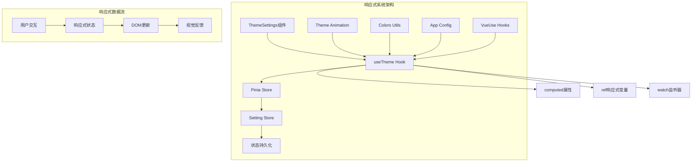
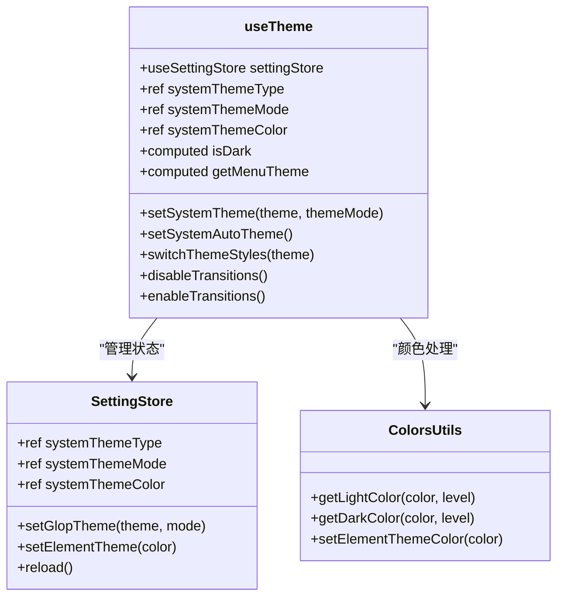
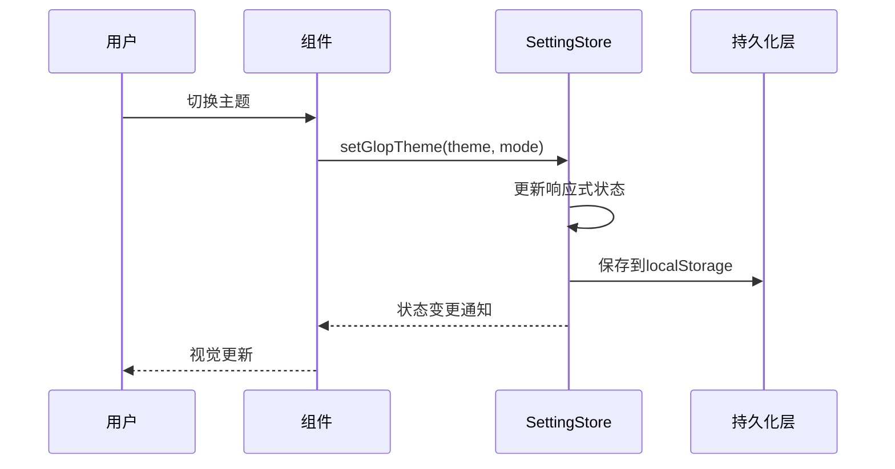
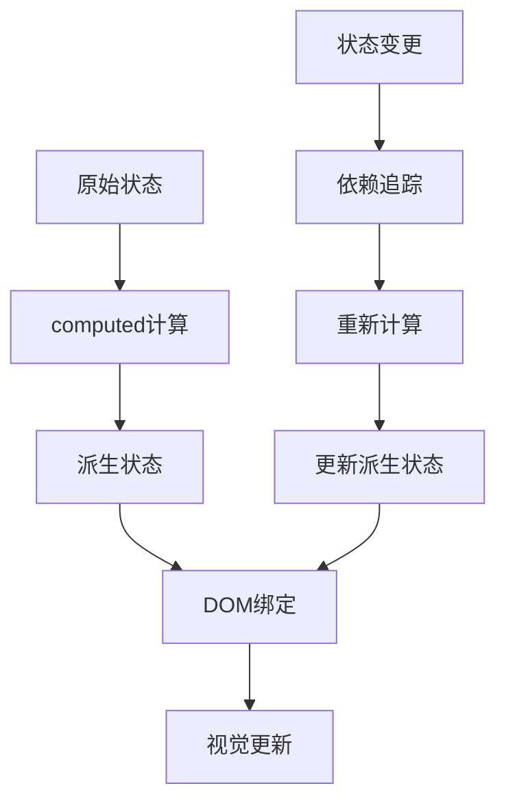
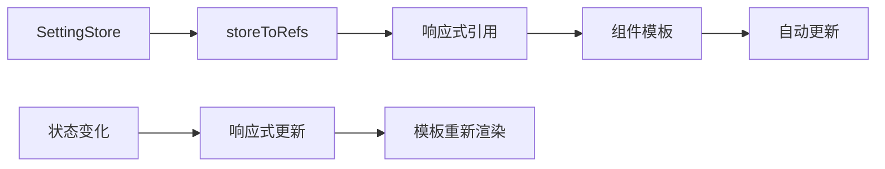
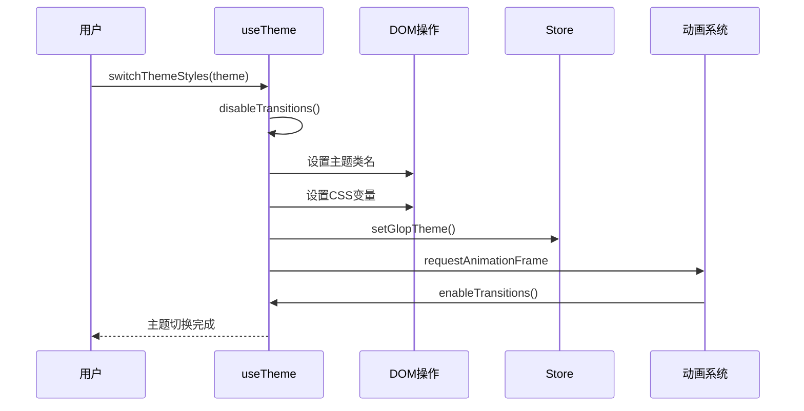
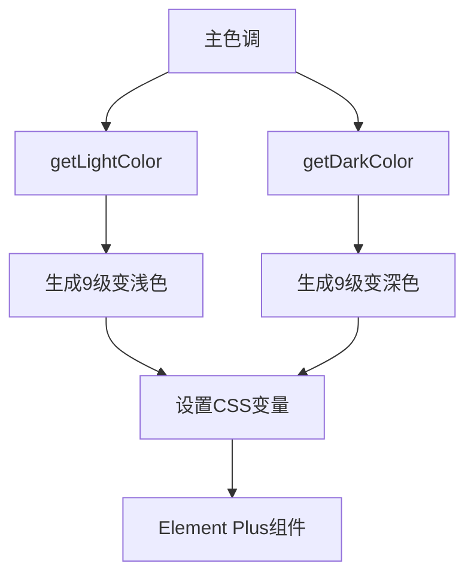
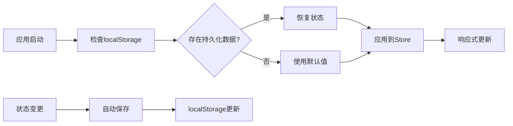
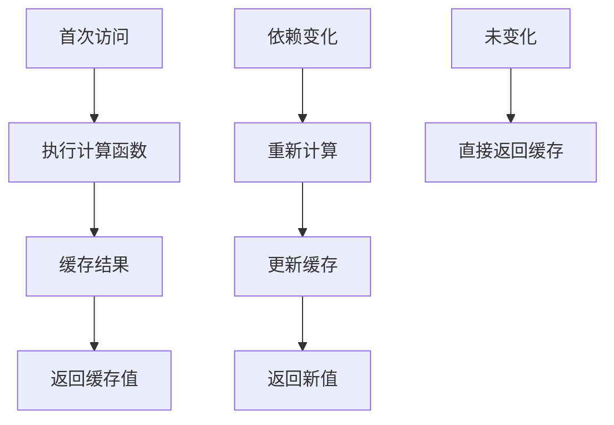
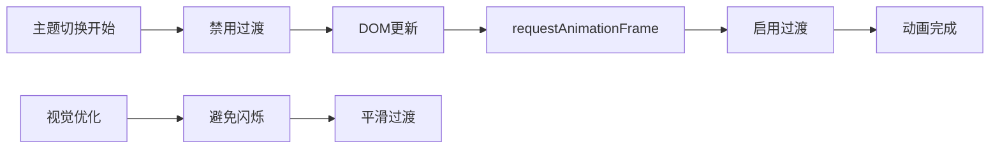

# 响应式系统

<cite>
**本文档引用的文件**
- [useTheme.ts](file://src/hooks/core/useTheme.ts)
- [setting.ts](file://src/store/modules/setting.ts)
- [colors.ts](file://src/utils/ui/colors.ts)
- [theme-change.scss](file://src/assets/styles/core/theme-change.scss)
- [useSettingsPanel.ts](file://src/components/core/layouts/art-settings-panel/composables/useSettingsPanel.ts)
- [ThemeSettings.vue](file://src/components/core/layouts/art-settings-panel/widget/ThemeSettings.vue)
- [animation.ts](file://src/utils/ui/animation.ts)
- [index.ts](file://src/store/index.ts)
- [appEnum.ts](file://src/enums/appEnum.ts)
- [index.ts](file://src/types/store/index.ts)
</cite>

## 目录
1. [简介](#简介)
2. [项目架构概览](#项目架构概览)
3. [核心组件分析](#核心组件分析)
4. [响应式数据流](#响应式数据流)
5. [主题切换机制](#主题切换机制)
6. [状态持久化](#状态持久化)
7. [性能优化策略](#性能优化策略)
8. [最佳实践](#最佳实践)
9. [故障排除指南](#故障排除指南)
10. [总结](#总结)

## 简介

Art Design Pro采用Vue3的响应式系统构建了一个完整的主题管理系统，通过useTheme hook和Pinia store实现了主题状态的响应式管理。该系统支持亮色、暗色和自动三种主题模式，具备流畅的主题切换动画和状态持久化功能。

核心特性包括：
- 基于Vue3 Composition API的响应式主题管理
- 通过computed和ref实现的状态响应式更新
- 主题切换时的过渡效果优化
- 状态持久化到localStorage
- 自动跟随系统主题偏好

## 项目架构概览

**图表来源**
- [useTheme.ts](file://src/hooks/core/useTheme.ts#L42-L123)
- [setting.ts](file://src/store/modules/setting.ts#L47-L442)

## 核心组件分析

### useTheme Hook - 主题管理核心

useTheme是主题系统的核心Hook，提供了完整的主题切换和管理功能。

**图表来源**
- [useTheme.ts](file://src/hooks/core/useTheme.ts#L42-L123)
- [setting.ts](file://src/store/modules/setting.ts#L47-L442)
- [colors.ts](file://src/utils/ui/colors.ts#L200-L273)

**章节来源**
- [useTheme.ts](file://src/hooks/core/useTheme.ts#L1-L175)
- [setting.ts](file://src/store/modules/setting.ts#L1-L451)

### Pinia Store - 状态管理

SettingStore使用Pinia实现状态管理，提供了主题相关的响应式状态。

**图表来源**
- [setting.ts](file://src/store/modules/setting.ts#L179-L187)
- [index.ts](file://src/store/index.ts#L35-L45)

**章节来源**
- [setting.ts](file://src/store/modules/setting.ts#L47-L442)
- [index.ts](file://src/store/index.ts#L1-L53)

## 响应式数据流

### computed属性的使用

系统大量使用computed属性来创建派生状态，确保数据的一致性和计算效率。

**图表来源**
- [setting.ts](file://src/store/modules/setting.ts#L124-L140)

### storeToRefs的应用

storeToRefs用于从store中提取响应式引用，确保组件能够响应状态变化。

**图表来源**
- [useSettingsPanel.ts](file://src/components/core/layouts/art-settings-panel/composables/useSettingsPanel.ts#L17-L18)

**章节来源**
- [useSettingsPanel.ts](file://src/components/core/layouts/art-settings-panel/composables/useSettingsPanel.ts#L1-L192)

## 主题切换机制

### 主题切换流程

主题切换过程涉及多个步骤，确保流畅的用户体验和状态一致性。

**图表来源**
- [useTheme.ts](file://src/hooks/core/useTheme.ts#L61-L97)

### 颜色适配算法

系统通过颜色工具函数实现主题色的明暗变体生成。

**图表来源**
- [colors.ts](file://src/utils/ui/colors.ts#L200-L273)

**章节来源**
- [useTheme.ts](file://src/hooks/core/useTheme.ts#L61-L97)
- [colors.ts](file://src/utils/ui/colors.ts#L200-L273)

## 状态持久化

### 持久化机制

系统使用pinia-plugin-persistedstate实现状态的自动持久化。

**图表来源**
- [index.ts](file://src/store/index.ts#L35-L45)

### 数据迁移策略

系统支持跨版本的数据迁移，确保升级时的兼容性。

**章节来源**
- [index.ts](file://src/store/index.ts#L1-L53)
- [setting.ts](file://src/store/modules/setting.ts#L444-L450)

## 性能优化策略

### computed缓存机制

系统充分利用Vue3的computed缓存机制，避免不必要的重复计算。

**图表来源**
- [setting.ts](file://src/store/modules/setting.ts#L124-L140)

### 动画优化

通过requestAnimationFrame和CSS过渡优化，确保主题切换的流畅性。

**图表来源**
- [useTheme.ts](file://src/hooks/core/useTheme.ts#L45-L59)
- [animation.ts](file://src/utils/ui/animation.ts#L40-L80)

**章节来源**
- [useTheme.ts](file://src/hooks/core/useTheme.ts#L45-L97)
- [animation.ts](file://src/utils/ui/animation.ts#L1-L80)

## 最佳实践

### 响应式状态管理原则

1. **单一数据源**：所有主题状态集中管理
2. **不可变更新**：通过setter方法修改状态
3. **计算属性优先**：使用computed处理派生状态
4. **及时清理**：正确处理副作用和监听器

### 性能优化建议

1. **合理使用computed**：避免在computed中进行复杂计算
2. **批量DOM操作**：使用requestAnimationFrame优化动画
3. **状态分割**：将不相关的状态分离到不同store
4. **懒加载**：按需加载主题资源

### 错误处理策略

1. **类型安全**：使用TypeScript确保类型正确
2. **边界检查**：验证颜色值和主题参数
3. **降级处理**：提供默认主题作为后备
4. **调试支持**：添加开发环境的调试信息

## 故障排除指南

### 常见问题及解决方案

| 问题类型 | 症状 | 解决方案 |
|---------|------|----------|
| 主题不生效 | 切换后界面无变化 | 检查CSS变量设置和类名应用 |
| 状态不持久化 | 刷新后主题重置 | 验证localStorage权限和序列化配置 |
| 动画卡顿 | 主题切换时出现闪烁 | 检查过渡效果禁用逻辑 |
| 性能问题 | 主题切换响应缓慢 | 优化计算属性和DOM操作 |

### 调试技巧

1. **开发者工具**：使用Vue DevTools监控状态变化
2. **控制台日志**：添加关键操作的日志输出
3. **断点调试**：在关键函数设置断点
4. **性能分析**：使用浏览器性能工具分析瓶颈

**章节来源**
- [useTheme.ts](file://src/hooks/core/useTheme.ts#L1-L175)
- [ThemeSettings.vue](file://src/components/core/layouts/art-settings-panel/widget/ThemeSettings.vue#L1-L29)

## 总结

Art Design Pro的响应式系统展现了Vue3在复杂状态管理场景下的强大能力。通过useTheme hook和Pinia store的完美结合，系统实现了：

- **响应式状态管理**：基于ref和computed的高效状态更新
- **流畅的用户体验**：通过动画优化和过渡控制避免界面闪烁
- **状态持久化**：自动保存用户偏好设置
- **可维护性**：清晰的架构分层和模块化设计

该系统不仅满足了当前的功能需求，还为未来的扩展提供了良好的基础。通过合理的性能优化和错误处理，确保了系统的稳定性和用户体验。