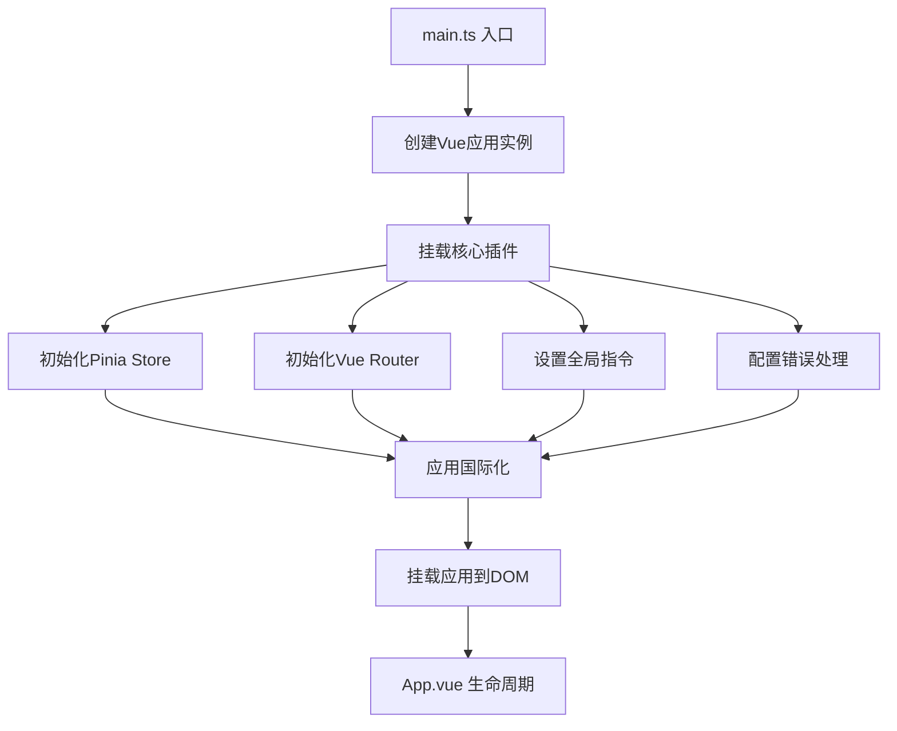
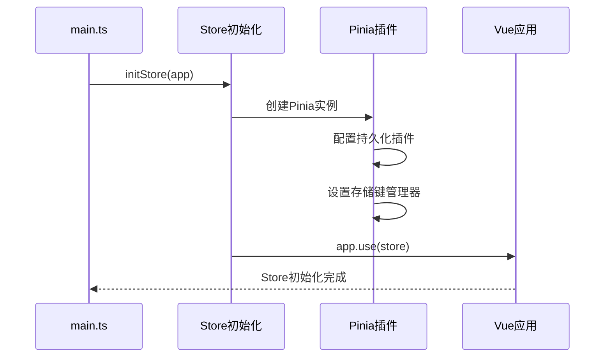
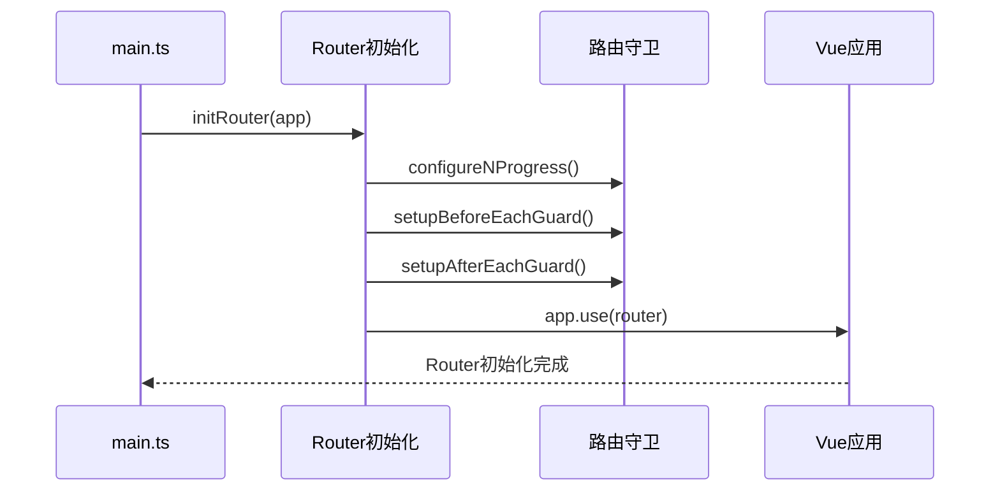
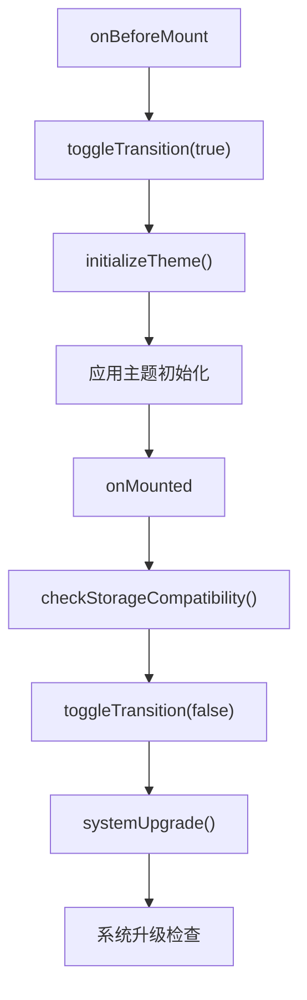
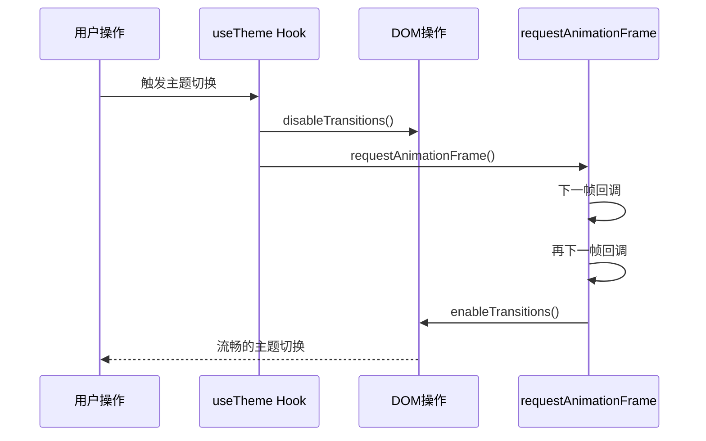
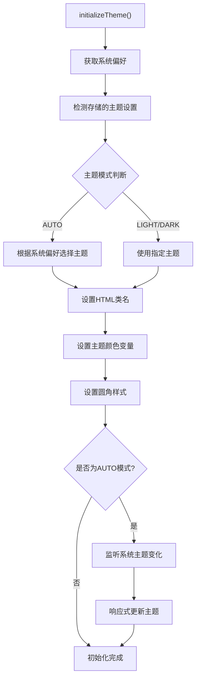
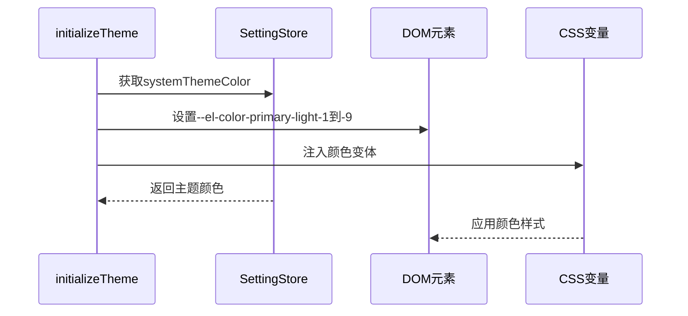

# 生命周期管理

<cite>
**本文档中引用的文件**
- [src/main.ts](file://src/main.ts)
- [src/App.vue](file://src/App.vue)
- [src/hooks/core/useTheme.ts](file://src/hooks/core/useTheme.ts)
- [src/store/modules/setting.ts](file://src/store/modules/setting.ts)
- [src/utils/ui/animation.ts](file://src/utils/ui/animation.ts)
- [src/router/index.ts](file://src/router/index.ts)
- [src/store/index.ts](file://src/store/index.ts)
</cite>

## 目录
1. [概述](#概述)
2. [应用初始化架构](#应用初始化架构)
3. [核心插件挂载策略](#核心插件挂载策略)
4. [App.vue生命周期管理](#appvue生命周期管理)
5. [主题切换动画机制](#主题切换动画机制)
6. [应用启动主题初始化流程](#应用启动主题初始化流程)
7. [生命周期最佳实践](#生命周期最佳实践)
8. [总结](#总结)

## 概述

Art Design Pro采用Vue3组合式API构建，通过精心设计的生命周期管理策略确保应用的稳定性和用户体验。本文档详细阐述了应用初始化、主题管理、动画过渡等关键生命周期阶段的实现机制。

## 应用初始化架构

### 整体初始化流程

**图表来源**
- [src/main.ts](file://src/main.ts#L1-L25)

### 初始化阶段详解

应用初始化遵循严格的顺序原则，确保每个阶段的依赖关系得到正确处理：

1. **应用实例创建**：使用`createApp(App)`创建Vue应用实例
2. **插件挂载**：按依赖顺序依次挂载核心插件
3. **应用挂载**：最后调用`app.mount('#app')`将应用挂载到DOM

**章节来源**
- [src/main.ts](file://src/main.ts#L18-L25)

## 核心插件挂载策略

### Pinia Store初始化

**图表来源**
- [src/store/index.ts](file://src/store/index.ts#L50-L52)

### Vue Router初始化

**图表来源**
- [src/router/index.ts](file://src/router/index.ts#L15-L19)

### 插件挂载顺序的重要性

正确的插件挂载顺序确保：
- **Store可用性**：在其他插件中可以访问状态管理
- **路由依赖**：路由守卫可以访问Store中的用户状态
- **国际化支持**：语言包可以在应用启动时正确加载

**章节来源**
- [src/main.ts](file://src/main.ts#L18-L24)

## App.vue生命周期管理

### 生命周期钩子使用策略

**图表来源**
- [src/App.vue](file://src/App.vue#L24-L33)

### onBeforeMount阶段

在`onBeforeMount`钩子中执行以下关键操作：

1. **过渡效果禁用**：调用`toggleTransition(true)`临时禁用CSS过渡效果
2. **主题初始化**：执行`initializeTheme()`进行应用启动时的主题设置

### onMounted阶段

在`onMounted`钩子中执行以下操作：

1. **存储兼容性检查**：验证浏览器存储功能的兼容性
2. **过渡效果恢复**：调用`toggleTransition(false)`恢复CSS过渡效果
3. **系统升级检查**：执行`systemUpgrade()`进行系统升级相关检查

**章节来源**
- [src/App.vue](file://src/App.vue#L24-L33)

## 主题切换动画机制

### requestAnimationFrame优化策略

**图表来源**
- [src/hooks/core/useTheme.ts](file://src/hooks/core/useTheme.ts#L92-L97)

### 过渡效果管理机制

主题切换过程中使用双重`requestAnimationFrame`策略：

1. **第一层禁用**：立即禁用CSS过渡效果
2. **延迟恢复**：在下一帧完全渲染后再恢复过渡效果

这种策略确保：
- **视觉一致性**：避免主题切换过程中的闪烁现象
- **性能优化**：利用浏览器的渲染周期优化动画性能
- **用户体验**：提供流畅的主题切换体验

**章节来源**
- [src/hooks/core/useTheme.ts](file://src/hooks/core/useTheme.ts#L45-L97)

## 应用启动主题初始化流程

### initializeTheme函数执行流程

**图表来源**
- [src/hooks/core/useTheme.ts](file://src/hooks/core/useTheme.ts#L129-L174)

### 主题初始化的关键步骤

1. **系统偏好检测**：使用`usePreferredDark()`检测用户的系统主题偏好
2. **存储读取**：从Store中读取用户保存的主题设置
3. **条件判断**：根据AUTO模式决定使用系统偏好还是用户设置
4. **DOM更新**：设置HTML元素的class属性和CSS变量
5. **响应式监听**：在AUTO模式下监听系统主题变化

### 颜色变量注入机制

**图表来源**
- [src/hooks/core/useTheme.ts](file://src/hooks/core/useTheme.ts#L82-L87)

**章节来源**
- [src/hooks/core/useTheme.ts](file://src/hooks/core/useTheme.ts#L129-L174)

## 生命周期最佳实践

### 开发者指导原则

#### 1. 初始化阶段最佳实践

- **顺序优先**：严格按照依赖关系顺序初始化插件
- **错误处理**：在初始化过程中添加适当的错误处理逻辑
- **性能考虑**：避免在初始化阶段执行耗时操作

#### 2. 生命周期钩子使用指南

- **onBeforeMount**：用于应用启动前的准备工作
- **onMounted**：用于DOM操作和第三方库初始化
- **避免副作用**：在生命周期钩子中避免产生不必要的副作用

#### 3. 主题管理最佳实践

- **过渡优化**：使用`requestAnimationFrame`确保动画流畅性
- **响应式设计**：支持系统主题偏好变化
- **状态持久化**：确保用户主题设置能够正确保存和恢复

### 常见问题与解决方案

#### 问题1：主题切换闪烁

**解决方案**：使用双重`requestAnimationFrame`策略禁用和恢复过渡效果

#### 问题2：初始化顺序错误

**解决方案**：严格遵循插件初始化的依赖顺序

#### 问题3：内存泄漏

**解决方案**：在组件销毁时正确清理事件监听器和定时器

**章节来源**
- [src/hooks/core/useTheme.ts](file://src/hooks/core/useTheme.ts#L45-L97)
- [src/App.vue](file://src/App.vue#L24-L33)

## 总结

Art Design Pro的Vue3生命周期管理策略体现了现代前端开发的最佳实践：

1. **结构化初始化**：通过明确的初始化流程确保应用稳定性
2. **性能优化**：使用`requestAnimationFrame`等技术优化动画性能
3. **用户体验**：通过过渡效果管理和主题切换优化提升用户体验
4. **可维护性**：清晰的代码结构和注释便于后续维护

这套生命周期管理策略不仅保证了应用的正常运行，更为开发者提供了良好的开发体验和扩展基础。通过深入理解这些机制，开发者可以更好地构建高质量的Vue3应用程序。