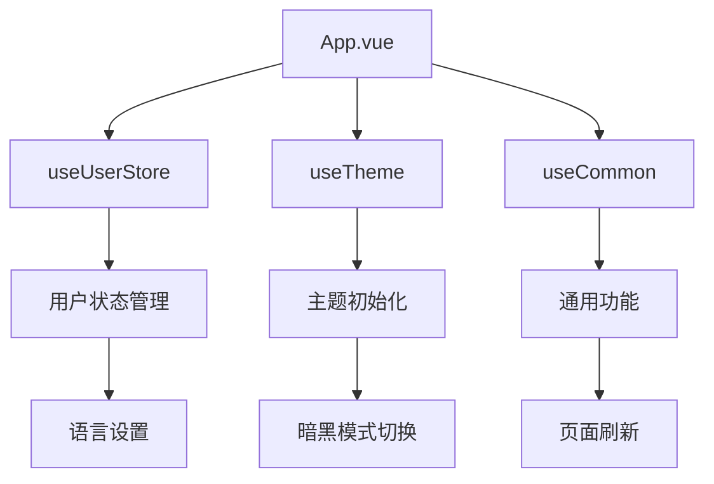
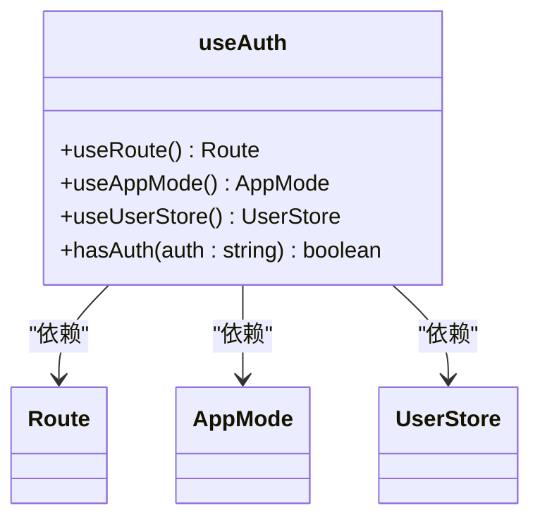
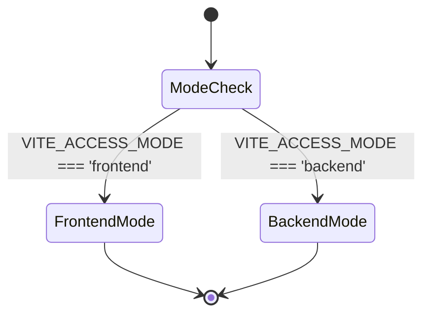
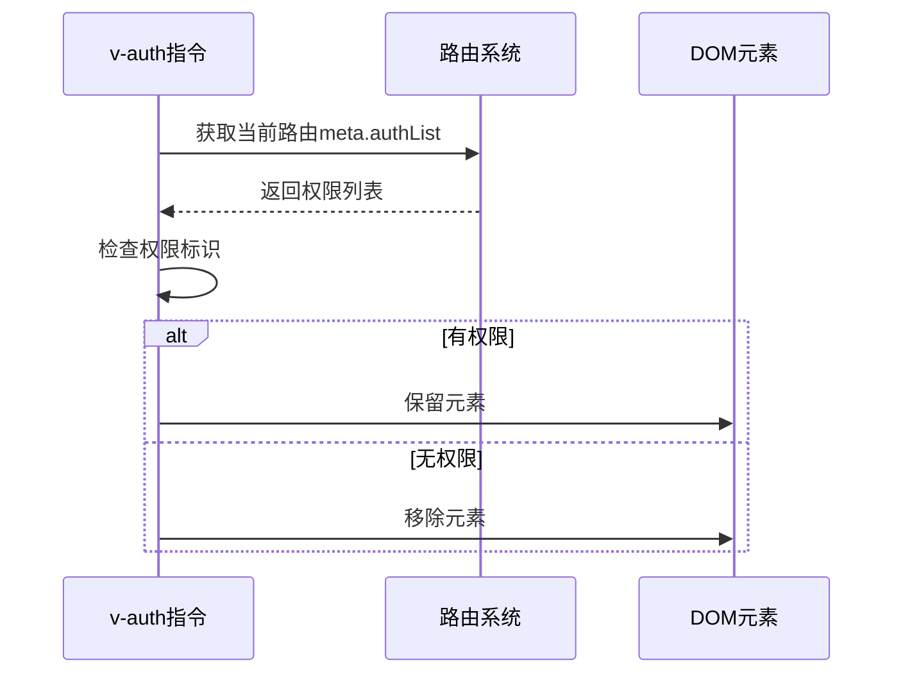
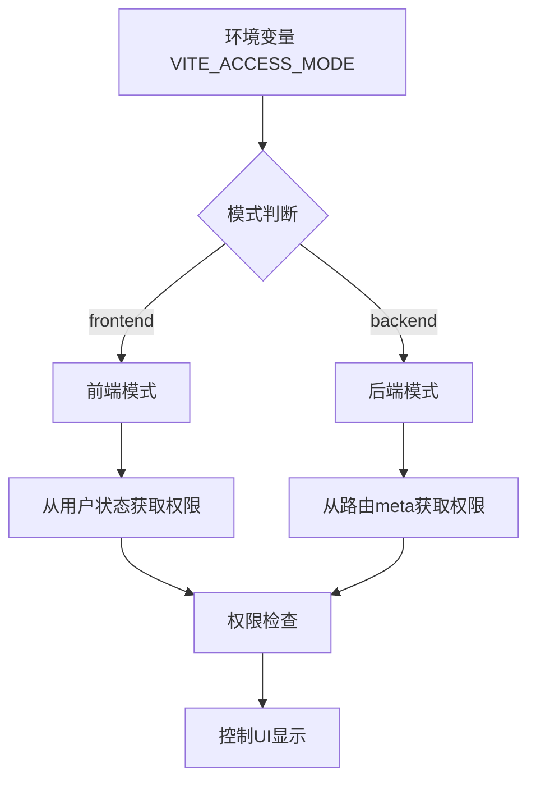
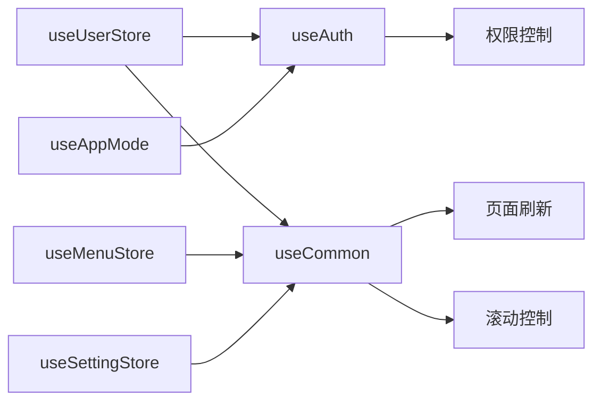
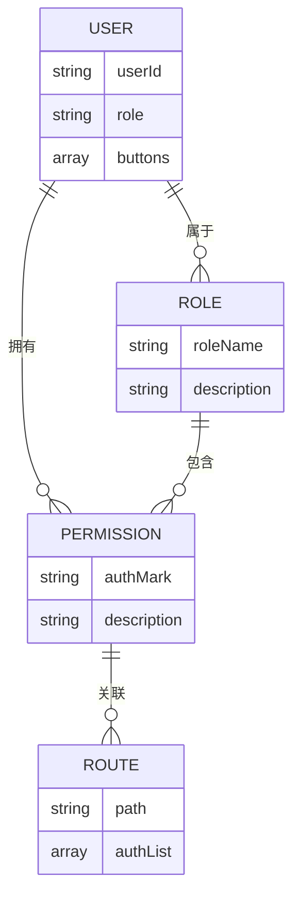

# 组合式API实践

<cite>
**本文档引用文件**  
- [App.vue](file://src/App.vue)
- [useAuth.ts](file://src/hooks/core/useAuth.ts)
- [useAppMode.ts](file://src/hooks/core/useAppMode.ts)
- [user.ts](file://src/store/modules/user.ts)
- [main.ts](file://src/main.ts)
- [useCommon.ts](file://src/hooks/core/useCommon.ts)
- [auth.ts](file://src/directives/core/auth.ts)
- [button-auth/index.vue](file://src/views/examples/permission/button-auth/index.vue)
</cite>

## 目录
1. [项目结构](#项目结构)
2. [根组件中的组合式API应用](#根组件中的组合式api应用)
3. [核心Hook分析](#核心hook分析)
4. [权限控制实现](#权限控制实现)
5. [应用模式判断](#应用模式判断)
6. [组合式函数的依赖关系与数据流](#组合式函数的依赖关系与数据流)
7. [实际使用示例](#实际使用示例)
8. [最佳实践建议](#最佳实践建议)

## 项目结构

Art Design Pro项目采用标准的Vue3组合式API架构，主要目录结构包括：
- `src/api`：API接口定义
- `src/assets`：静态资源文件
- `src/components`：可复用组件
- `src/config`：项目配置
- `src/directives`：自定义指令
- `src/enums`：枚举类型
- `src/hooks`：组合式函数（核心关注点）
- `src/locales`：国际化配置
- `src/mock`：模拟数据
- `src/plugins`：插件配置
- `src/router`：路由配置
- `src/store`：状态管理（Pinia）
- `src/types`：类型定义
- `src/utils`：工具函数
- `src/views`：页面视图

**Diagram sources**
- [App.vue](file://src/App.vue)

## 根组件中的组合式API应用

在根组件`App.vue`中，通过`<script setup>`语法糖实现了组合式API的典型应用。该组件主要负责全局配置的初始化和注入，包括状态管理、国际化配置、主题初始化等关键功能。

`App.vue`通过`useUserStore`引入用户状态管理，并利用`storeToRefs`将响应式状态解构，实现了用户语言设置的动态绑定。同时，组件在生命周期钩子中调用多个组合式函数，如`initializeTheme`进行主题初始化，`checkStorageCompatibility`检查存储兼容性等。

国际化配置通过Element Plus的`ElConfigProvider`组件实现，根据用户语言偏好动态加载相应的语言包（中文或英文），确保了多语言支持的无缝切换。

**Diagram sources**
- [App.vue](file://src/App.vue#L7-L34)
- [main.ts](file://src/main.ts#L1-L25)

**Section sources**
- [App.vue](file://src/App.vue#L1-L35)
- [main.ts](file://src/main.ts#L1-L25)

## 核心Hook分析

### useAuth权限控制Hook

`useAuth`是权限验证管理的核心Hook，提供统一的权限验证功能，支持前端和后端两种权限模式。该Hook通过`useRoute`获取当前路由信息，结合`useAppMode`判断当前应用模式，实现了灵活的权限检查机制。

在前端模式下，权限检查基于用户信息中的`buttons`字段（如`['add', 'edit', 'delete']`）；在后端模式下，则基于当前路由`meta`配置中的`authList`（如`[{ authMark: 'add' }]`）。这种双模式支持使得系统既能适应小型项目的快速开发需求，也能满足企业级应用的复杂权限管理体系。

**Diagram sources**
- [useAuth.ts](file://src/hooks/core/useAuth.ts#L33-L74)

### useAppMode应用模式判断Hook

`useAppMode`提供应用访问模式的判断和管理功能，根据环境变量`VITE_ACCESS_MODE`自动识别当前运行模式。该Hook定义了三个关键的响应式状态：`isFrontendMode`、`isBackendMode`和`currentMode`，为其他组件和Hook提供了模式判断的基础。

前端模式适用于权限由前端路由配置控制的场景，适合小型项目或演示环境；后端模式则适用于权限由后端接口返回的菜单数据控制的场景，更适合企业级应用的安全需求。

**Diagram sources**
- [useAppMode.ts](file://src/hooks/core/useAppMode.ts#L18-L45)

## 权限控制实现

权限控制在Art Design Pro中通过组合式函数和自定义指令两种方式实现。`useAuth`组合式函数提供编程式的权限检查能力，而`v-auth`自定义指令则提供声明式的权限控制。

`v-auth`指令适用于后端权限控制模式，基于权限标识控制DOM元素的显示和隐藏。当用户没有对应权限时，元素将从DOM中直接移除，而非简单隐藏，这提高了安全性。该指令在`setupAuthDirective`中注册，通过`mounted`和`updated`钩子实现权限检查。

**Diagram sources**
- [auth.ts](file://src/directives/core/auth.ts#L35-L68)
- [useAuth.ts](file://src/hooks/core/useAuth.ts#L33-L74)

**Section sources**
- [auth.ts](file://src/directives/core/auth.ts#L1-L69)
- [useAuth.ts](file://src/hooks/core/useAuth.ts#L1-L75)

## 应用模式判断

应用模式判断是系统权限体系的基础，`useAppMode`Hook通过读取环境变量`VITE_ACCESS_MODE`来确定当前运行模式。这种设计使得开发者可以通过简单的环境配置切换前后端权限控制模式，极大地提高了系统的灵活性和可维护性。

模式判断的结果被`useAuth`等其他Hook所依赖，形成了清晰的依赖链。前端模式下，权限数据来源于用户状态；后端模式下，权限数据来源于路由配置。这种分离关注点的设计使得权限逻辑更加清晰，便于维护和扩展。

**Diagram sources**
- [useAppMode.ts](file://src/hooks/core/useAppMode.ts#L22-L38)
- [useAuth.ts](file://src/hooks/core/useAuth.ts#L45-L69)

## 组合式函数的依赖关系与数据流

组合式函数之间形成了清晰的依赖关系网络。`useAuth`依赖于`useAppMode`和`useUserStore`，`useCommon`依赖于`useMenuStore`和`useSettingStore`，这种分层依赖结构实现了关注点的分离。

数据流主要通过Pinia状态管理进行传递，`useUserStore`作为核心状态源，为多个Hook提供用户相关信息。当用户登录状态变化时，相关Hook能自动响应并更新UI，实现了响应式的数据流管理。

**Diagram sources**
- [useAuth.ts](file://src/hooks/core/useAuth.ts#L33-L74)
- [useCommon.ts](file://src/hooks/core/useCommon.ts#L18-L87)
- [user.ts](file://src/store/modules/user.ts#L34-L236)

## 实际使用示例

在`button-auth/index.vue`示例页面中，展示了`useAuth`和`useAppMode`的实际应用。页面通过`isFrontendMode`状态判断当前模式，并相应地展示不同的权限控制方式。

在前端模式下，使用`hasAuth`方法检查用户`buttons`字段中的权限标识；在后端模式下，使用`v-auth`指令或`hasAuth`方法检查路由`meta.authList`中的权限配置。这种双重验证机制确保了权限控制的灵活性和可靠性。

示例页面还展示了角色基础的权限控制（`v-roles`指令）和动态功能切换，通过`hasAuth`方法控制功能开关的启用状态，体现了组合式函数在实际业务场景中的强大能力。

**Diagram sources**
- [button-auth/index.vue](file://src/views/examples/permission/button-auth/index.vue#L1-L530)
- [useAuth.ts](file://src/hooks/core/useAuth.ts#L33-L74)

**Section sources**
- [button-auth/index.vue](file://src/views/examples/permission/button-auth/index.vue#L1-L530)

## 最佳实践建议

1. **关注点分离**：将不同功能的逻辑封装到独立的组合式函数中，如`useAuth`负责权限、`useTheme`负责主题、`useCommon`负责通用功能。

2. **依赖注入**：通过`useXXX`模式引入所需功能，避免直接操作全局状态，提高代码的可测试性和可维护性。

3. **响应式设计**：充分利用Vue3的响应式系统，使用`computed`和`ref`创建响应式状态，确保UI能自动更新。

4. **环境配置**：通过环境变量控制应用模式，便于在不同环境（开发、测试、生产）间切换配置。

5. **类型安全**：使用TypeScript定义清晰的接口和类型，提高代码的可读性和健壮性。

6. **文档注释**：为每个组合式函数添加详细的JSDoc注释，说明功能、参数和返回值，便于团队协作。

7. **错误处理**：在关键操作中添加适当的错误处理机制，确保系统的稳定性和用户体验。

**Section sources**
- [useAuth.ts](file://src/hooks/core/useAuth.ts#L1-L75)
- [useAppMode.ts](file://src/hooks/core/useAppMode.ts#L1-L46)
- [useCommon.ts](file://src/hooks/core/useCommon.ts#L1-L88)