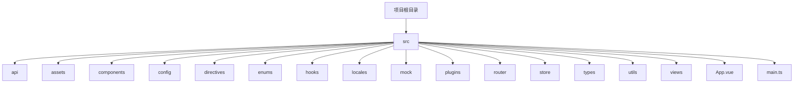
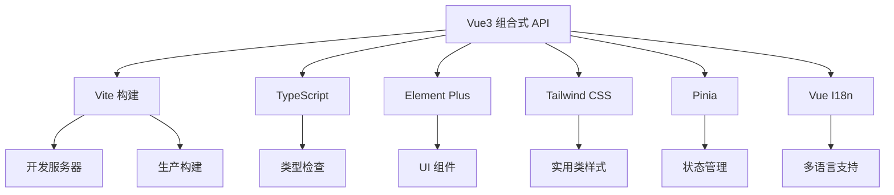
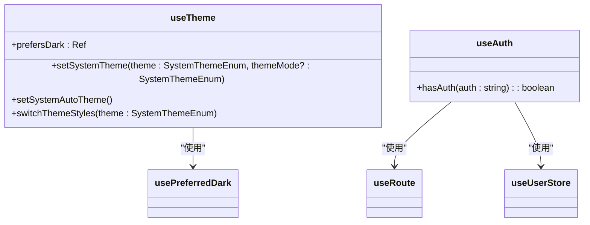
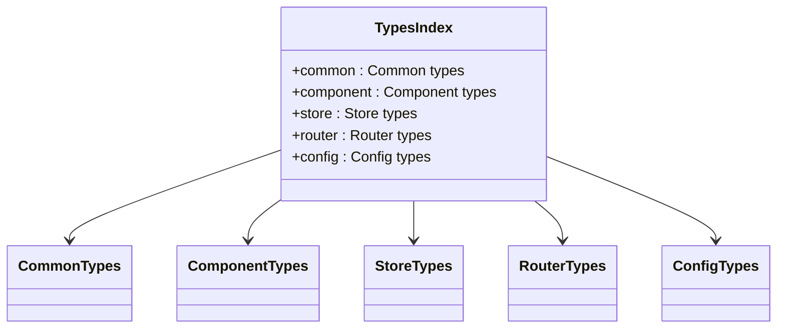
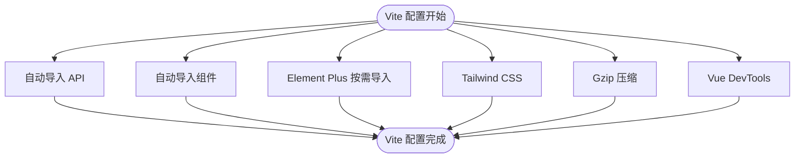
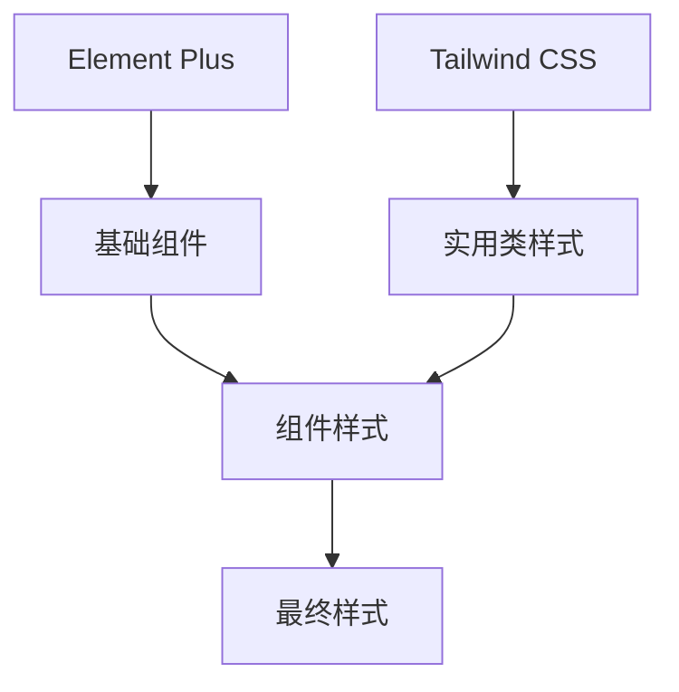
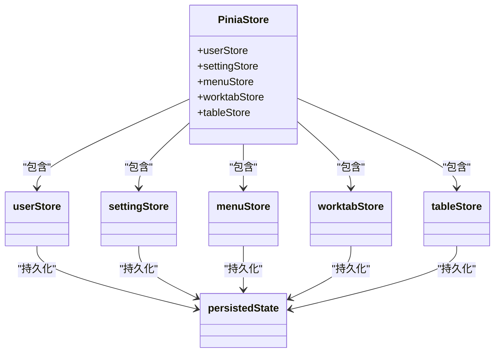
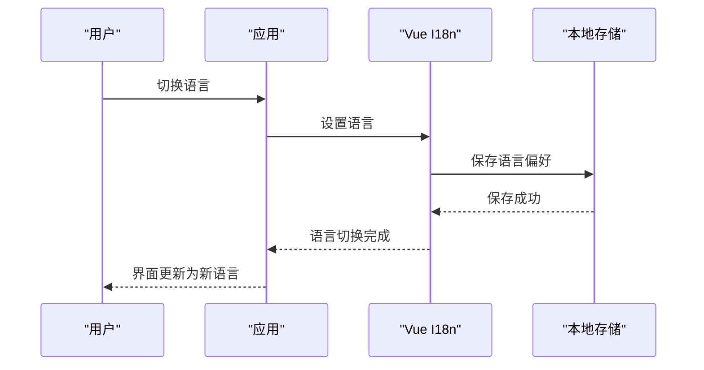
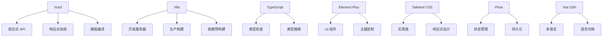

# 核心技术

<cite>
**本文档中引用的文件**  
- [package.json](file://package.json)
- [vite.config.ts](file://vite.config.ts)
- [tsconfig.json](file://tsconfig.json)
- [main.ts](file://src/main.ts)
- [App.vue](file://src/App.vue)
- [store/index.ts](file://src/store/index.ts)
- [router/index.ts](file://src/router/index.ts)
- [locales/index.ts](file://src/locales/index.ts)
- [hooks/core/useTheme.ts](file://src/hooks/core/useTheme.ts)
- [store/modules/user.ts](file://src/store/modules/user.ts)
- [hooks/core/useAuth.ts](file://src/hooks/core/useAuth.ts)
- [components/core/base/art-logo/index.vue](file://src/components/core/base/art-logo/index.vue)
- [config/setting.ts](file://src/config/setting.ts)
- [utils/ui/iconify-loader.ts](file://src/utils/ui/iconify-loader.ts)
- [types/index.ts](file://src/types/index.ts)
</cite>

## 目录
1. [引言](#引言)
2. [项目结构](#项目结构)
3. [核心组件](#核心组件)
4. [架构概述](#架构概述)
5. [详细组件分析](#详细组件分析)
6. [依赖分析](#依赖分析)
7. [性能考虑](#性能考虑)
8. [故障排除指南](#故障排除指南)
9. [结论](#结论)

## 引言
Art Design Pro 是一个现代化的前端解决方案，采用 Vue3 组合式 API、TypeScript、Vite 构建工具、Element Plus UI 组件库、Tailwind CSS 实用类框架、Pinia 状态管理以及 Vue I18n 国际化方案。本项目通过先进的技术栈集成，实现了高性能、可维护性强、用户体验优秀的现代化 Web 应用开发框架。

## 项目结构
Art Design Pro 项目采用模块化、分层化的目录结构设计，确保代码组织清晰、职责分明。项目主要分为以下几个核心模块：

- `src/api`：API 接口定义
- `src/assets`：静态资源文件
- `src/components`：可复用组件库
- `src/config`：系统配置
- `src/directives`：自定义指令
- `src/enums`：枚举类型定义
- `src/hooks`：组合式函数（Composition API）
- `src/locales`：国际化语言包
- `src/mock`：模拟数据
- `src/plugins`：插件集成
- `src/router`：路由配置
- `src/store`：状态管理
- `src/types`：类型定义
- `src/utils`：工具函数
- `src/views`：页面视图组件

**Diagram sources**
- [src/api](file://src/api)
- [src/assets](file://src/assets)
- [src/components](file://src/components)
- [src/config](file://src/config)
- [src/directives](file://src/directives)
- [src/enums](file://src/enums)
- [src/hooks](file://src/hooks)
- [src/locales](file://src/locales)
- [src/mock](file://src/mock)
- [src/plugins](file://src/plugins)
- [src/router](file://src/router)
- [src/store](file://src/store)
- [src/types](file://src/types)
- [src/utils](file://src/utils)
- [src/views](file://src/views)
- [src/App.vue](file://src/App.vue)
- [src/main.ts](file://src/main.ts)

**Section sources**
- [package.json](file://package.json)
- [vite.config.ts](file://vite.config.ts)

## 核心组件
Art Design Pro 的核心组件包括 Vue3 组合式 API 的实际应用、TypeScript 类型安全实践、Vite 构建配置、Element Plus 与 Tailwind CSS 的协同工作、Pinia 状态管理模块化设计以及 Vue I18n 国际化集成。这些组件共同构成了项目的技术基础，确保了代码的可维护性、性能和用户体验。

**Section sources**
- [main.ts](file://src/main.ts)
- [App.vue](file://src/App.vue)
- [store/index.ts](file://src/store/index.ts)
- [router/index.ts](file://src/router/index.ts)
- [locales/index.ts](file://src/locales/index.ts)

## 架构概述
Art Design Pro 采用现代化的前端架构设计，以 Vue3 的组合式 API 为核心，通过 Vite 实现快速开发构建，使用 TypeScript 提供类型安全保障，集成 Element Plus 作为基础 UI 组件库，结合 Tailwind CSS 实现精细化样式控制，通过 Pinia 进行模块化的状态管理，并使用 Vue I18n 实现多语言支持。

**Diagram sources**
- [main.ts](file://src/main.ts)
- [vite.config.ts](file://vite.config.ts)
- [tsconfig.json](file://tsconfig.json)
- [App.vue](file://src/App.vue)
- [store/index.ts](file://src/store/index.ts)
- [router/index.ts](file://src/router/index.ts)
- [locales/index.ts](file://src/locales/index.ts)

## 详细组件分析

### Vue3 组合式 API 应用模式
Art Design Pro 充分利用 Vue3 的组合式 API 特性，通过 `setup` 语法糖、`ref`/`reactive` 响应式系统、`computed`/`watch` 状态监听等机制，实现了代码的高内聚、低耦合。

#### 组合式函数示例

**Diagram sources**
- [hooks/core/useTheme.ts](file://src/hooks/core/useTheme.ts)
- [hooks/core/useAuth.ts](file://src/hooks/core/useAuth.ts)

**Section sources**
- [hooks/core/useTheme.ts](file://src/hooks/core/useTheme.ts)
- [hooks/core/useAuth.ts](file://src/hooks/core/useAuth.ts)

### TypeScript 类型安全实践
项目通过 TypeScript 实现了全面的类型安全，包括接口定义、泛型应用和类型推断等。

#### 类型定义结构

**Diagram sources**
- [types/index.ts](file://src/types/index.ts)

**Section sources**
- [types/index.ts](file://src/types/index.ts)

### Vite 构建工具配置策略
Vite 配置通过插件系统实现了自动导入、图标集加载、HMR 热更新和生产环境打包优化。

#### Vite 插件配置流程

**Diagram sources**
- [vite.config.ts](file://vite.config.ts)

**Section sources**
- [vite.config.ts](file://vite.config.ts)

### Element Plus 与 Tailwind CSS 协同工作
项目采用 Element Plus 提供基础 UI 组件，同时使用 Tailwind CSS 通过实用类实现精细化样式控制。

#### 样式系统集成

**Diagram sources**
- [main.ts](file://src/main.ts)
- [App.vue](file://src/App.vue)
- [assets/styles](file://src/assets/styles)

### Pinia 状态管理模块化设计
Pinia 实现了模块化的状态管理，每个模块负责特定领域的状态，并通过持久化插件实现数据持久化。

#### 状态管理模块结构

**Diagram sources**
- [store/index.ts](file://src/store/index.ts)
- [store/modules/user.ts](file://src/store/modules/user.ts)
- [store/modules/setting.ts](file://src/store/modules/setting.ts)
- [store/modules/menu.ts](file://src/store/modules/menu.ts)
- [store/modules/worktab.ts](file://src/store/modules/worktab.ts)
- [store/modules/table.ts](file://src/store/modules/table.ts)

**Section sources**
- [store/index.ts](file://src/store/index.ts)
- [store/modules/user.ts](file://src/store/modules/user.ts)

### Vue I18n 国际化方案集成
项目通过 Vue I18n 实现了完整的国际化支持，包括语言切换、持久化存储和类型安全。

#### 国际化流程

**Diagram sources**
- [locales/index.ts](file://src/locales/index.ts)

**Section sources**
- [locales/index.ts](file://src/locales/index.ts)

## 依赖分析
项目依赖关系清晰，通过 Vite 的依赖预构建优化了首次加载性能。

**Diagram sources**
- [package.json](file://package.json)
- [vite.config.ts](file://vite.config.ts)
- [tsconfig.json](file://tsconfig.json)

**Section sources**
- [package.json](file://package.json)
- [vite.config.ts](file://vite.config.ts)
- [tsconfig.json](file://tsconfig.json)

## 性能考虑
项目在性能方面进行了多项优化，包括：

1. **Vite 依赖预构建**：通过 `optimizeDeps.include` 配置，将大型依赖提前构建，提升开发服务器启动速度
2. **生产环境代码压缩**：使用 Terser 进行代码压缩，并移除 console 和 debugger 语句
3. **Gzip 压缩**：通过 `vite-plugin-compression` 插件实现资源文件的 Gzip 压缩
4. **按需导入**：通过 `unplugin-auto-import` 和 `unplugin-vue-components` 实现 API 和组件的按需自动导入
5. **主题切换优化**：在主题切换时临时禁用过渡效果，避免视觉闪烁

## 故障排除指南
### 常见问题及解决方案

1. **开发服务器启动慢**
   - 检查 `vite.config.ts` 中的 `optimizeDeps.include` 配置是否包含项目中的大型依赖
   - 确保网络连接正常，Vite 需要下载预构建的依赖

2. **生产构建文件过大**
   - 检查 `vite.config.ts` 中的 `build.chunkSizeWarningLimit` 配置
   - 确认 `vite-plugin-compression` 插件已启用 Gzip 压缩

3. **类型检查错误**
   - 确保 `tsconfig.json` 配置正确
   - 检查类型定义文件是否完整

4. **国际化不生效**
   - 检查 `locales/index.ts` 中的语言文件路径
   - 确认语言切换逻辑是否正确触发

5. **状态持久化失效**
   - 检查 `store/index.ts` 中的持久化配置
   - 确认存储键管理器是否正常工作

**Section sources**
- [vite.config.ts](file://vite.config.ts)
- [tsconfig.json](file://tsconfig.json)
- [locales/index.ts](file://src/locales/index.ts)
- [store/index.ts](file://src/store/index.ts)

## 结论
Art Design Pro 通过集成 Vue3 组合式 API、TypeScript、Vite、Element Plus、Tailwind CSS、Pinia 和 Vue I18n 等现代化前端技术栈，构建了一个高性能、可维护、用户体验优秀的开发框架。项目采用模块化设计，代码组织清晰，依赖关系明确，为开发者提供了完整的解决方案。通过合理的配置和优化，确保了开发效率和生产环境性能的平衡，是现代化 Web 应用开发的理想选择。