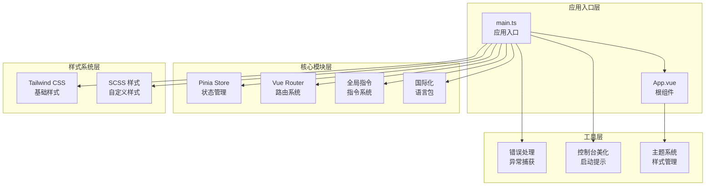
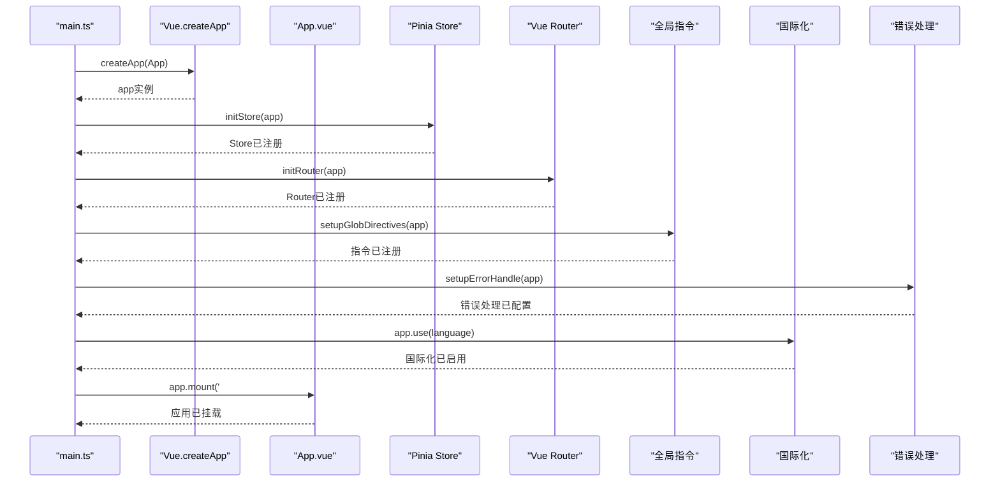
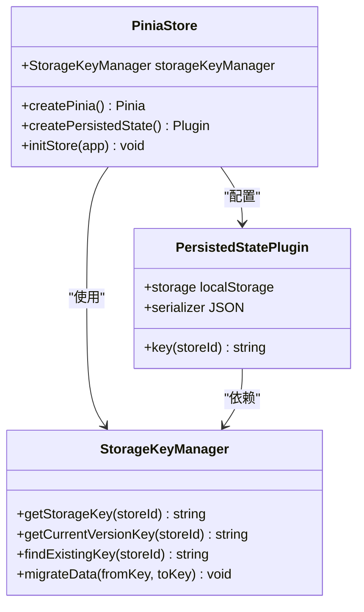
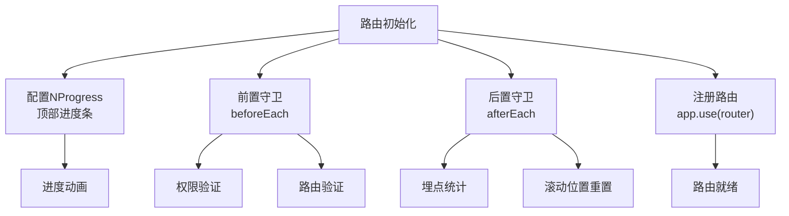
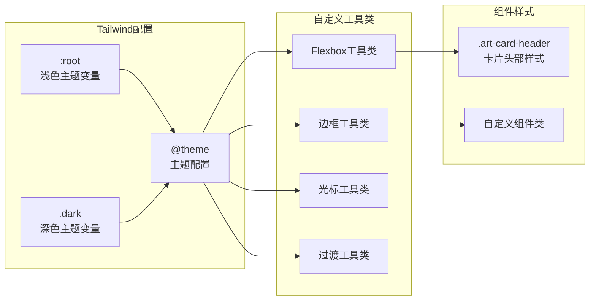
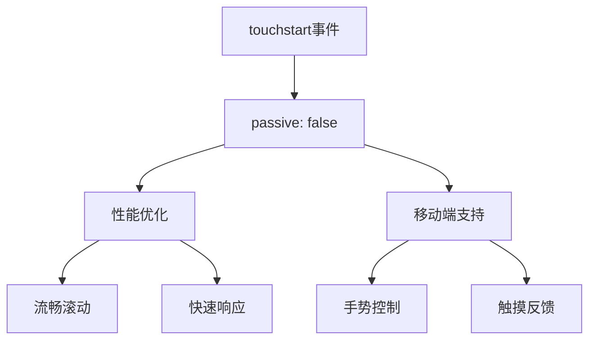
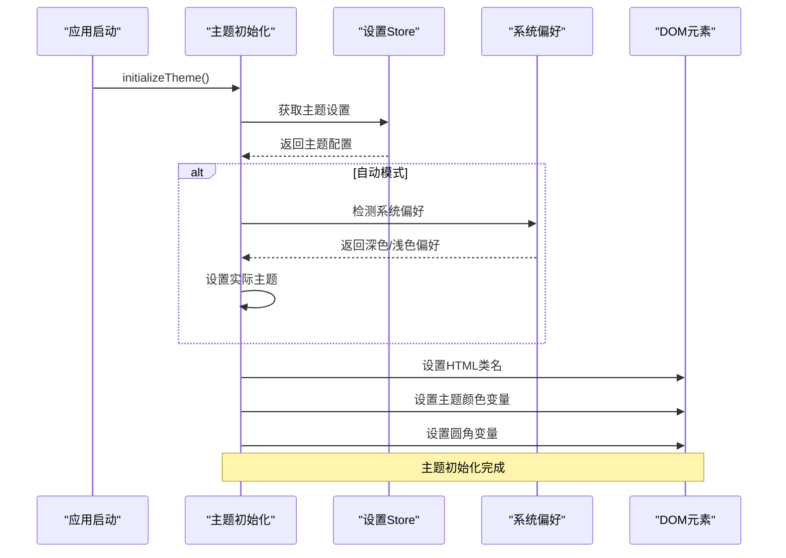
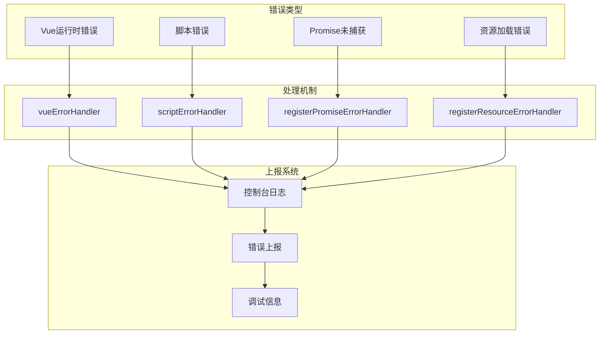
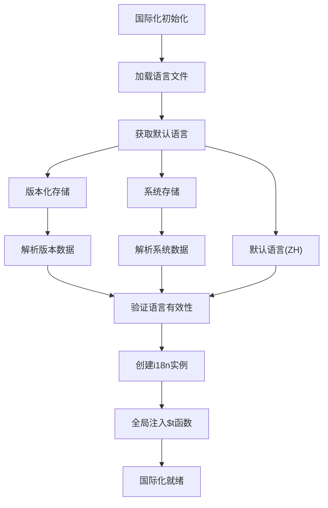
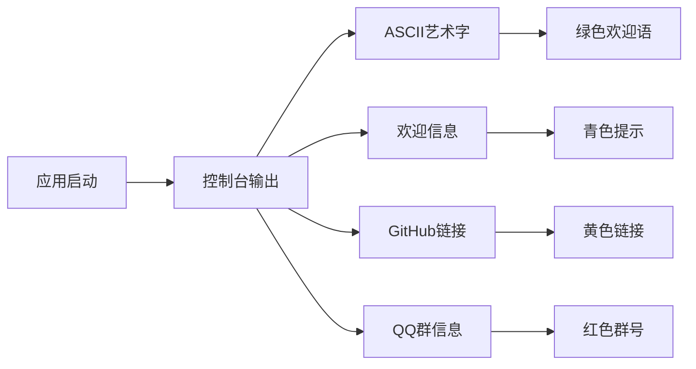

# 应用入口

<cite>
**本文档中引用的文件**
- [main.ts](file://src/main.ts)
- [App.vue](file://src/App.vue)
- [store/index.ts](file://src/store/index.ts)
- [router/index.ts](file://src/router/index.ts)
- [directives/index.ts](file://src/directives/index.ts)
- [utils/sys/error-handle.ts](file://src/utils/sys/error-handle.ts)
- [locales/index.ts](file://src/locales/index.ts)
- [assets/styles/index.scss](file://src/assets/styles/index.scss)
- [assets/styles/core/tailwind.css](file://src/assets/styles/core/tailwind.css)
- [utils/sys/console.ts](file://src/utils/sys/console.ts)
- [hooks/core/useTheme.ts](file://src/hooks/core/useTheme.ts)
- [utils/storage/storage-key-manager.ts](file://src/utils/storage/storage-key-manager.ts)
- [package.json](file://package.json)
</cite>

## 目录
1. [简介](#简介)
2. [项目结构概览](#项目结构概览)
3. [应用初始化流程](#应用初始化流程)
4. [核心模块集成](#核心模块集成)
5. [样式系统架构](#样式系统架构)
6. [性能优化机制](#性能优化机制)
7. [错误处理体系](#错误处理体系)
8. [国际化语言包](#国际化语言包)
9. [应用挂载前预处理](#应用挂载前预处理)
10. [总结](#总结)

## 简介

Art Design Pro是一个基于Vue 3和TypeScript构建的企业级前端应用框架，其应用入口文件`main.ts`负责整个应用的初始化和核心模块的集成。本文档将深入分析应用的启动流程，重点阐述各个核心模块的集成机制和性能优化策略。

## 项目结构概览

**图表来源**
- [main.ts](file://src/main.ts#L1-L25)
- [App.vue](file://src/App.vue#L1-L35)

## 应用初始化流程

### createApp调用过程

应用初始化的核心是从Vue的`createApp`函数开始，该函数创建了一个Vue应用实例：

**图表来源**
- [main.ts](file://src/main.ts#L18-L25)
- [store/index.ts](file://src/store/index.ts#L50-L52)
- [router/index.ts](file://src/router/index.ts#L15-L19)

### 插件加载顺序的重要性

应用初始化严格遵循特定的加载顺序，这一顺序对系统的稳定性和性能至关重要：

1. **样式文件优先加载** - 确保UI组件的基础样式在应用启动前就绪
2. **状态管理先于路由** - 保证路由守卫能够访问到完整的状态树
3. **指令系统在路由之前** - 确保路由组件能够使用全局指令
4. **错误处理最后配置** - 为整个应用提供统一的错误捕获机制

**章节来源**
- [main.ts](file://src/main.ts#L1-L25)

## 核心模块集成

### Pinia状态管理(initStore)

Pinia状态管理系统通过持久化插件实现数据的跨会话保持：

**图表来源**
- [store/index.ts](file://src/store/index.ts#L25-L53)
- [utils/storage/storage-key-manager.ts](file://src/utils/storage/storage-key-manager.ts#L38-L98)

### Vue Router路由系统(initRouter)

Vue Router提供了完整的路由管理功能，包括导航守卫和进度条：

**图表来源**
- [router/index.ts](file://src/router/index.ts#L15-L20)

### 全局指令(setupGlobDirectives)

全局指令系统提供了丰富的交互功能：

| 指令名称 | 功能描述 | 应用场景 |
|---------|---------|---------|
| auth | 权限指令 | 控制元素显示权限 |
| roles | 角色指令 | 基于角色的条件渲染 |
| highlight | 高亮指令 | 文本高亮显示 |
| ripple | 水波纹指令 | 点击效果动画 |

**章节来源**
- [directives/index.ts](file://src/directives/index.ts#L7-L12)

## 样式系统架构

### Tailwind CSS集成

Tailwind CSS提供了强大的原子化样式系统，支持深色模式和主题变量：

**图表来源**
- [assets/styles/core/tailwind.css](file://src/assets/styles/core/tailwind.css#L1-L209)

### SCSS样式组织

SCSS样式采用模块化组织方式，确保样式的可维护性：

| 文件路径 | 功能描述 | 主要内容 |
|---------|---------|---------|
| reset.scss | 样式重置 | 浏览器默认样式清除 |
| app.scss | 应用全局样式 | 全局布局和基础样式 |
| el-ui.scss | Element Plus样式 | 组件库样式定制 |
| dark.scss | 暗色主题 | 暗色模式样式规则 |
| theme-change.scss | 主题切换 | 过渡动画和效果 |
| theme-animation.scss | 主题动画 | 圆形扩散动画 |

**章节来源**
- [assets/styles/index.scss](file://src/assets/styles/index.scss#L1-L24)

## 性能优化机制

### touchstart事件监听器的被动模式配置

应用在启动时添加了特殊的`touchstart`事件监听器，配置为被动模式：

这种配置对移动端性能具有重要意义：
- **避免阻塞主线程**：被动监听器不会阻止默认行为
- **提升滚动性能**：确保滚动操作的流畅性
- **兼容性考虑**：在需要修改默认行为时提供灵活性

**章节来源**
- [main.ts](file://src/main.ts#L12-L16)

### 主题系统初始化

主题系统在应用启动时进行初始化，确保用户体验的一致性：

**图表来源**
- [hooks/core/useTheme.ts](file://src/hooks/core/useTheme.ts#L129-L175)

## 错误处理体系

### 多层次错误捕获机制

应用建立了完善的错误处理体系，覆盖所有可能的错误场景：

**图表来源**
- [utils/sys/error-handle.ts](file://src/utils/sys/error-handle.ts#L37-L102)

### 错误处理注册流程

错误处理的注册遵循严格的顺序，确保每个错误源都能被正确捕获：

1. **Vue运行时错误** - 通过`app.config.errorHandler`配置
2. **全局脚本错误** - 通过`window.onerror`监听
3. **Promise未捕获错误** - 通过`unhandledrejection`事件监听
4. **静态资源错误** - 通过`error`事件监听资源加载失败

**章节来源**
- [utils/sys/error-handle.ts](file://src/utils/sys/error-handle.ts#L97-L102)

## 国际化语言包

### 语言包注入逻辑

国际化系统支持中文和英文两种语言，具备持久化存储和自动恢复功能：

**图表来源**
- [locales/index.ts](file://src/locales/index.ts#L60-L92)

### 语言设置恢复机制

语言设置的恢复采用了多层次的容错机制：

| 存储位置 | 优先级 | 数据格式 | 恢复策略 |
|---------|-------|---------|---------|
| 版本化存储 | 最高 | sys-v{version}-user | 解析JSON数据提取language字段 |
| 系统存储 | 中等 | system-storage | 降级到系统存储获取 |
| 默认语言 | 最低 | zh | 回退到简体中文 |

**章节来源**
- [locales/index.ts](file://src/locales/index.ts#L58-L92)

## 应用挂载前预处理

### 控制台美化

应用启动时会显示精美的ASCII艺术字，提升开发体验：

**图表来源**
- [utils/sys/console.ts](file://src/utils/sys/console.ts#L2-L13)

### 系统兼容性检查

应用在启动时进行了多项系统兼容性检查：

1. **Node.js版本检查** - 确保最低版本要求
2. **浏览器兼容性** - 检查必要的API支持
3. **存储兼容性检查** - 验证localStorage可用性
4. **主题系统初始化** - 确保主题切换功能正常

**章节来源**
- [App.vue](file://src/App.vue#L12-L14)
- [utils/sys/console.ts](file://src/utils/sys/console.ts#L1-L14)

## 总结

Art Design Pro的应用入口设计体现了现代前端应用的最佳实践：

### 核心优势

1. **模块化架构** - 清晰的职责分离和依赖关系
2. **性能优化** - 积极的性能优化策略和移动端适配
3. **错误处理** - 完善的错误捕获和处理机制
4. **国际化支持** - 灵活的语言切换和持久化
5. **主题系统** - 流畅的主题切换和自定义能力

### 设计理念

- **渐进式加载** - 关键资源优先加载，提升首屏性能
- **容错机制** - 多层次的错误处理和数据恢复
- **用户体验** - 注重细节的交互设计和视觉效果
- **开发友好** - 完善的开发工具和调试支持

通过精心设计的应用入口，Art Design Pro为整个应用奠定了坚实的基础，确保了系统的稳定性、性能和可维护性。